# CTF入门教学：P3：PHP注释、变量与作用域

在本节课中，我们将要学习PHP编程语言中的三个基础概念：注释、变量以及变量的作用域（包括局部变量、全局变量和`static`关键字）。掌握这些知识是理解后续CTF Web题目中PHP代码逻辑的关键。

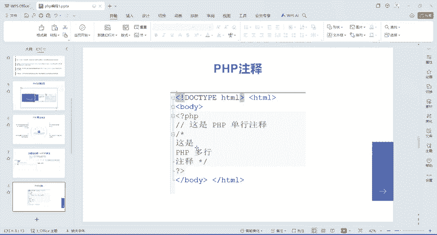

## 📝 PHP注释

注释是写在代码中，用于解释代码功能或临时禁用部分代码的文字，它不会被PHP解释器执行。在团队协作或代码审查时，注释能帮助他人理解你的代码。

PHP支持两种主要的注释方式。

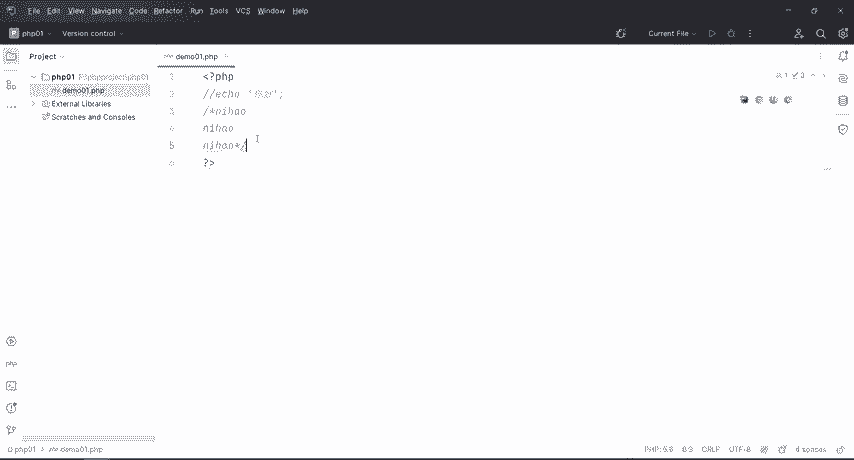

以下是两种注释的写法：

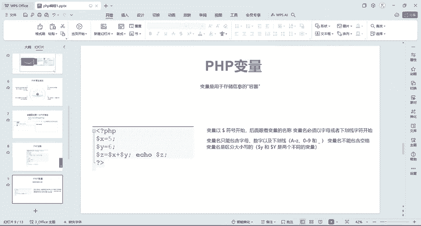

*   **单行注释**：使用两个斜杠 `//`。从 `//` 开始到行尾的内容都会被注释掉。
    ```php
    // 这是一行单行注释，这行代码不会被执行
    echo "Hello World"; // 代码后的注释
    ```
*   **多行注释**：使用 `/*` 开始，`*/` 结束。中间的所有内容都会被注释掉。
    ```php
    /*
    这是一个多行注释。
    可以跨越多行。
    这部分代码都不会执行。
    */
    echo "这段代码会执行";
    ```

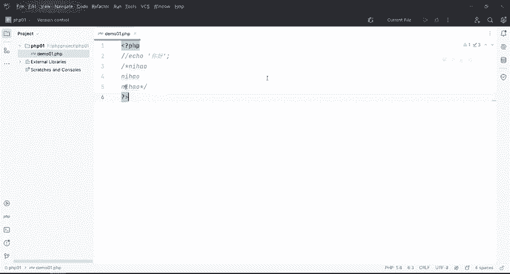

在代码编辑器中，通常可以使用快捷键快速添加注释：`Ctrl + /` 用于单行注释，`Ctrl + Shift + /` 用于多行注释。

---

上一节我们介绍了如何为代码添加说明，本节中我们来看看如何存储和操作数据，这就需要用到变量。

## 📦 PHP变量

变量是用于存储信息的“容器”。你可以把变量想象成一个带标签的盒子，标签是变量名，盒子里装的东西就是变量的值。

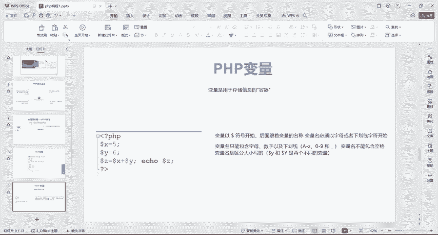

在PHP中，变量以美元符号 `$` 开头，后面跟着变量名，使用等号 `=` 进行赋值。

以下是变量声明与使用的核心规则：

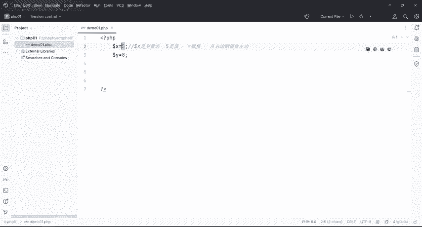

*   **变量声明**：`$variable_name = value;`
    *   `$` 是变量标识符。
    *   `variable_name` 是变量名。
    *   `=` 是赋值运算符，将右边的值赋给左边的变量。
    *   `value` 是要存储的数据。
*   **变量名规则**：
    *   必须以字母或下划线 `_` 开头。
    *   只能包含字母、数字和下划线。
    *   不能包含空格。
    *   区分大小写（例如 `$Name` 和 `$name` 是两个不同的变量）。

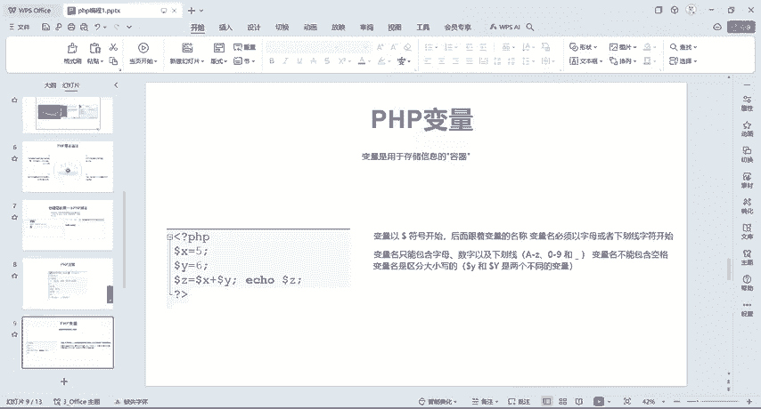

```php
// 声明变量并赋值
$x = 5;      // 将数字5存入变量$x
$y = 10;     // 将数字10存入变量$y
$text = "Hello"; // 将字符串"Hello"存入变量$text

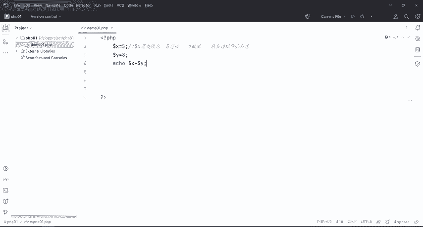

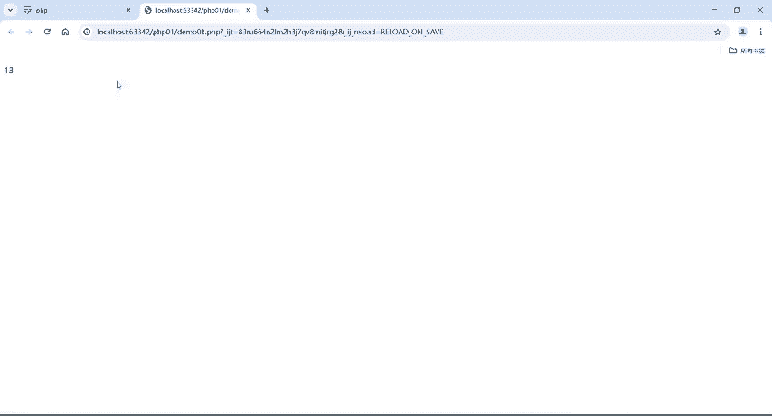

// 使用变量
echo $x + $y; // 输出：15
echo $text;   // 输出：Hello
```

PHP是一种弱类型语言，这意味着在声明变量时无需指定其数据类型（如整数、字符串），PHP会根据赋给它的值自动判断。

---

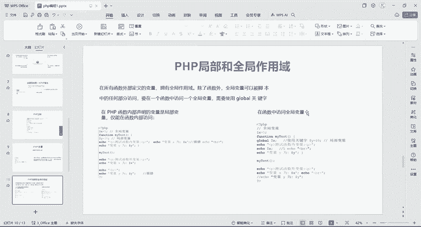

理解了变量的基本用法后，我们需要知道变量在什么范围内有效，这就引出了作用域的概念。

## 🗺️ 变量作用域：局部与全局

变量的作用域指的是变量在代码中可以被访问/使用的范围。PHP中主要有两种作用域：全局作用域和局部作用域。

*   **全局变量**：在所有函数外部定义的变量。它可以在脚本的任何地方（函数外部）被直接访问。
*   **局部变量**：在函数内部定义的变量。它只能在定义它的函数内部被访问。

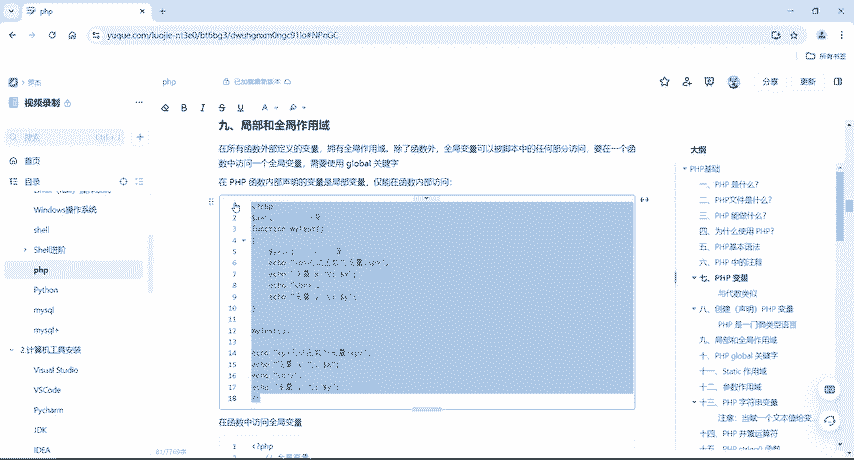

```php
$x = 5; // 全局变量

function myTest() {
    $y = 10; // 局部变量
    echo "函数内测试变量：\n";
    echo "变量 x 是：$x"; // 这里无法访问全局变量 $x，输出为空或警告
    echo "变量 y 是：$y"; // 输出：10
}

myTest();

echo "函数外测试变量：\n";
echo "变量 x 是：$x"; // 输出：5
echo "变量 y 是：$y"; // 这里无法访问局部变量 $y，会报错
```

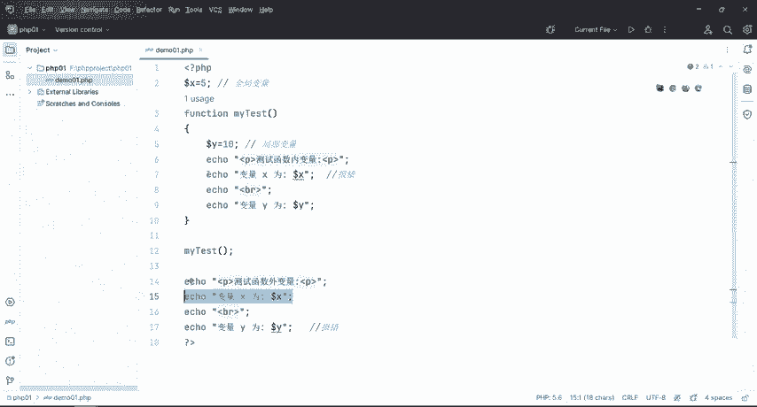

从上面的例子可以看到，在函数内部无法直接访问外部定义的全局变量。如果需要在函数内部访问一个全局变量，需要使用 `global` 关键字。

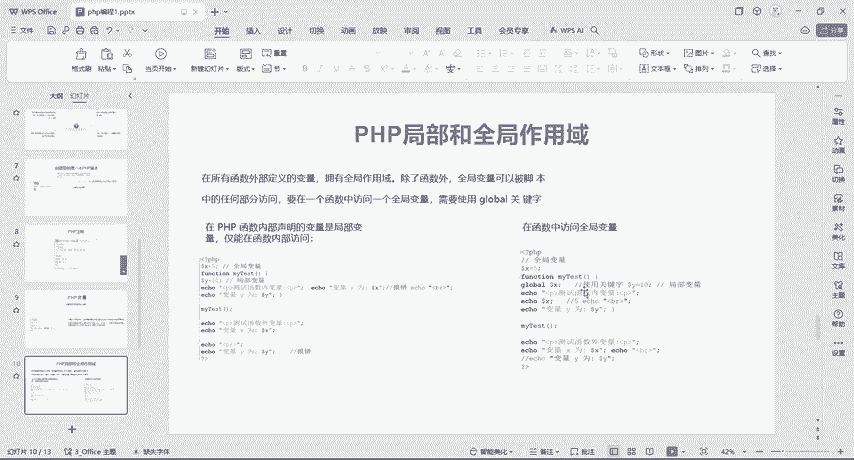

```php
$x = 5;

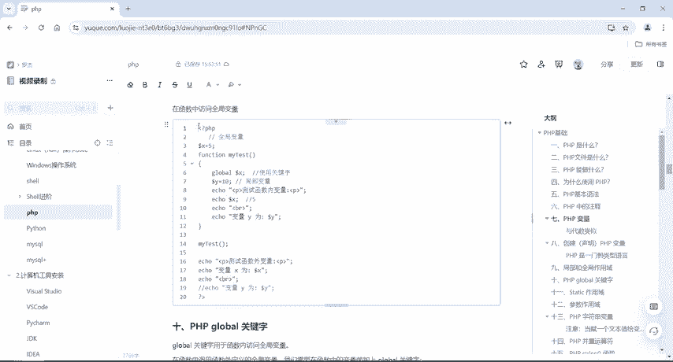

function myTest() {
    global $x; // 使用 global 关键字声明要使用全局变量 $x
    echo "函数内访问全局变量 x：$x"; // 输出：5
}

myTest();
```

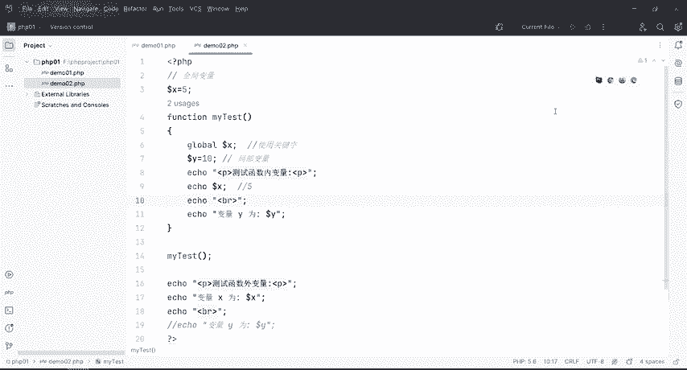

---

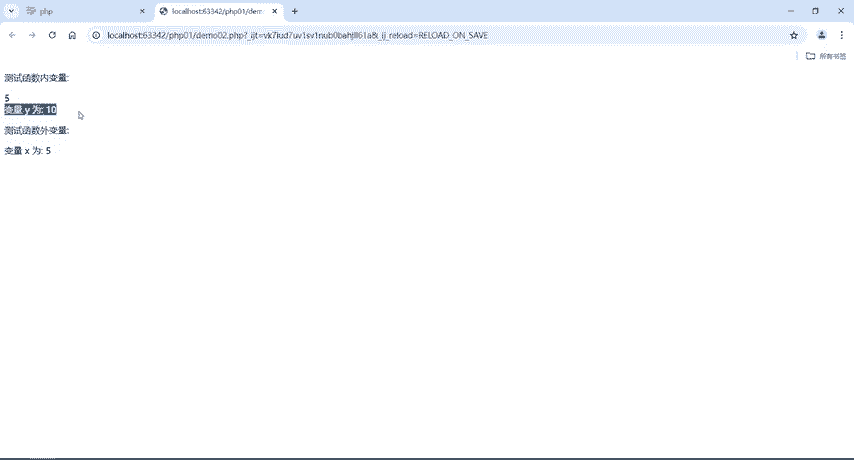

除了 `global` 关键字，还有一个特殊的关键字 `static`，它用于在函数调用之间持久化局部变量的值。

## 🔄 static 关键字

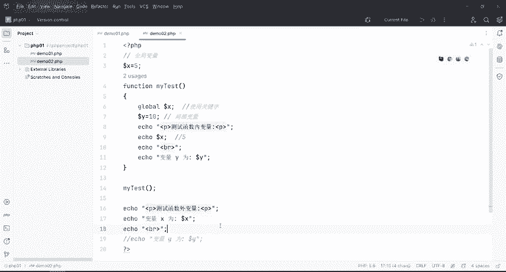

通常，当函数执行完毕后，其内部的局部变量就会被销毁。下次调用该函数时，局部变量会重新初始化。`static` 关键字用于让某个局部变量在函数调用结束后不被删除，保留其当前值。

以下是 `static` 关键字的典型应用场景：

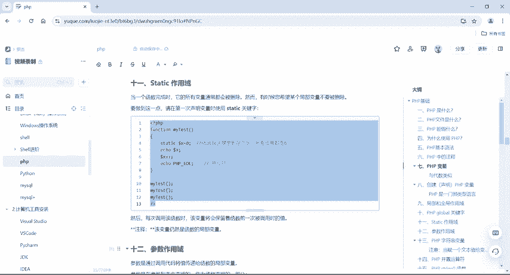

```php
function testStatic() {
    static $count = 0; // 静态变量，只初始化一次
    $count++;
    echo $count . "\n";
}

testStatic(); // 输出：1
testStatic(); // 输出：2
testStatic(); // 输出：3
```

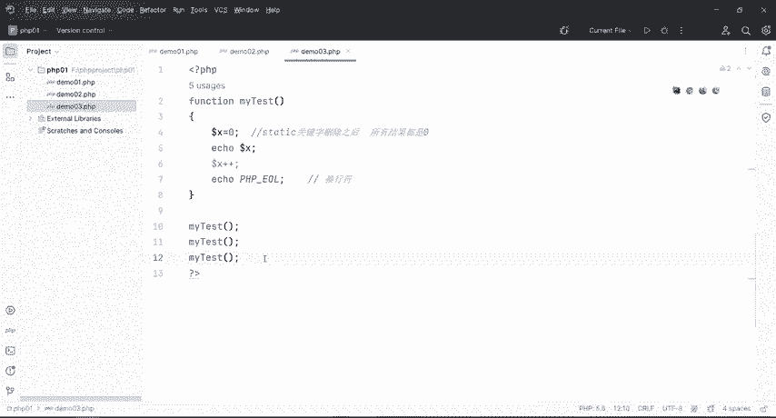

如果不使用 `static` 关键字：

```php
function testNonStatic() {
    $count = 0; // 每次调用都会重新初始化为0
    $count++;
    echo $count . "\n";
}

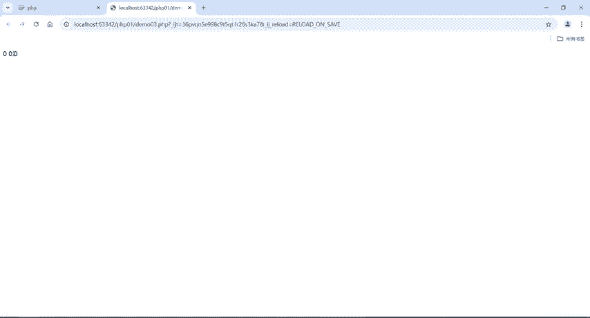

testNonStatic(); // 输出：1
testNonStatic(); // 输出：1
testNonStatic(); // 输出：1
```

**请注意**：即使使用了 `static` 关键字，该变量仍然是函数的局部变量，不能在函数外部被访问。

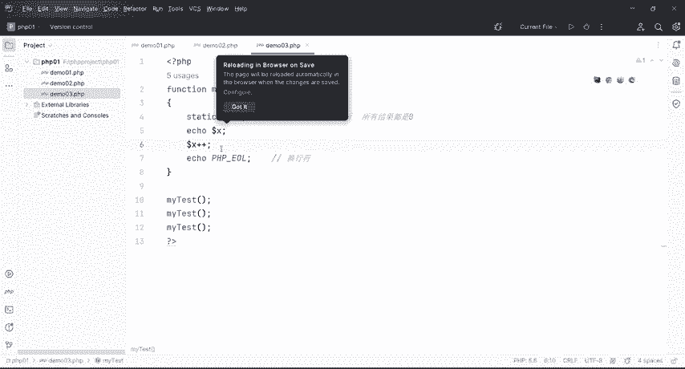

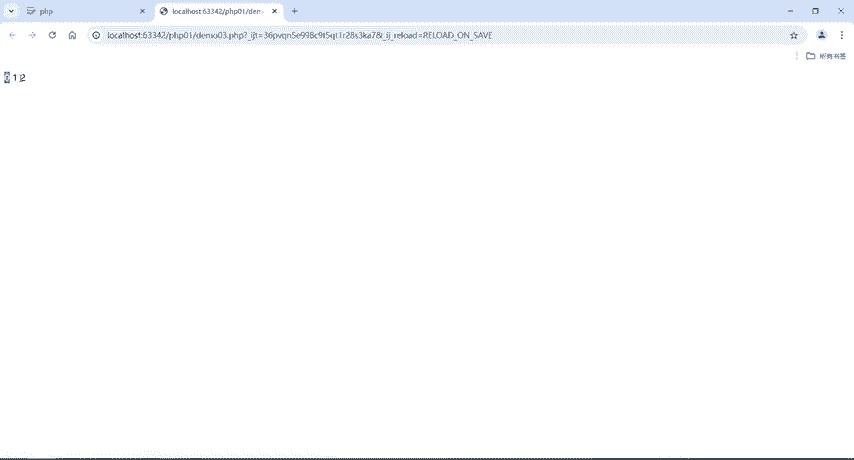

---

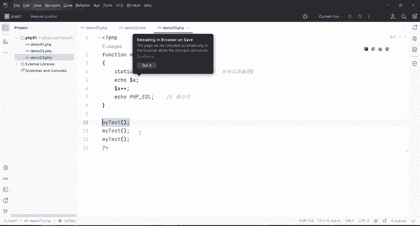

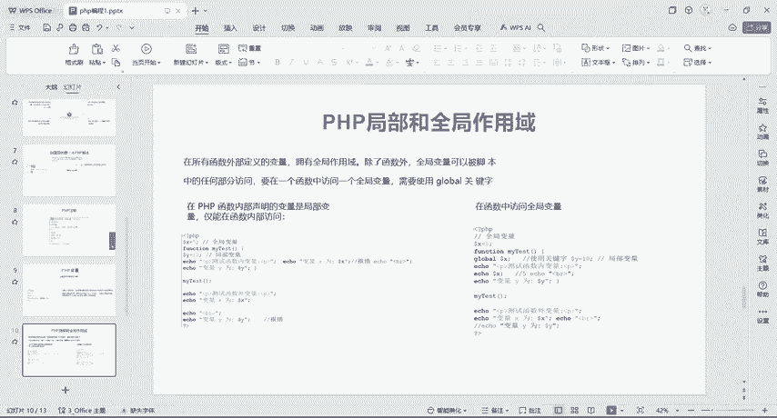

## 🎯 总结

本节课中我们一起学习了PHP的基础构件：
1.  **注释**：使用 `//` 进行单行注释，使用 `/* ... */` 进行多行注释，用于解释代码或临时禁用代码。
2.  **变量**：以 `$` 开头，是存储数据的容器。声明语法为 `$name = value;`，PHP会自动判断变量类型。
3.  **作用域**：
    *   **全局变量**：函数外定义，函数外任意访问。
    *   **局部变量**：函数内定义，仅函数内可访问。
    *   在函数内访问全局变量需使用 `global` 关键字。
4.  **static关键字**：用于在函数调用间保留局部变量的值，使其不被重置。

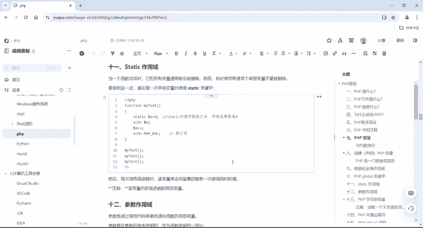

理解变量及其作用域是编写和调试PHP程序的基础，在分析CTF Web题目中的PHP代码时，这些概念将帮助你快速理清程序的数据流和逻辑。