# CTF入门教学：P4：PHP运算符与字符串操作

在本节课中，我们将学习PHP编程中的两个核心概念：运算符和字符串操作。理解这些基础知识对于后续学习Web安全、PHP代码审计以及CTF比赛中的Web题目至关重要。

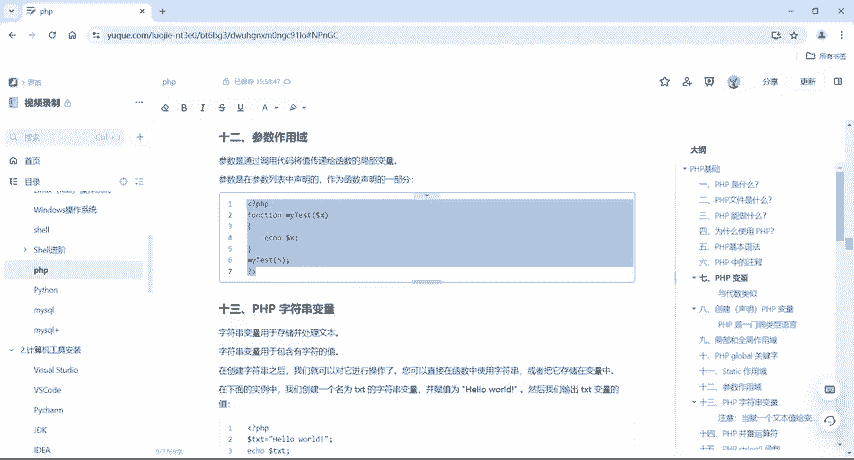

上一节我们介绍了PHP函数的基本概念，本节中我们来看看如何向函数传递参数，以及PHP中处理文本和进行数学运算的各种工具。

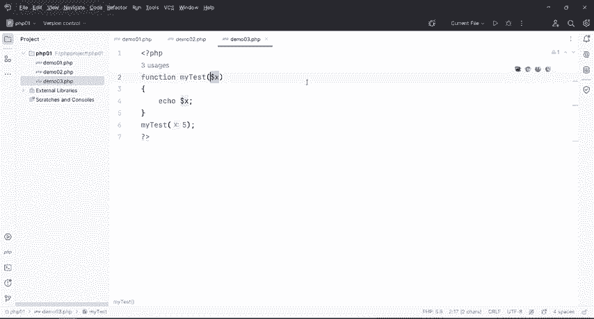

## 函数参数的作用域

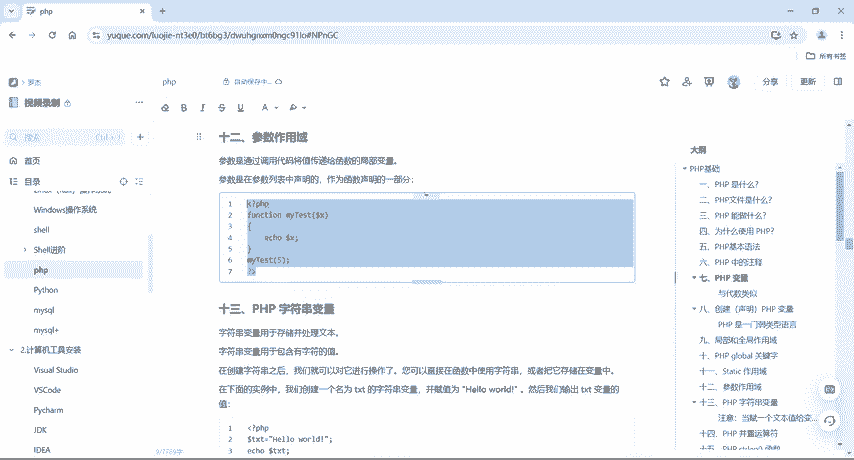

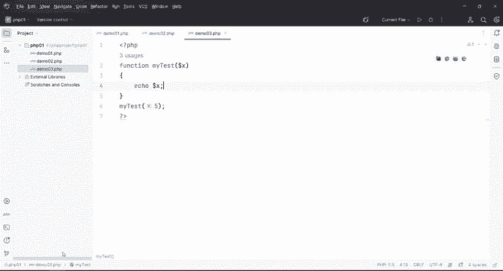

参数是通过代码将值传递给函数的局部变量。参数在函数声明时，于括号内的列表中声明。

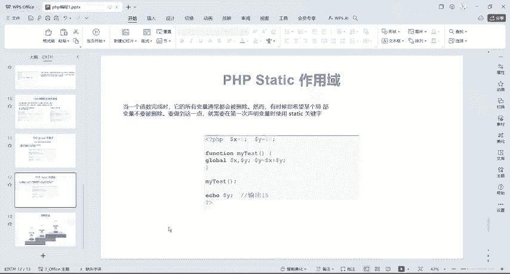

例如，声明一个名为 `myt` 的函数并为其添加一个参数 `$x`：
```php
function myt($x) {
    echo $x;
}
```
当调用这个 `myt` 函数时，必须为其传递一个参数。括号内传递什么值，函数就会输出什么值。这是一个有参函数，与之前介绍的无参函数（括号内为空）不同。

以下是调用示例：
```php
myt(5);       // 输出：5
myt("你好");  // 输出：你好
myt("哈哈哈"); // 输出：哈哈哈
```

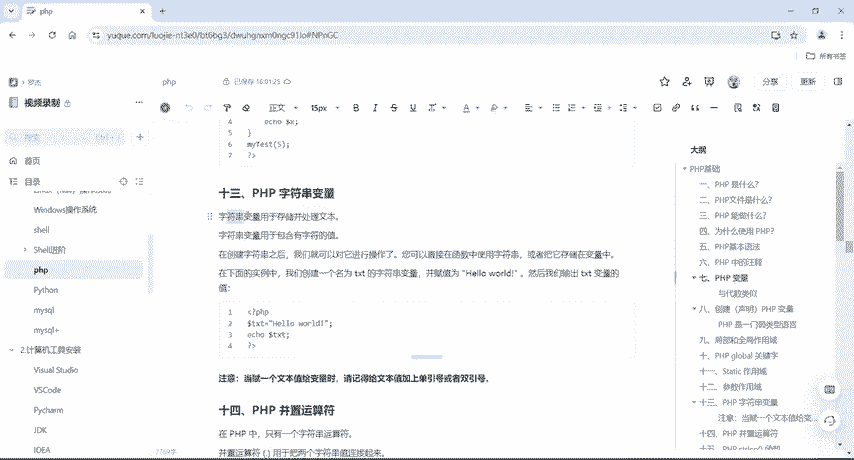

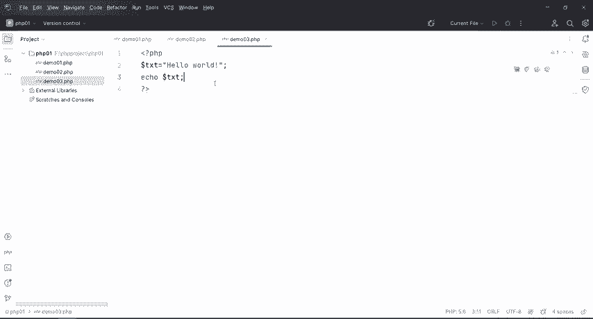

## PHP字符串变量

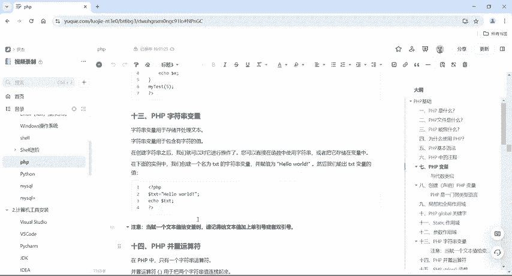

字符串用于存储并处理文本。在PHP中，用单引号或双引号包裹的文本都属于字符串变量。

例如，声明一个字符串变量并输出：
```php
$txt = "Hello World";
echo $txt; // 输出：Hello World
```

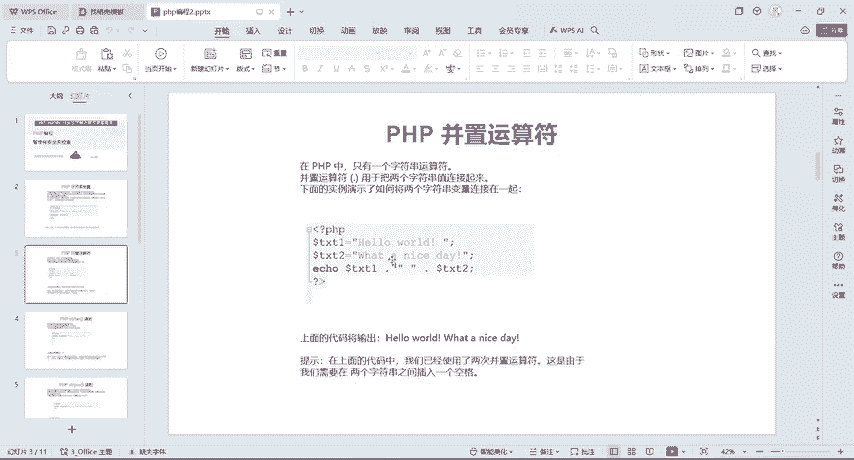

## PHP并置运算符

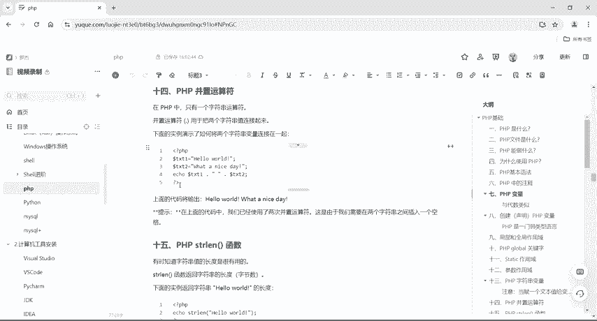

在其他编程语言中，常用加号 `+` 来连接字符串。但在PHP中，连接两个字符串需要使用并置运算符，即点号 `.`。

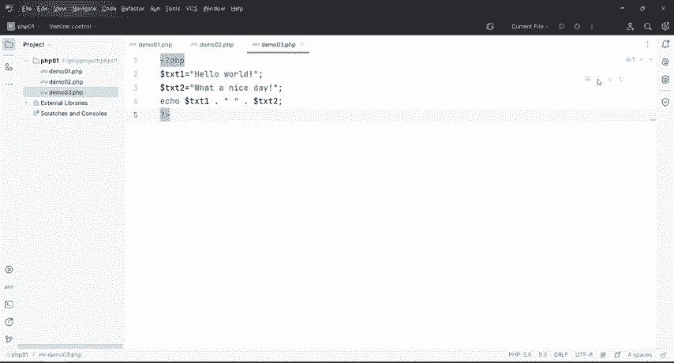

以下代码演示了如何连接两个字符串：
```php
$txt1 = "Hello";
$txt2 = "World";
echo $txt1 . " " . $txt2; // 输出：Hello World
```
点号 `.` 会将 `$txt1`、空格和 `$txt2` 连接成一个完整的字符串。

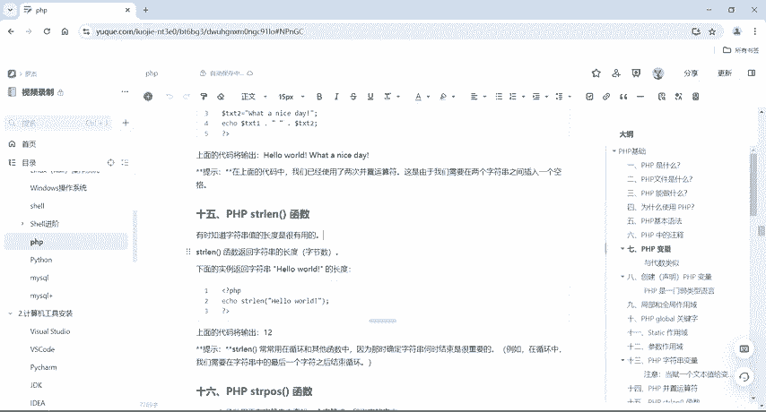

## PHP strlen() 函数

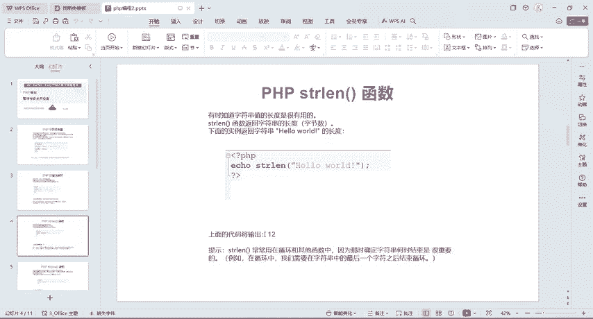

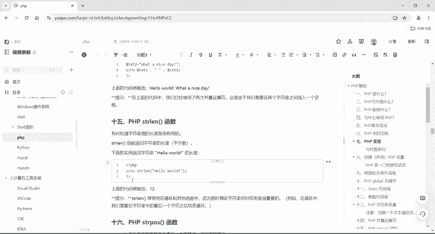

有时需要知道字符串的长度，这时可以使用 `strlen()` 函数。这个函数在循环或其他需要确定字符串何时结束的场景中非常有用。

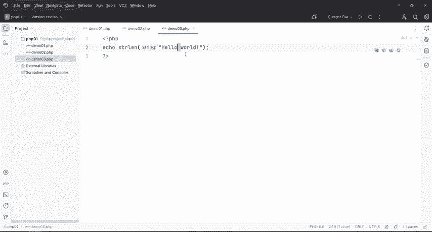

例如，计算 “Hello World” 的长度：
```php
echo strlen("Hello World"); // 输出：12
```
结果是12，因为字符串中的空格也算作一个字符。字符位置从1开始计数：H(1), e(2), l(3), l(4), o(5), 空格(6), W(7), o(8), r(9), l(10), d(11)。

## PHP strpos() 函数

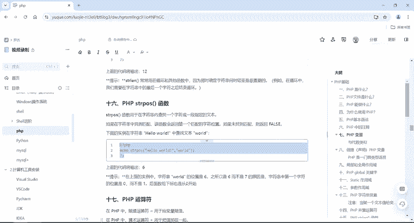

`strpos()` 函数用于在字符串中查找一段指定的文本。如果找到匹配，则返回第一个匹配字符的位置；如果未找到，则返回 `false`。

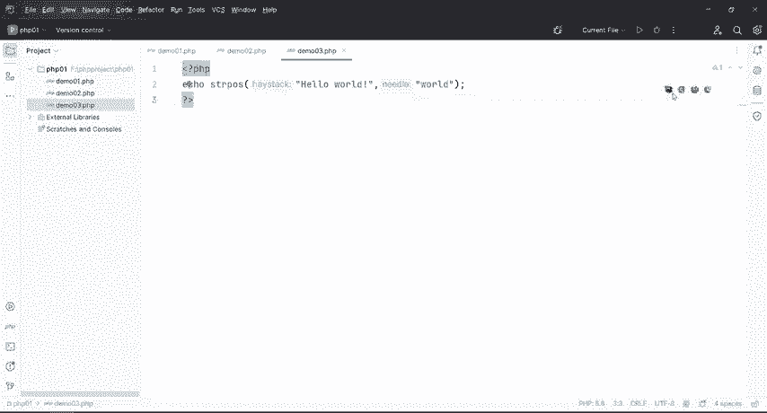

以下代码在 “Hello World” 中查找 “World”：
```php
echo strpos("Hello World", "World"); // 输出：6
```
这里返回的是6，而不是7。**因为字符串中第一个字符的位置是0，而不是1**。所以计算方式是：H(0), e(1), l(2), l(3), o(4), 空格(5), W(6)。因此 “World” 的起始位置是6。

## PHP算术运算符

算术运算符用于执行基本的数学运算。

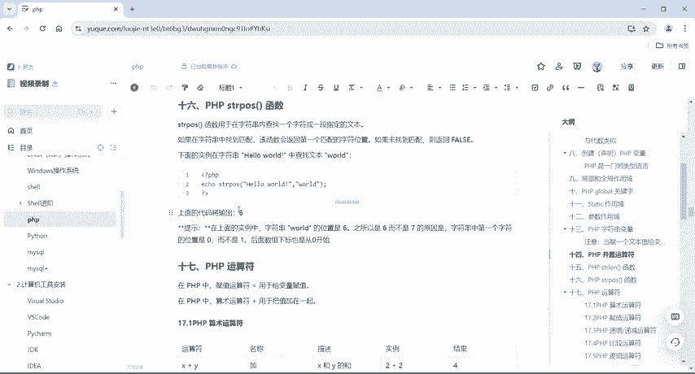

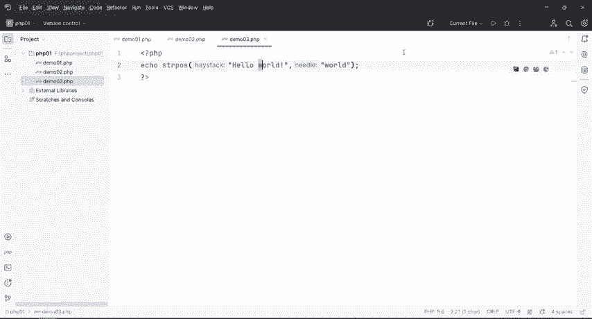

以下是PHP中主要的算术运算符：
*   `$x + $y`：加法和
*   `$x - $y`：减法差
*   `$x * $y`：乘法积
*   `$x / $y`：除法商
*   `$x % $y`：取模（除法余数）
*   `-$x`：取反
*   `$a . $b`：并置（连接两个字符串）

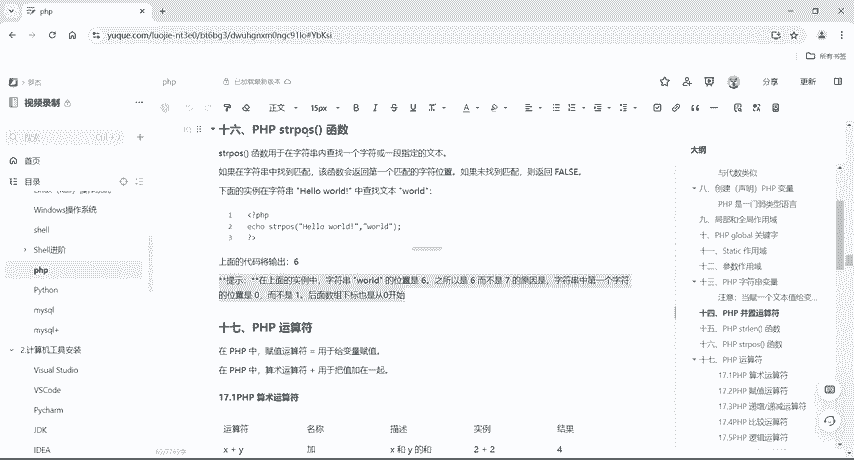

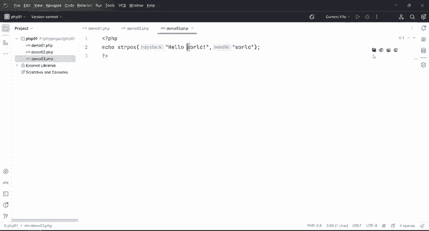

取模运算符 `%` 用于计算除法的余数。例如：
```php
echo 10 % 3; // 输出：1，因为10除以3商3余1
echo 5 % 2;  // 输出：1
echo 10 % 2; // 输出：0
```
PHP 7+ 版本新增了整除运算符 `intdiv()`。

## PHP赋值运算符

最基本的赋值运算符是等号 `=`，它将右侧表达式的值赋给左侧的变量。

PHP还提供了一系列组合赋值运算符，使代码更简洁：
*   `$x += $y` 等价于 `$x = $x + $y`
*   `$x -= $y` 等价于 `$x = $x - $y`
*   `$x *= $y` 等价于 `$x = $x * $y`
*   `$x /= $y` 等价于 `$x = $x / $y`
*   `$x %= $y` 等价于 `$x = $x % $y`
*   `$a .= $b` 等价于 `$a = $a . $b` （连接字符串）

例如：
```php
$a = "Hello";
$a .= " World";
echo $a; // 输出：Hello World
```

## PHP递增/递减运算符

递增 `++` 和递减 `--` 运算符用于将变量的值加1或减1，根据位置不同，行为有差异。

核心规则如下：
*   **`++$x`** （预递增）：先加1，后返回值。
*   **`$x++`** （后递增）：先返回值，后加1。
*   **`--$x`** （预递减）：先减1，后返回值。
*   **`$x--`** （后递减）：先返回值，后减1。

示例：
```php
$x = 10;
echo ++$x; // 输出：11 (先加1，变成11，然后输出)
echo $x;   // 输出：11

$y = 10;
echo $y++; // 输出：10 (先输出10，然后加1)
echo $y;   // 输出：11
```

## PHP比较运算符

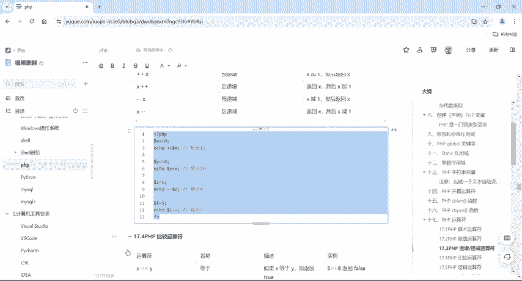

比较运算符用于比较两个值。

以下是常用的比较运算符：
*   `$x == $y`：等于（值相等）
*   `$x === $y`：绝对等于（值相等且类型相同）
*   `$x != $y` 或 `$x <> $y`：不等于
*   `$x !== $y`：不绝对等于（值或类型不同）
*   `$x > $y`：大于
*   `$x < $y`：小于
*   `$x >= $y`：大于等于
*   `$x <= $y`：小于等于

例如：
```php
var_dump(6 == 6);   // bool(true)
var_dump(6 == "6"); // bool(true) 值相等
var_dump(6 === "6");// bool(false) 类型不同
```

## PHP逻辑运算符

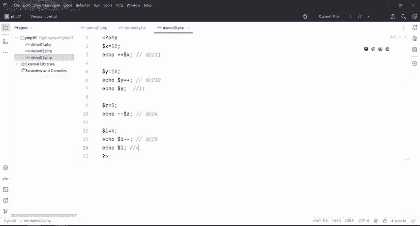

逻辑运算符用于组合条件语句。

以下是主要的逻辑运算符：
*   `and` 或 `&&`：与。两者都为 `true` 时返回 `true`。
*   `or` 或 `||`：或。至少一个为 `true` 时返回 `true`。
*   `xor`：异或。有且仅有一个为 `true` 时返回 `true`。
*   `!`：非。如果为 `true` 则返回 `false`，反之亦然。

示例：
```php
$x = 6;
$y = 3;
var_dump($x < 10 and $y > 1); // bool(true)
var_dump($x == 6 or $y == 5);  // bool(true)
var_dump($x == 6 xor $y == 3); // bool(false)，因为两者都为true
var_dump(!($x == $y));         // bool(true)，因为6==3为false，取反后为true
```

数组运算符等其他运算符将在后续课程中介绍。

---

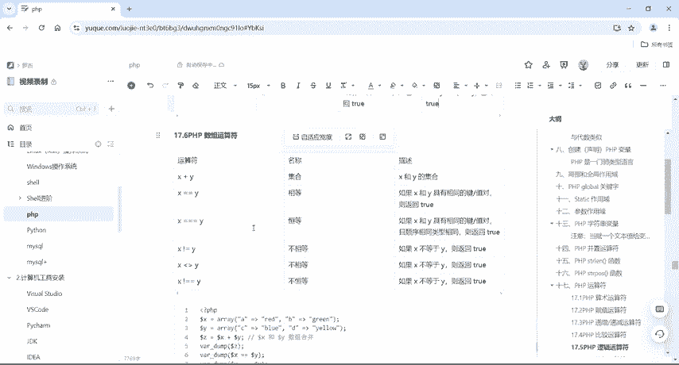

本节课中我们一起学习了PHP中函数参数的传递、字符串的基本操作（定义、连接、获取长度和查找），以及种类丰富的运算符，包括算术运算符、赋值运算符、递增递减运算符、比较运算符和逻辑运算符。掌握这些基础知识是编写PHP程序和进行后续安全分析的关键步骤。