# CTF入门教学：P5：运算符的优先级 🧮

在本节课中，我们将要学习PHP中运算符的优先级。理解运算符的优先级对于编写正确的代码至关重要，它决定了表达式中运算的执行顺序。我们将从数组运算符和三元运算符入手，最后系统地讲解PHP中各类运算符的优先级规则。

上一节我们介绍了逻辑运算符，本节中我们来看看数组运算符和三元运算符。

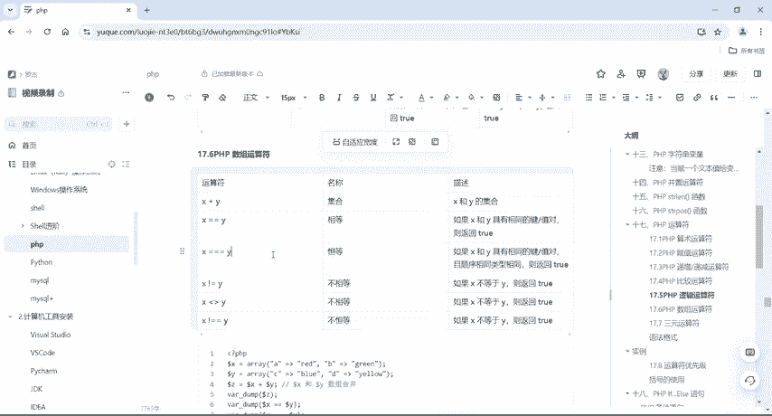

## 数组运算符

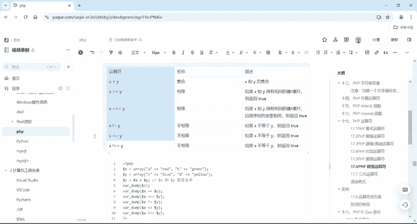

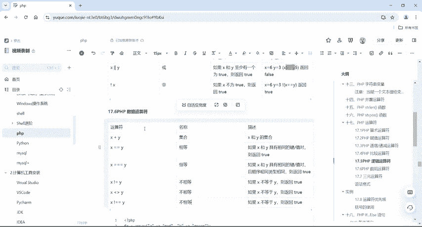

数组运算符用于比较两个数组。

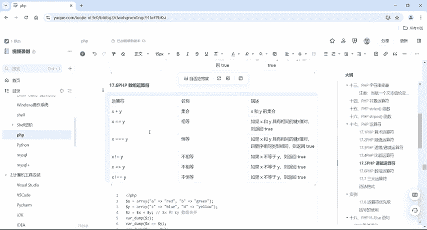

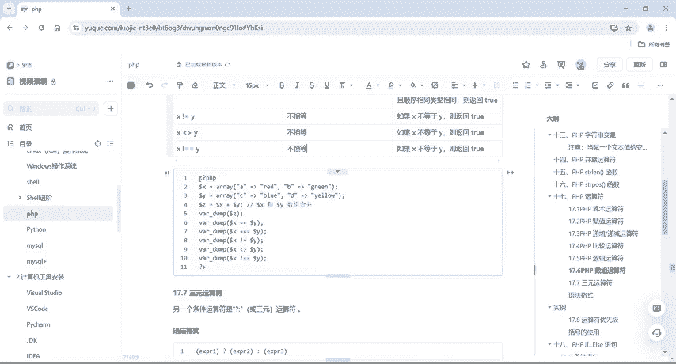

以下是数组运算符的列表：
*   `$x + $y`：**联合**。`$x`和`$y`的联合（不覆盖重复的键）。
*   `$x == $y`：**相等**。如果`$x`和`$y`具有相同的键/值对，则返回`true`。
*   `$x === $y`：**全等**。如果`$x`和`$y`具有相同的键/值对，且顺序相同、类型相同，则返回`true`。
*   `$x != $y`：**不相等**。
*   `$x <> $y`：**不相等**（与`!=`相同）。
*   `$x !== $y`：**不全等**。

在PHP中，数组运算符的使用场景相对较少，了解即可。具体的代码示例可以在课程笔记中找到，大家可以自行运行测试。

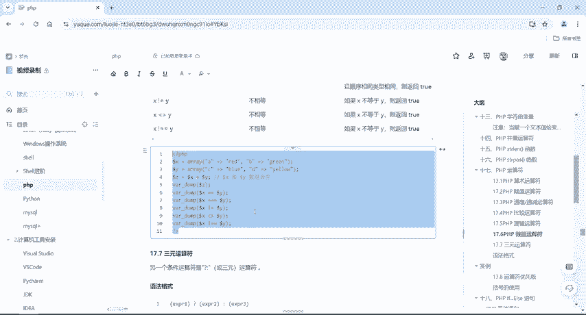

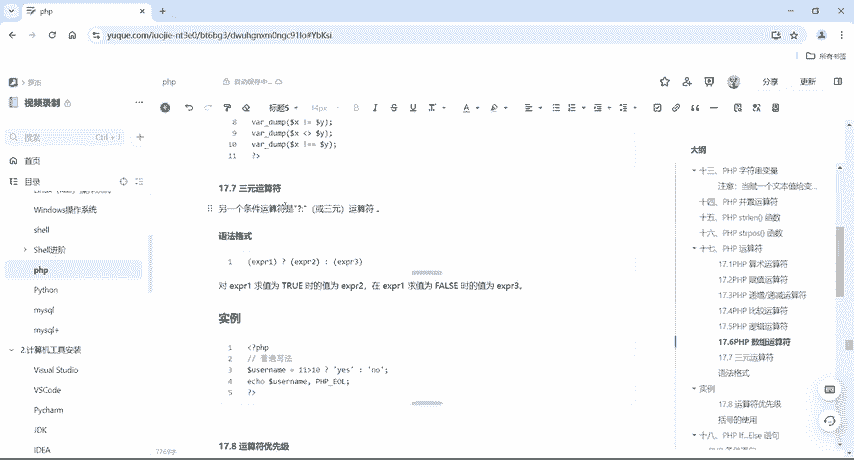

接下来，我们介绍另一个常用的运算符——三元运算符。

## 三元运算符

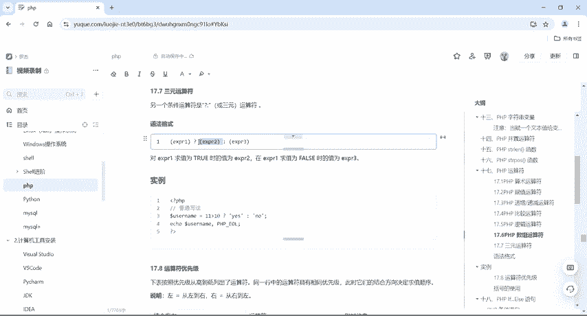

三元运算符是每个编程语言中都存在的条件运算符。

它的语法格式如下：
```php
(expr1) ? (expr2) : (expr3)
```
对第一个表达式`expr1`求值。如果结果为`true`，则值为`expr2`；如果结果为`false`，则值为`expr3`。

我们看一个案例：
```php
$username = (11 > 10) ? ‘yes’ : ‘no’;
echo $username; // 输出：yes
```
这里判断`11 > 10`是否为真。因为结果为真（`true`），所以`$username`的值是`yes`。

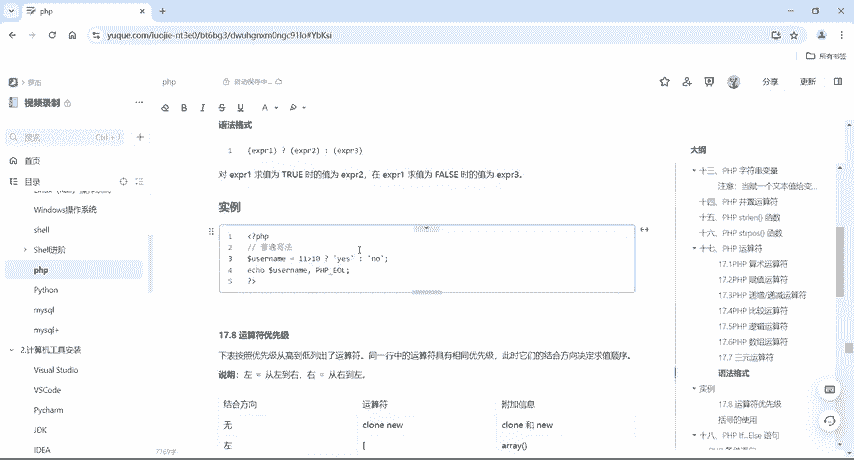

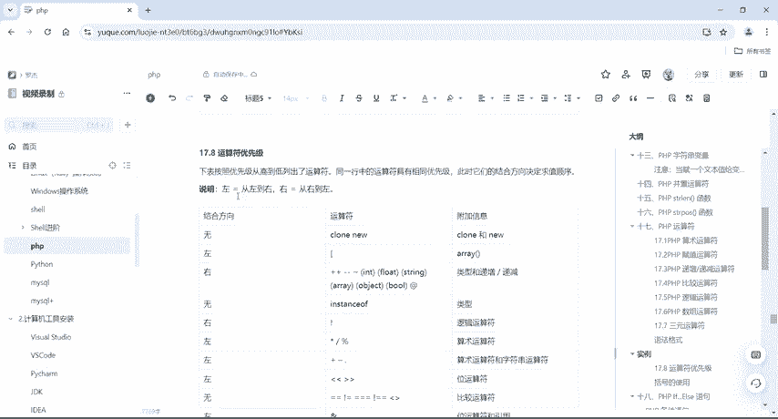

了解了数组和三元运算符后，我们进入本节课的核心内容——运算符的优先级。

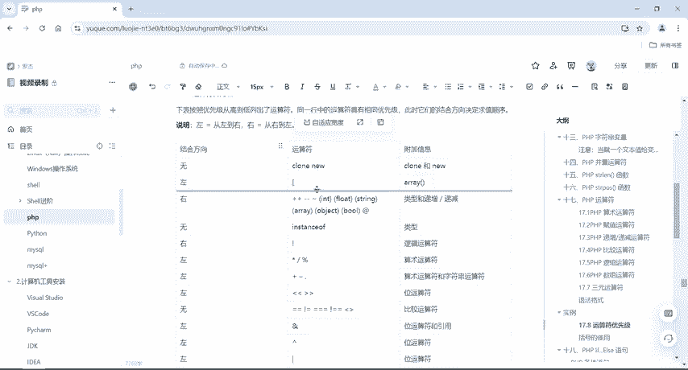

## 运算符优先级 🔝

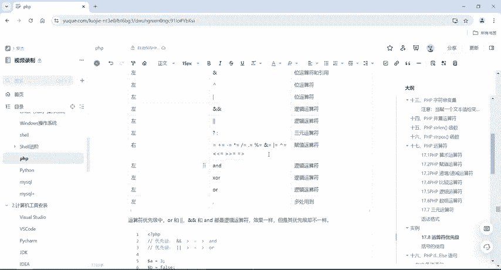

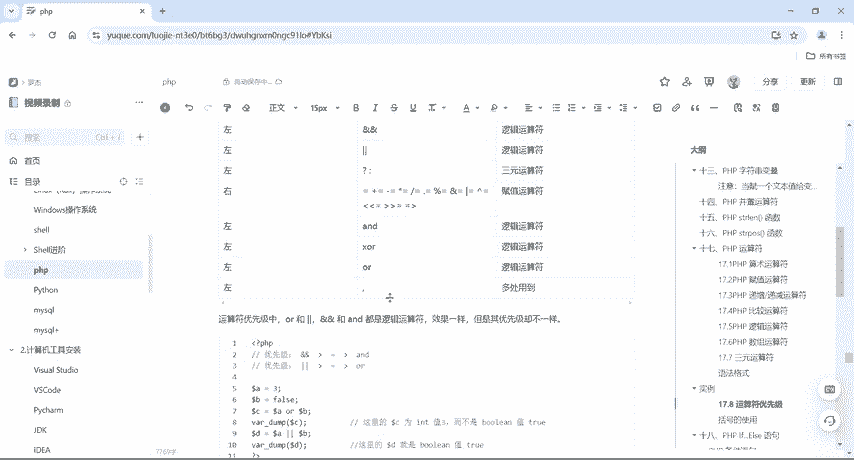

运算符优先级决定了表达式中运算执行的先后顺序，这与数学中的计算规则类似。例如，有括号时先计算括号内的内容，然后进行乘除运算，最后进行加减运算。

PHP运算符的结合方向（从左到右或从右到左）及其优先级如下表所示（优先级从高到低）：

| 结合方向 | 运算符 |
| :--- | :--- |
| 无 | `clone` `new` |
| 左 | `[` |
| 右 | `**` |
| 右 | `++` `--` `~` `(int)` `(float)` `(string)` `(array)` `(object)` `(bool)` `@` |
| 无 | `instanceof` |
| 右 | `!` |
| 左 | `*` `/` `%` |
| 左 | `+` `-` `.` |
| 左 | `<<` `>>` |
| 无 | `<` `<=` `>` `>=` |
| 无 | `==` `!=` `===` `!==` `<>` `<=>` |
| 左 | `&` |
| 左 | `^` |
| 左 | `|` |
| 左 | `&&` |
| 左 | `||` |
| 左 | `??` |
| 左 | `? :` |
| 右 | `=` `+=` `-=` `*=` `**=` `/=` `.=` `%=` `&=` `|=` `^=` `<<=` `>>=` |
| 左 | `and` |
| 左 | `xor` |
| 左 | `or` |

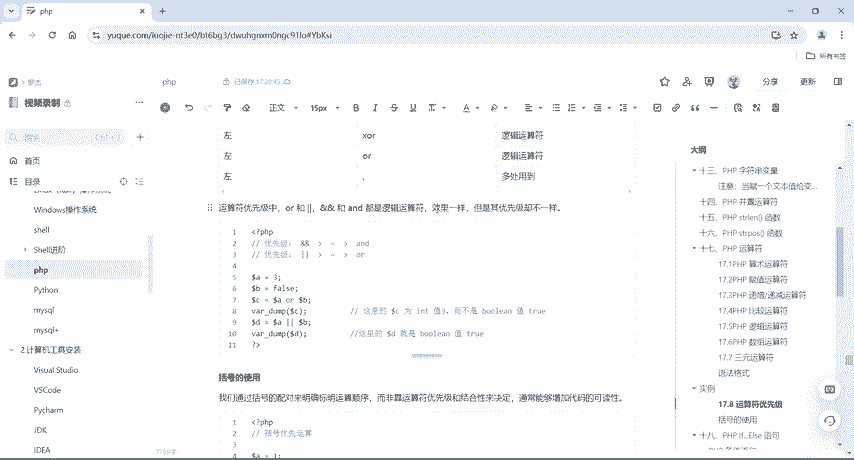

**核心概念**：优先级高的运算符会先被计算。例如，乘除(`*`, `/`)的优先级高于加减(`+`, `-`)。使用括号`()`可以强制改变运算顺序，括号内的表达式总是最先计算。

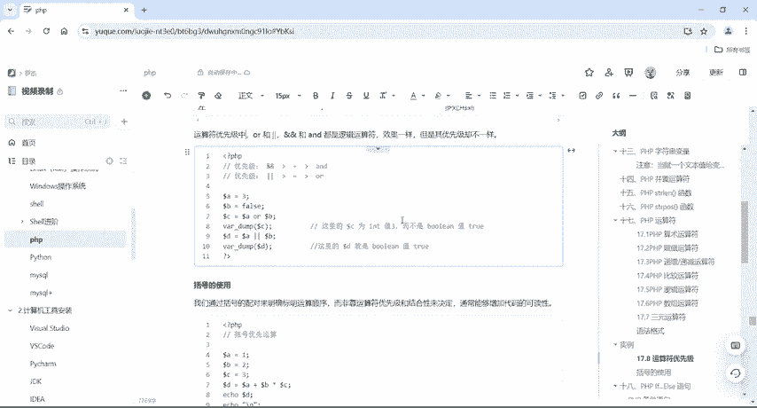

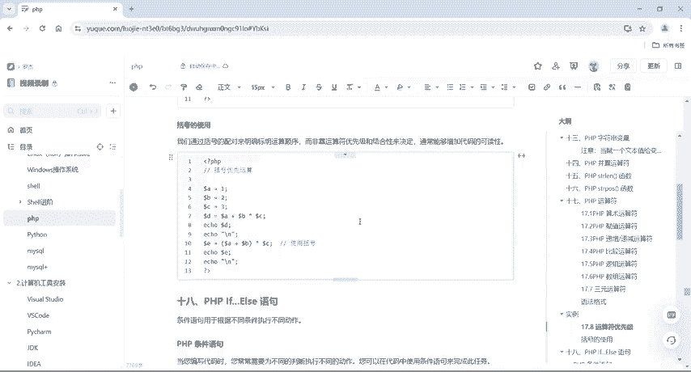

逻辑运算符`&&`（与）和`||`（或）的优先级高于`and`和`or`。这意味着在混合使用时，`&&`和`||`会先被计算。

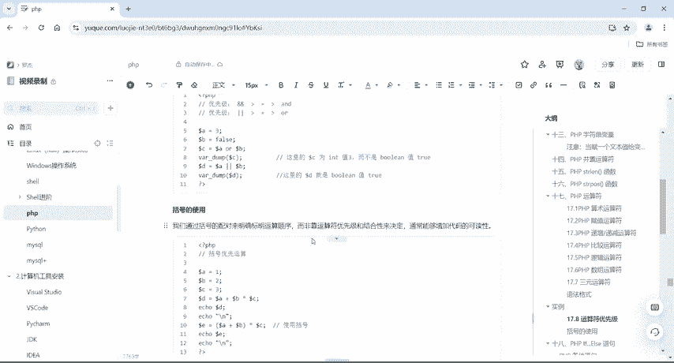

请看以下示例：
```php
// 优先级差异示例
$a = 3;
$b = false;
$c = $a && $b; // $c 是布尔值 false，因为 && 优先级高，先计算 $a && $b
$d = $a and $b; // $d 是整数值 3，因为 = 优先级高于 and，相当于 ($d = $a) and $b
```
因此，了解哪个运算符优先级高、哪个低非常重要。

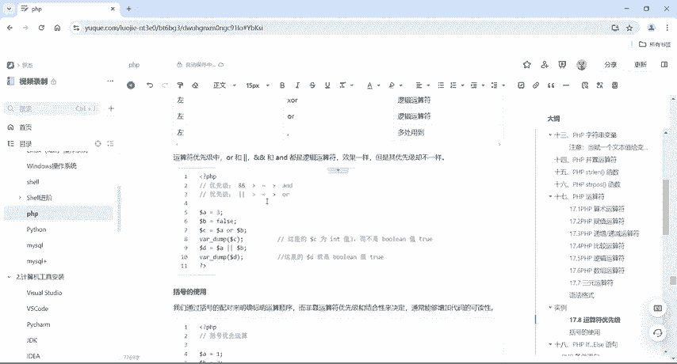

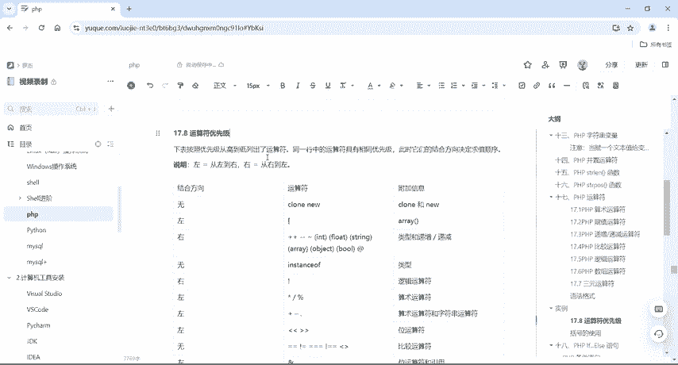

本节课中我们一起学习了PHP的数组运算符、三元运算符以及最重要的运算符优先级规则。掌握这些知识能帮助你准确理解和编写PHP表达式，为后续学习更复杂的CTF Web题目打下坚实基础。