# CTF入门教学：P6：PHP条件语句 🧠

在本节课中，我们将要学习PHP编程语言中的条件语句。条件语句是编程的基础，它允许程序根据不同的条件执行不同的代码块，是实现逻辑判断的核心。

## 概述
条件语句用于根据不同的条件执行不同的动作。PHP提供了多种条件语句结构，包括 `if`、`if...else`、`if...elseif...else` 以及 `switch` 语句。掌握它们对于编写动态和灵活的CTF挑战解题脚本至关重要。

---

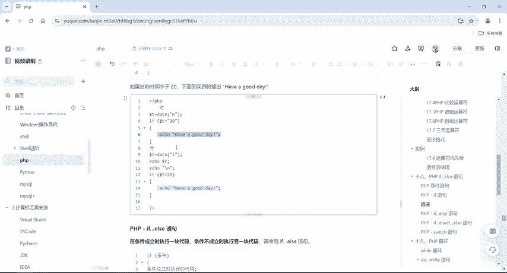

## if语句
`if` 语句用于仅在指定条件成立时执行代码。

其语法结构如下：
```php
if (condition) {
    // 条件成立时要执行的代码
}
```

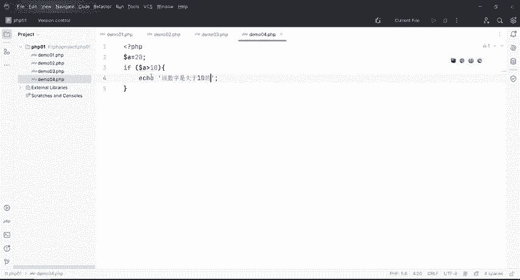

以下是 `if` 语句的一个简单示例。该示例判断当前时间是否小于20点（晚上8点），如果满足条件，则输出一条问候语。

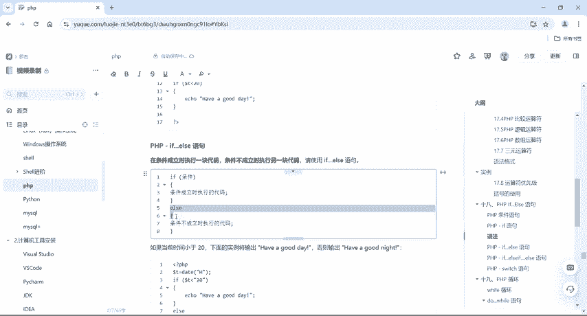

```php
<?php
$t = date("H"); // 获取当前小时数
if ($t < "20") {
    echo "Have a good day!";
}
?>
```
在这个例子中，`date("H")` 函数获取当前时间的小时部分（24小时制）。如果小时数小于20，则条件 `$t < "20"` 成立，程序会执行大括号内的代码，输出 “Have a good day!”。

---

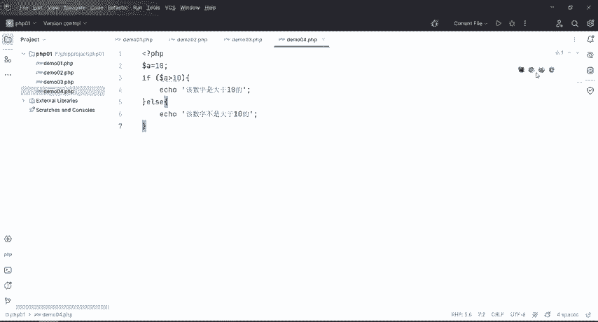

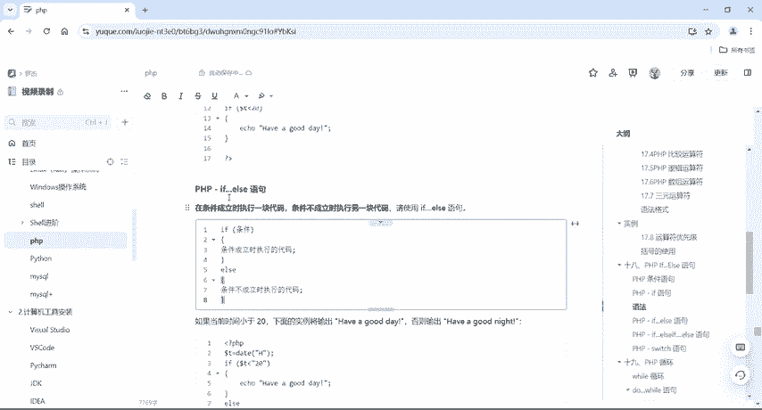

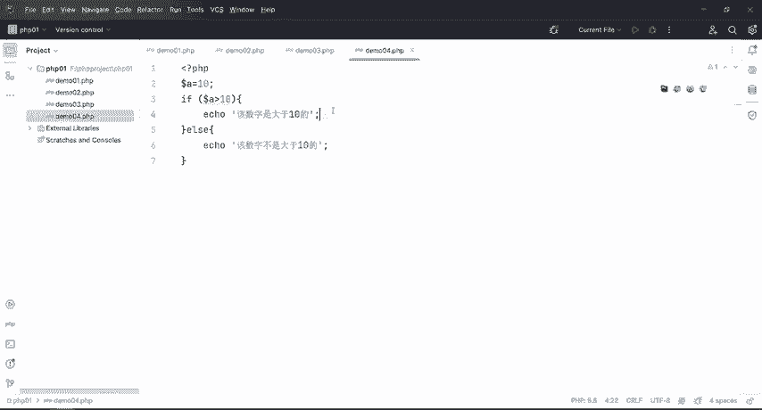

## if...else 语句
上一节我们介绍了基本的 `if` 语句，本节中我们来看看 `if...else` 语句。当需要在条件成立时执行一块代码，条件不成立时执行另一块代码时，就需要使用 `if...else` 语句。

其语法结构如下：
```php
if (condition) {
    // 条件成立时执行的代码
} else {
    // 条件不成立时执行的代码
}
```

以下是一个判断变量值并输出不同结果的示例：

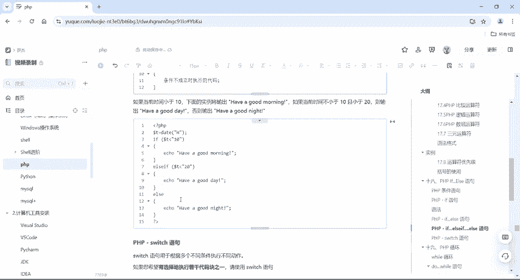

```php
<?php
$a = 10;
if ($a > 10) {
    echo "该数字是大于十的。";
} else {
    echo "该数字不是大于十的。";
}
?>
```
在这个例子中，变量 `$a` 的值为10。条件 `$a > 10` 不成立，因此程序会跳过 `if` 代码块，转而执行 `else` 代码块，输出“该数字不是大于十的。”。

---

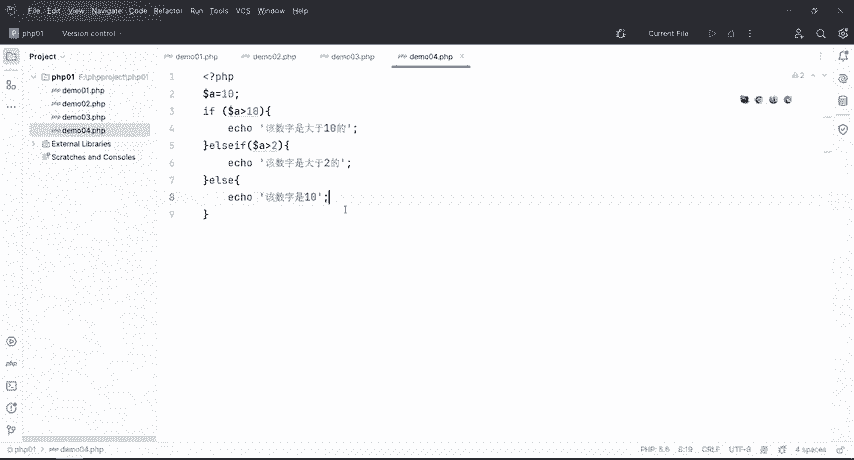

## if...elseif...else 语句
当存在多个条件需要逐一判断时，可以使用 `if...elseif...else` 语句。程序会按顺序检查每个条件，一旦某个条件成立，就执行对应的代码块，并跳过其余部分。

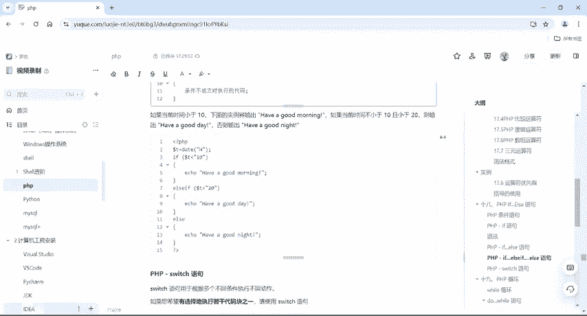

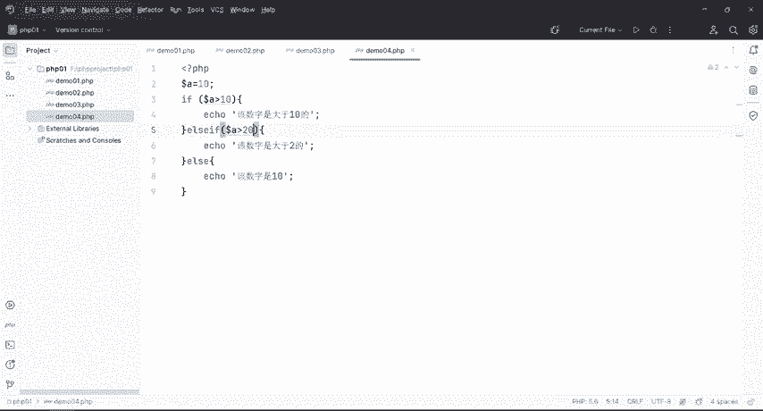

其语法结构如下：
```php
if (condition1) {
    // condition1 成立时执行的代码
} elseif (condition2) {
    // condition2 成立时执行的代码
} else {
    // 所有条件均不成立时执行的代码
}
```

以下是使用多个条件进行判断的示例：

```php
<?php
$a = 10;
if ($a > 10) {
    echo "条件一：该数字大于十。";
} elseif ($a > 2) {
    echo "条件二：该数字大于二。";
} else {
    echo "条件三：该数字是一。";
}
?>
```
程序首先判断 `$a > 10`，不成立；接着判断 `$a > 2`，成立，因此输出“条件二：该数字大于二。”。`elseif` 可以有很多个，为复杂的多分支逻辑提供了解决方案。

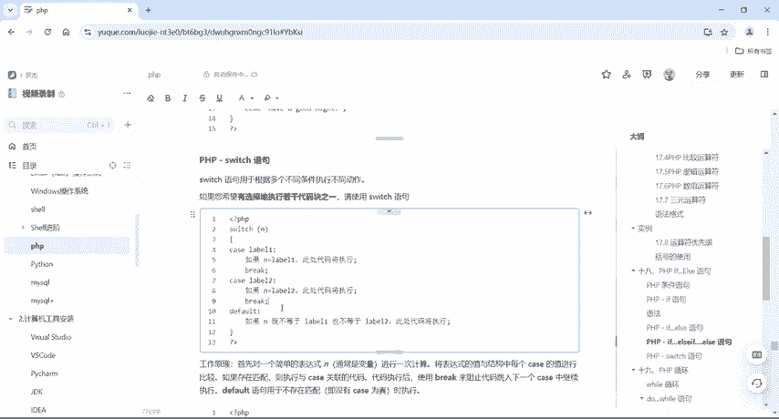

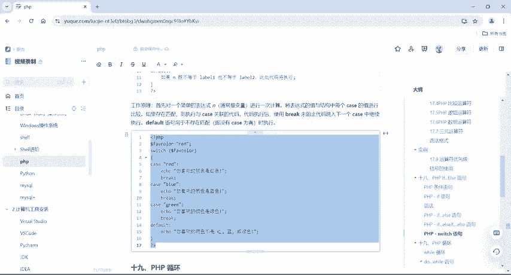

---

## switch 语句
最后，我们来学习 `switch` 语句。`switch` 语句专门用于基于同一个表达式的不同值来执行不同的代码块，它是处理多个确定选项时的优雅方式。

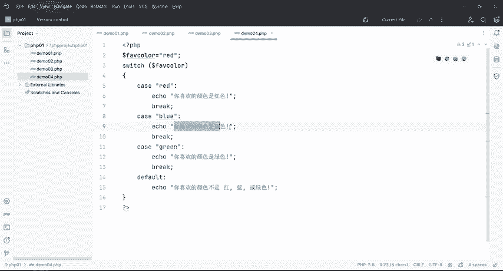

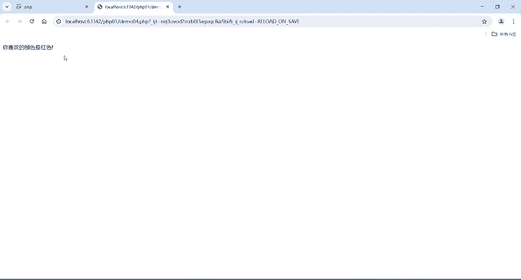

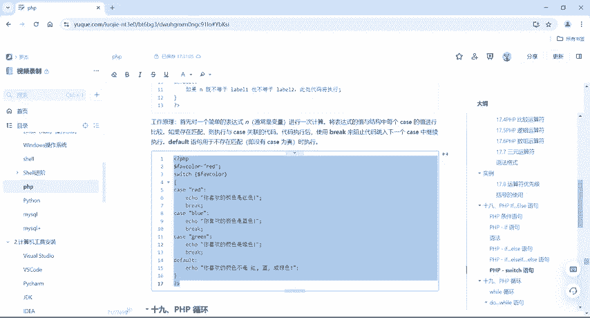

其语法结构如下：
```php
switch (n) {
    case label1:
        // 如果 n == label1，执行这里的代码
        break;
    case label2:
        // 如果 n == label2，执行这里的代码
        break;
    ...
    default:
        // 如果 n 不等于任何 case 的值，执行这里的代码
}
```

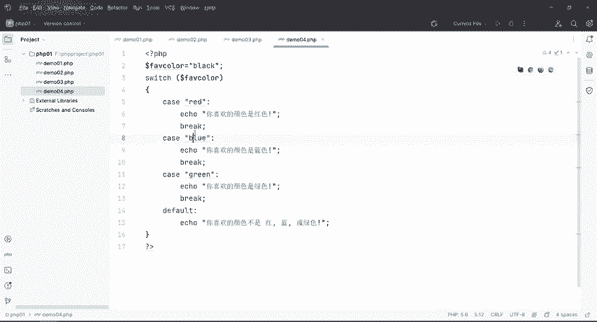

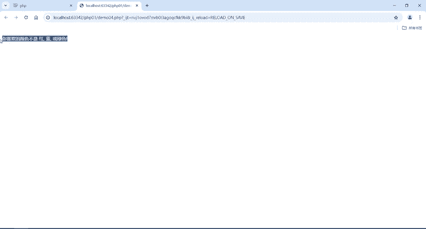

以下是一个根据颜色变量输出不同信息的示例：

```php
<?php
$favcolor = "red";
switch ($favcolor) {
    case "red":
        echo "你喜欢的颜色是红色！";
        break;
    case "blue":
        echo "你喜欢的颜色是蓝色！";
        break;
    case "green":
        echo "你喜欢的颜色是绿色！";
        break;
    default:
        echo "你喜欢的颜色不是红、蓝或绿色。";
}
?>
```
在这个例子中，变量 `$favcolor` 的值为 “red”，因此程序会匹配 `case "red":` 并执行对应的 `echo` 语句。**`break` 关键字至关重要**，它用于阻止代码自动继续执行下一个 `case`。如果省略 `break`，程序会从匹配到的 `case` 开始，一直执行到 `switch` 块结束或遇到 `break` 为止。

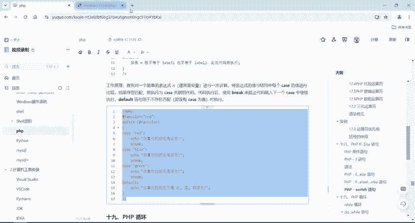

---

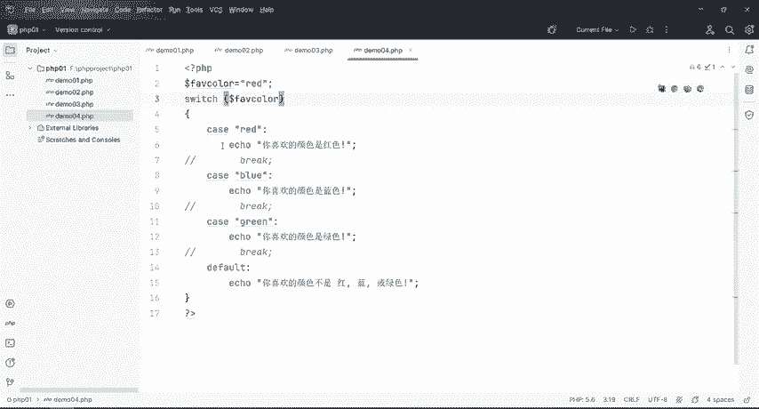

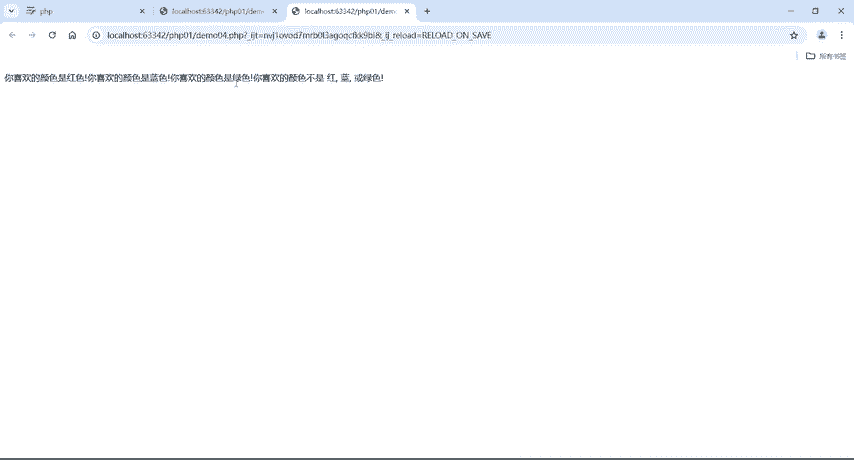

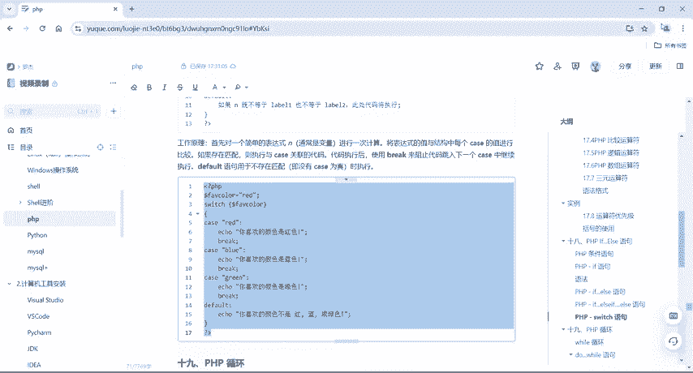

## 总结
本节课中我们一起学习了PHP的四种条件语句：
1.  **`if` 语句**：用于单一条件判断。
2.  **`if...else` 语句**：用于非此即彼的两种情况判断。
3.  **`if...elseif...else` 语句**：用于多个条件的顺序判断。
4.  **`switch` 语句**：用于基于同一个表达式的多个不同值进行分支选择，记得每个 `case` 后要加 `break`。

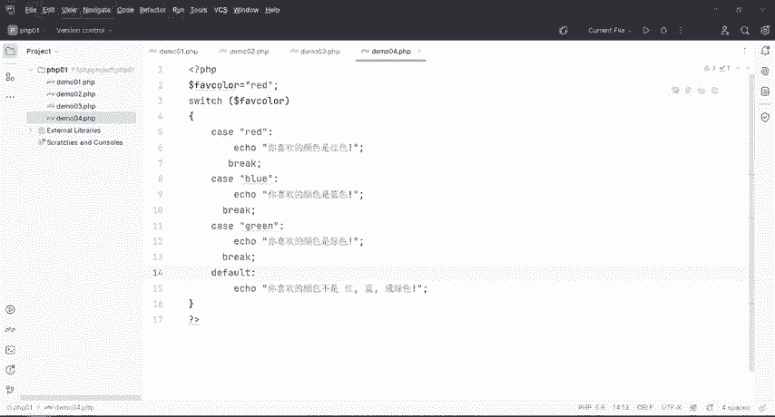

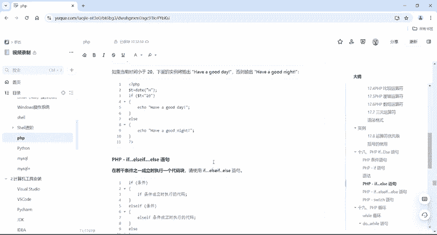

理解并熟练运用这些条件语句，是构建逻辑和解决CTF中Web类挑战的基础。