# CTF入门教学：P7：while循环语句 🔄

在本节课中，我们将要学习PHP编程中的循环语句，特别是`while`循环。循环是编程中用于重复执行相同代码块的重要结构，掌握它对于编写高效的程序至关重要。

## 概述

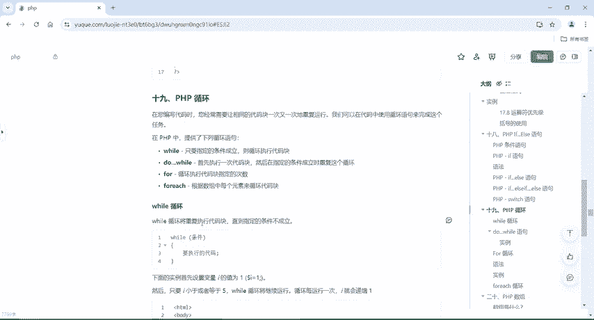

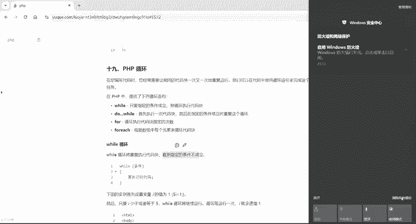

编写代码时，有时需要让相同的代码重复运行多次。这时，我们可以使用循环语句来完成这个任务。PHP提供了多种循环语句，包括`while`循环、`do-while`循环、`for`循环和`foreach`循环。由于数组将在后续课程中详细讲解，本节课我们重点介绍`while`循环。

## while循环的工作原理

`while`循环会重复执行一个代码块，直到指定的条件不再成立。这与`if-else`语句的逻辑相似。在`if-else`语句中，如果`if`的条件不成立，程序会执行`else`部分的代码。而在`while`循环中，只要括号内的条件成立，循环就会持续执行；一旦条件不成立，循环就会停止。

### 核心概念

`while`循环的基本语法结构如下：

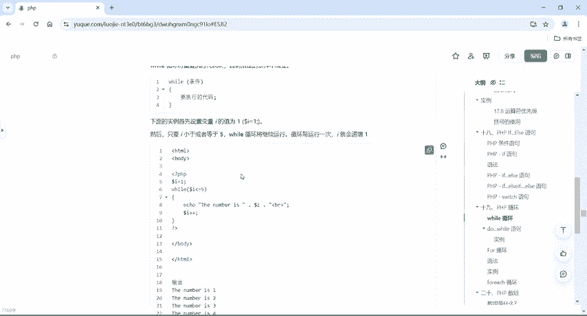

```php
while (条件) {
    // 要重复执行的代码
}
```

## 编写一个while循环案例

为了更好地理解`while`循环，我们将通过一个具体案例来演示。我们的目标是让循环输出数字1到5。

### 步骤说明

以下是实现该目标的具体步骤：

1.  **初始化变量**：首先，我们需要设置一个变量，通常命名为`$i`，并为其赋初始值1。
2.  **设置循环条件**：我们希望当`$i`小于或等于5时，循环继续执行。
3.  **执行循环体**：在循环体内，我们输出当前`$i`的值。
4.  **更新变量**：每次循环结束后，我们需要将`$i`的值增加1，以确保循环最终能够结束。

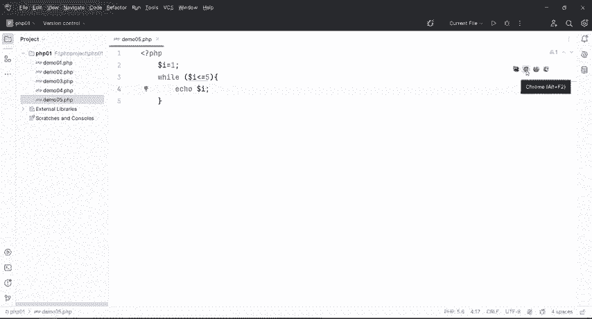

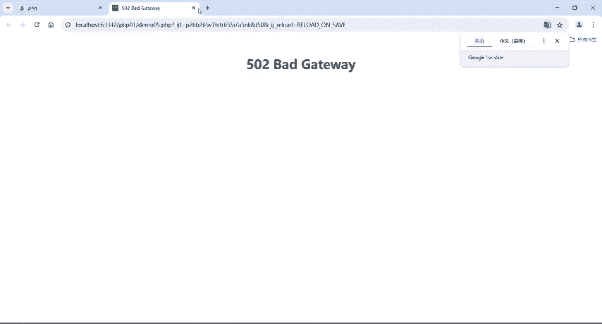

### 代码实现

让我们动手编写代码。首先创建一个新的PHP文件，例如`demo05.php`。

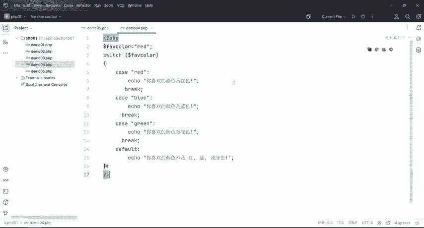

```php
<?php
// 第一步：初始化变量
$i = 1;

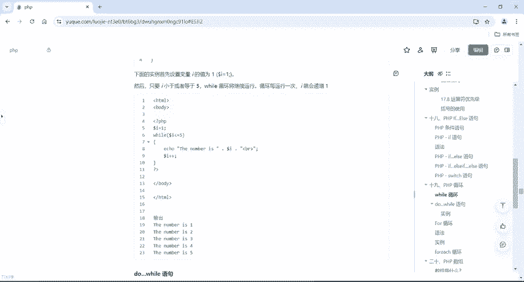

// 第二步：设置while循环条件
while ($i <= 5) {
    // 第三步：执行循环体 - 输出当前$i的值
    echo $i;
    // 第四步：更新变量，使$i递增
    $i++;
}
?>
```

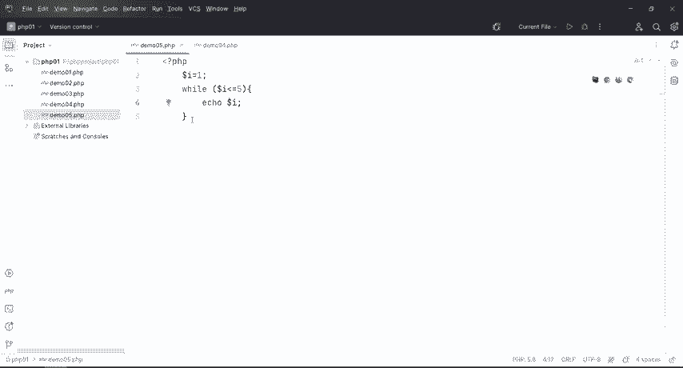

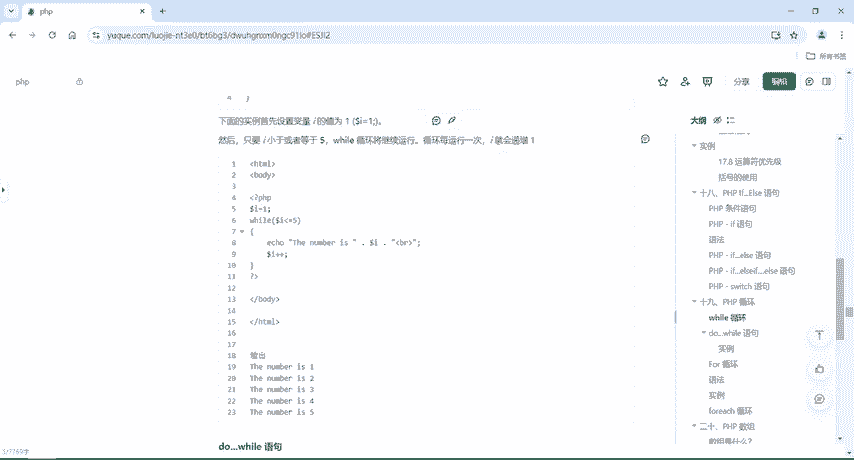

### 代码解析

*   `$i = 1;`：将变量`$i`的初始值设置为1。
*   `while ($i <= 5)`：只要`$i`的值小于或等于5，就继续执行循环。
*   `echo $i;`：在每次循环中，输出`$i`的当前值。
*   `$i++;`：这是关键的一步。它将`$i`的值增加1。如果没有这一步，`$i`将永远是1，导致条件`$i <= 5`永远成立，从而形成一个**死循环**，程序将无法正常终止。

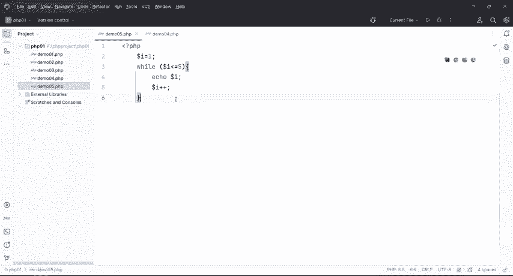

运行这段代码，你将在页面上看到输出结果：`12345`。

## 重要注意事项

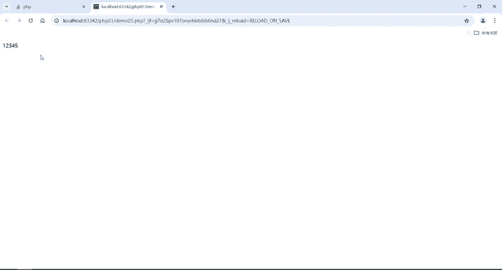

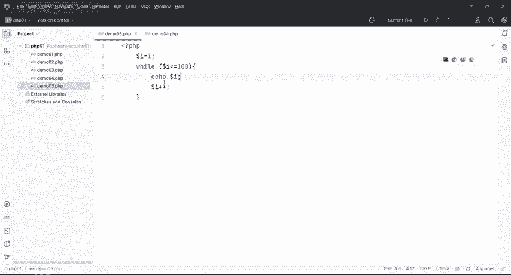

在使用`while`循环时，必须确保循环条件最终会变为不成立，否则会导致死循环。在上面的例子中，`$i++`语句确保了`$i`的值会不断增加，当`$i`变为6时，条件`$i <= 5`不再成立，循环便正常退出。

你可以尝试修改条件，例如将`$i <= 5`改为`$i <= 100`，循环就会输出从1到100的所有数字。

## 总结

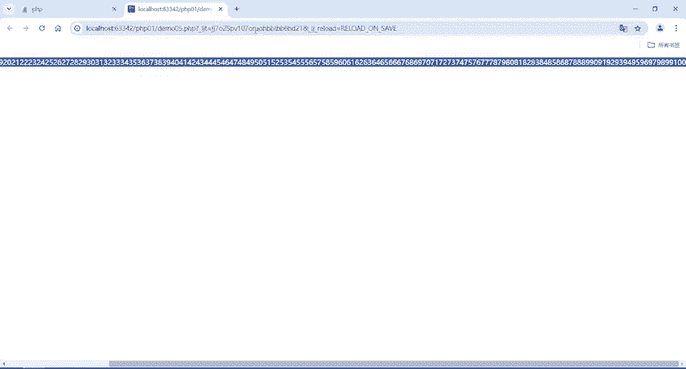

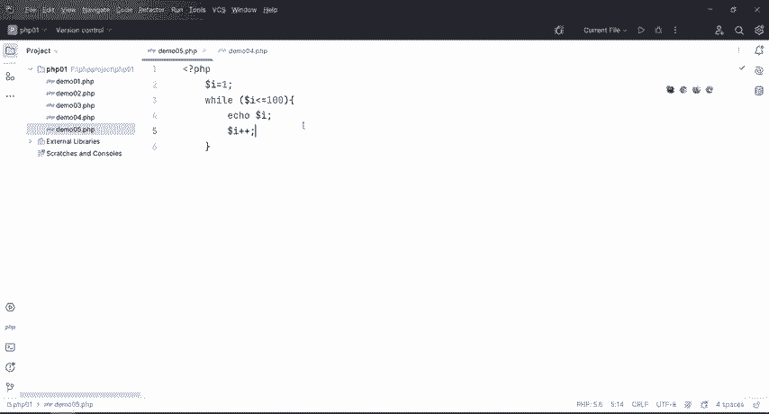

本节课中我们一起学习了PHP的`while`循环语句。我们了解了循环的基本概念，掌握了`while`循环的语法结构，并通过一个从1输出到5的案例实践了如何编写和运行一个`while`循环。记住，循环的核心是**条件判断**和**变量更新**，确保循环能够正常启动和结束，是避免程序错误的关键。