# CTF入门教学：P8：do-while与for循环语句 🔄

在本节课中，我们将要学习PHP中的另外两种循环控制结构：`do-while`循环和`for`循环。我们将通过对比它们与`while`循环的区别，来理解各自的语法、执行流程和适用场景。

## 概述
上一节我们介绍了`while`循环，它是在循环开始前先判断条件。本节中我们来看看`do-while`循环和`for`循环。`do-while`循环的特点是至少会执行一次循环体，而`for`循环则常用于已知循环次数的场景。

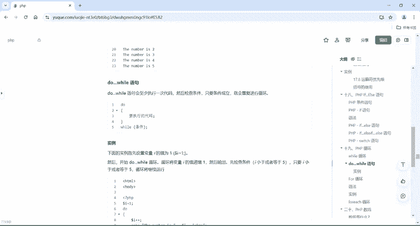

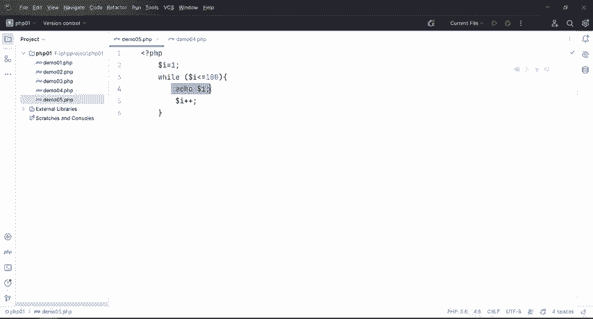

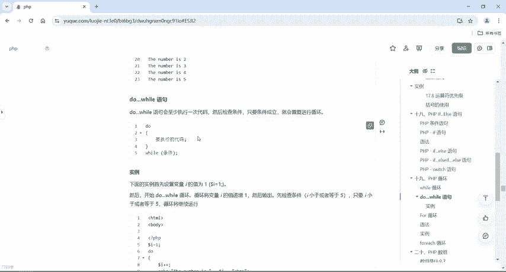

---

## do-while循环语句

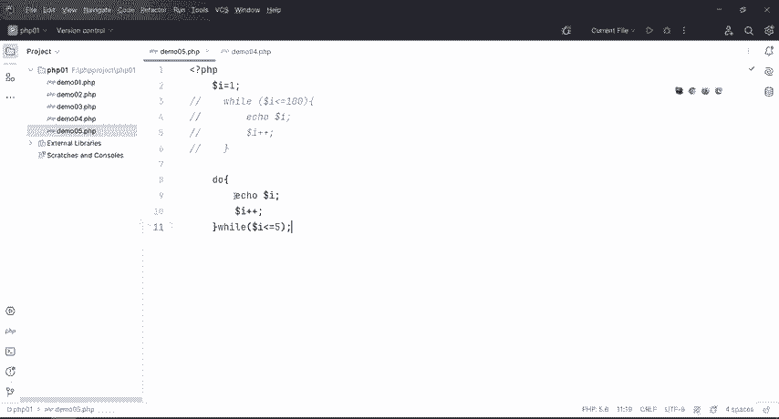

`do-while`循环与`while`循环的关键区别在于执行顺序。`do-while`会**至少执行一次**循环体内的代码，然后再检查条件是否成立。只要条件为真，就会重复执行循环。

其基本语法结构如下：
```php
do {
    // 要执行的代码
} while (条件);
```

以下是`do-while`循环的一个具体示例，我们将用它来实现打印数字1到5的功能：

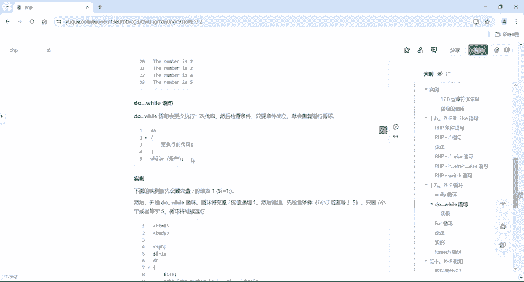

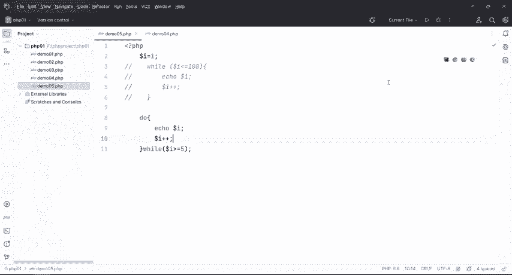

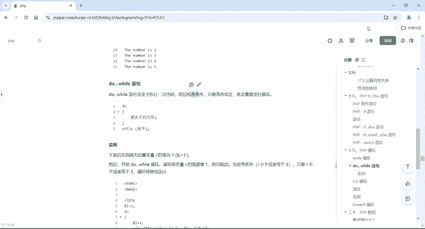

```php
<?php
$a = 1;
do {
    echo $a;
    $a++;
} while ($a <= 5);
?>
```
运行这段代码，会依次输出：`12345`。

为了验证`do-while`“至少执行一次”的特性，我们可以将条件改为初始就不成立的情况：

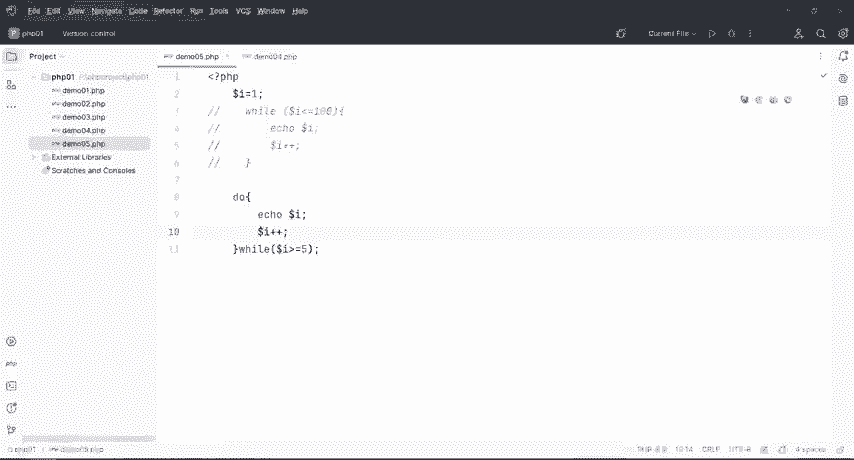

```php
<?php
$a = 1;
do {
    echo $a;
    $a++;
} while ($a >= 5); // 条件初始就不成立
?>
```
即使条件 `$a >= 5` 一开始就不满足，循环体仍然会执行一次，输出数字 `1`。

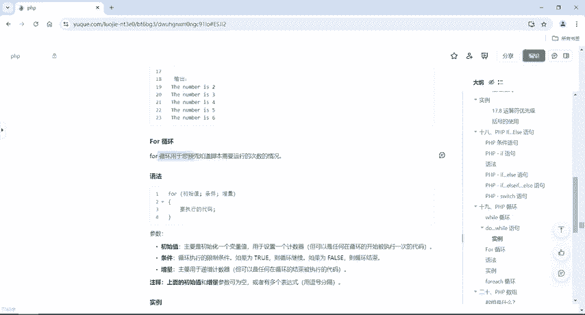

**总结一下**：`while`循环是先判断条件，再决定是否执行；而`do-while`循环是先执行一次代码，再判断条件是否继续循环。

---

## for循环语句

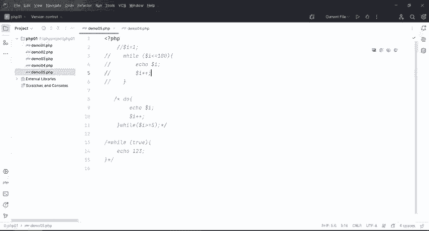

`for`循环同样用于重复执行代码块，但它特别适用于**预先知道脚本需要运行次数**的情况。与`while`和`do-while`相比，`for`循环的语法将初始化、条件判断和增量更新集中在一行，结构更紧凑。

其基本语法结构如下：
```php
for (初始值; 条件; 增量) {
    // 要执行的代码
}
```
*   **初始值**：初始化一个计数器变量。
*   **条件**：循环执行的限制条件。如果为真，则循环继续；如果为假，则循环结束。
*   **增量**：每次循环后计数器变量的更新方式（如递增）。

`for`循环的初始值和增量参数可以为空，或者包含多个表达式（用逗号分隔），这使得它的应用非常灵活。

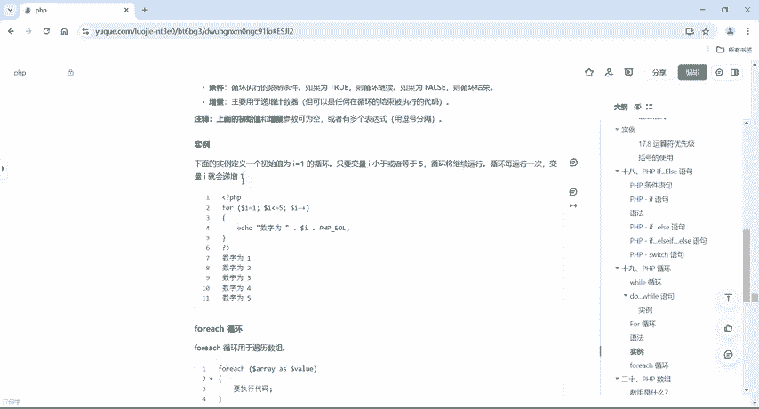

现在，我们用`for`循环来实现打印数字1到5的功能：

```php
<?php
for ($i = 1; $i <= 5; $i++) {
    echo $i;
}
?>
```
这段代码同样会输出：`12345`。可以看到，`for`循环用更简洁的代码完成了相同的任务。

**注意**：在编写代码时，要注意变量名的拼写。如果出现错误，可以根据运行时的错误提示信息（如错误行号）来定位和修正问题。

---

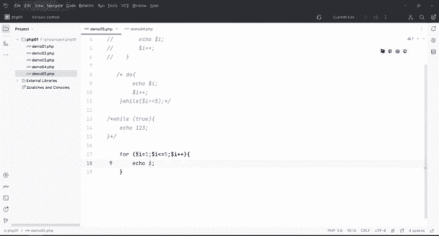

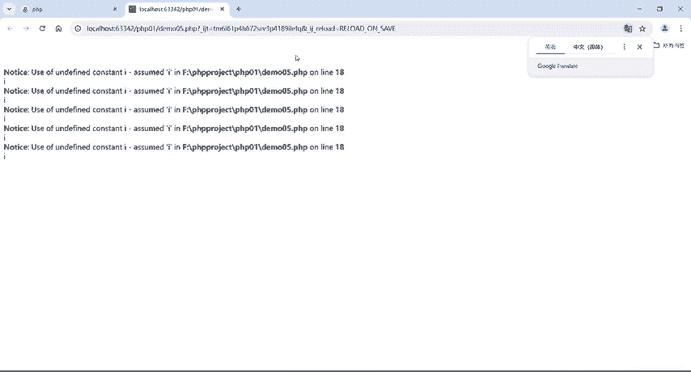

## 三种循环的对比与总结

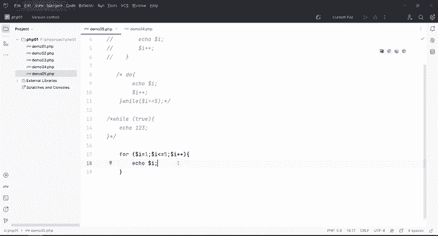

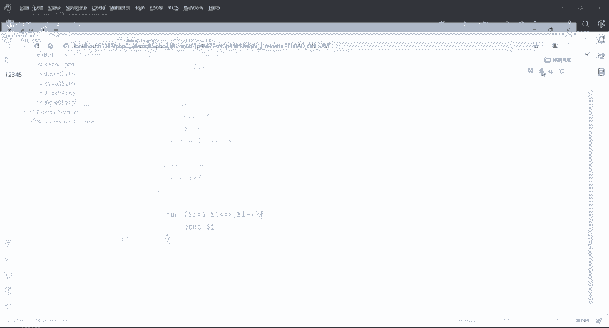

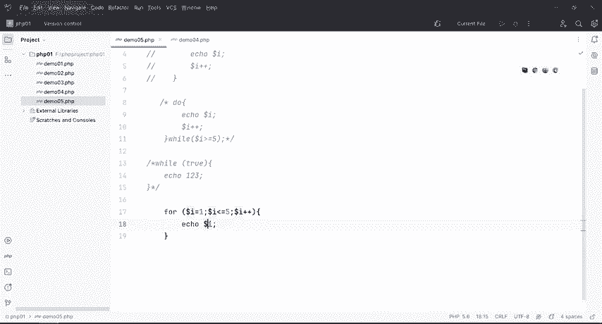

本节课中我们一起学习了`do-while`循环和`for`循环。

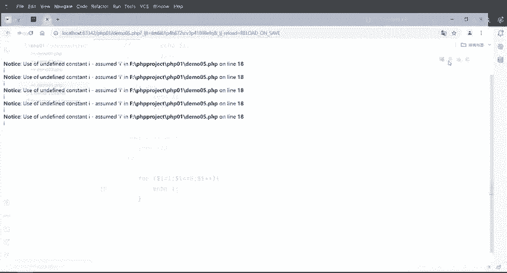

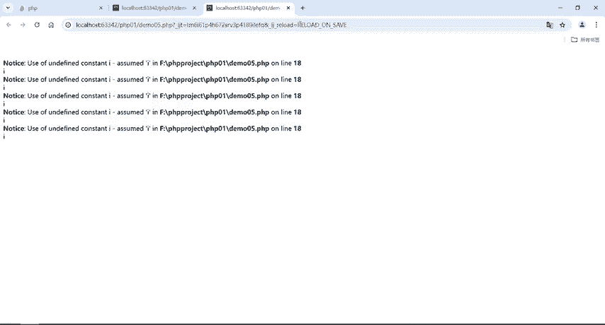

1.  **`do-while`循环**：确保循环体至少执行一次，执行流程为“先执行，后判断”。
2.  **`for`循环**：将循环变量的初始化、条件判断和更新集中管理，结构清晰，尤其适合循环次数已知的场景。
3.  **与`while`循环的对比**：`while`是“先判断，后执行”；`do-while`是“先执行，后判断”；`for`循环则是“初始化-判断-执行-更新”的集成结构。

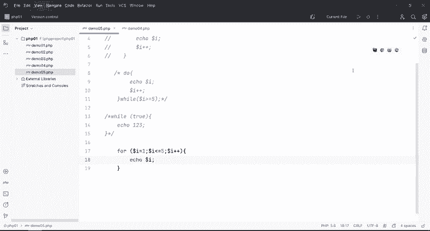

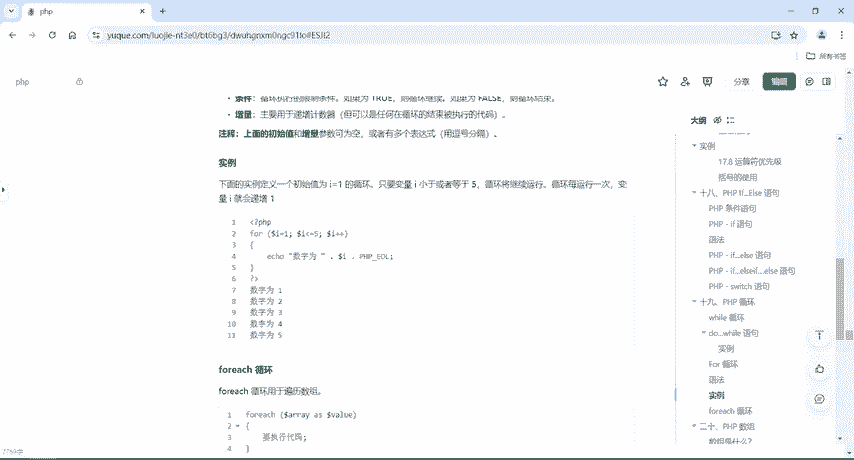

在实际的CTF Web题目或PHP开发中，`for`循环因其简洁和高效而被广泛使用。理解这三种循环的区别和适用场景，是编写和控制程序流程的基础。