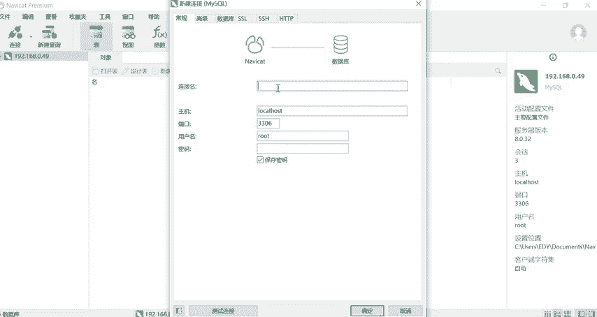
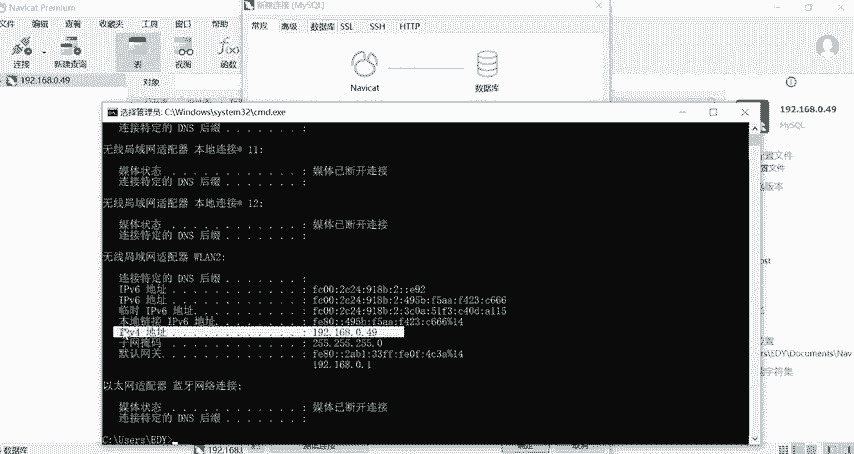
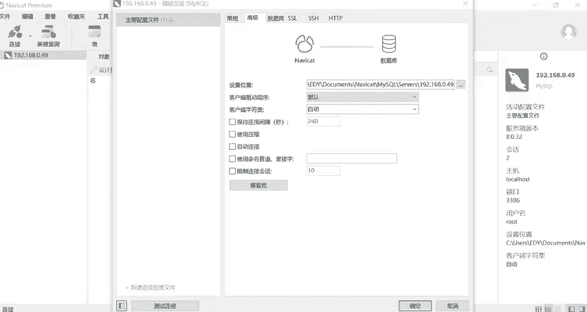

# CTF入门教学：P10：6、Navicat下载安装与基础使用教程 🛠️

在本节课中，我们将学习数据库管理工具Navicat的基础使用方法。Navicat是一款图形化数据库管理工具，可以让我们更直观、便捷地操作数据库，而无需完全依赖命令行。这对于CTF比赛中处理数据库相关的题目非常有帮助。

## 连接数据库





上一节我们介绍了Navicat的安装，本节中我们来看看如何用它连接数据库。

首先，打开Navicat工具，点击“连接”按钮，选择“MySQL”。

在弹出的连接设置窗口中，需要填写连接信息。

以下是连接信息的具体说明：

*   **连接名**：可以随意填写。通常使用自己姓名的简写，或者使用本机的IP地址。
*   **主机**：默认是`localhost`或`127.0.0.1`，表示连接本地的数据库。如果要连接远程服务器上的数据库，则需要输入该服务器的IP地址。
*   **端口**：MySQL数据库的默认端口是`3306`，通常无需更改。
*   **用户名**：数据库的登录用户名，默认为`root`。
*   **密码**：数据库的登录密码。如果安装时未设置密码，此处可以留空。

为了演示，我们使用本机IP作为连接名。查询本机IP的方法是：同时按住键盘的`Windows`键和`R`键，输入`cmd`并回车打开命令窗口。在命令行中输入`ipconfig`命令，即可查看到本机的IP地址（例如`192.168.0.49`）。

将查询到的IP地址填入“连接名”和“主机”栏位，其他信息保持默认，点击“确定”即可完成连接。

## 图形界面与命令行的关系

连接成功后，左侧列表会出现我们刚刚建立的连接。双击该连接，图标会发生变化，表示数据库连接已成功打开。

这个双击操作，实际上等价于在命令行中执行了以下命令：

```bash
mysql -u root -p
```

也就是说，Navicat的图形界面操作，底层执行的仍然是标准的SQL命令。两者的区别在于：
*   **命令行**：通过输入命令来控制数据库的增删改查。
*   **图形化工具**：提供了可视化的操作界面，让数据库的结构和操作过程更加直观、方便。

## 执行SQL查询

连接并打开数据库后，我们可以开始执行SQL命令。

在左侧列表中，可以看到系统自带的`sys`等数据库。双击打开目标数据库（例如`sys`），然后点击工具栏的“查询”->“新建查询”。

此时会打开一个查询编辑器窗口。请注意窗口顶部的标签，它会显示当前查询所针对的数据库（例如`sys`）。这意味着在此窗口中书写的所有SQL命令，默认都会对`sys`数据库生效，因此可以省略`USE sys;`这条切换数据库的指令。

以下是创建一个简单数据表的示例：

```sql
CREATE TABLE student (
    id INT NOT NULL,
    name VARCHAR(20),
    gender CHAR(2),
    age INT
);
```

编写完SQL语句后，点击工具栏的“运行”按钮（或按`F9`键）。如果语句执行成功，在左侧数据库的“表”列表中刷新一下，就能看到新建的`student`表。

图形化工具的一个显著优势是**支持撤销和即时错误提示**。如果SQL语句有语法错误（例如拼写错误），运行后会在下方信息窗口看到详细的错误提示，方便我们快速定位和修改。

## 管理查询脚本

在查询编辑器中编写的SQL语句可以保存为脚本文件，方便日后复用。

保存脚本的方法是：在查询编辑器中按`Ctrl + S`，或点击“文件”->“保存”。首次保存时需要为查询文件命名。

默认情况下，保存的脚本文件位于系统的“文档”目录下，具体路径为：
`C:\Users\[你的用户名]\Documents\Navicat\MySQL\servers\[你的连接名]`

这个默认路径可以修改。方法是：关闭当前连接，然后右键点击该连接，选择“编辑连接”。在弹出的窗口中选择“高级”选项卡，找到“设置位置”选项，即可修改脚本文件的默认保存路径。

## 课程总结



本节课中我们一起学习了Navicat数据库管理工具的基础操作。我们掌握了如何建立数据库连接，理解了图形界面与命令行操作的关系，并实践了新建查询、执行SQL语句以及管理查询脚本的方法。使用Navicat这类可视化工具，能极大提升我们管理和操作数据库的效率，是CTF学习和实战中不可或缺的技能。