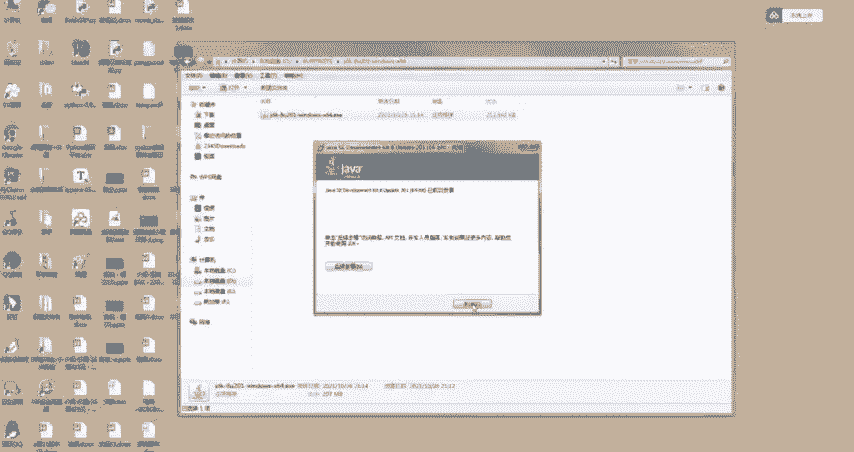
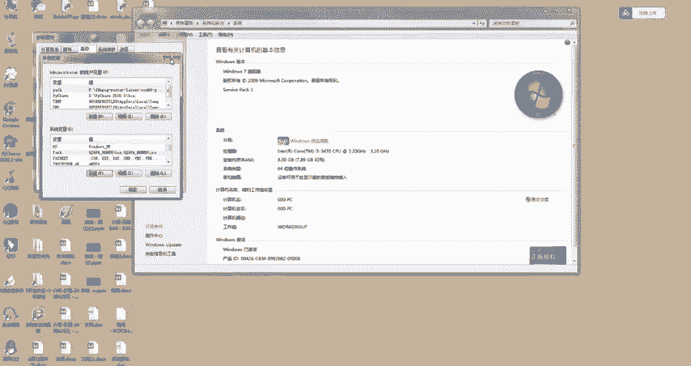
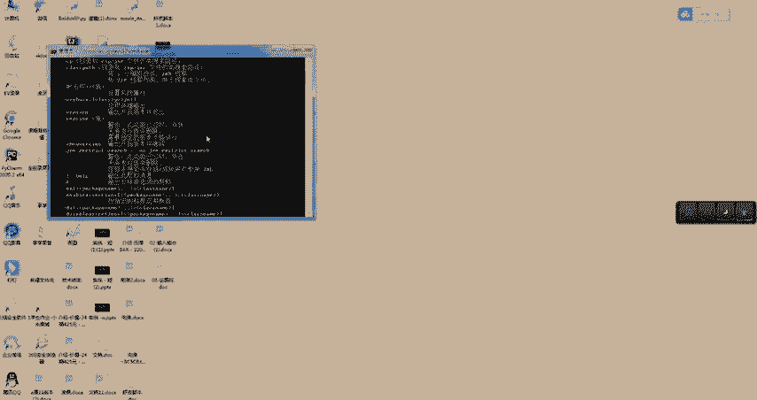
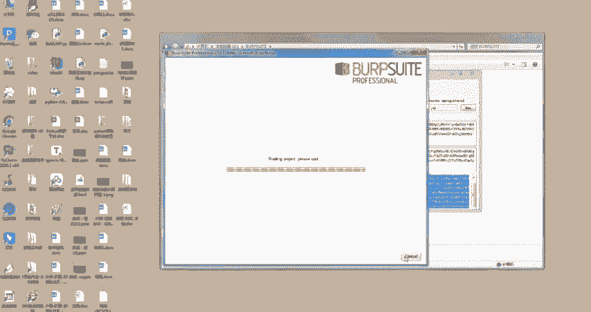
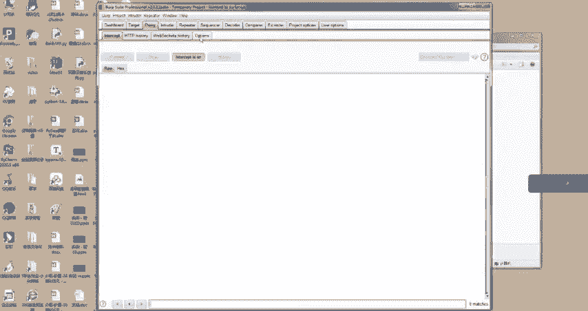
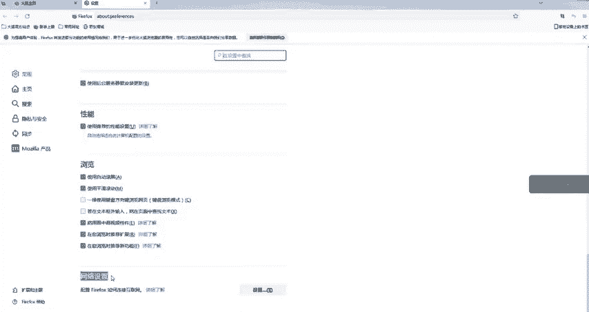
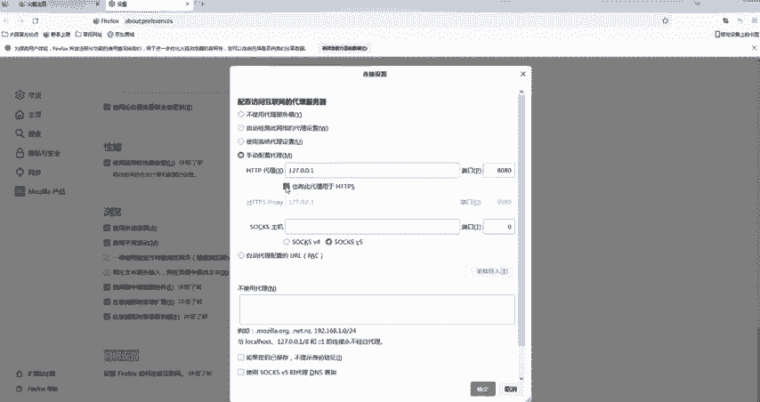
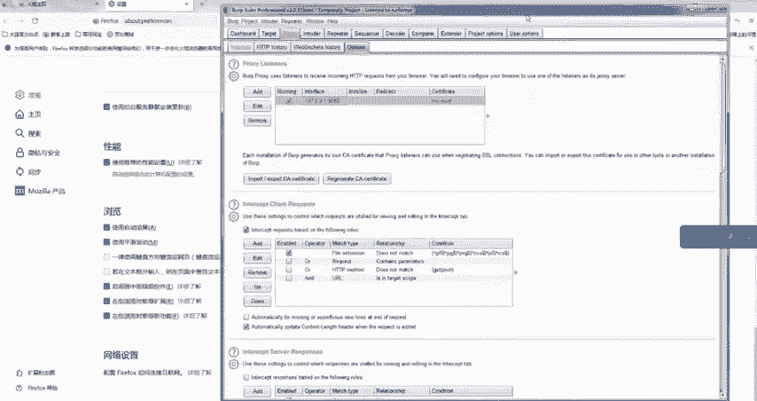

# CTF入门教学：P11：7、Burp Suite安装使用教程 🛠️

在本节课中，我们将要学习网络安全渗透测试中一个至关重要的工具——Burp Suite的安装与基本配置。Burp Suite是一个用于攻击Web应用程序的集成平台，包含了许多工具，这些工具通过协同工作，有效地分享信息，支持以某种工具中的信息为基础，提供给另一种工具使用的方式发起攻击。它主要作用于安全性渗透测试，可以实现拦截请求、爬虫、漏洞扫描等强大功能。

## 环境准备：安装Java

上一节我们介绍了Burp Suite的基本概念，本节中我们来看看安装它的前提条件。由于Burp Suite是由Java语言编写而成的，所以在安装Burp Suite之前，首先需要安装Java开发工具包（JDK）。

以下是安装JDK 1.8版本的步骤：

1.  下载JDK 1.8安装程序并双击打开。
2.  在安装向导中，点击“下一步”。
3.  记住自定义的安装路径，然后再次点击“下一步”。
4.  等待安装完成，点击“完成”。

安装完成后，需要配置系统环境变量，以便命令行可以识别Java命令。

以下是配置环境变量的步骤：

1.  右键点击“计算机”，选择“属性”。
2.  点击“高级系统设置”。
3.  在弹出的窗口中，点击“环境变量”按钮。
4.  在“系统变量”区域，点击“新建”来添加第一个变量。
    *   **变量名**：`JAVA_HOME`
    *   **变量值**：JDK的安装路径（例如：`C:\Program Files\Java\jdk1.8.0_291`）
5.  再次点击“新建”来添加第二个变量。
    *   **变量名**：`CLASSPATH`
    *   **变量值**：`.;%JAVA_HOME%\lib\dt.jar;%JAVA_HOME%\lib\tools.jar;`
6.  在系统变量列表中，找到并选中名为`Path`的变量，点击“编辑”。
7.  在变量值的末尾，添加JDK的`bin`目录路径（例如：`;%JAVA_HOME%\bin`）。
8.  逐一点击“确定”保存所有更改。

配置完成后，需要验证JDK是否安装成功。

以下是验证安装的步骤：

1.  打开命令提示符（CMD）。
2.  输入命令 `java -version` 并按回车。
3.  如果命令行显示Java的版本信息，则表示JDK安装和配置成功。

## 安装与激活Burp Suite

环境准备就绪后，我们现在可以开始安装Burp Suite了。

以下是安装与激活Burp Suite的步骤：

1.  双击下载好的Burp Suite安装程序（如`burpsuite_community.jar`）。
2.  程序启动后会弹出一个窗口，点击右侧的“Run”按钮。
3.  等待程序加载完毕，会进入激活界面。将提供的激活码复制到输入框中。
4.  点击“Next”或“Paste license”按钮。
5.  在接下来的界面中，通常会分为左右两个部分。将左侧窗口生成的代码复制，粘贴到右侧的输入框中。
6.  右侧窗口会生成新的代码。再将这段新代码复制，粘贴回左侧的窗口。
7.  点击“Next”按钮。至此，激活过程完成，点击“Finish”即可。

## 基本配置与使用

软件安装成功后，首次启动时会让我们选择项目类型。对于初学者，选择默认的“Temporary project”（临时项目）即可，然后点击“Next”和“Start Burp”开始使用。

启动后，我们需要配置代理，使Burp Suite能够拦截浏览器的网络流量进行分析。

以下是配置Burp Suite代理的步骤：

1.  在Burp Suite主界面，切换到“Proxy”标签页。
2.  点击“Options”子标签。
3.  在代理监听器列表中，确保默认的`127.0.0.1:8080`处于运行状态。如果没有，可以点击“Add”添加一个，绑定到`127.0.0.1`，端口设置为`8080`。

接下来，我们需要在浏览器中设置代理，将流量导向Burp Suite。

以下是配置浏览器代理的步骤（以Firefox为例）：

1.  打开Firefox浏览器，点击右上角菜单，选择“设置”。
2.  在设置页面中，向下滚动到“网络设置”部分，点击“设置...”按钮。
3.  在弹出的窗口中，选择“手动代理配置”。
4.  将“HTTP代理”设置为`127.0.0.1`，端口设置为`8080`（此端口必须与Burp Suite中设置的监听端口一致）。
5.  勾选“也为 HTTPS 使用此代理”。
6.  点击“确定”保存设置。

> **重要提示**：手动设置代理后，如果未开启Burp Suite，浏览器可能无法访问任何网站。因此，建议仅在需要使用Burp Suite进行抓包分析时开启此代理设置，使用完毕后恢复为“使用系统代理设置”或“无代理”。

配置完成后，在Burp Suite的“Proxy” -> “Intercept”标签下，确保“Intercept is on”按钮是开启状态。此时，在浏览器中访问任何HTTP网站，请求都会被Burp Suite拦截并显示出来。

## 总结

本节课中我们一起学习了Burp Suite的完整安装与基本配置流程。我们首先安装了必要的Java运行环境并配置了系统变量，然后完成了Burp Suite本身的安装与激活，最后通过配置Burp Suite的代理监听和浏览器的网络代理，实现了对Web流量的拦截抓取。这是进行Web安全测试和CTF中Web题目解题的第一步，熟练掌握此工具是后续深入学习的基础。