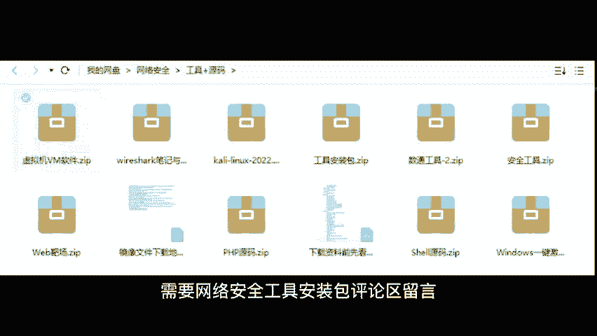

# CTF工具教程合集：P12：8、SQLMap安装教程

在本节课中，我们将要学习一款在CTF比赛和安全测试中极为强大的自动化SQL注入工具——SQLMap的安装方法。SQLMap能够帮助测试者自动发现并利用网站的SQL注入漏洞，是Web安全领域的必备工具之一。

## 🛠️ 什么是SQLMap？



SQLMap是一个开源的自动化SQL注入检测与利用工具。它能够自动识别和利用目标网站的SQL注入漏洞，极大地简化了手动测试的复杂过程。真正的黑客或安全研究员在挖掘漏洞时，会使用这类专业工具，而非徒手操作。


## 💻 安装SQLMap

上一节我们介绍了SQLMap的基本概念，本节中我们来看看如何安装它。SQLMap基于Python开发，因此安装过程相对简单。

以下是安装SQLMap的步骤：

1.  **确保系统已安装Python**：SQLMap需要Python环境才能运行。请确保你的计算机上已安装Python 3.x版本。
2.  **下载SQLMap**：你可以从SQLMap的官方GitHub仓库下载最新版本。
3.  **解压文件**：将下载的压缩包解压到你选择的目录中。
4.  **运行SQLMap**：打开命令行终端，导航到SQLMap所在的目录，即可开始使用。

## 🚀 SQLMap基本使用演示

安装完成后，我们来体验一下SQLMap的强大与简便。它的使用可以简单到只需输入目标网址并按下回车。

以下是使用SQLMap进行基本检测的命令示例：

```bash
python sqlmap.py -u "http://target-website.com/page?id=1" --dbs
```

*   `-u` 参数用于指定目标URL。
*   `--dbs` 参数用于尝试枚举目标网站的后台数据库名称。

当你按下回车后，SQLMap会自动运行。如果目标网站存在SQL注入漏洞，你将会看到类似下图的界面，这意味着工具已成功识别出漏洞。


## ⚠️ 重要法律与道德声明

在结束之前，我们必须强调一个核心原则：**任何未经授权的渗透测试或漏洞挖掘行为都是违法的**。SQLMap等工具应仅用于授权的安全评估、CTF比赛或自己的测试环境中。请务必遵守法律法规，做一名有道德的白帽子。

## 📝 课程总结

本节课中我们一起学习了SQLMap的安装与基本使用方法。我们了解到SQLMap是一款功能强大的自动化SQL注入工具，能够帮助安全人员高效地发现Web应用的安全隐患。记住，工具的强大意味着更大的责任，务必在合法合规的范围内使用它。

感谢学习。如果你觉得本教程有帮助，请给予支持。