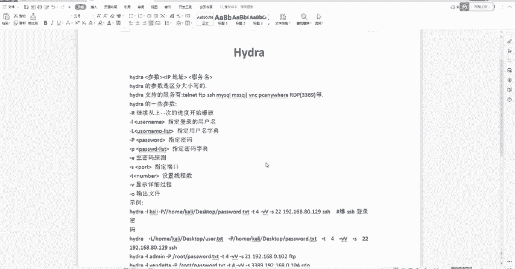
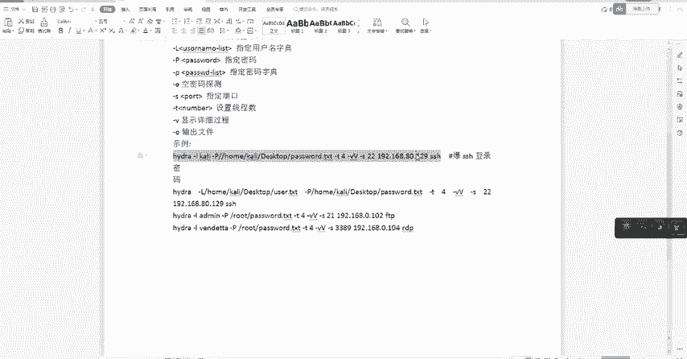
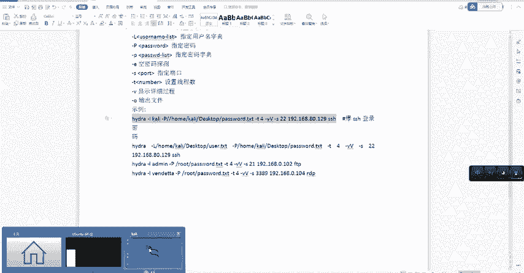
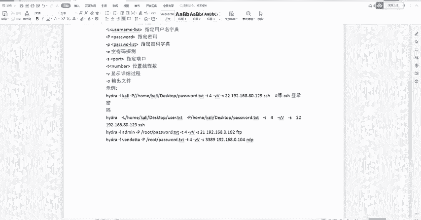

# CTF工具教程合集：P13：9、Hydra下载安装密码爆破指令使用教程 💻

在本节课中，我们将学习一款名为Hydra的暴力破解工具。我们将了解其基本格式、核心参数，并通过具体实例演示如何用它来爆破SSH、FTP等服务的密码。

---

## Hydra简介与安装 🛠️

Hydra是一款支持多种网络协议登录破解的暴力破解工具。它可以通过尝试不同的用户名和密码组合来攻击目标服务。

关于安装，有多种方式。一种便捷的方法是使用Kali Linux系统，因为该系统已预装了Hydra工具，无需额外下载安装。当然，Hydra也支持在Windows系统上安装和使用。

---

## Hydra基本格式与参数 📝

要使用Hydra，首先需要了解其命令的基本格式。其核心格式为：`hydra [参数] [目标IP地址] [服务名]`。

Hydra支持爆破的服务非常多，例如FTP、SSH、MySQL、RDP等。需要注意的是，它的参数严格区分大小写，不同大小写的参数具有不同的含义。

以下是几个基本参数的含义：
*   **-l**：指定单个用户名进行爆破。
*   **-L**：指定一个用户名字典文件。
*   **-p**：指定单个密码进行尝试。
*   **-P**：指定一个密码字典文件。
*   **-s**：指定目标服务的端口号。
*   **-t**：设置并发线程数，以提高爆破速度。
*   **-v**：显示详细的执行过程信息。

---

## 实战演练：爆破SSH密码 🔑

上一节我们介绍了Hydra的基本参数，本节中我们来看看如何具体使用它来爆破SSH服务的密码。

以下是爆破SSH登录密码的一个典型命令：
`hydra -l kali -P /usr/share/wordlists/rockyou.txt -t 4 -v -s 22 192.168.1.1 ssh`

我们来解析一下这条命令：
*   `-l kali`：指定用户名为 `kali`。
*   `-P /usr/share/wordlists/rockyou.txt`：指定密码字典文件的位置。
*   `-t 4`：设置线程数为4。
*   `-v`：显示详细过程。
*   `-s 22`：指定SSH服务端口为22。
*   `192.168.1.1`：目标服务器的IP地址。
*   `ssh`：指定要攻击的服务为SSH。

将这条命令在终端中执行后，Hydra便会开始工作。如果爆破成功，界面上会清晰地显示出目标主机的IP地址、用户名以及对应的密码。

如果想要加快爆破速度，可以适当增加 `-t` 参数后的线程数，例如改为 `-t 8`。但需要注意，线程数并非越大越好，它受到网络和目标服务器承受能力的限制。

---

## 其他服务爆破示例 🌐

除了SSH，Hydra同样可以用于爆破其他服务。其命令格式大同小异，主要区别在于服务名和默认端口。

以下是爆破FTP服务的命令示例：
`hydra -l admin -P pass.txt -t 4 -v -s 21 192.168.1.100 ftp`
*   此命令指定用户名为 `admin`，使用 `pass.txt` 作为密码字典，攻击位于 `192.168.1.100` 的FTP服务（默认端口21）。

以下是爆破RDP（远程桌面）服务的命令示例：
`hydra -l administrator -P pass.txt -t 4 -v -s 3389 192.168.1.150 rdp`
*   此命令指定用户名为 `administrator`，攻击位于 `192.168.1.150` 的RDP服务（默认端口3389）。

爆破成功后，即可使用得到的账户和密码尝试登录对应的FTP服务器或远程桌面进行验证。

---

## 总结 📚

本节课中我们一起学习了Hydra这款暴力破解工具。我们了解了它的基本命令格式和核心参数，并通过SSH爆破的实例详细解析了命令的构成。此外，我们也举一反三，给出了爆破FTP和RDP服务的命令示例。掌握这些基础用法后，你就可以针对不同的网络服务进行简单的密码强度测试了。