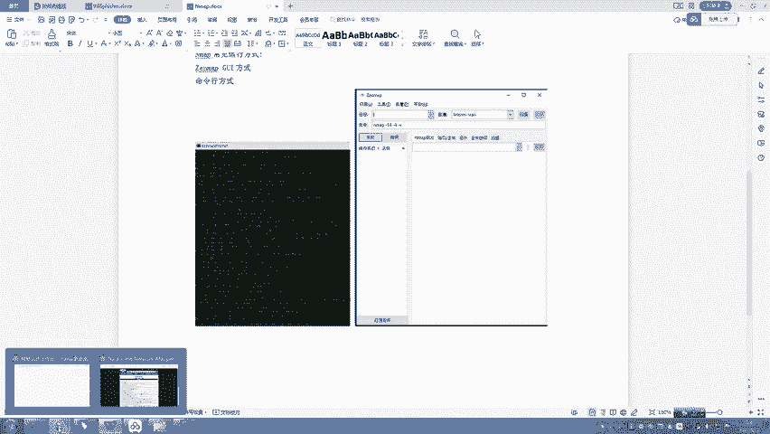
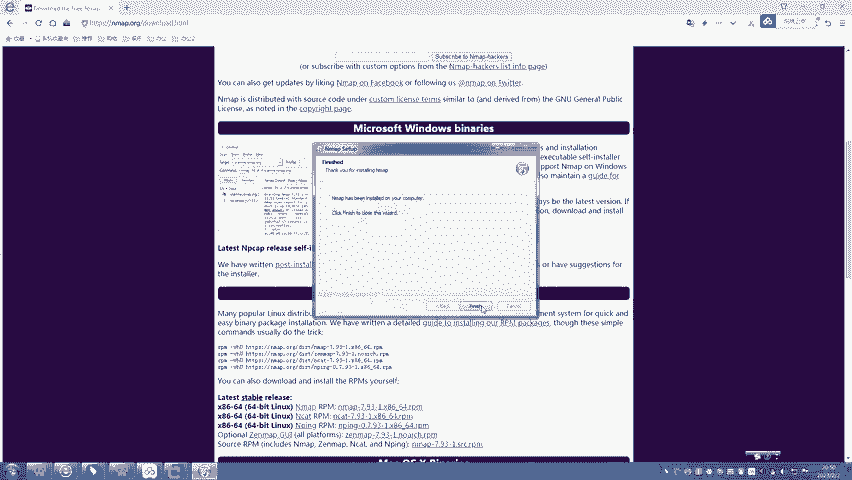
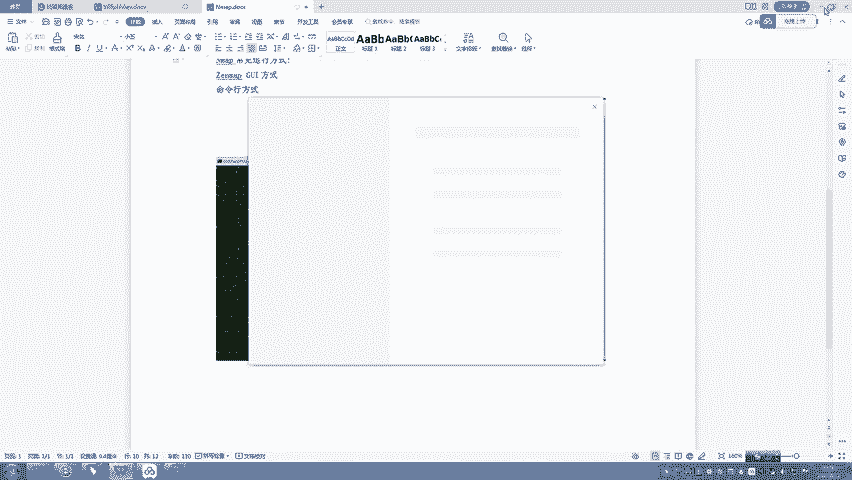
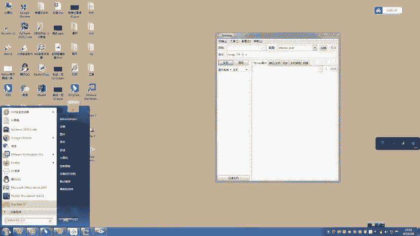
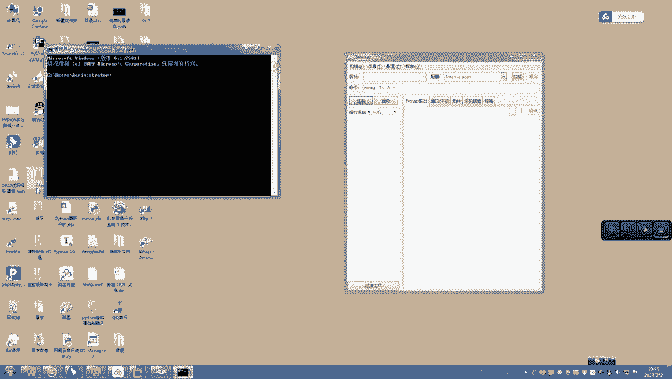
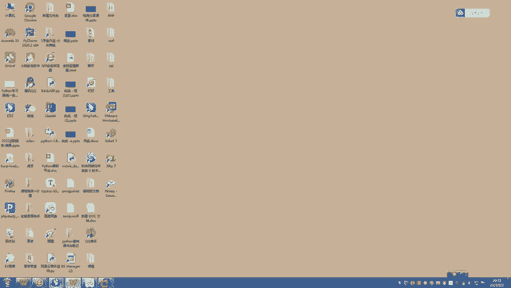
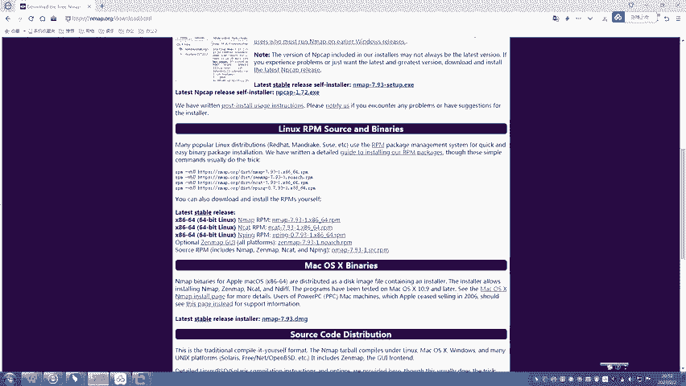

# CTF工具教程合集：P14：10、nmap安装下载使用教程 🔧

在本节课中，我们将要学习网络安全扫描工具Nmap的下载与安装过程。Nmap是一款功能强大的网络探测和安全审计工具，掌握其安装方法是进行CTF比赛和渗透测试的第一步。

## 什么是Nmap？ 🧭

上一节我们介绍了课程概述，本节中我们来看看Nmap是什么。

Nmap，全称为Network Mapper，是一款支持多平台的网络连接扫描软件。它主要用于探测计算机网络上的主机和服务。在渗透测试初期，为了绘制目标网络的拓扑结构，我们需要探测目标主机运行的操作系统、端口开放情况、安全过滤机制以及运行的服务等信息。此时，Nmap通过向目标网络发送特定的数据包，并对返回的数据包进行详细分析，从而实现网络扫描。

Nmap支持多种平台，包括Windows、macOS和Linux。其主要运行方式有两种：
*   **命令行界面**：这是更常见、更强大的使用方式。
*   **图形用户界面**：提供可视化的操作，适合初学者。

## Nmap的安装方式 💾



了解了Nmap的基本概念后，接下来我们看看如何在不同的操作系统上安装它。

以下是Nmap的几种主要安装方式。

### Windows系统安装

1.  **访问官网**：打开浏览器，在地址栏输入Nmap的官方地址 `https://nmap.org`，进入下载页面。
2.  **选择安装包**：在下载页面中找到Windows系统的安装程序，通常是一个 `.exe` 格式的文件（例如最新版 `nmap-7.93-setup.exe`）。
3.  **下载与安装**：点击下载链接，选择保存路径。下载完成后，双击运行安装程序。
    *   同意用户许可协议。
    *   在组件选择界面，建议默认勾选所有组件，然后点击“下一步”。
    *   选择安装路径（例如 `C:\Program Files\Nmap\`），点击“安装”。
    *   等待安装完成，点击“完成”。
4.  **验证安装**：安装成功后，桌面会生成Nmap的快捷方式。双击即可打开图形化界面（Zenmap）。同时，你也可以打开命令提示符（CMD），输入 `nmap` 命令来启动命令行工具。



### Linux系统安装

在基于Debian的Linux发行版（如Kali Linux）中，安装Nmap非常简单，因为其通常已预装或可通过包管理器直接安装。





打开终端，输入以下命令进行安装或验证：
```bash
# 对于已预装Nmap的系统（如Kali），直接运行即可
nmap



# 如果需要安装，可以使用包管理器（例如在Ubuntu/Debian上）
sudo apt update
sudo apt install nmap
```
运行 `nmap` 命令后，终端会显示Nmap的版本信息和使用帮助，这表明安装成功。



### macOS系统安装

对于macOS用户，安装过程与Windows类似。

1.  访问Nmap官网（`https://nmap.org`）的下载页面。
2.  找到macOS对应的下载选项，通常是一个 `.dmg` 磁盘映像文件。
3.  下载并打开 `.dmg` 文件，将Nmap应用程序拖拽到“应用程序”文件夹中即可完成安装。



## 重要注意事项 ⚠️

在结束安装教程之前，有一个关键的细节需要大家注意，这关系到命令能否正确执行。

在使用命令行运行Nmap时，需要注意操作系统的区别：
*   **Linux/macOS系统**：**严格区分**命令和参数的大小写。
*   **Windows系统**：命令行对大小写**不敏感**，通常可以混用。

因此，在Linux或macOS上执行命令时，必须确保输入的命令和参数大小写正确，否则可能导致命令执行失败。

## 总结 📝

本节课中我们一起学习了网络安全扫描利器Nmap的安装方法。我们首先了解了Nmap的基本用途——通过网络扫描探测主机和服务信息。然后，我们逐步演示了在Windows、Linux（以Kali为例）和macOS三大主流操作系统上下载和安装Nmap的详细过程。最后，我们强调了在不同操作系统上使用命令行时需要注意的大小写规则。成功安装Nmap是后续深入学习其强大扫描功能的基础。