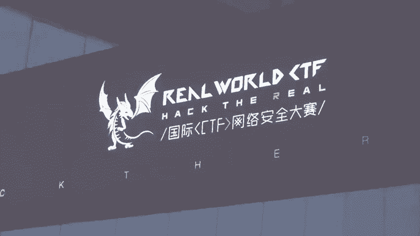
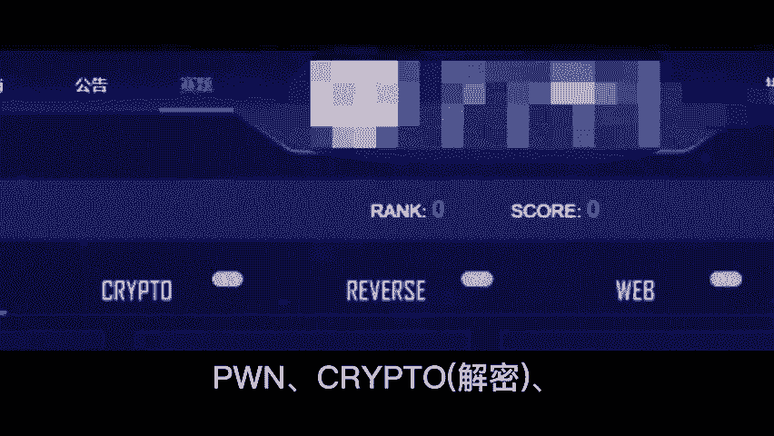
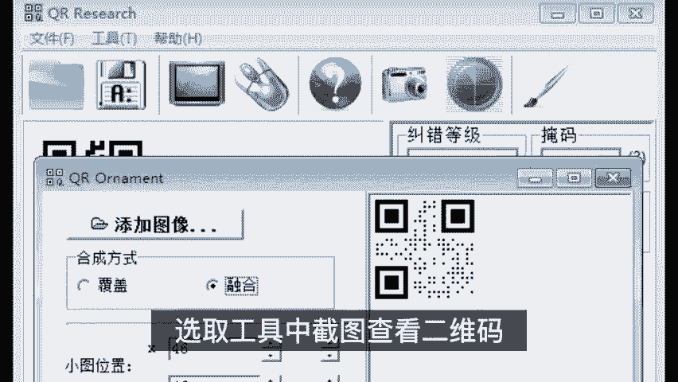
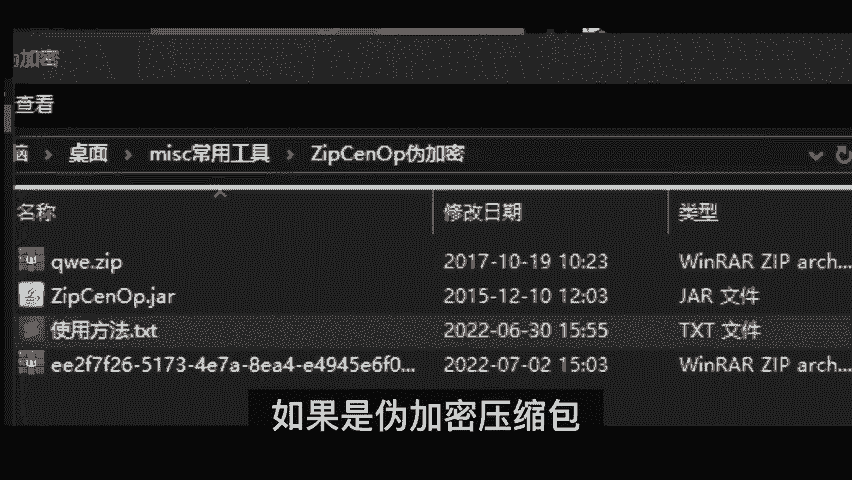
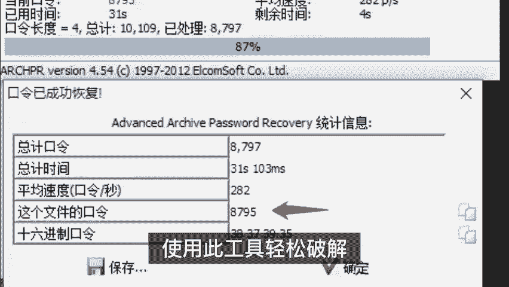
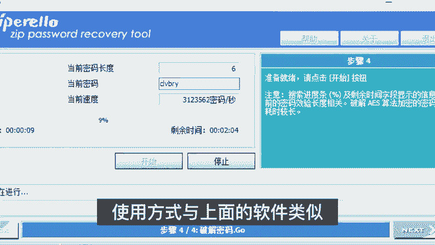
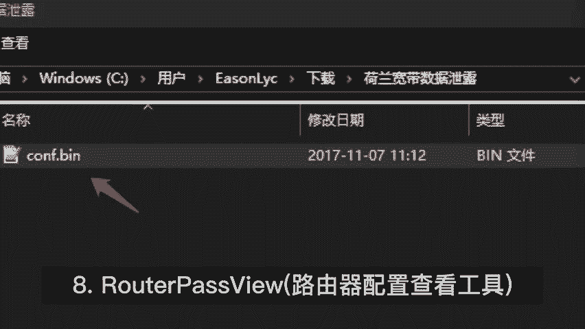
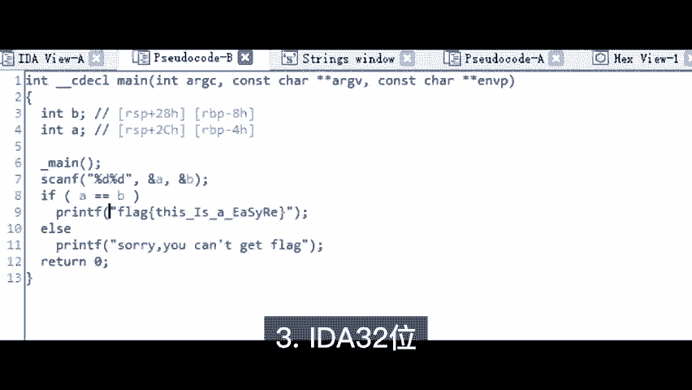
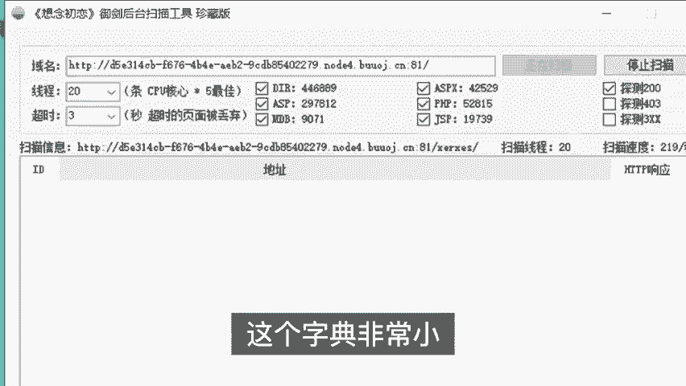

CTF工具使用教程：P1：CTF比赛必备工具概览

在本节课中，我们将学习CTF比赛中常用的六大类、共13款核心工具。这些工具涵盖了杂项分析、逆向工程、密码破解等多个方面，是入门和进阶CTF比赛的得力助手。

🎼 **CTF工具使用教程：P1：杂项分析类工具**

上一节我们介绍了课程的整体内容，本节中我们来看看第一大类工具：杂项分析工具。这类工具主要用于处理CTF比赛中的杂项题目，例如密码提取、信息隐写等。

以下是五款常用的杂项分析工具及其功能：

1.  **莫斯密码提取工具**：将包含莫斯密码的音频文件拖入软件，即可自动解码出明文信息。
2.  **图片隐写分析工具**：打开可疑图片文件，利用其提供的多个功能（如查看文件结构、提取隐藏数据等）来发现图片中隐藏的各种信息。
3.  **二维码分析工具**：截取或打开二维码图片，用于查看其内容或验证是否为经过伪装的“假”二维码。
4.  **ZIP伪加密破解工具**：如果遇到伪加密的ZIP压缩包，只需用此工具打开，将文件头中的特定加密标志位（例如，将 `0x09` 改为 `0x00`）修改为偶数，即可无需密码直接解压。
5.  **压缩包密码破解工具**：当遇到加密的压缩包时，可以使用此工具进行密码破解。它支持字典攻击、暴力破解等多种模式。

🎼 **CTF工具使用教程：P1：逆向工程与扫描类工具**

在掌握了杂项分析工具后，我们进入逆向工程领域。逆向类工具主要用于分析程序的二进制代码。

以下是两款相关的工具：

1.  **逆向分析工具**：此工具可用于判断软件是32位还是64位版本。例如，使用 `file` 命令或PE工具查看文件头信息。如果文件是64位的，就需要用对应的64位调试器打开。该工具集成了反汇编和调试功能，无论是32位还是64位程序都能应对。
2.  **路由器配置文件查看工具**：这是一款专门用于解析和查看特定品牌路由器配置文件的工具，在涉及网络设备的题目中非常有用。

接下来，我们看看辅助扫描的工具。高效的字典在Web渗透或目录扫描中至关重要。

**CTF常用扫描字典**：这是一个精炼的字典文件，其特点是体积小、命中率高。因为在CTF比赛中时间有限，所以字典追求精准而非庞大。目前该字典收录了247个在历年比赛中出现过的常见路径或文件名，可以作为基础参考。使用者可以根据自己的经验不断往里面添加新的条目。

本节课中我们一起学习了CTF比赛中的核心工具，包括用于信息提取和分析的杂项工具、用于程序分析的逆向工具，以及一个高效的扫描字典。熟练掌握这些工具将极大提升你解决CTF题目的效率。