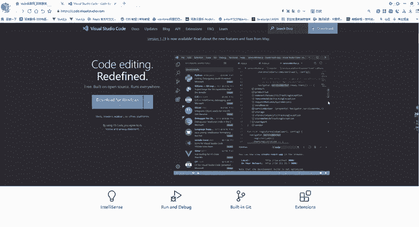
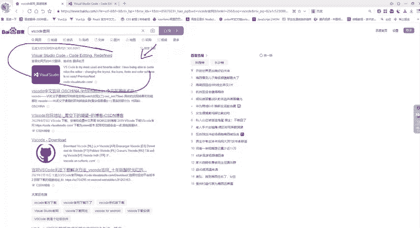
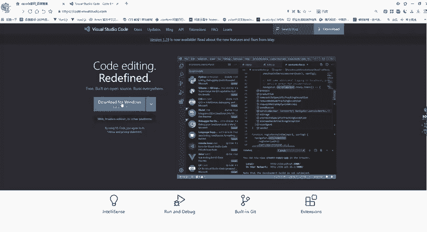
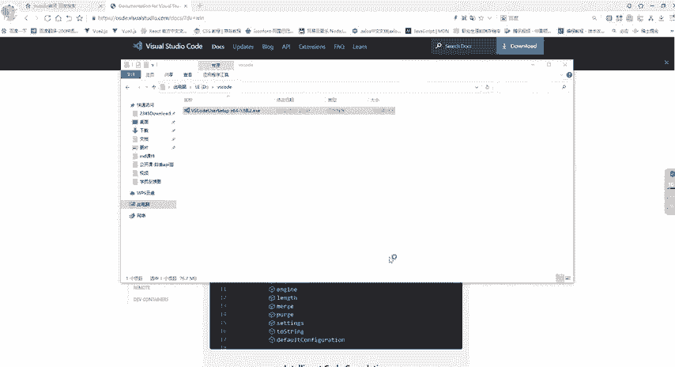
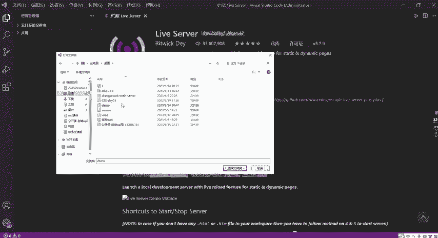
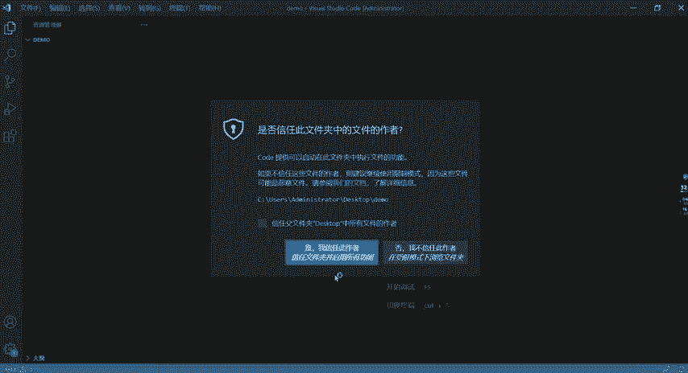
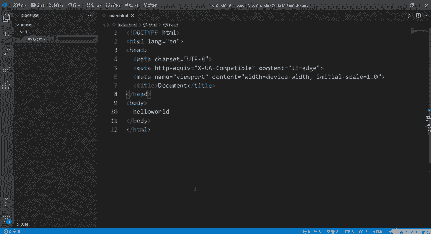
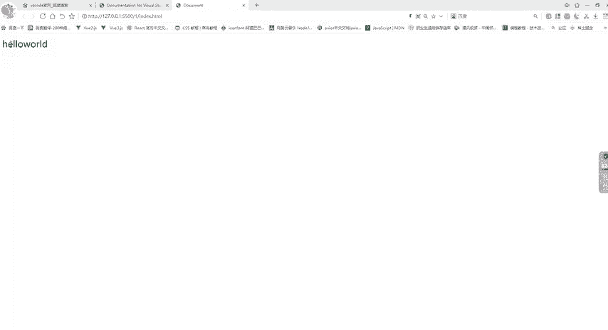
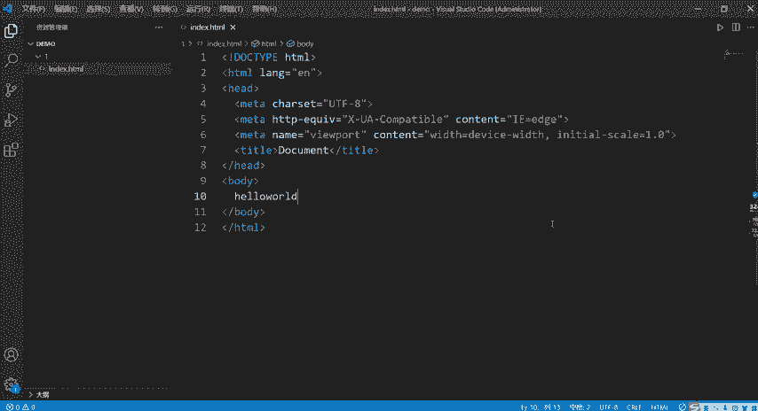

# CTF工具使用教程：P2：1、VSCode的安装与使用 🛠️

在本节课程中，我们将学习如何下载、安装并初步使用代码编辑器 Visual Studio Code（VSCode）。这是CTF学习和日常编程中一个非常强大且常用的工具。

## 下载VSCode

首先，我们来看如何下载VSCode。

1.  打开浏览器，访问百度搜索引擎。
2.  搜索关键词 `vscode` 或 `vscode官网`。
3.  在搜索结果中，找到并进入 Visual Studio Code 的官方网站。

进入官网后，你会看到下载页面。

## 安装VSCode

上一节我们介绍了如何找到下载页面，本节中我们来看看如何进行安装。

以下是安装步骤：

1.  在官网页面，点击“Download”按钮。
2.  根据你的操作系统（如 Windows、macOS、Linux）选择对应的版本进行下载。本教程以 Windows 系统为例。
3.  下载完成后，在你的文件夹中找到名为 `VSCodeSetup` 的应用程序文件。
4.  双击该文件开始安装。

安装过程如下：

1.  启动安装程序后，点击“下一步”。
2.  阅读并勾选“我同意此协议”选项，然后点击“下一步”。
3.  选择软件的安装目录。你可以点击“浏览”按钮，将其安装到指定的磁盘（例如 D 盘）。
4.  点击“下一步”，后续选项保持默认即可。
5.  建议勾选“创建桌面快捷方式”选项，方便日后快速启动。
6.  点击“安装”，等待安装进度完成。
7.  安装完成后，默认会勾选“运行 Visual Studio Code”选项。点击“完成”，软件将自动启动。

## 初始设置与插件安装

软件启动后，你可能会看到英文界面。为了更方便地使用，我们需要安装两个必要的插件。

首先，认识界面左侧的两个核心图标：
*   **文件管理器图标**：用于管理文件夹和项目文件。
*   **扩展图标**：用于搜索和安装插件。

接下来，安装使界面汉化的插件。

1.  点击左侧的**扩展图标**。
2.  在搜索框中输入 `chinese`。
3.  在搜索结果中找到名为“Chinese (Simplified) Language Pack for Visual Studio Code”的插件。
4.  点击其旁边的 **`Install`** 按钮进行安装。
5.  安装完成后，关闭并重新打开 VSCode，界面就会变为中文。

然后，安装用于在浏览器中实时预览网页的插件。

1.  再次点击**扩展图标**。
2.  在搜索框中输入 `live server`。
3.  找到名为“Live Server”的插件，点击 **`Install`** 按钮进行安装。

## 创建第一个项目

插件安装完毕后，我们就可以开始创建和编写代码了。

以下是创建并运行一个简单网页的步骤：

1.  点击顶部菜单栏的 **`文件`** -> **`打开文件夹`**。
2.  选择一个目标文件夹（例如在桌面新建的 `demo` 文件夹），然后点击“选择文件夹”。
3.  在左侧文件管理器中，可以看到打开的 `demo` 文件夹。
4.  将鼠标悬停在文件夹名上，会出现“新建文件”和“新建文件夹”图标。点击“新建文件”图标。
5.  输入文件名，例如 `index.html`，然后按回车键。

## 编写与运行代码

现在，我们将在新建的文件中编写代码。

1.  在 `index.html` 文件中，输入一个英文的感叹号 `!`。
2.  此时编辑器会弹出代码片段提示，按 `Tab` 键或回车键选择第一个选项，它会自动生成 HTML 页面的基础模板。
3.  在生成的模板中，找到 `<body>` 标签，在其中输入内容，例如 `Hello World`。
4.  按快捷键 **`Ctrl + S`** 保存文件。

接下来，使用 Live Server 插件在浏览器中打开这个网页。

1.  在文件编辑区或左侧文件管理器中的 `index.html` 文件上**右键单击**。
2.  在弹出的菜单中，选择 **`Open with Live Server`**。
3.  你的默认浏览器会自动打开，并显示 `Hello World` 字样。

## 总结

本节课中我们一起学习了 Visual Studio Code 的完整使用流程。

我们首先从官网下载安装包，完成了软件的安装。随后，为了提升使用体验，我们安装了中文语言包和 Live Server 这两个核心插件。最后，我们实践了如何创建项目文件夹、新建 HTML 文件、编写基础代码，并利用 Live Server 插件在浏览器中实时预览网页效果。

掌握这些基础操作，你就能使用 VSCode 高效地开始 CTF 挑战或任何编程任务了。

