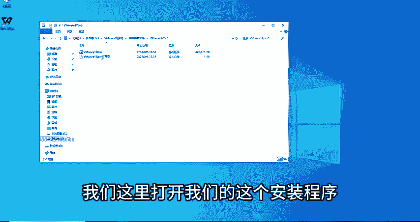
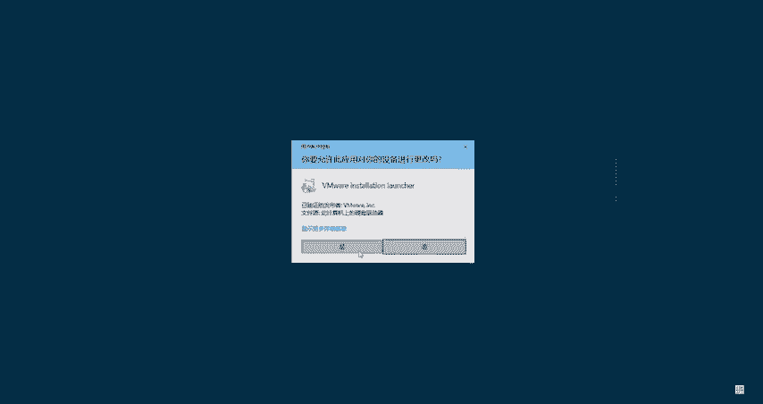
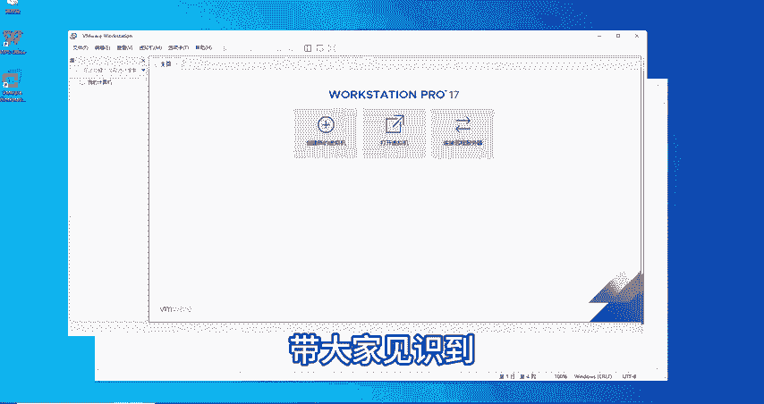

# CTF入门教学：P3：2：VMware的安装与激活教程 🖥️

在本节课中，我们将要学习如何安装和激活VMware Workstation Pro这款虚拟机软件。这是进行CTF学习和实践的重要基础工具，它允许我们在一个操作系统内运行另一个操作系统。

## 概述

VMware Workstation Pro是一款由专业技术人员、开发人员和企业用户设计的桌面虚拟化应用程序，也就是我们常说的虚拟机。它支持安装Linux发行版、Windows版本以及其他操作系统。我们最常用的是在Windows系统下安装此软件，以便运行Linux或macOS等其他系统进行学习和测试。

## 环境与工具准备

开始安装前，需要准备以下环境与工具：
*   一个Windows 10操作系统环境。
*   VMware Workstation 17 Pro的安装程序。
*   对应的软件激活许可证（激活码）。

这些工具和软件可以分享给有需要的同学，大家可以在评论区留言获取。

## 安装步骤详解

以下是VMware Workstation Pro的详细安装流程。

首先，双击运行准备好的安装程序。

程序启动后，会出现安装向导界面，点击“下一步”继续。

接下来会显示用户许可协议，阅读后点击“我接受”并进入下一步。

在自定义安装界面，建议更改软件的安装位置。默认安装到C盘可能会逐渐占用大量空间，不易清理。我们可以将其安装到D盘或E盘。

操作方法是点击“更改”按钮，在弹出的窗口中指定新的路径，例如 `E:\VMware`，然后点击确定。确认安装位置已更新后，点击“下一步”。

后续步骤中，关于软件更新，如果希望长期使用当前版本，可以选择不勾选更新选项。“用户体验改进计划”可以按个人选择是否加入。保持“创建桌面快捷方式”等选项为勾选状态，然后继续点击“下一步”。

确认所有设置无误后，点击“安装”按钮，等待安装过程完成。

## 核心概念解析

在等待安装的过程中，我们来了解一个重要的专业术语：**ISO文件**。

*   **ISO文件**：它是电脑上光盘镜像的存储格式之一。镜像文件可以理解为一个存储设备（如硬盘、光盘）的精确副本。
    *   **类比理解**：可以将其想象成一本珍贵书籍的完美复制品。为了保护原书不被损坏，我们制作一个内容完全相同的副本，这个副本就是“镜像”。在计算机领域，镜像文件就是存储设备的“副本”。

## 软件激活流程

安装完成后，会进入一个需要输入许可证的界面。VMware Workstation Pro版本需要激活才能使用全部功能。

点击“许可证”按钮，在弹出的输入框中，粘贴提前准备好的激活密钥。例如，一个有效的密钥格式类似：`XXXXX-XXXXX-XXXXX-XXXXX-XXXXX`。

输入正确的许可证密钥后，点击“完成”按钮即可退出安装向导。

激活成功后，桌面上会出现VMware Workstation的快捷方式图标。双击打开软件，会进入软件的主界面。主界面通常提供“创建新的虚拟机”、“打开虚拟机”和“连接远程服务器”等主要功能选项。

## 课程总结

本节课我们一起学习了VMware Workstation Pro的安装与激活。我们首先介绍了软件的基本概念，然后完成了从环境准备、执行安装、到最终激活并进入主界面的全过程。同时，我们还解释了“ISO镜像文件”这一核心概念。

下节课，我们将学习如何利用这款软件“创建新的虚拟机”和“打开虚拟机”，正式开始运用它来搭建我们的CTF学习环境。

> **提示**：本节课所用到的安装程序、图文笔记及激活密钥等资源，有需要的同学可以通过评论区获取。