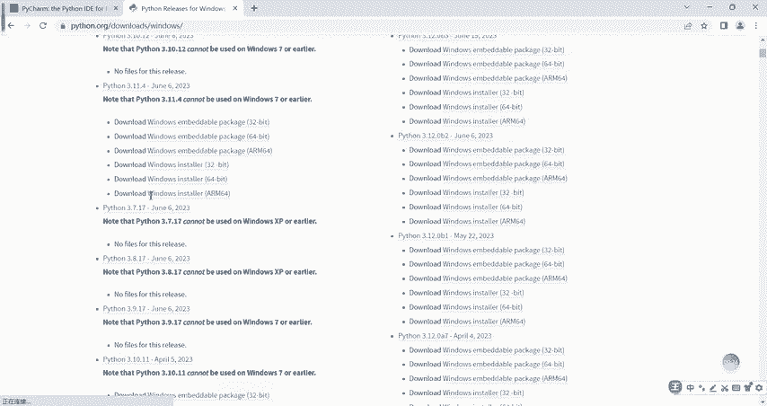
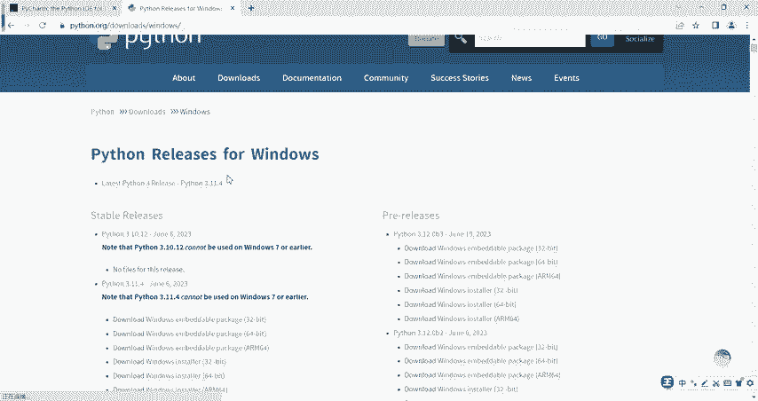
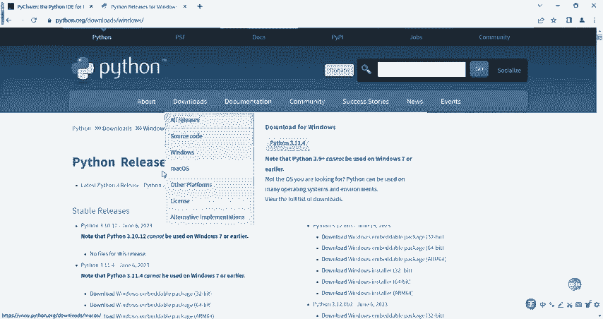
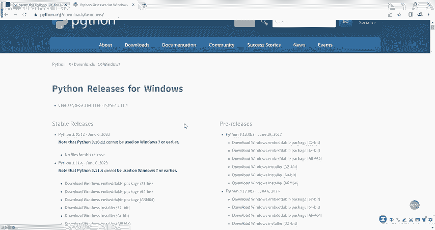
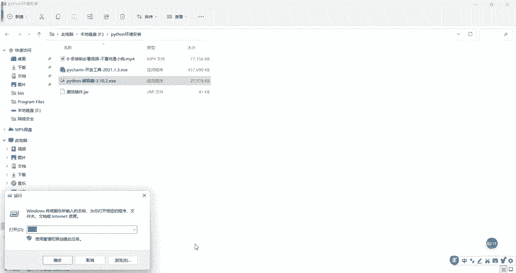
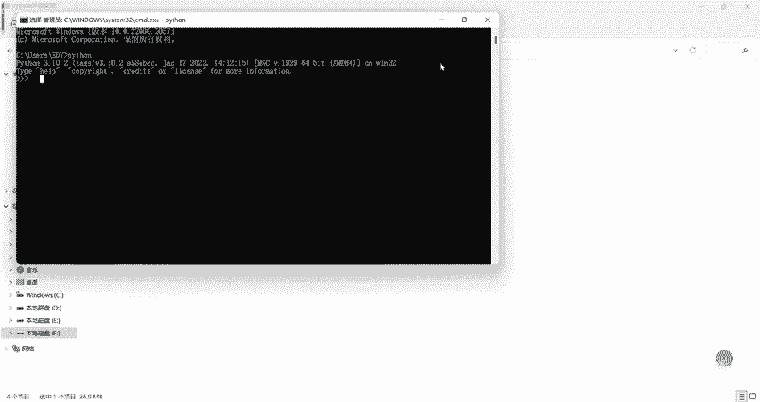

# CTF入门教学：P4：3.1 Python环境之解释器安装 🐍

在本节课中，我们将要学习如何安装CTF工具学习与开发的基础环境——Python解释器。这是后续所有Python相关工具和脚本运行的前提。

---

## 安装前的准备

开始安装前，需要明确需要安装的两个核心软件：**Python解释器**和**PyCharm开发工具**。本节我们将专注于第一个软件——Python解释器的安装。

## 下载Python解释器

以下是下载Python解释器的具体步骤。



1.  访问Python官方网站。
2.  在下载页面，根据你的操作系统选择对应的版本。
    *   如果是Windows系统，点击“Windows”选项。
    *   如果是macOS系统，点击“macOS”选项。
3.  选择具体的Python版本。
    *   **重要提示**：如果你的电脑操作系统是Windows 7或更早版本，需要选择**Python 3.7以下**的版本，因为更高版本不支持这些旧系统。



为了节省时间，教程中已预先将安装文件下载到本地。你看到的文件就是Python解释器的安装程序。






## 安装Python解释器

下载完成后，即可开始安装。整个过程非常简单。

1.  双击运行下载好的安装程序。
    
2.  在安装向导中，**务必勾选“Add Python to PATH”选项**。这一步至关重要，它会把Python添加到系统环境变量中。如果不勾选，你将无法在命令行终端（如CMD）中直接运行Python。
    
3.  点击“Customize installation”进行自定义安装，然后点击“Next”。
4.  选择安装路径。建议路径中**不要包含中文**，以避免未来可能出现的兼容性问题。例如，可以安装在`C:\Python`目录下。
    
5.  点击“Install”开始安装。安装过程非常迅速。
    
6.  安装完成后，点击“Close”。

## 验证安装

安装完成后，需要验证Python解释器是否成功安装并配置好环境变量。

1.  在电脑左下角的开始菜单上点击右键，选择“运行”。
2.  输入 `cmd` 并回车，打开命令提示符窗口。
3.  在命令行中输入以下命令并按回车：
    ```bash
    python
    ```
4.  如果安装成功，命令行会显示Python的版本信息并进入交互模式（提示符变为`>>>`），如下图所示：
    


至此，第一个核心软件——Python解释器已安装完毕。

---



本节课中我们一起学习了如何从官网下载并正确安装Python解释器，重点在于安装时勾选“Add Python to PATH”以及验证安装结果。这是搭建CTF Python学习环境的第一步。