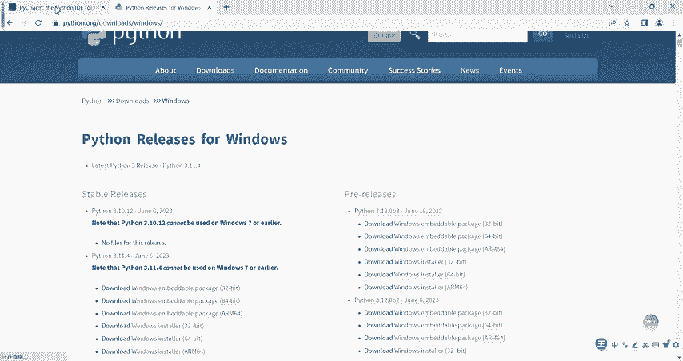
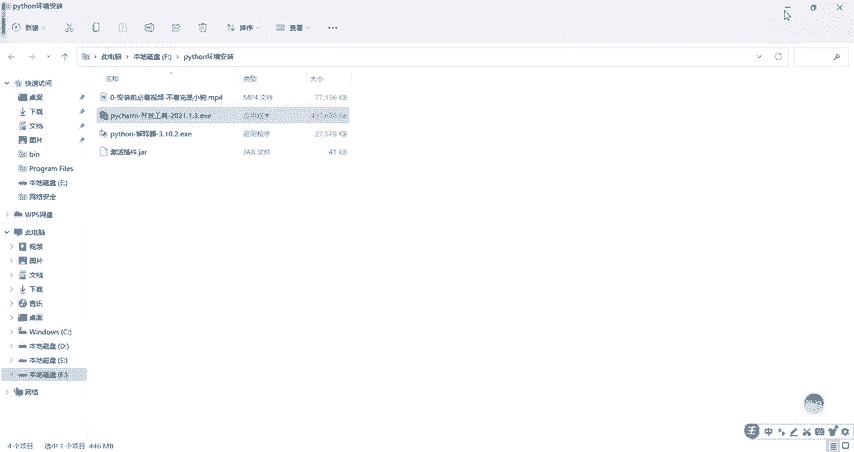
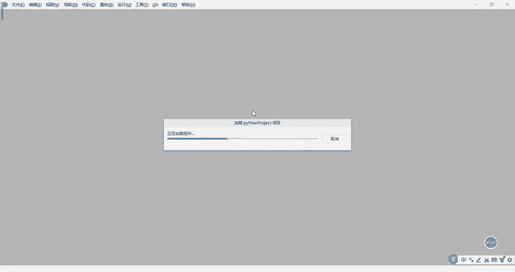
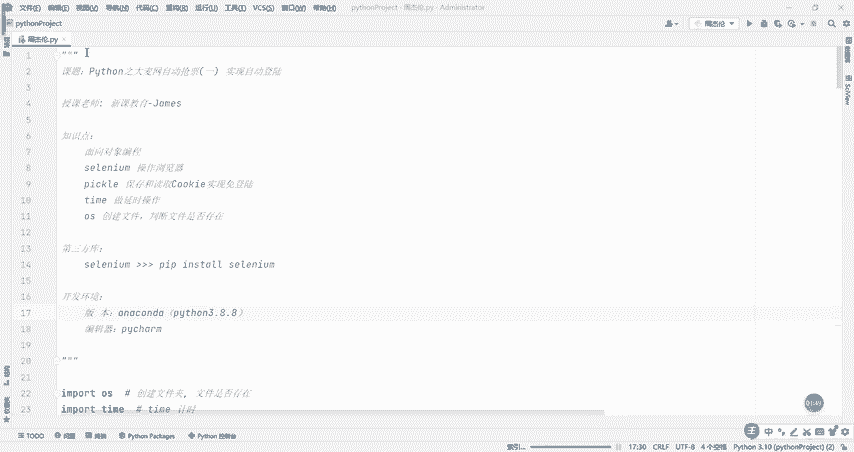
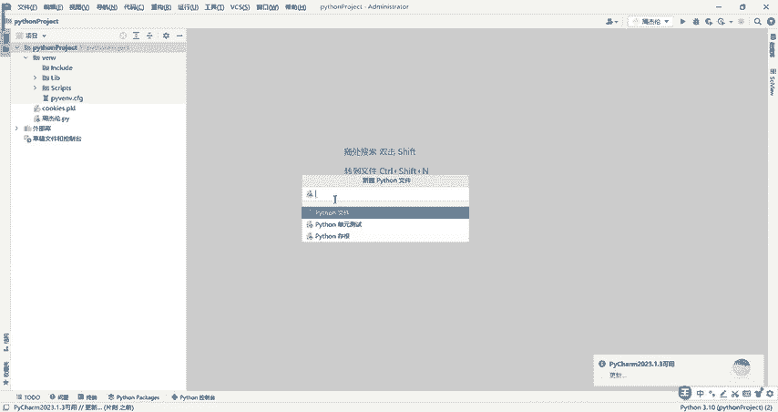
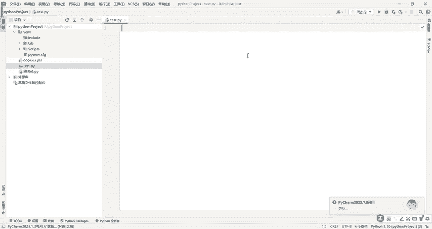

# CTF入门教学：P5：3.2 Python环境之PyCharm软件安装 🛠️

在本节课中，我们将要学习如何安装PyCharm，这是一款功能强大的Python代码编辑器，是进行CTF竞赛和Python编程的得力助手。

上一节我们介绍了Python解释器的安装，本节中我们来看看如何安装和配置代码编辑器PyCharm。

## 下载PyCharm安装包



首先，我们需要获取PyCharm的安装程序。请访问官方网站，找到“Download”按钮并点击。所有课程中用到的软件安装包，我们已整理在评论区，你可以根据需要前往获取。


## 安装PyCharm

将安装包下载到本地电脑后，即可开始安装。以下是安装步骤：


1.  双击运行下载好的安装程序。
2.  安装向导启动后，点击“Next”继续。
3.  选择安装路径。为方便起见，建议使用默认安装目录。点击“Next”。
4.  在安装选项界面，建议勾选全部四个选项。点击“Next”。
5.  点击“Install”开始安装。安装过程通常需要10到50秒，具体时间取决于电脑配置。


安装进度条完成后，点击“Next”。系统可能会询问是否重启电脑，选择“稍后重启”或直接点击“Finish”即可。



## 启动与验证安装

安装完成后，桌面会出现PyCharm的快捷方式。双击该图标即可启动软件。首次启动加载可能会稍慢。


软件成功启动后，会显示欢迎界面或关联的工作目录，这表示开发工具已安装成功。





为了验证安装，我们可以创建一个Python文件并编写简单代码。以下是操作步骤：


1.  在项目区域右键，选择“New” -> “Python File”。
2.  输入文件名，例如 `test`，然后按回车。
3.  在打开的编辑器中，即可开始编写Python代码。

例如，输入以下代码并运行：
```python
print("Hello, CTF!")
```




## 关于软件激活

本教程的核心是指导安装。关于PyCharm的激活步骤，我们会在后续内容中专门讲解。请关注相关章节。




本节课中我们一起学习了PyCharm编辑器的下载、安装和基本验证过程。你已经成功搭建了Python编程环境的核心部分。接下来，我们就可以在这个强大的工具中编写和调试CTF竞赛所需的Python脚本了。