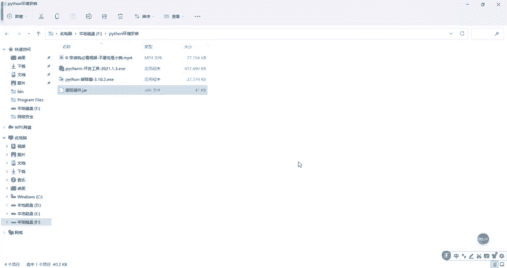
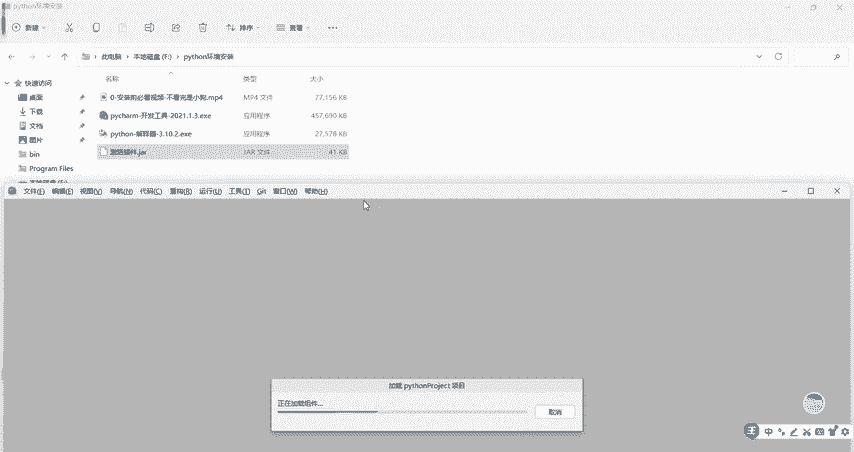
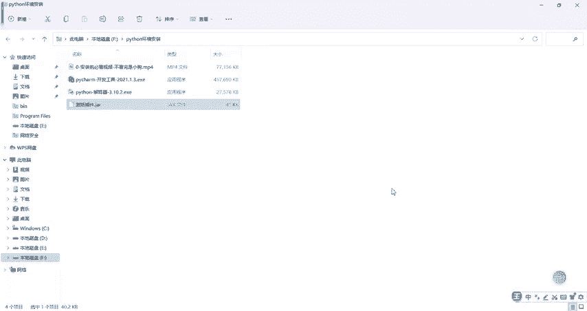

# CTF工具使用教程：P6：3.3：Python环境之Pycharm激活及汉化

在本节课中，我们将学习如何激活PyCharm专业版，使其可以永久免费使用，以及如何将英文界面汉化为中文。整个过程简单明了，适合初学者操作。

上一节我们介绍了Python环境的搭建，本节中我们来看看如何配置PyCharm这个强大的开发工具。

## 激活PyCharm专业版

如何永久激活PyCharm专业版？方法非常简单。我们使用一个激活插件来完成。

以下是激活步骤：
1.  获取激活插件。该插件已打包，可在视频评论区找到下载链接。
2.  打开PyCharm，将下载好的激活插件文件直接拖拽到PyCharm的窗口中。
3.  此时，PyCharm会提示插件已更新，并自动重启。
4.  重启后，PyCharm专业版即被成功激活，可以永久使用。

## 汉化PyCharm界面

激活完成后，有些用户可能希望使用中文界面。将英文版PyCharm汉化的方法同样简单。

以下是汉化步骤：
1.  点击菜单栏的 **File**（文件），然后选择 **Settings**（设置）。
2.  在打开的设置窗口中，找到左侧的 **Plugins**（插件）选项。
3.  在插件市场的搜索框中，输入关键词 `chinese`。
4.  在搜索结果中找到名为 **Chinese (Simplified) Language Pack** 的插件，点击其旁边的 **Install**（安装）按钮。
5.  安装完成后，根据提示重启PyCharm。
6.  重启后，PyCharm的界面就会变为中文。

本节课中我们一起学习了PyCharm的激活与汉化方法。通过以上步骤，你可以获得一个功能完整且界面熟悉的PyCharm专业版开发环境。本教程用到的所有激活插件和软件包均已整理，可在相关视频的评论区获取。