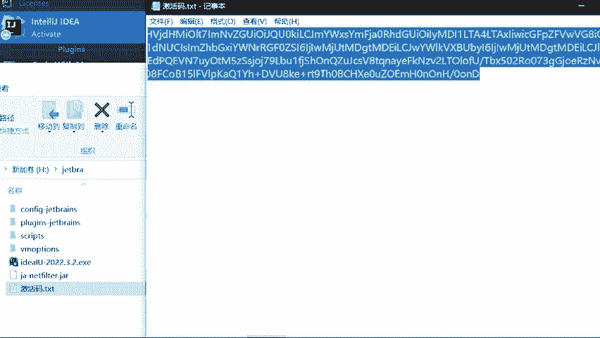
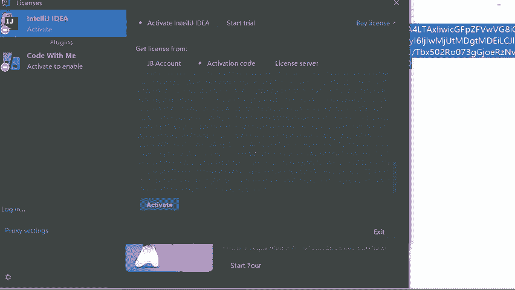

# CTF工具使用教程：P7：IntelliJ IDEA 最新专业版安装使用教程

在本节课中，我们将学习如何安装和配置IntelliJ IDEA最新专业版，这是一款功能强大的集成开发环境，对于CTF比赛中编写和调试代码非常有帮助。


## 概述

IntelliJ IDEA是一款由JetBrains开发的Java集成开发环境，同时也支持多种其他语言。在CTF比赛中，它可以帮助我们高效地编写、调试和分析代码，尤其是在逆向工程和漏洞利用开发中。本节教程将引导你完成从下载到基本使用的全过程。

上一节我们介绍了CTF比赛中常用的其他工具，本节中我们来看看如何设置一个强大的代码开发环境。

## 安装步骤

以下是安装IntelliJ IDEA专业版的具体步骤。

1.  **访问官方网站**：首先，需要访问JetBrains的官方网站。
2.  **下载安装程序**：在网站上找到IntelliJ IDEA Ultimate（专业版）的下载链接。
3.  **运行安装程序**：下载完成后，运行安装程序并按照向导提示进行操作。
4.  **选择安装选项**：在安装过程中，可以选择创建桌面快捷方式、关联文件类型等选项。
5.  **完成安装**：等待安装程序完成所有文件的复制和设置。

安装完成后，你可以在开始菜单或桌面上找到IntelliJ IDEA的启动图标。

## 基本配置与使用

成功安装后，首次启动IntelliJ IDEA需要进行一些初始配置。


1.  **选择主题**：启动后，你可以选择喜欢的界面主题，例如深色或浅色模式。
2.  **安装插件**：为了支持CTF相关开发，你可能需要安装一些有用的插件，例如Python、Go语言支持或反汇编插件。
3.  **创建新项目**：点击“New Project”来创建一个新项目，选择对应的项目类型和SDK。
4.  **编写代码**：在项目中创建新的Java、Python或其他语言的文件，开始编写你的CTF解题代码。


一个简单的Java程序结构如下所示：
```java
public class HelloCTF {
    public static void main(String[] args) {
        System.out.println("Hello, CTF!");
    }
}
```

## 核心功能简介




IntelliJ IDEA提供了许多强大功能来辅助CTF比赛。

*   **智能代码补全**：编辑器可以根据上下文提供精准的代码补全建议。
*   **强大的调试器**：你可以设置断点，逐行执行代码，并查看变量的实时值，这对于分析程序逻辑至关重要。
*   **版本控制集成**：内置了对Git等版本控制系统的支持，方便管理代码版本。
*   **数据库工具**：可以直接在IDE中连接和操作数据库，这在Web类题目中很有用。



## 总结


本节课中我们一起学习了IntelliJ IDEA专业版的安装与基本使用方法。我们完成了从下载安装、初始配置到创建项目、编写代码的全过程，并简要介绍了其在CTF比赛中的一些核心应用功能。掌握这款强大的IDE，将能显著提升你在CTF比赛中编写和调试代码的效率。下一节，我们将介绍另一款在CTF中常用的工具。