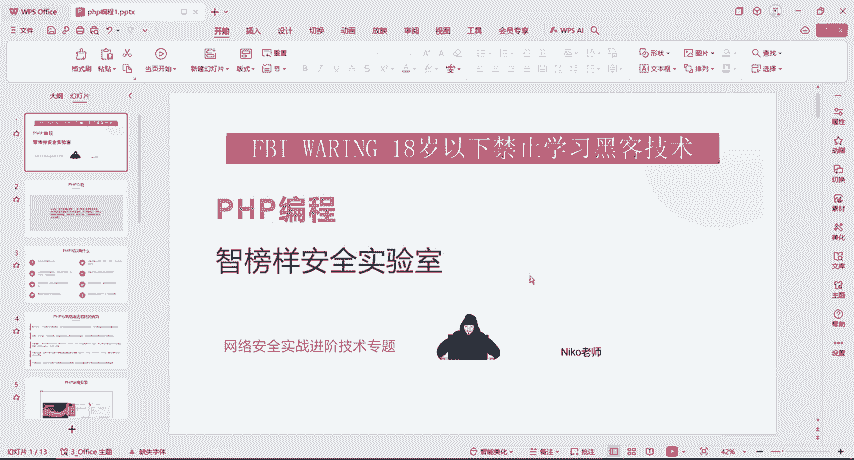
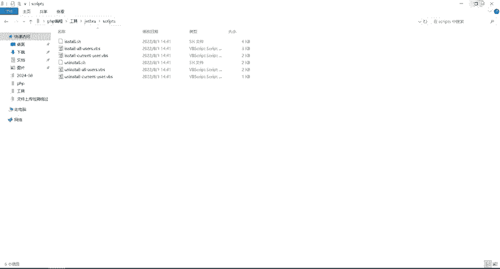
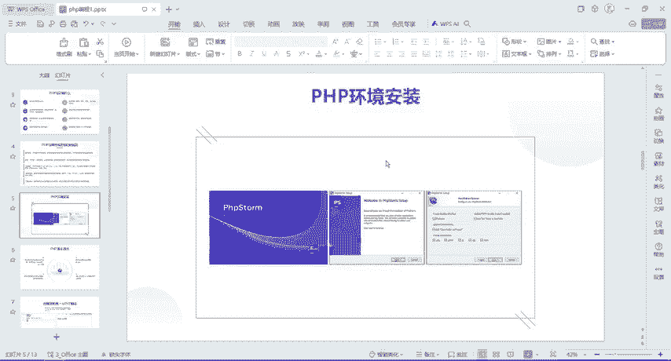

# CTF入门教学：P8：5.1、PHP介绍及环境安装 🛠️

在本节课中，我们将要学习PHP的基础介绍以及如何在你的计算机上安装和配置PHP开发环境。这是进行Web安全学习和CTF比赛的重要第一步。

## PHP介绍

PHP是一种通用的开源脚本语言，全称为“超文本预处理器”。它与C语言类似，是常用于网站开发的编程语言。PHP易于学习，使用广泛，主要应用于Web开发领域。

PHP可以执行多种任务，例如动态生成网页内容、在服务器上创建、打开、读取、写入和关闭文件等。

## PHP的优势

与其他编程语言（如Java、Python等）相比，PHP具有以下优势：
*   **易于学习**：语法相对简单，入门门槛较低。
*   **开源项目**：可以免费使用和修改。
*   **可移植性高**：支持多种操作系统和Web服务器。
*   **性能快速**：作为脚本语言，其执行速度通常较快。
*   **社区广阔**：拥有世界范围内的开发者社区支持，易于找到帮助和文档。

## PHP环境安装

上一节我们介绍了PHP的基本概念，本节中我们来看看如何安装PHP集成开发环境。我们将使用一个名为PhpStorm的集成开发环境（IDE）进行安装演示。

安装过程非常简单，主要步骤如下：
1.  运行安装程序（`.exe`文件）。
2.  在安装向导中，持续点击“下一步”即可完成安装。

安装完成后，桌面会出现PhpStorm的快捷方式。

## 软件激活与破解

新安装的PhpStorm有30天的免费试用期。若要长期使用，需要进行激活。以下是激活步骤的详细说明。

工具包中提供了必要的破解文件（一个ZIP压缩包）和激活码。首先，解压该ZIP文件。

解压后，进入 `script` 文件夹。该文件夹内包含用于管理软件权限的程序。

以下是具体的操作步骤列表：
1.  首先运行 `uninstall` 程序。此操作将卸载所有用户权限。双击运行，在弹出的窗口中点击“确定”。
2.  然后运行 `install` 程序。此操作将为所有用户安装权限。双击运行，等待程序执行完成并弹出提示窗口。

激活程序执行完毕后，打开PhpStorm软件。此时会弹出激活窗口。

在激活窗口中，选择第二项“激活码”方式。打开工具包中提供的“激活码.txt”文件，全选（`Ctrl+A`）并复制（`Ctrl+C`）里面的激活码。

将复制的激活码粘贴（`Ctrl+V`）到PhpStorm激活窗口的输入框中。如果激活码有效，输入框会变为绿色，并且“激活”按钮会变为可点击的蓝色状态。

点击“激活”按钮。如果成功，界面将显示激活信息，例如有效期至2025年（实际可使用至2099年）。若激活失败（按钮不可点击），请返回 `script` 文件夹，重新执行卸载和安装步骤，然后再次尝试激活。

未来如果软件提示过期，可以重复此激活过程。

激活成功后，即可开始使用PhpStorm进行PHP开发。

## 总结

本节课中我们一起学习了PHP语言的基本概念、其主要优势，并完成了PhpStorm开发环境的安装与激活。现在，你已经拥有了一个功能强大的PHP开发工具，为后续的CTF学习和Web安全实践打下了基础。