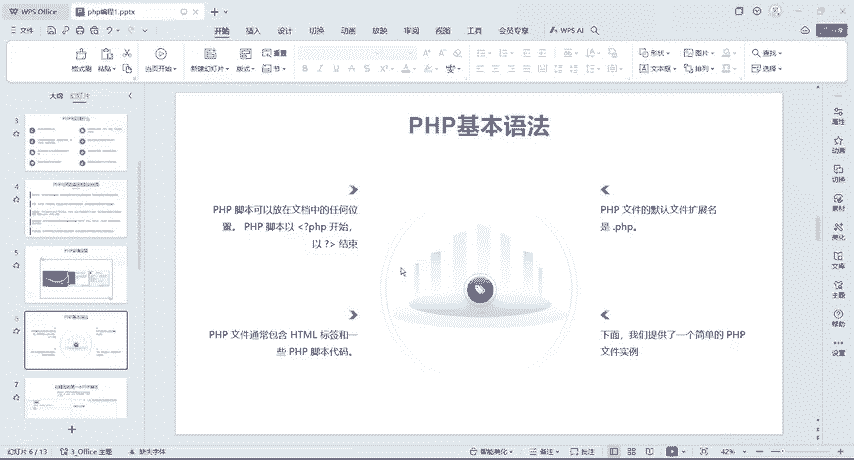
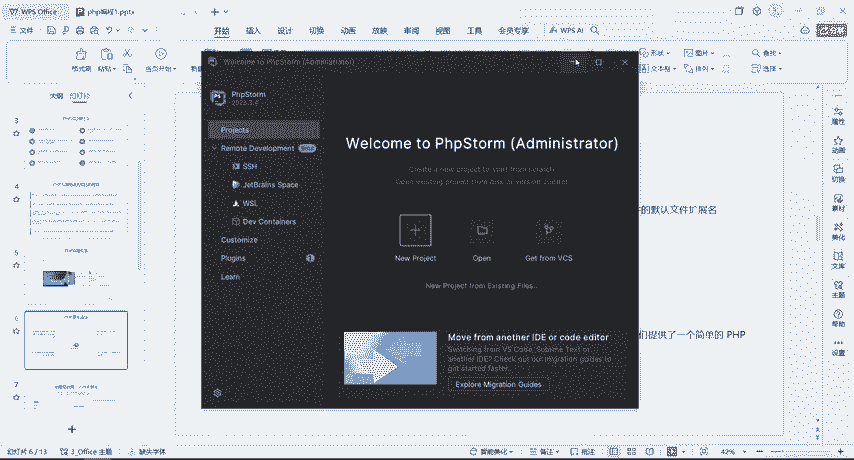
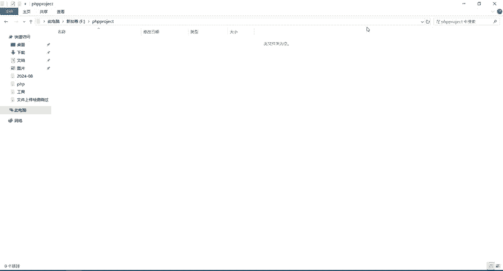
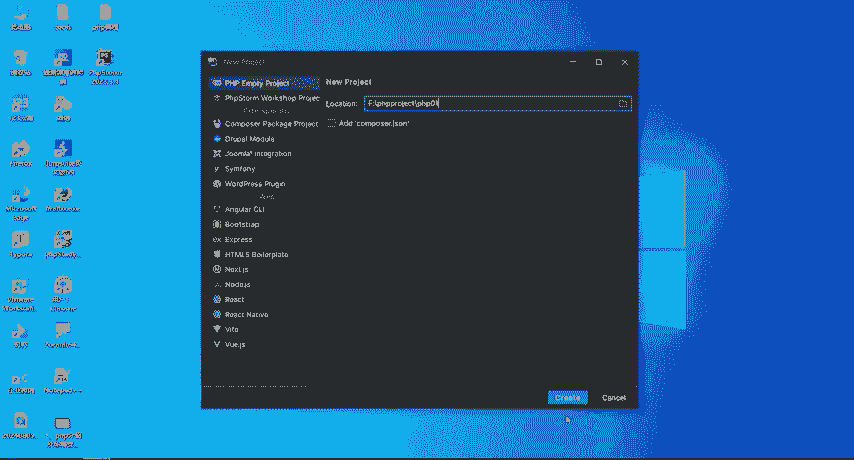

# CTF入门教学：P9：5.2、PHP第一个程序及工具使用 🚀



在本节课中，我们将要学习如何编写并运行第一个PHP程序，同时熟悉PHP开发工具的基本配置和使用方法。

## 概述



上一节我们成功安装了PHP环境。本节中，我们来看看PHP的基础语法，并动手创建和运行第一个PHP脚本，同时解决在配置过程中可能遇到的常见问题。

## PHP脚本基础

PHP脚本可以放在文档中的任何位置。脚本以 `<?php` 开始，以 `?>` 结束。PHP文件的默认扩展名是 `.php`。一个PHP文件通常包含HTML标签和PHP脚本代码。





以下是输出文本到浏览器的两种基本指令：
*   **`print`**：不推荐使用。
*   **`echo`**：一般使用此指令。

## 创建第一个PHP项目

接下来，我们开始创建项目并编写代码。

### 创建项目


以下是创建新项目的步骤：
1.  点击 `New Project`。
2.  选择 `PHP Empty Project`。
3.  选择项目存放路径（建议不要放在C盘）。
4.  在路径后添加项目名称，例如 `PHP01`。
5.  点击 `Create` 完成创建。

### 配置开发环境

创建项目后，需要对开发环境进行一些调整以方便使用。

以下是界面和字体调整步骤：
1.  点击 `View`，勾选显示菜单栏。
2.  点击 `Settings` (或 `File` -> `Settings`)。
3.  在 `Appearance & Behavior` -> `Appearance` 中，将主题改为 `Light`。
4.  在 `Editor` -> `Font` 中，调整字体大小（例如设为18）和行高。

### 创建PHP文件

环境配置好后，开始创建PHP脚本文件。

以下是创建PHP文件的步骤：
1.  在项目目录上右键，选择 `New` -> `PHP File`。
2.  输入文件名，如 `index.php`，工具会自动补全 `.php` 后缀和 `<?php` 起始标签。

## 编写并运行第一个脚本

现在，我们来编写第一个PHP程序。

在 `index.php` 文件中，使用 `echo` 指令输出一段文本。代码如下：
```php
<?php
echo "你好";
?>
```
代码说明：
*   `echo` 用于输出内容。
*   要输出的字符串需放在双引号 `"` 或单引号 `'` 内。
*   语句以分号 `;` 结尾。
*   脚本结束标签 `?>` 可以省略。

编写完成后，按 `Ctrl + S` 保存文件。

## 配置与运行

保存文件后，需要配置解释器和浏览器才能正确运行。

### 配置PHP解释器

如果运行时出现 `502` 错误或提示解释器未配置，需要手动设置。

以下是配置PHP解释器的步骤：
1.  点击 `File` -> `Settings`。
2.  选择 `PHP` 选项。
3.  点击解释器路径旁的 `...` 按钮。
4.  找到并选择 `phpstudy` 安装目录下的对应PHP版本的可执行文件（如 `php.exe`）。
5.  在 `CLI Interpreter` 下拉菜单中选择对应的PHP版本（如5.6）。
6.  点击 `Apply` 和 `OK`。

### 配置浏览器并运行

解释器配置好后，即可配置默认浏览器并运行脚本。

以下是配置和运行步骤：
1.  在代码编辑区右键，选择 `Run ‘index.php’`，或在工具栏点击运行按钮。
2.  如果未配置浏览器，工具会提示。点击 `Fix`，在弹出窗口中粘贴或选择你电脑上浏览器的可执行文件路径（如Chrome的 `chrome.exe`）。
3.  配置成功后，再次运行，浏览器将打开并显示输出的“你好”。

## 总结


本节课中我们一起学习了PHP脚本的基本结构，使用开发工具创建了第一个PHP项目，编写了输出“你好”的简单程序，并解决了PHP解释器和浏览器的配置问题。现在，你已经成功搭建了PHP开发环境并运行了第一个脚本，为后续更复杂的CTF Web题目学习打下了基础。