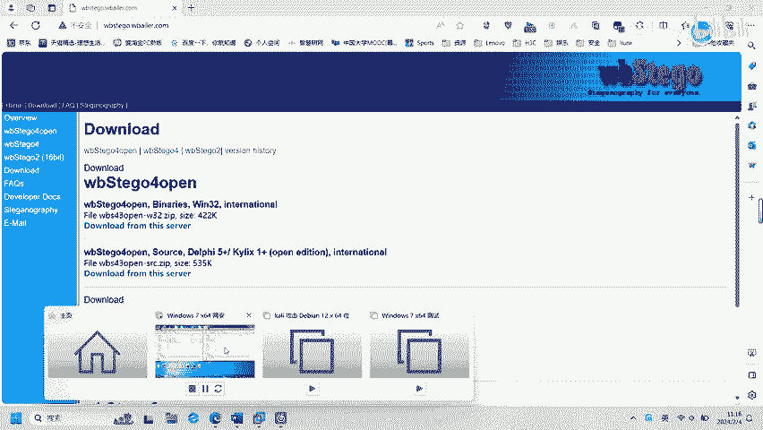
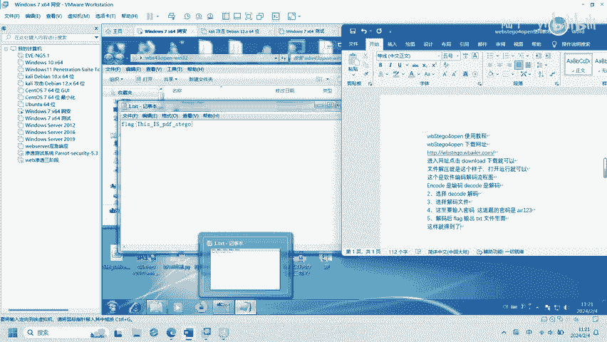

# CTF PDF隐写：P1：wbStego4open工具使用教程 🕵️

在本教程中，我们将学习如何使用 **wbStego4open** 工具在CTF竞赛中完成PDF文件的隐写术挑战。我们将从工具的基本介绍开始，逐步讲解如何安装、配置以及使用它来隐藏和提取PDF文件中的秘密信息。

---

## 工具简介与安装 🛠️

上一节我们介绍了本教程的目标，本节中我们来看看 **wbStego4open** 是什么以及如何获取它。

**wbStego4open** 是一个用于在PDF文件中进行隐写（信息隐藏）的开源工具。它允许用户将数据嵌入到PDF文档中，而不会明显改变文档的外观，这在CTF的隐写类题目中非常常见。

以下是获取该工具的步骤：

1.  访问其官方GitHub仓库进行下载。
2.  下载完成后，解压压缩包到本地目录。
3.  工具无需安装，可直接在命令行中运行可执行文件。

---

## 基本使用方法 📖

了解了工具的获取方式后，本节我们将学习其核心的嵌入与提取数据功能。



该工具主要通过命令行操作，其基本命令结构为：`wbStego4open.exe [选项]`。最常用的两个功能是“编码”（隐藏信息）和“解码”（提取信息）。

以下是主要的命令行选项说明：

*   `-encode`：执行编码操作，将数据隐藏到PDF中。
*   `-decode`：执行解码操作，从PDF中提取隐藏的数据。
*   `-in`：指定输入的PDF文件。
*   `-out`：指定处理完成后输出的文件。
*   `-data`：指定要隐藏的文本数据文件。
*   `-carrier`：指定作为载体的PDF文件（在编码时使用）。
*   `-result`：指定编码后生成的新PDF文件。

---

## 实战演练：隐藏信息 🔒

上一节我们介绍了基本命令，现在我们来实际演练如何将一段秘密信息隐藏到一个普通的PDF文件中。

假设我们有一个名为 `normal.pdf` 的普通PDF文件，以及一个包含秘密信息 `secret.txt` 的文本文件。我们的目标是将 `secret.txt` 的内容隐藏到 `normal.pdf` 中，生成一个新的、包含隐写数据的 `stego.pdf` 文件。

操作步骤如下：

1.  打开命令行终端，并导航到 `wbStego4open.exe` 所在的目录。
2.  执行以下编码命令：
    ```bash
    wbStego4open.exe -encode -in secret.txt -carrier normal.pdf -result stego.pdf
    ```
3.  命令执行成功后，会生成 `stego.pdf` 文件。这个文件看起来与 `normal.pdf` 无异，但其中已经嵌入了我们的秘密数据。



---

## 实战演练：提取信息 🔓

成功隐藏信息后，本节我们来看看如何从隐写PDF中恢复出隐藏的秘密。

现在，我们获得了 `stego.pdf` 文件，需要从中提取出之前隐藏的 `secret.txt` 的内容。提取操作不会破坏原PDF文件。

操作步骤如下：

1.  在命令行中，确保仍在工具所在目录。
2.  执行以下解码命令：
    ```bash
    wbStego4open.exe -decode -in stego.pdf -out extracted_secret.txt
    ```
3.  命令执行后，工具会从 `stego.pdf` 中解析出隐藏数据，并保存到 `extracted_secret.txt` 文件中。打开这个文件，即可看到原始的秘密信息。

---

## 总结 📝

本节课中，我们一起学习了CTF中PDF隐写的基本工具 **wbStego4open** 的使用。

我们首先介绍了工具的获取与安装，然后讲解了其核心的编码（`-encode`）和解码（`-decode`）命令选项。通过两个实战演练，我们逐步掌握了如何将文本信息隐藏到PDF中，以及如何从包含隐写数据的PDF中提取出这些信息。掌握这个工具的使用，是解决许多CTF PDF隐写题目的关键第一步。