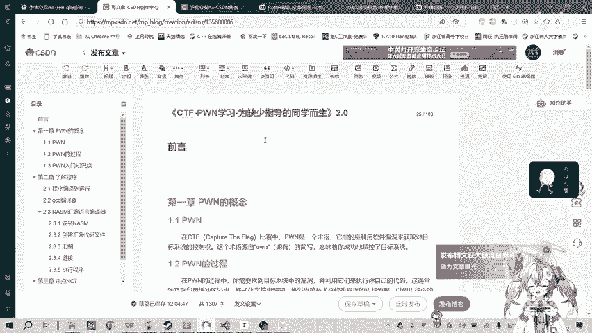
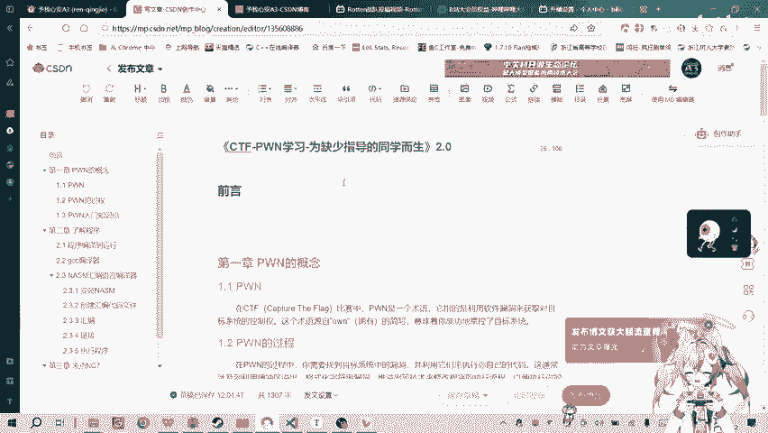
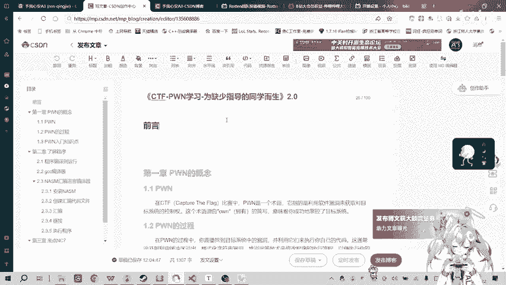
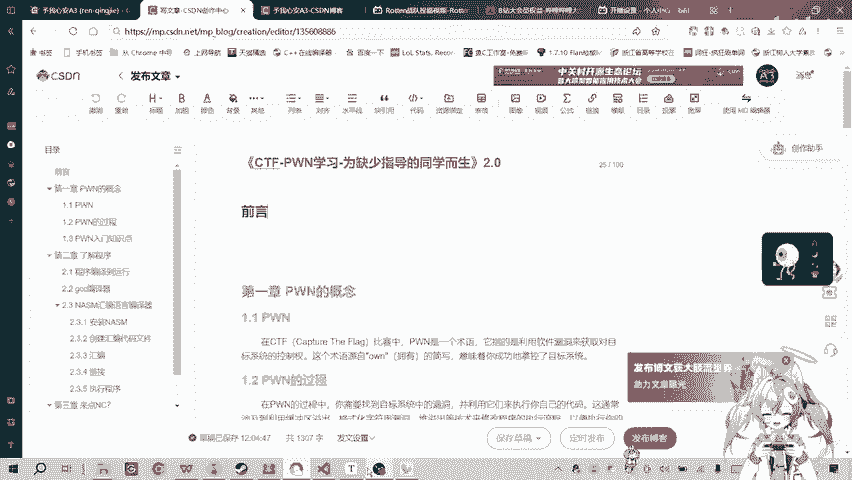

# CTF-PWN入门：2：课程更新与内容预告 🎬

在本节课中，我们将了解CTF-PWN入门系列视频第二代的更新计划与内容变化。我们将介绍新课程的形式、内容升级点以及制作背景。

大家好。今天是2024年1月22日。我带来一个消息。大家一直关注着PWN入门这个系列视频的更新情况。我上次发视频说第一代视频要停止更新了。现在，PWN入门第二代的视频已经开始准备更新了。博客等相关内容已经在撰写中。

上一节我们介绍了课程更新的背景，本节中我们来看看新课程的具体形式。

这一代视频会主要以PPT加题目解题的形式来讲解。与第一代的区别在于升级了PPT。本次教学会加入一些理论知识。第一代视频一直是做题，纯靠做题，有些理论知识的细节没有处理好。现在可以补一下，把这些知识点重新都补全。

原本设想在第二代视频中加入一些动画效果。但最近在实习，刚刚拿到三方协议。B站这边完成了大约70%的开发工作。现在可以把一些精力放在PWN学习上面了。

半年前拍摄视频的内容我都忘了，等于一切都要重新开始学。这样也好，我可以重新整理思路，相当于重新再入一次门。

以下是近半年来的情况总结。
*   感谢大家的关注。Rotten科技现在是一个有1012个粉丝的UP主。
*   感谢Rotten科技学习群里面兄弟们的不断支持和鼓励。

大家期待PWN入门第二代视频的更新吧。

本节课中我们一起学习了CTF-PWN入门第二代课程的更新消息。新课程将采用PPT与实战解题相结合的形式，并补充理论知识，旨在提供更系统化的学习体验。感谢大家的持续关注。