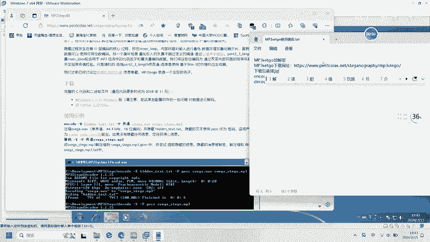
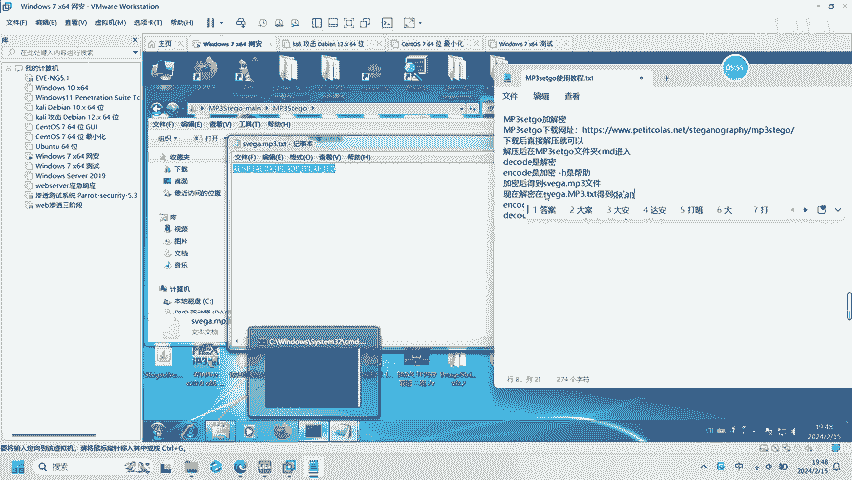

# CTF音频隐写：P1：MP3setgo工具使用教程 🎵

在本节课中，我们将学习一个在CTF音频隐写题目中常用的工具——MP3setgo。我们将了解它的基本功能、安装方法以及如何用它来分析和提取隐藏在MP3文件中的信息。

---

## 工具简介与安装 🛠️

上一节我们介绍了本课程的目标，本节中我们来看看MP3setgo工具本身。

MP3setgo是一个专门用于分析MP3文件并提取其中可能隐藏数据的工具。它能够检查MP3文件的帧结构，并尝试读取那些通常被忽略或用于存储额外信息的区域。

以下是安装MP3setgo的步骤：

1.  确保你的系统已安装Python环境。
2.  打开终端或命令提示符。
3.  使用pip命令安装：`pip install mp3stego`。

安装完成后，你就可以在命令行中使用`MP3setgo`相关的命令了。

---

## 基本使用方法 📖

了解了工具的安装后，本节我们来看看它的基本命令格式和常用参数。

MP3setgo的核心命令是`decode`。它的基本语法结构是一个固定的公式：

**`python mp3stego.py decode -X [加密MP3文件] -P [密码]`**

这个命令的含义是：使用指定的密码（`-P`参数），对加密的MP3文件（`-X`参数）进行解码，尝试提取隐藏的信息。

以下是各个参数的具体说明：

*   `-X`：指定包含隐写数据的输入MP3文件。
*   `-P`：指定解密所需的密码。这个密码通常来自题目描述或其他提示。
*   `decode`：执行解码操作的模式。

运行命令后，工具会尝试解密，并将提取出的隐藏数据（通常是文本或文件）输出到当前目录或指定的位置。

---

## 实战演练与总结 🏁

我们已经掌握了MP3setgo的基本命令，现在通过一个简单的思路回顾来巩固所学。

在CTF比赛中遇到MP3音频隐写题时，基本的解题流程是：首先，检查题目给出的MP3文件；然后，根据题目描述找到可能的密码；最后，使用MP3setgo的解码命令尝试提取隐藏的Flag。

本节课中我们一起学习了MP3setgo工具。我们了解了它的用途是解码隐藏在MP3文件中的数据，学会了通过pip安装该工具，并掌握了其核心解码命令的格式 `python mp3stego.py decode -X [文件] -P [密码]`。记住这个流程和命令，你就能应对许多基础的MP3音频隐写题目了。