# CTF之Pwn的EXP魔改：P1：EXP基础与修改入门

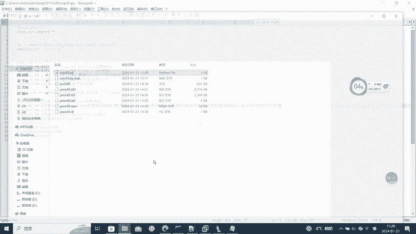

在本节课中，我们将学习CTF Pwn类题目中EXP（漏洞利用脚本）的基础知识，并掌握如何根据题目环境对现有EXP进行修改。这是Pwn入门和进阶的关键技能。

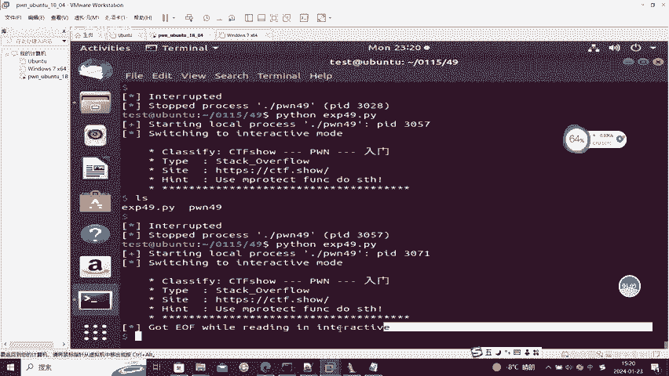

## 什么是EXP？

EXP是Exploit的缩写，指用于利用软件漏洞的脚本或程序。在CTF Pwn题目中，EXP通常是一段Python脚本，它通过构造特定的输入数据来触发目标程序的漏洞，从而获取Shell或读取Flag。

一个典型的EXP结构包含以下几个部分：
*   **建立连接**：连接到远程服务器或本地进程。
*   **构造Payload**：根据漏洞类型（如栈溢出、格式化字符串等）构造恶意数据。
*   **发送Payload**：将构造好的数据发送给目标程序。
*   **交互**：在成功利用漏洞后，与获取到的Shell进行交互。

## 为何需要修改EXP？

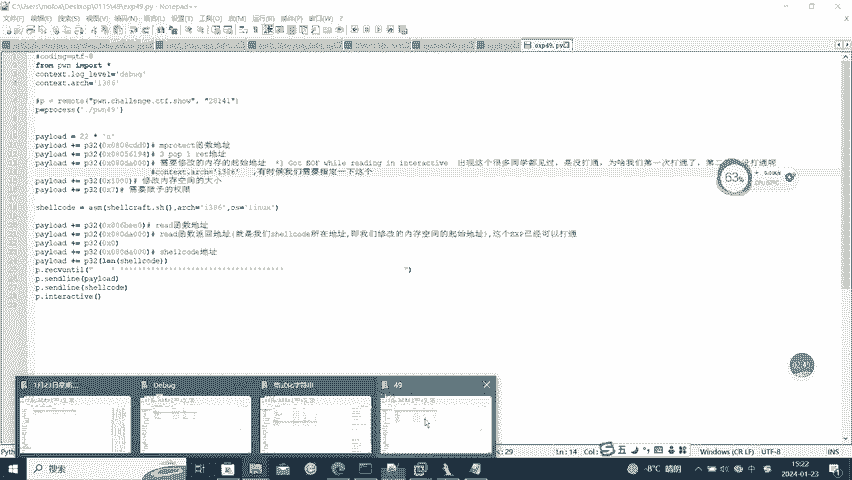

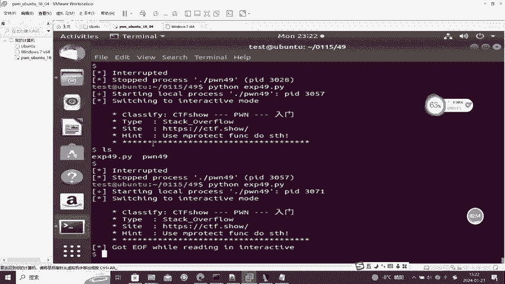

在CTF比赛中，我们常常会遇到与已知漏洞相似的题目，但直接使用公开的EXP往往无法成功。原因可能包括：
*   程序使用的**库版本不同**，导致函数地址偏移变化。
*   题目开启了不同的**安全保护机制**（如ASLR, NX）。
*   二进制文件的**编译选项**有细微差别。
*   漏洞触发点的**偏移地址**需要重新计算。

因此，学会分析题目环境并相应地修改EXP至关重要。

## EXP修改的核心步骤

以下是修改一个EXP以适应新环境的基本流程。

### 1. 分析题目环境

首先，你需要使用工具检查目标程序。关键命令包括：
*   `checksec`：查看程序开启了哪些安全保护。
    ```bash
    checksec ./pwn_challenge
    ```
*   `file`：查看程序是32位还是64位，以及是否被剥离符号。
    ```bash
    file ./pwn_challenge
    ```
*   `ldd`：查看程序动态链接了哪些库。
    ```bash
    ldd ./pwn_challenge
    ```

### 2. 确定偏移地址

偏移地址是Payload中填充数据直到覆盖关键内存位置（如返回地址）的长度。常用方法有：
*   **静态分析**：使用IDA Pro或Ghidra反汇编，计算缓冲区到返回地址的偏移。
*   **动态调试**：使用GDB配合cyclic模式生成字符串，通过崩溃时寄存器的值计算偏移。
    ```bash
    # 生成200个字符的pattern
    cyclic 200
    # 在GDB中运行程序并输入pattern，崩溃后查看RIP/EIP的值
    # 使用cyclic -l <崩溃时RIP的值> 计算偏移
    cyclic -l 0x6161616c
    ```

### 3. 获取关键地址

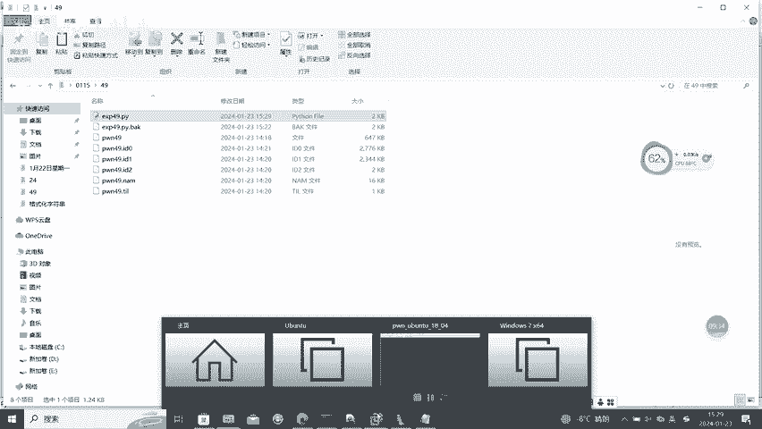

许多EXP依赖于特定的内存地址，如`system`函数地址、`"/bin/sh"`字符串地址或`libc`基地址。获取方法：
*   **题目提供libc**：如果题目提供了`libc.so`文件，可以在本地计算偏移。
    ```python
    # 假设已知libc中system偏移为0x52290
    libc_base = leak_address - libc_function_offset
    system_addr = libc_base + 0x52290
    ```
*   **使用DynELF**：在未提供libc时，可利用pwntools的`DynELF`模块动态解析地址（适用于有信息泄露漏洞的题目）。
*   **GOT表泄露**：通过泄露GOT表中某个已调用函数的地址，反推libc基址。

### 4. 调整Payload结构

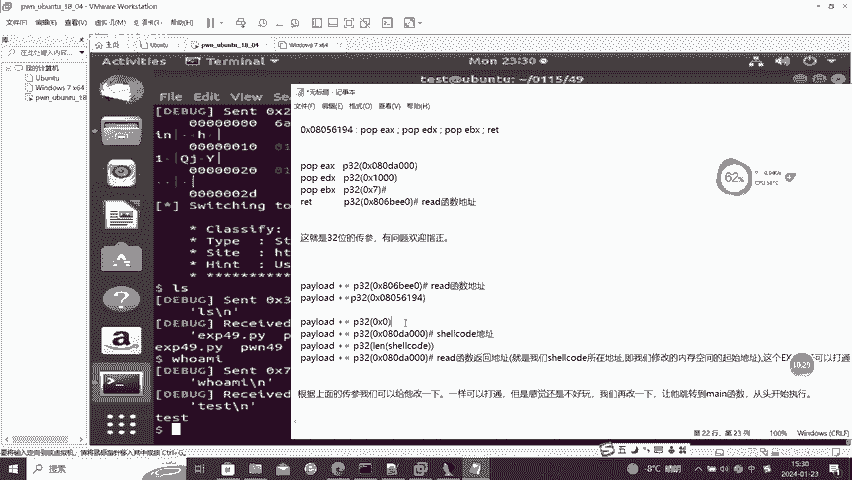

根据分析结果，调整原EXP中Payload的构造逻辑。主要修改点：
*   **填充长度**：根据新计算的偏移修改`padding`的长度。
*   **ROP链**：如果使用ROP（面向返回编程），需要根据新地址调整gadget链。
*   **字符串地址**：更新`"/bin/sh"`等字符串在内存中的实际地址。

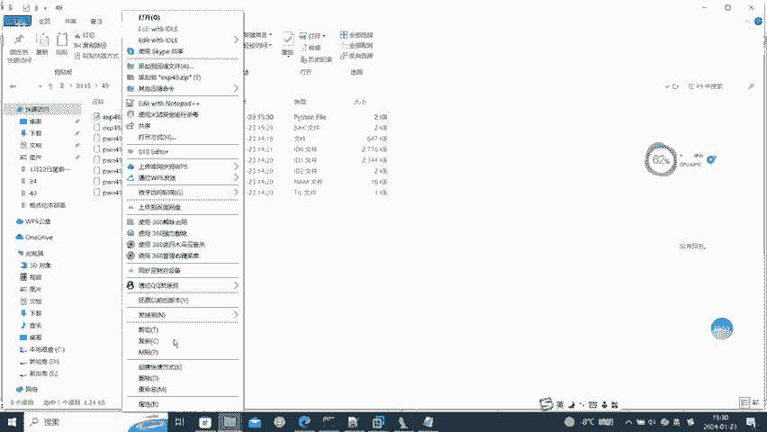

### 5. 处理保护机制

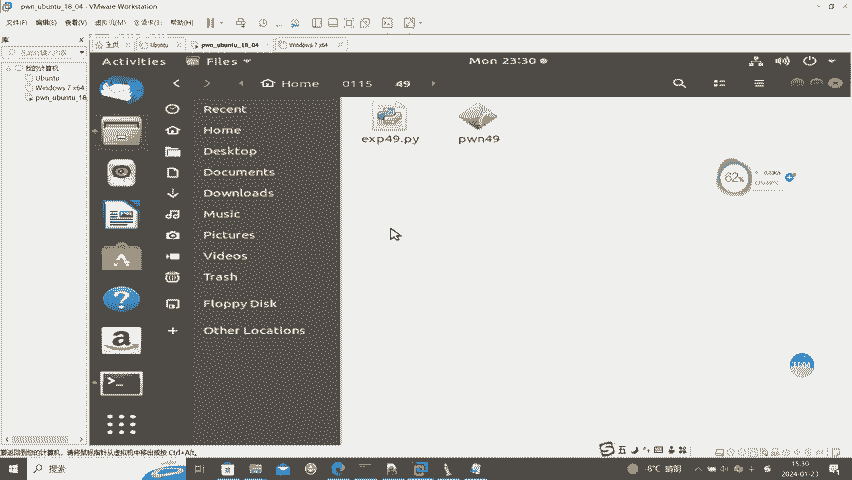

针对不同的保护机制，EXP需要相应调整：
*   **NX（不可执行栈）**：使用ROP或ret2libc技术，将执行流导向已有的可执行代码段。
*   **ASLR（地址空间布局随机化）**：需要先通过漏洞泄露一个内存地址，计算出随机化偏移。
*   **Stack Canary**：需要先泄露或绕过Canary值，才能覆盖返回地址。

## 一个简单的修改示例

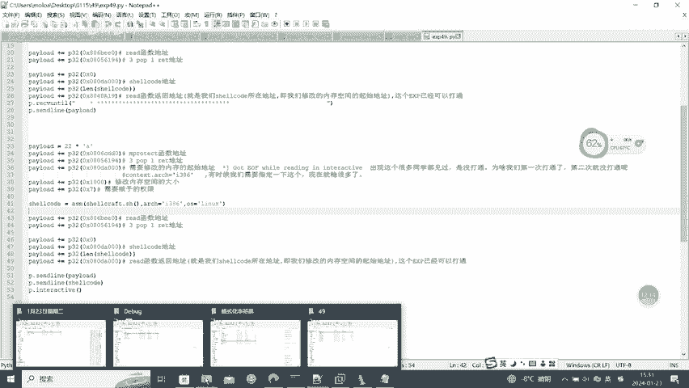

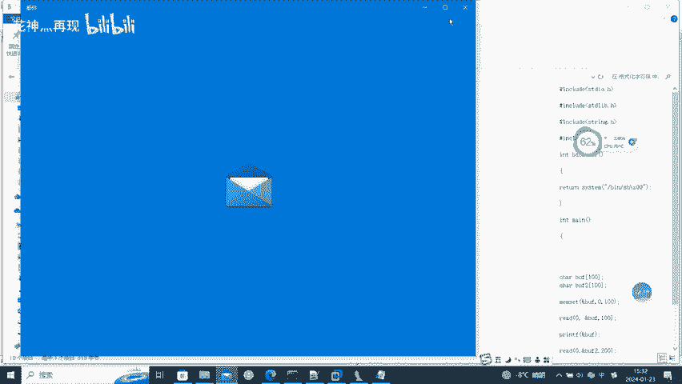

假设我们有一个旧的栈溢出EXP模板，但新题目的偏移和`system`地址变了。

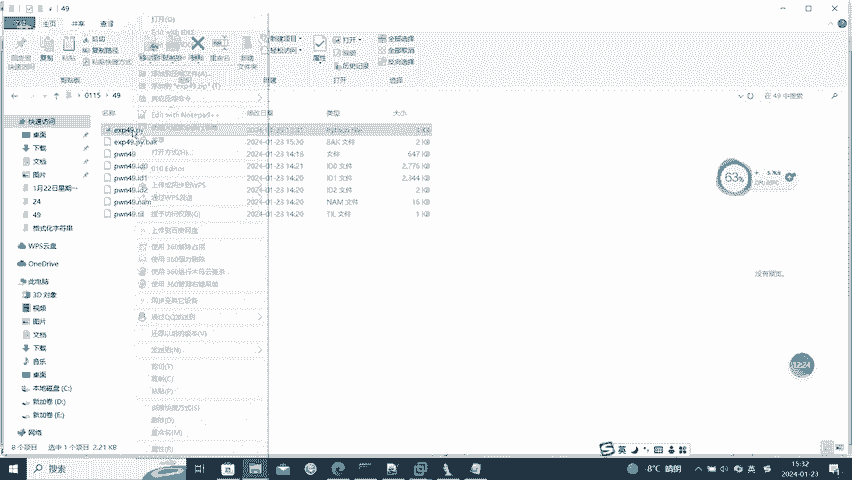

原始EXP关键部分可能如下：
```python
offset = 72
system_addr = 0xf7e13660
binsh_addr = 0xf7f5f0d5

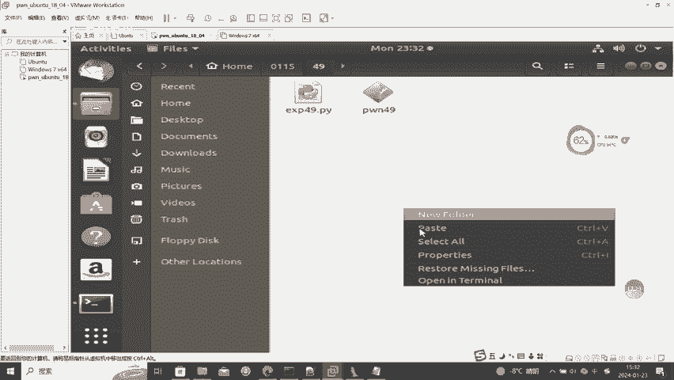

payload = b'A' * offset + p32(system_addr) + p32(0xdeadbeef) + p32(binsh_addr)
```

经过分析新题目后，我们修改为：
```python
# 新计算的偏移是 88
offset = 88
# 通过泄露的puts地址计算出的新system地址
system_addr = libc_base + 0x52290
# 在libc中找到的"/bin/sh"字符串地址
binsh_addr = libc_base + 0x1d8698

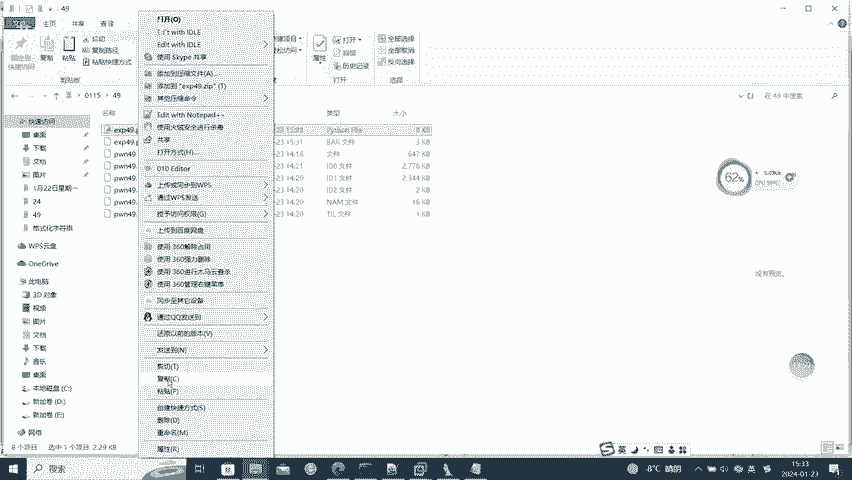

payload = b'A' * offset + p64(system_addr) + p64(0) + p64(binsh_addr) # 注意变为64位，使用p64
```

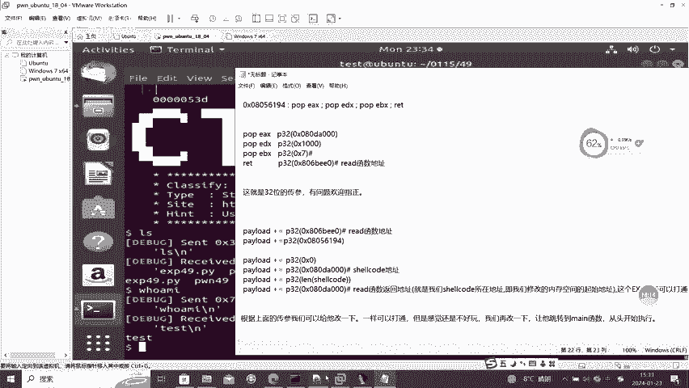

## 总结

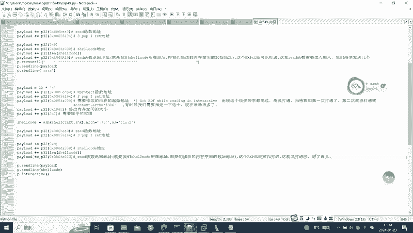

本节课中，我们一起学习了CTF Pwn中EXP的基础概念和修改方法。核心要点包括：理解EXP的组成部分，掌握分析题目环境的工具，学会计算偏移和获取关键地址，并能根据不同的保护机制调整Payload。记住，修改EXP是一个分析、调试、验证的循环过程。下一节，我们将通过一个实际案例，演示完整的EXP魔改流程。