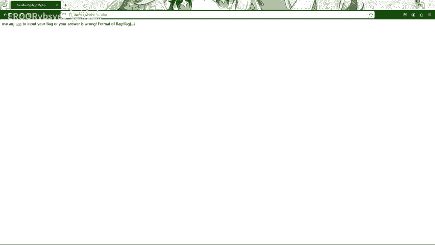
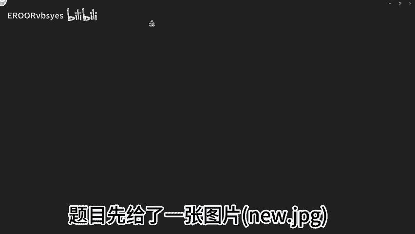
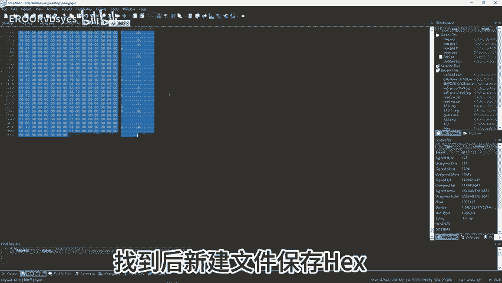
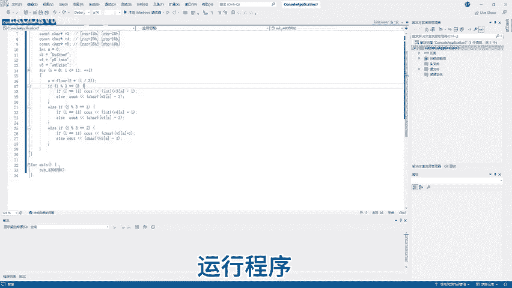
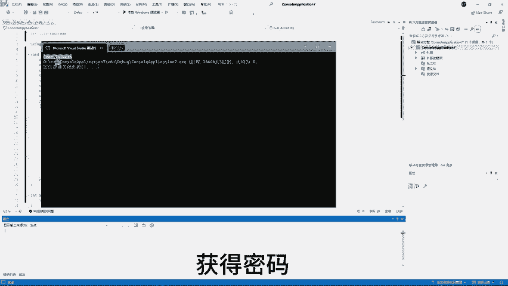
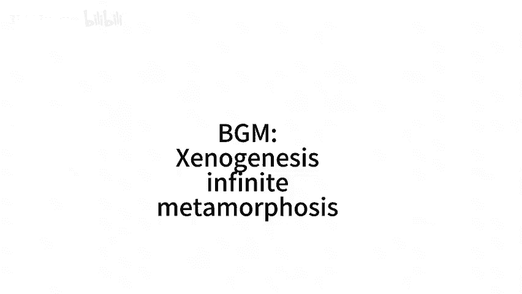

# CTF逆向实战（含杂项）：P1：EROORvbsyes

在本教程中，我们将学习如何解决一道结合了杂项（Misc）和逆向工程（Reverse）的CTF题目。我们将从一张图片开始，逐步分析并提取出隐藏的可执行文件，最终逆向分析其逻辑，找到正确的密码（flag）。整个过程将涉及文件分析、二进制数据提取和逆向工程基础。

## 文件初步分析 🕵️

首先，我们获得了一张名为 `anEW.JP` 的图片。







我们首先查看该图片的文件属性。使用 `xxd` 指令查看图片的二进制内容。通过观察，可以在文件尾部发现一些异常的文本数据，这提示我们图片中可能隐藏了其他文件。

## 提取隐藏文件 🔍

为了更清晰地分析，我们使用十六进制编辑器 `010 Editor` 打开图片文件。在文件中寻找可执行文件（如ELF）的文件头（例如 `7F 45 4C 46`）。找到后，将文件头之后的数据部分提取出来，并保存为一个新文件。



再次使用 `xxd` 指令查看新文件的二进制内容以作确认。接着，使用 `file` 指令查看该文件的类型。结果显示，这是一个可在 Linux 平台运行的 ELF 可执行文件。


## 逆向分析可执行文件 ⚙️

确认文件类型后，我们使用逆向分析工具 `IDA Pro` 打开这个 ELF 文件。该程序是64位的，因此需要使用64位的IDA打开。找到程序的入口函数 `main`，并查看其流程图。

现在，我们运行程序以了解其基本逻辑。程序运行后，会提示输入密码。我们尝试随意输入，但程序没有任何回显（输出）。

## 修复程序回显 🔧

回到IDA中，按下 `F5` 键查看反编译后的伪C代码。可以发现，有一处条件判断阻止了程序的正常回显。对应的汇编代码是 `JNZ`（Jump if Not Zero）跳转。

接下来，我们定位到该跳转指令所在的地址。原始的汇编代码是 `JNZ short loc_400866`。我们将此条件跳转修改为无条件跳转 `JMP`，或者直接将其 `NOP`（空操作）掉。修改后保存程序。

再次执行修改后的程序，此时程序能够正常显示输入提示和错误信息了。

## 定位密码验证逻辑 🔑

现在可以推测，正确的flag很可能就是程序验证的密码。我们需要找到密码的生成或验证算法。

在反编译的代码中，可以发现一个主要的判断函数 `sub_4006FD`。在 `test eax, eax` 比较指令的下方有 `JNZ` 跳转，说明该函数会返回一个布尔类型的结果，用于判断密码是否正确。

那么，`sub_4006FD` 函数就是关键的密码验证函数。我们需要分析这个函数的内部逻辑。

## 解析密码生成算法 🧮

分析 `sub_4006FD` 函数，我们可以还原出密码的生成算法。以下是该算法核心逻辑的还原代码（示例为C语言风格）：

```c
// 假设的密码生成逻辑
for (int i = 0; i < input_length; i++) {
    transformed_char = (input[i] ^ 0x10) + 5;
    // ... 其他操作
    if (transformed_char != secret[i]) {
        return 0; // 验证失败
    }
}
return 1; // 验证成功
```

我们需要根据这个逻辑，反向推导出正确的密码。通常，`secret` 是一个硬编码在程序中的字节数组。

## 编写求解脚本并获取Flag 🏁

根据逆向出的算法，我们编写一个简单的Python脚本来计算出正确的密码。

```python
secret = [0x41, 0x42, 0x43, ...] # 从程序中提取的硬编码字节数组
password = ''
for s in secret:
    # 逆向算法操作，例如：(s - 5) ^ 0x10
    c = (s - 5) ^ 0x10
    password += chr(c)
print("Flag is:", password)
```

运行脚本后，我们得到了正确的密码。



将计算出的密码输入到原始（未修改的）程序中，验证成功。




最终，我们获得了本题的flag。


## 总结 📝

在本节课中，我们一起学习了一道CTF题目的完整解决流程：



1.  **杂项分析**：从图片文件中发现并提取出隐藏的可执行文件。
2.  **文件识别**：使用工具确认文件类型为Linux ELF可执行文件。
3.  **逆向工程**：使用IDA Pro进行静态分析，定位主函数和关键验证函数。
4.  **动态调试与修补**：通过修改关键跳转，使程序正常回显，便于分析。
5.  **算法还原**：分析核心验证函数，理解其密码生成或比较逻辑。
6.  **脚本求解**：根据逆向出的算法，编写脚本计算出正确的flag。

这个过程涵盖了CTF中杂项与逆向结合的常见题型，希望对你有所帮助。