# CTF入门：第三讲：PWN与Reverse分支 - P1


在本节课中，我们将要学习CTF竞赛中PWN与Reverse分支的基础知识。课程将重点介绍PWN入门所需的核心技能，包括汇编语言基础、程序栈空间的理解、Python脚本编写以及使用反汇编工具进行简单的代码分析。我们将通过一个具体的“整数溢出”实例来演示如何发现和利用程序漏洞。

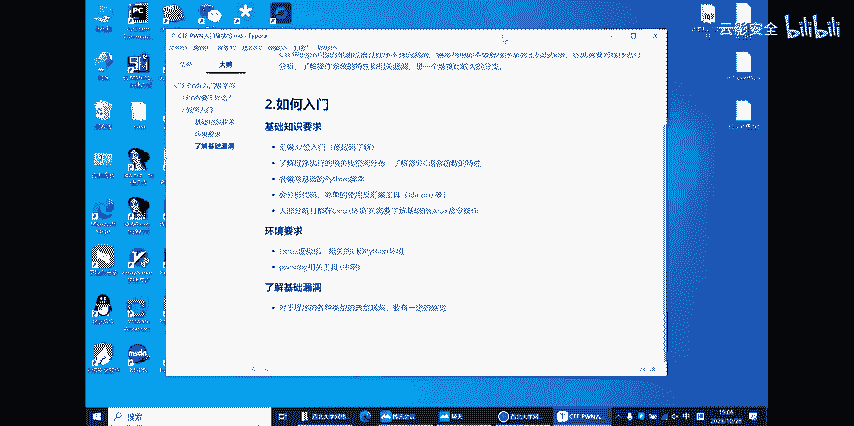

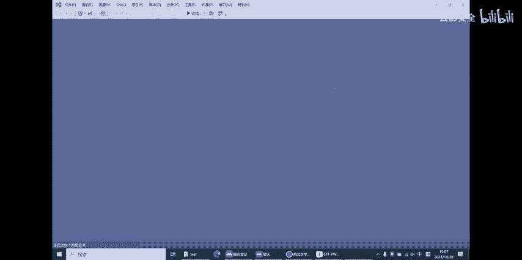

## 汇编语言基础

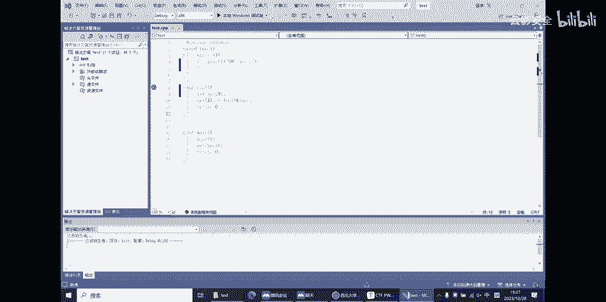

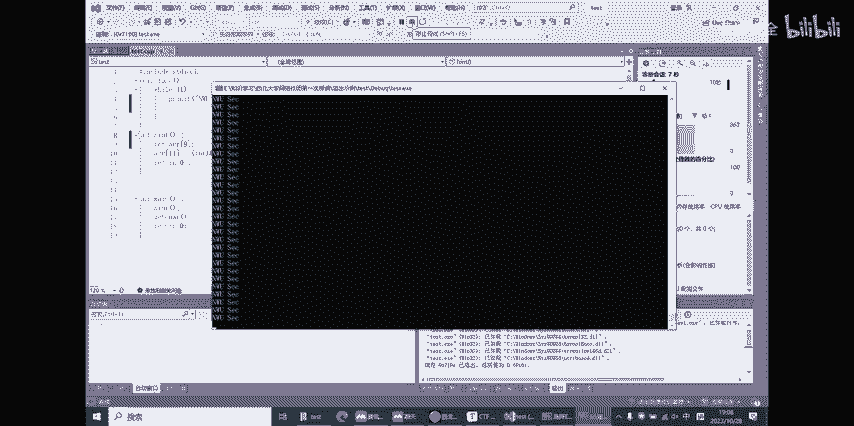

上一节我们介绍了课程概述，本节中我们来看看学习PWN所需的基础汇编知识。理解汇编指令是分析程序底层逻辑的关键。

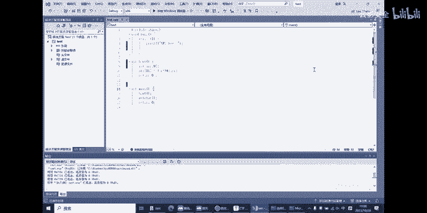

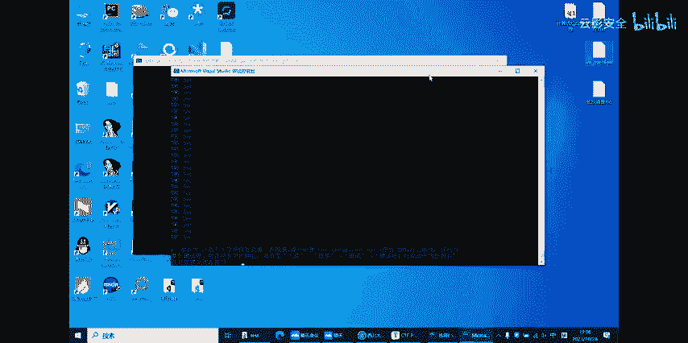

### 核心汇编指令

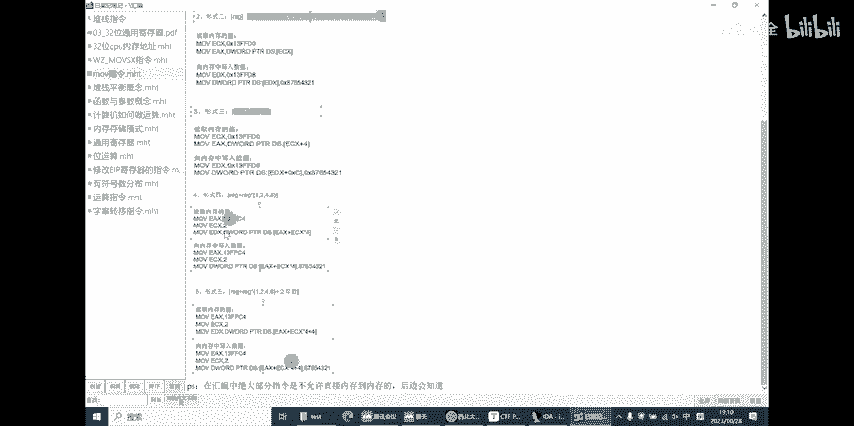

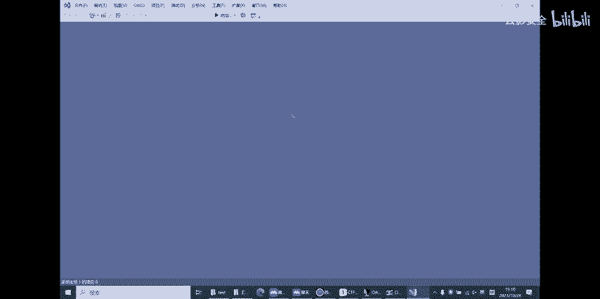

以下是几个最基础且重要的汇编指令及其功能：

*   **`mov` 指令**：用于数据复制或赋值。
    *   格式：`mov 目标操作数, 源操作数`
    *   示例：
        *   `mov eax, ebx` ： 将寄存器`ebx`的值复制到`eax`。
        *   `mov eax, 12` ： 将立即数`12`存入寄存器`eax`。
*   **`add` 指令**：用于加法运算。
    *   格式：`add 目标操作数, 源操作数`
    *   示例：`add eax, 2` ： 等价于 `eax = eax + 2`，结果保存在`eax`中。
*   **`sub` 指令**：用于减法运算。
    *   格式：`sub 目标操作数, 源操作数`
    *   示例：`sub eax, 2` ： 等价于 `eax = eax - 2`。

### 栈的概念与操作

程序运行时，栈（Stack）是一个“先进后出”的内存区域，用于存储临时数据、函数参数和返回地址等。

以下是关于栈操作的核心指令：

*   **`push` 指令**：将数据压入栈顶。
    *   示例：`push 10` ： 将数值`10`压入栈中。执行后，栈顶指针（`esp`）上移。
*   **`pop` 指令**：将栈顶的数据弹出。
    *   示例：`pop eax` ： 将栈顶的值弹出并存入寄存器`eax`中。执行后，栈顶指针（`esp`）下移。

两个重要的栈指针寄存器：
*   **`esp`**：栈顶指针，始终指向栈的顶部。
*   **`ebp`**：栈底指针，通常用于在函数内定位局部变量和参数。

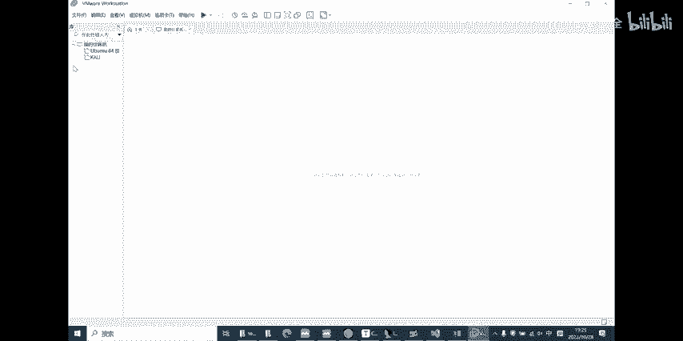

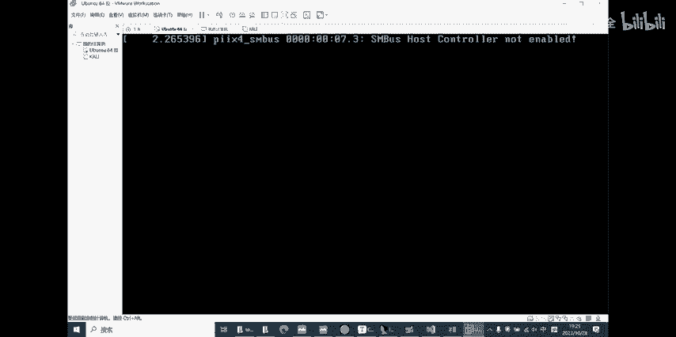

## 实例分析：整数溢出漏洞

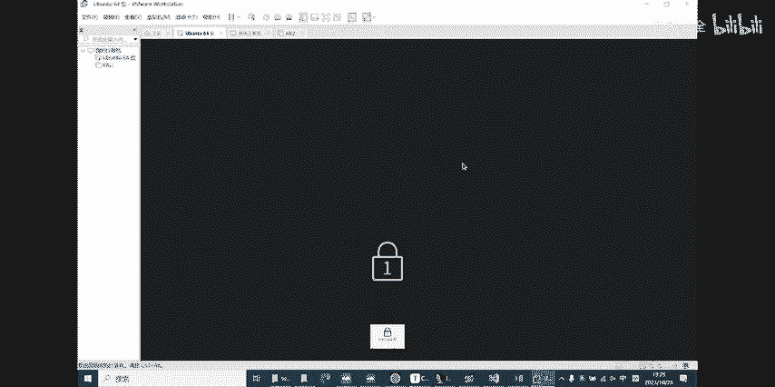

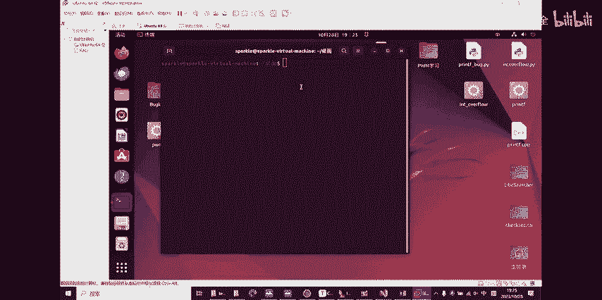

上一节我们介绍了汇编和栈的基础，本节中我们来看看一个具体的漏洞实例——“整数溢出”。我们将分析西安电子科技大学CTF新生赛的一道名为 `int_overflow` 的题目。

### 程序逻辑与目标

运行该Linux程序（ELF格式）后，它会提示用户输入一个整数 `N`，并要求在不输入负号的情况下，使 `N` 的值等于 `-114514`。

这引导我们思考：如何通过输入一个“正数”，让程序在底层将其解释为负数 `-114514`？这涉及到计算机中整数的存储方式。

### 核心原理：补码与截断

计算机中的有符号整数通常以**补码**形式存储。对于一个32位有符号整数（`int`）：
*   其表示范围为 `-2^31` 到 `2^31 - 1`。
*   最高位（第31位）为符号位：`0`代表正数，`1`代表负数。
*   负数 `-114514` 对应的32位补码是固定的二进制序列。

当程序读取我们的输入时，如果我们将一个超过32位表示范围的大整数赋给一个32位 `int` 变量，会发生**整数溢出**。超出的高位会被截断，只保留低32位。

**解题思路**：计算一个64位的大整数，使得其低32位恰好等于 `-114514` 的32位补码。当我们输入这个大整数时，程序将其截断赋值给32位 `N` 变量，`N` 在内存中的值就变成了 `-114514`。

### 逆向分析漏洞检测逻辑

为了深入理解，我们可以使用反汇编工具（如IDA Pro）分析程序。在 `main` 函数中，程序调用 `vuln` 函数处理输入。

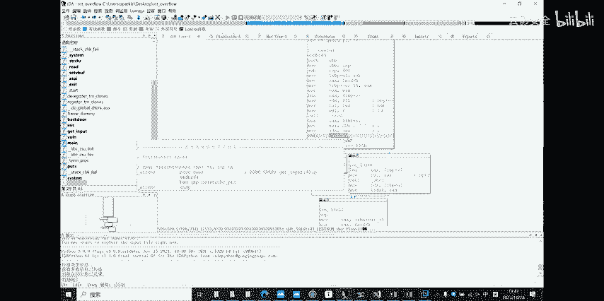

在 `vuln` 函数中，关键逻辑如下：
1.  使用 `get_input` 函数获取用户输入。
2.  使用 `strchr` 函数检查输入字符串中是否包含负号 `-`。
    *   **汇编关键点**：`strchr` 的返回值通过 `test` 指令与自身进行逻辑与运算，结果影响零标志位 `ZF`。随后 `jz` 指令根据 `ZF` 位决定跳转。
    *   如果找到负号，则将变量 `N` 置为 `0`。
    *   如果未找到负号，则使用 `atoi` 函数将字符串转换为整数并赋值给 `N`。
3.  最后，将 `N` 的值与 `-114514` 进行比较。

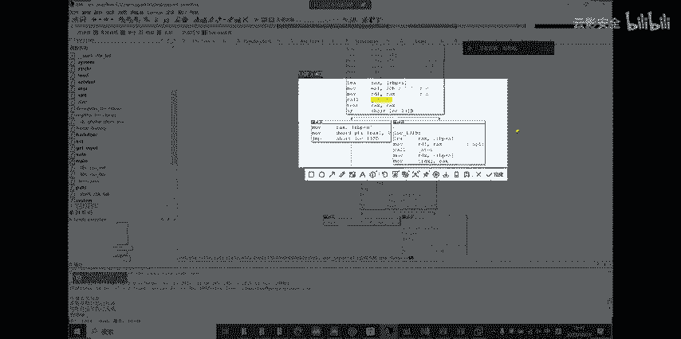

通过逆向分析，我们确认了程序仅检测输入字符串中是否有“-”字符，而不会检测转换后的整数值本身是否溢出。因此，我们的“大整数截断”方法是可行的。

## PWN脚本编写基础

上一节我们通过逆向分析理解了漏洞原理，本节中我们来看看如何利用Python脚本自动化完成漏洞利用。以另一道CTF题目（自动计算100道算式）为例。

以下是编写基础PWN脚本的步骤：

1.  **建立连接**：使用 `pwn` 库的 `remote` 函数连接到目标服务器和端口。
2.  **接收数据**：使用 `recvuntil` 函数接收程序输出，直到遇到特定提示字符串。
3.  **解析与计算**：从程序输出中提取算式和答案，进行验证。
4.  **发送结果**：根据验证结果，使用 `sendline` 函数向程序发送“对”或“错”的指令。
5.  **循环交互**：重复以上步骤直至达成目标（如完成100题）。
6.  **获取Flag**：最终接收程序返回的胜利信息（Flag）。

一个简化的脚本框架如下：
```python
from pwn import * # 导入pwn库

# 1. 连接远程服务器
io = remote(‘目标IP‘, 端口号)

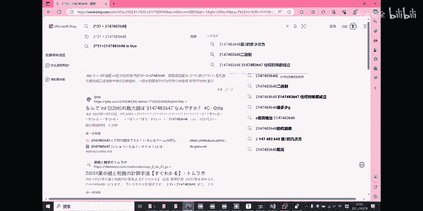

# 2. 接收初始提示
io.recvuntil(‘Welcome‘)

# 3. 循环解题
for i in range(100):
    # 接收并解析题目
    io.recvuntil(‘First number:‘)
    num1 = int(io.recvline())
    # ... 解析其他部分
    # 进行计算和判断
    # 发送答案
    io.sendline(‘My answer‘)

# 4. 接收最终结果（Flag）
flag = io.recvall()
print(flag)
```

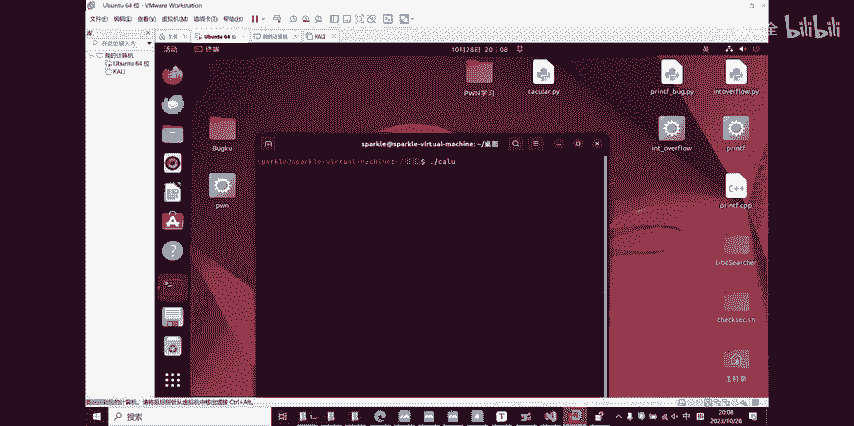

## 函数调用约定与栈帧

要深入进行逆向和PWN分析，必须理解函数调用时栈的变化。这是一个函数调用（以 `call` 指令为例）前后的典型栈操作流程：

**调用函数前（Caller）**：
1.  **参数入栈**：按约定（如从右向左）将函数参数压入栈中。
2.  **执行 `call` 指令**：
    *   将下一条指令的地址（返回地址）压入栈。
    *   跳转到被调用函数的地址。

**被调用函数内（Callee）序言**：
1.  **保存旧栈帧**：`push ebp` （将调用者的 `ebp` 保存到栈中）。
2.  **建立新栈帧**：`mov ebp, esp` （让 `ebp` 指向当前栈帧底部）。
3.  **分配局部变量空间**：`sub esp, 0x20` （抬高栈顶，预留空间）。

**被调用函数内（Callee）尾声**：
1.  **平衡栈**：`mov esp, ebp` （释放局部变量空间）。
2.  **恢复旧栈帧**：`pop ebp` （恢复调用者的 `ebp`）。
3.  **返回**：`ret` 指令，该指令会从栈中弹出返回地址并跳转回去。

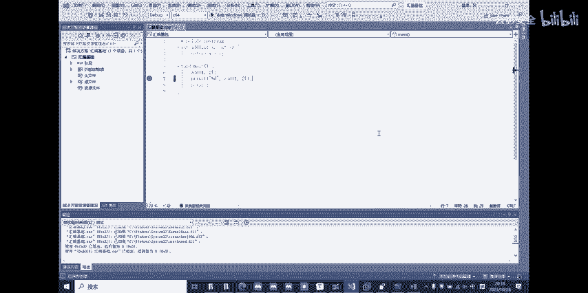

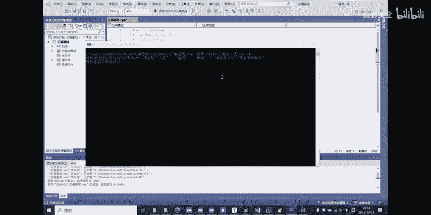

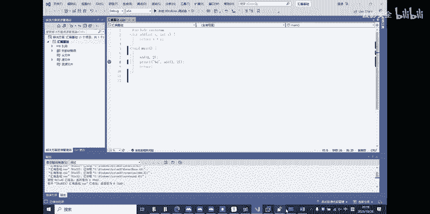

**调用函数后（Caller）**：
*   清理参数（调整 `esp`）。

理解这个过程对于分析栈溢出漏洞至关重要，因为溢出数据可以覆盖关键的返回地址（`ret` 时弹出的地址），从而控制程序执行流。

## 总结


本节课中我们一起学习了CTF中PWN与Reverse分支的入门知识。我们从最基础的汇编指令和栈的概念讲起，然后通过一个“整数溢出”的实际案例，演示了如何结合补码知识、逆向分析与Python脚本来利用程序漏洞。我们还简要介绍了函数调用约定，这是理解更复杂漏洞的基础。掌握这些内容，是迈向CTF PWN高手之路的第一步。建议课后动手实践，使用调试器跟踪程序，并尝试编写简单的漏洞利用脚本。