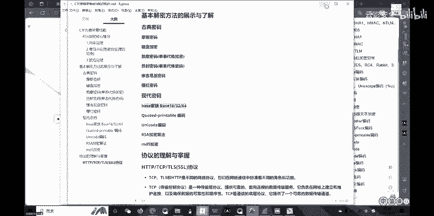
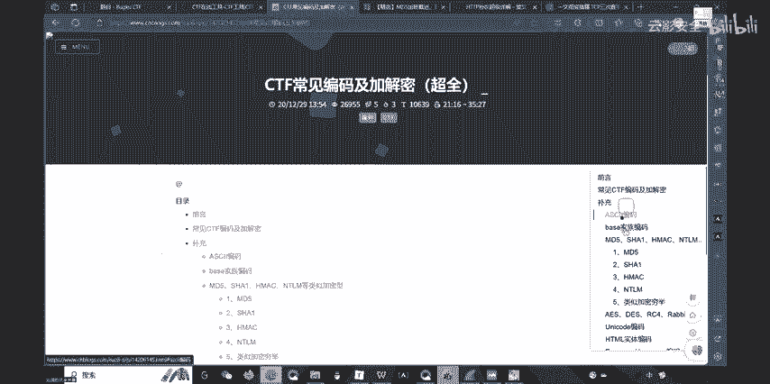

# CTF入门第二讲：密码学Crypto - P1：密码学Crypto

## 概述
在本节课中，我们将学习密码学的基础知识，特别是非对称加密算法RSA的核心原理。课程内容分为三个主要部分：RSA加密的底层数学原理、古典与现代密码的编码思维，以及三个关键网络协议（HTTP、TCP、TLS/SSL）的基本了解。我们将从最核心的RSA算法开始，逐步展开，确保初学者能够理解并掌握这些概念。

---

## 什么是密码学
密码学的传统概念很简单：将一串信息（明文）转换成另一串看不懂的信息（密文）。只有知道转换规则的人才能将密文还原为明文。这就是加密的本质。

在CTF比赛中，密码学是核心板块之一。学习CTF是一个厚积薄发的过程，需要不断积累数学、计算机逻辑和算法等多方面的知识。

---

## 非对称加密与RSA算法

### 对称加密与非对称加密
上一节我们介绍了密码学的基本概念，本节中我们来看看加密的两种主要类型。

**对称加密**使用同一个密钥进行加密和解密。例如，ASCII编码就是一种对称加密：字符`A`对应数字`97`。只要双方都知道这个编码表，就能互相加解密。但一旦密钥泄露，所有通信都会被破解。

**非对称加密**则使用一对密钥：公钥和私钥。公钥可以公开，用于加密信息；私钥必须保密，用于解密信息。用公钥加密的信息，只能用对应的私钥解密，反之亦然。这样，即使公钥被他人获取，也无法破解密文。

### RSA算法的数学基础
要理解RSA，我们需要一些数学铺垫，首先是**同余定理**。

**同余定义**：若 `A % C = B % C`（即A和B除以C的余数相同），则称A与B对模C同余，记作 `A ≡ B (mod C)`。

以下是两个重要的同余性质：
1.  若 `A ≡ B (mod N)`，则 `kA ≡ kB (mod N)`。反之亦然。
2.  若 `A ≡ B (mod N)`，则 `A^m ≡ B^m (mod N)`。但反过来不成立。

此外，模运算满足**模不变性质**：
*   `(A + B) % N = ((A % N) + (B % N)) % N`
*   `(A * B) % N = ((A % N) * (B % N)) % N`

### 欧拉定理与欧拉函数
RSA算法的核心依赖于**欧拉定理**。

首先介绍**欧拉函数 φ(N)**：它表示小于N的正整数中，与N互质（最大公约数为1）的数的个数。
*   例如，φ(6) = 2（与6互质的数有1和5）。
*   特别地，如果p是质数，则 φ(p) = p - 1。
*   如果p和q是两个不同的质数，则 φ(p*q) = (p-1)*(q-1)。

**欧拉定理**：如果整数a与N互质，那么 `a^φ(N) ≡ 1 (mod N)`。

### RSA加密与解密过程
基于以上数学原理，RSA的工作流程如下：

1.  **密钥生成**：
    *   选择两个大质数 `p` 和 `q`，计算 `N = p * q`。
    *   计算欧拉函数 `φ(N) = (p-1)*(q-1)`。
    *   选择一个整数 `e`，满足 `1 < e < φ(N)`，且 `e` 与 `φ(N)` 互质。`e` 就是**公钥**。
    *   计算 `d`，使得 `(e * d) % φ(N) = 1`。`d` 就是**私钥**。
    *   公钥为 `(e, N)`，私钥为 `(d, N)`。

2.  **加密**：
    *   将明文 `M` 转换为整数（例如ASCII码）。
    *   计算密文 `C = M^e % N`。

3.  **解密**：
    *   计算明文 `M = C^d % N`。

**原理推导**：
根据欧拉定理，因为 `M` 与 `N` 互质（在实际中通过填充方案保证），有 `M^φ(N) ≡ 1 (mod N)`。
两边同时取 `k` 次方：`M^(k*φ(N)) ≡ 1 (mod N)`。
两边同乘 `M`：`M^(k*φ(N)+1) ≡ M (mod N)`。
而我们加密解密需要满足：`(M^e)^d = M^(e*d) ≡ M (mod N)`。
对比可知，只需令 `e*d = k*φ(N) + 1` 即可。这正是私钥 `d` 的求解方程。

**安全性**：RSA的安全性基于大数分解的难度。已知公钥 `(e, N)`，想要求出私钥 `d`，必须知道 `φ(N)`，而要知道 `φ(N)`，就必须分解 `N` 得到 `p` 和 `q`。当 `p` 和 `q` 是足够大的质数时，分解 `N` 在计算上是不可行的。

---

## 古典与现代密码编码思维
理解了RSA的核心原理后，我们来看看其他常见的密码编码方式。掌握它们的核心思维比记忆具体算法更重要。

以下是几种经典密码的简要介绍：

*   **摩斯电码**：用点（.）和划（-）的组合来表示字母和数字。
*   **键盘布局加密**：利用键盘上字母的排列位置进行加密。例如，“XCVB”可能表示“密码”，因为它们在键盘上相邻。
*   **凯撒密码**：一种移位密码，将字母表中的每个字母向后（或向前）移动固定位置。例如，移位3位时，A->D, B->E。
*   **仿射密码**：凯撒密码的扩展，对字母编号先做乘法运算再做加法运算。
*   **维吉尼亚密码**：使用一个密钥词进行多表移位加密，密钥词循环使用，增加了破解难度。
*   **栅栏密码**：将明文分成若干组，然后按特定顺序（如按列）读取形成密文。
*   **培根密码**：使用两种不同的字体或符号（如A和B）来代表字母表的二进制编码。
*   **Base家族编码**：这不是加密，而是一种编码，用于将二进制数据转换成可打印的ASCII字符。
    *   **Base64**：每3个字节（24位）数据编码为4个字符（每字符6位）。如果原文字节数不是3的倍数，会在末尾用`=`填充。
    *   **Base32**：每5个字节数据编码为8个字符。也可能用`=`填充。
    *   **Base16 (Hex)**：每1个字节数据编码为2个十六进制字符。无需填充。
*   **Quoted-Printable编码**：常用于电子邮件，将非ASCII字符编码为`=`后跟两个十六进制数字的形式。
*   **Unicode编码**：为全世界所有字符统一分配编码，如UTF-8、UTF-16。
*   **MD5哈希**：一种哈希函数（散列算法），将任意长度数据映射为固定长度（128位）的哈希值。其特点是**不可逆**（无法从哈希值反推原文）和**抗碰撞性**。

---

## 网络协议浅析
密码学保障了网络通信的安全，而通信本身依赖于协议。最后，我们来了解三个关键的网络协议。

我们可以用一个**打电话**的比喻来理解它们之间的关系：
1.  **TCP协议 (传输控制协议)**：负责建立可靠的连接。就像**确认双方电话线路是否通畅**（“喂，听得到吗？”“听得到，你呢？”“我也听得到”）。这个过程就是著名的**三次握手**。挂断时则需要**四次挥手**来确保双方都说完了。
2.  **TLS/SSL协议 (安全套接层/传输层安全协议)**：负责在连接建立后**加密通话内容**，防止窃听。就像给通话内容加了个**隔音保密房间**。
3.  **HTTP协议 (超文本传输协议)**：定义了通信内容的**格式和规范**。就像约定双方**使用同一种语言和语法**进行交流，确保信息能被正确理解。

**关系总结**：`HTTP + TLS/SSL = HTTPS`。通信时，先通过TCP三次握手建立连接，然后通过TLS/SSL握手建立加密通道，最后在加密通道上使用HTTP协议传输应用数据。

**数据包分析**：在CTF中，常会提供网络流量包（如`.pcap`文件）。分析这些数据包，就是要在TCP流中，根据协议规范（如HTTP），从可能经过加密（SSL/TLS）或编码（如Base64）的数据中，捕捉并破解出隐藏的flag信息。

---

## 总结
本节课我们一起学习了密码学入门知识。我们从加密的本质出发，重点剖析了RSA非对称加密算法的数学原理，包括同余定理、欧拉函数和欧拉定理。然后，我们浏览了多种古典和现代密码的编码思维，理解了Base64、MD5等常见编码或哈希的特点。最后，我们通过生动的比喻了解了HTTP、TCP、TLS/SSL这三个网络协议的基本角色和相互关系。掌握这些核心概念，是进一步探索CTF密码学领域和网络安全世界的重要基石。