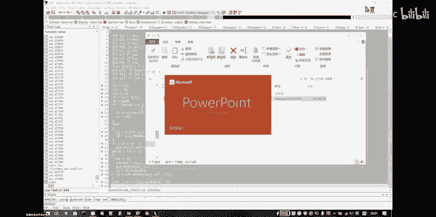
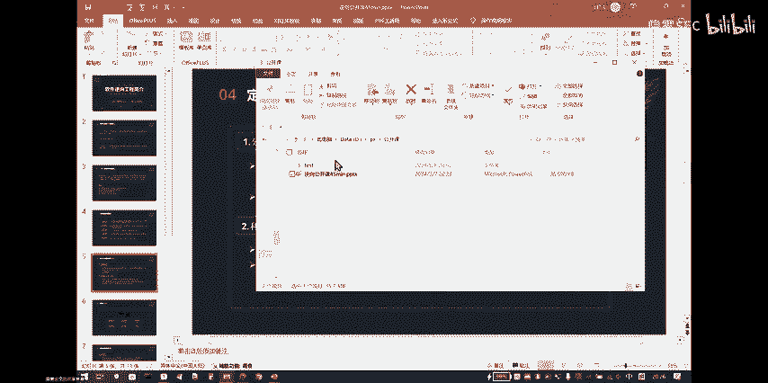
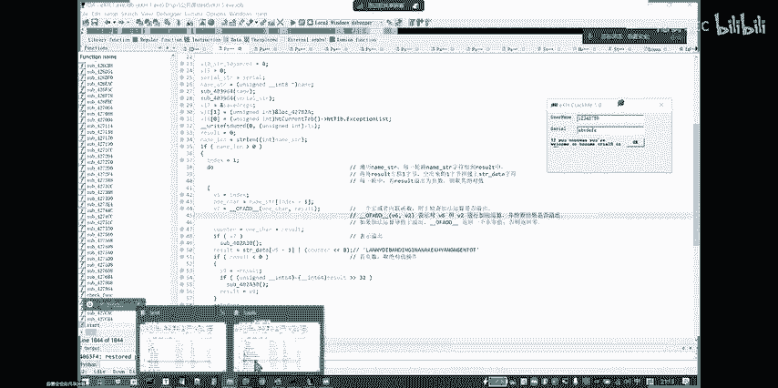
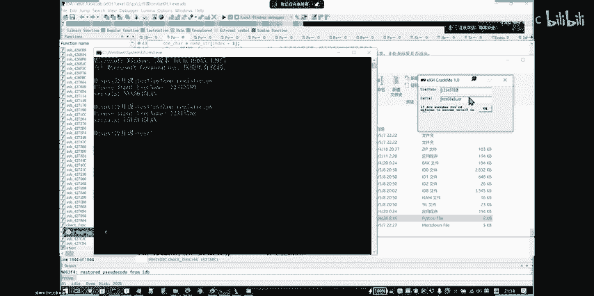
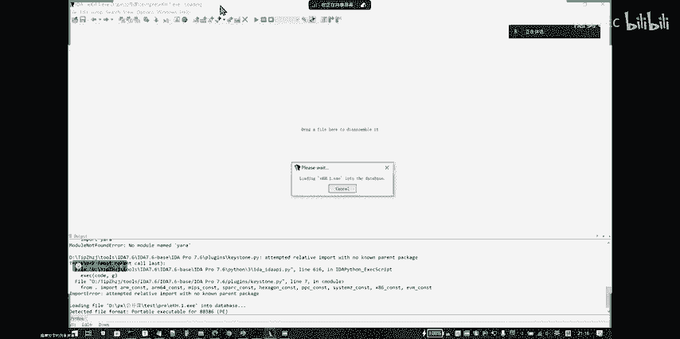
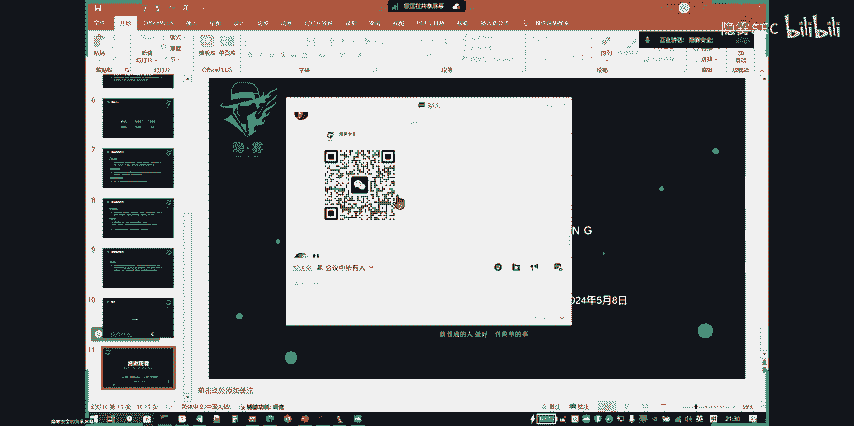
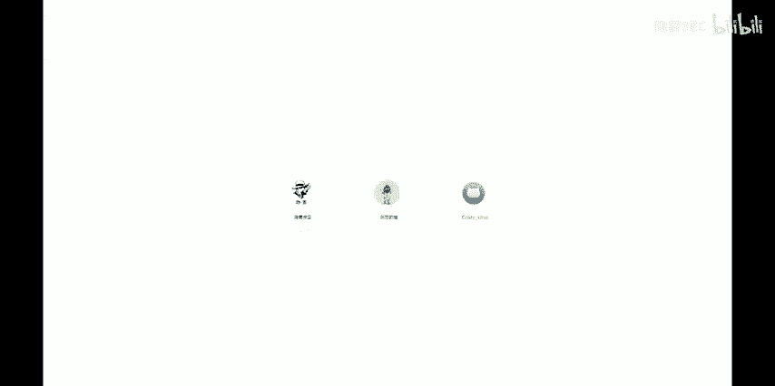

# CTF公开课：第一讲：逆向工程入门与CrackMe破解 🧩



在本节课中，我们将要学习CTF竞赛中逆向工程的基础知识，并通过一个简单的CrackMe程序来实践逆向分析的全过程。逆向工程是网络安全攻防领域的重要技能，理解它有助于我们分析软件行为、发现漏洞以及进行安全防护。

## 逆向工程简介 🔍

上一节我们介绍了课程概述，本节中我们来看看什么是逆向工程。逆向工程，顾名思义，是相对于正向工程（即编程开发）而言的。根据维基百科的定义，它指的是“解构人造物体，以揭示其设计、架构或从中提取知识”的过程。

在软件领域，逆向工程建立在正向编程技术的基础之上。掌握扎实的编程能力（尤其是C语言和汇编语言）是学好逆向的关键。其应用领域广泛，最初多用于软件破解、漏洞挖掘等，随后也衍生出软件保护、恶意代码分析、游戏反外挂等防御性技术。

其中，“竞品分析”是一个典型应用，即通过逆向分析竞争对手的软件产品，了解其实现原理和优缺点，从而指导自身产品的开发，这通常不涉及法律风险。

## CTF中的逆向工程要求 🏆

上一节我们了解了逆向工程的基本概念，本节中我们来看看在CTF竞赛中对逆向工程有哪些具体要求。在国内CTF赛事中，逆向工程主要涉及Windows、Linux、Android等多平台的程序，要求选手能够利用常用工具对可执行文件进行逆向分析。

具体来说，需要掌握以下技术要点：
*   **移动端APK逆向**
*   **加解密算法**
*   **内核编程**
*   **算法逆向**
*   **反调试技术**



逆向工程的学习要求可以概括为以下几点：
1.  **熟悉操作系统基础**：如Windows消息机制、PE/ELF文件结构、APK结构等。
2.  **掌握汇编与C语言**：这是逆向分析的基石。
3.  **了解常见加解密知识**：如Base64家族、RC4、AES、RSA等算法。
4.  **具备多种高级语言编程能力**：用于编写分析脚本，常用Python。
5.  **熟悉编译器原理**：有助于理解代码混淆等保护技术。
6.  **培养逆向思维与分析能力**：这是一种通过大量练习获得的“软实力”，与编程能力相辅相成。

## 常规逆向分析流程 🔄

上一节我们明确了学习要求，本节中我们来看看进行逆向分析时的一般步骤。一个清晰的流程能帮助我们高效地开展工作。

以下是标准的逆向分析流程：
1.  **信息收集**：运行目标程序，观察其行为。例如，是32位还是64位程序？是否有图形界面？需要输入什么？输入后有何反馈？这些字符串提示都是重要信息。同时，使用工具检查程序是否被加壳。
2.  **静态分析与脱壳**：使用IDA等工具进行静态反编译。如果程序有壳（如UPX），则先进行脱壳处理。根据第一步收集到的字符串信息，在IDA中查找字符串引用，从而快速定位到关键代码区域（如主函数）。
3.  **梳理程序框架**：找到程序入口点（如main函数）后，分析整个程序的逻辑框架。理解数据流是如何从输入点传递到输出点的，中间经过了哪些处理模块。
4.  **定位关键代码**：在庞大的反编译代码中，识别出影响程序核心逻辑的部分（通常是加密、验证函数）。避免陷入无关的编译器生成代码中。
5.  **深入分析关键函数**：对定位到的关键函数进行细致的静态分析和动态调试，弄清其具体算法和执行流程。
6.  **理清思路并求解**：在完全理解程序逻辑后，编写逆向脚本计算出正确结果（如注册码），或修改程序二进制文件以绕过验证（破解）。

## 定位关键代码的技巧 🎯

上一节我们介绍了分析流程，本节中我们重点探讨流程中最具挑战的一环：如何定位关键代码。掌握一些技巧可以事半功倍。

定位关键代码主要依靠以下两种方法：
*   **分析控制流与数据流**：在IDA中查看函数调用图和控制流图，从程序入口开始，跟踪用户输入数据的流向，关注判断分支和循环，从而把握整体逻辑脉络。
*   **利用交叉引用**：这是最常用且高效的技巧。在IDA中查看特定字符串或API函数的交叉引用，能直接跳转到使用它的代码位置。例如，在GUI程序中定位 `GetWindowText` 这类获取用户输入的函数，其调用处往往是验证逻辑的起点。

此外，在分析过程中，注意区分程序作者编写的代码和编译器生成的代码，避免在无关代码上浪费时间。

## 逆向工程学习建议与基本能力 📚

上一节我们探讨了定位关键代码的技巧，本节中我们系统性地总结一下逆向工程所需的基本能力和学习建议。

以下是给初学者的六点学习建议：
1.  **夯实编程基础**：重点学习C语言和x86汇编语言。了解C语言代码与汇编指令的对应关系是逆向入门的第一步。
2.  **理解“集中原则”**：程序员常将相关功能函数或数据放在相近位置。找到一处关键代码后，其附近可能也存在重要逻辑。
3.  **利用“代码复用”与AI辅助**：许多程序使用公开的加密算法库（如GitHub上的代码），代码结构相似。可以借助ChatGPT等工具快速分析常见的代码片段。
4.  **大胆假设，小心验证**：逆向时多“猜”函数功能（通过参数、返回值推测），先理清框架，再深入函数内部验证猜测。
5.  **学会区分代码**：快速识别并跳过编译器生成的、与程序逻辑无关的代码。
6.  **保持耐心**：逆向分析如同解谜，反馈周期长，需要冷静和耐心，但破解后的成就感也更强。

逆向工程师应具备的基本能力包括：
*   **动态调试能力**：熟练使用调试器（如x64dbg, OllyDbg）跟踪程序执行，观察寄存器与内存变化。
*   **常见算法识别能力**：能识别Base64、RC4、AES、MD5等常见加密算法和数据结构。
*   **高级数据结构识别能力**：能在汇编或伪代码中识别链表、树、图等结构的实现。
*   **代码混淆分析能力**：了解花指令、SMC（自修改代码）、虚拟机保护等混淆技术。
*   **脱壳与反调试对抗能力**：掌握常见压缩壳、加密壳的脱壳方法，以及识别、绕过反调试检测。

## CrackMe逆向实战演示 💻

上一节我们总结了学习要点，本节中我们将理论付诸实践，通过一个具体的CrackMe程序来演示完整的逆向破解过程。

我们有一个简单的注册机程序（CrackMe），其行为是：用户输入用户名和序列号，点击验证，程序会判断序列号是否正确。

**第一步：信息收集**
运行程序，观察界面。我们看到程序标题、输入框提示语（“User Name”, “Serial Number”）以及验证失败后的错误信息（“Wrong Serial, try again!”）。这些都是重要的字符串线索。

**第二步：静态分析**
使用查壳工具确认程序为32位、无壳。用IDA打开，按下`Shift+F12`查看字符串列表，找到上述错误信息字符串。对其按`X`键查看交叉引用，直接跳转到引用该字符串的代码位置。按`F5`键生成伪代码，此处即程序的核心验证逻辑。

**第三步：梳理框架与定位关键**
分析伪代码，发现程序获取两个输入，然后调用一个验证函数（此处命名为`check`函数）进行判断。根据`if`条件，可知该函数的返回值需要等于特定值（如12345678）才算验证通过。因此，`check`函数就是关键函数。

**第四步：深入分析关键函数**
进入`check`函数。通过动态调试和静态分析相结合，我们发现程序只对“用户名”进行了处理，而“序列号”并未参与复杂计算，仅用于最终比较。
处理“用户名”的逻辑是一个循环：对用户名的每个字符进行运算，累加到一个值中，然后经过一系列位操作和模运算，最终生成一个数字，再将该数字转换为字符串。这个生成的字符串，就是程序期待的“正确序列号”。

**第五步：理清算法并编写破解脚本**
完全理解算法后，我们用Python脚本模拟这一过程。对于任意输入的用户名，脚本都能计算出对应的正确序列号。

```python
def calculate_serial(name):
    result = 0
    for char in name:
        result += ord(char)  # 累加字符的ASCII值
        result = (result << 8) | (result >> 24)  # 模拟循环移位与或操作
        result &= 0xFFFFFFFF  # 限制在32位内
    # 后续模拟十进制转字符串的查表过程（此处为简化示例）
    serial_str = str(result)
    return serial_str

username = input("Enter Username: ")
print("Valid Serial:", calculate_serial(username))
```





运行脚本，输入任意用户名，得到序列号。将该序列号填入原CrackMe程序，验证通过。破解成功！



**逆向的难点与起点**
需要强调的是，我们演示的伪代码是经过逆向分析、重命名变量、添加注释后的“清晰版”。而初学者在IDA中打开的去符号原始程序，变量名全是v1、v2、a1、a2，几乎无可读性。逆向工程的大部分工作，正是从这样一团混沌的代码中，通过调试、分析、猜测和验证，一步步还原出程序逻辑的过程。这也就是逆向分析的魅力与挑战所在。

## 总结 🎉

本节课中我们一起学习了CTF逆向工程的入门知识。我们从逆向工程的定义和应用讲起，明确了CTF比赛中的技术要求。然后，我们梳理了逆向分析的常规流程：从信息收集、静态分析到定位关键代码、深入分析直至最终求解。我们还分享了许多实用的学习技巧和需要掌握的基本能力。最后，通过一个具体的CrackMe程序实战，我们完整地体验了逆向破解的过程，将理论知识转化为实际操作能力。





逆向工程是通往网络安全深处的一把钥匙，需要耐心、扎实的编程基础和不断的练习。希望本课程能为你打开这扇大门，祝你在此后的学习中不断进步。