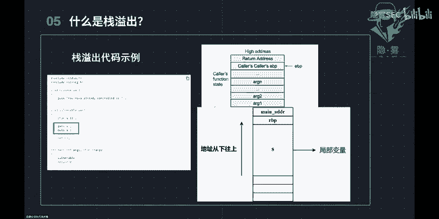
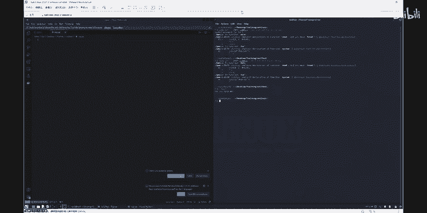
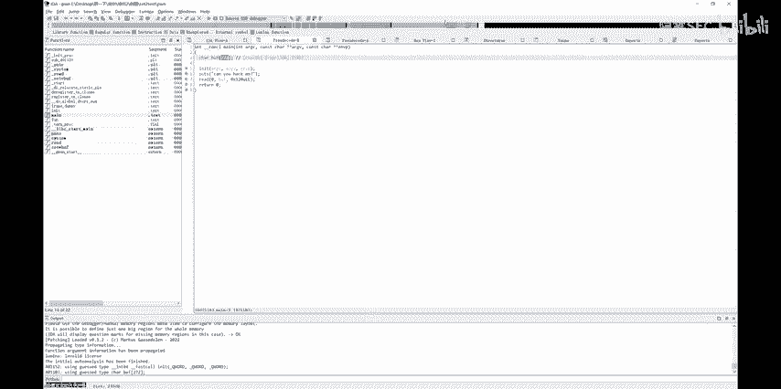
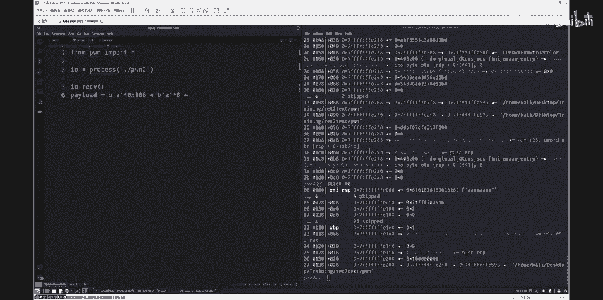
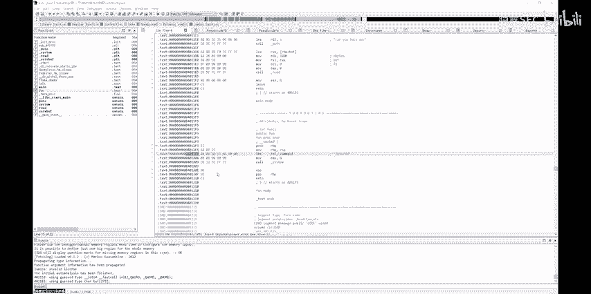
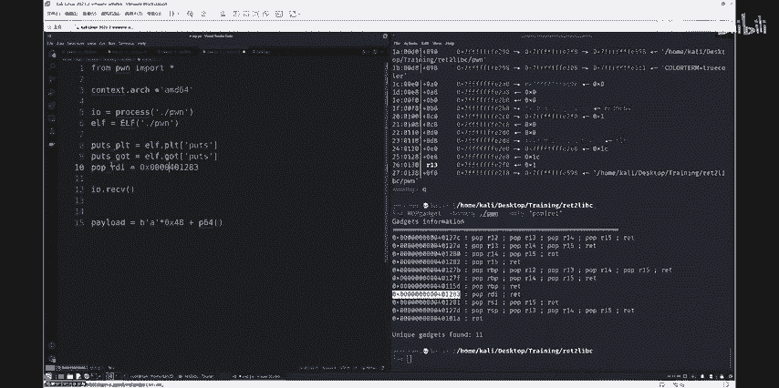

# CTF公开课：第二讲：Pwn入门 - 多角度理解栈溢出攻击


在本节课中，我们将学习二进制安全领域中的Pwn技术，特别是栈溢出漏洞的原理与利用方法。我们将从基础概念入手，通过实际案例演示，帮助你理解如何发现并利用程序中的栈溢出漏洞。

## 概述：什么是Pwn？

Pwn是黑客俚语中的一个拟声词，指成功攻破系统或程序时设备发出的声音。在CTF比赛中，Pwn题目通常涉及分析一个运行在服务器上的二进制程序，寻找其中的漏洞（如栈溢出），并利用该漏洞获取系统权限或读取特定文件（如`flag`）。

## 入门条件

要学习Pwn，你需要掌握以下基础知识：
*   **C语言**：绝大多数被分析的二进制程序由C语言编写。
*   **汇编语言**：理解程序底层执行和内存操作的关键。
*   **Linux基础命令**：因为目标程序通常运行在Linux服务器上。
*   **代码审计能力**：能够阅读源代码或反编译后的伪代码，寻找漏洞。
*   **Python基础**：用于编写漏洞利用脚本。

上一节我们介绍了学习Pwn所需的基础，本节中我们来看看Pwn手未来的发展方向。

## 技术展望

掌握Pwn技术后，你可以向多个安全领域深入发展：
*   **IoT设备漏洞挖掘**：挖掘路由器等物联网设备的固件漏洞。
*   **Linux内核漏洞挖掘**：研究操作系统核心的安全问题。
*   **开源项目审计**：为大型开源项目寻找并提交安全漏洞。
*   **软件逆向分析**：深入分析软件内部机制与算法。
*   **高校与大厂的安全研究**：从事前沿的安全开发与攻防研究。

## 栈溢出原理



栈是一种“后进先出”的数据结构，主要操作是`push`（压入）和`pop`（弹出）。

在程序运行时，每个函数都会在内存的栈区拥有一块空间，用于存放局部变量、函数参数和返回地址等信息。栈的生长方向是从高地址向低地址延伸。


栈溢出是指向栈上的变量（如数组）写入的数据量超过了该变量预先分配的内存空间。超出的数据会覆盖相邻的内存区域。

**栈溢出发生的核心条件是**：
1.  程序必须向栈上写入数据。
2.  写入数据的**大小没有被良好地控制**。





例如，以下C代码使用了不安全的`gets`函数：
```c
char s[12];
gets(s); // 如果输入超过11个字符（留1位给结束符\0），就会发生栈溢出
```
如果溢出的数据覆盖了函数的返回地址，攻击者就能**控制程序下一步的执行流程**，从而实现漏洞利用。

## 漏洞利用流程

一个典型的Pwn解题流程包含以下步骤：
1.  **信息收集**：使用`checksec`命令查看目标程序开启了哪些安全保护机制。
2.  **静态分析**：使用IDA Pro等工具反编译程序，分析其逻辑，寻找漏洞点。
3.  **动态调试**：使用GDB等调试器运行程序，观察内存状态，验证漏洞并获取关键地址。



## 攻击技术：Return to Text

这是一种基础的栈溢出利用技术，目标是让程序跳转到其本身已有的代码段（如`.text`段）去执行。通常，这指的是跳转到程序自带的后门函数。



以下是两个后门函数的例子：
```c
// 例1：执行系统命令的后门
void backdoor() {
    system("/bin/sh");
}
// 例2：读取并输出flag文件的后门
void win() {
    char s[64];
    int fd = open("flag", O_RDONLY);
    read(fd, s, 64);
    puts(s);
}
```
通过栈溢出覆盖返回地址为`backdoor`或`win`函数的地址，程序在返回时就会执行这些函数，从而让我们获得shell或直接读到flag。

上一节我们介绍了基础的Return to Text攻击，本节中我们来看一个更通用的技术。

## 攻击技术：Return to Libc

当程序中没有现成的后门函数时，我们可以利用`Return to Libc`技术。Libc是C语言的标准库，包含了`system`、`puts`等常用函数。虽然这些函数在程序内存中的地址每次运行会变化（ASLR保护），但函数在Libc库内部的相对偏移是固定的。

利用思路是：
1.  通过栈溢出，构造一个能**泄露**出某个Libc函数（如`puts`）在内存中实际地址的payload。
2.  根据泄露出的地址，计算出Libc库的**基地址**。
3.  根据基地址和已知偏移，计算出目标函数（如`system`）的地址。
4.  再次利用栈溢出，构造调用`system("/bin/sh")`的payload，从而获得shell。



## 实战演示

接下来，我们将通过两道例题来演示上述攻击技术。

### 例题1：有后门函数的栈溢出

我们首先分析一个简单的、自带后门函数的程序。
1.  使用`checksec`查看，发现未开启栈保护（Canary）和地址随机化（PIE）。
2.  用IDA分析，找到`main`函数和`backdoor`函数。发现`main`函数中`read`读取的字节数超过了局部变量`s`的大小。
3.  计算需要多少填充数据才能覆盖到返回地址。公式为：`变量s的大小 + 保存的rbp寄存器大小`。
4.  编写Python利用脚本，使用`pwntools`库。构造payload：`填充数据 + backdoor函数地址`。
5.  发送payload，成功跳转到后门函数，获得shell。

### 例题2：无后门函数的栈溢出（Return to Libc）

现在我们分析一个没有后门函数的程序。
1.  检查发现程序依然存在栈溢出漏洞，但没有可直接利用的后门。
2.  我们需要利用`puts`函数来泄露Libc地址。构造第一次溢出的payload：`填充数据 + puts的PLT表地址 + main函数地址 + puts的GOT表地址`。这样程序会执行`puts(puts@got)`，打印出`puts`的真实地址，然后重新返回到`main`函数，让我们可以进行第二次溢出。
3.  接收泄露的地址，使用工具（如`LibcSearcher`）查询对应的Libc版本，并计算出`system`函数和字符串`"/bin/sh"`的地址。
4.  构造第二次溢出的payload：`填充数据 + system函数地址 + 返回地址（可为任意值）+ “/bin/sh”字符串地址`。
5.  发送payload，成功调用`system("/bin/sh")`，获得shell。

## 总结


本节课我们一起学习了Pwn技术的入门知识。我们了解了栈溢出的基本原理，即通过向栈上变量写入超长数据来覆盖关键内存（如返回地址）。我们学习了两种基础的利用技术：**Return to Text**（跳转到程序自带的后门）和**Return to Libc**（利用库函数来获得shell）。通过两道例题的实战演示，我们熟悉了基本的漏洞分析流程和利用脚本的编写。Pwn的学习需要耐心和实践，希望本课能为你打开二进制安全世界的大门。