# CTF培训网络安全基础入门：P11：文件上传漏洞与一句话木马（上） 🛡️


在本节课中，我们将要学习网络安全中一个常见的漏洞类型——文件上传漏洞，并重点介绍与之紧密相关的“一句话木马”。我们将通过简单的原理讲解和实际操作演示，帮助你理解攻击者如何利用网站的上传功能植入恶意代码，从而控制目标服务器。

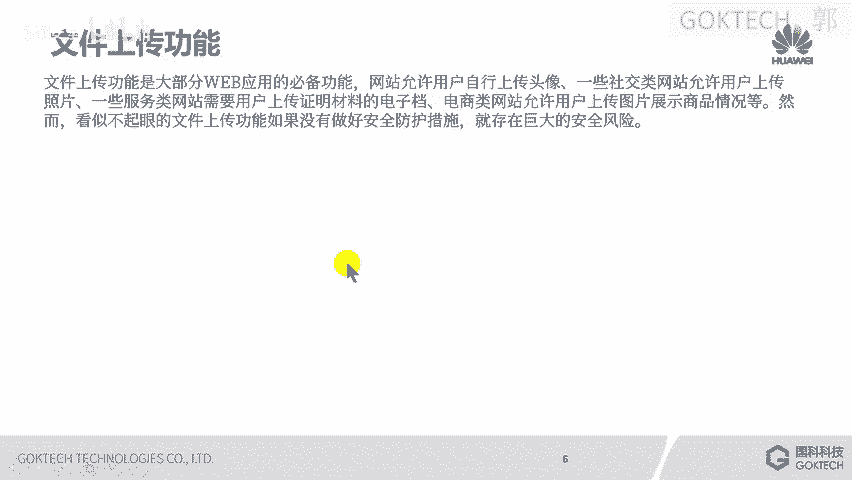

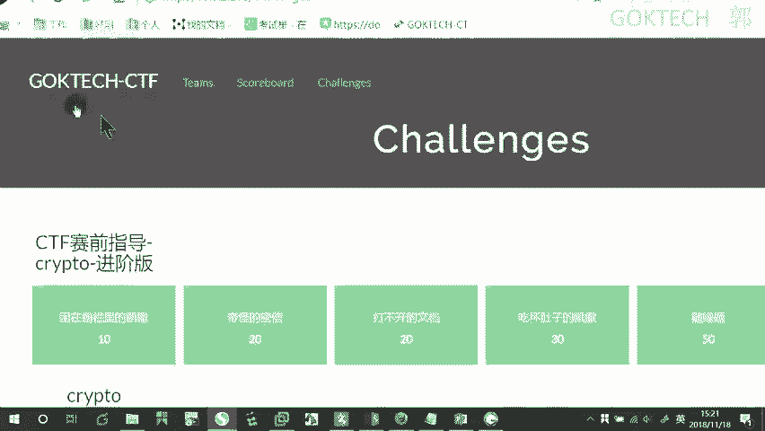

## 概述：什么是文件上传漏洞？ 📤

上一节我们介绍了网络安全的基本概念，本节中我们来看看文件上传漏洞。许多网站都具备文件上传功能，例如用户上传头像、发送邮件附件等。如果网站在处理上传文件时，没有对文件类型、内容进行充分的安全校验，攻击者就可能上传恶意文件（如木马程序）。一旦恶意文件被成功保存到服务器，攻击者就能利用它执行任意命令，从而控制服务器。

## 核心概念：一句话木马 🐴

在深入探讨漏洞利用之前，我们需要先理解攻击的核心工具——一句话木马。一句话木马是一种代码量极少的恶意脚本，通常只有一行或几行代码。它的特点是隐蔽性强，功能是通过接收外部指令来执行服务器上的操作。

### 一句话木马的代码示例

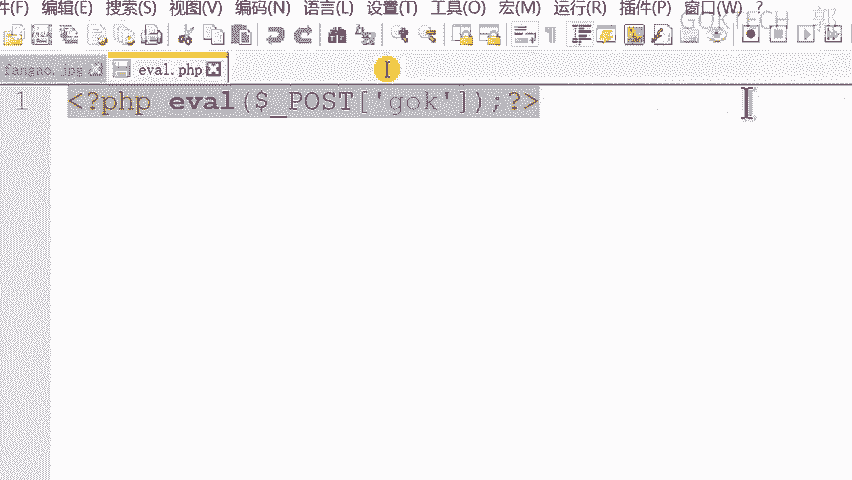

以下是一个用PHP编写的典型一句话木马：

```php
<?php @eval($_POST['GOK']); ?>
```

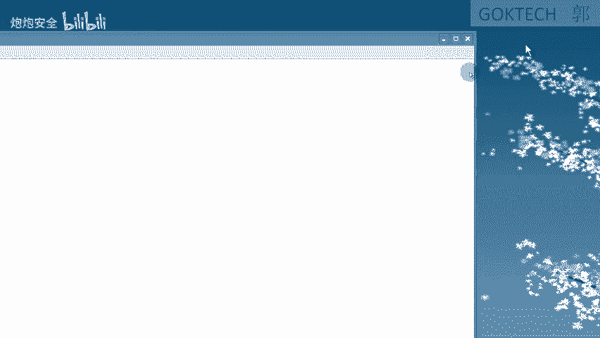

在这段代码中：
*   `eval()` 是PHP中一个可以执行字符串形式PHP代码的函数。
*   `$_POST[‘GOK’]` 用于接收通过POST请求传递的、名为 `GOK` 的参数值。
*   `@` 符号用于抑制可能出现的错误提示，增加隐蔽性。
*   攻击者通过向这个脚本发送特定的POST数据（即“密码”），就能远程控制服务器执行相应命令。

## 工具演示：连接一句话木马 🔧

理解了木马的原理后，我们来看看攻击者如何使用工具连接并控制植入木马的服务器。常用的连接工具有“中国菜刀”和“C刀”。

以下是使用此类工具的基本步骤：
1.  将一句话木马文件（如 `shell.php`）通过漏洞上传到目标服务器的可访问目录。
2.  在连接工具中添加一个新的连接。
3.  填写木马文件的完整URL地址。
4.  设置连接密码（即木马代码中 `$_POST[ ]` 里的键名，本例中为 `GOK`）。
5.  选择正确的脚本语言（如PHP）和字符编码（如GBK，用于正确显示中文）。

连接成功后，攻击者可以在工具界面中：
*   **管理文件**：浏览、下载、上传、删除服务器上的文件。
*   **执行命令**：模拟终端，执行如 `ipconfig`、`whoami` 等系统命令。
*   **操作数据库**：如果服务器有数据库，可以进行类似SQL注入的数据管理。

## 漏洞环境实战：DVWA文件上传 🎯

理论需要结合实践。为了更直观地理解，我们将在DVWA（Damn Vulnerable Web Application）这个专为安全测试设计的漏洞环境中进行演示。

DVWA中提供了一个存在文件上传漏洞的页面。在最低安全等级下，我们可以直接上传一个包含一句话木马的PHP文件。上传成功后，通过访问该文件的URL路径，并使用连接工具配置相同的密码，即可获得服务器的控制权。

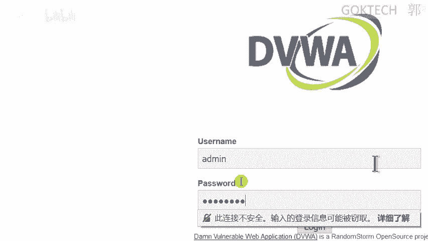

然而，在实际场景中，网站通常会进行一些防御。例如，前端JavaScript可能会检查文件扩展名，只允许上传像 `.jpg`, `.png` 这样的图片格式。

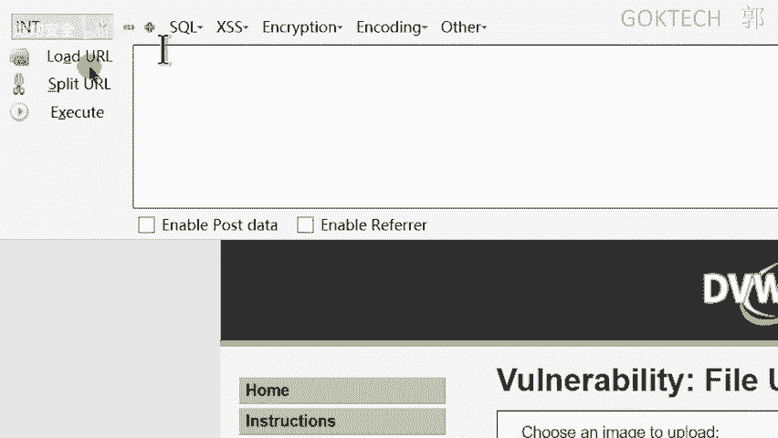

## 绕过前端校验：抓包修改 🕵️♂️

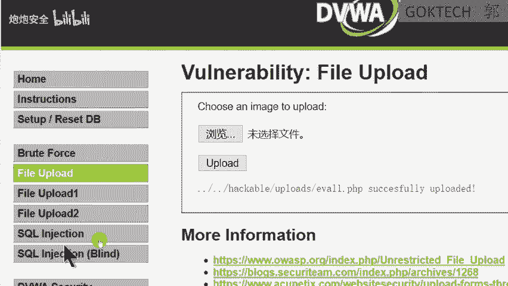

上一节我们看到了前端校验的拦截，本节中我们来看看如何绕过它。前端校验的一个主要弱点是其校验过程发生在用户的浏览器中，攻击者可以通过拦截并修改HTTP请求来绕过它。

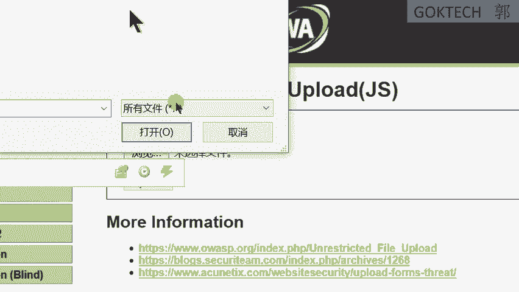

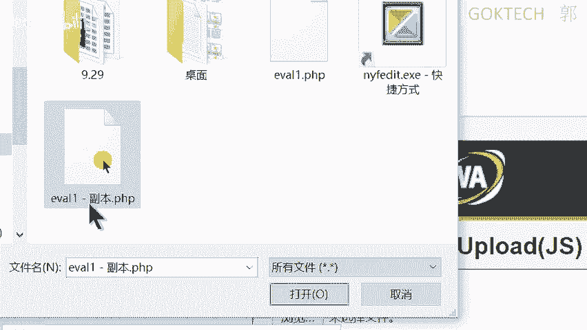

以下是基本的绕过思路：
1.  使用抓包工具（如Burp Suite）拦截浏览器发送的上传请求。
2.  在拦截到的请求数据中，找到代表文件名和扩展名的部分。
3.  将文件名修改为允许的格式（如 `shell.jpg`），但在文件内容中保持木马代码不变。或者，更直接地将请求中的文件扩展名从 `.jpg` 改为 `.php`。
4.  将修改后的请求转发给服务器。

如果服务器后端没有再次进行严格的文件类型和内容检查，那么这个被篡改的恶意文件就会被成功上传。这演示了仅依赖前端校验是完全不够的，安全校验必须在服务端进行。

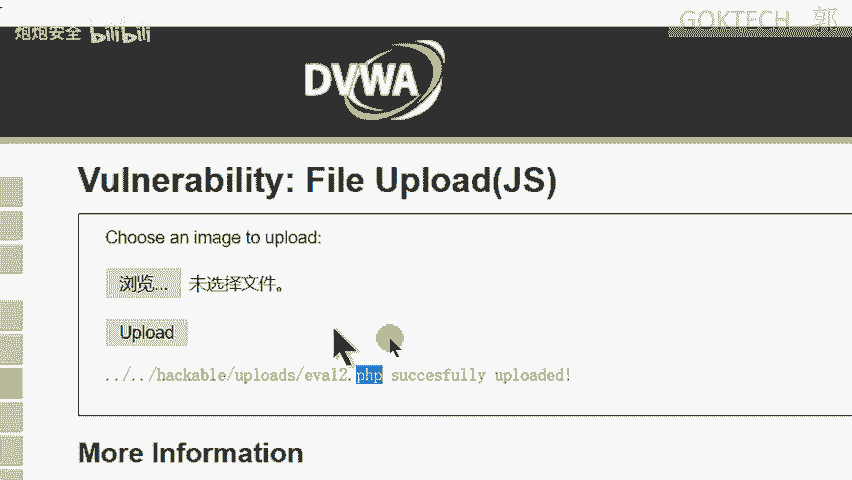

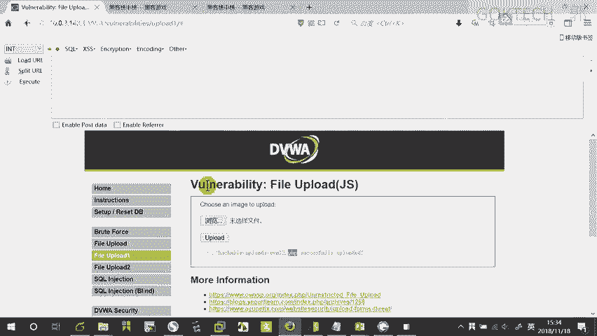

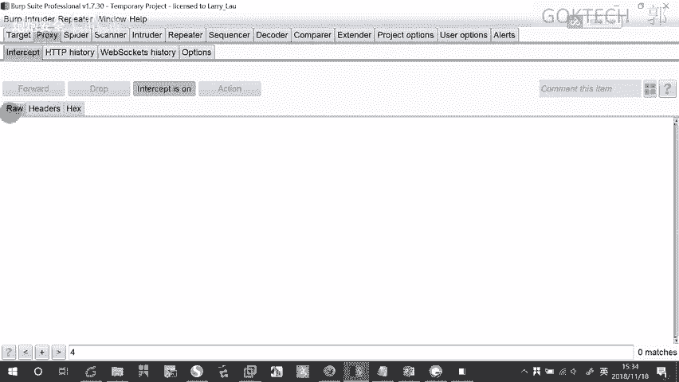

## 总结 📝

本节课中我们一起学习了文件上传漏洞的基本原理和利用方式。我们了解到，由于缺乏足够的服务端验证，攻击者可以上传恶意文件。重点掌握了一句话木马的精简结构与强大功能，并演示了如何通过工具连接木马控制服务器。最后，我们通过DVWA环境实践，并学习了如何通过抓包修改HTTP请求来绕过薄弱的前端文件校验。记住，安全的文件上传功能必须结合严格的后端校验，包括检查文件类型、内容、大小以及重命名保存文件等。在接下来的课程中，我们将探讨更多关于文件上传漏洞的防御与高级利用技巧。