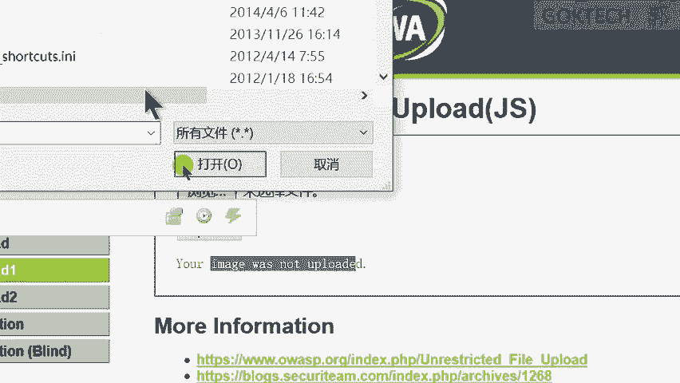
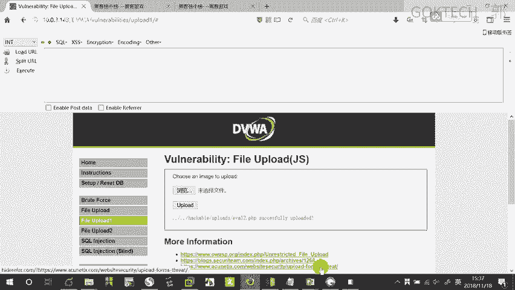
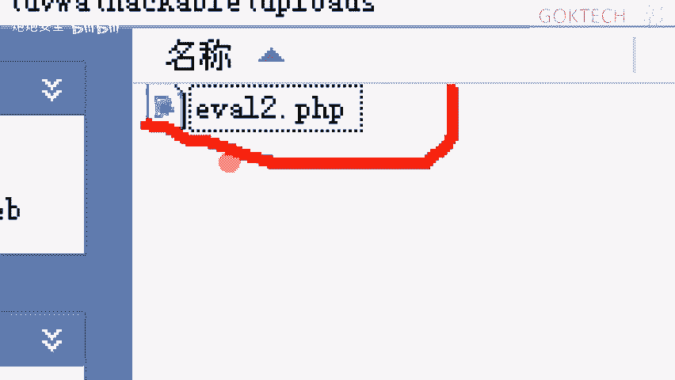
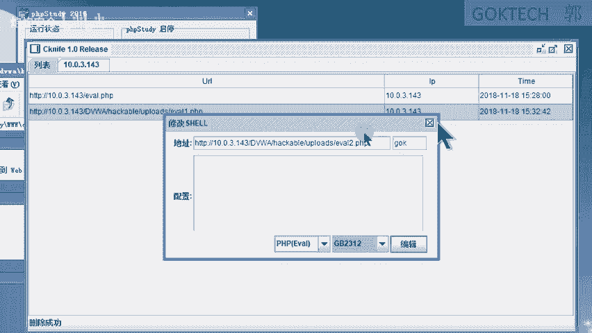
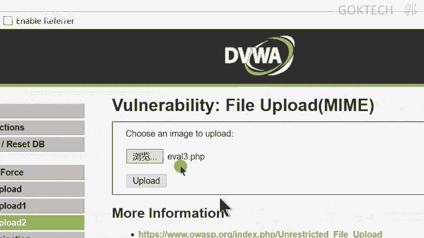
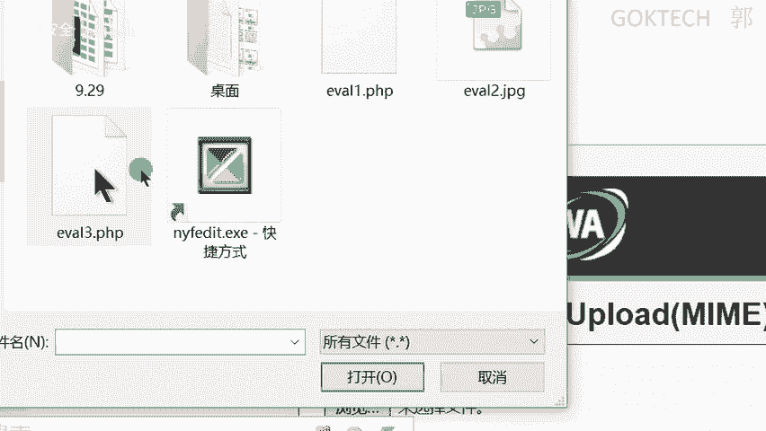
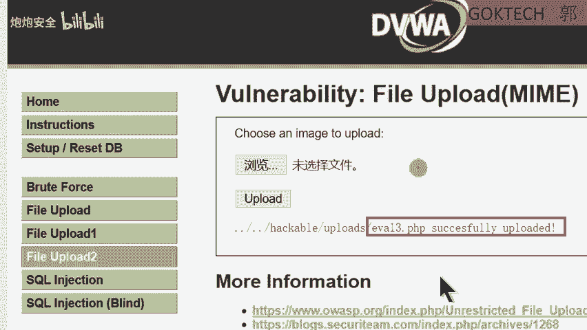
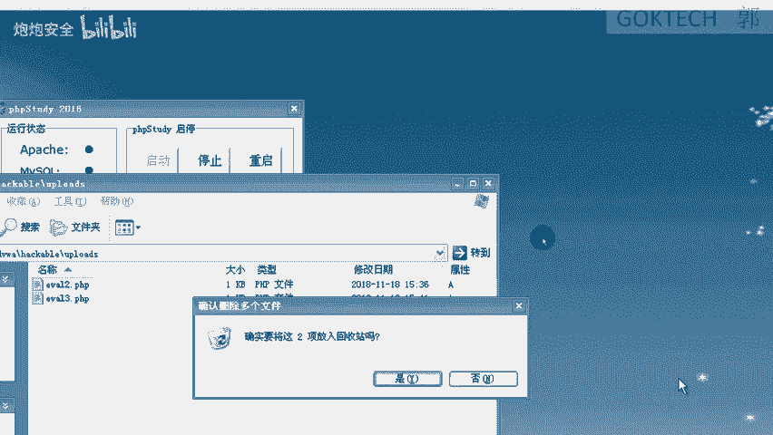
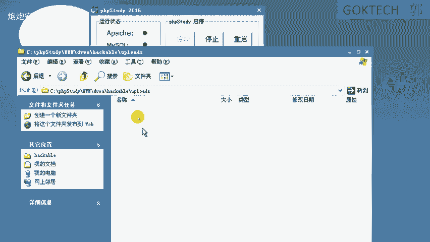

# CTF培训网络安全基础入门：P12：文件上传漏洞与一句话木马（下） 🛡️

在本节课中，我们将继续学习文件上传漏洞的利用方法，特别是如何绕过前端和后端的文件类型校验。我们将通过实际操作演示，展示如何通过修改请求数据来成功上传一句话木马。



## 概述

上一节我们介绍了文件上传漏洞的基本概念和一句话木马的原理。本节中，我们来看看如何绕过常见的文件上传校验机制，包括前端校验和基于MIME类型的后端校验。



## 绕过前端校验



前端校验通常在浏览器中通过JavaScript实现，用于检查用户选择的文件后缀名是否在允许的列表中。这种校验很容易被绕过。



以下是绕过前端校验的步骤：

1.  **准备文件**：首先，将一句话木马文件（例如 `eval.php`）的后缀名改为允许的格式，例如 `.jpg`。
2.  **开启代理拦截**：在浏览器中设置代理工具（如Burp Suite）并开启拦截功能。
3.  **上传文件**：在网页中选择修改后的 `.jpg` 文件并点击上传。
4.  **拦截并修改请求**：代理工具会拦截到浏览器发出的HTTP请求。在请求中找到文件名参数，将其从 `.jpg` 改回 `.php`。
5.  **放行请求**：修改完成后，放行请求，使其发送到服务器。

通过这种方式，我们欺骗了前端校验，使服务器收到了一个 `.php` 文件。

## 绕过MIME类型校验

有些服务器不仅检查文件后缀名，还会检查HTTP请求头中的 `Content-Type` 字段（即MIME类型）来判断文件类型。例如，图片的MIME类型通常是 `image/jpeg`。

当遇到这种后端校验时，我们需要同时修改文件后缀名和 `Content-Type` 字段。

以下是绕过MIME类型校验的步骤：



1.  **准备文件**：同样，先将木马文件后缀改为 `.jpg`。
2.  **开启代理拦截**：确保代理拦截功能已开启。
3.  **上传并拦截请求**：上传 `.jpg` 文件，并在代理工具中拦截该请求。
4.  **修改关键参数**：在拦截到的请求中，需要修改两个地方：
    *   将文件名参数从 `.jpg` 改回 `.php`。
    *   将 `Content-Type` 字段的值从 `application/octet-stream`（或其他值）改为 `image/jpeg`。
5.  **放行请求**：完成修改后，放行请求发送至服务器。



这样，我们就同时绕过了前端和后端的校验。

## 核心概念与代码

**一句话木马** 的核心是一段简短的PHP代码，它接收参数并执行系统命令。其基本形式如下：



```php
<?php @eval($_POST['cmd']); ?>
```
*   `$_POST[‘cmd’]`：接收来自POST请求中名为 `cmd` 的参数。
*   `@eval(...)`：执行参数中的字符串作为PHP代码。


**修改HTTP请求** 是绕过的关键。你需要理解HTTP请求的结构，并知道如何定位和修改 `filename` 和 `Content-Type` 字段。

## 实战注意事项

在实战或练习环境中上传文件时，请注意：

*   如果多人共用一个靶场环境，为避免文件冲突，建议使用个性化的文件名，例如 `你的名字_1.php`。
*   最好在自己的虚拟机环境中搭建靶场进行练习，这样操作更自由，也更安全。



## 总结



本节课中我们一起学习了文件上传漏洞的两种常见绕过技巧：
1.  通过代理工具拦截并修改HTTP请求，绕过基于后缀名的前端校验。
2.  通过同时修改请求中的文件名和 `Content-Type` (MIME类型) 字段，绕过更严格的后端校验。

理解这些基本原理和操作步骤，是掌握文件上传漏洞利用的关键。请务必在合法的靶场环境中进行练习，巩固所学知识。