# CTF培训网络安全基础入门：P13：密码学基础与常见编码

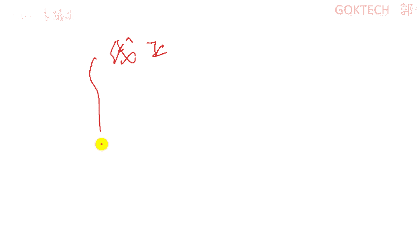

## 概述

在本节课中，我们将学习CTF比赛中密码学题型的基础知识。密码学是保证数据传输和存储可靠性的核心技术。我们将从密码学概述入手，了解其发展、核心概念和分类，然后重点学习比赛中常见的编码方式和古典密码算法。课程内容力求简单直白，让初学者能够快速上手。

---

## 密码学概述

密码学的核心目的是保证数据传输的可靠性。在网络中，数据可能被截获，密码学的作用就是确保即使数据被截获，攻击者也看不懂其内容。

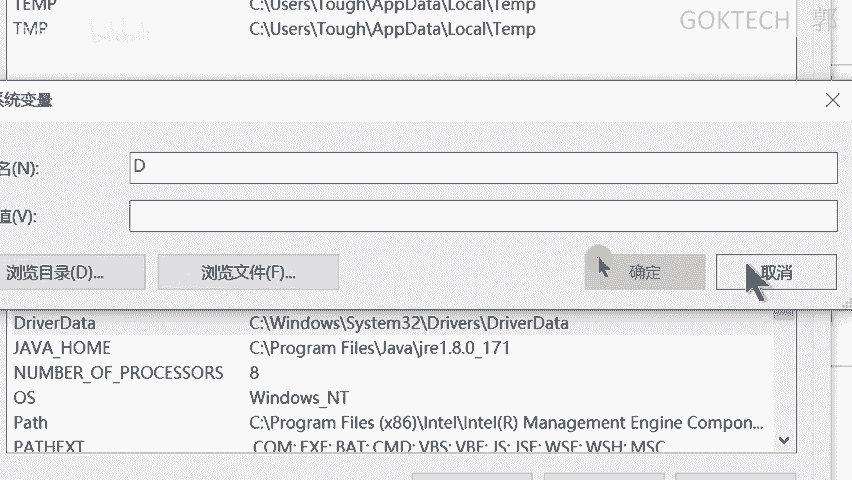

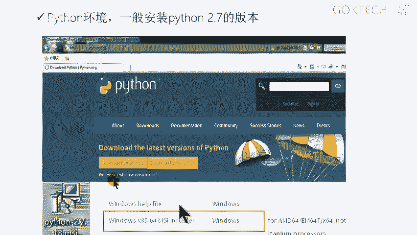

密码学主要应用于数据的动态传输（如网络通信）和静态存储（如数据库加密）。例如，访问HTTPS网站时，数据传输是加密的；而数据库中的用户密码通常也会以密文形式存储。

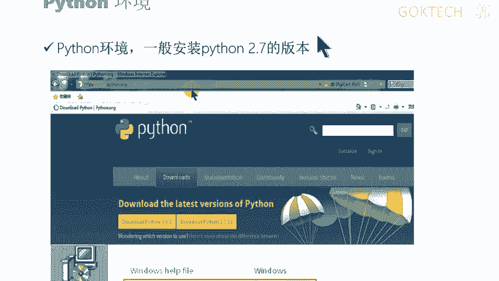

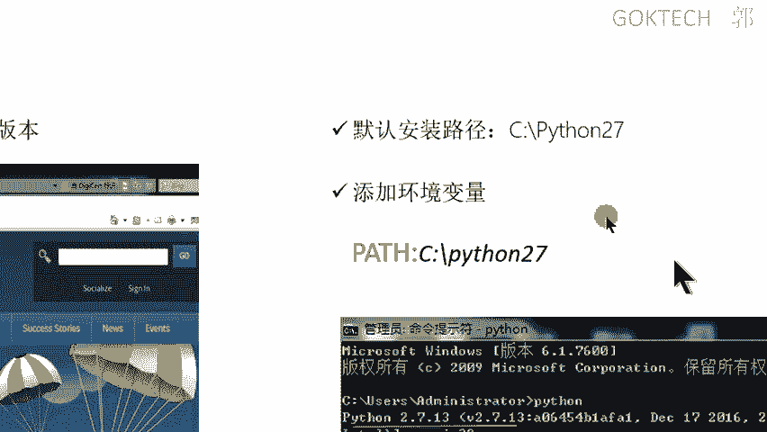

### 密码学分类

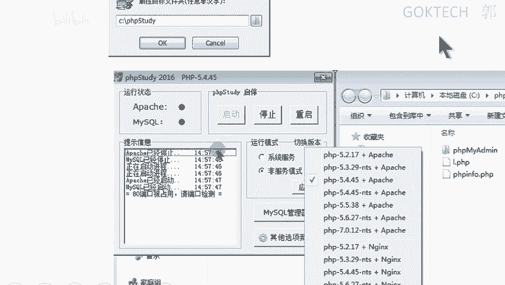

密码学主要分为三类：编码、加密和摘要。

1.  **编码**：一种映射关系，相当于给数据加了一层“外壳”。例如摩斯电码，它使用点和划的组合来表示字母，需要对照码表才能理解。
2.  **加密**：涉及算法和密钥，过程更为复杂。加密将明文（Plan Text）转换为密文（Cipher Text）。算法通常是公开的，而密钥必须保密。
3.  **摘要**：也称为哈希（Hash）算法，如MD5、SHA系列。它用于验证数据的完整性，具有“雪崩效应”（数据微小改动会导致结果巨大变化）和不可逆性（无法从摘要值反推出原始数据）。

### 对称加密与非对称加密

上一节我们介绍了加密的基本概念，本节中我们来看看加密的两种主要方式。

*   **对称加密**：加密和解密使用相同的密钥。
    *   **优点**：加解密速度快。
    *   **缺点**：密钥必须安全传输和保管，一旦泄露则安全性丧失。
    *   **常见算法**：DES, AES。
    *   **核心公式**：`Cipher = Encrypt(Key, Plain_Text)`；`Plain_Text = Decrypt(Key, Cipher)`

*   **非对称加密**：使用一对密钥：公钥（Public Key）和私钥（Private Key）。
    *   **特点**：用公钥加密的数据，只能用对应的私钥解密；用私钥加密（签名）的数据，可以用公钥验证。
    *   **优点**：解决了密钥分发问题，安全性更高。
    *   **缺点**：加解密速度比对称加密慢很多。
    *   **常见算法**：RSA。
    *   **核心过程**：
        *   加密：`Cipher = Encrypt(Public_Key, Plain_Text)`
        *   解密：`Plain_Text = Decrypt(Private_Key, Cipher)`
        *   签名：`Signature = Sign(Private_Key, Data)`
        *   验证：`Verify(Public_Key, Data, Signature)`

在实际应用中（如HTTPS），通常结合两者：使用非对称加密安全地传输一个临时生成的对称密钥，后续通信则使用这个对称密钥进行快速加密。

---

## 常见编码方式

了解了加密的基本原理后，我们来看看CTF中更常遇到的一类问题：编码。编码通常没有密钥，只是数据表示形式的转换。

以下是比赛中常见的编码类型及其特征：

### ASCII编码

*   **描述**：美国信息交换标准代码，用7位或8位二进制数表示字符。
*   **特征**：字符对应数字。例如，`48`是`0`，`65`是`A`，`97`是`a`。
*   **识别**：一串用空格分隔的十进制或十六进制数字。

### Base系列编码

*   **描述**：基于64个可打印字符来表示二进制数据的方法。还有Base32、Base16等变种。
*   **特征**：编码后的字符串通常由字母、数字和`+`、`/`组成，**末尾可能有一个或两个等号`=`作为填充**。
*   **识别**：看到由字母数字和`+/=`组成的字符串，特别是末尾有`=`，很可能就是Base64。

### URL编码

*   **描述**：将特殊字符转换为`%`后跟两位十六进制数的形式，主要用于URL中。
*   **特征**：包含大量`%XX`格式的序列，其中`XX`为十六进制数。
*   **识别**：字符串中包含`%20`（空格）、`%E4%B8%AD`（中）等模式。

### Unicode编码

*   **描述**：一种字符集，为世界上大多数文字系统提供了统一的编码。
*   **特征**：在字符串中常表现为`\uXXXX`的形式，其中`XXXX`是四位十六进制数。
*   **识别**：看到`\u4e2d\u6587`这样的格式。

### JS混淆编码

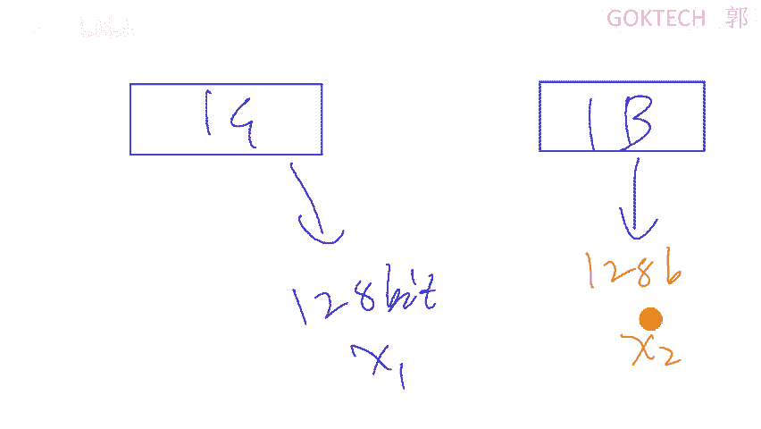

*   **描述**：为了保护JavaScript代码，开发者会使用各种方法将其变得难以阅读。
*   **常见形式**：
    1.  使用`eval()`函数执行经过编码的字符串。
    2.  使用类似`[][`!`+`+`][+[]]`这种仅用少量字符组成的混淆代码。
*   **识别**：在网页源码中看到大量无意义的字符组合或`eval(function(p,a,c,k,e,d)...`这样的模式。
*   **处理方法**：通常可以复制到浏览器控制台直接执行，或使用在线解码工具。

---

## 古典密码算法

古典密码是现代密码学的基础，在CTF杂项和密码学题中经常出现。它们通常规则简单，但形式多样。

### 换位密码

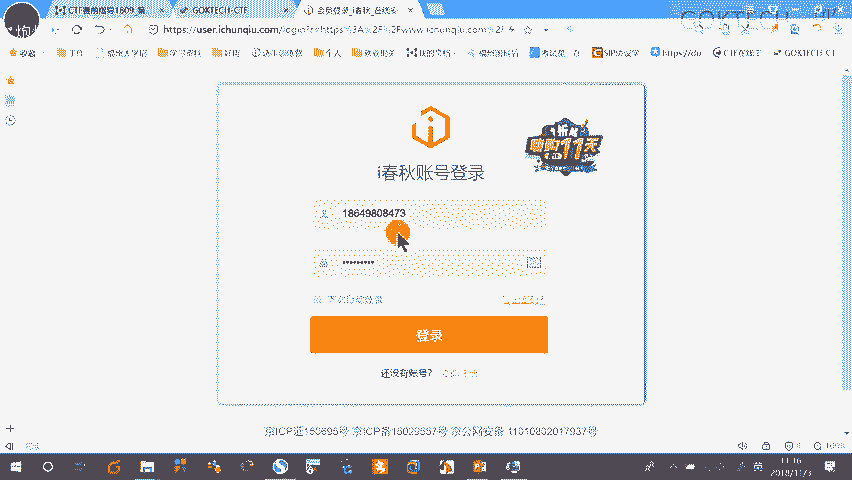

换位密码不改变字符本身，只改变它们的排列顺序。

*   **栅栏密码**：将明文分成若干组，然后按组拼接。
    *   **示例**：明文`THEQUICKBROWNFOX`，密钥为2。
        *   分组：`T E U C B O N O J` 和 `H Q I K R W F X`
        *   密文：`TEUCBONOJHQIKRWFX`

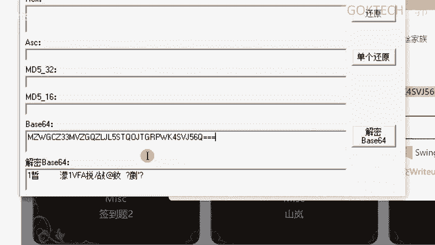

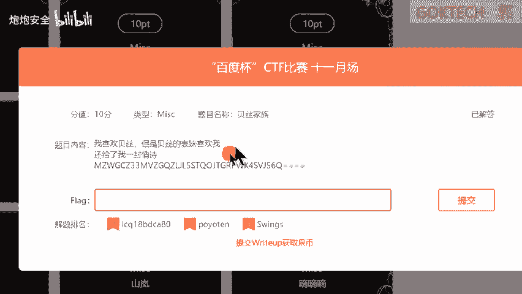

*   **曲路密码**：将明文按一定路径（如“之”字形）填入矩阵，再按另一路径读出。
*   **列移位密码**：将明文按行填入矩阵，然后按一个密钥决定的列顺序读出。

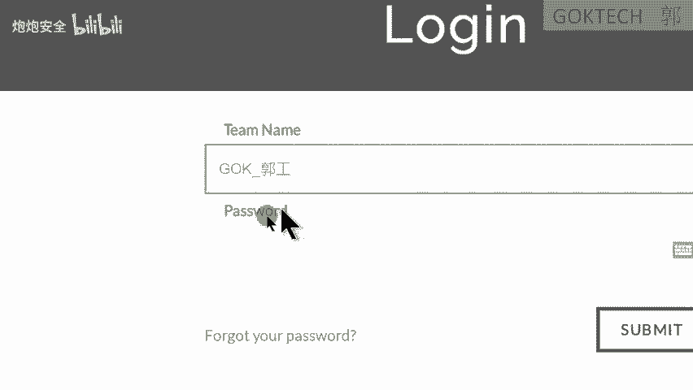

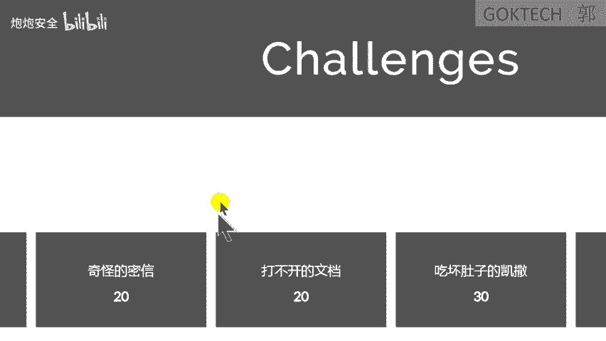

### 替换密码

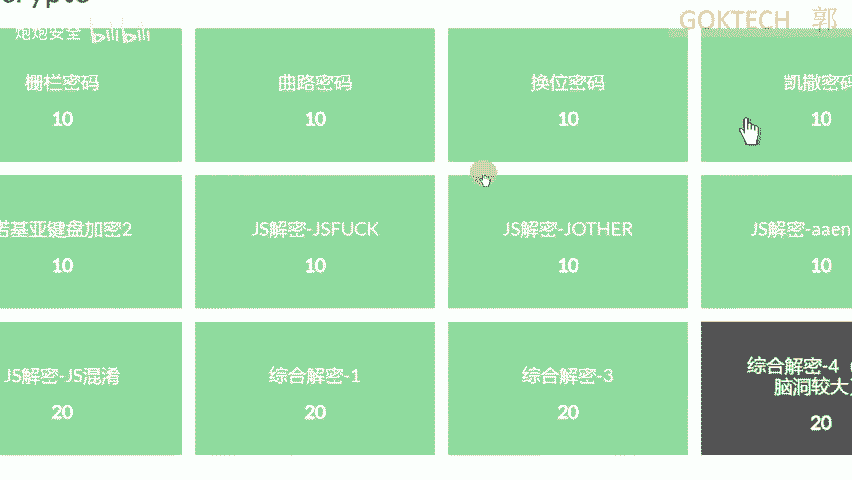

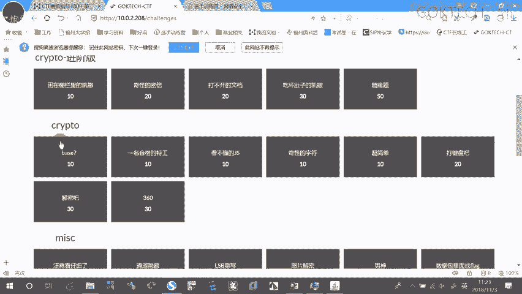

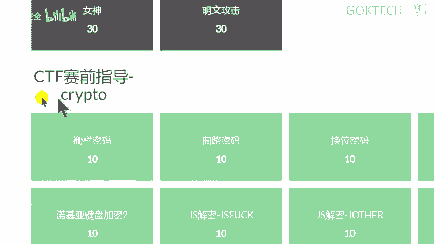

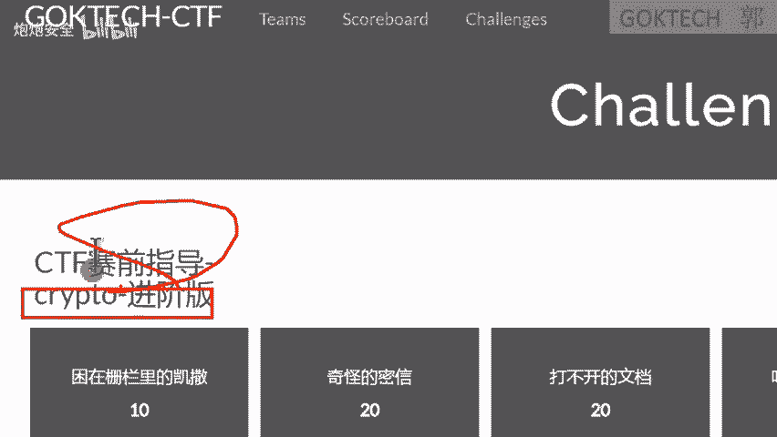

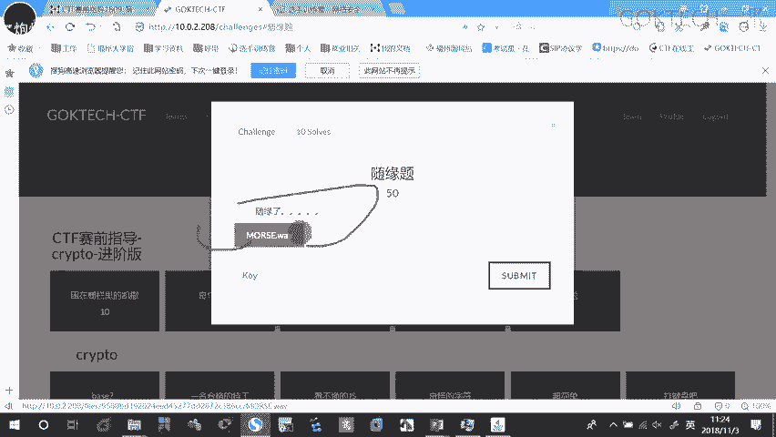

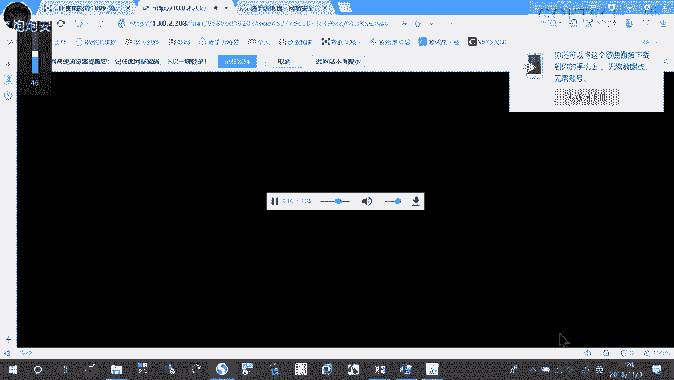

替换密码将明文中的字符替换为其他字符。

*   **凯撒密码**：最著名的替换密码，每个字母在字母表上向后（或向前）移动固定位数。
    *   **算法**：`Cipher = (Plain_Char + Shift) mod 26`
    *   **示例**：移位3，`A -> D`, `B -> E`, ..., `Z -> C`。

*   **摩斯电码**：用点（.）和划（-）的组合表示字母数字。
    *   **特征**：由`.`、`-`、`/`或空格组成。
    *   **示例**：`SOS` 的摩斯电码是 `... --- ...`。

*   **培根密码**：使用两种字符（如A和B）的五位组合来代表一个字母。
    *   **特征**：由连续的A和B组成，每5位一组。
    *   **示例**：`AAAAA` 代表 `A`，`AAABA` 代表 `B`。

*   **维吉尼亚密码**：使用一个关键词作为密钥，进行多表替换。
    *   **步骤**：将明文和密钥重复对齐，查维吉尼亚方阵表找到密文字母。

*   **键盘密码**：利用键盘布局进行编码。
    *   **QWE编码**：将字母按键盘`QWERTY`布局的顺序对应到`ABCDEF...`。
    *   **坐标编码**：用键盘上的行号和列号来表示字母（如`11`可能代表`Q`）。

---

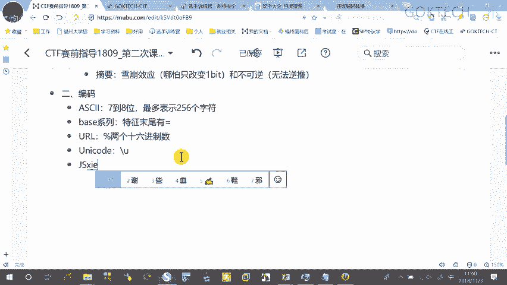

## 摘要算法（哈希）

摘要算法用于验证数据完整性，在CTF中常遇到需要“破解”MD5或SHA1的情况。注意，这里所谓的“破解”通常是通过查询彩虹表来寻找对应原文，而非从数学上逆向计算。

*   **MD5**：产生128位（16字节）的哈希值，通常表示为32位十六进制字符串。
    *   **特征**：32位十六进制字符串（0-9, a-f）。
    *   **示例**：`e10adc3949ba59abbe56e057f20f883e`（原文`123456`）。

*   **SHA1**：产生160位（20字节）的哈希值，通常表示为40位十六进制字符串。
*   **SHA256**：产生256位哈希值，表示为64位十六进制字符串。

**重要特性**：
1.  **雪崩效应**：输入微小改变，输出截然不同。
2.  **不可逆性**：理论上无法从哈希值反推原始数据。
3.  **碰撞抵抗**：难以找到两个不同的输入产生相同的哈希值。

在CTF中，如果给出一段哈希值，通常需要利用在线工具或本地彩虹表进行查询，寻找可能的原文。

---

## 总结

本节课我们一起学习了CTF密码学的基础知识。我们从密码学的目的和分类讲起，区分了编码、加密和摘要。然后深入探讨了对称与非对称加密的原理。接着，我们详细分析了比赛中常见的各种编码方式（如ASCII、Base64、URL编码等）和古典密码算法（如凯撒、栅栏、摩斯电码等），并介绍了摘要算法的特点。

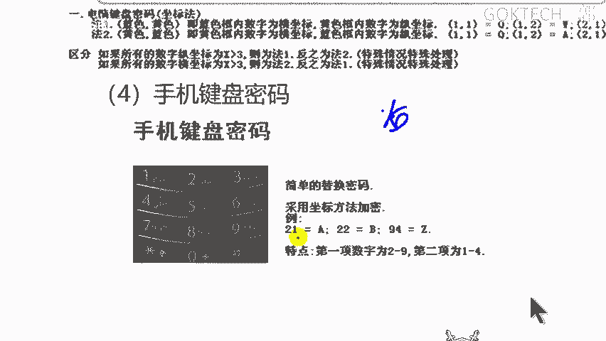

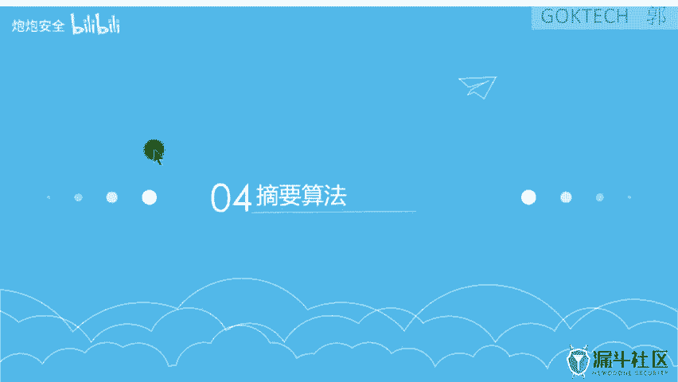

掌握这些基础知识是解决CTF密码学题目的第一步。关键在于**识别题目给出的线索**：一串数字可能是ASCII，末尾带等号可能是Base64，由点和划组成可能是摩斯电码。多练习、多使用工具（如CyberChef、CAP工具包）、多积累经验，就能快速提升解题能力。

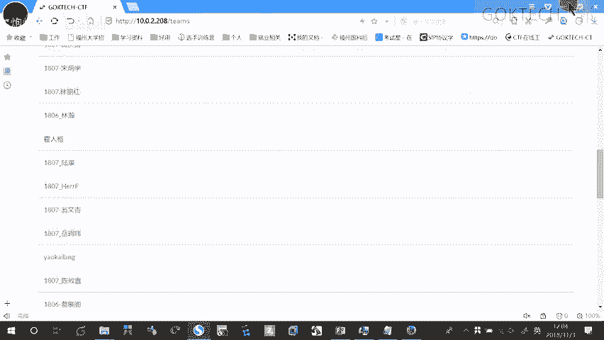

课后请大家利用提供的实验平台和手册进行练习，熟悉各种编码和密码的识别与解密过程。