# CTF培训网络安全基础入门：P15：杂项（中）

在本节课中，我们将深入学习CTF杂项题目中关于文件分析、隐写术以及图片处理的进阶内容。我们将重点探讨如何分析文件结构、分离隐藏数据，以及处理各种经过加密或修改的图片文件。

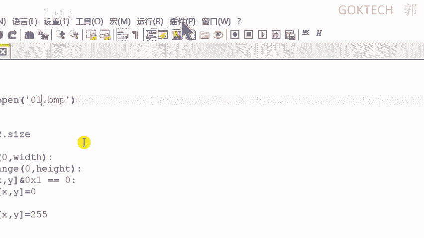

---

## 文件分析与分离

上一节我们介绍了杂项题目的基本概念。本节中，我们来看看如何对下载到的附属文件进行分析和分离。

每个文件都有其特定的结构，称为文件头。通过分析文件头，我们可以判断文件的真实类型。

### 分析方法

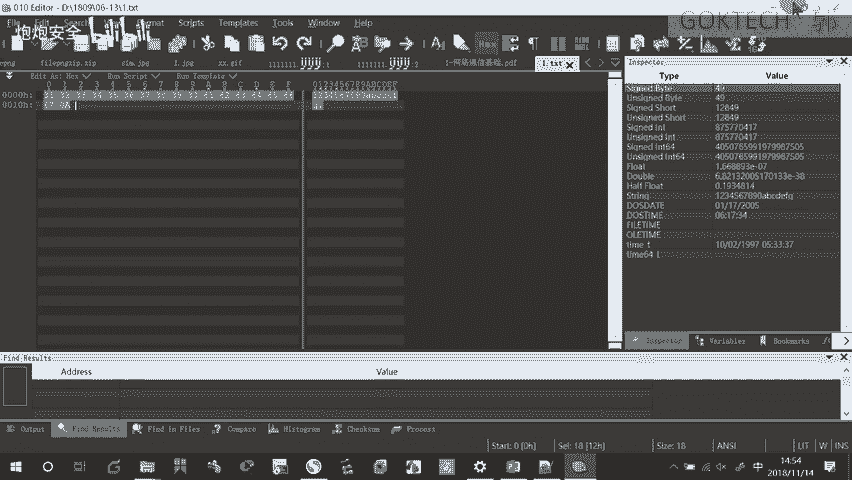

以下是两种主要的分析方法：

*   **手工分析**：使用文本编辑器（如Notepad++）或十六进制编辑器（如010 Editor、WinHex）直接查看文件的十六进制内容，并与已知的文件头类型表进行比对。
*   **工具分析**：使用自动化工具（如Linux下的`file`命令）自动识别文件类型，这本质上也是基于文件头类型表进行的。

### 文件分离原理与工具

当文件内隐藏了其他内容时，我们需要进行分离。其原理是根据不同文件的文件头/文件尾特征，在十六进制数据流中进行查找和切割。

以下是几种分离方法：

*   **自动化工具**：使用Kali Linux中的`binwalk`（`-e`参数用于自动提取）或`foremost`，它们能自动识别并分离出嵌入的文件。
*   **半自动化方法**：使用`dd`命令。这条命令可以根据指定的块大小和数量进行数据切割。默认块大小单位是字节。使用前通常需要用`binwalk`分析出隐藏数据的偏移位置。
*   **纯手工方式**：在十六进制编辑器中，手动搜索文件头特征，选中对应数据区域，然后将其另存为一个单独的文件。

---

## 图片隐写与处理

在CTF杂项中，图片是最常见的隐写载体。接下来我们看看针对图片的各种操作。

### 1. Fireworks 文件处理

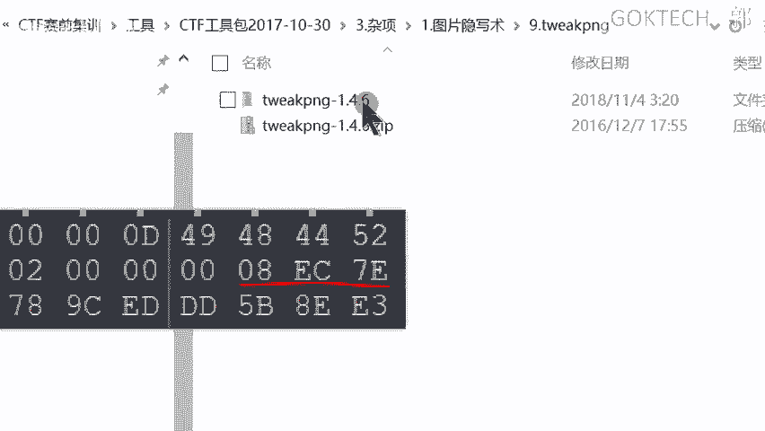

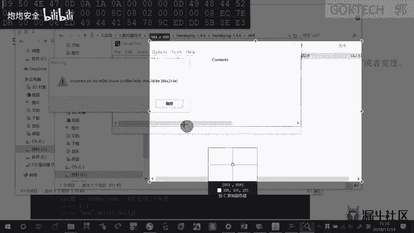

Adobe Fireworks（PNG格式）文件可能包含图层或帧信息。
*   **原理**：Fireworks文件可能将信息存放在多个图层或多帧动画中。
*   **工具**：使用Fireworks软件本身或专用查看器，可以进行**图层分离**或**帧分解**，从而发现隐藏信息。

### 2. 图片元数据（Exif）信息

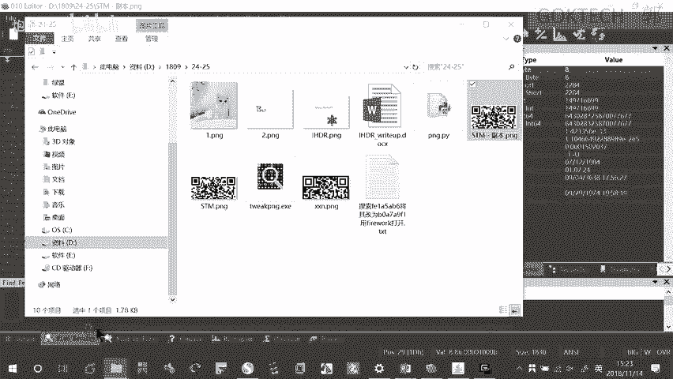

图片文件可能包含拍摄时间、GPS位置等元数据。
*   **查看方法**：
    *   Windows：右键图片 -> “属性” -> “详细信息”。
    *   Linux：使用`exiftool`命令查看。

### 3. 图片分析工具 (Stegsolve)

这是一款功能强大的Java工具，常用于分析图片隐写。
*   **主要功能**：
    *   **通道分离**：分离RGB等颜色通道，可能发现单通道隐藏的图案。
    *   **最低有效位（LSB）分析**：提取每个像素颜色值最低位的信息并进行组合，还原隐藏数据。
    *   **图片对比**：对两张看似相同的图片进行异或、与、或、减等操作，突出细微差别。

### 4. LSB隐写术

这是一种常见的隐写方法。
*   **原理**：将秘密信息二进制位，替换每个像素颜色值（R、G、B）中的**最低有效位**。因为改动很小，人眼难以察觉。
*   **提取方法**：
    *   使用Stegsolve的“Extract Data”功能。
    *   使用Python脚本（如`lsb.py`）进行提取。脚本需要在图片所在目录运行，并可能需要根据环境使用`python2`或`python3`命令执行。

### 5. PNG图片高度/CRC校验修改

PNG图片的文件头不仅包含类型标识，还包含宽度、高度及CRC校验值等信息。
*   **原理**：图像创建时，会根据图像数据（如宽高）计算出一个CRC校验值。如果图像被修改（如故意修改高度值或校验值），会导致校验错误，图片可能无法正常显示或只显示一部分。
*   **工具与修复**：使用`TweakPNG`这类工具可以查看并修复CRC错误。有时需要根据正确的CRC值，反向计算出被修改的正确图像高度或宽度。可以使用现成的Python脚本（如`png.py`）进行暴力计算，修复尺寸后，隐藏的二维码等信息便会完整显示。

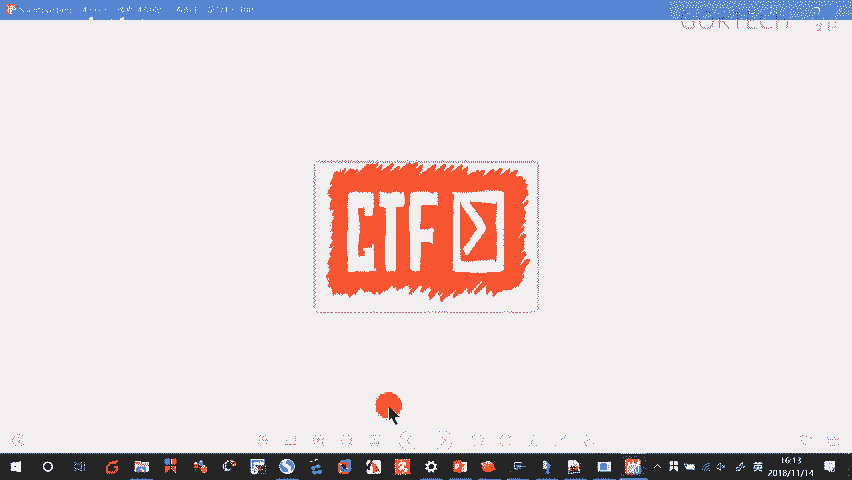

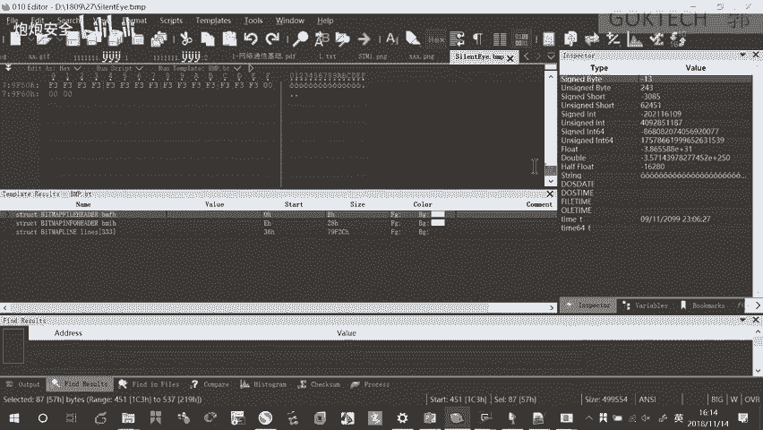

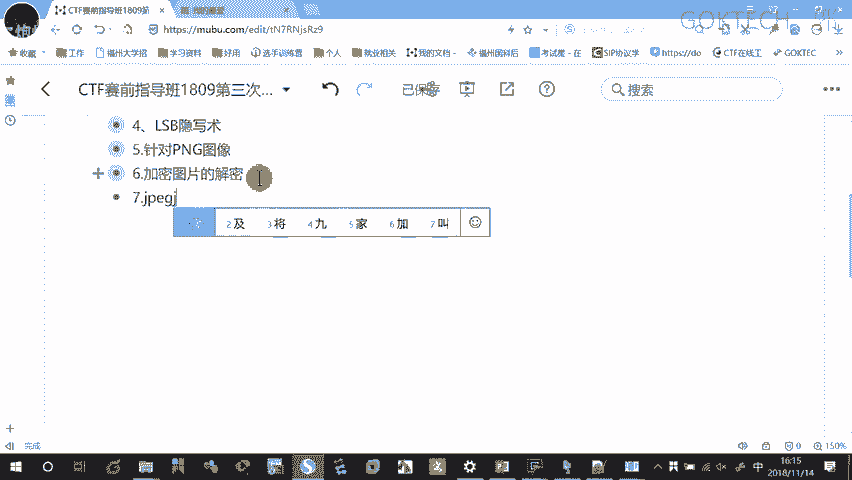

### 6. 加密图片的解密

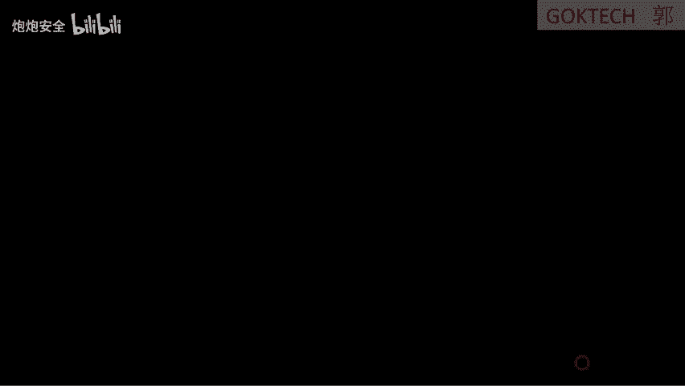

有些图片隐写后还进行了加密，需要先解密才能得到隐藏信息。
*   **工具示例**：
    *   **BF Tools**：一个命令行工具，可用于解密某些特定加密的图片。通常需要两步：先用`bf.exe -d`解密生成一个新文件，再运行这个新文件获取最终结果。
    *   **SilentEye**：一个图形化工具，可将隐藏了文件或文本的图片进行解密。如果题目文件名或内容提示该工具，则可直接使用它打开图片并选择解密（Decode）功能。

### 7. JPEG图像加密分析

JPEG图像也有多种隐写加密方式。
*   **分析工具**：使用`StegDetect`可以分析JPEG图片使用了哪种隐写加密方式（如`JPhide`、`OutGuess`、`F5`）。
*   **对应解密工具**：
    *   **JPhide**：使用图形化工具`JPHS`（Windows版）进行解密，通常需要密码。
    *   **OutGuess**：通常在Linux环境下编译使用，命令如`outguess -r 加密图片.jpg 输出文件.txt`。
    *   **F5**：需要Java环境，使用命令如`java Extract 加密图片.jpg -p 密码`进行解密。

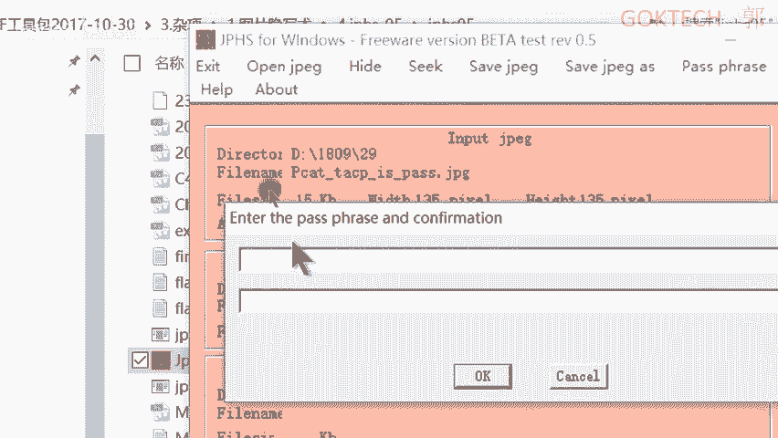

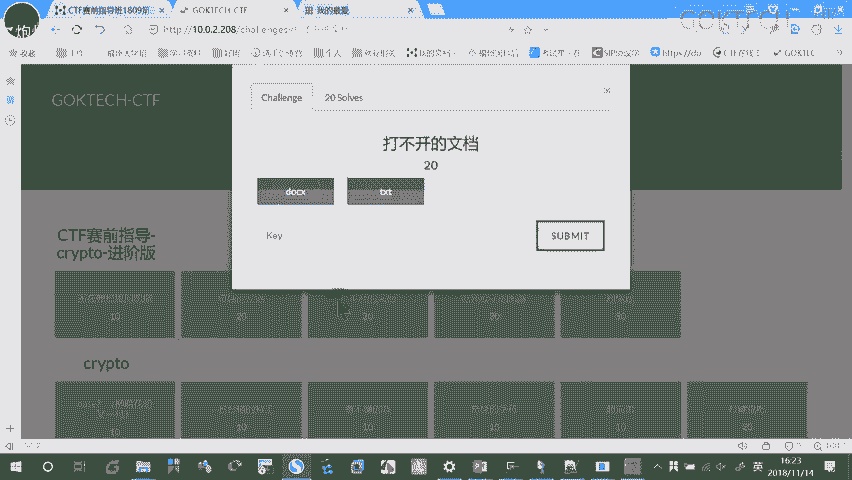

### 8. 二维码处理

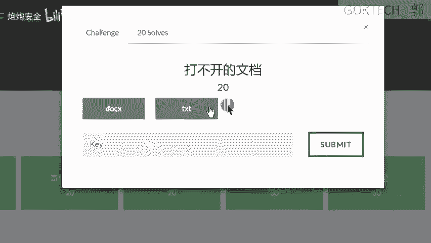

有时二维码不完整或被干扰。
*   **处理方法**：如果二维码缺少定位角标，可以手动从其他完整二维码中截取定位角标，拼贴到原图上，使其能够被扫描器识别。

---

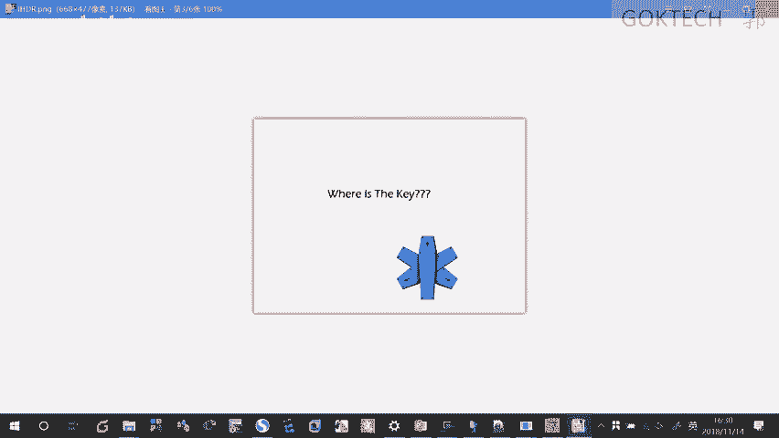

本节课中我们一起学习了CTF杂项中文件分析、分离以及图片隐写的多种高级技巧。核心在于理解不同文件格式的结构和隐写原理，并熟练运用对应的工具进行分析、分离和解密。实践是掌握这些技能的关键，请务必通过题目进行练习。