# CTF培训网络安全基础入门：P16：国科CTF平台使用与密码学入门 🚀

在本节课中，我们将学习如何使用国科CTF平台进行练习，并初步掌握几种经典的密码学题型解题方法。通过实践，我们可以更好地理解CTF比赛的解题思路。

## 平台注册与登录

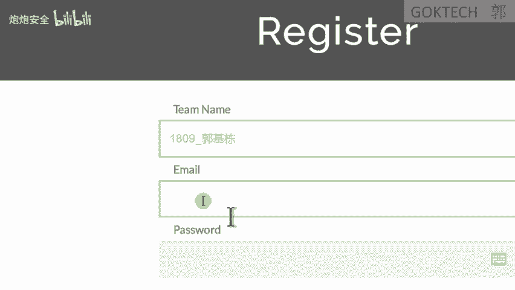

首先，国科CTF平台搭建在公司内网。使用前，需要连接到指定的Wi-Fi网络。

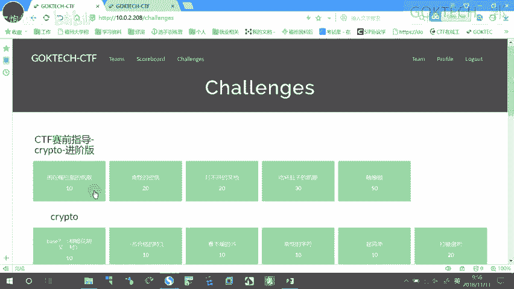

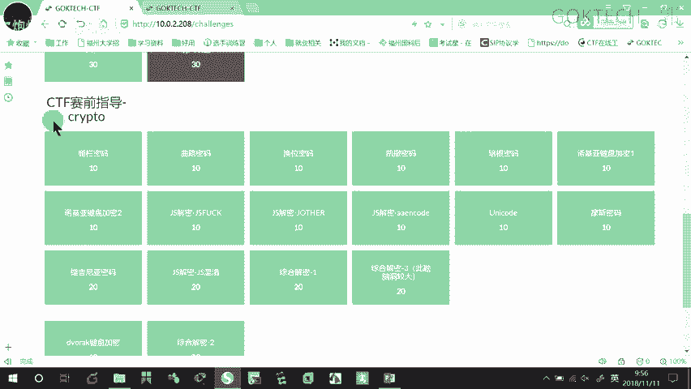

以下是连接和注册步骤：
1.  连接到名为 `student` 的Wi-Fi网络。
2.  打开浏览器，访问平台网址：`10.0.2.208`。
3.  点击页面右上角的“注册”按钮。
4.  注册时，用户名请统一以 `1809` 开头，例如 `1809郭继栋`。
5.  填写邮箱并设置密码，完成后点击登录。

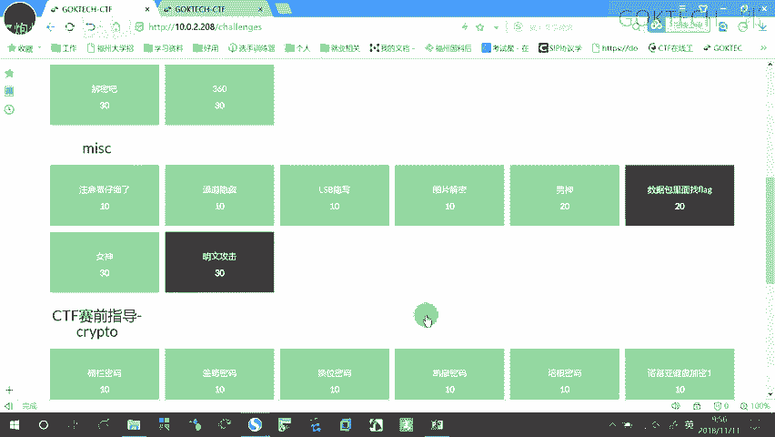

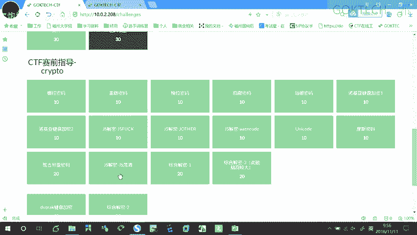

登录后，可以在个人资料（Profile）页面修改用户名、邮箱和密码。

## 题目选择与练习路径

登录平台后，点击“挑战”（Challenge）即可看到各类题目。

对于初学者，建议按以下顺序进行练习：
1.  首先完成 **“CTF赛前指导”** 中的密码学题目。
2.  学有余力后，可以尝试 **“三指导”** 的进阶版题目。
3.  最后，可以挑战其他相关模块的题目，巩固密码学基础。

遵循这个路径，可以系统地掌握密码学的基本知识。

## 密码学题目实战解析

上一节我们介绍了平台的登录和题目选择，本节中我们来看看如何具体解题。我们将通过几个例子，演示经典密码的解法。

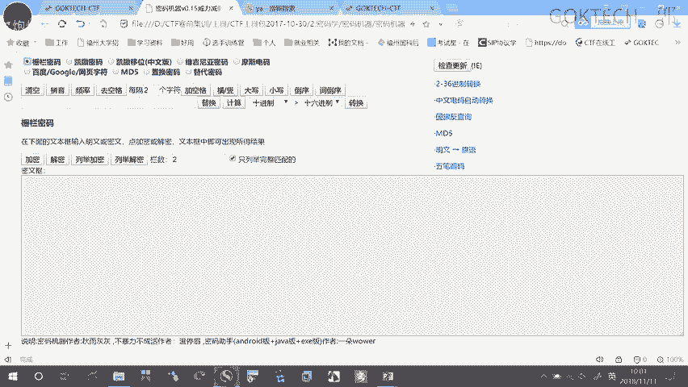

### 栅栏密码

第一题是栅栏密码。栅栏密码属于移位密码的一种，其核心思想是将明文按一定栏数分组，然后重新排列组合形成密文。

**加密过程（以两栏为例）**：
1.  去除明文中的所有空格。
2.  将字符按顺序两两一组进行分组。
3.  将每组第一个字符取出，组成新字符串A；将每组第二个字符取出，组成新字符串B。
4.  将字符串A和B连接起来，即得到密文。

**解密过程**：
解密是加密的逆过程。如果已知密文和栏数（例如题目提示为3栏），则：
1.  将密文平均分成3组。
2.  依次取每组第一个字符、第二个字符、第三个字符...，按顺序拼接，即可恢复明文。
3.  最后根据语义手动添加空格。

**工具辅助**：
对于未知栏数的情况，可以使用工具进行暴力破解。推荐使用“CTF工具包”中的“密码机器”工具。
1.  打开工具，选择“栅栏密码”功能。
2.  将密文粘贴到输入框。
3.  工具会自动尝试不同栏数进行解密，并列出所有可能的结果。
4.  从结果中识别出有意义的句子即为明文。

### 曲路密码

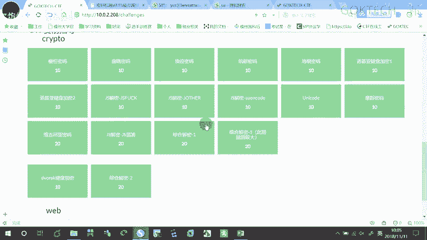

曲路密码是一种需要按照特定路径（如“先下后上”或“先上后下”）在矩阵中读取字符的密码。

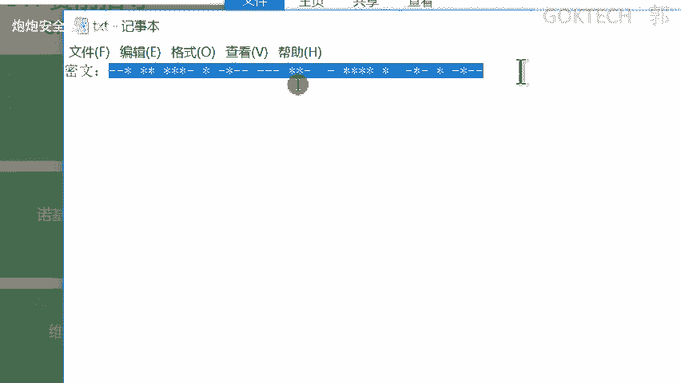

**解题步骤**：
1.  根据题目提示，确定矩阵的行列数（例如5行x列）。
2.  将密文字符按顺序从左到右、从上到下填入矩阵。
3.  按照指定的路径（如“先下后上”）遍历矩阵，读取字符。
4.  将读取出的字符序列连接起来，通常就能得到包含`key`、`flag`等关键词的明文。

### 摩斯电码

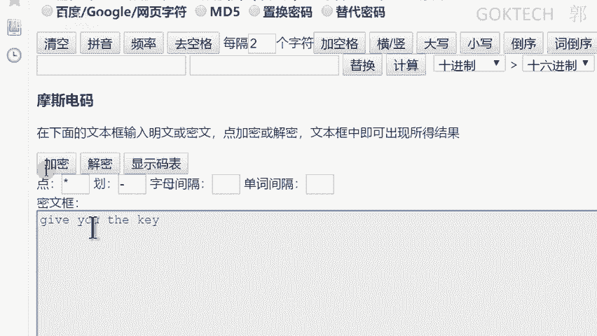

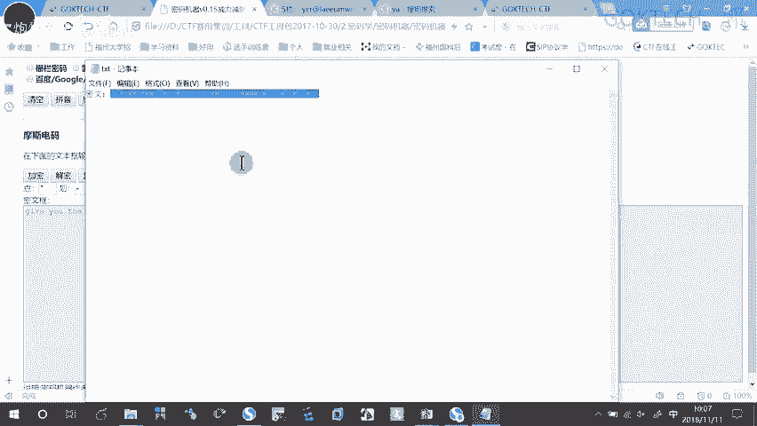

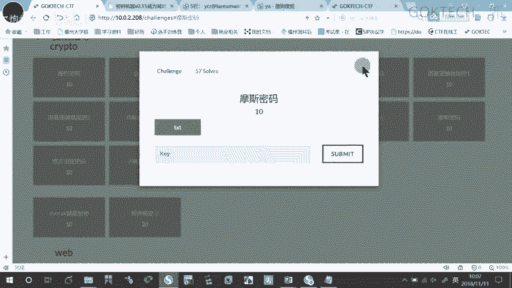

摩斯电码使用点（.）和划（-）的不同组合来表示字母和数字。

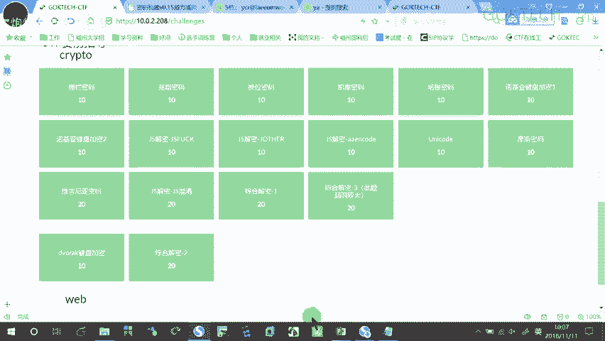

**解题步骤**：
1.  下载题目附件，用记事本打开，获取密文。
2.  打开“密码机器”工具，选择“摩斯电码”功能。
3.  识别密文中用于表示点和划的符号（可能是`*`和`-`，也可能是`.`和`-`）。
4.  在工具中正确设置点、划以及字符间隔符（通常是空格或`/`）。
5.  将密文粘贴到工具中，即可解密得到明文。

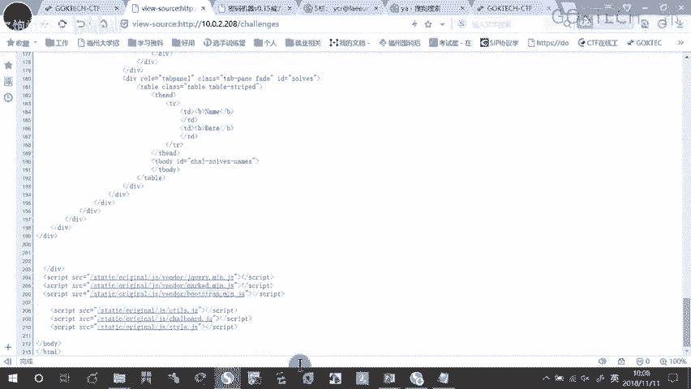

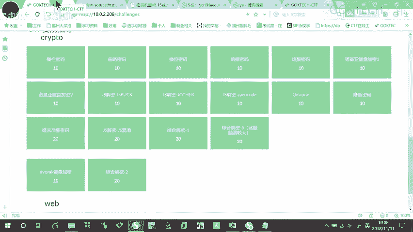

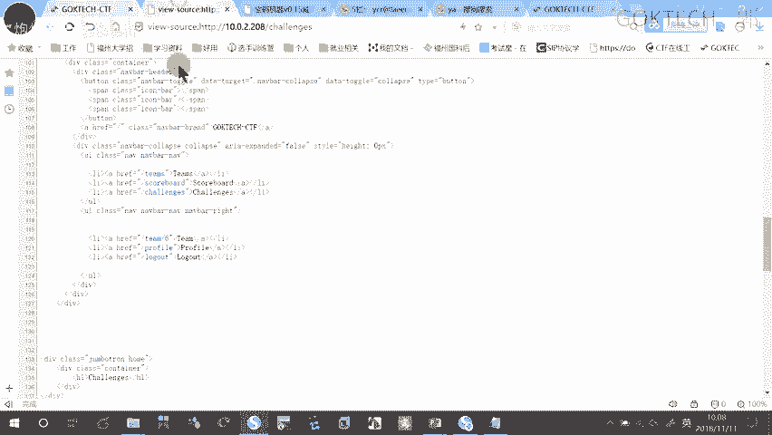

### JS代码混淆

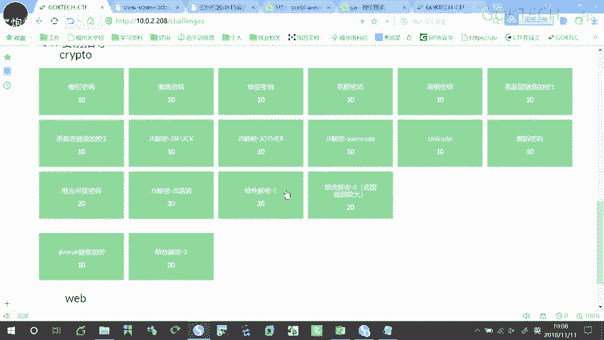

有些题目会给出经过混淆的JavaScript代码，目的是保护源代码不被轻易读懂，但浏览器依然能够解析执行。

**解题步骤**：
1.  复制题目中提供的混淆后JS代码。
2.  在浏览器中打开任意一个网页（如CTF平台页面）。
3.  按 `F12` 键（部分键盘需配合 `Fn` 键）打开开发者工具。
4.  切换到“控制台”（Console）标签页。
5.  将混淆的JS代码粘贴到控制台输入区，按回车执行。
6.  代码执行后，可能会直接输出`flag`，或在页面上显示出关键提示信息。

## 总结与练习

本节课中我们一起学习了国科CTF平台的基本使用方法，并动手解析了栅栏密码、曲路密码、摩斯电码和JS混淆这几种常见的CTF密码学题型。核心要点在于理解算法原理，并熟练运用工具进行辅助解密。

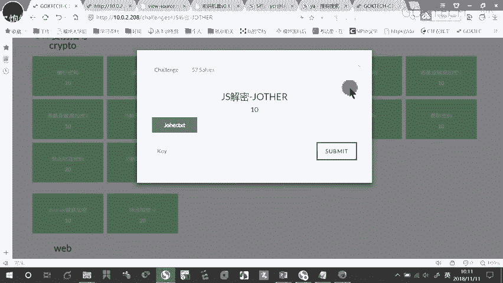

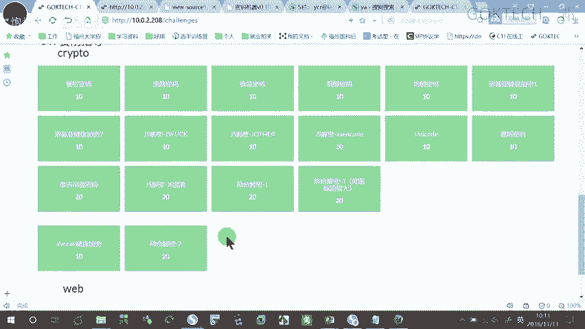

现在，请大家根据介绍的练习路径，在平台上开始实际操作。遇到不懂的问题可以随时提问。实践是掌握CTF技能的最佳途径，祝大家练习顺利！