# CTF培训网络安全基础入门：P17：杂项：压缩+流量分析

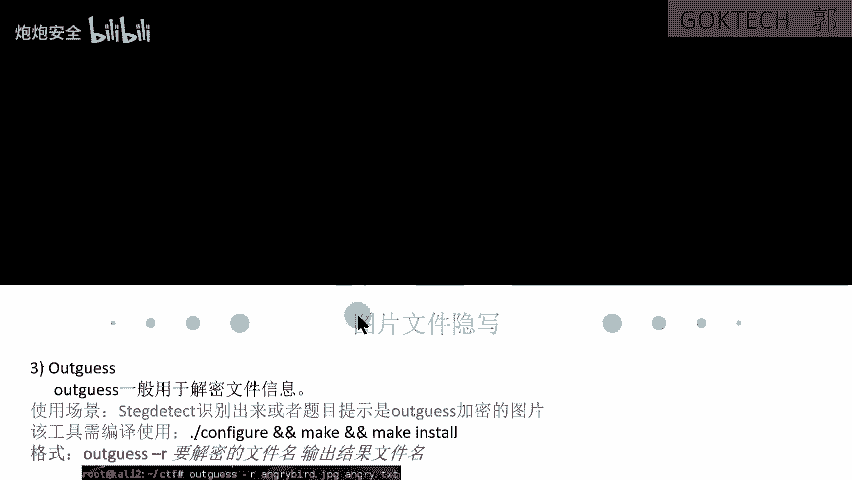

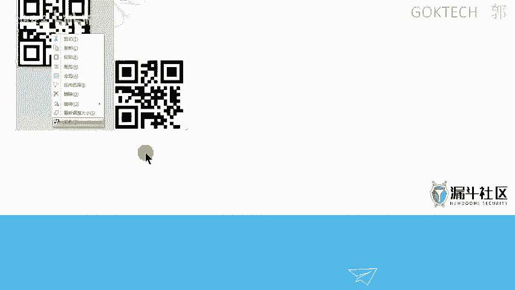


## 概述

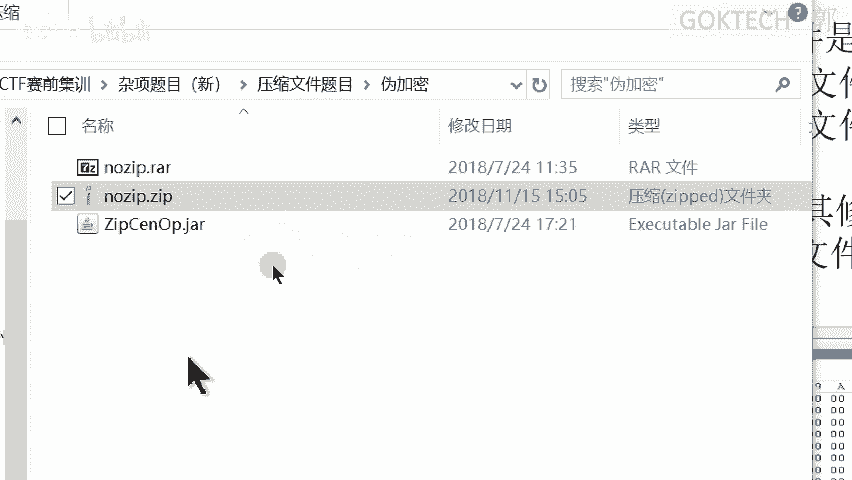

在本节课中，我们将学习CTF杂项题目中两个重要的方向：压缩文件分析与网络流量分析。我们将了解常见的压缩包加密与破解技术，以及如何使用工具（如Wireshark）捕获、过滤和分析网络数据包，从中提取关键信息或flag。

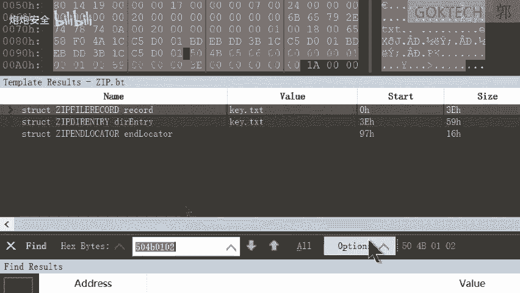

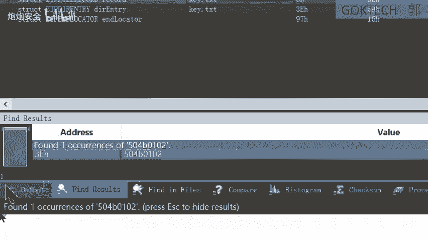

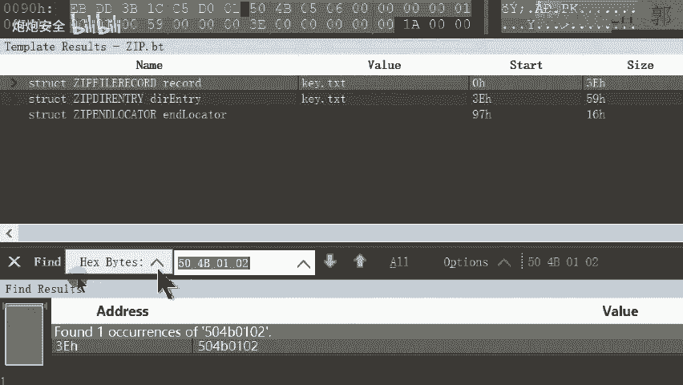

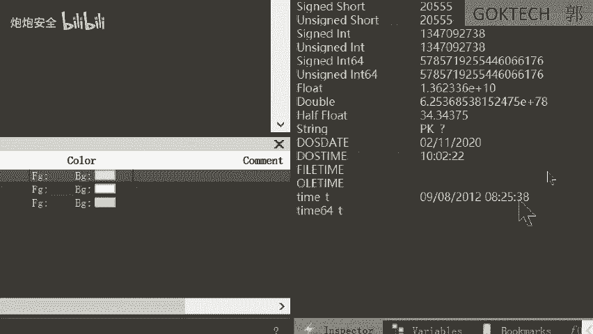

---

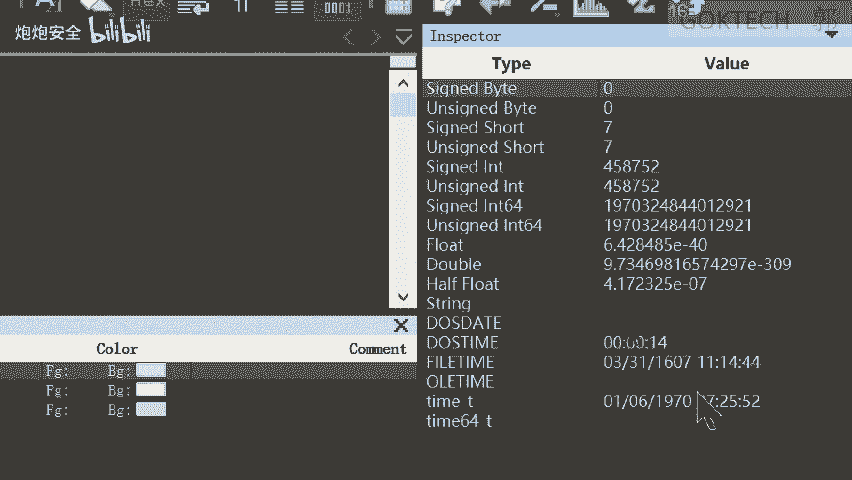

## 压缩文件分析

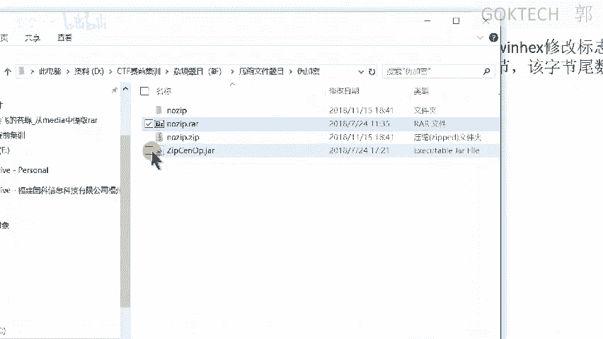

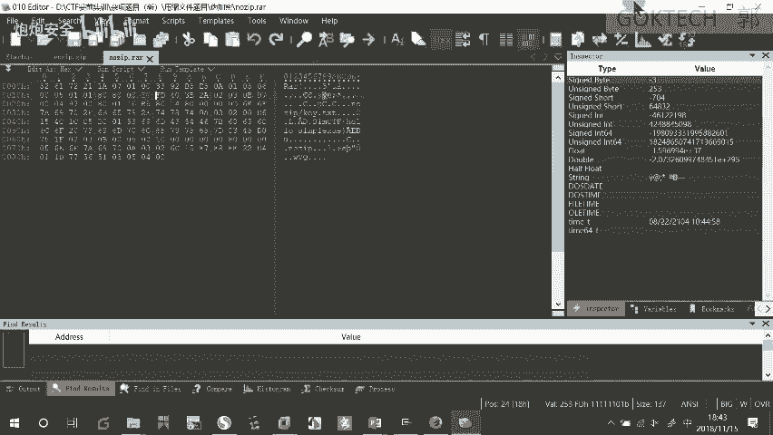

上一节我们介绍了各类编码与隐写技术，本节中我们来看看如何应对经过处理的压缩文件。

### 伪加密原理与修复

伪加密是指修改压缩文件（如ZIP、RAR）的特定标志位，使其在解压时要求输入密码，但实际上并未真正加密。早期CTF题目中常见，现在多数解压软件能自动修复。

**ZIP文件伪加密修复步骤：**
1.  使用十六进制编辑器（如010 Editor）打开ZIP文件。
2.  查找文件头 `504B0102`（这是ZIP文件目录区标志）。
3.  在该头之后的第9和第10个字节（即全局加密标志位），将其值修改为 `00 00`。
4.  保存文件后即可正常解压。

**RAR文件伪加密修复步骤：**
1.  使用十六进制编辑器打开RAR文件。
2.  从文件开头（第一个字节）开始，找到第24个字节。
3.  将该字节的低四位（即后一个十六进制数）修改为0。例如，`80` 修改为 `80`（高四位不变）或根据情况修改，通常改为 `00` 表示无加密。
4.  保存后尝试解压。如果仍报错，则可能是真加密。

### 压缩包密码破解

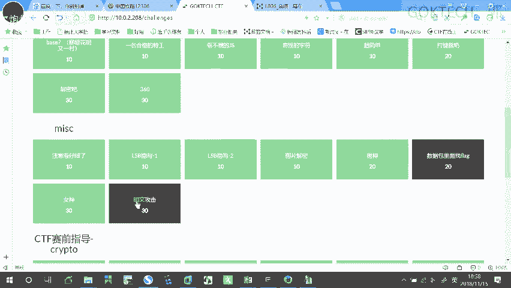

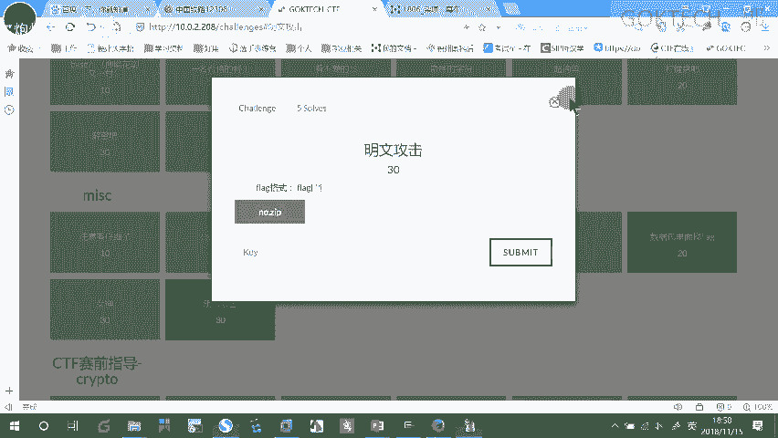

当遇到真加密的压缩包时，我们需要尝试破解密码。以下是常用的攻击方式。

以下是几种常见的密码破解攻击类型：

*   **暴力破解**：尝试所有可能的字符组合。适用于已知密码为纯数字或短长度的情况。在工具中可设置字符集和密码长度范围。
*   **掩码攻击**：已知密码的部分字符（如前缀或后缀），用掩码指定未知部分进行破解。例如，已知前三位是`ABC`，后三位是数字，则掩码可写为 `ABC???`，其中`?`代表数字。
*   **字典攻击**：使用预先准备好的密码字典文件进行尝试。成功率取决于字典的质量和目标密码的常见程度。
*   **明文攻击**：已知加密压缩包中某个文件的明文内容。需要将已知的明文文件用与目标压缩包**相同的压缩算法、压缩等级等参数**重新压缩，然后将此压缩包作为“明文文件”输入给破解工具，工具通过对比推测出加密密钥。

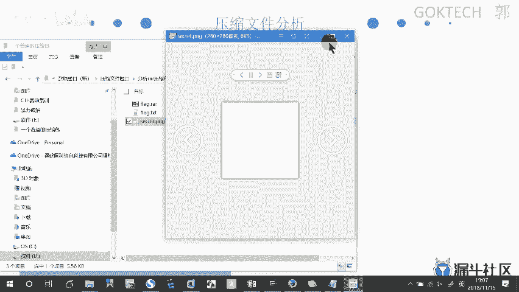

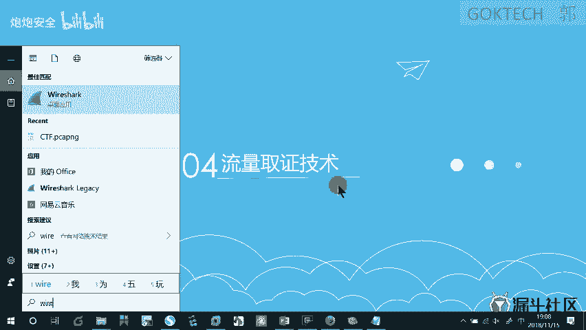

> **注意**：某些工具（如ARCHPR）对明文攻击支持有限，可能需要使用其他专用工具（如`pkcrack`）。

### 文件结构损坏修复

有时出题人会故意破坏压缩包的文件头，导致无法正常识别或解压。

**修复思路：**
1.  用十六进制编辑器分析文件，找到异常位置。
2.  对于RAR文件，其数据块有特定的类型标志：
    *   `0x72`: 标记块
    *   `0x73`: 压缩文件头
    *   `0x74`: 文件头
    *   `0x75`: 结尾块
3.  如果发现疑似文件头但类型值错误（例如应为`0x74`却显示为`0x7A`），可尝试修正。
4.  修正后保存，再次尝试解压，可能会得到隐藏的文件（如图片），需要进一步分析。

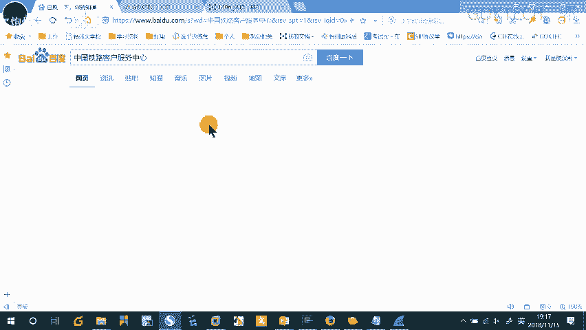

---


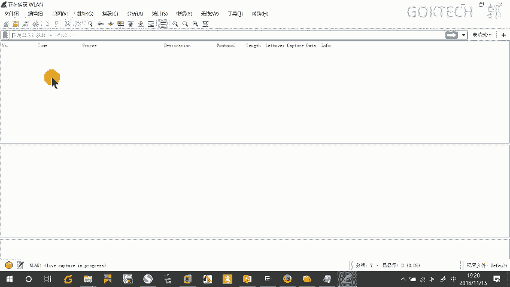

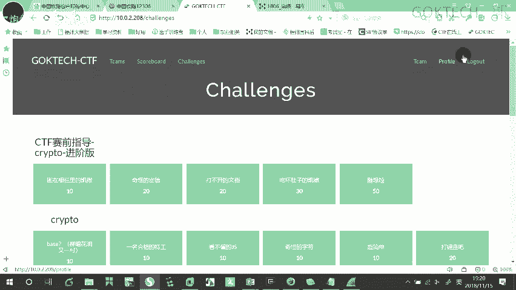

## 网络流量分析


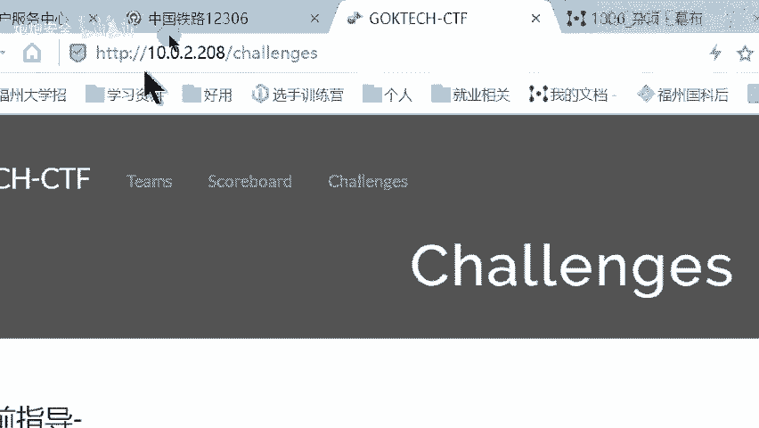

掌握了静态文件的分析后，本节我们转向动态的网络通信数据。

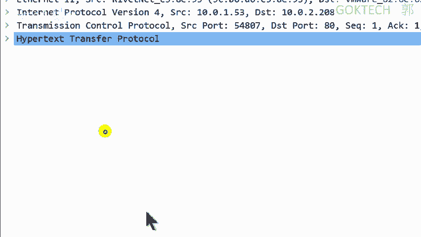

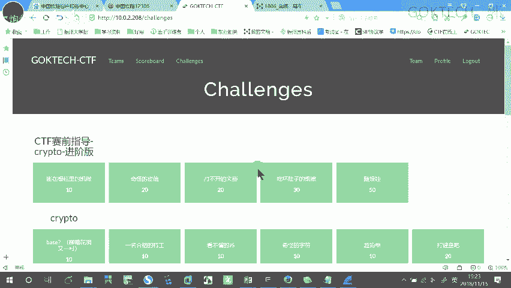

### Wireshark基础与过滤语法

Wireshark是强大的网络协议分析工具。分析流量时，核心是使用过滤表达式聚焦关键数据包。

**常用过滤表达式：**

*   **按IP地址过滤**：
    *   `ip.src == 10.0.1.53` （筛选源IP）
    *   `ip.dst == 10.0.2.208` （筛选目的IP）
    *   `ip.addr == 10.0.1.53` （筛选涉及该IP的流量）
    *   `ip.src == 10.0.1.53 and ip.dst == 10.0.2.208` （筛选特定会话）

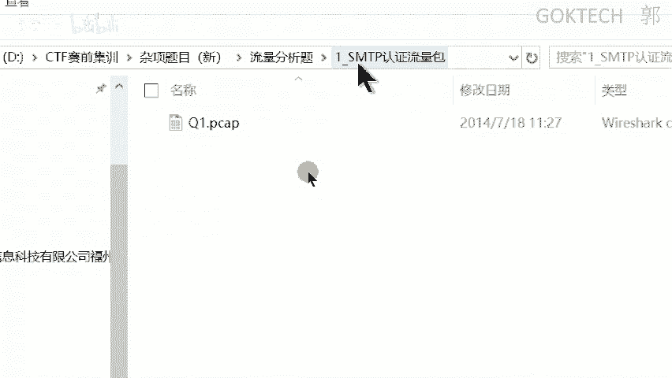

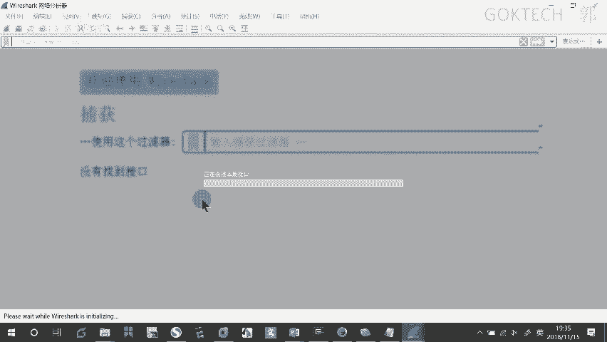

*   **按端口过滤**：
    *   `tcp.port == 80` （筛选TCP 80端口流量）
    *   `tcp.dstport == 80` （筛选目标端口为80的TCP流量）

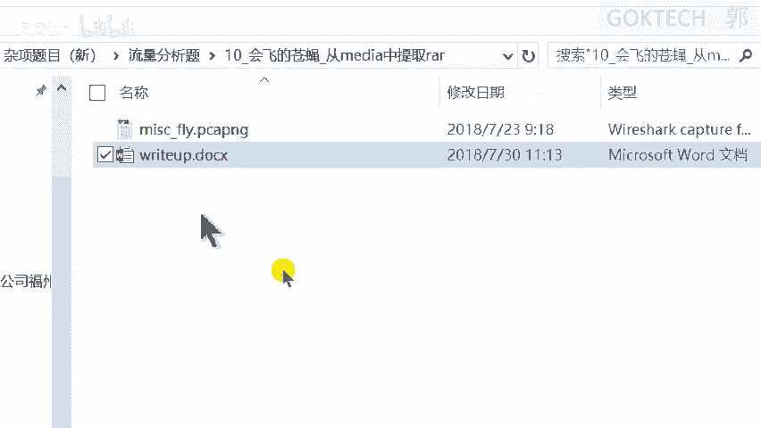

*   **按协议或内容过滤**：
    *   `http` （筛选HTTP协议流量）
    *   `tcp contains "flag"` （筛选TCP数据段中包含"flag"字符串的包）
    *   `http.request.method == "GET"` （筛选HTTP GET请求）

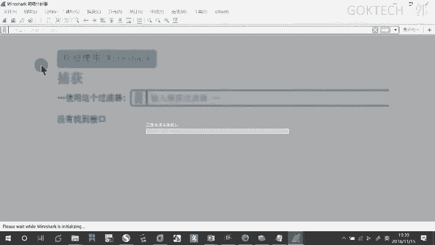

*   **按数据包长度过滤**：
    *   `tcp.len > 1000` （筛选TCP数据长度大于1000字节的包，常用于查找传输的文件）

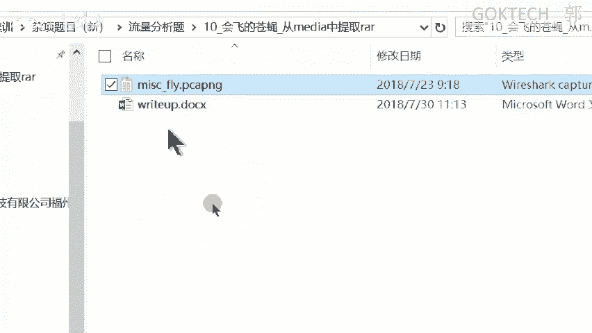

### 协议分析与数据提取

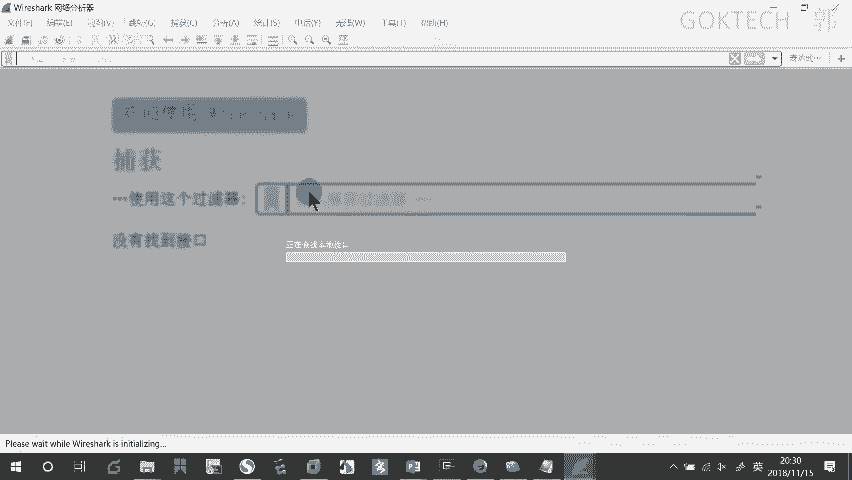

网络流量中可能包含各种协议的通信，如HTTP、FTP、SMTP、Telnet等。一些协议（如HTTP、FTP、Telnet）在未加密的情况下，传输的内容（包括密码）可能明文可见。

**关键技巧：**
1.  **统计 -> 协议分级**：查看流量中各类协议的占比，快速定位主要协议。
2.  **追踪流**：对于TCP或HTTP通信，右键数据包选择“追踪流”，可以将一次会话的请求和响应数据重组并显示，便于分析交互过程（如命令行操作、Web上传下载）。
3.  **文件导出**：
    *   **导出对象**：对于HTTP/FTP等协议，可以通过“文件 -> 导出对象”直接提取传输的文件。
    *   **手动提取**：对于在多个TCP包中传输的完整文件（如图片），可以过滤出相关数据包，将其原始数据（`data`字段）拼接并保存为文件。

**实例：分析远程命令执行流量**
1.  过滤TCP流量，搜索包含常见命令的关键字，如`ls`, `dir`, `type`, `cat`。
2.  找到包含命令的数据包，右键选择“追踪TCP流”。
3.  在弹出窗口中查看完整的交互过程，攻击者执行的命令和返回的结果一目了然，flag可能就在其中（可能是明文、Base64编码等）。

**实例：分析WebShell流量**
1.  过滤HTTP流量，寻找POST请求，特别是参数名可疑的请求（如`cmd`, `eval`）。
2.  追踪该HTTP流，可以看到攻击者通过WebShell发送的命令和服务器返回的结果。
3.  有时攻击者会上传文件，可以通过“导出对象”或从流量中手动提取出上传的文件内容。

### USB流量分析

除了网络流量，USB设备（如键盘、鼠标）的通信数据也可能被捕获并用于出题。

**键盘流量分析：**
1.  USB键盘数据包通常长度为8字节，击键信息集中在第3个字节。
2.  需要先将包含`USBHID`或`USB INTERRUPT`类型的数据包过滤出来。
3.  使用`tshark`命令提取关键数据字段：
    ```bash
    tshark -r usb.pcap -T fields -e usb.capdata > usbdata.txt
    ```
4.  根据USB键盘键值映射表，编写脚本将提取的十六进制数据转换为实际的按键字符。
5.  **注意**：转换出的可能是键位码，需要结合输入法（如题目提示的五笔输入法）最终得到flag。

**鼠标流量分析：**
1.  USB鼠标数据包通常为4字节，包含按键状态和位移信息。
2.  提取数据方式与键盘类似。
3.  编写脚本解析坐标变化，绘制出鼠标移动轨迹，轨迹形状可能就是flag（如字母）。

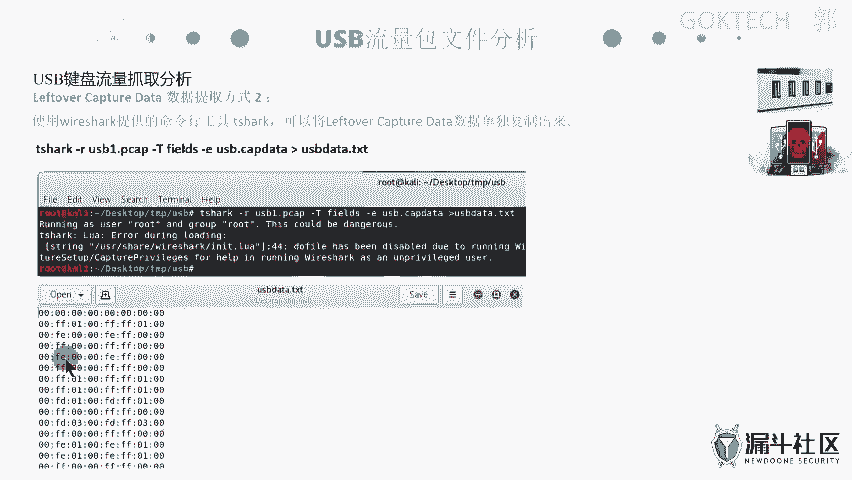

---

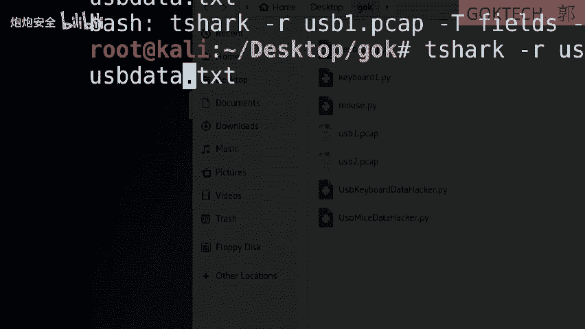

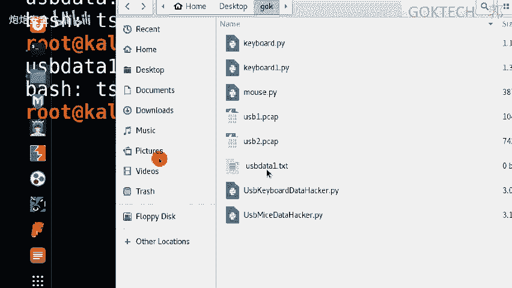

## 总结

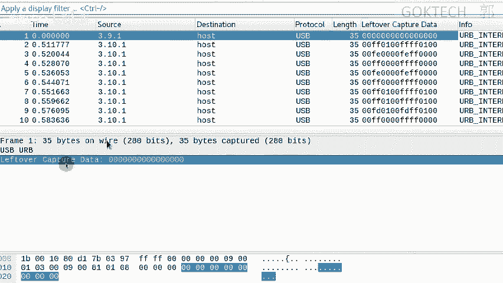

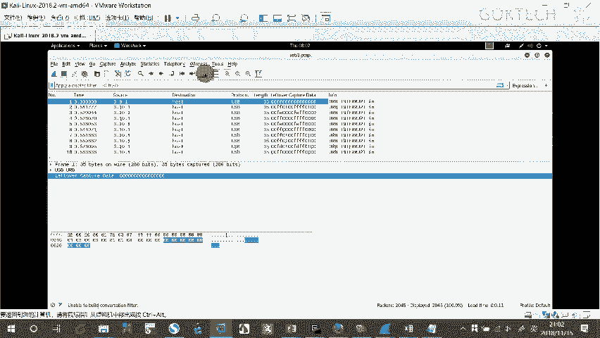

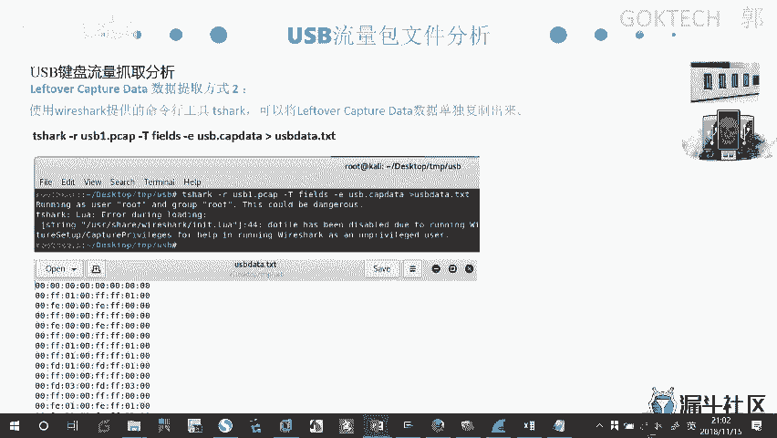

本节课我们一起学习了CTF杂项中压缩文件和流量分析的核心知识。

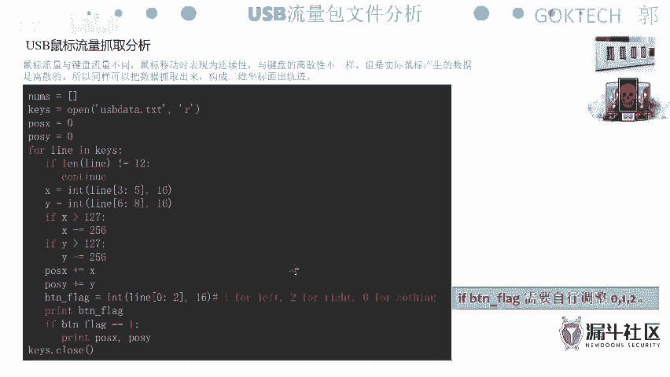

*   **压缩文件分析**：我们掌握了识别和修复伪加密的方法，了解了暴力破解、掩码攻击、字典攻击和明文攻击等密码破解技术，并学习了修复损坏压缩包文件结构的思路。
*   **流量分析**：我们熟悉了使用Wireshark进行流量捕获、过滤和协议分析的基本操作，掌握了通过追踪流、导出对象等方式从HTTP、TCP等协议中提取关键信息。此外，我们还了解了USB键盘和鼠标流量分析的基本原理和步骤。

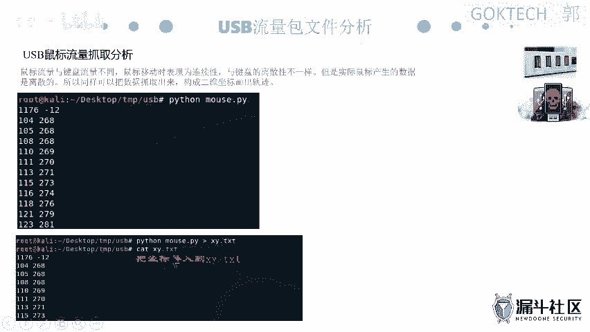

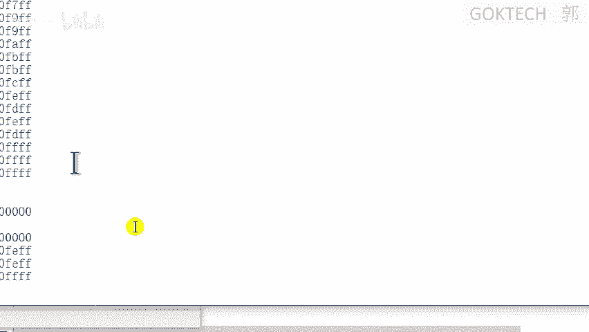

这些技能是CTF竞赛和实际安全排查中分析数据载体和通信行为的基础，需要结合具体题目反复练习才能熟练掌握。