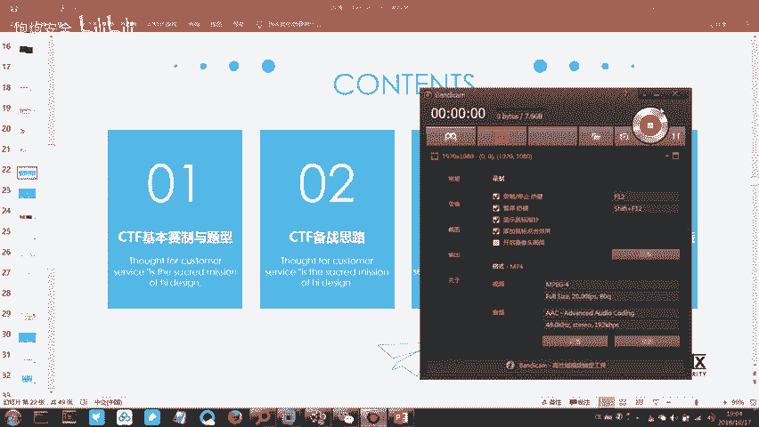
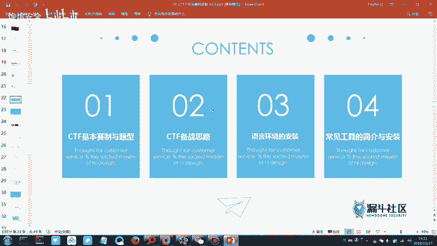
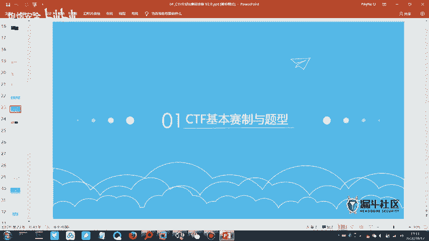
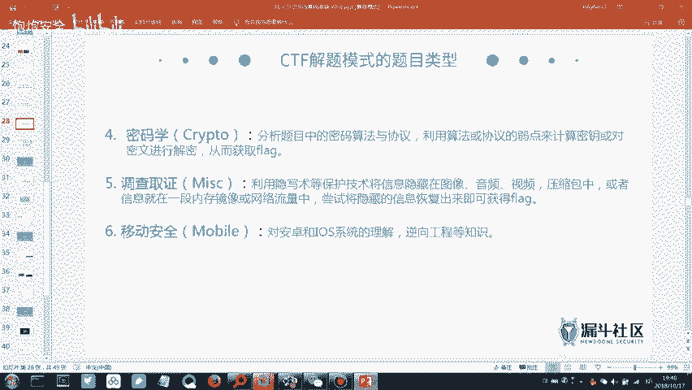
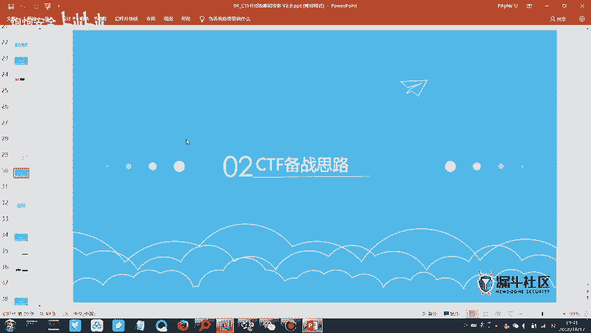

# CTF培训网络安全基础入门：P1：CTF赛制介绍与工具安装指南

## 概述
在本节课中，我们将学习CTF比赛的基本概念、常见赛制与题型，并了解为参赛需要准备的核心工具与环境。课程内容分为两个主要部分：CTF赛制与题型介绍，以及相应的备赛思路与工具准备。

---

## CTF赛制与题型介绍

上一节我们回顾了信息安全的基本概念，本节中我们正式进入CTF相关模块的学习。

CTF的全称是Capture The Flag，中文常译为“夺旗赛”。比赛目标是尽可能多地获取“旗帜”，即`flag`。比赛方会部署题目服务器，参赛者通过解题获取`flag`并提交，系统根据题目难度和解题情况计分，最终按总分排名。

CTF比赛主要有以下几种模式：
*   **解题模式**：参赛者专注于解答各类技术题目以获取`flag`。这是最常见的模式，通常用于线上初赛。
*   **攻防模式**：参赛队伍在攻击其他队伍服务器获取`flag`的同时，也需要防守自己的服务器。此模式对攻防能力均有要求。
*   **综合渗透模式**：参赛者攻击比赛方提供的目标服务器（如网站），发现漏洞并获取`flag`，无需担心被其他队伍攻击。省级决赛常采用此模式。

比赛题目通常涵盖多个技术领域，以下是主要的题目类型：

**1. Web安全**
此类题目考察网站相关的安全漏洞。解题需要发现并利用目标网站的漏洞来获取`flag`。
*   **SQL注入**：利用数据库查询语句的漏洞获取数据。
*   **XSS（跨站脚本攻击）**：通过注入恶意脚本盗取用户信息或执行其他操作。
*   **文件上传漏洞**：通过上传恶意文件（如木马）获取服务器控制权。
*   **代码审计**：分析给定的网站源代码，找出漏洞并构造利用方式。

**2. 逆向工程**
此类题目通常提供一个可执行程序（如`.exe`或`.apk`），要求参赛者通过反汇编、调试等手段，分析其运行逻辑，最终找到隐藏在程序中的`flag`。这需要对编程语言和程序结构有较深理解。

**3. Pwn（二进制安全）**
这是CTF中最难的题型之一，涉及二进制程序的漏洞挖掘与利用，例如缓冲区溢出。成功解题往往能获得很高分数。

**4. 密码学**
题目提供一段经过加密或编码的数据，要求参赛者识别其加密方式（如Base64、凯撒密码、MD5等）并进行解密，以得到`flag`。解题关键在于识别加密算法和使用对应工具。

**5. 杂项**
这是一个非常广泛的题型，可能涉及任何与信息安全间接相关的技术，例如：
*   网络流量分析（使用Wireshark分析`.pcap`文件）。
*   隐写术（在图片、音频、视频中隐藏信息）。
*   社会工程学、编码转换、压缩包处理等。
杂项题目入门相对容易，但考察的知识点非常繁杂。

**6. 移动安全**
主要涉及Android平台应用的逆向分析与破解，可视为逆向工程在移动端的延伸。

对于初学者，建议按照以下难度顺序进行学习和备赛：**杂项 -> 密码学 -> Web安全**。逆向工程和Pwn难度较高，可作为后期进阶学习目标。

---

## 备赛思路与工具准备

了解了CTF的赛制和题型后，本节我们来看看如何为比赛做准备，特别是需要安装哪些核心工具。

一个高效的CTF参赛环境需要搭建以下四个模块：

**1. 语言环境**
运行和编写解题脚本需要相应的语言解释器或运行时环境。以下是三个必备环境：
*   **Java环境**：用于运行一些基于Java的工具或题目。
*   **Python环境**：CTF中最常用的脚本语言，用于编写自动化解题脚本。
*   **PHP环境**：用于调试或运行与Web相关的题目或本地测试。

**2. 常用工具**
CTF工具包中工具繁多，但以下几个是核心必备工具：
*   **VMware Workstation / VirtualBox**：虚拟机软件。用于搭建隔离、可复现的测试环境，避免影响宿主机。
*   **Burp Suite**：强大的Web漏洞扫描器和代理工具。用于拦截、修改和分析浏览器与服务器之间的HTTP/HTTPS流量，是Web题目解题利器。

**3. 综合工具包**
建议下载一个整合的CTF工具包，里面通常包含了针对不同题型的数十种工具，如编码解码工具、隐写分析工具、逆向工具等，可以极大提高解题效率。

**4. 知识储备与练习**
*   **熟悉题型**：针对计划主攻的题型（如杂项、Web），系统学习相关知识点。
*   **刷题平台**：在`CTFHub`、`BugKu`、`攻防世界`等在线平台进行练习，积累经验。
*   **学习WP**：WP即“Writeup”，是他人分享的题目解题思路和过程。阅读WP是快速学习的重要途径。

---

## 总结
本节课我们一起学习了CTF比赛的核心概念。我们了解了CTF是一项“夺旗赛”，其常见模式包括解题、攻防和综合渗透。题目主要分为Web安全、逆向工程、Pwn、密码学、杂项和移动安全六大类型。对于备赛，我们明确了从易到难（杂项->密码学->Web）的学习路径，并认识了搭建参赛环境所需的语言（Java, Python, PHP）和核心工具（虚拟机、Burp Suite等）。掌握这些基础知识是迈入CTF赛场的第一步。