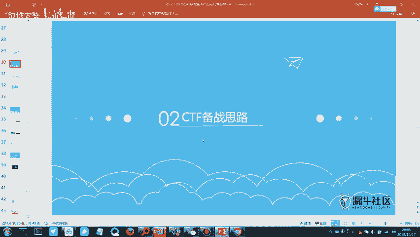
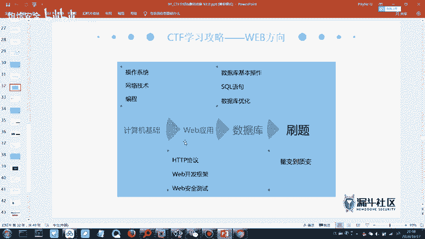
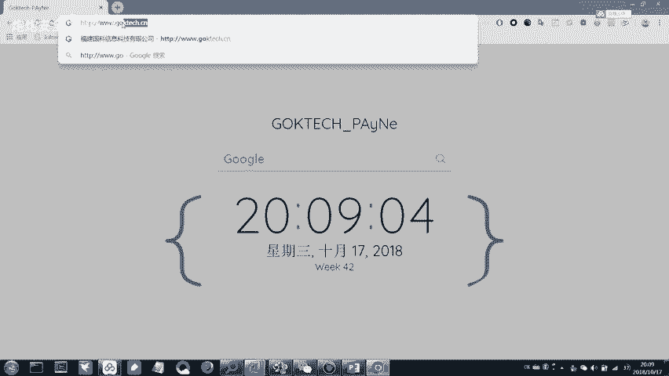
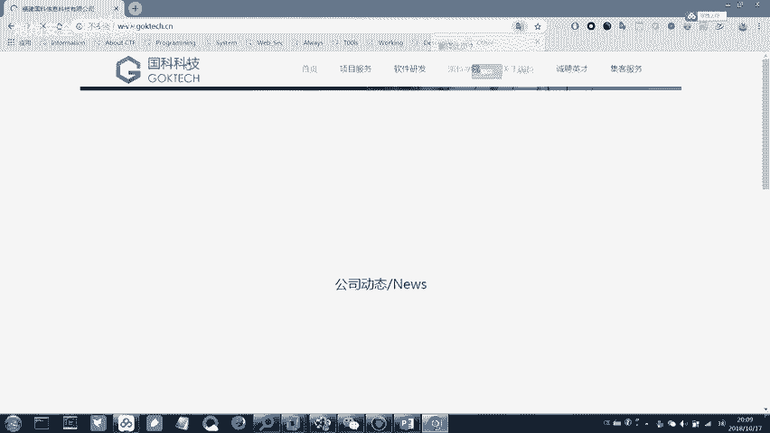
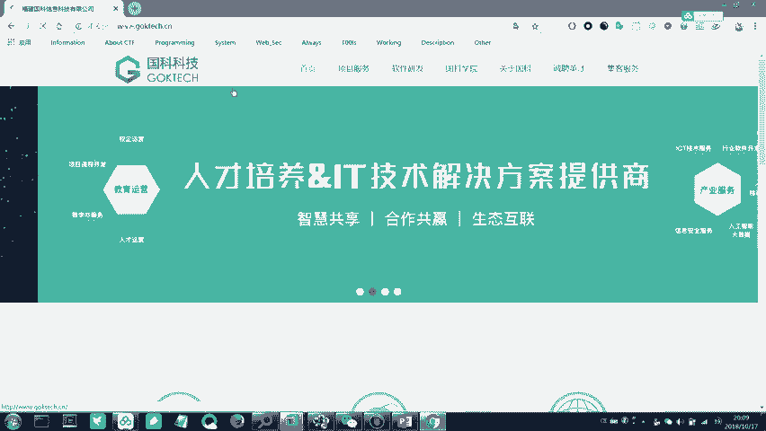
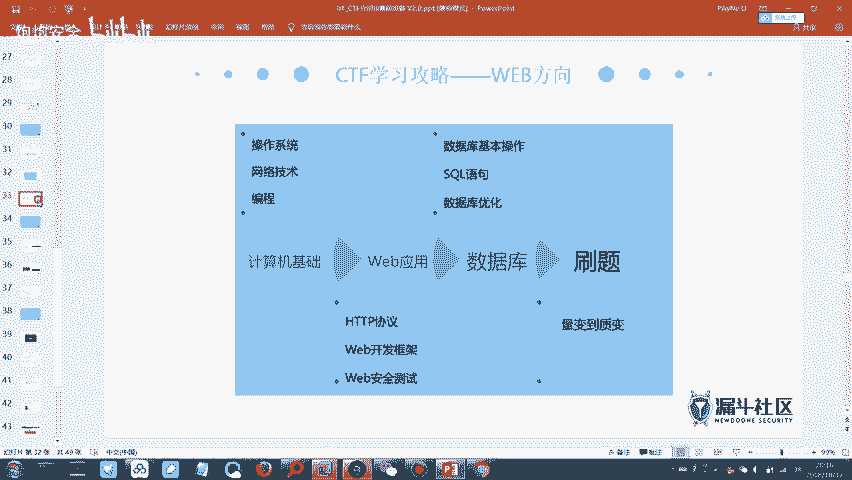
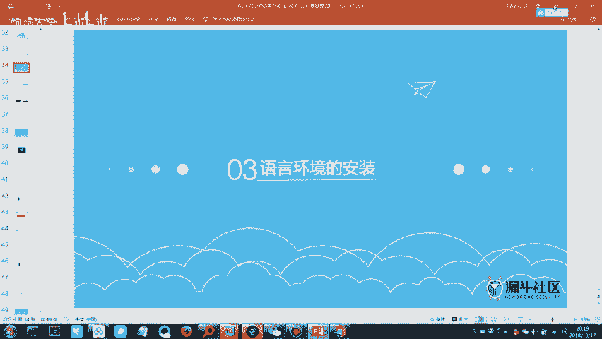
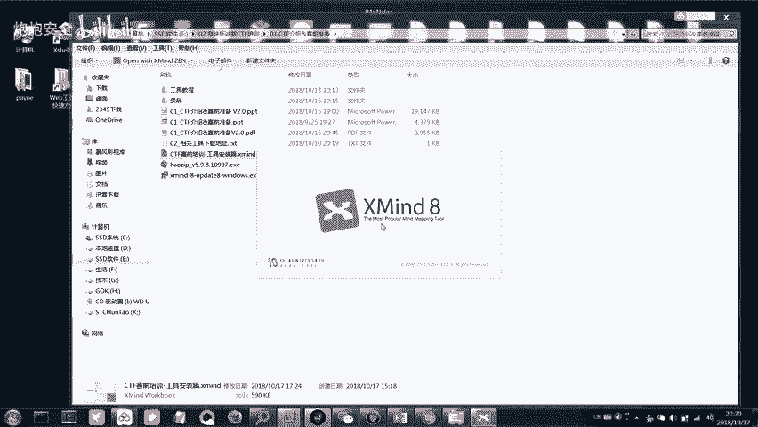
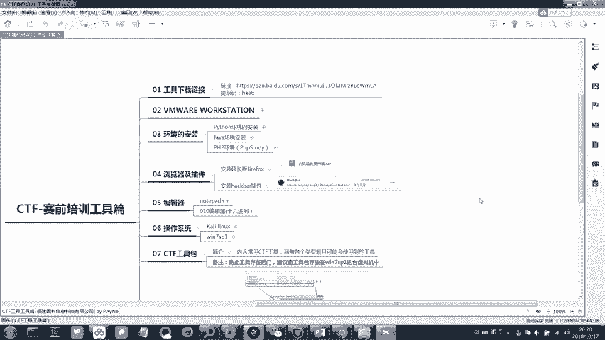

# CTF培训网络安全基础入门 - P2：（03）CTF赛制介绍&工具介绍 🛡️



在本节课中，我们将要学习CTF比赛的备赛思路，了解需要掌握的知识体系，并介绍一些实用的刷题平台和工具。

## 备赛思路梳理

上一节我们介绍了CTF的基本概念和模式，本节中我们来看看如何梳理适合自己的备赛思路。这需要我们对CTF所需的技术知识有一定理解。

CTF比赛所需的知识分为两个主要模块：基础知识和专项知识。

### 基础知识模块

以下是基础知识模块包含的内容：
*   **Linux系统基本使用**：需要掌握基本的Linux命令，例如进入目录、查看文件等。这在使用Kali Linux等渗透测试系统时至关重要。
*   **网络协议分析**：涉及网络流量数据包的抓取与分析。
*   **计算机组成原理与操作系统原理**：这两部分属于了解即可，不是必须精通的内容。



### 专项知识模块





专项知识模块又分为两个方向：
*   **Pwn、逆向工程与密码学方向**：这个方向技术难度相对较高。
*   **Web安全与杂项方向**：这个方向涉及的技术点相对集中，更注重漏洞原理的利用和信息收集能力。



## 知识技能路线图

以下是CTF学习需要掌握的技能路线图，请注意，CTF更注重知识的广度而非单一方向的深度。

### 1. 操作系统
需要懂一些基本的Linux命令，不要求精通，但必须掌握常用操作。例如：
```bash
cd /path/to/directory  # 进入目录
ls -la                 # 查看文件列表
cat file.txt           # 查看文件内容
```

### 2. 网络技术
需要具备类似HCNA或CCNA水平的网络基础知识，理解IP通信等基本过程。

### 3. 编程能力
编程能力属于拔高项，并非必须，但掌握后对解题有很大帮助。

### 4. Web应用知识
*   **HTTP/HTTPS协议**：必须掌握的核心协议。HTTP是Web通信的基础协议，而HTTPS是在HTTP基础上增加了TLS/SSL加密层，更安全。许多大型网站（如百度、腾讯）都使用HTTPS来保障信息安全。
*   **数据库与SQL**：需要掌握数据库基本的“增删查改”操作。理解SQL语句是学习SQL注入漏洞的基础。例如：
```sql
SELECT * FROM users WHERE username = 'admin'; -- 查询语句
```

## 学习方法：从刷题到精通

掌握了基础知识后，关键是通过大量练习实现从量变到质变。刷题能帮助你积累思路，甚至看到题目名称就能猜到考察点。

不要被庞大的知识体系吓倒，CTF要求的是广度。建议每个部分先入门了解，然后通过做题巩固。遇到题目中不熟悉的知识点，再针对性搜索学习。

对于信息搜索，推荐使用Google配合VPN，以便获取更全面、准确的国外技术资料。

## 刷题平台推荐

以下是推荐的CTF刷题平台和WriteUp（题解）资源：

**刷题平台：**
*   **实验吧**：题目难度适中，适合初学者。
*   **BugKu CTF**：题目友好，是很好的入门平台。
*   **i春秋CTF大本营**：包含大量历年比赛真题，难度较高，适合进阶练习。



**WriteUp（题解）资源：**
*   各平台通常自带题解或讨论区。
*   可以搜索“题目名称 + WriteUp”来查找他人解题思路。

建议初学者从**实验吧**和**BugKu CTF**开始，建立信心后再挑战**i春秋**上的真题。

## 工具安装与实践

现在进入今晚的实践操作部分：工具的安装与使用。

请打开群文件中提供的思维导图软件（XMind），并打开分享的思维导图文件。该文件整理了CTF学习路径和工具集，将作为后续学习的参考地图。

---







本节课中我们一起学习了CTF的备赛知识体系，明确了需要掌握的基础技能和两个专项方向。我们了解了从操作系统、网络到Web协议的学习路线，并强调了通过刷题平台进行实践练习的重要性。最后，我们开启了工具使用的实践环节。记住，学习CTF是一个循序渐进、不断积累的过程。