# CTF培训网络安全基础入门 - P3：（04）CTF赛制介绍&工具介绍 🛠️

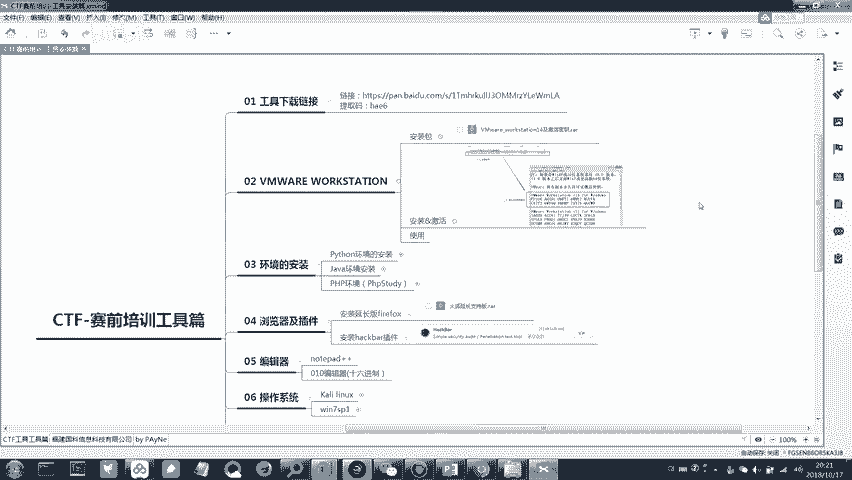

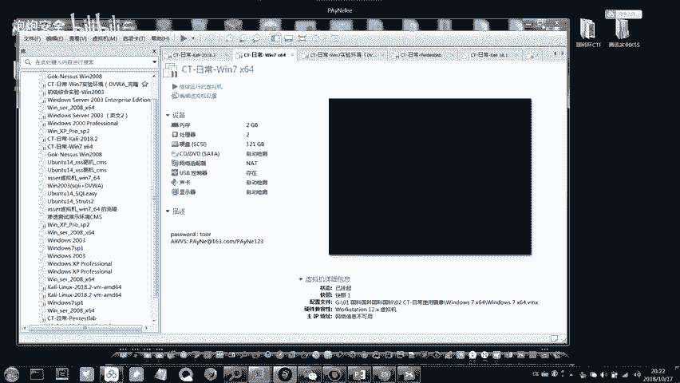

在本节课中，我们将学习CTF比赛的基本赛制，并重点介绍在后续学习和比赛中需要用到的一系列核心工具及其安装配置方法。掌握这些工具是进行网络安全实践的基础。

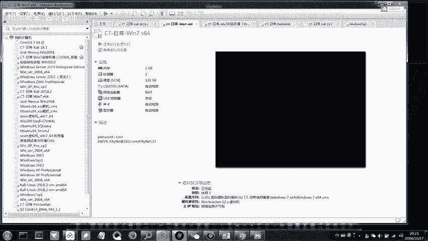

## 虚拟机软件：VMware Workstation 🖥️

上一节我们介绍了CTF的基本概念，本节中我们来看看第一个核心工具——虚拟机软件。VMware Workstation是一款功能强大的桌面虚拟化软件，它允许你在单一物理机上同时运行多个不同的操作系统（虚拟机）。这对于搭建隔离、安全的实验环境至关重要。

### 软件安装与版本

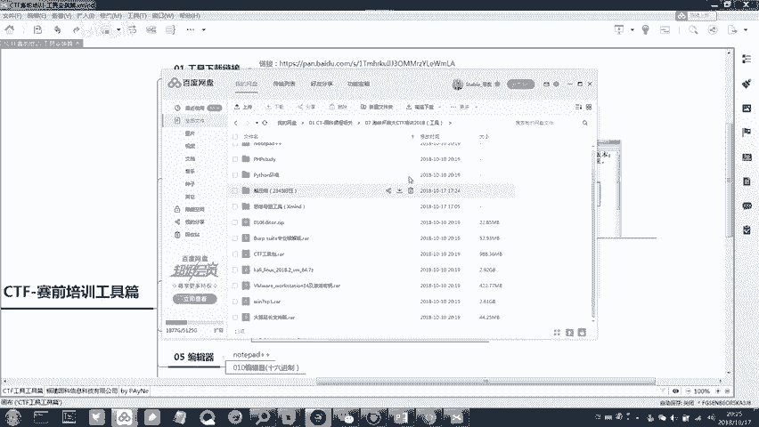

以下是安装VMware Workstation的步骤和注意事项：

*   **版本要求**：请确保安装课程提供的特定版本（如14版）。高版本（如15版）通常可以兼容，但为减少未知问题，建议统一使用指定版本。
*   **查看版本**：在已安装的软件中，点击“帮助” -> “关于”，即可查看当前版本信息。
*   **安装流程**：运行安装程序，遵循“下一步”原则进行安装。当遇到激活步骤时，使用课程资料包中提供的对应版本永久许可证密钥进行激活。

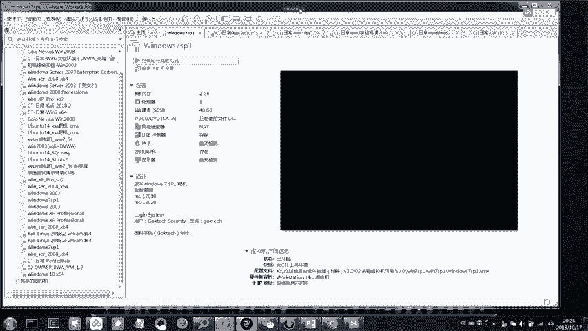

### 核心功能与使用

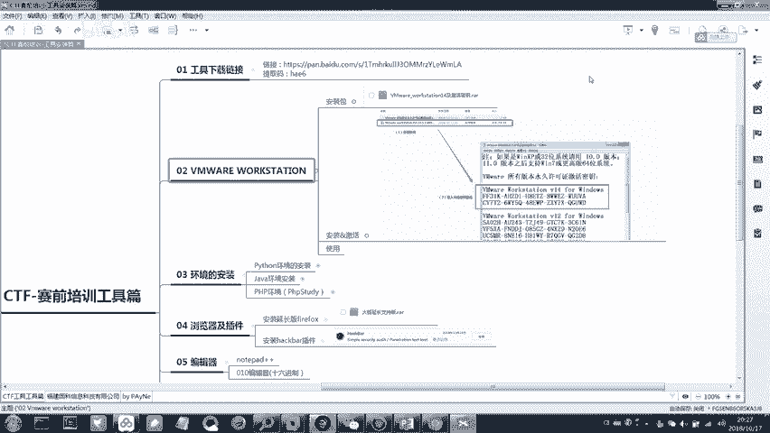

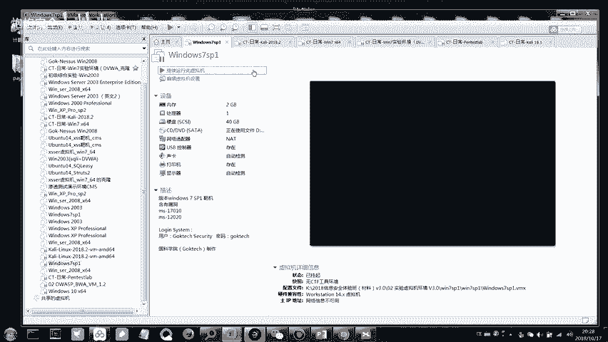

成功安装后，你将看到VMware的主界面。它的核心功能围绕虚拟机的生命周期管理展开。

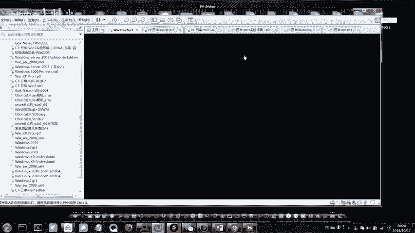

*   **打开现有虚拟机**：课程提供的Kali Linux和Windows 7环境均为已配置好的`.vmx`虚拟机文件。点击“文件”->“打开”，选择解压后的`.vmx`文件即可载入虚拟机。
*   **运行虚拟机**：在虚拟机列表中选中目标，点击“开启此虚拟机”，即可启动虚拟操作系统。
*   **调整显示**：启动后，如果窗口显示过小，可点击“查看”->“立即适应客户机”，让窗口自动适配。
*   **快照功能**：这是VMware的“时光机”功能。你可以在虚拟机某个特定状态（如安装完关键软件后）创建快照。之后无论系统如何变化，都可以一键恢复到快照时的状态。请注意，创建快照会占用额外的磁盘空间。
*   **硬件配置**：右键点击虚拟机，选择“设置”，可以调整分配给虚拟机的资源：
    *   **内存**：根据宿主机（真机）内存大小调整。例如，宿主机为8GB内存，可为虚拟机分配1-2GB。
    *   **处理器**：分配CPU核心数量。
    *   **硬盘**：设定虚拟机可使用的最大磁盘空间。

### 宿主机与虚拟机文件交换

在真机和虚拟机之间传输文件是常见需求，主要有以下两种方式：

1.  **安装VMware Tools**：这是最便捷的方式。课程提供的虚拟机已预装此工具。安装后，可以直接在真机和虚拟机之间通过复制、粘贴或拖拽来传输文件。如果此功能失效，可尝试重启虚拟机或重装VMware Tools。
2.  **设置共享文件夹**：这是一种更稳定的文件共享方式。
    *   在虚拟机设置中，添加一个共享文件夹，并指定宿主机上的一个目录（如 `D:\CTF_Share`）。
    *   在虚拟机操作系统中，将此共享文件夹映射为一个网络驱动器。
    *   此后，在宿主机 `D:\CTF_Share` 目录下的任何文件，在虚拟机中都可以直接访问。

> **安全提醒**：强烈建议将课程后续提供的CTF工具包放在虚拟机（如Win7）中使用。因为某些安全工具可能被误报为病毒，或本身具有风险。在虚拟机环境中操作可以保护宿主机的安全。

---

## 编程与运行环境安装 🐍☕

掌握了虚拟化平台后，我们需要为解题和开发准备必要的软件环境。许多CTF题目和工具依赖于特定的运行环境。

### Python环境

Python是CTF中最常用的脚本语言之一，用于编写和运行解题脚本。

*   **安装包**：使用课程提供的安装包（包含32位和64位版本），根据你的系统选择安装。
*   **关键步骤**：安装过程中，务必勾选 **“Add Python to PATH”** （将Python添加到环境变量）。如果安装时忘记，可以手动添加。
*   **验证安装**：安装完成后，打开命令提示符（Win+R，输入`cmd`），输入 `python` 并回车。如果出现Python交互式命令行（显示类似 `>>>` 的提示符），则说明安装成功。
    *   **环境变量手动添加（备用）**：如果上述命令失败，需要手动添加环境变量。在系统属性 -> 高级 -> 环境变量中，编辑“Path”变量，添加Python的安装路径（例如 `C:\Python27`）。

### Java环境

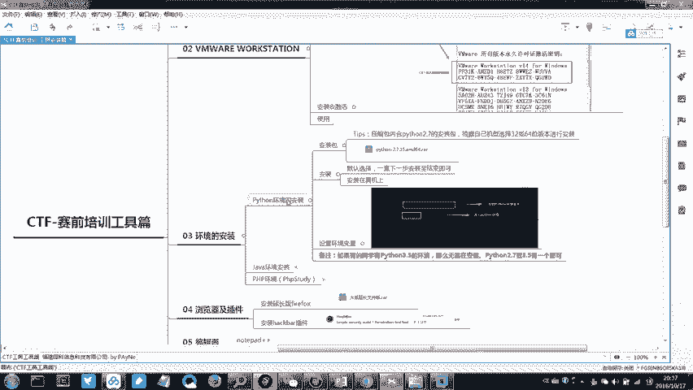

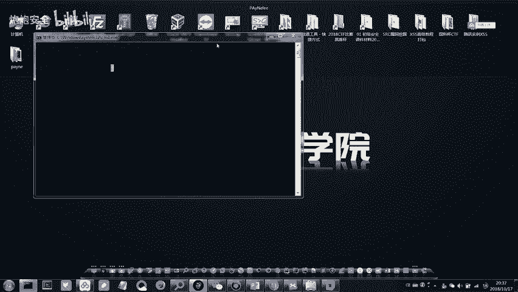

一些CTF工具（特别是图形化界面的逆向、漏洞利用工具）是用Java编写的，需要Java运行环境（JRE）才能启动。

*   **安装**：运行提供的Java安装包，全程默认设置即可。
*   **验证安装**：打开命令提示符，输入 `java -version` 并回车。如果正确显示Java版本信息，则表明安装成功。

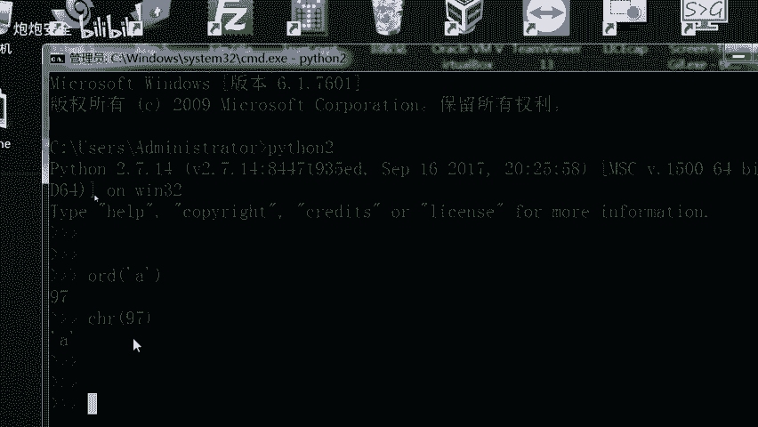

### PHP集成环境：PHPStudy

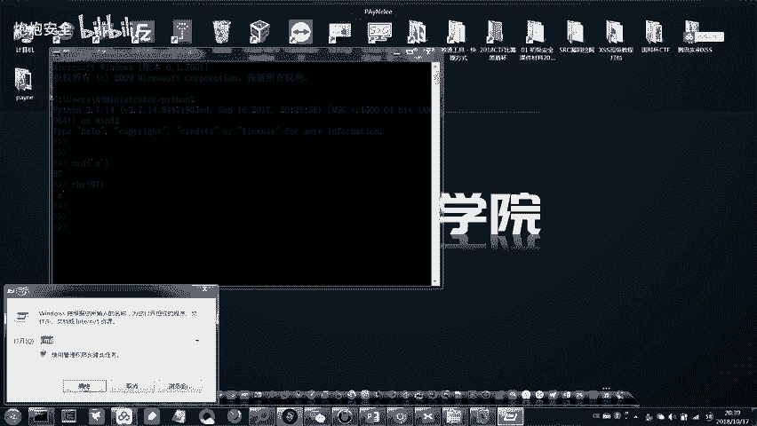

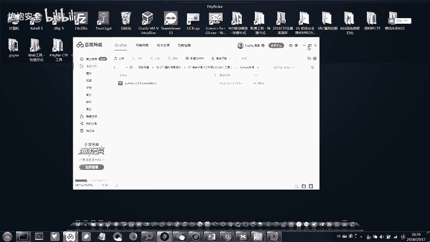

当需要本地搭建Web题目环境进行测试或调试时，PHPStudy提供了极大便利。它集成了Apache/Nginx（Web服务器）、MySQL（数据库）和PHP运行环境。

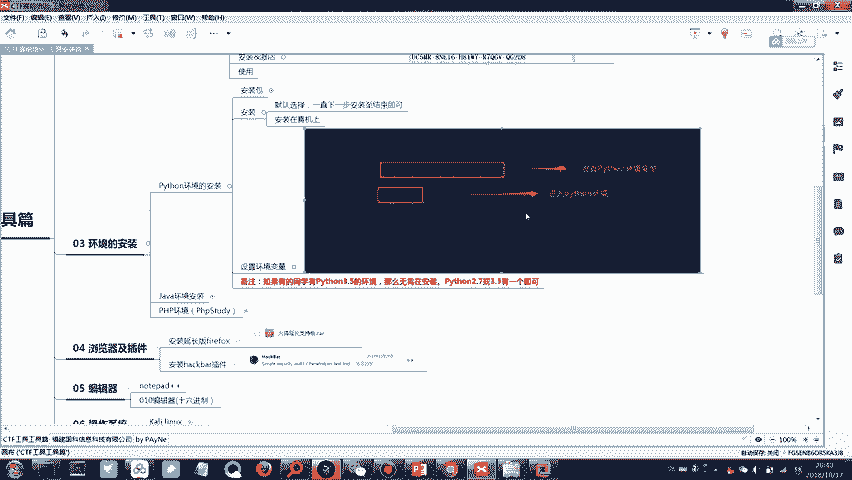

*   **安装**：解压安装包，运行安装程序，选择中文，按默认路径安装。
*   **常见问题**：如果安装后打开PHPStudy时，提示系统缺少VC运行库，请安装资料包中 `PHPStudy` 文件夹内的 `32位VC9和2014运行库`。
*   **注意事项**：安装路径请**避免使用中文**，以防出现兼容性问题。

---

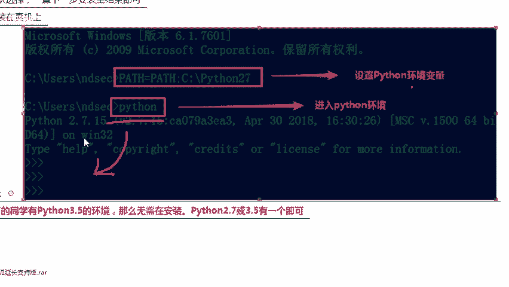

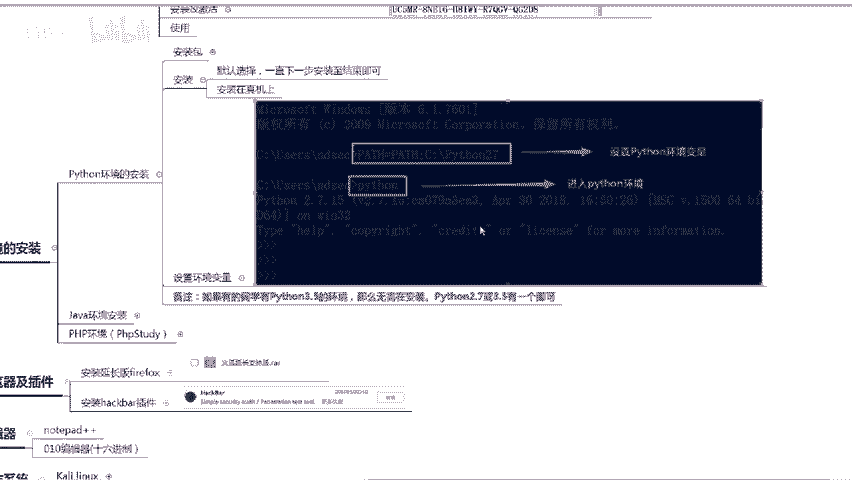

## 浏览器与编辑器 🔍📝

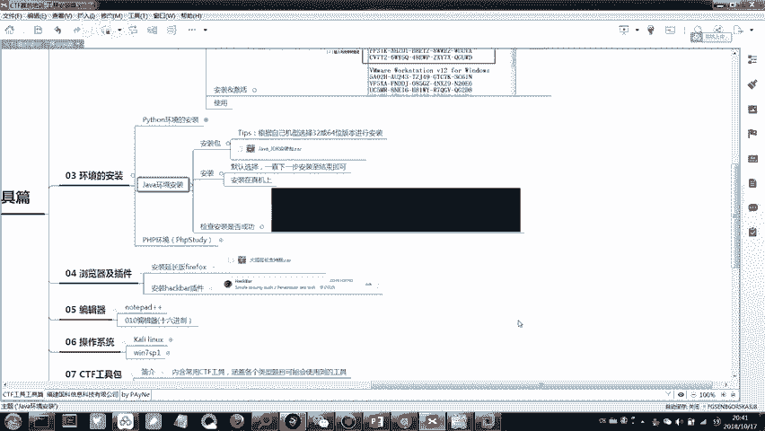

工欲善其事，必先利其器。合适的浏览器和编辑器能显著提升解题效率。

### 火狐浏览器与HackBar插件

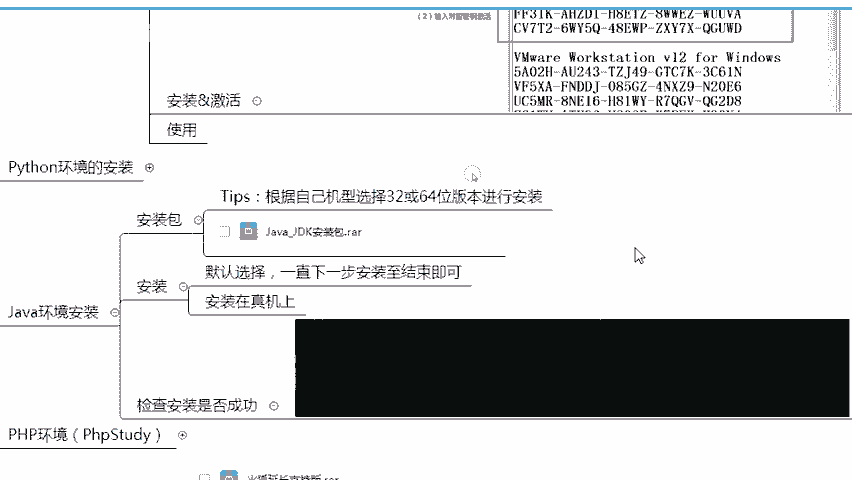

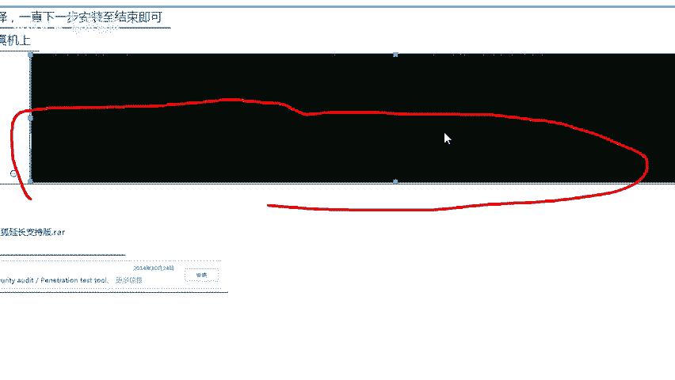

火狐浏览器因其强大的扩展性，在安全领域备受青睐。

*   **版本要求**：请安装课程提供的**特定旧版本**火狐浏览器。因为后续要安装的经典安全插件与新版本不兼容。
*   **安装HackBar插件**：
    1.  打开火狐浏览器，点击菜单 -> 附加组件。
    2.  在扩展中搜索 `HackBar`。
    3.  在搜索结果中，**选择安装发布于2014年的那个版本**（课程脑图中有截图）。这是功能最经典、最稳定的版本。

### 代码与文本编辑器

强大的编辑器是查看代码、分析数据、编写脚本的利器。

*   **Notepad++**：这是一个功能丰富的文本编辑器，支持代码高亮、多种编码、正则表达式查找替换等，比系统自带的记事本强大得多。安装过程简单，选择对应位数安装即可。
*   **010 Editor**：这是一款专业的二进制编辑器，在CTF的**杂项（Misc）** 题目中尤为有用。它可以以十六进制、十进制、ASCII等多种形式查看和编辑文件，并支持模板解析复杂文件结构。请务必安装此工具。

---

## 总结 📚

本节课中我们一起学习了CTF所需的基础工具链：

1.  我们首先介绍了**VMware Workstation**，学习了如何创建、管理虚拟机，以及在宿主机和虚拟机间共享文件的方法，这是构建安全实验环境的基石。
2.  接着，我们配置了**Python**和**Java**运行环境，它们是运行众多CTF脚本和工具的必备条件。
3.  然后，我们安装了**PHPStudy**集成环境，为后续Web类题目的本地测试做好准备。
4.  最后，我们准备了**火狐浏览器（含HackBar插件）**、**Notepad++** 和 **010 Editor** 这些高效的辅助工具，用于信息收集、代码分析和二进制文件处理。

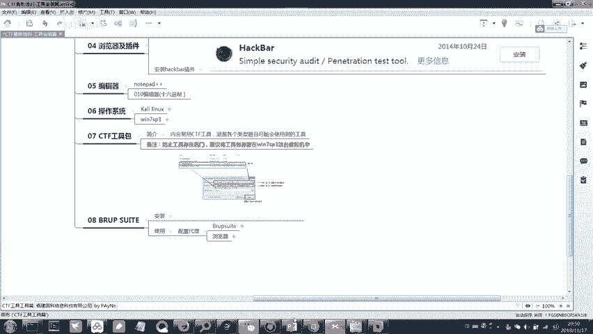

请同学们根据指导，逐步完成以上所有工具的安装与配置。确保每个工具都能正常运行（如Python能打开交互窗口、Java能显示版本等）。在接下来的课程中，我们将直接使用这些工具进行实战。如果在安装过程中遇到问题，请仔细查阅课程提供的脑图说明，或及时提问。