# CTF培训网络安全基础入门：P7：Linux基础&网络基础 📚

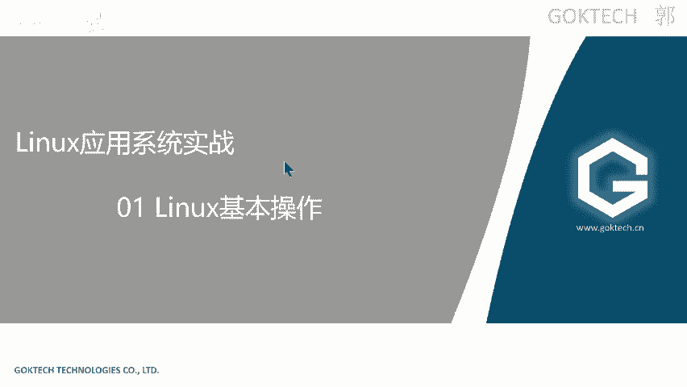

## 概述
在本节课中，我们将要学习Linux操作系统的基础知识和计算机网络的基本概念。这对于后续的网络安全学习和CTF竞赛至关重要，因为许多安全工具和环境都依赖于Linux系统，而理解网络原理是分析流量、进行渗透测试的基础。

---

## 系统发展简史 🕰️

上一节我们介绍了课程的整体目标，本节中我们来看看计算机系统，特别是操作系统的发展脉络。

*   世界上第一台计算机诞生于1945年左右，体积庞大。
*   早期计算机使用类似晶体管的元件，只有“亮”和“灭”两种状态，这奠定了二进制（0和1）计算的基础。
*   世界上第一个真正意义上的操作系统是Unix，诞生于60年代末。
*   Windows系统在95版本之前主要使用字符界面（如CMD），后来随着图形化界面和鼠标的普及才发生变化。
*   Linux是一种类似Unix的操作系统，但两者有区别。

---

## Linux系统介绍 🐧

了解了系统的发展背景后，我们聚焦到本节课的核心之一——Linux系统。

### 什么是Linux？
Linux是一款**开源**、免费的操作系统。
*   **开源**：开放源代码。用户可以查看、修改和分发源代码。这与QQ等**闭源**软件不同。
*   **免费**：用户可以免费使用。Windows系统的费用通常已包含在电脑售价中，且家庭版功能有限。

### Linux的特点
Linux具有以下显著特点：
*   **稳定性强**：通常作为服务器操作系统，支持7x24小时不间断运行。
*   **安全性较高**：由于其架构和权限管理机制，许多Windows病毒无法在Linux上运行。
*   **处理多并发能力强**：适用于中型、大型及巨型项目，如淘宝、京东等互联网公司的后台服务器。
*   **应用广泛**：主机工程师、系统工程师、运维工程师、安全工程师等岗位都需要掌握Linux。

### Linux发行版本
因为开源，Linux衍生出许多不同的发行版本（发行版），主要分为以下几类：
*   **红帽（Red Hat）体系**：
    *   **RHEL（Red Hat Enterprise Linux）**：企业版，收费，功能完整。
    *   **CentOS**：RHEL的免费克隆版，常被视为RHEL的“实验场”。
*   **Debian体系**：
    *   **Debian**：由非商业组织维护，非常稳定。
    *   **Ubuntu**：基于Debian开发，图形化界面友好，适合初学者。
*   **其他体系**：如openSUSE等。
*   **安全专用发行版**：**Kali Linux**基于Debian（Ubuntu）体系开发，预装了大量安全测试工具。

**选择建议**：
*   日常使用或初学者：推荐**Ubuntu**或其衍生版（如国产Deepin）。
*   学习或企业环境：推荐学习**RHEL/CentOS**，其知识可迁移到其他发行版。

### Linux与Unix的区别
*   **思想同源**：Linux的设计思想来源于Unix。
*   **本质不同**：Unix通常是闭源的商业软件；Linux是开源的自由软件。

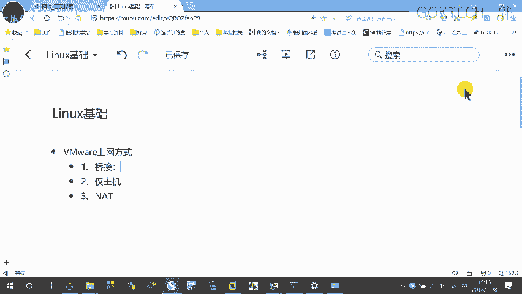

---

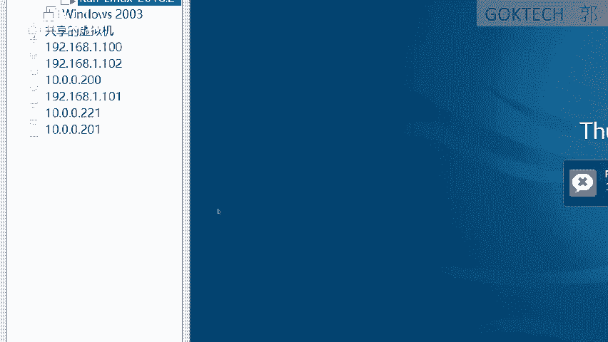

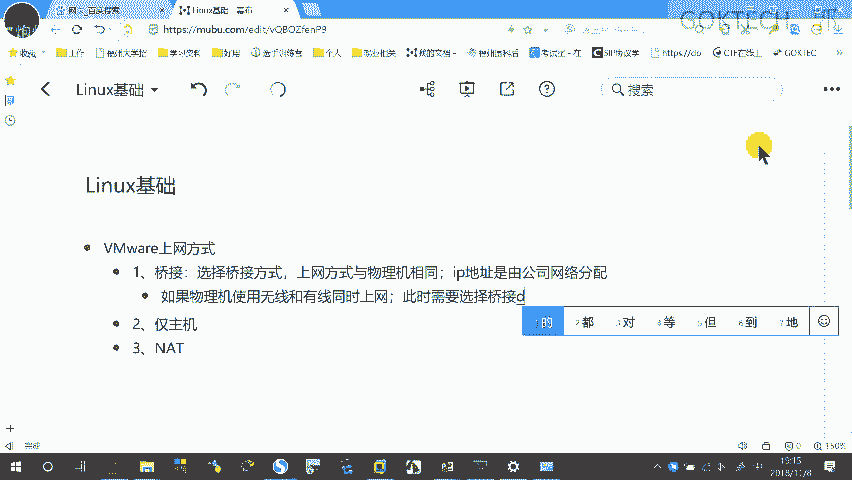

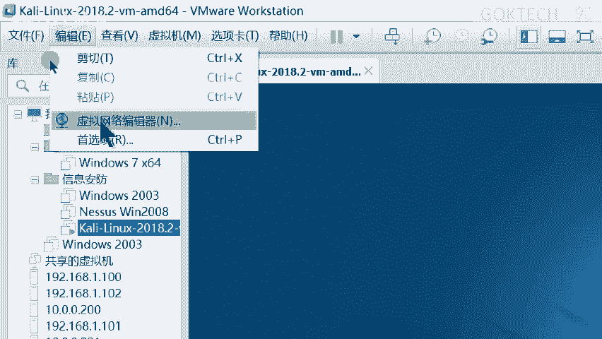

## Linux基础操作 💻

现在我们对Linux有了基本认识，接下来进入实践环节，学习最基础的命令行操作。

### 基本概念与特性
*   **区分大小写**：文件`A.txt`和`a.txt`是两个不同的文件。
*   **隐藏文件**：以点`.`开头的文件是隐藏文件。使用`ls -a`命令可以查看。
*   **特殊字符**：空格在命令行中有特殊含义（用于分隔参数）。若要创建带空格的文件名，需使用反斜杠`\`进行转义，例如：`touch c\ d`。
*   **路径表示**：使用正斜杠`/`表示路径，例如`/home/user`。
*   **注释**：在配置文件中，以井号`#`开头的行是注释行。
*   **命令续行**：在命令末尾使用反斜杠`\`，表示命令在下一行继续。

### 常用命令列表
以下是必须掌握的几个基础命令：

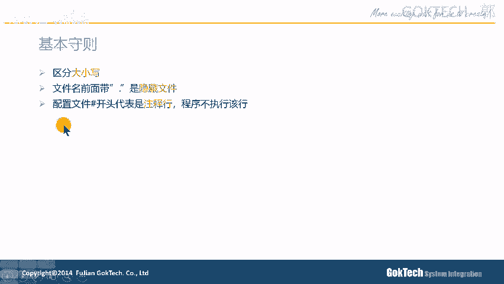

*   `pwd`：**Print Working Directory**，显示当前所在的路径。
*   `cd`：**Change Directory**，更改当前路径。
    *   `cd 目录名`：进入指定目录。
    *   `cd ..`：返回上一级目录（父目录）。
    *   `cd -`：返回上一次所在的目录。
*   `ls`：**List**，列出目录中的文件和子目录。
    *   `ls -l`：以长格式显示，包含文件权限、大小、时间等详细信息。
    *   `ls -a`：显示所有文件，包括隐藏文件。
*   `touch 文件名`：创建一个新的空文件，或更新已有文件的时间戳。
*   `mkdir 目录名`：**Make Directory**，创建一个新目录。
*   `rm`：**Remove**，删除文件或目录。
    *   `rm -i 文件名`：交互式删除，会询问确认。
    *   `rm -f 文件名`：强制删除，不询问。
    *   `rm -r 目录名`：递归删除目录及其内部所有内容。
    *   `rm -rf 目录名`：**强制递归删除**，需谨慎使用。
*   `mv 源 目标`：**Move**，移动或重命名文件/目录。
    *   `mv old.txt new.txt`：重命名文件。
    *   `mv file.txt dir/`：将文件移动到目录中。
    *   `mv file.txt dir/new.txt`：移动并重命名。
*   `cp 源 目标`：**Copy**，复制文件或目录。
*   `cat 文件名`：查看文件全部内容。
*   `less 文件名`：分页查看文件内容，可上下滚动，按`q`键退出。
*   `head 文件名`：查看文件开头几行（默认10行）。
*   `tail 文件名`：查看文件末尾几行（默认10行）。

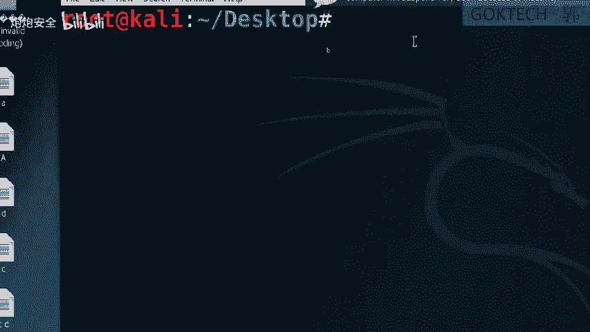

### 文本编辑器 VI/VIM
`vi`或`vim`是Linux中最常用的命令行文本编辑器，有三种模式：
1.  **命令模式**：启动后的默认模式，可以移动光标、删除行等。
    *   `dd`：删除当前行。
2.  **插入模式**：可以输入和编辑文本。
    *   按`i`键进入插入模式。
3.  **扩展（末行）模式**：用于保存、退出等操作。
    *   按`Esc`键从插入模式返回命令模式。
    *   在命令模式下按`:`进入扩展模式。
    *   `:w`：保存。
    *   `:q`：退出。
    *   `:wq`：保存并退出。
    *   `:q!`：不保存强制退出。

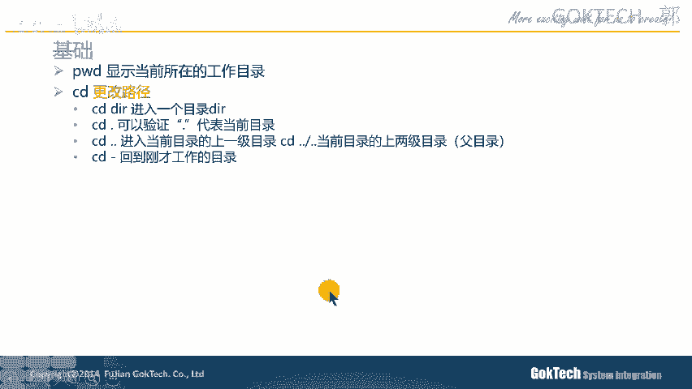

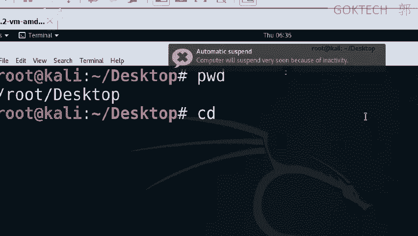

---

## 网络基础与虚拟机网络 🌐

掌握了Linux的基本操作后，我们需要了解如何让Linux系统与网络交互，这涉及到虚拟机网络配置。

### 虚拟机网络模式
在VMware等虚拟机软件中，有三种主要的网络连接方式：

*   **桥接模式（Bridged）**
    *   **含义**：虚拟机直接连接到物理网络，就像一台真实的电脑。
    *   **IP地址**：由所在物理网络（如家庭路由器）的DHCP服务器分配。
    *   **特点**：虚拟机与物理机、以及网络内其他设备可以互相访问。

*   **仅主机模式（Host-Only）**
    *   **含义**：虚拟机与物理机之间形成一个封闭的私有网络。
    *   **特点**：虚拟机只能与物理机通信，**无法访问外网（如互联网）**。

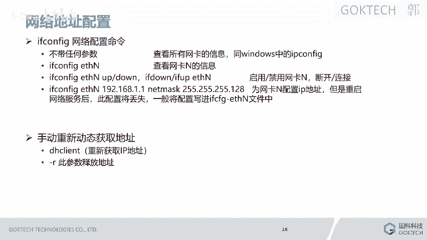

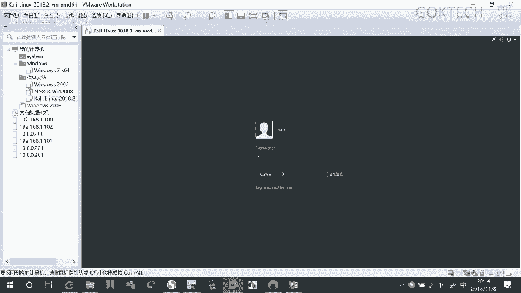

*   **NAT模式（Network Address Translation）**
    *   **含义**：虚拟机通过物理机“代理”上网。物理机充当虚拟机的路由器。
    *   **特点**：虚拟机可以访问外网，但外网设备无法直接访问虚拟机，实现了内网隔离。

**模式选择**：进行安全实验时，为避免影响真实网络，推荐使用**NAT模式**或**仅主机模式**。

### Linux网络配置命令
*   `ifconfig`：查看或配置网络接口信息。
*   `ifconfig eth0 down/up`：禁用或启用名为`eth0`的网卡。
*   `dhclient`：向DHCP服务器请求获取IP地址。
*   `dhclient -r`：释放当前IP地址。

### 文件传输工具
为了解决虚拟机与物理机之间复制粘贴文件的问题，可以使用支持SSH协议的工具，如**SecureCRT**、**Xshell**或**MobaXterm**。这些工具通常提供SFTP功能，可以方便地在两个系统间拖拽传输文件。

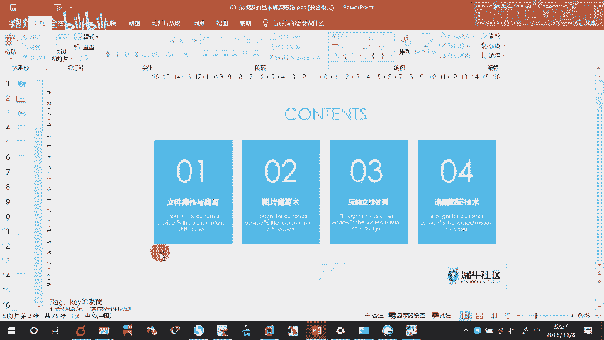

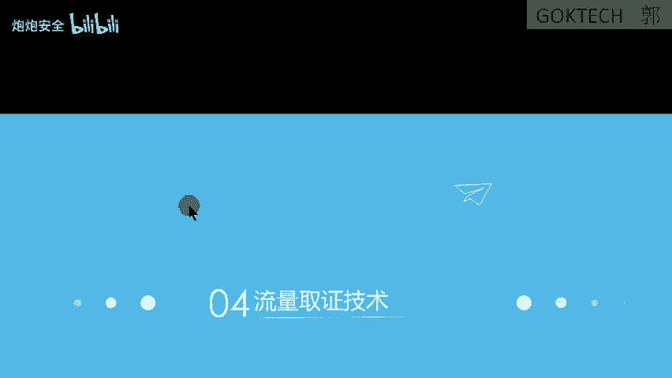

**启用SSH服务**：有时需要手动在Linux中启动SSH服务才能连接。
1.  编辑SSH配置文件：`vi /etc/ssh/sshd_config`。
2.  确保包含以下两行：
    ```
    PermitRootLogin yes
    PasswordAuthentication yes
    ```
3.  重启SSH服务：`service ssh restart`。

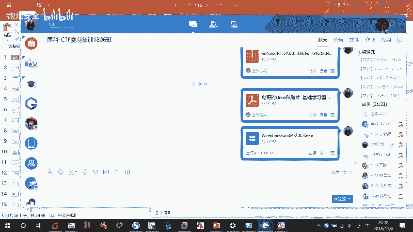

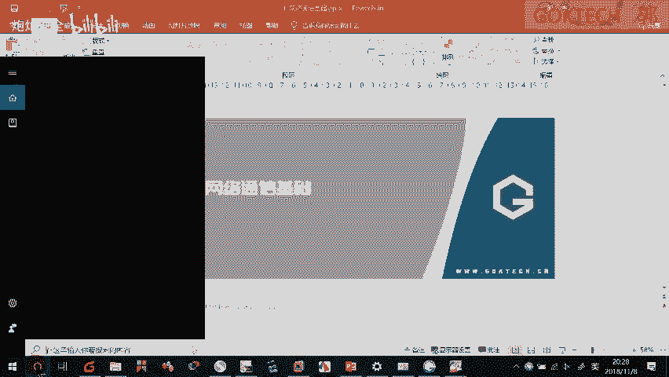

---

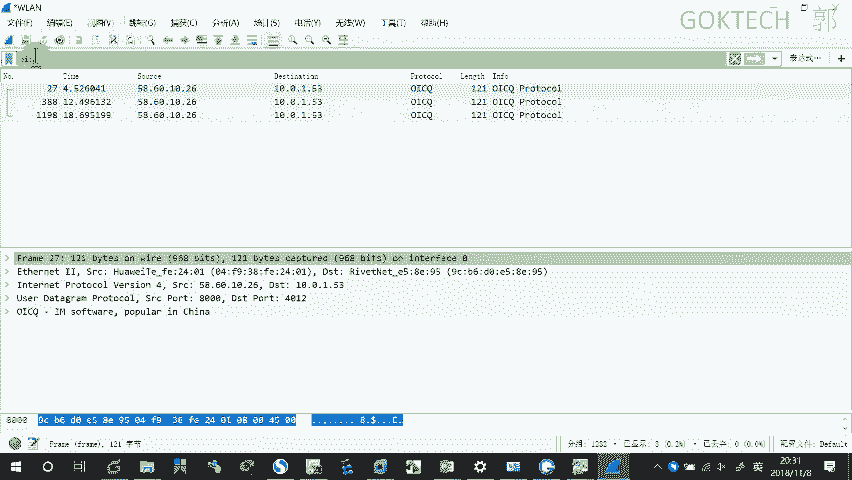

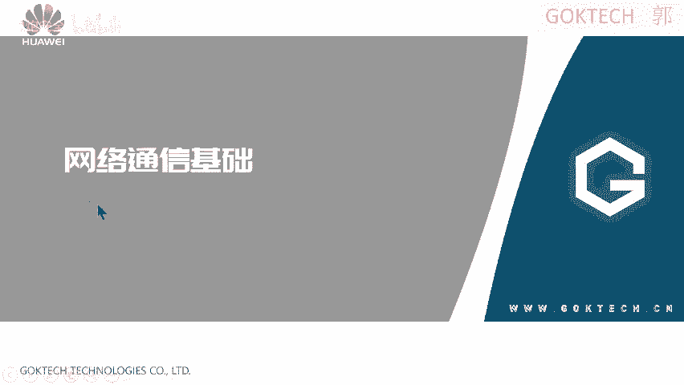

## 网络协议与流量分析 📡

最后，我们探讨网络通信的核心——协议，并学习如何分析网络流量，这是安全分析的关键技能。

### 网络协议与OSI模型
为了让不同厂商的设备能够通信，需要遵循统一的标准，即**网络协议**。最著名的理论模型是**OSI七层模型**，它将网络通信过程分为七层：

1.  **应用层**：为应用程序提供网络服务，如HTTP、FTP、QQ。
2.  **表示层**：负责数据格式转换、加密/解密。
3.  **会话层**：建立、管理和终止会话。
4.  **传输层**：提供端到端的可靠或不可靠传输，如TCP、UDP。通过**端口号**区分不同应用。
5.  **网络层**：进行逻辑寻址和路由选择，如IP协议。
6.  **数据链路层**：进行物理寻址（MAC地址），将数据帧转换为比特流。
7.  **物理层**：在物理媒介上传输比特流，定义电气、机械特性。

在实际中，更常用的是**TCP/IP五层模型**（应用层、传输层、网络层、数据链路层、物理层）或**四层模型**。

### 抓包工具 Wireshark
Wireshark是一款强大的网络协议分析工具（抓包工具）。

**基本使用**：
1.  选择要监听的网卡（如无线网卡）。
2.  开始捕获，会产生大量数据包。
3.  使用**过滤表达式**筛选感兴趣的流量，例如：
    *   `ip.addr == 192.168.1.1`：过滤特定IP地址。
    *   `tcp.port == 80`：过滤HTTP流量。
    *   `http`：过滤所有HTTP协议流量。

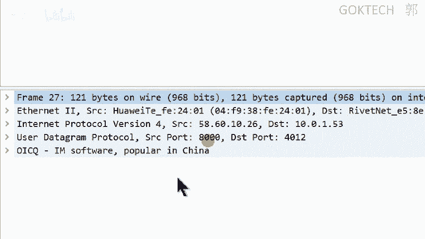

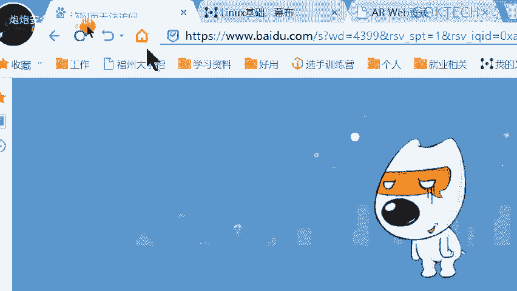

**数据包五元组**：识别一个网络连接通常需要五个要素，合称“五元组”。
*   **源IP地址**
*   **目的IP地址**
*   **传输层协议**（TCP或UDP）
*   **源端口号**
*   **目的端口号**

通过分析数据包的五元组和内部数据，可以了解通信的双方、使用的服务以及传输的内容，这对于CTF中的流量分析题目和日常安全排查至关重要。

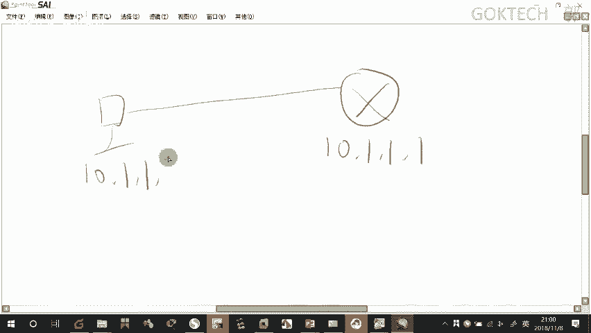

---

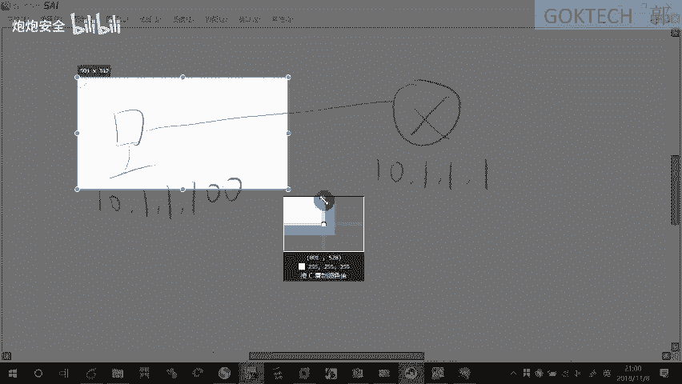

## 总结 🎯
本节课中我们一起学习了：
1.  **Linux系统基础**：包括其历史、特点、常见发行版以及最核心的命令行操作和文件编辑。
2.  **虚拟机网络**：理解了桥接、NAT、仅主机三种网络模式的区别与用途。
3.  **网络协议基础**：认识了OSI和TCP/IP模型，理解了数据在网络中分层封装传输的概念。
4.  **流量分析入门**：学会了使用Wireshark进行基本的抓包和过滤，并理解了数据包五元组的意义。

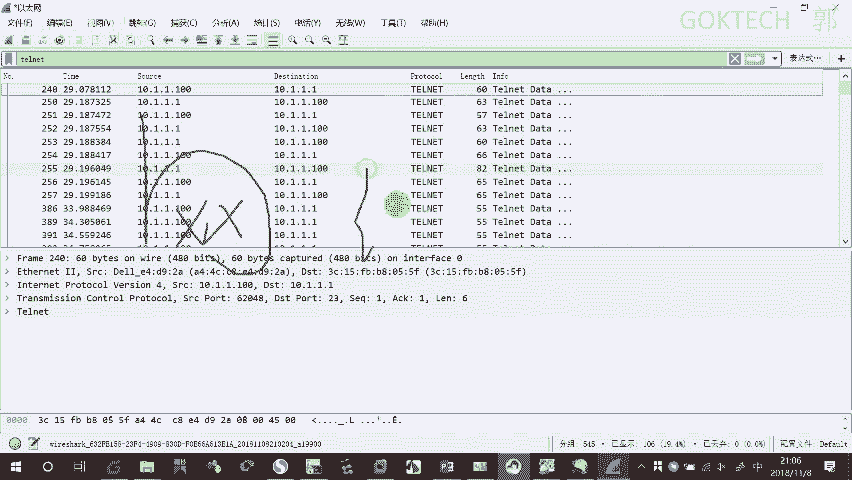

这些知识是构建网络安全技能的基石。请务必动手实践，通过反复练习来巩固记忆。推荐阅读《鸟哥的Linux私房菜-基础学习篇》来深化Linux理解。