# CTF培训网络安全基础入门：P8：Web基础与SQL注入

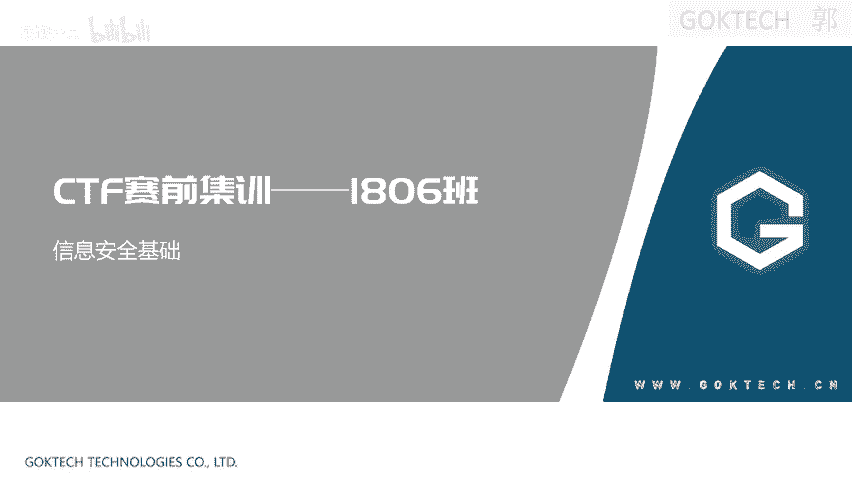

## 概述
在本节课中，我们将学习Web应用的基本架构、HTTP协议的基础知识，并初步了解SQL注入攻击的原理与利用方法。课程内容将从基础概念入手，逐步深入到实际的操作演示。

## Web应用基本架构

上一节我们介绍了课程概述，本节中我们来看看Web应用的基本架构。

一个典型的Web应用架构主要分为客户端和服务端两部分。客户端通常指用户的浏览器，而服务端则包括Web应用服务器和数据库服务器。

*   **客户端**：用户通过浏览器访问网站。浏览器能够解析HTML、JavaScript等语言，并通过HTTP/HTTPS协议与服务器通信。
*   **服务端**：
    *   **Web应用服务器**：例如微软的IIS、Apache、Tomcat等。它的作用是将服务器上的数据（如文件、程序处理结果）以Web页面的形式发布出来。用户访问的每个资源都对应一个唯一的URI（统一资源标识符）。
    *   **数据库服务器**：当数据量庞大时，数据会存储在专门的数据库服务器上。Web应用服务器需要将HTTP请求中的参数转换为SQL语句，与数据库进行交互，再将结果返回给用户。


## HTTP协议基础

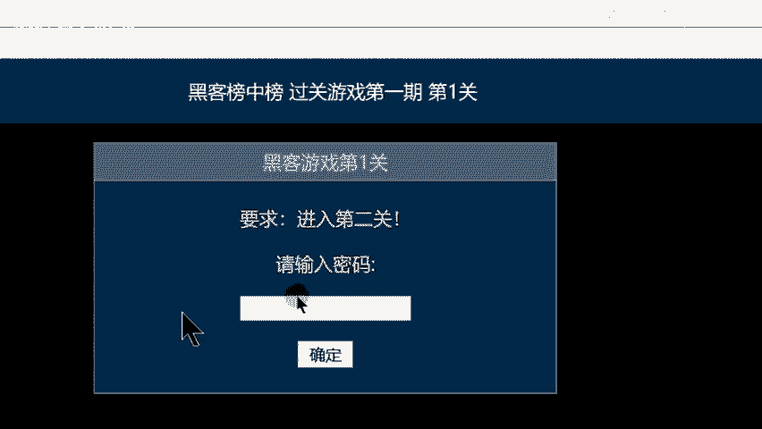

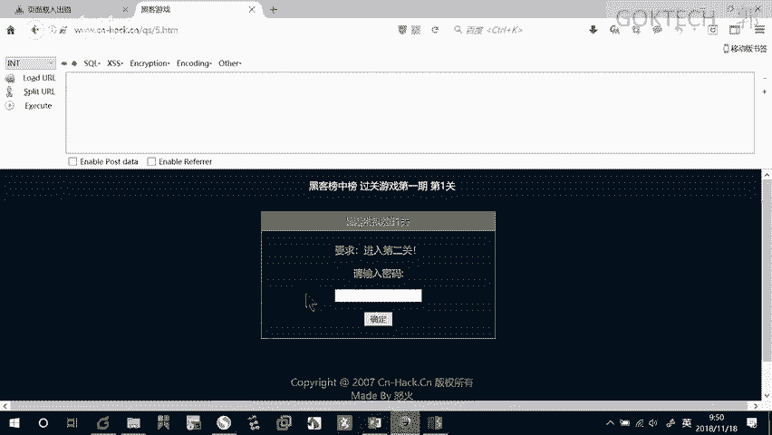

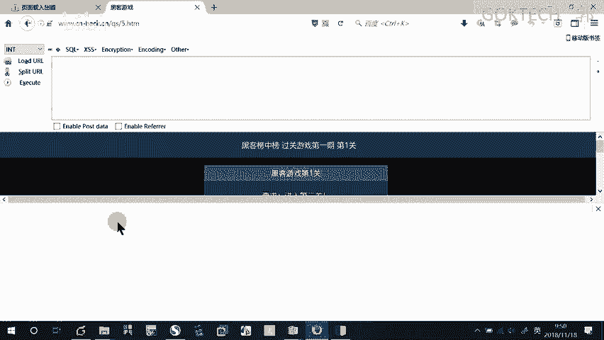

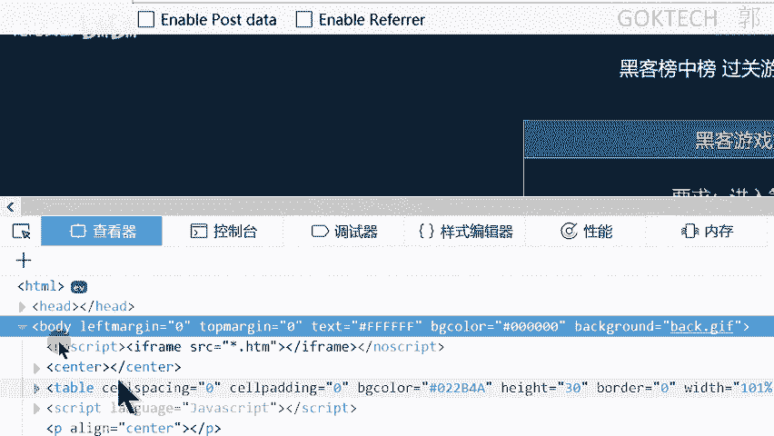

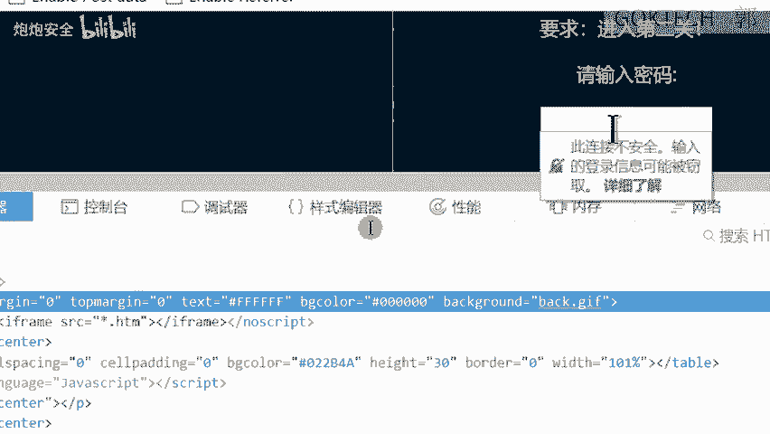

了解了Web架构后，我们来看看客户端与服务器通信所依赖的HTTP协议。

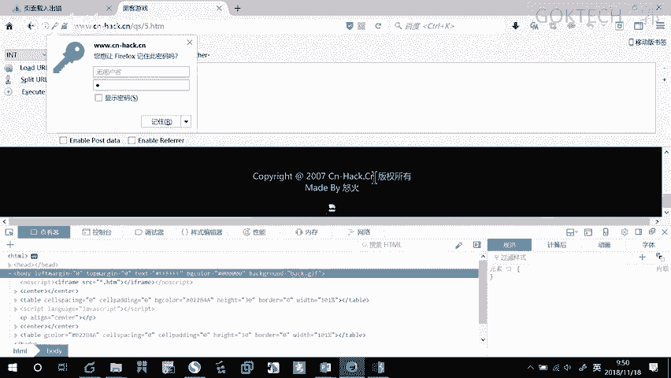

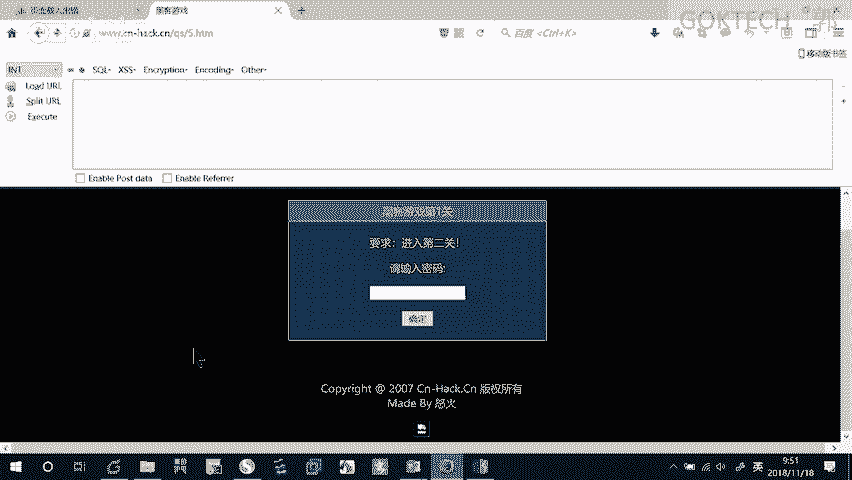

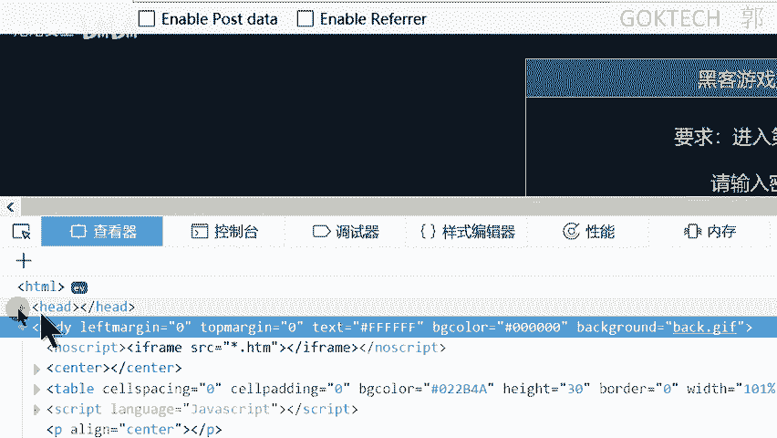

HTTP（超文本传输协议）是用于从Web服务器传输超文本到本地浏览器的协议。它基于请求和响应模型。

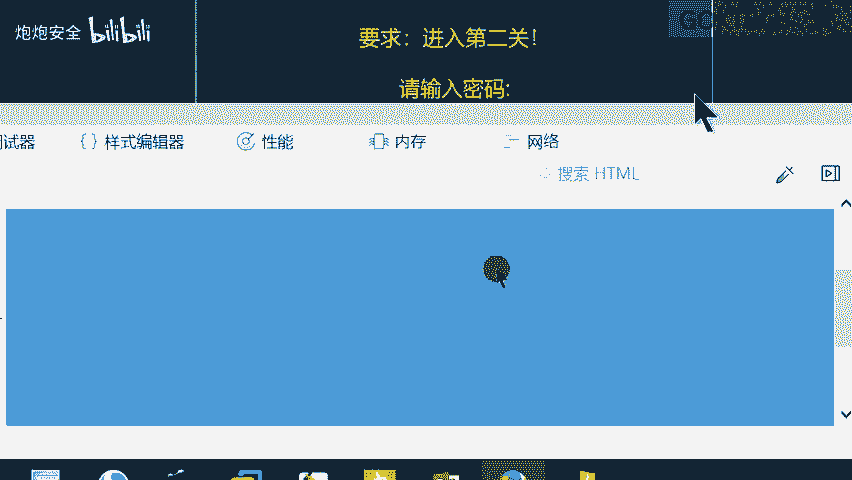

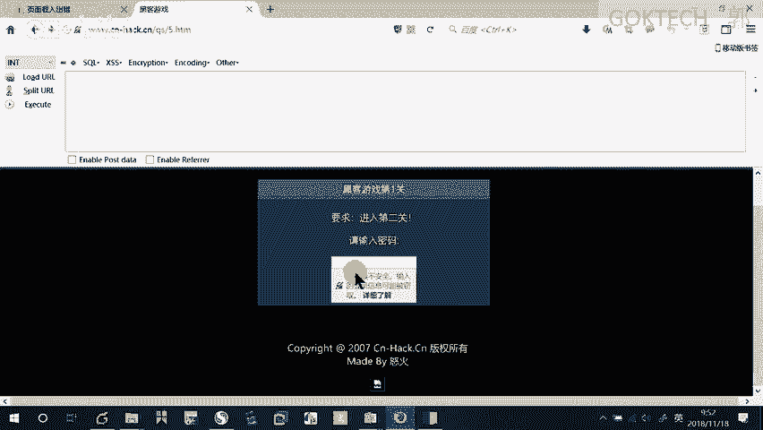

### HTTP请求
一个HTTP请求由三部分组成：请求行、消息头部和请求正文。

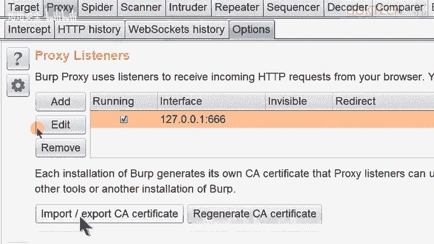

*   **请求行**：包含请求方法、请求的URI和HTTP版本。常见的请求方法有两种：
    *   **GET**：参数附在URL之后，用于获取资源。
    *   **POST**：参数放在请求正文中，更安全，常用于提交表单（如登录）。
*   **消息头部**：包含许多字段，用于传递附加信息。我们可以通过代理工具（如Burp Suite）修改这些头部。以下是几个关键字段：
    *   `Accept`：客户端能够接收的内容类型。
    *   `Accept-Language`：浏览器可接受的语言。
    *   `Referer`：表示当前请求是从哪个页面链接跳转而来的。
    *   `User-Agent`：包含发出请求的用户信息，如操作系统和浏览器类型。
    *   `X-Forwarded-For` 或 `Client-IP`：当用户通过代理服务器访问时，用于标识用户的真实IP地址。
*   **请求正文**：在POST请求中携带主要数据。

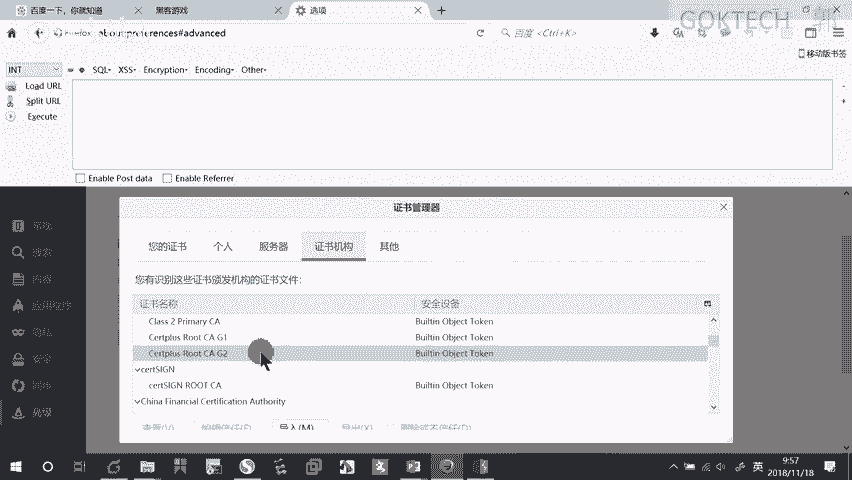

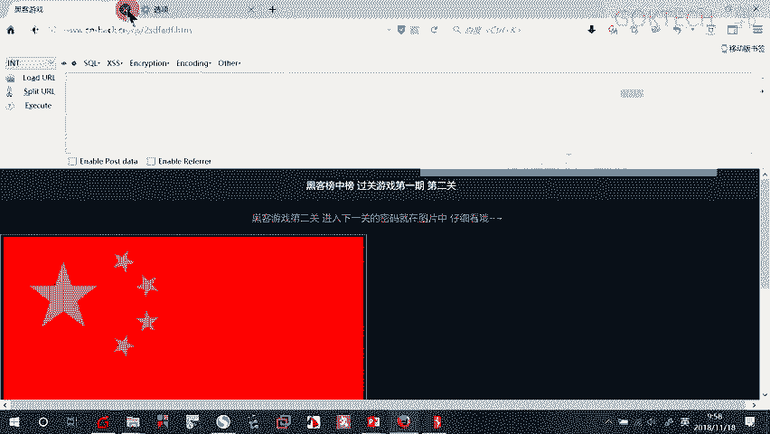

### HTTP响应
一个HTTP响应同样包含三部分：状态行、响应头部和响应正文。

*   **状态行**：包含HTTP版本、状态码和状态描述。常见状态码有：
    *   `200 OK`：请求成功。
    *   `404 Not Found`：请求的资源未找到。
    *   `3xx`：重定向，引导用户向其他URI请求资源。
*   **响应头部**：类似于请求头部，包含服务器返回的元信息，如 `Content-Type`（内容类型）。

### 工具配置：Burp Suite与浏览器代理
为了分析并修改HTTP请求/响应包，我们需要配置代理工具。

1.  **安装Java环境**：确保Burp Suite能正常运行。
2.  **配置浏览器代理**：在浏览器（如Firefox）设置中，配置代理服务器地址和端口（例如 `127.0.0.1:8080`）。
3.  **配置Burp Suite代理**：在Burp Suite的Proxy -> Options中，确保代理监听端口与浏览器设置一致（如 `8080`）。
4.  **导入CA证书**：为了正常拦截HTTPS流量，需要从Burp Suite导出CA证书，并导入到浏览器的受信任根证书颁发机构中。

配置完成后，开启Burp Suite的拦截功能，即可捕获和修改经过的HTTP流量。`Repeater` 模块常用于重放和修改请求，便于测试。


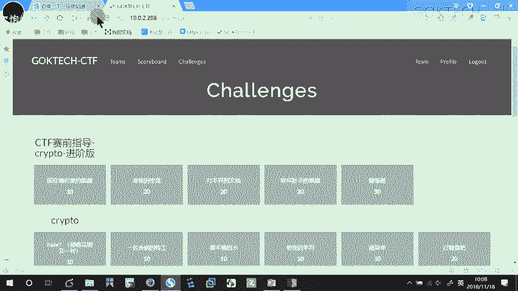

## Web题型与解题思路

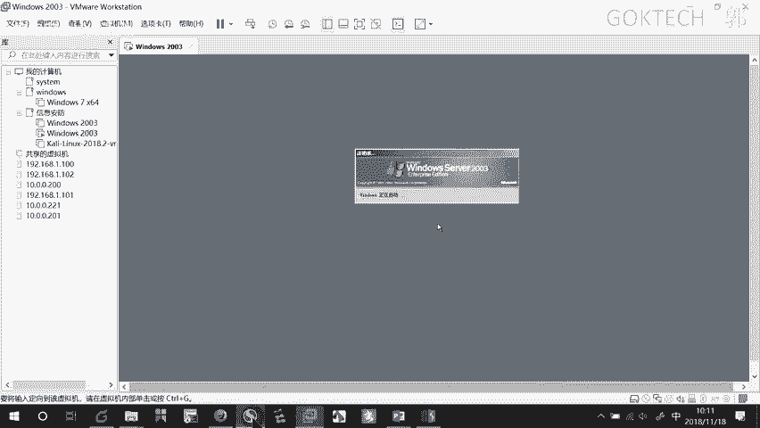

掌握了HTTP协议后，我们来看看CTF中常见的Web题型。

### 信息收集类
这类题目要求从网页前端、源码、HTTP返回包、请求包或网站路径中寻找线索，获取flag。

**例题：查看网页源代码**
题目要求输入密码。首先尝试查看网页源代码（右键或按F12）。在源代码中，发现一段JavaScript代码：
```javascript
if(x == "go go go") { alert("flag{...}"); } else { alert("别灰心，再来一次"); }
```
由此可知，当输入框的值为 `go go go` 时，会弹出flag。

### 前端代码分析类
题目通过JavaScript等前端代码设置障碍，需要分析并修改代码逻辑。

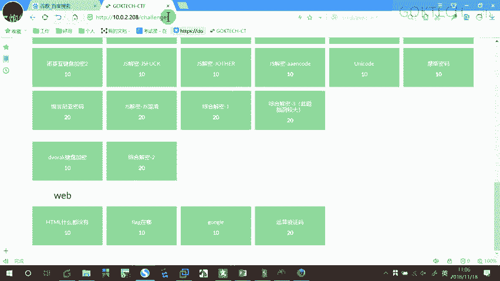

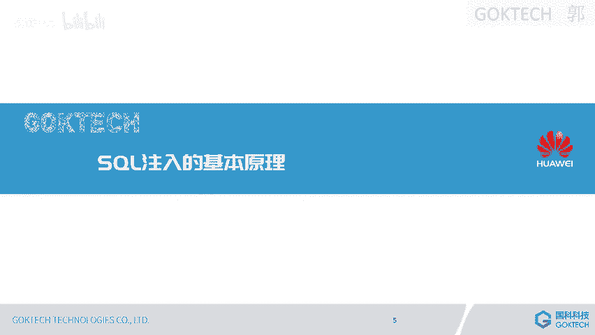

**例题：修改输入框限制**
题目输入框只能输入1个字符。按F12打开开发者工具，在元素查看器中找到对应的 `input` 标签，将其 `maxlength` 属性值改大（如改为10），即可输入更多字符进行提交。

**例题：JavaScript代码审计**
题目提示“JS代码是经过混淆的”。按F12查看源代码，找到一段被编码的JavaScript代码。将其复制到浏览器的控制台（Console）中执行，即可得到解码后的flag。

### HTTP协议分析类
常见考点是修改HTTP头部字段以满足特定条件。

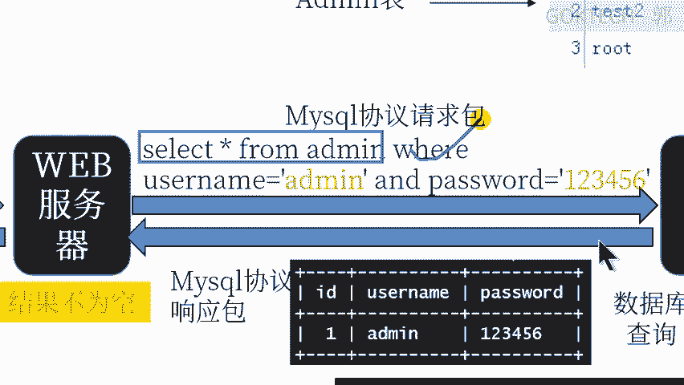

以下是几种常见情况及其修改的头部字段：
*   **要求从特定IP或主机访问**：修改 `X-Forwarded-For`。
*   **要求从特定国家访问**：修改 `Accept-Language`。
*   **要求从特定页面跳转访问**：修改 `Referer`。

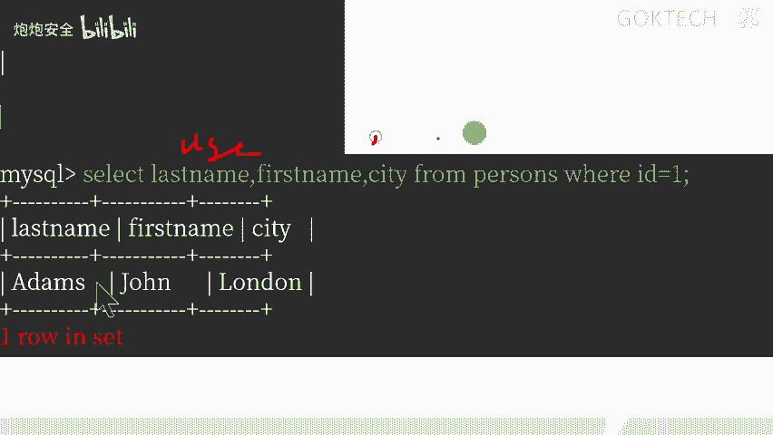

**例题：修改Referer**
题目提示“I only allow access from Google”。使用Burp Suite拦截请求，将其发送到Repeater模块。在请求头部添加或修改 `Referer` 字段为 `https://www.google.com`，然后发送请求，即可获得flag。

## SQL注入原理入门

上一节我们探讨了Web前端与协议相关的题目，本节中我们来看看服务端一个经典漏洞：SQL注入。

### 数据库基础概念
*   **数据库**：存放数据的集合。
*   **数据库管理系统（DBMS）**：操作和管理数据库的大型软件，如MySQL、SQL Server、Oracle。我们常说的“数据库”通常指的是DBMS。
*   **SQL语句**：用于与数据库通信的语言，主要操作包括增（INSERT）、删（DELETE）、改（UPDATE）、查（SELECT）。其中 **SELECT（查询）** 最为常用。

一个基本的查询语句结构如下：
```sql
SELECT 字段 FROM 表名 WHERE 条件;
```
例如，`SELECT * FROM admin;` 表示查询 `admin` 表中的所有数据。`*` 是通配符，代表所有字段。

### SQL注入攻击原理
Web应用在登录等功能中，会将用户输入（如用户名、密码）拼接到SQL语句中执行。如果拼接过程未做安全检查，攻击者就能构造特殊的输入来改变原SQL语句的逻辑。

一个典型的登录验证SQL语句可能是：
```sql
SELECT * FROM admin WHERE username='用户输入' AND password='用户输入';
```
如果用户输入 `admin` 和 `123456`，则语句变为：
```sql
SELECT * FROM admin WHERE username='admin' AND password='123456';
```
只有当用户名和密码完全匹配时，才返回数据（登录成功）。

**攻击示例：万能密码**
攻击者输入用户名为 `admin' OR '1'='1`，密码任意（如 `xxx`）。拼接后的SQL语句变为：
```sql
SELECT * FROM admin WHERE username='admin' OR '1'='1' AND password='xxx';
```
由于 `'1'='1'` 这个条件永远为真，整个 `WHERE` 子句的逻辑结果也为真，因此这条查询很可能返回数据，导致绕过密码验证，实现“万能密码”登录。

另一种方式是使用注释符。例如，输入用户名为 `admin'#`，密码任意。`#` 在MySQL中表示注释，它会使后面的 `AND password='...'` 部分失效。语句变为：
```sql
SELECT * FROM admin WHERE username='admin'#' AND password='xxx';
```
实际执行的只有 `SELECT * FROM admin WHERE username='admin';`，同样可能绕过验证。

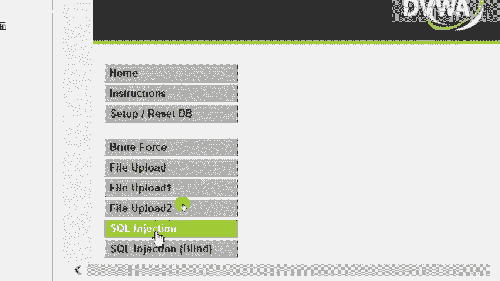

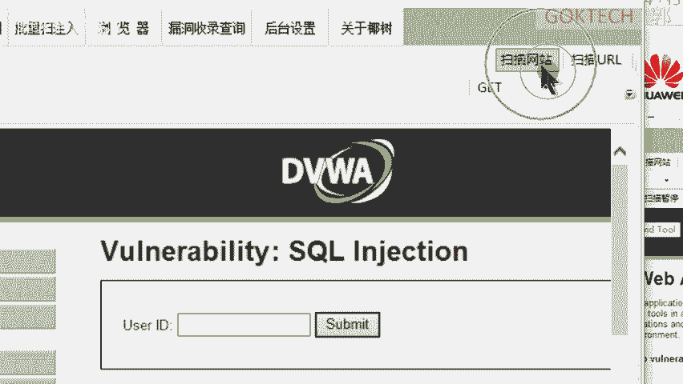

### SQL注入工具利用（以Sqlmap为例）
除了手工注入，还可以使用自动化工具如Sqlmap。

1.  发现注入点后，使用Sqlmap扫描目标URL：`sqlmap -u "目标URL"`。
2.  确认存在注入后，可以枚举数据库：`sqlmap -u "目标URL" --dbs`。
3.  枚举指定数据库中的表：`sqlmap -u "目标URL" -D 数据库名 --tables`。
4.  枚举指定表中的字段：`sqlmap -u "目标URL" -D 数据库名 -T 表名 --columns`。
5.  最终导出表中的数据：`sqlmap -u "目标URL" -D 数据库名 -T 表名 -C "字段1,字段2" --dump`。

通过这种方式，攻击者可以窃取数据库中的敏感信息，例如经过哈希加密的用户密码。如果哈希强度不足（如MD5），可能被破解，从而完全控制用户账户。

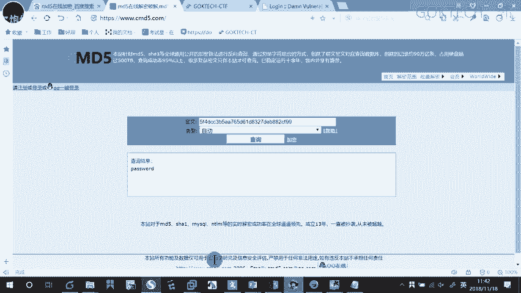

## 总结
本节课我们一起学习了Web安全的基础知识。我们从Web应用的基本架构出发，了解了HTTP协议的请求与响应模型，并学习了如何使用代理工具进行分析。接着，我们探讨了CTF中常见的Web题型，包括信息收集、前端代码分析和HTTP协议篡改。最后，我们深入了解了SQL注入攻击的原理，从手工构造“万能密码”到使用自动化工具进行数据窃取，揭示了因输入验证不严而导致的严重安全漏洞。这些知识是Web安全领域的基石，对于后续深入学习至关重要。