# CTF培训网络安全基础入门：P9：CTF赛前指导答疑 🧩

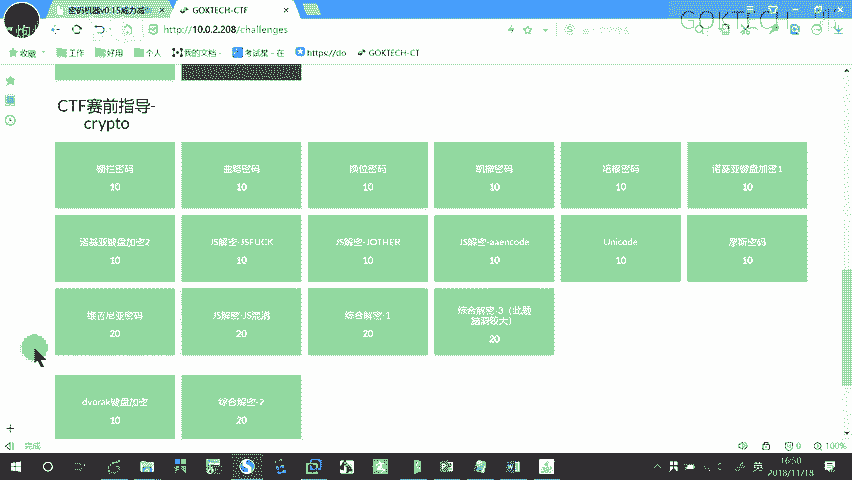

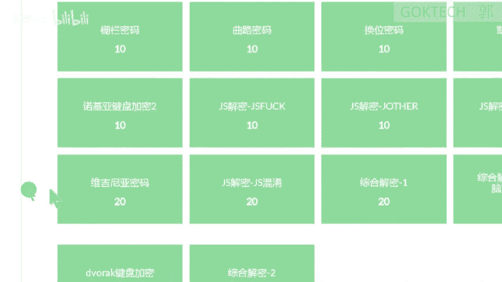

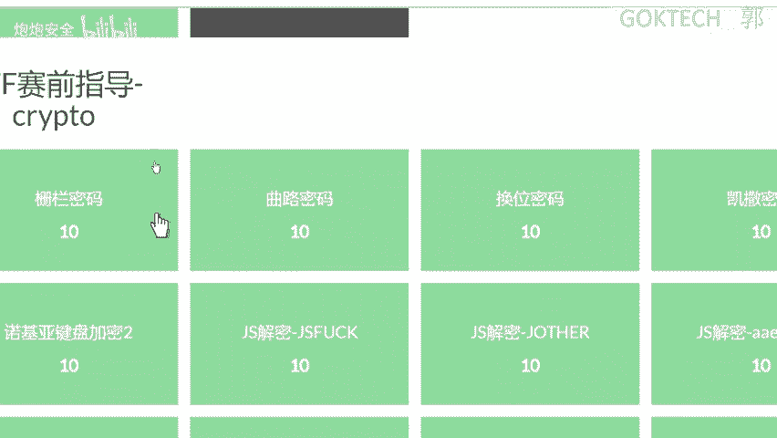

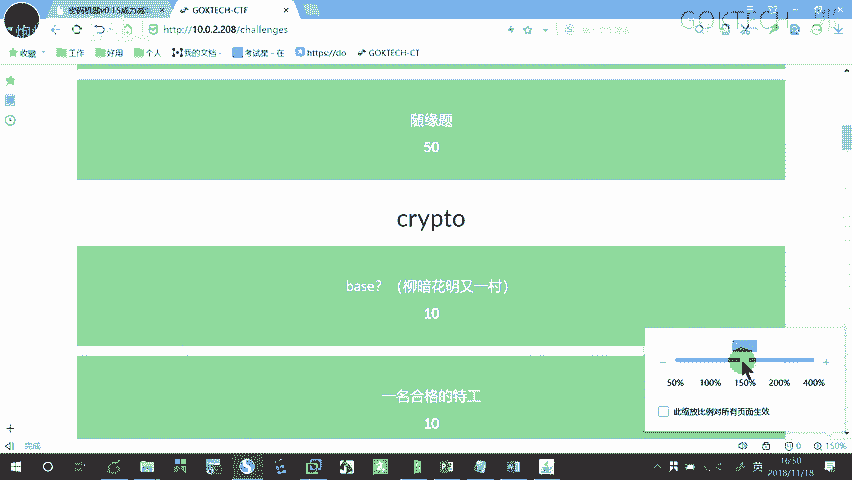

在本节课中，我们将针对CTF密码学部分的赛前练习进行集中答疑，梳理解题思路，帮助初学者攻克难点。课程将涵盖维吉尼亚密码、培根密码、栅栏密码、DES加密及明文攻击等多种题型。

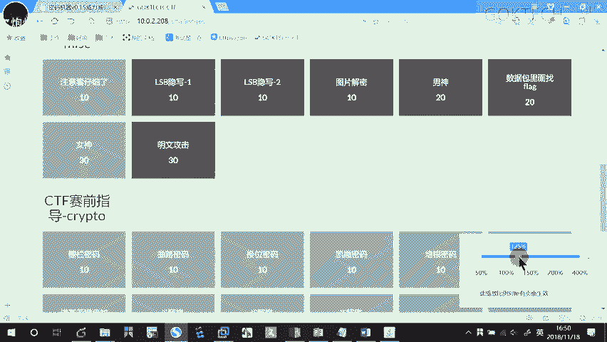

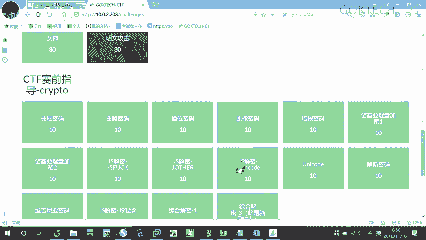

***

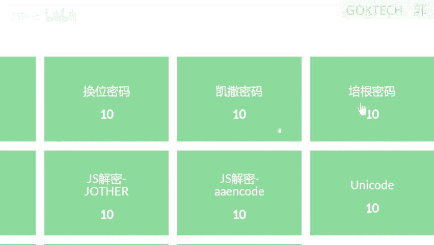

## 维吉尼亚密码解题思路 🔑

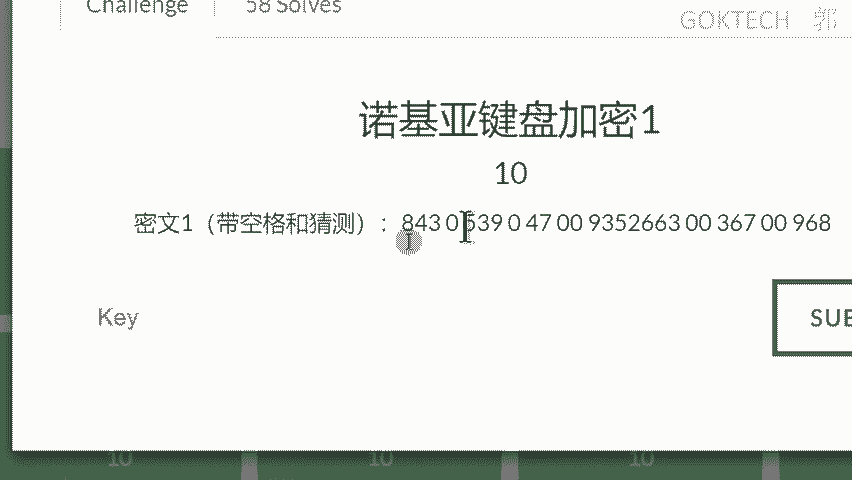

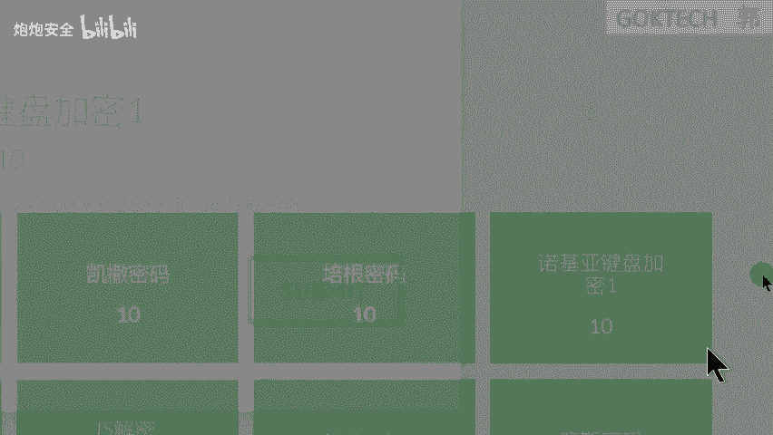

上一节我们介绍了多种古典密码，本节中我们来看看维吉尼亚密码的具体应用。题目通常会提供密文和部分明文提示，目标是推导出密钥。

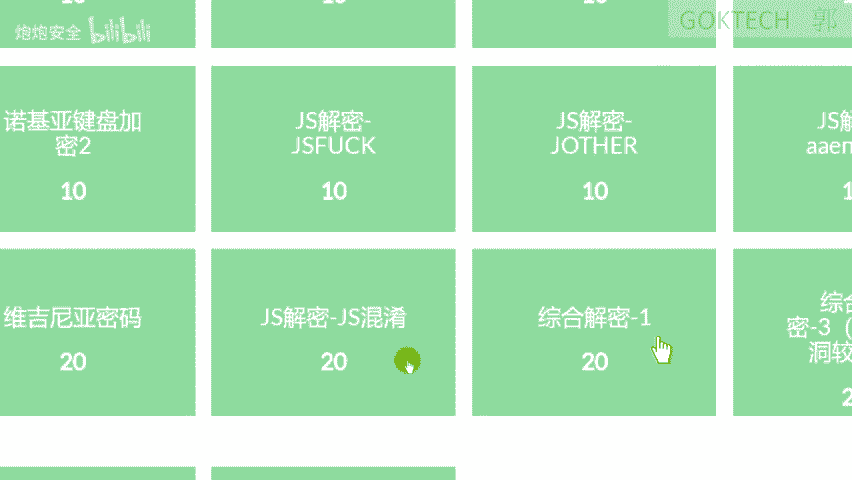

维吉尼亚密码的加解密过程基于一张表格，需要**明文**、**循环使用的密钥**和**密文**三者中的任意两项来求解第三项。题目提交格式如 `flag{ZLflag}`，这提示了 `ZLflag` 部分即为已知的明文。因此，我们可以利用已知的明文和给定的密文来反推出密钥。

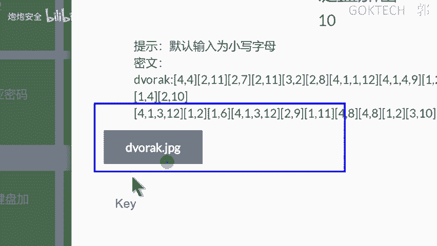

以下是解题步骤：
1.  确认题目中给出的明文片段（如 `ZLflag`）。
2.  将密文与明文片段对齐。
3.  根据维吉尼亚密码表，利用密文和明文反推出对应的密钥字符。
4.  将推导出的密钥循环使用，解密完整的密文。

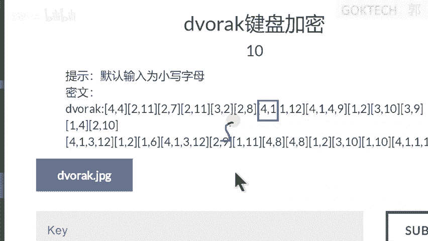

***

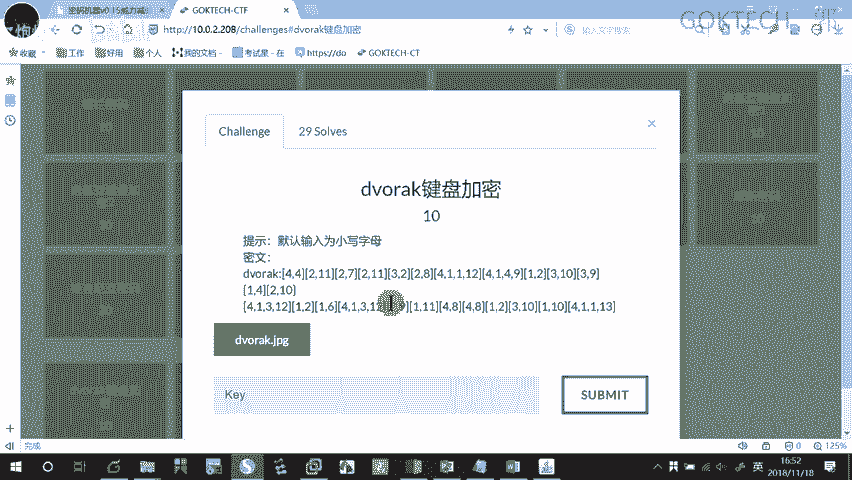

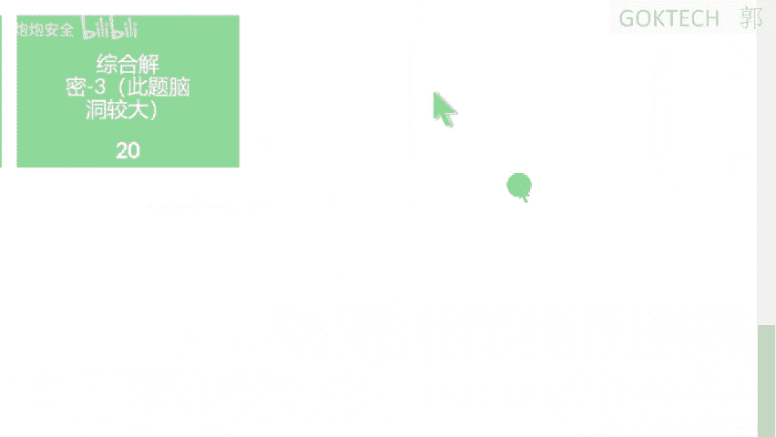

## 特殊键盘密码与培根密码 📟

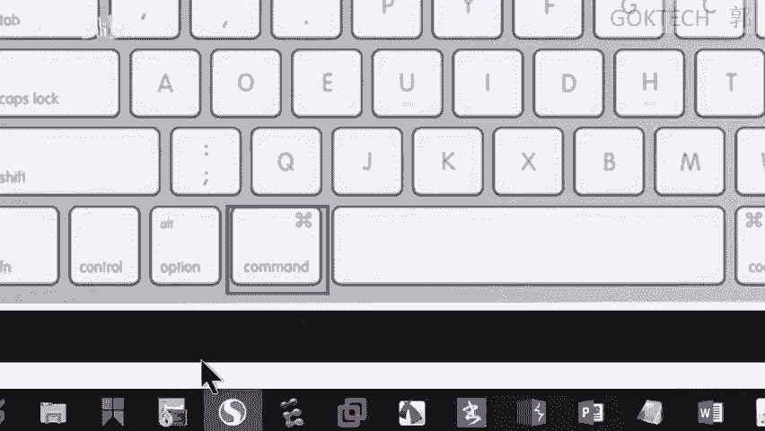

接下来，我们分析涉及特殊设备编码的题目。例如，一道题给出了老式手机键盘的输入序列，其键盘布局与现代的QWERTY键盘不同。

解题关键在于理解其编码规则：
*   数字 `0` 通常代表空格。
*   某些数字组合（如 `41`）可能代表 `Shift` 等功能键，用于输入大写字母或符号。
*   需要根据题目提供的键盘布局图，将数字序列转换为对应的字母。

完成键盘密码解码后，得到的字符串可能还需要进行**培根密码**解密。培根密码是一种将明文信息隐藏在字符表面格式中的隐写术。

***

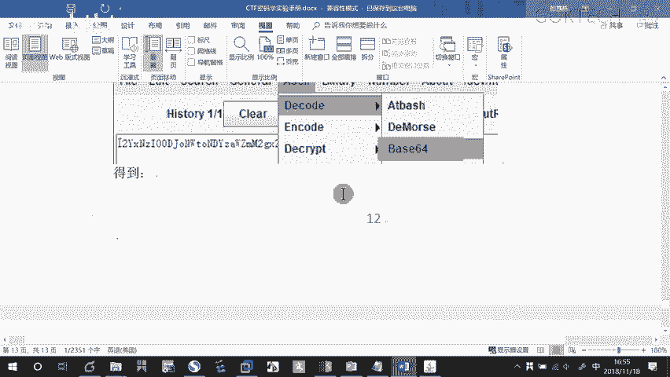

## 二进制转ASCII与DES加密 🔢

有些题目会给出由 `0` 和 `1` 组成的长序列，例如每8位一组。这很容易联想到 **ASCII编码**，因为一个8位二进制数正好对应一个ASCII字符。

我们可以使用工具（如CyberChef）进行转换：
*   将连续的二进制序列（中间无空格）转换为ASCII字符串。
*   转换后的字符串可能就是flag，也可能是一段待解密的密文。

如果转换后得到的是看似无意义的字符串，并且题目提示涉及DES加密，则需要尝试DES解密。DES加密的输入可以是**十六进制**、**二进制**或**原始字符串**格式。

以下是可能的尝试路径：
1.  将二进制转换得到的ASCII串作为密文。
2.  尝试用DES工具解密，密钥可能需要从题目其他部分获取或暴力破解。
3.  如果直接解密失败，可以尝试将得到的ASCII串先进行**凯撒密码**位移，因为字母在凯撒密码中会变化，而数字不变。
4.  在位移后的结果中，寻找符合 `flag{` 或 `CTF` 格式的字符串，或者寻找有效的十六进制数（因为DES支持十六进制输入）。

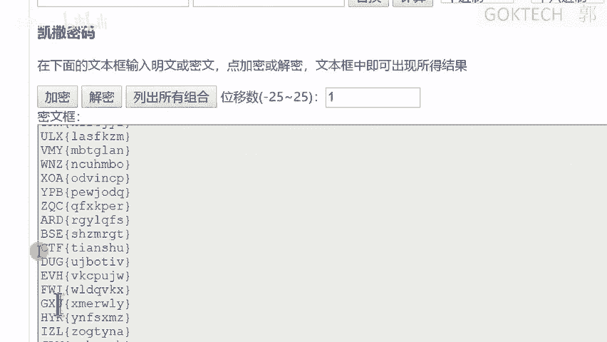

***

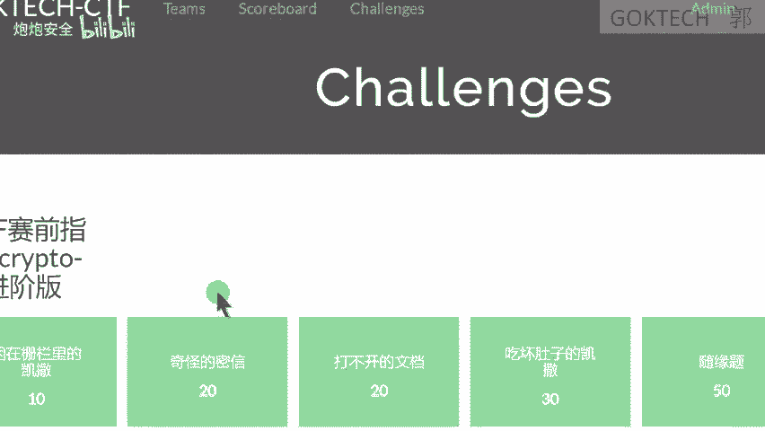

## 栅栏密码与组合攻击 🚧

“困在栅栏里的恺撒”这类题目提示了组合密码。首先需要处理**栅栏密码**。

栅栏密码的解法是将密文按一定栏数重新排列。如果不知道具体栏数，可以借助工具进行爆破式解密：
*   将密文输入工具，尝试从2栏到N栏（如6栏）的所有可能。
*   在解密结果中，寻找包含 `flag` 或 `CTF` 等有意义单词的字符串。

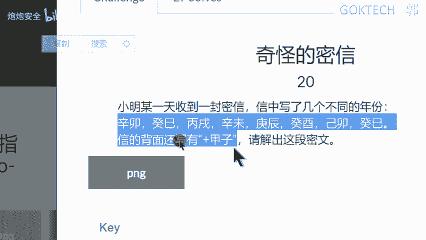

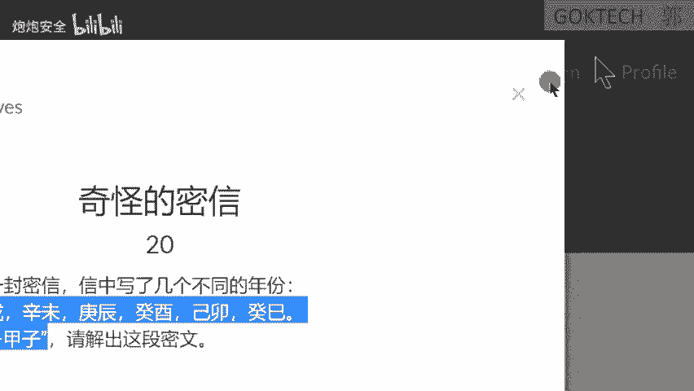

得到栅栏解密的结果后，再对其应用**凯撒密码**进行位移。同样，可以列出所有可能的位移结果（1-25），从中找出有意义的flag。

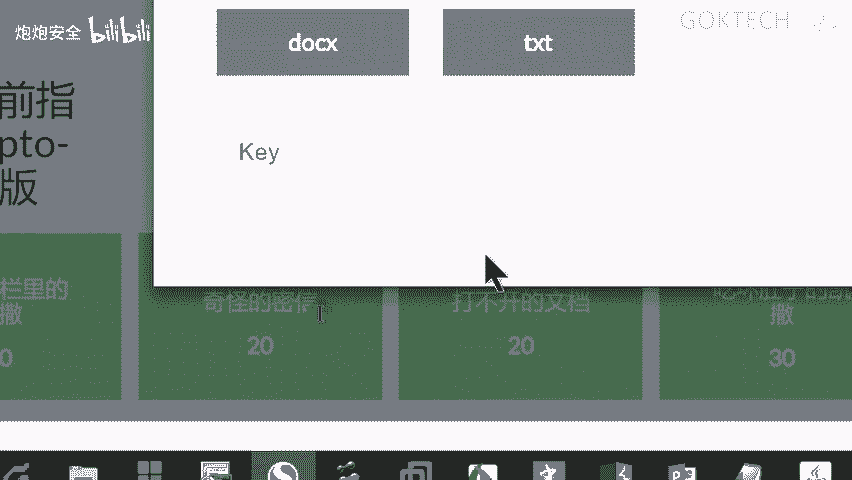

***

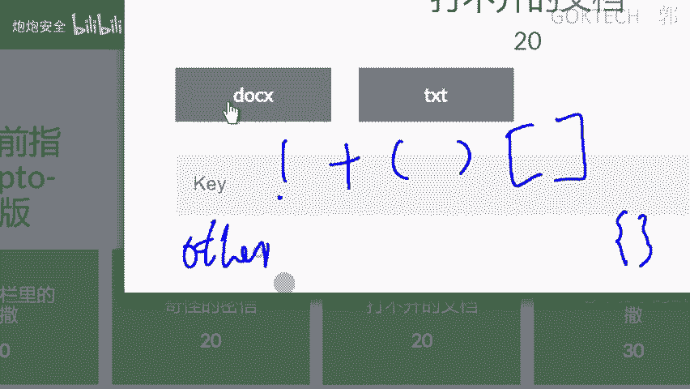

## 奇怪的密信与编码叠加 ✉️

对于“奇怪的密信”类题目，通常涉及多层编码转换。例如：
1.  题目可能给出一串数字，并提示“夹子=60”。
2.  第一步是将每个数字加上60。
3.  相加后的数字可能超过255（ASCII最大值），这时需要考虑**模256**操作，即结果对256取余。
4.  将处理后的数字序列转换为ASCII字符。
5.  得到的字符串可能还需要进行**凯撒密码**解密才能获得最终flag。

***

## JS代码混淆与修复 🛠️

在Web或Misc类题目中，可能会遇到经过混淆的JavaScript代码。例如，下载的压缩包解压后得到一个加密的文档，密码在注释或图片中。

用密码打开文档后，发现其中是混淆的JS代码，无法直接阅读或执行。常见的混淆手段包括将特定符号（如 `{}`）替换成其他字符（如中文括号）。

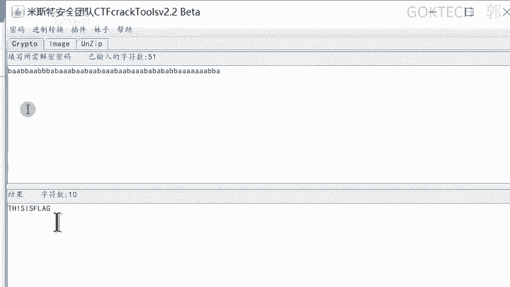

修复步骤如下：
1.  使用文本编辑器的**查找和替换**功能（快捷键 `Ctrl+H`）。
2.  将错误的中文符号或错误字符替换回标准的JS语法符号。
3.  修复后的JS代码便可以在浏览器控制台或Node.js环境中运行，输出flag。

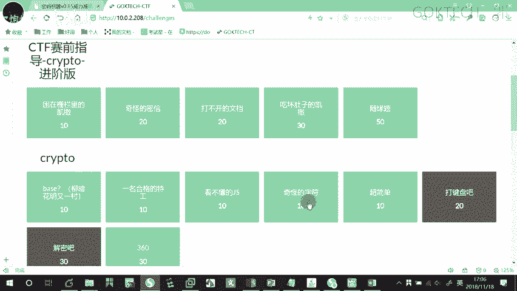

***

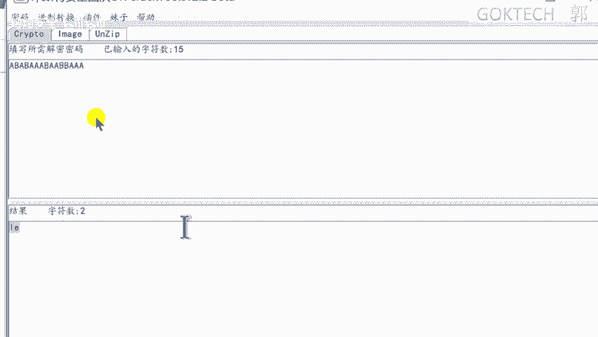

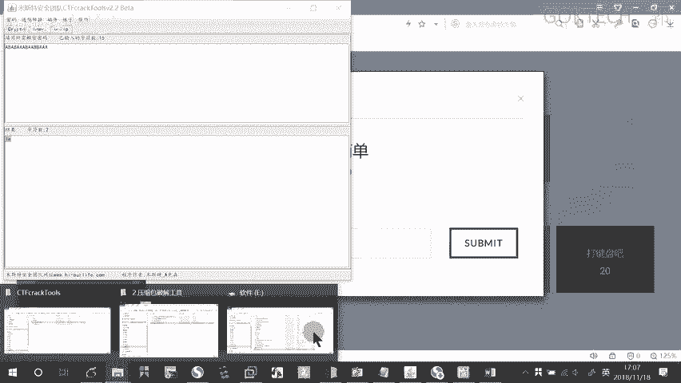

## 培根密码的两种编码表 🥓

培根密码存在两种常见的编码表，使用不同的字符对（如`AB`或`01`）来代表字母。如果使用工具解密失败，可能是因为工具默认的编码表与题目使用的不同。

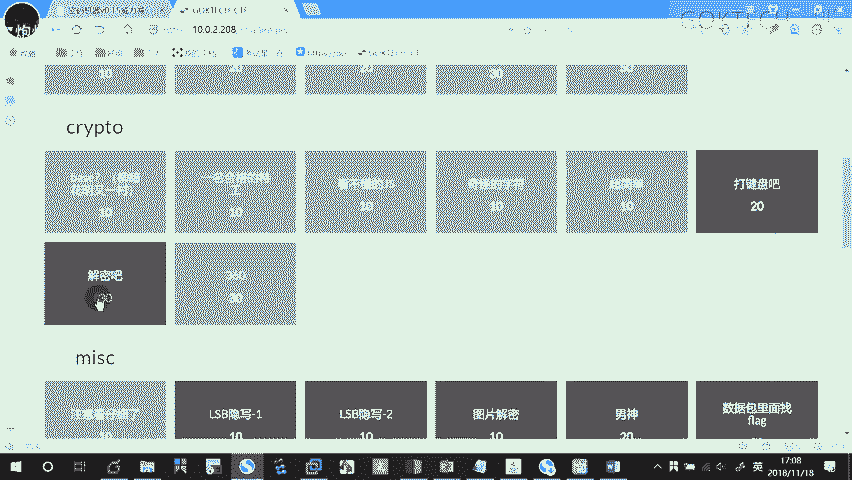

解决方法：
*   尝试使用在线的、支持选择编码表的培根密码工具。
*   或者，根据题目可能提供的线索，手动对照两种编码表进行解密。

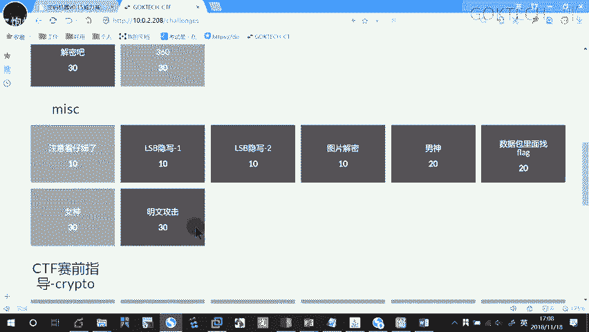

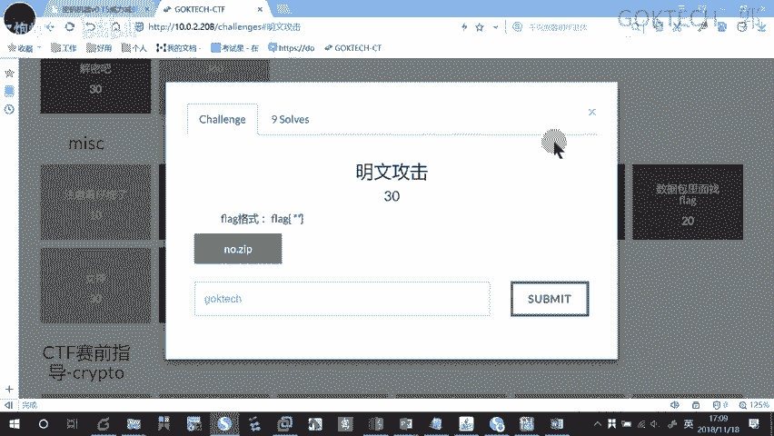

***

## ZIP压缩包明文攻击 📦

当遇到加密的ZIP压缩包，并且你拥有其中某个文件的原始未加密版本时，可以尝试**明文攻击**。

攻击原理是利用ZIP加密算法的特性，通过已知的明文文件来推导出加密密钥。操作步骤如下：
1.  准备两个文件：加密的ZIP包（`encrypted.zip`）和已知的明文文件（`plain.txt`）。
2.  将明文文件单独压缩成一个ZIP包（`plain.zip`）。
3.  使用支持明文攻击的工具（如 `pkcrack` 或 `ARCHPR` 的相应功能）。
4.  在工具中分别载入加密包和明文包，启动攻击。
5.  攻击成功后会得到ZIP包的密码。

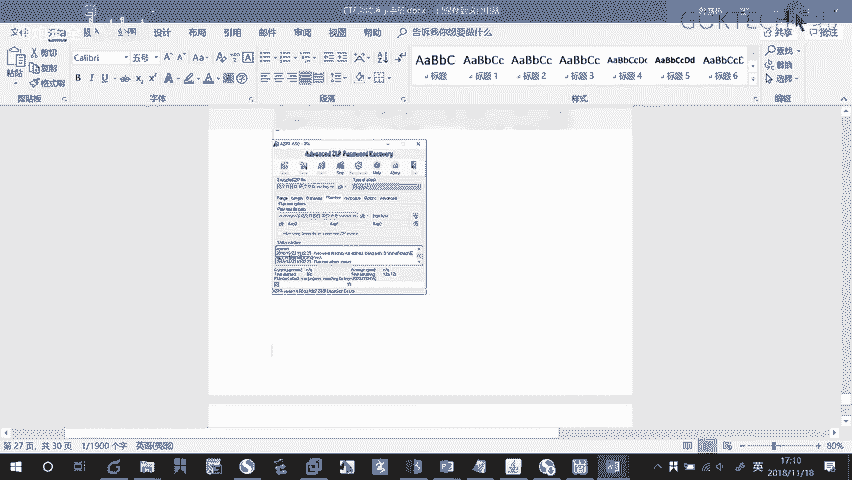

**注意**：使用某些工具时，需要在安装过程中输入正确的注册码，否则攻击功能可能无法使用。

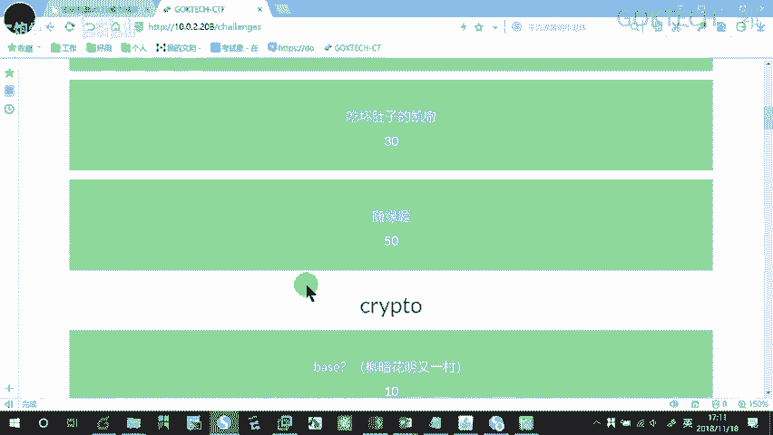

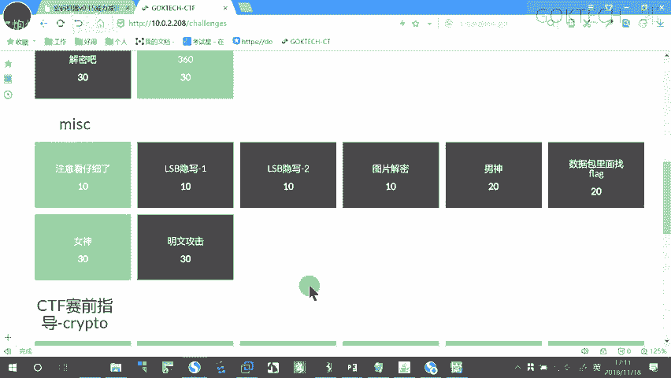

***

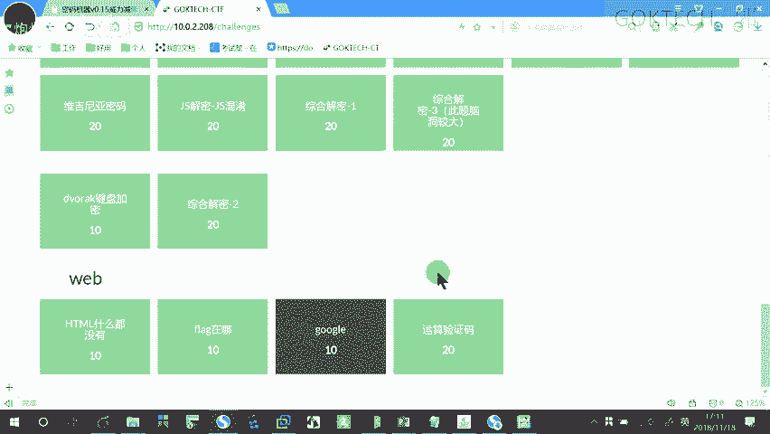

本节课中我们一起学习了CTF密码学常见题型的解题思路与技巧，包括维吉尼亚密码的密钥推导、多层编码的识别与剥离、组合密码的先后破解顺序，以及针对ZIP的明文攻击方法。掌握这些基础思路，能帮助大家在比赛中更有效地分析和解决问题。