# CTF培训：1：SSH私钥泄露攻击实战 🚀

在本节课中，我们将学习CTF比赛中一种常见的攻击场景：SSH私钥泄露。我们将从外部信息收集开始，逐步探测目标主机，利用泄露的私钥文件进行身份验证，最终获取目标主机的root权限并找到flag。

## 概述

CTF比赛环境通常分为两种。第一种是在同一局域网中提供攻击机和靶场机器。选手通过Web方式访问攻击机（通常是Kali Linux），并使用它来测试靶场机器。选手无需自带设备，所有工具由举办方提供。

第二种方式是提供一个网络接口。选手需要自备个人电脑及渗透测试所需的各种工具。选手的个人设备可以接入互联网查询资料。无论哪种环境，最终目标都是渗透靶场机器，获取其IP地址，并取得flag值。

上一节我们介绍了CTF的比赛环境，本节中我们来看看本次课程的具体实验环境。

## 实验环境配置

本次实验环境如下：
*   攻击机（Kali Linux）IP地址：`192.168.253.12`
*   靶场机器IP地址：`192.168.253.10`

我们的目标是获取靶场机器上的flag值。第一步总是进行信息探测。在获得IP地址后，我们需要扫描目标，探测其开放的服务。渗透测试的本质就是对目标服务进行漏洞探测，通过构造特殊数据包引发异常响应，从而获取权限。

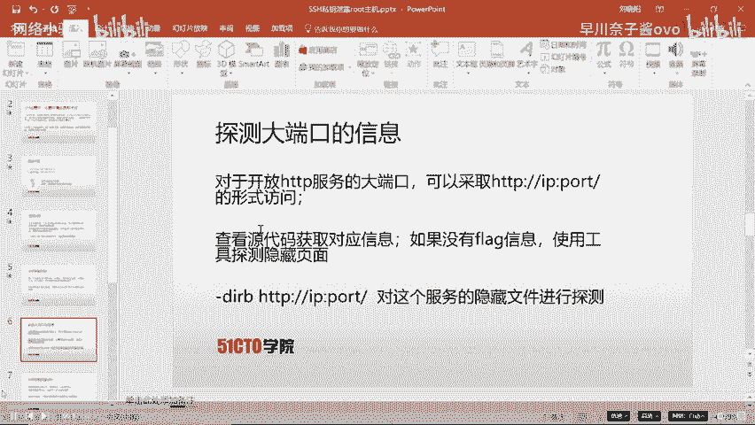

## 信息收集与服务探测

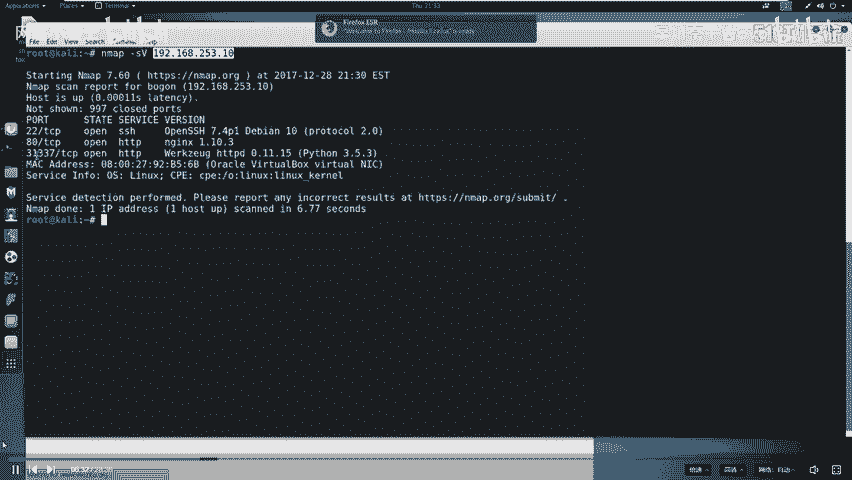

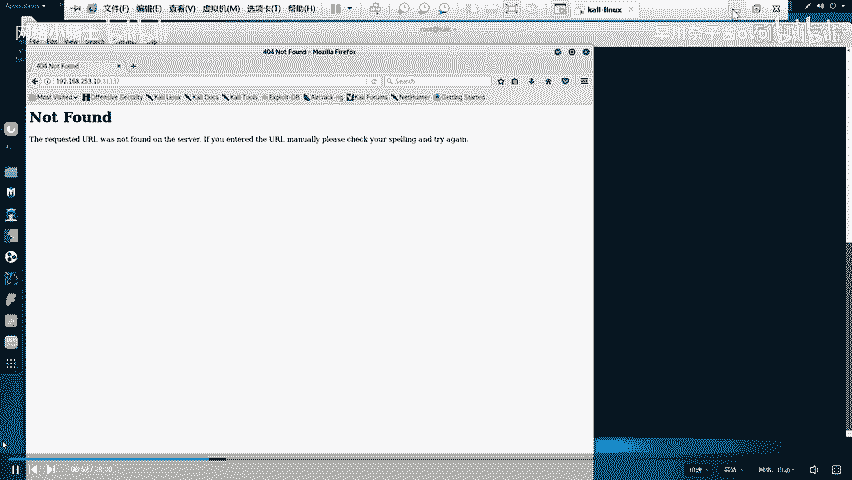

接下来，我们使用攻击机来探测靶场机器的服务信息。我们将使用Nmap工具。

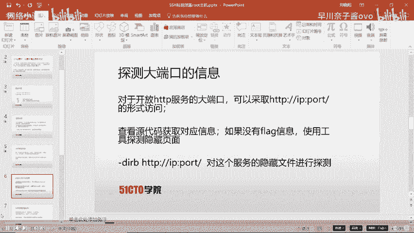

以下是探测命令：
```bash
nmap -sV 192.168.253.10
```
扫描结果显示靶场机器开放了SSH服务以及两个HTTP服务（端口80和31337）。

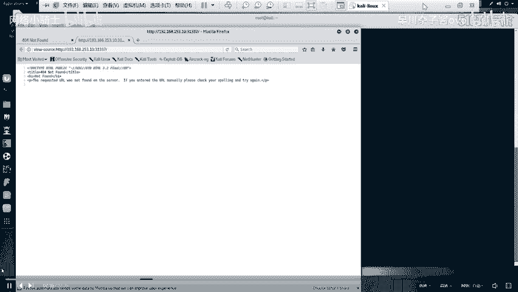

探测结束后，需要对结果进行分析。每个服务都对应计算机的一个端口，通过端口通信实现资源共享。0-1023是常见服务的已知端口，但很多服务（如MySQL的3306端口）使用其他端口。我们需要关注扫描结果中的特殊端口，并进行深入探测。

对于开放的HTTP服务，我们需要进行更深入的测试。首先，我们可以使用浏览器访问这些服务。

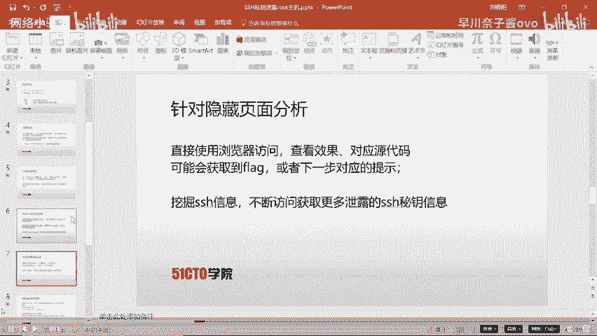

## Web服务深入探测

我们访问端口31337的HTTP服务。在浏览器中输入 `http://192.168.253.10:31337`。

访问后，页面没有直接显示flag信息。在CTF中，大量信息可能隐藏在HTML源代码中。因此，我们查看页面源代码。

查看源代码后，仍未发现有用信息。因此，我们需要探测该Web服务下是否隐藏了其他文件或目录。

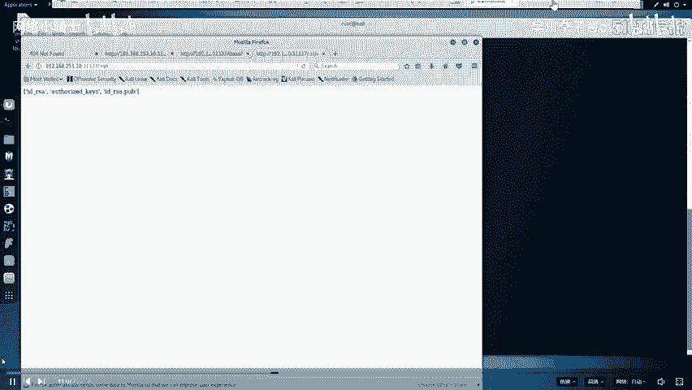

以下是探测Web目录的命令：
```bash
dirb http://192.168.253.10:31337/
```
工具扫描后，发现了几个结果，其中 `/ssh` 和 `/robots.txt` 最为醒目。我们需要对它们进行深入分析。

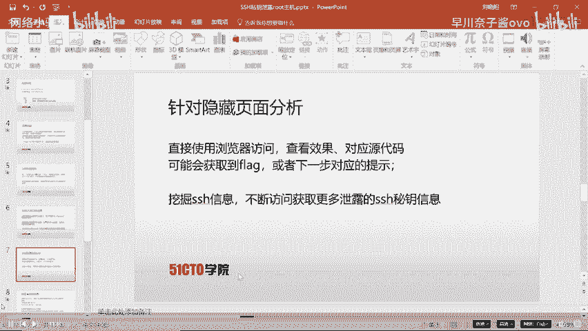

首先分析 `robots.txt` 文件。该文件用于指示搜索引擎哪些内容可以或不可以抓取。

访问 `http://192.168.253.10:31337/robots.txt`，发现它不允许抓取 `.bashrc`、`.profile` 和 `taxes` 文件。这提示我们 `taxes` 可能是一个敏感文件。

访问 `http://192.168.253.10:31337/taxes`，我们成功找到了第一个flag。

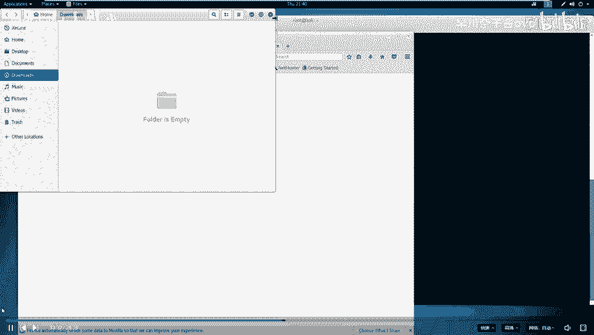

## 发现并利用SSH私钥

在 `robots.txt` 中已无更多利用价值后，我们转向 `/ssh` 目录。访问 `http://192.168.253.10:31337/ssh`，发现了一些文件信息。

SSH服务允许远程客户端通过密钥对进行认证登录。认证过程涉及私钥（如 `id_rsa`）和服务器上的公钥（`id_rsa.pub`）进行匹配。

我们尝试访问 `http://192.168.253.10:31337/ssh/id_rsa`，发现该私钥文件可供下载。同时，还有一个 `authorized_keys` 文件。我们下载私钥文件到本地桌面。

下载后，我们尝试使用该私钥登录。首先需要为私钥文件设置正确权限。

以下是查看和修改私钥文件权限的命令：
```bash
ls -alh id_rsa
chmod 600 id_rsa
```
然后尝试登录。但我们不知道用户名。查看下载的 `authorized_keys` 文件，发现其中指明了用户名为 `simon`。

使用以下命令进行登录尝试：
```bash
ssh -i id_rsa simon@192.168.253.10
```
系统提示需要密码，但我们不知道。这说明私钥本身被密码保护着，我们需要破解这个密码。

## 破解SSH私钥密码

我们需要使用工具破解私钥的密码。首先，使用 `ssh2john` 工具将私钥转换为John the Ripper可识别的格式。

以下是转换命令：
```bash
ssh2john id_rsa > rsa_crack
```
然后，使用密码字典和John the Ripper进行破解。

以下是破解命令：
```bash
zcat /usr/share/wordlists/rockyou.txt.gz | john --pipe --rules rsa_crack
```
破解成功后，我们得到了私钥的密码：`starwars`。

现在，我们使用密码和私钥再次尝试登录。
```bash
ssh -i id_rsa simon@192.168.253.10
```
输入密码 `starwars` 后，成功登录到靶场主机。

## 权限提升与获取Flag

登录后，我们当前用户是 `simon`。检查当前目录和根目录，寻找flag文件。

切换到根目录并列出文件：
```bash
cd /root
ls -la
```
发现了 `flag.txt` 文件，但使用 `simon` 账户没有读取权限，说明需要提升到root权限。

我们需要查找系统中哪些文件具有SUID权限（即以文件所有者权限运行）。使用 `find` 命令进行搜索。

以下是查找SUID文件的命令：
```bash
find / -perm -4000 2>/dev/null
```
在结果中，我们发现 `/root/message` 和 `/read_message.c` 文件有关联。查看C源代码文件 `/read_message.c`。

审计代码发现，该程序定义了一个数组 `message`，其路径是我们具有操作权限的目录。程序会询问用户名，如果输入的用户名前5个字符与预设值匹配，则会执行 `message` 目录下的程序。而 `message` 程序具有root权限。

我们尝试运行 `/root/message` 程序。当输入正确的用户名（`simon`）后，程序进入了一个交互界面。我们尝试通过输入一系列字符（如10个‘A’）和命令来跳出当前逻辑。

通过输入以下序列，我们成功启动了shell：
```
simon
AAAAAAAAAA
/bin/sh
```
执行后，我们获得了root权限。验证身份后，最终读取到 `/root/flag.txt` 文件，成功获取了最终的flag值。

## 总结

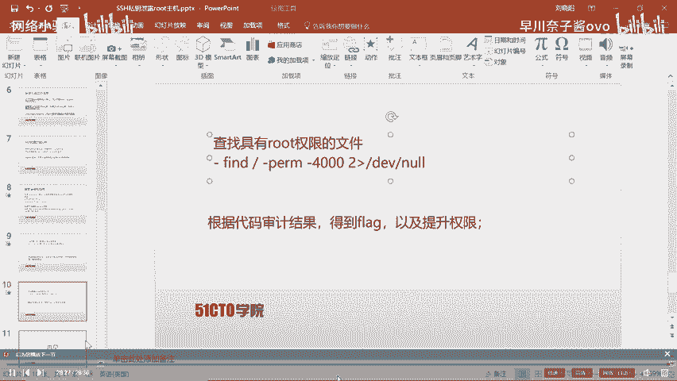

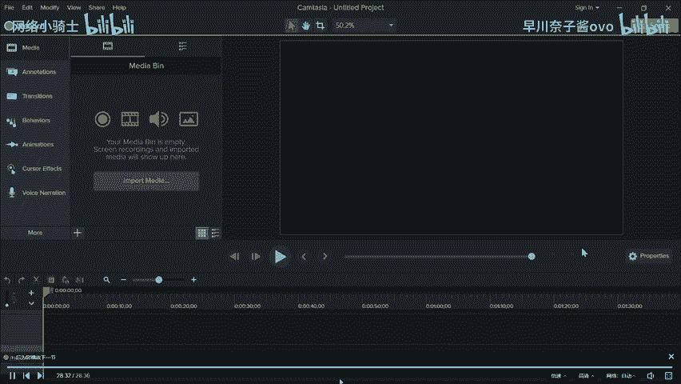

本节课中我们一起学习了SSH私钥泄露攻击的完整流程。我们从信息收集开始，使用Nmap扫描目标，通过Dirb发现敏感目录和文件。在找到泄露的SSH私钥后，我们使用 `ssh2john` 和 `John the Ripper` 破解了私钥密码，成功登录目标系统。最后，通过分析具有SUID权限的程序并进行代码审计，我们利用逻辑漏洞提升了权限，最终以root身份读取了flag文件。这个过程强调了在CTF比赛中逐步深入、不放过任何细节的重要性。