# CTF培训：密码学部分：P1 - 密码学基础与常见编码

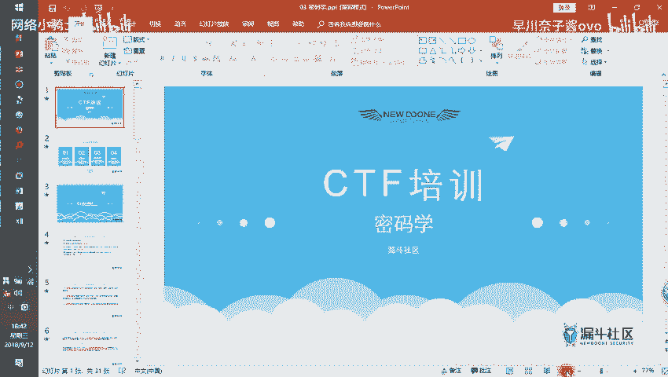


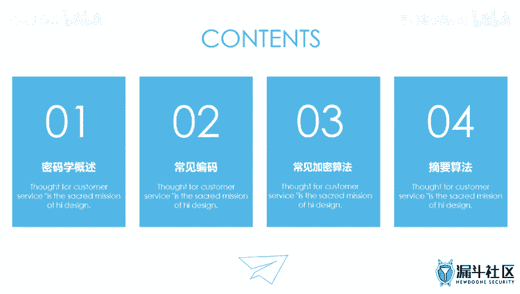


在本节课中，我们将要学习密码学的基础概念，并重点介绍在CTF比赛中常见的几种编码方式。我们将从密码学的概述开始，逐步了解编码与加密的区别，并学习如何识别和破解基础的编码。

## 密码学概述

上一节我们介绍了课程的整体结构，本节中我们来看看密码学的整体发展脉络。密码学的发展主要分为三个阶段：古典密码学、近代密码学和现代密码学。

*   **古典密码学**：主要出现在古代，例如凯撒密码、栅栏密码等，其加密方式相对简单，常用于早期的信息保密。
*   **近代密码学**：在战争时期（如电报通信）得到发展，出现了更复杂的加密方法，如维吉尼亚密码。
*   **现代密码学**：基于复杂的数学理论，加密强度极高，具有不可逆性，例如RSA、AES等算法。CTF中的难题多集中于此。

密码学中需要区分两个核心概念：**编码**和**加密**。

*   **编码**：更像是一种映射关系，它按照某种公开或私有的规则将信息从一种形式转换为另一种形式（如ASCII码、Base64）。目的是为了便于传输或存储，而非保密。
*   **加密**：目的是为了保密信息。它通过特定的算法和密钥，将明文转换为密文，没有密钥则难以恢复原文。

此外，还有一种**摘要算法**（或称哈希算法），如MD5、SHA系列。它用于验证数据的完整性，其特点是**不可逆**，且输入数据的微小变化会导致输出结果的巨大差异。

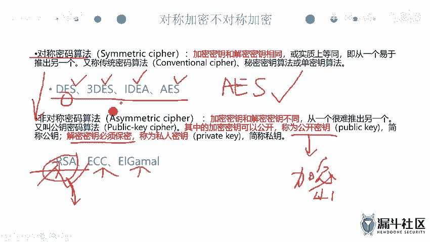

加密算法主要分为两大类：

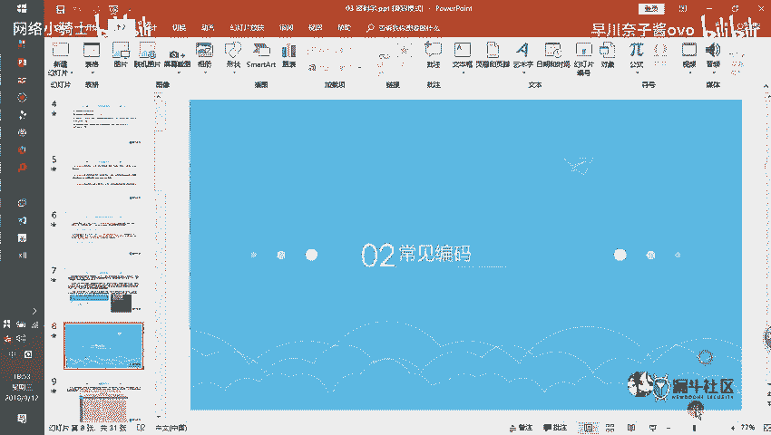

*   **对称密钥算法**：加密和解密使用**同一个密钥**。
    *   公式：`密文 = E(密钥， 明文)`；`明文 = D(密钥， 密文)`
    *   特点：加解密效率高。常见算法有：DES、3DES、IDEA、**AES**（目前最强的对称加密算法之一）。
*   **非对称密钥算法**：使用一对密钥：**公钥**和**私钥**。公钥用于加密，私钥用于解密。
    *   公式：`密文 = E(公钥， 明文)`；`明文 = D(私钥， 密文)`
    *   特点：安全性更高，但加解密效率低于对称加密。常见算法有：RSA（CTF常考）、ElGamal、椭圆曲线加密等。

## 常见编码

了解了密码学的整体框架后，本节我们将聚焦于CTF中最常遇到的一类问题：编码。以下是几种你必须掌握的常见编码方式及其识别、解密方法。

### ASCII码 🆎

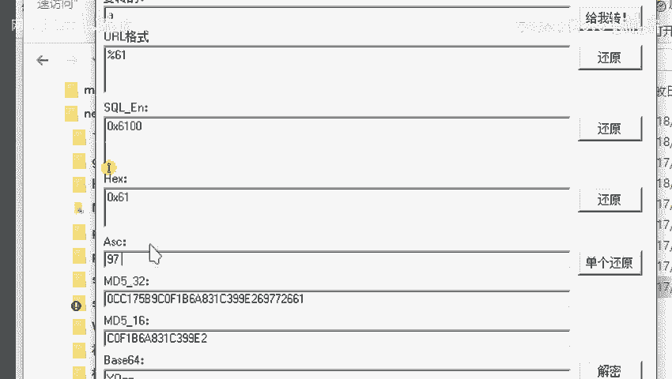

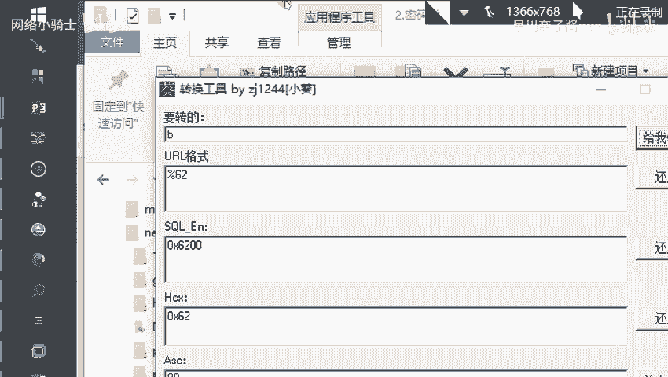

ASCII码是最早的计算机字符编码标准，用于表示英文字母、数字和常见符号。

*   **核心原理**：使用7位二进制数（共128个字符）或扩展的8位二进制数（共256个字符）来表示一个字符。
*   **识别特征**：在解题时，通常遇到的是字符对应的十进制或十六进制数值。
*   **工具与操作**：
    *   **在线工具**：可使用提供的在线编解码网站。
    *   **本地工具**：CTF工具包中的“小葵多功能转换工具”或“密码机器”。
    *   **Python脚本**：可以使用`ord()`函数将字符转为ASCII码，用`chr()`函数将ASCII码转回字符。
        ```python
        # 示例代码
        print(ord('A'))  # 输出: 65
        print(chr(65))   # 输出: 'A'
        ```

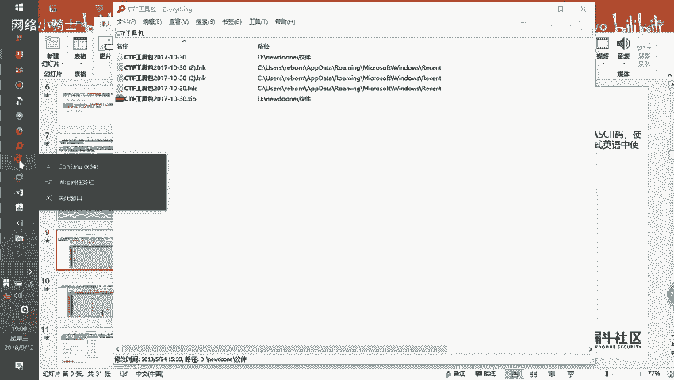

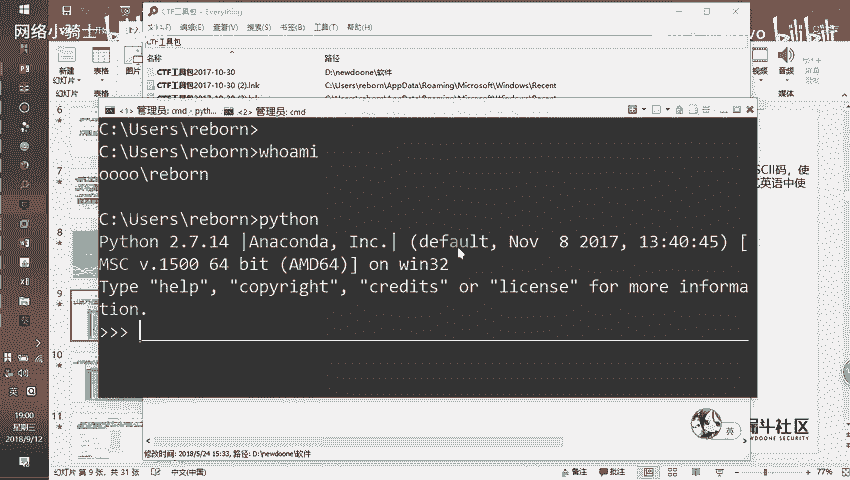

### Base64编码 🔢

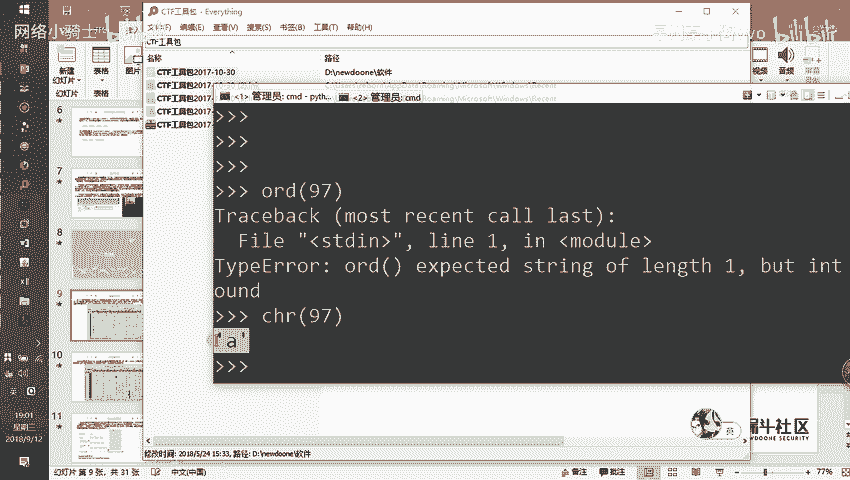

Base64是一种基于64个可打印字符来表示二进制数据的编码方法，常用于在HTTP等文本协议中传输少量二进制数据。

*   **核心原理**：将每3个8位字节（共24位）的数据，重新分组为4个6位字节，然后在每个6位字节前补两个0，形成4个8位字节。如果原始数据字节数不是3的倍数，会用`=`进行填充。
*   **识别特征**：编码后的字符串通常由`A-Z`、`a-z`、`0-9`、`+`、`/`组成，末尾常带有1或2个`=`。
*   **工具与操作**：
    *   使用浏览器的开发者工具（F12）中的控制台，内置了`atob()`（解码）和`btoa()`（编码）函数。
    *   使用“小葵工具”或“密码机器”进行编解码。
    *   **注意**：如果解码失败，可以尝试在字符串末尾补上`=`再试。

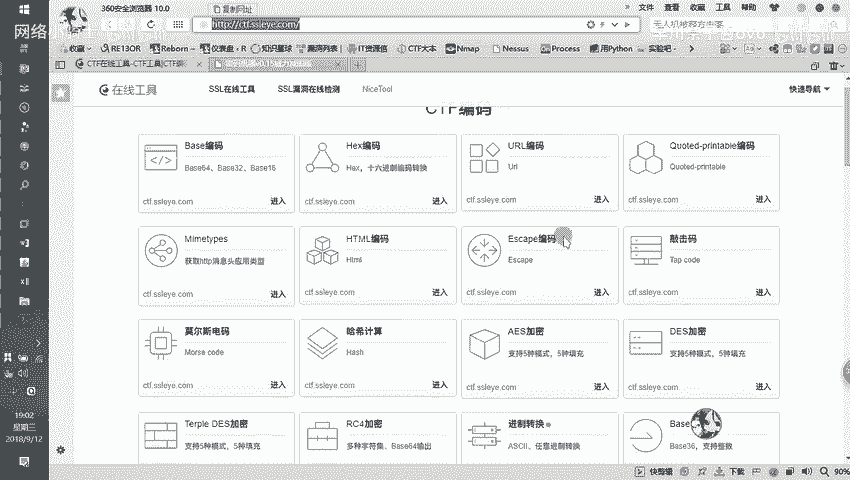

### URL编码 🔗

URL编码（百分号编码）主要用于将URL中的非安全字符（如空格、中文）转换为`%`后跟两位十六进制数的形式。

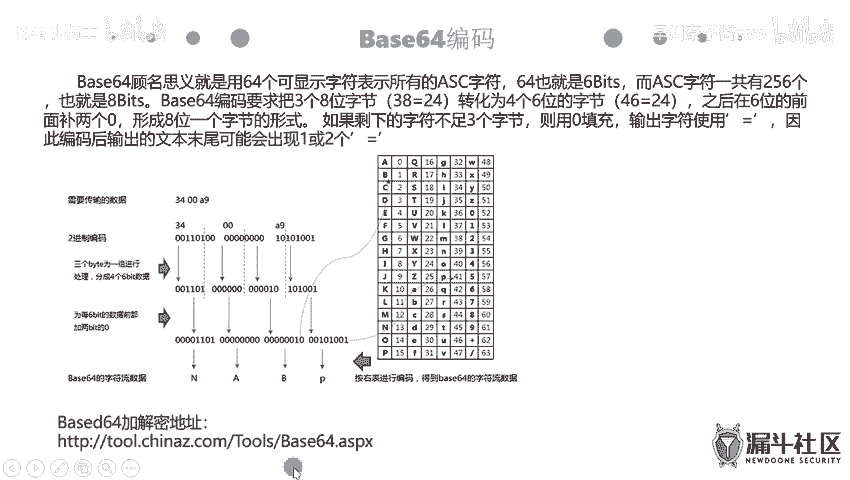

*   **核心原理**：先将字符转换为其ASCII码的十六进制形式，然后在前面加上百分号`%`。
*   **识别特征**：字符串中包含大量`%XX`（XX为十六进制数）的片段。
*   **工具与操作**：
    *   浏览器地址栏会自动进行URL编解码。
    *   使用“小葵工具”或浏览器开发者工具中的“编码/解码”功能。
    *   在线编解码网站也提供此功能。

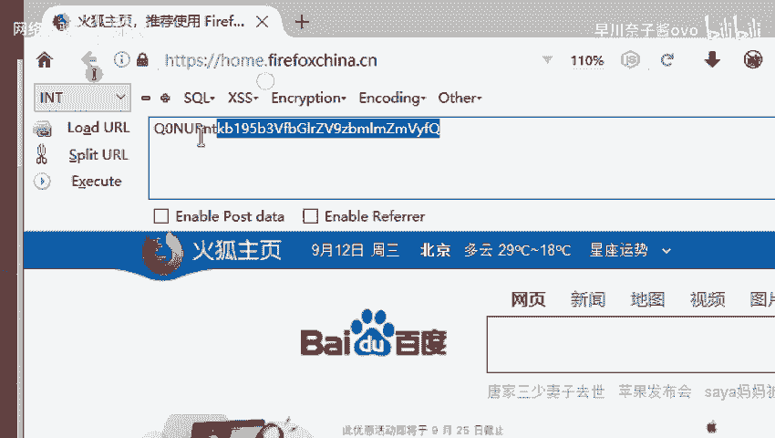

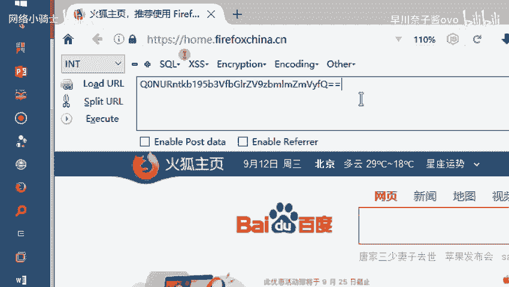

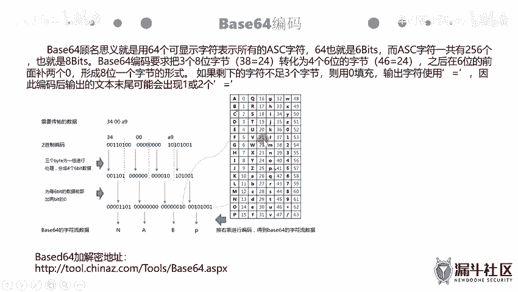

### Unicode编码 🌐

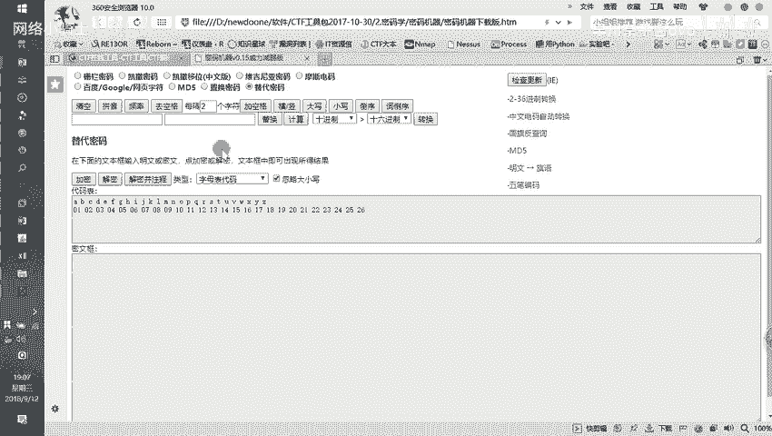

Unicode编码旨在为全世界所有字符提供一个统一的编码方案，它兼容ASCII码，但能表示更多字符。

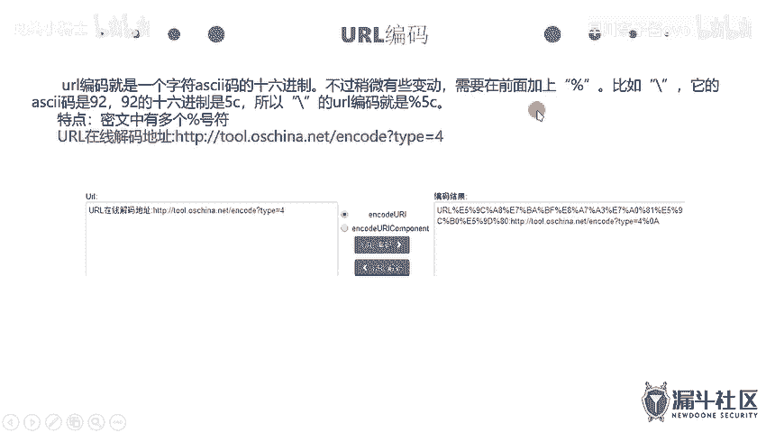

*   **核心原理**：通常使用两个字节（16位）表示一个字符，范围远大于ASCII。
*   **识别特征**：编码形式通常为`\uXXXX`（X为十六进制数），例如`\u4f60\u597d`表示“你好”。
*   **工具与操作**：
    *   使用“小葵工具”可以直接进行Unicode编解码。
    *   在线编解码网站也支持此功能。

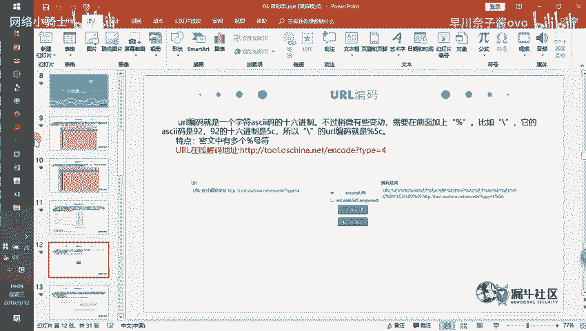

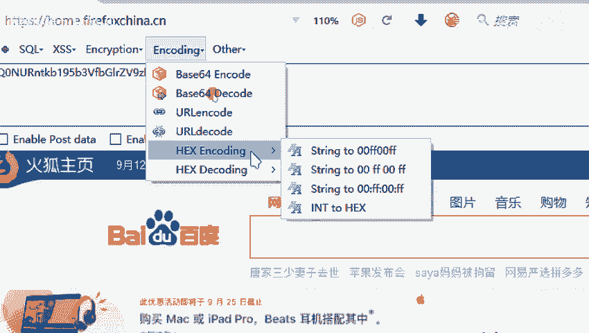

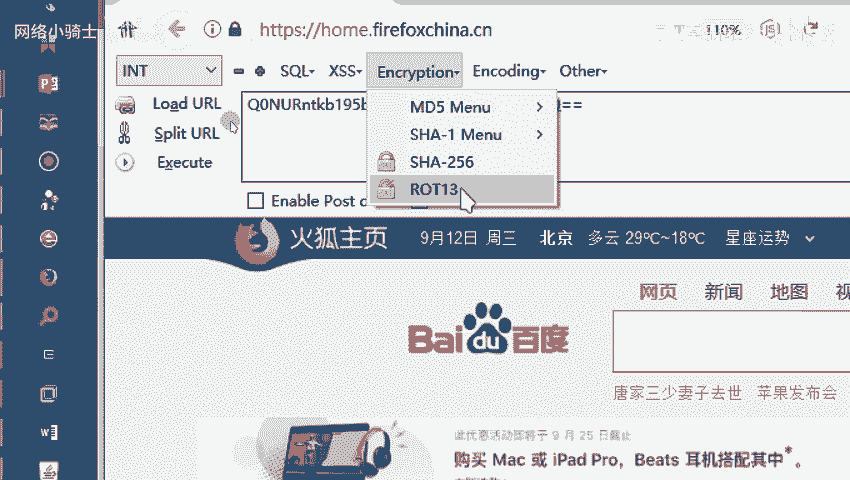

### JavaScript混淆/编码 🛡️

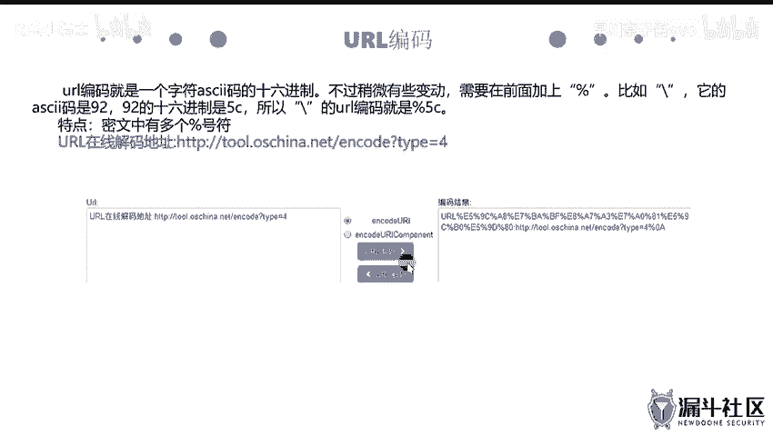

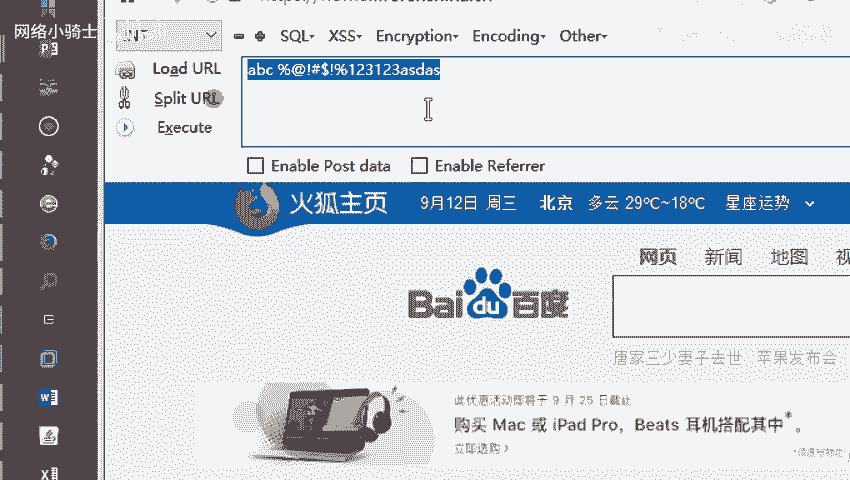

在Web类CTF题目中，常会遇到经过混淆的JavaScript代码，这是一种常见的编码或保护手段。

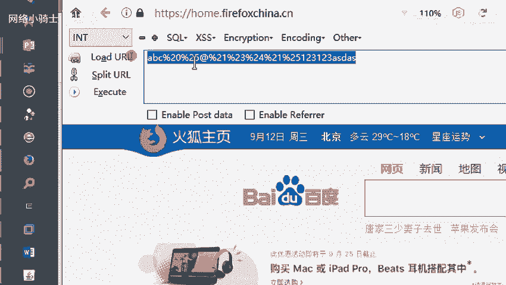

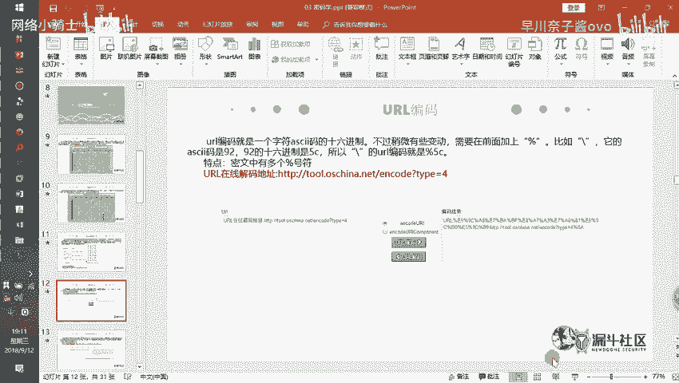

*   **常见形式**：
    1.  **十六进制编码**：将字符串中的每个字符转换为`\xXX`的形式。
    2.  **Unicode编码**：如上所述，转换为`\uXXXX`形式。
*   **识别与解密**：
    *   对于简单的十六进制或Unicode混淆，可以直接使用“小葵工具”还原。
    *   更复杂的混淆可能需要动态调试。最直接的方法是**利用浏览器作为JavaScript解析器**。将混淆后的代码复制到浏览器开发者工具的“控制台”(Console)中执行，即可看到输出结果。
    *   示例：在控制台输入`console.log("\x61\x6c\x65\x72\x74\x28\x22\x58\x53\x53\x22\x29")`，它会执行并解码，等效于`alert("XSS")`。

## 总结

本节课中我们一起学习了密码学的基础分类，重点探讨了编码与加密的核心区别。我们详细介绍了五种CTF中极为常见的编码方式：ASCII码、Base64、URL编码、Unicode编码以及JavaScript混淆。

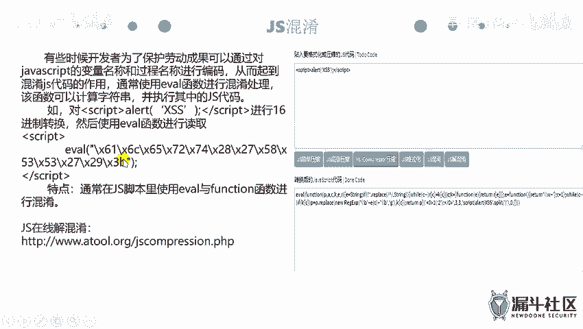

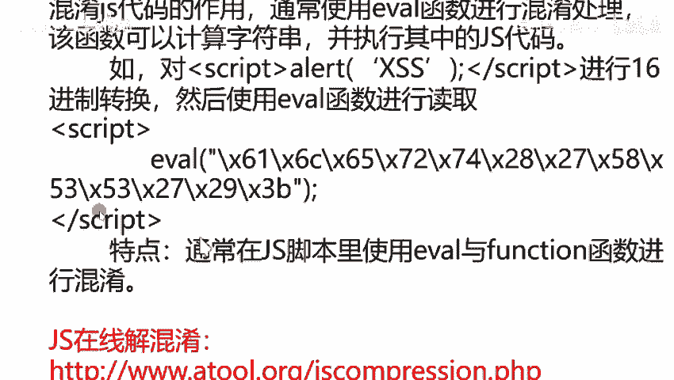

记住解题的关键步骤：
1.  **识别**：根据编码的特征（如`=`、`%XX`、`\uXXXX`、`\xXX`）判断其类型。
2.  **解密**：使用合适的工具（如小葵工具、在线网站、浏览器控制台）或编写简单脚本进行解码。
3.  **验证**：将解码结果放入题目上下文验证是否正确。

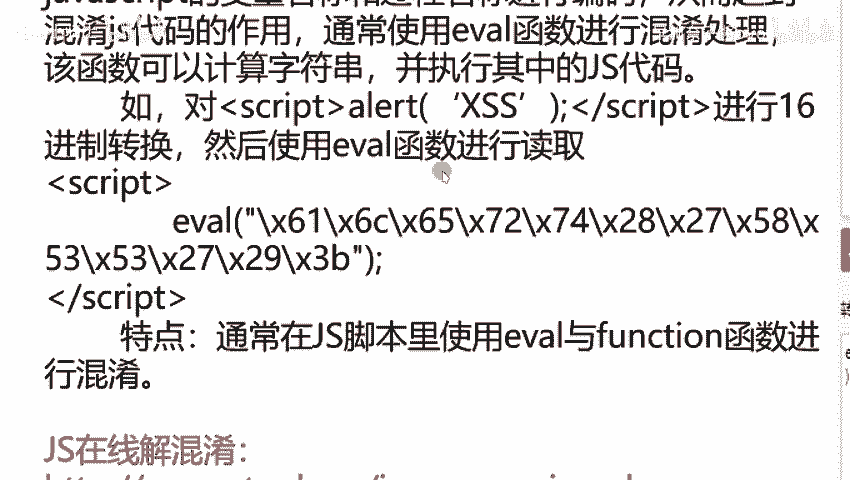

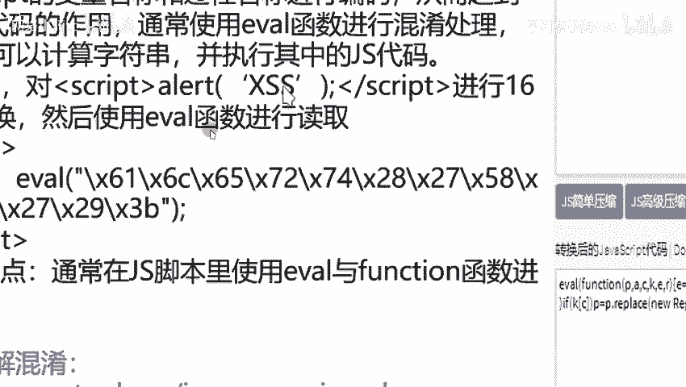

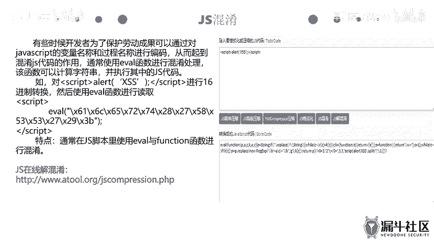

掌握这些基础编码是解开更复杂密码学题目的第一步。下一节课，我们将深入古典密码学，学习如凯撒密码、栅栏密码等经典加密算法的破解方法。