# CTF培训／带字幕版-杂项的基本解题思路上半部分 - P1 - 早川奈子酱ovo - BV1Tw411i7nc

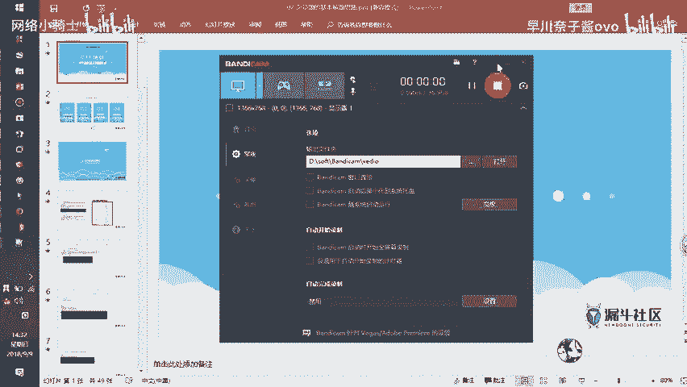

我们下午给大家讲这个杂酱题的一个基本解题思路。那这里面的话也是属于CTF解屏模块的一个题型啊，叫做。这个杂项题目。那我们CTF解题里面，其实它分了五大题型。第一个是web。

也就你们早上看到的这一个这个名单奖的这个web的题型。那第二个是这个杂项，第三个是属于这个密码学。那第四第五，一般我们属于临时培训是培训不来的，就是第一个叫做逆向逆向工程。那最后一个是叫做判。

也就是叫做破解。那也说只有两个，其实上它是属于你短期内是没办法能够培训得来的那能够培训的就是我们前三个部分web。然后杂项还有密码学。那这三个基本的也是我们拿题的拿分数的一个关键点。

因为大部分选手你去参加比赛，大部分人也都不会逆项，也都不会这个判。但我们说没有人不会肯定是有人会的，也有可能肯定是有这个大神在，那我们作为一个入门级的一个培训啊。所以我们的一个原则是什么呢？

我们能拿我们能拿到了分数，能做的题，我们尽量去拿和去做。那我这边讲的是这个杂象体。砸象体的话有一句话是这么说的，叫做。有句话这么说的哦，叫杂项和密码学是不分家的嘛。

那很多时候也提它不是单一的一个考察你单一的一个点。它很多时候都是一个组合的。你们刚刚做了这种小游戏啊，它很多时候考察了就是很简单的一个点。那有些题目它有点难，难到难到什么程度呢？就是说你可能既要砸项。

要引起要量分析，要密码学要，好几个题型它谋杂在一起，你快来去考。比如一道题你可能要过关斩六降，然后最终才能拿到那个fag，所以说难题是这么来的，就是说呃他可能考察的点非常的多。

那这是一个另外一个是说他考这个点，它考的不是说你有没有积累，它考是你一个快速学习的能力。比如说我就是一个最全新的一个知识点。那这个点可能就是可能就是近一两年才提出来的一个知识。那你要在最短的时间内。

因为参加参加比赛的人可能大家都不知道，但你可能要在最短的时间内去把这个东西学会，然后去应用，这种这种是属。难题的第二个。那第三个就是属于那种脑洞非常大的。就是你你想换而子。

然后你也想不到他这个考点到底出在哪里了。那这种题让。实际意义上是并不是很大的。就是说如果你遇到这种题也不用气馁。因为它纯粹有些题就是为了出题而出题的，就是它那个flag之你可能已经得拿到flag。

但你可能因为一个格式的问题啊，你始终提交提交不对，这是有可能的那这种题的话就属于这种劳动题。那我今天讲的这个杂下午讲的这个杂项是属于这种稍微比较简单一点的一种题型啊。那么但是它要杂项，它虽然很简单。

它要杂项杂项意思就是它很庞杂，它庞砸到什么样程度呢？每一种题每种点它可能有好几十种的一个方式。那这里面我们为什么说它简单呢？它简单在于你如果只要能够掌握基本的工具的使用。就可以了，但是它又很难。

为什么呢？因为工具实在太多了，有几十种二十几种工具能明白吗？你可能可能你要用到好几好几种好几十种工具，然后用到各种脚本，这个脚本还不一定是一种语言写的，好几种语言去写的。

所以它简单在于你只要会工具就行了。但它难在于它太多了，它太杂了。那我这里面的话分成四个部分。这个部分。那今天下午的话可能就讲这个一二两个部分，然后我们再找一个时间，我们把三四部分讲完，明白吗？

这四个部分。那这四个部分的话，呃难度上来讲的话，是从一个。简单的到一个难的一个过程。也就越到后面可能它的它它的深深度可能会更高一点，然后前面可能更简单一点。那第一部分叫做文件操作引写啊。

也就是说你们刚刚做的那个看到有很多人做这个国旗嘛，这国旗，然后你们是怎么做的呢？你们把这个国旗这个图片下载下来，然后用一个记事本把它打开。这种属于什么呢？这属于引写，你说引写数。

那他把这个答案或者是我们叫flag或者叫做K我们把这个这串这串值把隐藏在这个图片里面，我们叫做引写数。那么最简单的引写数就是对文件去操作的。我这边说的文件是指通用性的文件就是所有文件。

比如说wordTPDFPPT等等的，就只要是一个文件的，我不具体指它是哪一个文件，我不指它是一张图片，如果说我说图片引写的话，我可能会考虑到它是不是PN它是JP它是不是GRF它是不是动图。

但是如果我说文件的时候，我应该说的是一个通用性的，那么最简单的就是通用性的一个引写。最难的。然后第难点呢，等到第二部分就是我们这一个图片的一个引写。你想图片有多少种。

你们知道的你们知道的这个图片的格式有多少种。BNPJPGPNPPNG然后JPGJJF等等的那各种的图片，它只实际上一张图片的话，它的它的隐藏点是非常的多的。大到可能我一个图片，我可能我把这个图片。

因为头一张标准的图片，它是有头部。然后中间的内容和尾部的，我甚至可以把值藏在头部的某一个地方，我甚至你们如果你们有用这个美图秀息或者是PS的话，你们知道你们处理各种图片的时候，你们是各种渲染啊，对吧？

那各种图片通道啊，那么很多时候这个它这个值也可能去藏在这个图片里面。那么这个属于图片引写数，那再往下呢，这张我图片引写数这边只讲到图片，后面可能还会扩展两个。

第一个是这个NP3NP4就是音频和视频的一个音写。就有时候我会把这个隐藏的值引写到音频里面。那如果是音频的话，我不知道大家有没有是通信工程的。就是有处理这种频谱图的啊啊频率图的啊，就很多时候一个频谱嘛。

它可能就是一串0101嘛。那有时候信息就是就是你可以把一个文件隐藏在这个频谱里面嘛，就属于音频频音频的一个音写或者是视频的音写。那另外一个第三部分是这个压缩文件。

就很多时候因为杂项题它是基本上就会给你一个文件，或者是给你几个文件。所以它不像为我提，可能给你一个地址。那杂项题他就给你一个文件，这个文件要么就是你看不出来它是什么文件，要么就是张图片。

要么就是一个压缩包，那么最常见的就是你拿到一个题目，这个题目下载下来是一个压缩包，那这时候压缩包拿到手了，这时候你有好几种考察方式。比如说它是不是加密的，它是真的加密还是假的加密。

等于说真的加密还假加密，真的加密就是它真的是加密过有密码的，你要去破解密码，假加密是叫做伪加密，它可能修改了这个文件的某一个字段，啊这字段改完之后，它也变成了加密状态，这叫伪加密。那这样往下呢。

它可能会有这压缩包，我这个损坏掉了。我压缩包损坏掉了。那我要去修复我要去修复这个压缩包。那我要知道这个压缩包的格式，我才能去修复它就是压缩文件。第四个是取证技术取证技术。实际上它涉及的东西是更多。

我这边只讲一个一一个已经可以讲很多，就叫流量取证。就网我们不知道有没有学网络的，就是说网络流量，抓到一个包之后，这个网流量包里面实际上是隐藏了很多的这种信息的。包括我们数据通信中，你像所有的数据。

网络端所有数据都是通过流量来走的。所以流量就是代表了所有的数据。所以。分区流量也是一种这个杂项的一个考点。那再深层式一点呢，我这边还PPT上还没有列出来，在深层地，比如说磁盘取证内存取证。能明白吗？

就磁盘内存级别的这种取证。那这里面的话可能因为我们培训时间比较短，那磁盘和内存的我们没有设及。我这边涉及1234这4种。那这四种的话呃，你们听认真的听我讲，应该是能够有所收获的。

然我先看一下这个第一种第一种第一种也就是因为我是从简单到这个困难的来做一个讲解的那一开始这个文件操作与明写。也就是说其实你一开始拿到的是一张图片或者是一张一个传说包，不管是什样子，反正它是一个文件。

那有时候他他就是给你一个文件嘛，让你去下载。有时候他是。有时候他给你了一个文件，但你还不知道他考点是在文件。比如说还是以那道国旗为例啊，因为你们做的比较多嘛，我看你们做的比较多。就是很多人说。

因为他提示说这个flag藏在这个图这个国旗里面，那你们你们实上是因为没有接触到这个题，说你们可能不知道然，他可能是考的是一个图这个文件的一个影响。那我需要把这个文件把它下载下来，下载这然之后。

我去分析这个文件。那么们第一步让我们要去做文件操作。

那我们授权的话，如果你要对一个文件去做一个操作的话，你总要知道你操作的是一个什么样的一个文件。也就是文件类型，你要知道它是图片还是压缩包还是流量包还是word还是excel还是PPT还是PPF，对吧？

那有时候比如说我给你一个文件呢？你们怎么你们你们你们怎么知道它是什么样一个类型的文件。比如说我给你一张图片，你怎么知道它是它就是一张图片呢？你们是怎么去判别的？

就是作为我们我们作为一个一个这个高级动物嘛，作为一个人，对不对？我们怎么知道他是一张图片呢？是不是他告诉我们他的后缀名是点JBG，他后缀名是点PNG对吧？他告诉我后缀名是这个了，所以我我才知道哦。

原来他是一张图片，如果我不告诉你后缀名呢。😡，就是我给你一个文件，我把后续名删掉了，然后给你呢，你还知道这是一张图片吗？你还知道这是一个这个word或者是PST吗？你不知道，你可能不知道。

但有时候我们电脑很我们电脑很比较高级，它会自动识别出来。但是有时候它识别不出来。就是我们第一步就他给你一个文件的，你要去识别这个文件是什么样一个类型，很多时候它是有区变性的那怎么去识别呢。😊。

我们用一个命令，我这边呢说到的命令或者是说到工具啊，其实它都都是叫做工具。只不过命令只是说这个工具它没有图形化界面而已。所以我说它是个命令，它本身它就是一个工具而已，只是这个工具它是命令行的哎。

然上没有写一个图形化界面出来的那这边有第一个命令啊，你们接下来会接触到各种命令和一个工具。那第一个命令是这个叫做fi命令。那这个fi命令是一个linux下的一个命令，能明白吗？我看你们大部分电脑。

我我刚刚还没看到一个人是linux的一个系统，应该大部分都是windows。所以说我刚刚我在群里说嘛，你们第一个要安一个虚拟机嘛，叫Klinux。所以说这是你们的一个linux的一个环境嘛。

那这个f命令就是属于这个inux下的一个文件识别的一个命令。那它使用简单吗？其实很简单，你只要使fi，然后加上这个文件，然后它就可以识别出这个文件的一个嗯个类型。那我先我来看一下啊，我这边的话。

我是没有我我打我不我是不打算用这一个虚拟机的，但是我先给大家看一下虚拟机是长什么样了吧。就是一台K，你们现在我现在确认一下，你们你们有都安上这个虚拟机了，没有是吗？没有是吗？

后面回去要先把这个你们头一件事情是要把这个虚拟机给它安上，不然没有linux环境。你们上可有一半。就我今天讲的一可能工具都用不了，能明白吗？所以说你们回去的话。

第一件事情是把这个Klinux给它呃搭起来拉起来。那这实际上就是一个虚拟机，主要是要安装这个win well。

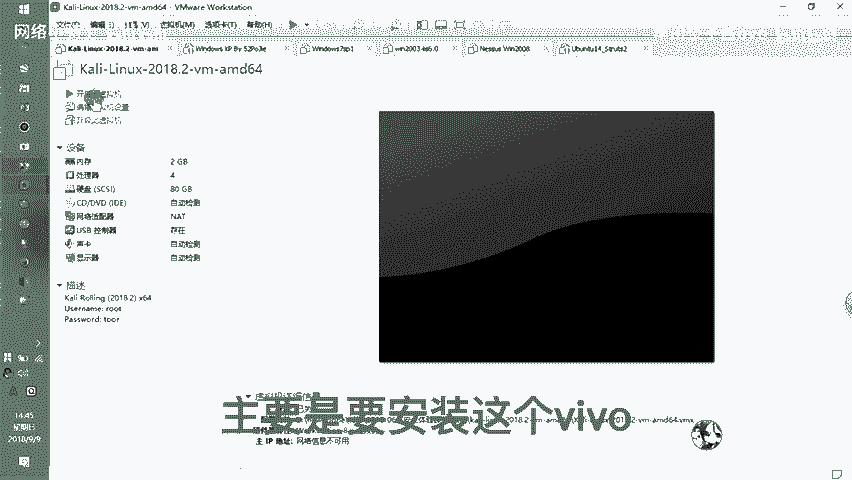

那第一个是把这个打开了，打开完之后，它实上就是一个linux。那我这里面的话，因为我是一个windows10的一个操作系统嘛，所以我安装了一个子系统，就是win10的话，现在是可以安装这个子系统。

所以我在我的win10上安装了一个KDins的一个系的。所以我我自己本我不借助虚拟机的话，我实际上是既有windows环境，也有indowux环境的。然后你们的话如果没有安装子系统的话。

你们就是要借助这一个。

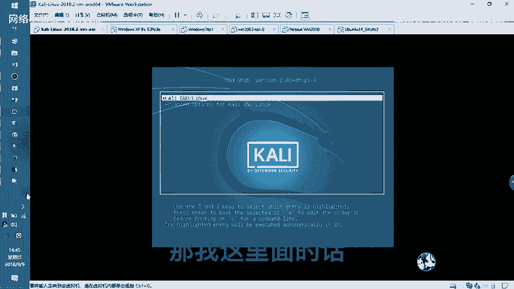

虚拟机。😊，这个虚景机的话，它的用户名是root，然后密码是root倒过来。叫我啊叫我啊。那打开它是一个虚拟机，但是这台虚拟机的话，它是比较有名的一个安全渗透测试的一个虚拟机啊，里面集成的。

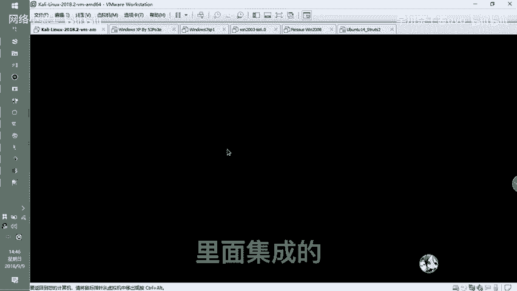

很多工具可正很多几百个吧，就是这里面集成了几百个工具。那我们来看一下这个fi命令。你输来之后，它能如果能体现出来，就专门说它是有这个有这个东西的那我这边的话为了方便我去演示嘛，所以我不使用这个虚拟机。

因为我还要把文件拷到虚拟机里面，然后再来演示嘛，所以会比较麻烦。我这边的话暂时我不用虚拟机。我用的是我仔细统下的liminux环境。那实际上是一样的，也算是命令哈。那我讲的时候，我会告诉你。

我现在用的是我现在用的环境是imux的是windows。

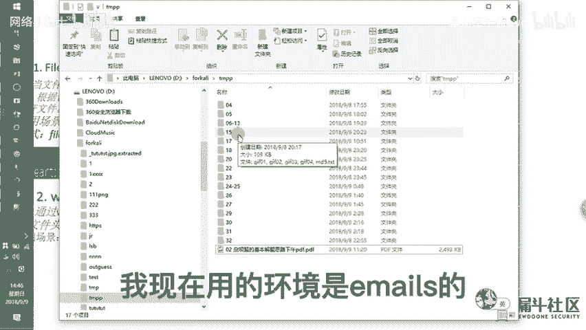

啊，这边的话。

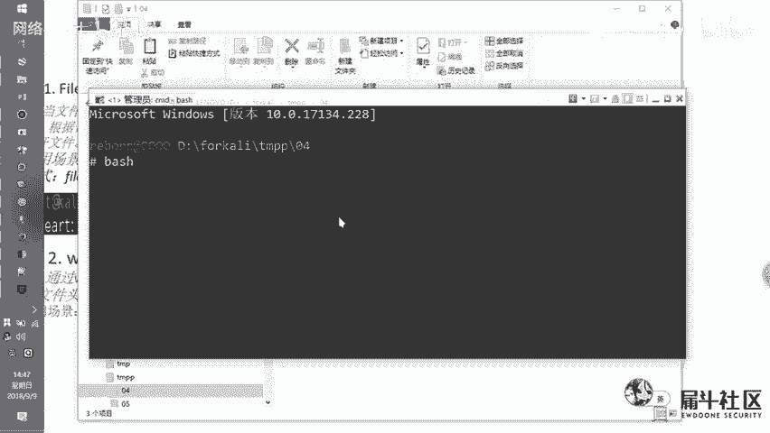

现在的话，我现在这个这个环境啊就是一个呃linux的一个环境。那现在我是一个呃一个linux。

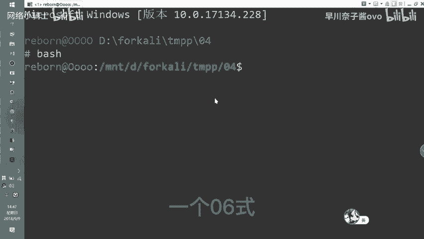

这发了一。那我身际上也是有这个命令的嘛，也是有这个命令嘛。那这里面的话，我在这个文件夹下，我放了三个文件，这三个文件它有一个特点是它都没有这个后缀名，他都没有后缀名。但是我名字已经我已经标出来了。

它是一个什么样的文件。就是呃你们可以看一下我这边呢。但是它这它这边是有三个文件，这三个文件。但是我电脑都没有识别出来它是什么样的文件。能看出来吗？我电脑都没有识别出来他们是什么样的一个文件。先比如说。

这第一个第二个第三个三个文件都没有识别。那虽然说我已经给他命名了，可能第一张好像是这个JPG是因为我为了把它区分开来，我把它命名了。如果我随便改个名字，你们是不是根本就不知道这个是什么文件。

那如果你连这个文件是什么文件都不知道的话，你就连打开它都打开不开了。那接下来可能就没办法去做了。所以第一件事情我们要用这个方R命令去来做做一个识别。🎼比如说我们识别下第一个叫做fi。JPG嘛是吧？😊。

往里挡打完之后回车，他告诉你说这个是一个。什么文件？JPEG的一个图片文件嘛，对吧？JPEG的一个图片的一个镜像文件嘛。也就说这个文件它实际上是一个JPEG。

那其他的呢其他的比如说我们看一下这个间距的这一个。告诉我们这个什么，这是1个PNG嘛。那他一个是叫做什么ZIRP。这我我为了区分开来，我拿命名了，这个是1个ZIP。呃，说错了。F。这个是1个ZIP嘛。

也就是说第一这个文件我们给了有三个文件。当你不知道它是什么样格式的时候，你可以用fi去识别。识别完之后，那它真的是JBG吗？比如说这个图这个文件我给它拷贝一个副本。我来看一下。

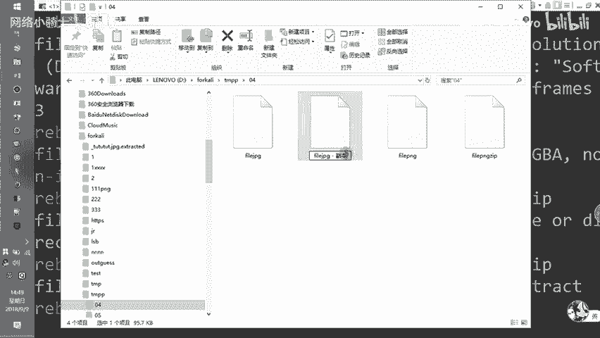

点JPG。能看到吗？这时候这就是一张图片嘛，对吧？这是这时候就是是一张图片嘛。那第二个呢第二个也一样。第三个呢，我我改一下第三个。

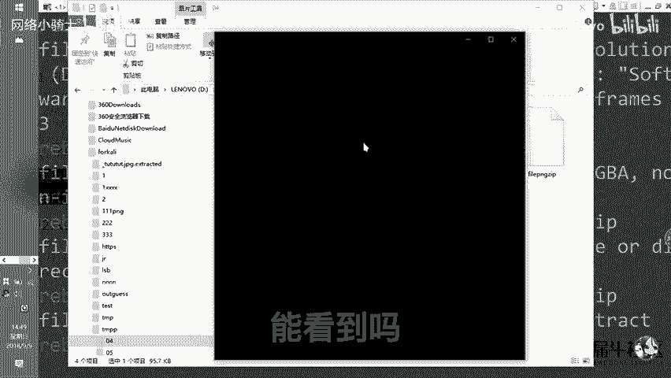

点ZIP。嗯。明白了了吗？这就是一张。他是里面是有一个这个。它里面是有一张图片的，但实际上是一个压缩包嘛。那也就最简单的。如果是对文件处理的话，你我们知道杂样题他会给你一个文件嘛。

如果他给你的一个出出题人想刁难你，他给你一个文件，他不告诉你这是一个什么格式，什么类型的，你要知道怎么去识别它，这是第一个。OK那第二个呢。第二个的话，我们来思考一下这个范这个命ing它是怎么去识。

因为我们作为人类，我们是根据它的后缀名的嘛。那这个f这个me它是怎么去识别它是一个JPG，或者是它是怎么识别，它是偏G，或者是它是怎么识别它是PG呢？你们觉得你们觉得工具它是怎么去识别。

它这个文件是什么类型？嗯。你想啊一个文件这这个说说的很复杂也很复杂，说的不复杂也不复杂。就是每一个文件它实际上都是有一个格式的。不同文件类型的文件，它的格式都是不一样的。那我这边的话。给出了一个图片。

这个图片告诉我们常见的一个文件头的图类型是什么样子。比如说DPE句，它的文件头叫做FF。可有点小，放大一点。比如说这B句他的文件同是。18X然后PNB是89504147，然后接下来5是47494638。

能明白吗？那就是说不同的文件，它的一个文件头部是不一样的。那么我们的工具它是怎么去做的呢？就是如果用一个工具它是怎么去做，它是去解析这个文件头。他去解析这样文件口。然后如果原方检测检测到了说。

我我是案例，我只知道504。名字。我想知道504B0304，我就认为他是一个。我觉到这个。49492A00，那我就认明它是一个这个TR，就是我是根据它这个文件头的一个这个字段。

我去识别出它是什么样的一个文件的。那这时候问题来了，工具他知道工具它能够去查看这个文件头嘛，它它可能是一个程序，我写了一个程序。那如果说。有一天我把这个文件都。破坏掉了，比如我我给你一个压缩包。

但是我把这个文件头给破坏掉了，或者说我给你一个图片，我把文件头给破坏掉，你怎么去你怎么去识别它。这里面的话接下来就是又有几个工具了，又有几个工具。我们第一个叫做we也。head是什么样一个工具呢？

等V害啊。我一。はです。啊。这个单词叫什wehas叫什么呢？知道吗？his是什么？ps是十六进制嘛，十六进制嘛，十六进制也就是说这其实上它是1个十六进制文件的一个编辑器。什么叫十六进制的编辑器啊。

就是正常情况下，我们看一个文件，我们是以十进制去看它的嘛。但你可以看到这个文件用十六进制来表示的时候，因为我们这个文件不管那何数据，它实际上如果在计算机里面，它本质上是0100001嘛。那01001。

你给它变一个格式，比我转成从二进制转成16进制，我就可以用16进制编辑去看它。那这里面的话先给它。介绍一下，首先第一个工具叫做win类。电工具。010。010edit就是010edit。

它也是一个识别定制编辑器。那还有一个。怎么时派始家？还有一个插件，还有一个黑插件。还有一个his插件，这能开压8，下面的有同学我推荐他去安装了，这个弄开压家是一个顶好用的一个记事本。

就是你们他有最好最好用的一个功作人士，他可以去高量代码，然后去帮我们去编辑。包括你们刚刚那个图片嘛，你们就用记事本打开了嘛。我告诉你们，你们用能家打开会更好用一点，就更方便一点。那这边有三个工具。

三工具，第一个是peex，第二个是010ed，第三个是run pad加加。比如说你们电脑要能够有这三个工具，它这工具在工具包里面都有嗯拿它工具包里面都有了。来，我们看一下啊。

如果你们安了这个note派加加的话。你们身上是有一个这个。比如说你拿了一个n加加，你这边的话，比如说你拿一个文件，任何一个文件。

你右键你实际上是可以看到它有一个edit withnotote pad加加的这么一个选项。也就是说你可以直接用右键去打开，用note pad加加去打开这个图片。

就相当于说比如说我右键我就可以点这个压缩文件了。或者是我右键就可以去做其他的一个操作了。那么我们来用n pad加加来打开看一下，首先这是一张图片嘛。这是张图片，所以他你要么拍下打开肯定是一算段嘛，😡。

就是你用记事本去打开一个图片，那肯定是乱码。因为它本身不是一个图片编辑器，你用图片编辑看到是一张图片，你用记事本去打开它。肯你是乱搞。那乱码的话，它这边有一个插件啊，有个插件。有个插件。

这个插件里面你们可以去插件管理器去下载一个ps editor。然后你可以去看它的16进制。能看得到吗？我们要听什么？这就是他的一个时间定制。不是说你看到这些字，你都你都已经眼都快花了嘛。

但是我们只要看哪一部分呢？我们主要看最开头的这一部分FE。就是这一段，我说的是文件头部嘛，FE06F5AA。然后我们根据这个头部，我们去确认这个文件是什么样的一个类型。

我们现在看到是啊先记录一下这个这个这个东西。那我们来看一下。这个和哪个很像呢？FE。呃，没有啊。好了。没有。😊，答是没有吗？我换一个编辑器打开吧。这就比较尴尬了，我们换一个换一个这个。啊，020艾DT。

哎，这个就不一样了这个就不一样了。我再试一遍，再再来试一遍这个呃龙头派加佳啊。能来压这个十六进制编辑器哦，原来刚刚不是第一行，刚刚不是第一行啊。刚不在D行，还是这个FFD8FF1哦。嗯，把它截一下。

我有个我有一个好用的截图软件，我说把它定到桌面上来。我们来看一下是不是这个FFD8FF1。这回总总该有吧，好像是第一个吧。没错吧。没错吧，就是这个FFD8FF1嘛，没错嘛，那就说如果说我们不用工具的话。

我们怎么去识别它是？类型我们可以用16进制编辑去去编辑它。那刚刚我用的是这个ner派ner派加加去编辑的那其实最好用的是两款，就前面这两款win哪里面那我个人是强烈推荐你们用010年底，因为V的话。

它过一段时间就过期了。

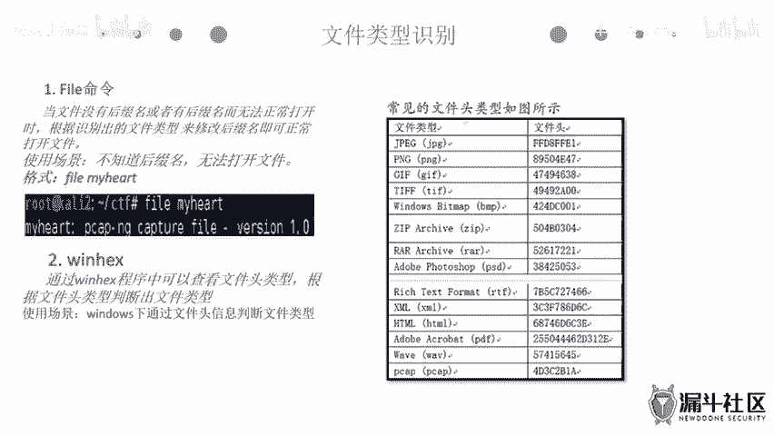

所以如果考给大家粉丝的破解版，它可能过一段时间就过期了。所以提议大家用01里面地头，因为它破解一次就不用不用再破解了。那我刚刚打开用这个黑黑的这个东西啊，黑黑的这个东西。

那实际上它也是一个这个十六进制编辑器。那他这个文文件的一个格式是怎么样子的呢？就是。你可以从这边中间这个部分，中间这个部分就是16进制，然后这个地方是地址。

比如说我0000H00000000H0001H0002H这样子到这个FF就它有16位0到F是有16位的，这是16进制的。那这边这里还有一栏啊，这里还有一栏是什么呢？

中间这一栏这一栏你是像这边字符你是看得懂的，就是左边左边中间这个字符你是看不懂，因为它是16进制，右边这个字符你是看得懂的。因为它是阿克玛组成的一个用它是用阿克码然后变成这个字符的。

就以这里面的这些字符，如果能够转成如果能够转成你可识别的可打印的字符，它就可以可以识别出来。比如说56789啊，然CDEF符句啊，就这是可打印的。它有些阿克玛字符，它是不可打印的，不可打印，你看到了。

就是比如说是一些乱码或者是点点点点点，就你就属于一些不可打印字符。那我我们来看一下这边的话文件。一个明显最简单的第一种就是它的一个line。不知道怎么谈到这一点，就说有可能。

有可能我在一开始这边中间这一串子是flag，或者是我把这个拉到最下面。他可能藏在最后面。最后面有一串这个flag值，就可能谈到最后面，这是最基本的一个文件引写的一个方式。就是我就把这个值写在这个地方。

能明白吗？

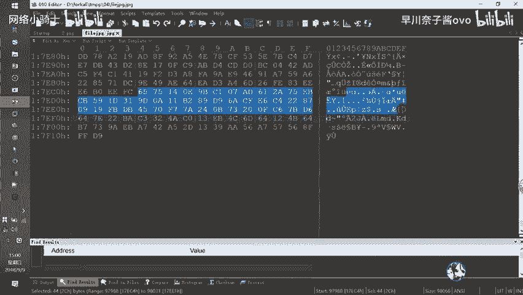

ok。那这里面哈这里面如果是这种做了很多题的，这种的，因他做了N道N道反样题。根对这几个常见的。你的前提啊。前几个常见的一个文件格式，它算是很敏感的。就是比如我看到504B0304。

我就隐约隐约的感觉到这可能就是一个压缩包，明白白？我看到这个呃89504147这就是一串这种值，它很像十六进制的。那我就隐约会感觉到这可能是一个文件，能明白吗？O。😊，🤧那。伴随着这种考点的话。

我们进一步去进一步去加深他，就是说他可能。给一个文件，然后他文件头。被破坏掉了，或者是缺失了。就以我们刚刚说了，我们怎么去识别一个文件呢，或者是计算机怎么去识别一个文件呢？是因为它有一个文件头。

但是如果说我我是一个初级的啊，我是一个初级的，我故意就把这个文件头给它去掉了。我故意把文件头去掉之后，你用文字，你你就识别不出来它是一个什么文件的，这种就是属于文件头缺失或者是文件头错误的一个考点。

那这个时候我们怎么办呢？我们要去做一个修复。因为你既然缺失的，或者是出错了，我就要给你补上去，或者是我做一个修复。那。首先这个定情那这个文件它有什么特别呢？就是？你还用刚才的这个范尔命令去查看的时候。

你查看不到数据了。就是你查看不说它它是一个什么样的一个文件类型的。就我们刚刚说的命令是可以帮我们去查看它的文件类型的。现在我把文件头部去掉了，已经查看不了，查看不了它会显示什么呢？

它会显示这是一个data文件。就是他会告诉你这是一个data文件，你查看他他会告诉这就是一串数据，他他也不知道他这是一个什么图片。那一般如果这种题的话，他可能在这个文件。

比如说他会告诉你他这是一个step点片NG，但是你死活打不开，他会告诉你文件出错了。然后你用fi去识别，看到了是data。那个时候我们要去做一个修复，做个修复。那怎么去修复呢？就是用我们的边辑去做修复。

we have有说是1一个it怎么去修复呢？还是一样的。如果你们安完的这个010edit，它会自动注册到这个右键菜单啊。所以我们可以用010edit去打开一个文件。那这边它是1个16进制编辑器。

说白了你就是可以直接去对16进制去做一个操作。比如说我想在这里面我想在这个位置插入一算数据，比如说我插插入000102，它是可以的，能明白吗？那如果说它缺是用这个文件头，你就可以在。

比如说它这个FFD8FFF11它缺失了那可能就没办法识别了。你就要在这里面去补充上。去补充上这一段正确的一个文件头，能明白吗？这是属于文件头缺失的一个考点。那这边编辑的话，其实上很很简单啊。

就是跟你记事本编辑一样，只不过你这时候编辑的是其实进制而已。这是第一个。叫做文件头的一个残缺或错误。那前面这一块都属于文件类型识别了，也就最基本的。因为答项题考的就是文件的一个类文件的一个类型。

那第二个就是我给你一个文件之后，你已经识别出来它是一个什么样的一个文件。就你已经知道它是一个压缩包了，或者说你已经知道它是一个。这个图片呢那这个时候。你知道引血是什么意思吗？就是隐藏的嘛隐藏的嘛。

那一张图片的话，它可能包含多少的信息呢？你们有没有听说过这个图片种子？普遍种子。就是一个图片，一个我们用这个迅雷去下载的时候，它下载它是提供这种种子的。普变种子的话，就是你看你下载一张图片下一下。

它可能就是几百KB这样子。那其实它蕴藏的信息可能有一两个句。能明白下这个概念吗？这到这做图片种子。那么正常的一个引写就是你看到了可能是一张图片。他可能是好几张图片拼成一张图片的。明么？

就是图片他题目给你的是给你一张图片，实际上它可能有好几张图片，甚至你不止是图片，它可能一张图片里面还有压缩包，还有TSD还有PPF还有其他文件。那这种是这种是怎么去做的呢？

重种是出题人把这个文件把它合成和融合成一张图片呢，把很多文件融合成一张图片的。那我们要去解这种题的话，我们就是要自己涉及到就是文件分离的。既然你是把它合并的，那我就要去做一个分离。那分离的话。

这边还是工具哦还是工具。所以你们现在会看到听过一直讲各种工具怎么样怎么样怎么样。这里面的话还是这个limux下limmailux下的一命令了，lim下一名叫做binwork。第一个第一个要冰墨。

那Bwork它是一个lin用下一个它可以去，比如你拿到一个文件之后，你经识别出来它是一个什么格式了。但是你发现这个图片什么信息都没有，你根本就不知道这个信息隐藏了什么东西。

那我告诉你可能它可能隐藏了其他的一个文件信息。那这个时候我们要去识别到底这个文件是不是真的隐藏。所以我们要用工具去识别它。那这边的话我们可以用这个binwork这个工具。

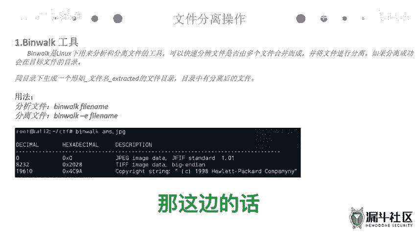

这个工具的话，它的用法有两个，第一个是直接加。那么他会告诉你这个文件，它可能隐藏着哪些信息。你比如说我这个binwork，然后加上一个图片，他告诉我这我这个文件。

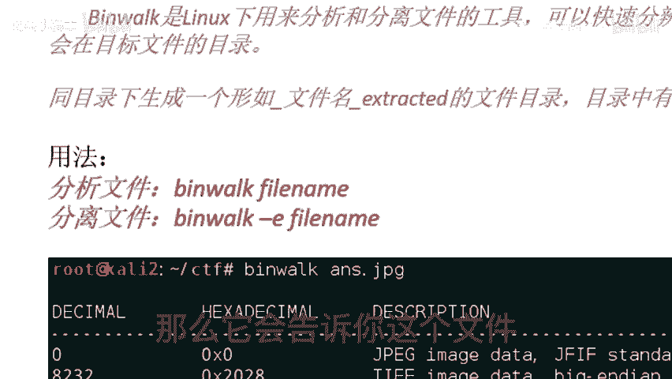

Yeah。吧，我还有。ERX的一个数据，比如说我这个文件。可能在。这个地方是就从零到这个地方，可能是一张JP句，从这个地方开始到结尾，可能是一个什么，可能是另外一个文件。

也就是我这个文件可能是嗯两个文件。

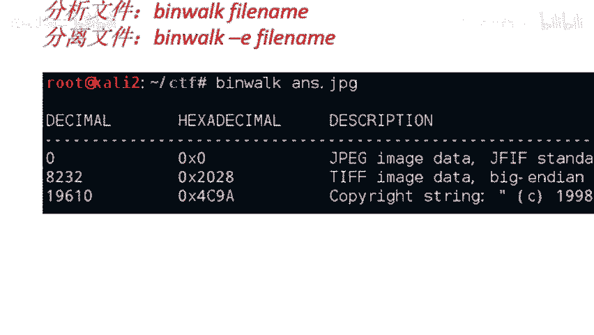

那么这时候我们想用工具去自动化的帮我们去做一个文件的一个剥离。就是我们帮我们做一个文件的分离。但我们可以用一个参数，就是降义这个参数。我们插上一个杠E，然后我们把这个文件做一个玻离。

我们可以来做一个看一下演示啊。我这边的话对每张PPT我多有一个例子，看，这个是第六章的。第六章6到10。比如说我这边是一张图片嘛，这是一张图片嘛，然后题目可能就给你一张。图片。你们就给一张图片。

那这张图片的话。

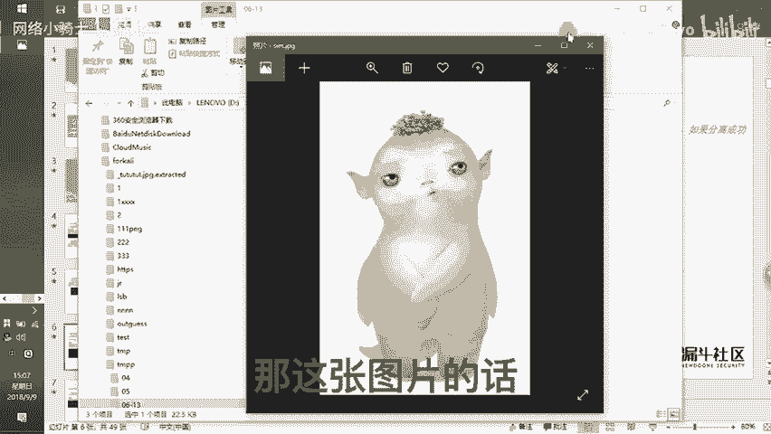

它有什么信息吗？你看不出来它有什么样的一个信息了。那这时候我们怎么办呢？你可以去看一下这张图片到底是不是有隐藏的其他的图片。所以我们可以怎么做？我们看一下，我们可以用命令行的一个形式。来正常情况下。

你们要把这个文件复制到linux下，然后再用命令行去识别它嘛。那我这边因为我是有子系统的。

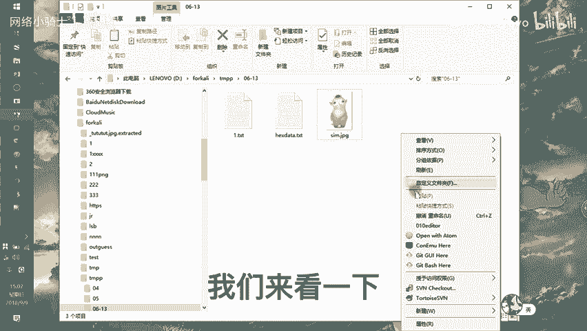

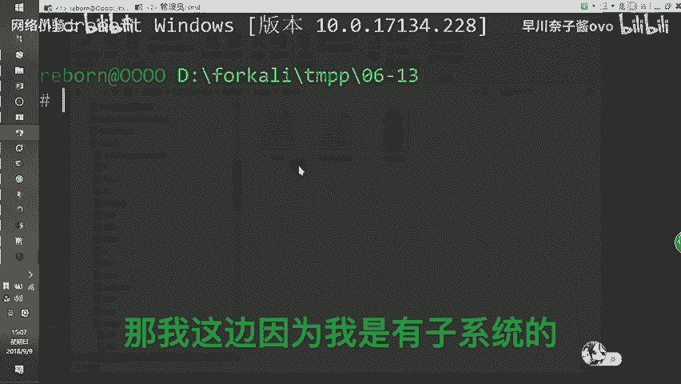

对以。CD。没有。我这张文件叫做sam点GBG嘛，对吧？sim点GBG然后我现在。work去识别一下我这个性点PJPG到底有没有包含着其他的文件？所以我用bework。In work。

然后是信点APPG。没错。回车完装。他告诉我他告诉我什么呢？告诉我从0叉0开始，0差0就是16进制的。然后0差0开始到0叉596F往上，它是1个JP句。但是从0叉596F开始往后面，它是一个什么？

能看得懂吗？它是1个ZIP嘛，对吧？他告诉我这是个ZIP嘛，也就是说我这个图片实上它里面包含了1个ZIP嘛，能明白吗？那我现在想把它，我想把它分离出来嘛，我怎么做？我们加一个杠一参数嘛。

加一个杠一参数车。当一杠一插入回车之后，它会去自动生成一个文件夹，它把分析完的，它把这个inwork这个程序自己分析完的文件，把它装到这个文件夹下。我们现在看一下当前目录，当前目录多了一个文件夹。

叫做下划线杠性点文件点多了一个这么一个文件夹。我们来看一下这个文件。这里面多了一个文件夹，有没有看到，然后我们把它打开，你发现当了。那实际上是里面是一个压缩包了，但是你这边发现他多了一个是吗？😡。

多了一个P点。能看到就是binwork的一个特点，就是binwork他去帮我们去做文件玻璃的时候，如果他遇到压缩包了，他会帮我们去做一个解析，他帮我们做一个解压。

那实际上我们刚刚看到这张图片实际上是一个压缩包嘛，ZIP嘛这个ZIP我们把它挤压到单前文件。里面也是1个K点TST。那为什么我在前面还看到1个T点TST呢？我可说了嘛。

bwork它的一个特点是它遇到压缩包会帮我们自动解压，能明白吗？😡，那这个T点TSD是什么呢？就是我们的fag。有是道题，如果是。简单的一个。文件分离的。

就是说我们可以用工具先识别看看它有没有其他的文件。然后我们直接把它剥离出来。当然了，很多时候并不是那么容易的，就是事情并不是那么容易的。你以为宾work就可以做A回型。

不可能的那接下来就是我要讲各种各样的工具包括方法。有时候工具是没办法帮我们去做这件事情的。就是工具没办法准确的帮我们把两个文件把它分离出来。或者说有时候因为他出题人他动了一点小心事。

那第一次考试可能是说哎我们用我们用大家用宾work就可以做。第二次他出题的时候，发现大家都会宾work，然后他就动了点小心事，我让宾work做不出来，然后他可能其他工西就可以做，然后可能过第三场之后。

他又出了一个，我让工具都做不出来，你只有手动手动分分离才能做出来。就题目是越来越难的。啊，就是每一届比赛的时候会发现题目可能越来远，为什么呢？因为方法大家都会的，所以他觉得没什么意思的。

就考验大家不会的这是出题人的一个心理。😊。

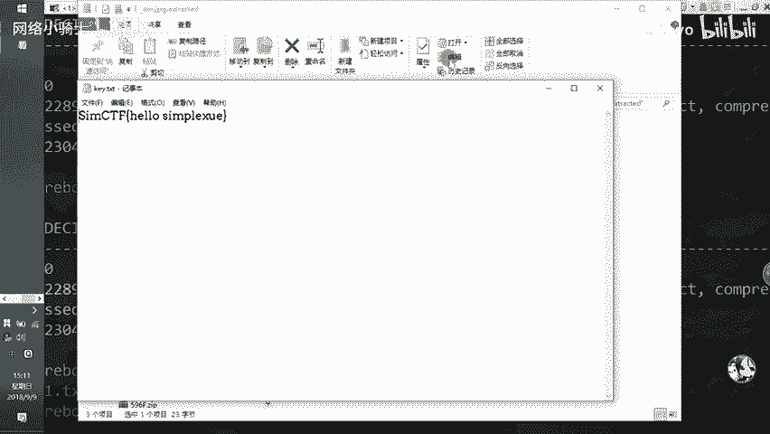

好，我们来看一下啊。这个是我介绍的第一个命令，你第一个文件分离的一个命令。那是不是很简单，我们去查看它是不是有其他的文件，然后去分离它。

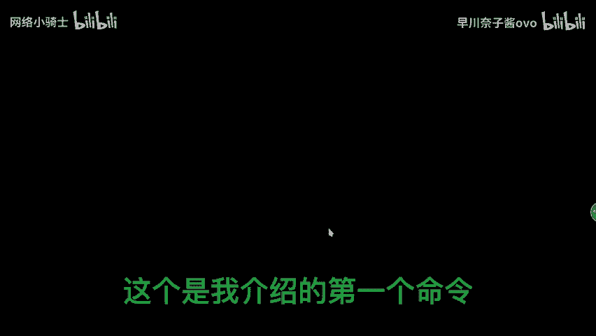

第二个呢第二个叫做啊。那它的用法其实和冰work也差不了多少。那为什么还有还要有它呢？既然它和biwork差不了多少，为什么还有它？就是有时候你用binwork就是分离不出来。那你可以尝试一下。

用一下formmost，对吧？你的材用用formmost。那这时候你也用bwork已经识别出来了，它还有其他文件，就是bwork你发现用杠E是就是没办法啊分离的那你怎么办呢？

你可以用formmostmost也是命令行的那我们只要知道只要知道这我提到命令行，你只要你只要知道这个命令行要怎么用就行了。你只要知道我如果要用这个工具，我要去哪里去查这个工具怎么用就行了。

那这个时候这工具怎么用呢？它很简单，就是formmost加一个文件名，然后我们把分离的文件输出到一个文件夹，也就是用杠O。让O这个参数把它输出到一个目录项，那O就是outt曼，把它输出到一个目录项。

怎么用呢？我来演示一下。还是这个还是这个图片啊，那我现在把这个。这个是用刚刚用冰work分离出来的，我把它删掉。还是这张图片，然后这个时候我用的是。我不想用binwork。

因为我刚刚发现了binwork已经这个是个fi出来了。那我现在想用这个formost。Formost。然后我要加上这个图片，然后我加上一个杠O参数，那后面是一个我要输出的一个文件夹。

这个文件夹你可以随便命名，比如说用123，那它就会生成一个名字叫做123的一个文件夹。比如说。啊，所以说我们来看一下当前目录有一个文文件夹叫123。你可以看到。这边多了一个文件夹叫123。

这个文件夹formmost是一个比较重规重矩的一个一个分离软件啊，它不像这个bwork宾work看到压缩包，它会帮你解压。但是formost不会，它会帮你分类，它会告诉你哪个文件夹是JPG。

哪个文件夹是JRP，它把它分类分的好好的，甚至它分离完之后还给你写了个日志，在这里面，这个是一个日志文件，那这边是一个JPG，就是原来的几张图片。这边是ZIRP。

就是我们它分离出来了1个ZIP的一个压缩包。然后你把它解压之后。你看到这里面得到1个P点PST，然后这里面就是这个flag，这是第二种方式。就当你这个bework没办法工作的时候。

你用的是这个formost。O。😊，那第三个第三个第三个叫做TB。那个BD。然后一起一一开始讲这个三个一下子来了三个这个文件分离，我不知道你们吃不吃得消啊，反正我是有点吃不消啊，不是一下子有3个嘛。

滴滴它是上它也是一个命令行工具了，这个命令行工具它是属于最难用的一个工具。它特别难用，但他也特别。为什么还要这个工具呢？你知道越复杂的工具就是专门解决这种越难的题目的。能明白吗？

越复杂的工具操作越复杂的工具，它就是要解决这种越难的题目的。什么意思呢？当你前面的自动分离已经分离不出来了。像滴D这个工具，它是属于一个半自动化的一个工具。它没有像前面那两个工具那么容易。

就是说我直接加图片，我就把它分离出来了。这个时候可能我不知道还有的人有做过一些答案题啊，比如说有一道题叫苍蝇。不知道有没有那个同学做过苍蝇。然后这个苍蝇它实际上是一个流量包，然后流量包里面有个压缩包。

但是它这个压缩包太大了，它分片，它分了好多片，然后有很多的这种碎片，然后你但是这个碎片又不是完整的，不是简单合并就行了，是它每每一个分片前面都有一个答单的数据嘛，你要把这个脏的数据拿掉。

然后再把它合并合并成一个程序，然后点开这个程序有跳出很多这种苍蝇是吧？呃，你们后面可能会做到这么一道题哦。那什么意思呢？就是说。简单讲一下，比如说我有很多文文件。我有很多的这个文件。

比如说我文件一文件2，当然不一定很多文件就一个文件也行。那我们刚刚的一个，因为这是文件嘛，对吧？这1个A233个文件。那如果说是。呃，我们前面讲了做文件分离的话，很简单，就是可能前半部分是1个JPG嘛。

对吧后半部分可能是一个什么ZIRP。就是这种这种题目就很单纯嘛，你前面就是一个呃图片，后面就是一个压缩包。让我看到的是一张图片，然后我直接工去把它分离出来，这种题目太单纯了。他不单纯的提供。就这。

我是我还是还是一个文件，是由两个东西组成的，还是由JPG和CIP组成的。但是我做图片，我没有那么单纯的就把它融合在一起的。我拿这个JPG的第一半，拿这个JPG的一半，也说123。是吗？

我把这个一把它放到这里这个地位置啊，然后把三放到这个位置来，然后把二放到这个位置，把四放到这个位置。这个时候就很变态了？你会觉得他把一个文件这么变态的把。现在就。

那这个时候你用work用form是没办法把它分离出来，为什么呢？因为这个一它本身就不是一个JPG嘛，它只是JPG的一半，能明白吧？这只是JPG的一半。然后三呢也不是JIP嘛，它只是JIP的一半。

所以你用work for的时候，它这时候就没办法完整的把这个文件分离出来。他也不知道，因为一个文件一个文件，它正常的情况下是从文件头开始到文件回就要完完整整的嘛。你现在不完整了嘛，中间给我插一段进来了。

所以这个时候你用前面两个同学是没办法做的，你要用滴D去做。那滴滴是怎么去做的呢？我们先先不直接对文件做操作，因为直接用文件操作，这样讲起来太复杂。我们先用先讲一个小例子。

就大家这个例子可能大家都能够听懂的一个小例子。呃，先假设一下啊。先假设一下，我有一个文件啊，1点PSP。然后这个文件呢里面的内容是123457890。や制。就这样子，然后现来用用我要去完成即象任务吧。

我完成即象任务。比如说。呃，这个我想把前面五个字符去掉，然后把后面的后面的文件。变成一个新的文件。我想把比如说我把想我想把12345去掉，然后把789后面开始到最后面，我把它变成另外一个文件。

我怎么做呢？就是用这个命令。EDifTST if是什么意思呢？先介绍下参数，因为这个工具确实有点复杂，它参数太多了，然后。if是原文件嘛，我现在原文件是谁1点TST。

所以我这里面是1点TSToff是什么？😡，of是我要输出了这个文件，比如我要保存成2点PSP所以of是输出文件名。然后接下来BS是什么意思呢？BS是快大小，就是我要。😡，读多少块。

我要读这个文件的多少块。比如说我刚刚说的12345嘛，所以它的块是多少是5嘛，然后呢，com是多少？是一块，一个5嘛，一个5就是我居说是一个5嘛。也就是说那这明讲起来。😡，大家听起来可能有点累哦。

就是我要把这一块这块的长度是5嘛，所以它数量是一嘛，能明白吗？然后它的长度是5嘛。然后我想把它把这一块变成什么？2。TST能看到吗？也就是说我想用这个工具把前面5块去掉，然后把后面的变成1个2点TST。

那命令就是这么样的。😡，你看一下这个工具确实有点复杂啊，这工具命明就这么样的。那其中。哦，不对哦，做错了，我只要前面这5块啊，只要前面这5块把它保存成123445。那接下来。如果说我想要前面10块。

那我是不是把这个com加一个一就行了，因为一个块是5嘛，所以加一个一是10嘛，所以最终保存的是10个嘛。那接下来。比如说我不想第一块，我不想不想要第一块，我只想要后面这一串。所以呢我countt是三嘛。

然后呢我跳过一块，跳过第一块skipsip是什么意思呢？从输出文件开始跳过多少个block块之后开始复制。那这边我先来演示一下啊，因为可能大家直接看这个例子也不是很直观。这个是第八张PPT。

我这边有1个1点TST，这个1点TST里面是123456789。电视剧吧。

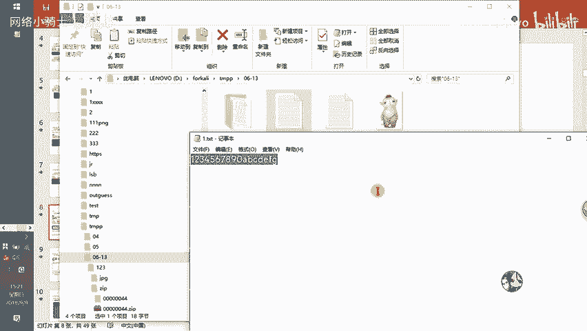

拍照。那我们现在的话就是。

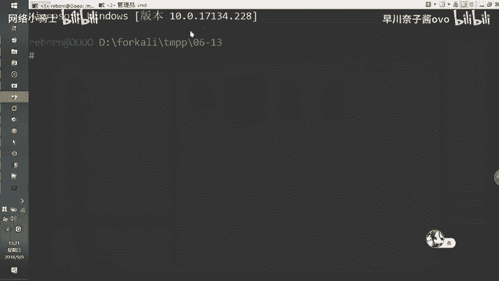

你们现在看一下这个1点TST。这个1点TST是这个值吗？我先要取它前五前五个字块嘛，前五个字块，所以我要用滴滴命令去分离滴滴，然后EF。是原文件of是什么？是输出文件嘛，把它保存成2点TST。

然后我要多少块嘛，我要取前面5个字符，所以快等于5，然后取多少块呢？一块。等于一。然火车那我们来看一下2点TST。是不是12345？那如果说我要取1234567890呢，是10个。

所以我这时候就是2块嘛，然后比如把它保存成这个。3点TST嘛。off3点。TST。对吧昂回车，那我们来看一下这个3点TST。嗯。看保存什么？刚刚保存错了，保存成这个文件了。就是我刚刚保存错了。

忘了把它删掉了。🎼这个是2点TST3。PSST就是1234567890嘛，对吧？那如果说。你再看一下1点TST，我只想要我要要跳过前5块。不键记住啊，这个这个是最关键的，这个是我们去分离文件。最关键的。

就是我想要去跳过前5块，然后我复制后面的。布制后面的那我怎么去做呢？同样的是滴滴不要保存保存成。if等于1点TSP。off等于比如说4点TST。然后接下来很关键就是。我怎么去设定跨account。

还有skeep。那我现在这个例子很简单，我只要跳过前5块就行了，跳过前1个BS嘛。比如说我BS还是等于5吗？然后countt。也就等于这个2。等于3吧，然后我跳因为3块嘛，我跳过前一块SKRRP。

等于一。🎼那我们来看一下这个4点TST。是是只有是不是把前面5块去掉了？😡，OK那我们现在如果你懂得这个你懂得用滴滴去对1点TSP去做操作，并且去做分离的话，那么你就可以用滴滴去对一张图片去做一个操作。

因为我们刚刚说你我们刚刚那张图片是前半部分是一个JBG，后半部分是1个JIRP对吧？那么。这个图片我们是不是只要跳过前半部分的JBG的部分，把后半部分拿出来，然后保存成什么，保存成ZRT就行了吗？

能懂吗？你懂我意思吗？但我这样说可能还有点复杂，因为你们还不知道我要取多少跨长度嘛，就这个图片，因为我这个我这个1。TST可能就这么十几个字符嘛，快长度很好去确定。那我们怎么确认我这张图片。

它前多少块是这个图片呢，后多少块它是一个。ZIRP呢？所以说我们要借助bework。你们用binwork的时候，实际上前面有两个字符，一个字符这个单词叫做十进制。这个单词叫做十六进制。能看懂吗？

然后什么意思呢？😡，我刚刚说了。没有看到。从零开始到0X596F。它是一个什么？也就这么长，从零开始到0叉596F，也就是0叉596F是一个十六进制，你把它转成十进制是多少？228595嘛。

也就是说0到22895，它是一个。从么2895到23046，它是一个。CRB那我说的对不对呢？就是说苹果家说的对不对呢？我们来验证一下，就是0叉596F到0叉5A06怎么去验证？

用16进制编辑器来看一下吧，因为16编辑器就是可以查看它这个多少进制。我来验证一下我我刚刚说的这个是不是对的。我们是。用随进制编辑器打开这张图片。那我怎么定义到刚刚那个地址呢？

你可以看到开始的地址是多少。0叉596F0叉596F怎么去找到0叉596F啦？刚刚介绍。😡，你告诉你。左边这这一栏叫做地址栏，中间这一栏是数据，这一栏是askscle改成字符的。所以我们要去干嘛？

我们要去地址栏去找地址栏这里面走，这边是从什么？一开始是从0000开始的嘛，一直往下一直往下，那要要走到哪里？😡，这个是0叉596F嘛，也就是说我们要找到0叉5900嘛。来，我们看一下。

好这个很很后面的很后面的，我把它拉到很后面的。然后直观一点，是不是？那这边是什么呢？可能他家看不是很清楚，放大一点，0叉596A5960H码。5960H，然后5960F是哪里呢？F是这一列。

这一列是F嘛，所以0叉596F是从这里开始吗？😡，504B0304。你看了吗？这以看从这里到这一段，504B0304，这是个什么？这是1个ZIP嘛，所以我说了是没有错的嘛，就是这个到这个地方。

它就是1个ZIP嘛，因为它头部就是504B0304，你再去查一下ZIP的头部，你发现这就是1个ZIRP没错吧，那接下来我们要去分离怎么分离呢？是不是要到这个字段，然后把它去掉。

CR就是要思考我这个快乐小数是多少呢？快乐数等一就行了。😊，快张网授权一。🤧啊，对。来，我们来看一下啊。我们要用滴滴这个命令。然后这边是if等于什么？SIN点GPGof等于什么？

就是随便1个ZIRP的名称嘛啊除个个复杂一点1点ZIRP。然后接下来是这个BS，我把它设成一块。然后呢。count等于多少呢？功能多好看？是不是2289？58还是这个啊。要多少块呢？啊。啊减一下。

要减一下吗？这个是一共多少块嘛，所以一共是多少块啊？23046嘛，要减吗？不需要减的，同志们不需要减的，就是一共要取23046块嘛，把前面2304话全部发下来嘛？那是不是前半部分是不是到22。

那我现在要加一个参数叫skiip嘛？票货选多少呢？22895嘛，能看懂吗？😡，能看懂吗？能看懂我们回车。然后这时候应该有了多了1个ZIRP嘛，打开。是不是K点TST？有密码有密码密码，这个是假的。

我把它解压一下。😊，点一下。然后看到这个是一个。对吧能看懂吗？就这个这个操作能看懂吗？它是一定是属于一个很复杂的一个命密。但是我们告诉你啊，越复杂的工具，它其实越能做一些解决一些困难的。那刚刚讲了。

就是都是说都是用工具的嘛。就是我们要借助工具的力量去帮我们去做。但虽然呃。这个比较方便啊这个比较方便。很多时候我们是需要。反东去分你的什么意思呢？就是它更复杂一点的，你根本就否则话。

你根本就不想用滴滴去解决这个事情。什么意思呢？因为DD杆你还要你还要去计算的，你知道吗？你要计算去多少块，或多少块，中间多少块。所滴滴是一个很复杂的工具，有时候你根本就不想去计算这个东西，你怎么办呢？

我们直接复制出来了嘛，因为我们知道哪一块是我们想要的数据嘛，所以你可以用VX，也可以用010edit。把这一段词复制出来，那这里面我不推荐大家用onex，因为010edit更简单一点。就是我们把这。重。

然后把它导出来。怎么做啊？怎么做呢？刚刚这个是我们的JPG嘛，我们刚刚那个SIN点JPG对吧？那我们刚刚已经找查找了一遍了，它的一个开始是从这个096F和596F开始的，所以应该是从这里开始嘛。

594B0304嘛，到后面这一段可能都是ZIP嘛，能看懂吗？我直接右键。然后找到这个selection。然后呢，CF写了一个选。能看得清楚吗？保存所选的这一块嘛，那是不是很简单。

这是010比winheads。高级的一点，就是他可以直接这么做保存。那保存成什么呢？肯定不是接JPG嘛，可能比如说叉叉叉叉叉点ZP嘛。对吧我们保存一下。然后我们打开。跟讲了。我们打开这个文件呃。T就这。

这个是6到10，这边有1个叉叉叉点ZP，我把它打开。记在这里面啊，当然这个这个这个奖品是假的，我告诉大家这个江密讲，还是要解压一下。然后。拿到这个。能看懂吗？我现在刚讲了四种方式。

前两种方式是比较简单的inwork和 foremost most。那么它直接可以帮我们把文件分析出来的。第三种是一种特别变态的工具，叫滴D就是第一点你要去算开始还有结束，还要跳过多少个。

那另外一个是手动的一个手动选择你要的数据，然后你把右键保存成一个文件，这四种方式，也就是文件分离的四种操作方式，明白吗？四种方式OK。那接下来我要讲什么呢？好，再讲一个。这两应个是对16。我看了一啊。

操作。啥意思呢？就是有时候你拿到一个文件，你把它打开。你把它打开。比如说。我怎么又把那文件关了？你拿到一个文件，我找一下这个文件。嗯，这样。我K你。比如说你拿到一个文件，比如说是这个东西太多了。

先删掉一些啊。比如说一个文件，它给你1个TST。他给你1个TSC是不是很简单，但是你打开你懵了。😡，就是你打开你们了发现里面自己算值，你根本就看不懂。那我告诉你这是算什么值呢？这自己算十六进制。

就这是按十6进制。那这是一个什么样的一个实续定针呢？你看一下头部5261。然后什么7221嘛，其实它是1个IR，它是1个IR压缩包。你说朱迪人想给你一个压缩包，但它没有那么没有那么。没有那么善良。

对不对？他不会直接给你一个压缩包，他给你一个十六进制，然道你去把它变成一个压缩包。那这时候怎么做呢？这时候我们要把这个16进制导到我们的16进制编辑器，然后再把它另存成一个压缩包。那我们怎么去导呢？

我们用010edit去导就可以了。打开我们的010edit。然后这里面有一个fi， file里面有一个import。inport就是导入的意思。我们把这个文件导入，我们找到我们这个文件。

然后这个时候你就可以发现这其实是一个I呀。其实你在这个。你在这个视图已经可以发现了。他其实是个IM。那这个时候我们就会把它另存为1个IR文件，然后才能得到我们的这个压缩包。所以我们可以点这个另存为。

另存为。然后比如说另存为。哎呀。华春。然后这时候你发现你多了一个IR。😡，然后你发现它是可以解压的，能明白吗？对吧所以你要你们要相信啊，处理的没那么善良的。就处理人就是围围绕善梁的。

所以有时候你们打比赛打完之后，你人就想打找到处理人，然后把他打一顿，这时候就是这样子。那这个是这个关于文件分离的几个操作，文件分理的几个操作。🤧我们再讲一个，我们就休息一会儿啊休息一会儿。

你看有文件分离，那么与之相反的就是有什么？文件合并嘛，对吧？就是这种变态。既然有文件分离，那么就有文件合并和文件分文件合并没那么没那么困难。我一发合并就没那么困难。而后实际上还是比较简单的。

最后我给你很多文件，比如说我明明就是一张图片，我硬生生把它砍成4个文件，然后发给你，等下啊。这就是初级人的一个处题思路，就是这样。是我们好的那的一个图片，我就是不给你一个图片，我把它砍成四段。

然后再发给你。然后这时候你要把它怎么去合并出来。因为你想。我分成4块了，你知道哪一块是第一个，哪个是第二个吗？你是不知道的。所以有时候他会给你1个MD5值，让你去计算它这个文件的一个完整性。

MD5大家知道吗？MD5啊MD5是一种加易方式，它是一种。我们说当是种摘要算吧。就是说我去校验这个文件的一个完整性的。他为什么要给你1个MD5呢？他把这个文件插成4个。

然后给你1个MD5告诉你完整你拼成就相相当于说入什么，他给你一个拼图软件，拼拼图，然后告诉你拼完图之后长这个这个样子哦，是这个意思。那这里面的话。呃，你可以分成两种场景。一种是你在linux场景下。

你要怎么去做一个文件合并。第二种是你在windows场景下，你怎么用命行去做一个文件合并。那这两种的话，它其实操作很像，就基本上呃没有太大的一个区别。嗯，都比较简单了。那我们先来看一下。

这个文件合并的一个我演示一下。我这个是12张PPT。然后我们找到我们这个12张。嗯，哦十5张。我这边有一个有，就是这次案示要。原题就是怎样。就秋天就这么建，他又给你4个，当然可能他没有没有排序。

我只是善良的把它排了一个序而已，那可能没有排序。那他他这这你们从名字看，他好像是个GRF图片。对吧我们从名字上看，他好像是个巨大的图片，然后出题人还贴心的给你了1个MD5的值嘛。

那你去校验说你合并完之后计算这个MD5看下是不是等于一个值。如果是的话，你就合并成功了。然后我们来看一下这里面的话，其实合并很简单啊，我们先先使用这一个。

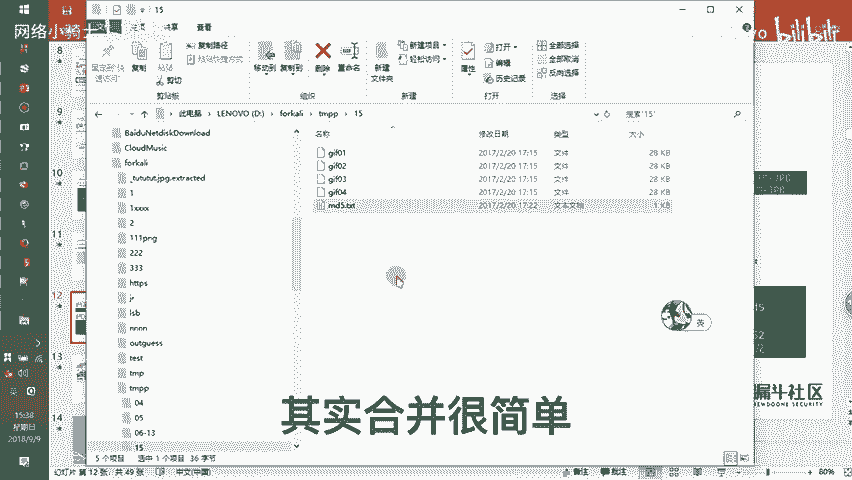

迷你好。首先我现在是linux下。这个文件有4个文件，对吧？四个文件。然后我想把这个四文件组成一个文件，怎么做呢？用ca的命令。看的是查看的一个意思。那我们不管我先比如说GRF01。

居如果如果这四个文件名字是不规范的话，你可能要一个写。如果它是规范的话，你这样写就行了，那个心。可有点小字有点小。那我这边为了演示一下，比如01啊，GIF02GIF03GIF04。我爸大婶上。哦。

04是吧。保分成1点GRF没错吧啊。然后看一下有没有这个文件。有了1点GF，我先看一下原本的这个MD5值。是什么？799B4到什么316B嘛。那我现要在linux下去校验这个文件的MD5值怎么校验呢？

啊，想一想啊MD5。s you啊。

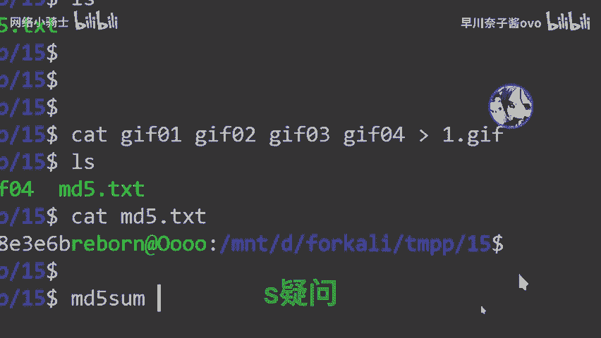

一点GF。这是我校验出来的值，这是它其中的值。你们对比一下是不是一样的。应该是一样的，这肯定是一样的。所以说我这个GF是没错的。然后接下来我退到退到windows下，退到windows下。

我现在是windows下，windows下是windows下嘛，对吧？那windows下怎么去做呢？😊，用copy命令。copy杠大B，然后呢GF。01加上就是他用加的。

用加号去把这个文件加小GF02加上GF03。加上GF04，那不是2点GF。啥意思啊？嗯有问题啊，看一下，我有点记不住了。

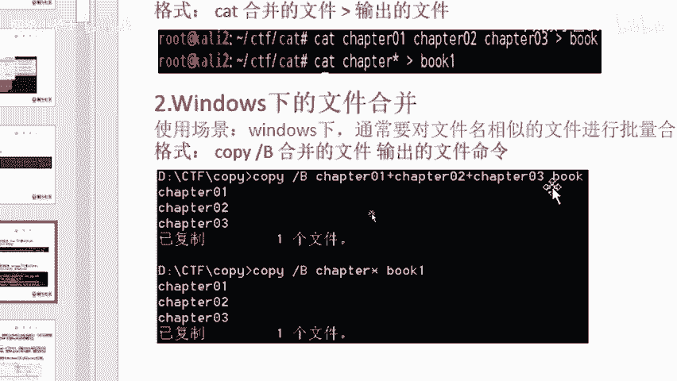

copy杠B，然后加小。不要第三个。啊。😮，哦，路径出错了是吗？怎么到了04了，应该要是15台，对吧？CD15。哦，不对，我看一下当前这个文件是哪里，我在04下啊退出，然后CD15。

然后再执行上面这条命令。这次应该没错了吧。然后先看一下有没有这个2。TGRF吧，有了吗？然后我现在要计算这个ND5，那它计算有点不一样啊，这个命令稍微长一点点。我也有人记不住。说实话。

我也等于说叫做呃CTYL，然后干hush。你看一下。然后这里面是文件名2点GIF。然后你你你像你还可以校验其他值，比如说SHA，那你我们这边只要校验MD5就行了，回车，然后得到这个值实际上是一样的。

但是。我们来看一下我们得到的这个GI，你现在可以确认的是我们这个GF是没有问题的嘛，但是能打开吗？能打开吗？不管是一点GF。

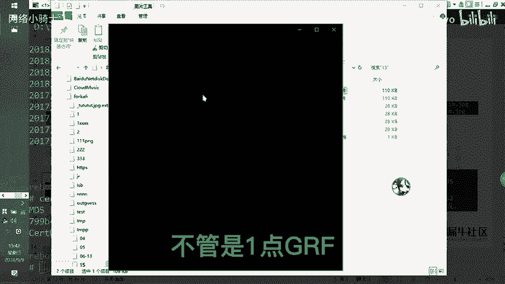

其色。特点去F。其色。

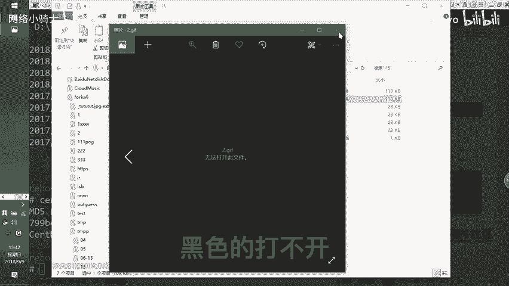

打不开，为什么打不开呢？我们现在识别一下，看看能不能识别出来。比如说范尔命令1点加F。告诉我是什么。😡，好了，告诉我是什么。😡，当时我这个data根本就。样就是骗我。那有可能是什么样子呢？

有可能是文件投残缺了。那我们来看一下它有没有GF的文件头。第份那个是多少？嗯。查一下查一下，有点忘。47494638嘛，那我看下他这个文件有没有这个GF文件头。你要的话去上面啊，有吗？保歉并没有嘛。

所以我们要什么我们要手动添加47494638。然后保存。保存。啊，保存保存完之后，我们再来看一下。它是个动图嘛，key is什么东西？是不是很变态，这个我们答案还没得到，还有三个动图。

每个值还是在这里面。呃这里面还是一算加密的值。还要再去解密，然后你还要把那个GS把它。一张张拆一下啊，等家会介绍我们怎么去把GF的每一针把它拆出来。所以一道题就是。所以你可以发现。

但然这个还是比谁你们不要不要感到绝望了，我怕我讲完之后，你们感到绝望。😊，有啊。所以你要试好几遍啊，这就是变态啊。那一般一般情况下，朱记人，你要看朱记人善良不善良，他善良的话，他帮你编好了。

他不善良的话，你要自己去找，能明白吗？这个时候就是。嗯种题问就是你想为什么我说你想打出立人的的意思就是这样子。😡，很变态啊。O。😊，那这个是这道题。我们先休息一下。先休息一个。5分钟还10分钟。

先休息5分钟啊，先休息5分钟。OK我们继续啊。那这个是刚刚讲到这个文件引写啊，文件引写文件巡写是属于我们要讲的第一部分。那这里面的话最后一部肯件引写就是。比较简单一点，就是我们直接把我们的编辑器打开。

然后我们去搜索里面是不是有flag值嘛？这里面的话。常见的方式啊就是。你们去搜索，那搜索的话，我不推荐你们用记事本，就是电脑自带那个很low很low的记事本。那个记事本太low了。

就是就真的看起来比较low。所以一般情况下，我们是用这个。派加加或者是比如说我们这个我们用中它要打开一个文件，然后这边有一个这边有一个搜索的一个功能嘛。其实你可以按快捷键，就是ctrorl F。很F。

然后去查找查找。然后比如说最正常的一个思路，就当你没有任何思路的时候，你可以去查找key。你就查找key呀，然后查找要flag呀，看看有没有一些关键的信息。因为有时候简单的题目就是考点就是这样子而已。

然后这是第一个是查找正常的字符串。那有时候它这个不在它不会隐藏在字符串里面。所以它有时候隐藏在实六进制里面。所以我们要用十六进制去查找。随地去查找的话，同样也是它这边有一个 search取，你去找哈。

那你这种工具它肯定都有查找功能。你找到社取功能，然后这里面的话，你你找找可能还需要替换什么的那这边都有都有都有这个相应的一个功能。就是一般软件它有查找功能，就有替换功能。所以我们可以去查找。

比如说去finfin list等等的。然后这边这个软件放呢是在这个位置，就是在最下面这边这个地方，然后你可以查找某一个字符串，然后去查到所有或者是怎么样直接查找，就是最基本的采访功能，我们要去掌握。

这是第一个。然后我们再看一下，这是呃最有一个这是第一部分的最有一个。

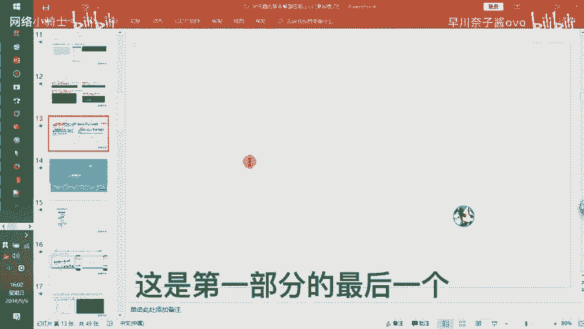

来看一下这个到了我们的第二个环节，就是图片示。你看才刚才好像讲图面，其实我刚要讲文件理解性。

那我们正式进入到图片已显束。那这边只是一个小。小的一个总结而已。小的总结。就是常见的一个图片图片已显数的一个明写方式。那我们这边列了几点，比如说最简单的叫做细微的颜色差别。啥意思呢？就是一张图片。

它有细微的颜色差别，你能看得出来吗？你是看不出来的。但，作为一个正常的人都看不出来。所以呢我们肯定是要用各种奇怪的工具去做各种奇怪的题目的。那比如说GRFGRF它可能。

各种因为我们说了G25它实际上是很多灯很多这种灯片的图片去。整合起来了嘛，所以它可能是多帧的一个隐藏，可能藏在某一帧里面，可能藏在某一帧里面。再往下可能我说了，我们往深一点，就什么颜色通道啊？啊。

什么针的一个对比明显啊之类的。那这种就是属于你要知道这个东西，就是我一开始讲，你可能完全不知道这说的什么。然后你实上掌握工具的使用，你就知道原来这个这个东西叫做颜色通道，这个东西叫做。

怎么对比隐藏之类的。那再往下是这个E叉F。的一个信息印象，你们有没有听说过这么一个东西，就是你在朋友圈发一张图片，然后我就可以知道你在哪个地方。有没有有没有听说过这种这种言论。

就是你在朋友圈里发了一张图片嘛，你再拍张自拍，然后我就可以定位到你这个人在地球上的哪一个点。知道吗？你没有去做这种言论吗？这种言论是存在的，那他怎么是怎么去实现的呢？我们手机或者是我们的摄像拍照设备啊。

它实际上如果它有GPS功能的话，那并且你把这个功能开起来了，然后也允许你的拍照软件去访问它。比如说允许你的相机去访问它。那么你去拍一张照片的时候，这张照片会记录下你当前的1个GPS信息。

然后这个GPS信息就会泄露你的一个地址，你的个人地址。那比如说。比如说一个人拍了一张照，一张照片嘛，他拍了一张照片，说他拍了一张自己家的自己家的照片，然后说我过几天要出去旅游，结果他回来之后。

发现自己家有个。被盗窃了，知道为什么吗？因为他过几天要出去旅游嘛，所以说明说什么，说明说他过几天不在江嘛，然后他又拍了张照片，所以呢。😡，不法分子就通过这张照片知道他家在哪里吗。那你这几天不在家。

我是不是可以砸玻璃进去，然后干一些非法的事情，是吧？那这种东西的话一般是在和我们正常生活可能。演离不是很么关系，但是他的犯罪和这个刑事甄别和这个调查取证和这个警察周小偷，他关系是很大的。

就是我警察要抓一个犯人，我用GPS去侦侦侦查到某一个人，这上是很很准确的那这个信息叫什么呢？就是每张图片它都有1个E叉S信息。那这个等下会讲到等下给你们演示一下怎么用GPS去追踪到一个人的壁纸。好了。

再往下。叫做图片修复。图片修复。那很简单嘛，就是你要想这个初推盐不是那么善良的，所以他会把图片给它砍掉，头片头部砍掉啊，图片尾部砍掉啊。那图片它有一个C压RC校验，你就是完整性校验。

我把这个高度啊、长度啊、吸压RC值啊全部它改掉，那你要去修复这张图片。那再往下叫做。最低有香味。明血啊叫ASB明血，这个什么东西呢？我们知道图片是有各种颜色的，对吧？

图片和其他文件的区别就是它有各种颜色。那颜色大家有这个应该都是理科生啊，学个物理，对不对？三基色是哪三种颜色呢？三基色三基色是不是这个？就是忘了。三基色是不是红？然后呢。呃，这个绿对吧？老来嘛。

RGB嘛RGB嘛，那么RGB在这个你把它转成字符串的时候，因为我们知道所有的信息都是可以用二进制来表示的，RGB也不一外不例外。那么正常情况下是巴比特。比如说010101010102，我把最后一位。

最后一位就是我们什么呢？RGB巴比特的最后一位就是我们所说的最低有效位。那比如说我把它改成零我改成一，这际样是对这个颜色是没有任何影响的。因为我只改了很小的一个数。我把这个RPB只改了一个很小的数据。

所以它实际上对图片本身看起来是没有任何影响。但是我可以通过这个引写，我把藏我把一些数据藏在这个最低有效位里面，这个叫做LSB引写。那这个是非常。非常爱考的一个点，就是爱考这个LSB零结的一个点。

那还有就是图片加密的，图片会做各种各样各种方式的一个加密。那我这边列了常见的4种，有可能。有可能因为题目一般都会有给一些提示，比如说题目就叫做什么out guess。或者叫做gas。或者说F5。

然后或者说你懂你懂你知道什么叫刷新键吗？刷新键就是FGM嘛，它会和隐和隐晦的，或者说很直接的提示你这边可能是有什么加密的那你可以根据这种提示，然后去猜测它是不是对应的加密。但是我们可以去识别出来。

有一个软件可以去识别出来这个图片是不是有做加密，然后识别出它的加密算法。然后我们根据相应的解密软件去解密。都是图片加密的。那我这边的话，我们先来看一些比较简单的一个工工西啊。

就是你们平时都是怎么去处理图片的？眉头秀秀。对吧会有美颜，你见美人是吧？那。我一般是怎么去图片，我一般处理图片，我都是用电脑的那个画图软件，能听说吧，用用的比较low的。

电脑我们电脑都有一个图画图软件嘛，叫画图，对吧？当然有时候我们你去处理一些图片的时候，你可能要用到一些高级的图片。就有时候这个出据人他很变态，他给你一张二维码，但是二维码。是什么样子呢？

就是被切了七87块7块七8块这样子。然后你要把它拼成一张嘛，你怎么拼呢？去考验你的这个美图的一个攻击了，对吧？有时候就是这种变态。

那这里面的话我讲一个打道像这个PSPS的一个就讲打道像一个pholoshop的一个软件。但是它可能功能没有photoshop那么好用。就没有那么强大，你fo秀毕竟是专业的，对不对？那这个工具的话叫做。

你们可以在引写工具里面砸向工具包，有个图片引写，你可以找到这个工具。那它是绿色版的，就是它是棉方的。那这种板件的话。如果说他一般整么时候是用呢？如果说你去。你用16进制编辑器。

你看到文件头可能有这个firearwork这个标识。只有你刚看到个在发货的。可以去用这个发货。的一个信息。但有时候我们不一定不一定就是他一定要有这个标识，他也可以去做一些操作。比如说。呃，我们来找一下。

这边的话你打开的话。有时候你可能打不开哦，打不开，是因为你还没有绿化一下。你点击这个绿化，绿化完之后，然后你再把它打开。绿化是什么意思呢？绿化的意思叫免安装，明明白？

绿化其实它的意思就是我们说绿化实际上就说它免安装，比是不用再安装什么东西了，因为它已经是一个安装包。然后打开是长这个样。当然我这个可能调的有点不是很好。然后比如说我们去打开一张图片。我这边有一张GIF。

我这边有1个GRF。不这样样。那这题呢也是一道明险题。你来看看一下它有几个东西吧，第一个是可以去看城，可以去看城。第二个就是可以看真，比如说第二针。放小一点。有如第三针第四针，然后第五针第六帧。

你看每一帧的话，这个图它上是一张动图嘛，每一帧这个图都是不一样的。也这个软件你可以去看那个图层，可以去看它的一个图帧，就它有这一般是用这两个点的。那如果你们还有其他一些方式的话。

你们就在这边用这个就各种什么套图软件，套图工具啊什么的，反正。我有点不是很懂啊，因为这个是。比较专业的，就是这边有一个图形的一个处理。图形的处理。那这个是这个工具。那第二个呢第二个就是这个名称最简单的。

第二种叫做E叉F，也是我刚刚说的。你怎么去定位一个人定位一个人。那这边的话，E叉F信息实实上它是我们在图片一张图片在制作被制作出来。这个时候，我们被制作出来。比如说你截了一张图，或者是你拍了一张照片。

就当他被制作出来的时候，他实际上会。那个制作软件会往这张图片写录一些制作这张图片时保留的信息。比如这张图片的尺寸，这张图片的大小，这张图片的作者生产日期。包括如果说你是拍照有有定位功能，可能有GPS。

那这里面的话，ES13F它是一个很简单的一个。我可能考你E叉F，那么他要去查找这个E叉F就很简单。怎么简单呢？就是我们直接去查看一个图片的属性就行了。在这里面的话，我们找到这个。比举一个例子。

我们这边有有一张图片。哇，这边有好几张哦，有一两张是我实力拍摄的，开了GPS知道拍摄的，就是我一张在家里，一张是这张是国科，在国科拍了张这个黑板的。

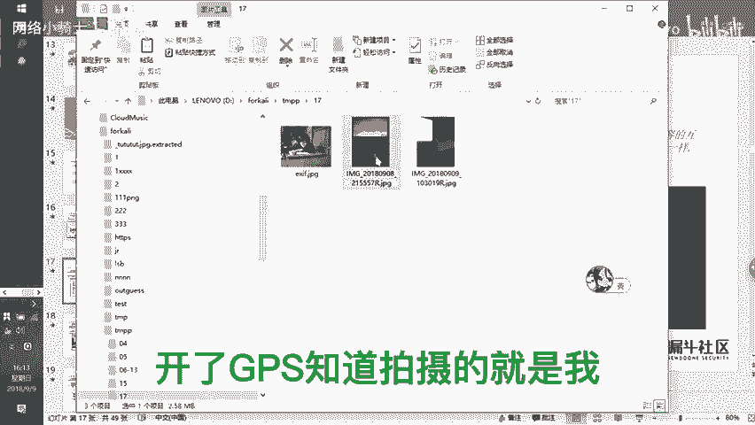

没白啊？这个是这黑板，也是我我开了GPS在这里拍了一张黑板，然后一一张是我在我家里面，我拍了，我昨天晚上拍的，我这张还没过来之前我拍了一张我自己电脑的。😊。

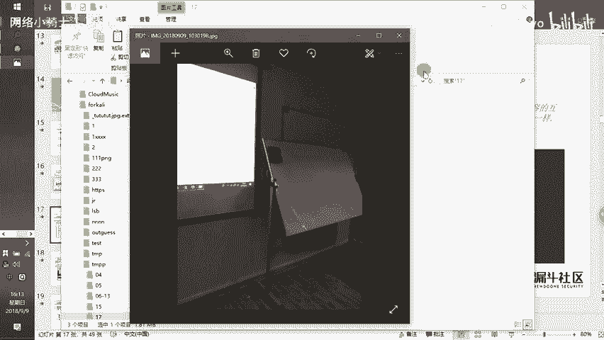

那这张是什么？这张是1个CTF题目。然是1个CTF屏幕。那这个CPF屏幕的话，正常的一个先给大家说一下正常卡点，正常卡点是这样子的，就是你们右键，然后但我右键可能有点多，你找到这个属性。打开。

然后这边有一个详细信息。假信信息这里面是可这边有一些值是可以写入数据的。那么这种提供简单方同时。就可以看到这张图片，发这面可能正比算。但我这边是直接写了个密码，密码。是啊。有时候我我我要给你解示。

我不会直接到题目里面。我在E叉F里面告诉你提示，比说我告诉你加密效码可能是某种算法，我再问一下。就这里面可能是有会隐藏一些信息，可能是一些提示，或者直接就是flag。如果它题目够简单的话，就是flag。

如果说想刁难你的话，可能就只只是一个个提示。🤧嗯。那这里面的话我们来看一下啊这个呃我拍摄了，开了GPS拍摄，来了解一下这个E叉F。详细信息。如果说如果说我们是开GPS的话。就是你开定位功能呢。事实上。

你这张图片它是有1个GPPS的。但是面是。大家应该都学过地理。对，虽然说我也不是很懂啊，经纬度这个东西应该知道啊，所以说经纬度怎么表示，我还是不这样做。一般有一个经度，有一个纬度嘛，对吧？

那有精度的纬度就可以定位到你在地球上的任何一个点。比如说我这边是。什么26分5秒，然后是26度55分，然后52秒之类。那这个这个这个这个怎么去查？我下了一个软件叫做谷歌地球，那实际上就是一个地球。

哪它长什么样子呢？它长这个样子。嗯，这实际上是一个地球，然后它是它是可以帮我们去。这个有点大。上是个地球，然后我可以去输入我的GPS就输入这张图片的GPS。然后我去才看到我去定位到。

基础到某一个点上面去。那这边怎么去增加这个标记呢？我可以添加一个标记点，比如说新建一个坐标。那我家上已经添接好了，一张是我在我自己家里的，我们来看一下这个坐标是多少呢？我先看下图片的坐标吧。

普变的坐标是。嗯。在这这是这是我这张图片应该是我自己加的。截个图。然后我们再看一下，我在国客拍了这张图片。我客拍的这个。主要是这个，然后这边是GPS。把它贴到这里面。然后一般我们要添加我们的经纬度。

比如说我这个是2626度5分，然后52这边很精确啊，所以我不用那么精确，我只要取前面几位就行了。然后是119，是精度和纬纬度和精度。然后这个点的话，我把它标成汞汞。

然后还有一个还有一个是这个叫国科国科的话。这个也是标好的，也是按照这个值序输进去的，把人家广告退。那我输完之后，我就可以知道我在哪一个点了。比如说我现在是这个地球嘛，我还不知道我在哪个点。😡。

然后点击一下我这个点，这个但是这样电脑有点卡，正常情况下它是很炫酷的对吧？还是很炫酷，人就可以定位到你当前在哪一个地图上的哪一个点。就你根据GPS你就可以去定位到。因为你能够清楚到你已经到福州市。

然后他们都清楚到什么样一个程。这清明有道理是哪一条街道的？就是他能够定位到你是哪一个街道的。比如说我我家是在这里嘛，那国科在哪呢？国科在这个上街这这里呢，所缩小一点。有点卡有点卡。

就是隔了一个这个什么什么什么和。然后应该在这个位置。对吧在这个位置嘛，我们在这个海西科技园嘛，这里面是这里面是海西科技园嘛，能明白吗？嗯。Okay。最大能放到这么大。这个是什么？建平村嘛，建平村知道啊。

就在隔壁。那我们这边是海海西科剧门啊，你你看看看不清楚这海西科剧门，给你们看一个操场啊，师大的操场在这。能看懂吗？然后我们在这里面嘛，这个是那个海西科技园的大门嘛。然后这边是什么？

这个地方是还西西客运站嘛，老师大操场在这嘛。能看到吗？所以这定位的还是非常清晰的。如果说你拍了一个照片，我可以定位到你就是在哪一个栋楼。所以为什么说你在朋友圈拍了一张照片，如果是没有关GPS的话。

你说我要出去旅游了，你可能回来之后，发现家里被偷了。就是因为这个原因。啊，这边只是做一个演示哦，那还有一个工具，还有一个工具叫做E叉I。那，这工具因为我们可以直接，因为我们大家都是windows的。

所以我们可以直接用属性去查看。那如果你是linux，它也可以查看它linux，你去查看属性也能看到而linux它提供了一个命令行的一个工具，叫做一叉F to。那可以直接把这个信息显示在命令卡界面上。

🤧这个。那这个我这我就不演示了，这个用法也很简单。直接去显示在硬上面，这是属于这个嗯13M。OK那我们来看一下。比较我们常用的一些工具啊，常用的一些图片理解的一些方式。

首先如果你拿到然题目有一种考点是他给你两张看起来完全一样的图片。他给你两张看起来完全一模一样的图片，但是它其实是有细微的差别的那你要怎么去？你们有听说过异或吗？或者是加或者是减吗？什么意思呢？

就是两张图片去做异或，两张图片去做加，两张图片去做减，然后会得到。同的信息，那么这个就是属于这是属于第一个发点。那这里面的话。我们需要用到一个工具，这个工具可能你们以后做所有的理解题目的时候。

你们可能第一件事你会想起它，因为它很好用。然后你现在看一下。啊，我直接讲题吧，直接讲题吧。这边的话这个这边第一个好点是易或或是加或是呃，这个是减，这个是加啊。

这个是加ADB是加SUB是减是单词的前三个字母。然后前提是什么呢？两张图片的信息是基本相通的。我们来看一下怎么个相同法，这个是当前18章。18我这边有有一个是这个叫做男神，这两张图片是一样的。

然后还有一个叫做女神，对吧？也是一样一样的。然后这这两个考点是一样一模一样的。你们喜欢看男神还是欢看女神好。其实都是一样的都是一样的。但是这样女神她还多了一个考点。这个女神她多了一个考点。

是多了一个图片引啊，文件引写。就是这个女神她给的男神，她给的题目是一个压缩包，里面有两张一模一样的图片。女神不是这样子，女神就给一张图片，那你你还要找到另外一张，那那给的是哪张呢？给的是这张。

这这张是我下载下来的，他给的是这张。😡，然后我们我看第一步是文件引写，怎么怎么个文件引写啊，你把它拉到最后面，然后这里面有一个什么下载链接。然后你点击这个下载，你就把这个图片下载下来，得到另外一张。😊。

所女程这张的话，他多了一个文件。你明白吗？ok那我们来看一下，我们要用这个工具。我们用这个工具，这个工具叫做tatical。找一下工具。实际上是一个java写的一个工具。

那么java写的工具就长得像你们用的PURP这种就很像，它是不是一个ja方。就是个 job，那这种可以直接打开，叫做st。Po of。反正得，反正这个。😊。

我们在一种细节OK那大打开在在右在左上角有一个小小界面啊，然后你可以去打开我们的文件。😊，然后打开。主要定位到我们这张图片在哪个位置。我这张图片在这里。嗯。因为我文件比较多，刚刚是十8吧，女神，然后。

你们知道吗？所以我应该先也是忙。没事啊说一下。你看一下，就是我们去做计货加满减吗？就是。你好好啊。然后加是APD嘛。点ZSUB嘛。对吧。那么你们有没有想过疑惑可能不要紧。

疑或管我疑惑你你疑惑我都是一样的，但是第二点能一样吗？不一样，我加你还和你加我哦，加应该是一样的，钱应该是不一样。减直是不一样的嘛？减果结你和你结果是两种两两个概念嘛，对吧？

所以有时候这边涉及到一个顺序的问题，就是我比如说我两张图片，第一张和第二张。我是拿第一张和第二章去做这三个操作吗？还是我拿第二张去对第一章做三做三个操作呢？它的结果是不一样的，能明白吗？

所以有时候你试一过一遍之后，你可能还要再试一遍，就是说没有主到信息的时候，你要试一遍。那我们现在演示一下，先演示一个错误的做法。我们先打开原本这张图片。哪他长这个样子，对吧？哦缩小点。然后我们怎么做呢？

他这边有一个分析，有个分析，点击这个什么。这个叫做imagine combine啊。comp点点开，然后打开另外一张图片。来另外一张图片，然后这个时候这个操作是什么呢？疑惑，然后过来。货货运算。

然后与运算，然后加运算减，然后什么RGP的各种各种运算。但这个得不到信息啊，得不到信息。得不到信息。还有什么？还有他其实上不仅这三种，他这边这个软件提供了很多种操作，但是我这边的话发现不对。

就没有多信息嘛。但是我上次我操作顺序有误，高顺序有误。我们打开另外一张。我们先把下载的图片打开，然后我们去比较原来的这一张。那我们再来看一下。看到什么东西了吗？看到了一张二维码。看一下二维码。

它是一个什么？它是一个简的操作嘛，所以减的操作是有区别的。我减你和你减我是两个回事。所以后边涉及到一个顺序的问题，就是可能加额进货都没有关系嘛。但是减的话，我减你和你减我是有区别的。

这张二维码是没办法扫出来的，为什么呢？为什么长这样子呢？对咪啊。应该是要相反的一个颜色吧，中间应该是黑的，外面是白的吧。所以等一下我们还有一个处理叫做反射处理，等下会教给大家啊，这个放到下面。

我们现在已经得到二维码了。啊。😮，啊，这个可以没错。这也可以。这个要把这张保存下，等下等一下等一下讲到不要急不要急。那如果是男神的话，得到的是一张彩色的。彩色就更夸张了，你能明白吗？彩色你更扫不出来。

为什么？😡，维码你去手机去扫的时候，它必须是黑白两个颜色。有有时候这张图片扫不出来了。但有时候现在一些二维码做的很高级，就它可以是彩色的，然后它也可以是动图的。但是它关键的位置都没有被隐藏。

都没有被隐藏掉嘛。但是这张图其实它关键位置都被已经都被彩色给占据了，所以你正常去识别就识别出来。我们有一个操作叫做取反，等下会讲到取反取反操作。那这是第一个，就是两张图片去做各种相互的一个操作。

基本上是这三个。但是这个软件它提供了更多的其他的一些操作。那再往下是这个最低有效位。最低有价位是它实上能够隐藏的信息并不是很多，就它能够隐藏的信息不是很多，它只能把最低的一位拿出来比较。比如说。

我们正常的一个图片，它是有三T摄影的，你把它转成二进制。然后最有就是我在这个颜色的最后一位去做一个去做一个隐藏。也就是说你们可以看到这张图片。我可以把这一个，比如说我要去隐藏一个A字母A字母A。

我先把它转成。这个二进制可能是应该。你看，然后把在到店的每一个位。嗯，把这个位改成。要的这个安。继续。啊可以得到A这个。那这个是属于最低有效位。那最低有效位是这个CTF里面图片引写这一块。

他非常喜样去考察的一个知识点。所你见到很多题目，它可能就是最低有价位。那他考察方式也有很很多种。比如说我们去减最低有价位的时候。其实它的解题方式也有好几种。当然不止这么几种，我这边列了几个工具吧。

有4个工具嘛，我今天就讲4个。这东西讲。での？4个这4个on脚本还en版你就要自己写个脚本。但我这边脚本都会给大家啊，你们只要能够确保它能够运行起来就行了，能明白吗？

当然题目如果说他会题目是会有变化的嘛，我说什么出题出题人一开始可能就考你最简单的，后面他改了一个小变化，那你们可能就要知道比你用的是脚本，你就知道我可能要他我要根据他这个题目，我改一下我的脚本。明白。

所以这个是属于高级的一个高级的一个技能呢。那我们现在看下这个tistic，还是刚刚那个工具哦，是吧？还是那样。只不过我现在个图片发来不是说这三个操作，而是让他拿去剪LSB减LSB那怎么去剪呢？

比如说我们有一张图片，当片。你打开。然后点击分析，点击数据的一个这个单词叫什么？串。然后这里面的话我们要去。去分析他的。种颜色的通道。然后把这个flag拿出来，但是这个过程你可能要点很多次。

就是如果你用这个工具的话，你可能要点很多次flag才能出来。而且很多时候你还不确定它到底是不是考LSD。然后你点了很多次，你就很绝望哇，点了好多次，然后还没出来，能明白吗？

因为有时候你不确定你只是猜测它可能考的是ASS。然后又点了很多次，就说这这个程序比较痛苦的。我们现在看一下这张图片，这个是20张。20张。这样子。熄熄灯。然后这个实际上是一张就是这么一张图片。

这个是之前我做那个有一个金融行业的1个CTF比赛。然后我做了一个题目，然后当时我。那就我就我我已经知道他是考了SB了，但是我没有把它点出来，我很感我很难受，就这道题。😊，就我没有做出来啊。

其实我已经知道他考什么，我我就离成功差了一一步，我就已经离成功差一步，但是没有做出来，就很难受。那我们赶刚看看这道题怎么做呢？他这卡最低有效位。那。你看我刚刚那个软件有关了吗？啊，被我关了。

我把它打开啊，我们再打开我们这个。St off。不是。然后打开这个这张这张图片，它实际上在这里面看到尺寸是非常大。那不用管它，我们看一下它这边有一个分析嘛。还有一个da一次。然后得到是这么一个界面。

那里面的话。因为我们知道因是有些面是常在每一个。嗯你用软件，你用程序去，比如说你程序写的不够好，去识别每一个最定位。其实这个过程是很复杂，那你们用工具的话，它可以直接帮我们去把最低的一个率筛选出来。

我们说了嘛，一个颜色它是有8位的。所以比如说红色，它有8位。绿色有8位，然后蓝色有8位，最低有8位是哪一位？最后一位。但是这边涉及到一个顺序的问题，你是RGB还是GBR，还是BRG，对不对？

所以这个时候就是。我们先来讲一下最简单的，比如说我就假设它是RGB，然后我点这个preview点下去。来看看这边可以根据这个playee you去生成相应的一个数据嘛，明明白吗？

他把这个最最后一位取出来，然后生成相应的一个数据。你发现这是一堆案码。那当时我说了嘛，这道题没有做出来，为什么呢？我都没有想到他是点这一个，然后点点。因为当时还不是很了解啊。然后flag在哪里呢？

能看得到吗？这个是flag，这就是提交的那个。这但这边还有好多个按钮，就比如说什么coon啊，什么LSB first啊MSB first，然后你要点好多次嘛，就后面找了一个工具是不需要点的。

你直接把所有的都给我拿出来的，明明白吗？就你知道为什么要找这么多工具吗？因为你会发现。😊，一个工具能解决问题吗，那有时候反会忽视掉一些东西。这个工具叫LSD。那我们现来看一下第二个第二个。

第二个它是一个mini行的一个界面。密码。在这个limmux下去运行。然后这里面的话，这个也应该在里面工具包是没有的，因为他需要下线安装。他需要在线安装安装命令怎么样呢？

你们在开 email里面输入这一条GM installstore，然后。就是按输入这条命令就可以安装了。所以它需要在线安装的。所以我们在工具端是没有这个命令。杨默呢有没有这个秘密。

然后这个是别人写的一个工具了，其实。然后我们要怎么去检测呢？这个时候它这些东具的好用之处就是我们不用去猜测它到底是RRPP还是。他说每。他会把所有可能隐藏的文本信息把它显示出来。比如说我这边对吧。

还是这道题。那我输入jeestticle加上这个文件名。然后他会把这边的所有的可能性全部列一遍。明白啊，还会把这边所有可能性练一遍，然后就把有值的这一串。显示给我们。所以这里面的话就是方便我们去。

好那我们去查看的。这边我稍微演示一下吧。

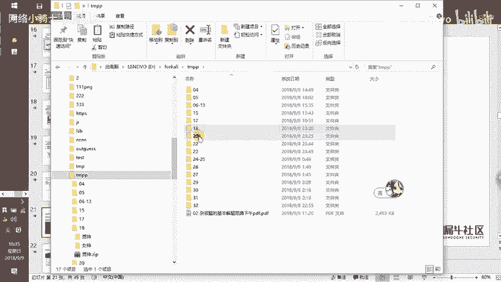

前面是你可以命个时要去安装这个命令了。ZS第一句。然 model。

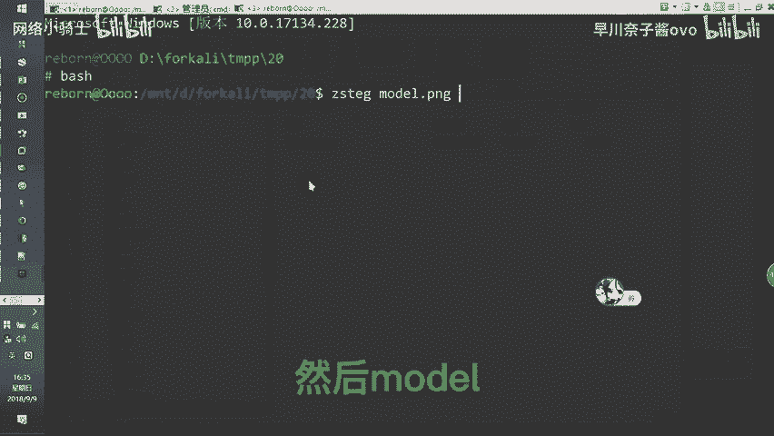

然后他会把这张图片的所有的这个有最低位的数据显示出来。比如说有这一串还有这一串，然后这里面就是flag。所以很多时候是这样子的，就是一道题你做不出来，不是因为你不会，而是因为你没有这个工具。你啊睇有咗。

你道你做不出来，不是因为你不会，而是因为你没有这个工具，或者你不知道这种方式。就是这样子。OK那我们来看一下下一个。下一个这个是属于。是一个工具哦，这工具很强大，它不仅是针对图片的最低有价位。

他可能还针对这个。那PDF的或者是其他一些文件格式的最低有效位。那它针对的文图片的GDC它一般针对的是这个图片。叫做哎。BMP就点BMP的图片。明白？就是如果你你这张图片，它是。一张图片它是BLP的话。

你可以用这个件去简密。大家其实用前面几种工具也是可以的。前问其他工就可以，只是给它增加一个工具而已。但是它还有一个就是它除了BMP以外，如果是PDF的话。他也可以去做嘛。就PPF的最低有价位。

他也可以去做PDM，所以他只是多了这么一个功能而已。那么在于就是说你不会做一道题，就是因为你没有一个工具的原则嘛，所以我们要讲一下这个工具。诶。那这个工具的话，用法其实很简单哦，就是它是一个图形化界面。

那它可以去做加密，也可以去做简密。密把它打开，然后我直接演示了。这个在我们的工具包里面叫做we web store。嗯，找一下。嗯嗯嗯嗯。应该是要这个。他没有没有像我们那个完整名字，应该是叫这。

那就这个WBS43open在V32。🤧你再往下讲，打看。打开打开最后这1个ESE文件。然后我们打开打开就长这个界面。那这里面的话，你就按照他这个步骤。步步去做就行了。那我们点击比如下一步，不好意思。

点击要退出，点击cont6，然后你可以选择你是要去decode，还是要去decode。那一般我们是要去decode。然后decode之后，这时候你可以看到它支持的一个文件类型。

比如说支持的是四几种格式的，比如说BMP的。TST的HTR还有PDF的。所以他这个光驱为什么信号工具呢？就是它支持的格适更多一点。它就这4种。所以如果你遇到其他文件的最低有消味的话，你可以使用一下。

尝试用一下这个工具。那这里面的话，我们首先要导入我们张图片。那这个的话，我看一下我这张图片是。PPT啊PPT这个是22页。22页这。这边还是有一张叫女神的一个图片。然后这张图片的话。

这张图片它实际上它的一个格式是绝B句的。如果你直接用op去处理，是没办法处理的。因为我们刚刚说了，op能处理DNP，那怎么办呢？你把JVG转成DNP就行了，怎么转呢？我现在这张是什么APPG的？啊。

很简单，用到我们的最简单的一个工具叫做画图工具右键打开方式，然后选择画图。然后把这个图片另存为。印象为印象。并存为一个，你可以选择一个格式嘛，吧？选择BMP嘛，明白了？画图是很好的一个图片格式转换。

但他还有等下还有其他的一些操作，比如我们说有的区法。或者是水平翻转呀，垂直翻转呀。基本的一些操作，我们用最简单的软件去实现它就行。先把它转成BMP保存一下。

然后这边又多一张BMP实际上它的打开并不影响它打开。但是对这个软件去解密的时候是有影响。我们要打开这个软件。打导进来，然后点下一步，下一步的话。因有有时候。如果他提示你就是用这个软件去加密。比说候。

他可能还有一个密码。那密码可能在哪里呢？可能在其他地方，它会提它会隐隐隐约的去提示你。那如果没有密码去跳过，这个地方是写密码的。那接下来是我们要把这个文件。那个地方是。是我们要把它保保存在另外一个地方。

比如说我们保存成11吧。就是把这个文件解密之后，保存到另外一另外一个位置。下一步。然后点这个继续。然后他告诉我解密完成。Okay。然后你们就可以退出来。就说来我们看到这么一个图片嘛啊这个个文件。

它是是它生成的，就它前面完之它生成的那这个文件怎么。我一开始我也不知道，一开始我一开始我打开的时候，我发现它是一串乱码。那遇到这种乱码的话，我们就要用16进这边继去打开，看看是不是。

所以我们要随间进去打开。然后你会发现开头就是。这个fag。听到吗？这个是一个这个思路。那这张图片的话。也不是说一定非得要你非得要用这个工具去解。我只能说这个工具它这是个事场。

比如我们用刚刚的刚刚的这个介绍的工具去解它，比如说。

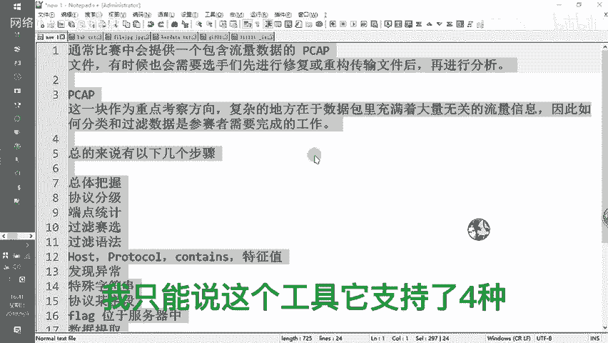

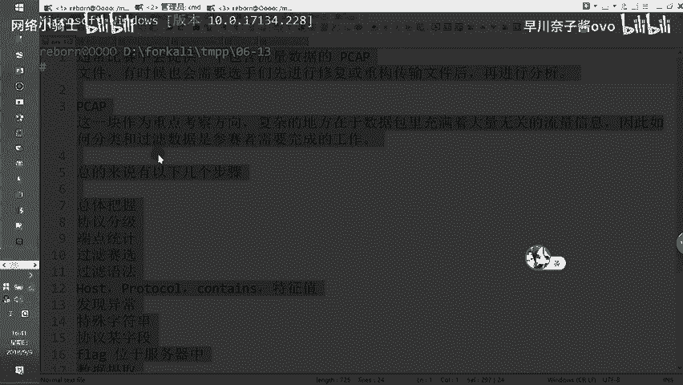

你先退出来。呃，这里。刚刚是多少？该是22。我这里面，如果我们用刚刚的，比如说DID考这个软件去解它。我们甚至都不用把它整成BMP的。我值。🎼直接扫这1个JPG的。然后我们就可以得到这个flag。

明白啊，这是不是更更明显一点，对吧？这更明显一点。这是一个。O。我看一下这边有没有其他的题。20okK没有，你们继续。完是这次地方。然后再看。就是你天这个大脑上短文写的比较好。他觉得用工具太low了。

他想用。其实也不一不是这样子的，就是说有时候处理人稍微改了一两个位置，结果导致你这个工具就识别不出来了，或解密不了。因为如果正正规正规中矩的，我们去解密嘛，它是解了出来的。但是出题人动了一个手脚。

比如说我就是把某一个位置给它加了一个一减了一个一这样子的那这个时候你实际上用正规的工具，用工具就现成的工具，你是没办法去修改它的嘛。所你没办法根据它的一个变化去变化，所以你得要要用这个PY脚本去实现。

那么。这里面这个这个甲本啊这个甲本。这两个后面。我等一下，刚刚那个文件夹，就是我的那个题库我一发给大家，嗯，大家回去可以去练习。这一面习惯很简单，就是。这边难字难在哪里？蓝字我这个脚本要怎么去写？

我们去用它的时候，其实并不难。我们要改一下这个文件名。改下文件名，然后就行了。所以这个地方这个步骤难在于如果它有变化，我们怎么去修改脚本而已。那这里面不同的脚本你就要能够稍微有点这个脚本的一个知识。

比如说我们要怎么去设一个变量，怎么去设一个循环，怎么去做一个简单的操作。就这个部分属于比较高级的一个部分。那。我现在直接给个脚本直接给个脚本。我来看一下这道题，这道题它的解法有很多种方式。啊。

脚本只是其中一种，只告诉大家可以用脚本去来解。这边是23的。23。就这么一张图片。电脑图片。啊，这张图片的话，如果它要零1点01点BMP嘛，01点BMP如果你直接用你的脚本去跑的话。

这是我我写了一个脚本，我们用n头派加加去编辑它。然后把你如果它是不同的文件，你就在这里打文件名改完就行。然后怎么用呢？用其实很简单。

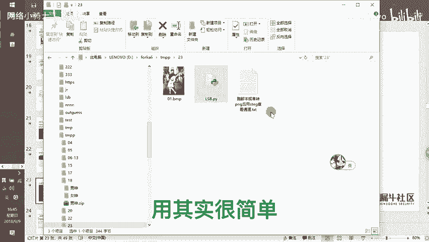

就是右键。然后你要确保你的电脑安python的环境。比如说PY，然后这边是LB。

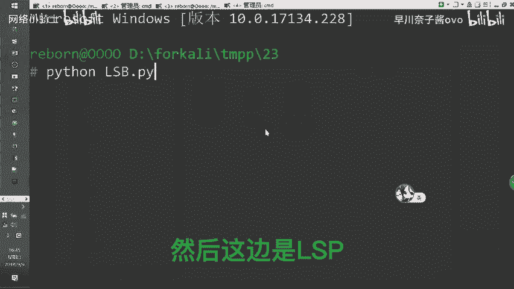

回家拿里大家一张图片。能难吗？我觉得很简单。那如果说我们不会写脚本，我们怎么去解这道题？😡，这个是如果不会写脚本的话，这道题有点麻烦。我也是后面还知道啊，就是我们要先把它转成PNG。

然后再用statical去查看通道。怎么转啊，还是要把这时候它是个BNP嘛。我们要用画图去把它转。嗯。要准要准这道题要准。我试过了。卡利自动有各种卡利，为什么要推加他卡利啊？它自动各种环境基本上都有。

有。什么原影响到资源上都有。大部分都有的你所以这个。所以卡利它是一个很好的，因为卡利是什么来的呢？它是以前他前身还不叫卡利，前身叫BT5。但是那是以前那些这个黑客，他们把自己用了很熟练的工具。

把它集成在一台linux上。然后后面发现这个工具这个一些工具都很好用。所以把它变成一台虚拟机，然后把它放到这个自己网站上去推广。先把它另存为PNG啊，另存为。诶。😊，啊，我这个是23。把后保存成PNG。

然后我们用statical去打开它。那这个时候我们去可以去查看它的一个通道。在在某一个通道里面有。嗯，找一下。我在这里。我看到是隐约也可以看到，那这个通道还不对。Yeah。哦，对了是吗？哦，对对了。

就没拉上去啊，就是这样子查用它的通道，这样也行。那看一个，如果你很清楚它是怎么样一个方式的话，写脚本是最快的。是你改那个老本用一下工具。OK那么这个是属于脚本的一个范畴。OK那么。你继续啊继续。

刚刚这一个是属。对文件的一个。怎么说呢？就是灯呢或者是那个连色通道去做一个处理。那接下来又回到了我们回到这个文件的一个类型的一个引写啊，实际上它一样的套路就是说。我就是把你这个图片用残缺了，用不齐了。

然后给它弄错料了。然后比如说你这时候去修复这张图片。那很多时候是这样子，就是取证类的话，比如说你电脑突然出现了什么问题。比比如说这个你去抓犯人，然后犯人他然那边删数据，然你冲过去。

它已经数据已经删掉一半了，你要把这个图片它修复过来。差不多是这种场景。那这里面的话。第一个是这个叫做TV的。一般的考点的话，如果要让我们去修复图片的话，很大程度上是他给了一张PNG的图片。

那他给了一张PNG图片之后，你发现它是没办法打开的，或者是打开出错了，或者是这张图片它只显示了一半，它一半没有没办法显示出来，因为它只显示了一半，拍一半没办法显示出来。那这个时候有两种原因。

第一种是一般是有两种。可能还有位知原因，他还没有出来。第一种是这个吸安系降液。可么是CR系教验呢？就是它一个头部。他一个文件的一个头部。比如说我这是一个文件。我可能这边是文件头，这个是长度，这个是宽度。

这个是高度，这个是CRC。什么意思呢？就是我根据你的头部长度、宽度、高度之类的一些信息，我计算出一个校验值。计算出一个校验值，我保存在这个文件的头部上面去。有时候是这样子的，就是我这个校验值是错的。

或者是我这个高度是错的，因为高度错了，也就也会导致校验值是错的，明明白吗？高度错了也会导致样子错的。那这个时候我们要去检测一下说我们这张PNG它的西C到底有没有问题。

所以我们要用一个工具叫做T位个PNG。我们去校验我这张PNG它是不是有没有问题。那这当然你可以用其他的一些。当你校验出来之后，你就可以去。把这个校验值给它改回来，改回来就是用我们的随续进制编译器去修改。

那这里面的话，首先我们看一下这个TV可这个TV可PN区这个工具。T week。在这里TV是一个图形化的一个界面，然后看你电脑是多少位，我电脑是64位，我就打开64位。然后我们用TV去打开它。

然后比如说我们用我们用这个打开。打开，然后。先看下这个是24张GPT。诶，open。open，然后找到。找到我们那张图片。🤧哦，好。地盘。这里面。这个。TMPP。2是。啊，这面有好多张哦，我。

先打开随便一张吧，这边每一张都是。呃，打概这张吧。🎼它会是出错。还会出错，这这刚刚每一张都会出错，就是。是不是要告诉我们什么呢？😡，他说CIRC校验错误了。CC算错误，然后当前可能是CBD6DF8A。

那应该是这种C7什么58D77。这是属于C系校验错误的一个。那西这错误有两种情况嘛。我刚刚说了，第一种就是真的话把它改错了。第二种是高度错误，导致他计算之后或者是宽度错误，导致他计算错。

这个CI面是错的。那么这道题是属于真的真的就是单开两种题都可以去做了，就是。我先来看一下。呃，我们要去改它嘛，改它也要用我们的情况是去打开。然后去把这个值，因为他说正确的是哪一个嘛，错误的是哪一个。

所以我们把它替换一下，就可以去打。这是第一种。第二种是你发现T one还是没办法，还是不对。不是你替换过去还是不对，为什么？是因为。他的高度有问题。像刚刚这样这几张图片都是高度有问题的。呃。

先把它放下来。我们先来看下这几张图片的一个特点。

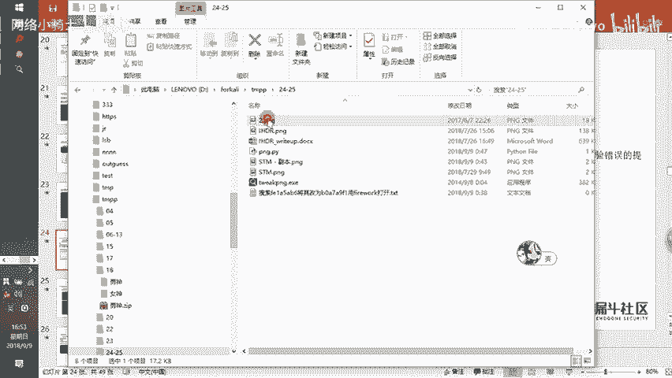

比如说2点PNG。他展示是这样。然后如果你他的高度是正确的话，或者他其他在这里的话。盖章。比如说各张。就他如果说他的。高度是对的话，它在下面这一部分会显示在延长显示一段flag值。然后还有是。

这一张最明显的。你只看到半张的二维码，那还有半张在哪里？还有半张没有显示出来，你要把它修改完之后，然后才能得到另外半张的二维码。

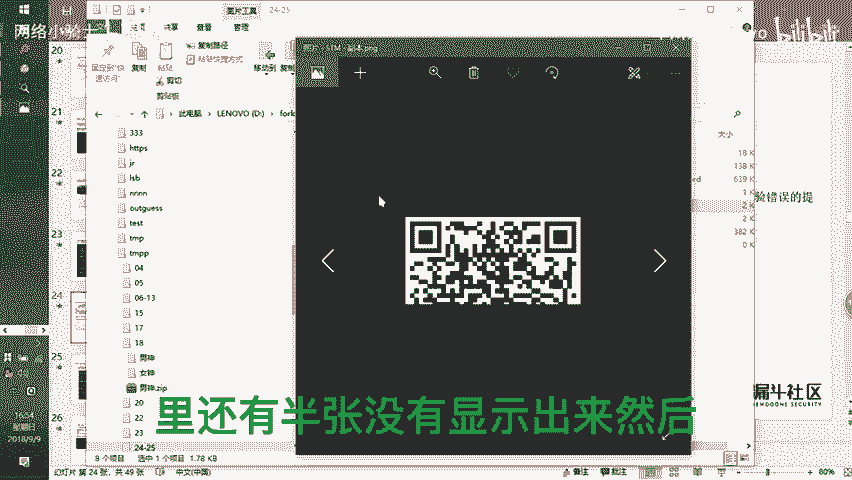

那这里面的话，我先把PPT讲完啊，我先把PPT讲完。😡，这是我刚刚讲的第一个思路，就是。他的CR子销案错误了，所以我要把其R性纸。这第一个。第二个是。它并不是CRC错误。

而CRRC错误的本质是因为它的高度或者是宽度错误了啊，致它计算出来得到的这个CRRC只是错误的。所以我们显示的看到的是图片是产出来的。那这个时候我们要去计算，我们要去计算这张图片的瑕息纸。

那你们不用考虑，因为我已经帮你们想一想啊，这个不用。那这个计算的角段已经把里面写好了。我们先来看一下这个基本知识啊。就是一张图片，比如说这是编剧的，他的头部是890。然后他后面的几个字段。

比如说有4个字节。有4个字己00。000Bcheck叫做强度检测。在后面4个检测检测类型，就check类型，这个都不用我们去考虑。我们要考虑的是接下来这8个字节，这8个字节。这个是宽度。啊。

四个字节四个字不错，也四个字的是个宽度，多是个字节是高度。那一般的情况下就是他这边高速被篡改。高度在上杆，所以它只能显示正常，如果改成正常的，就正常显示这张图片，明明白？所以为什么二秒会少。

只能看到前那一淡。那也就是说我们要去计算这个高度和宽度。然后把这个。回来就行了。那这里面的话。再往下再往再往下这个地方，081C7E。DB这个是属于C压系。也说如果你。直接去修改C压器的话。

应该改这个这个地方这四个字节。把计万过来就行了。那我们先来看一下第一种。就是我直接去替 one这个C压细致的。嗯嗯。我们去我们去替换一下这个2点PN去。那为了为了保证这张图片不会被我修改。

我先创建个副本。对吧参加个副本，我们对副本去做一个修改，让保留原文件嘛。那们又检啊先先检测一下啊，先检测一下这个图片的吸压细。O看。🎼对天气。然后告诉我们是这个。对吧告诉我们这个。

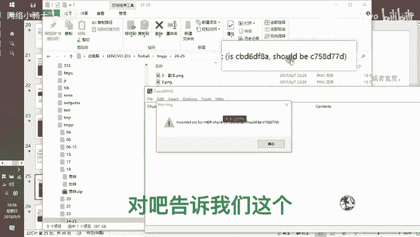

然后这时候用010AD头去打开它。按照我刚刚说的那个格式啊，那我们应该知道C压系在哪个位置吧。是不是在这个位置？你可能看的不是很清楚啊，我放大一点。CBD6DF8A嘛，是不是当前是CBD6DF8A？

然后应该被设置成什么C758D77D，能明白吗？那也是我们要把这个TIC给它替换过来，你可以一个用一个位去改。但我比较偷懒的一个做法是我直接搜索替换，怎么搜索替换呢？就是我先选中它。

点search点replace，然后再往最下面。最下面这个位置。我把它换成什么呢？把它换成这个回下。我把CBD6F8呃DF8A把它改成。7758。T77D，然后我直接修改，把所有的修改掉，我不较偷懒。

应该没事的，应该没有。保保保守的做法是你又有没有去修改，我不想修改，我直接替换掉了。啊，踢换掉之后呃，回回过来。

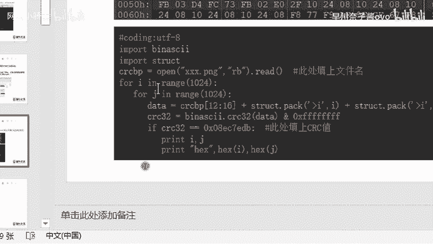

那个我还没保存啊，还没保存。点击保存。那这个时候我们再去看一下我们这张图片，副本这张。

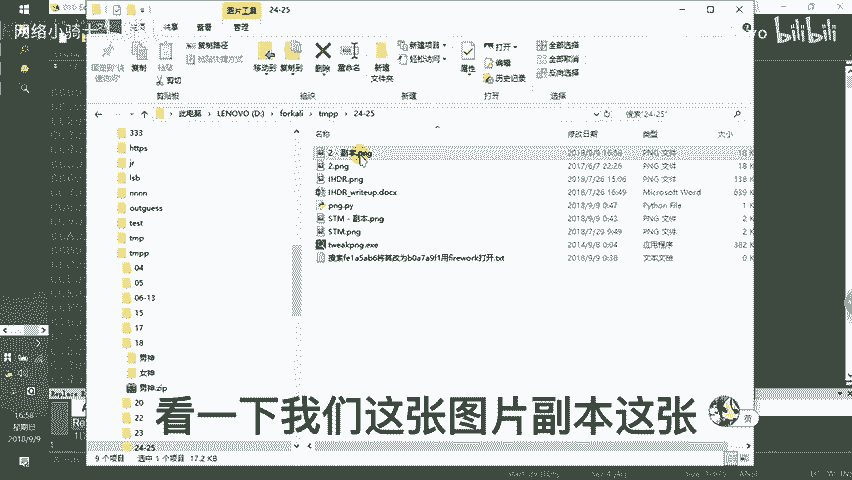

李真像。没参架。这个是有问题。因这张图边没增效。那也就是说明说它不是西R系的一个错误。那这个时候我们就是要去计算它的一个高度了，能明白吗？

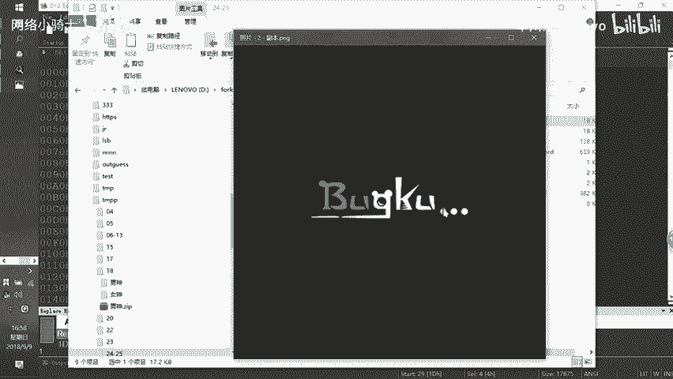

先把这个关了。不用我们来算一下高度，那高度的话就是要去用到这个python脚本。是不用到这个嗨心角粉。那。我这边放了三张图片啊，你们后面回去做的时候，它的做法可能两种方式都可以，咱只能用其中一种方式。

所以最方便你们去练习的。呃，我再我把这张图片删掉，我重做一张副本。然后我要去比如说把改个名字吧，改个3点PNG。然后我要去改这张副本副本哦改这个脚本。这个脚本的话。假两个。第个位置是文建名。

第二位置呢第二位置是西RRC值，当前的一个西RRC值，把它放在这个位置。然后他会根据这个西安。报错这个是压机值应该正确的一个高度。啊，高高度的宽度是。明白。也就他会根据这个吸压级是计算正确的高度和宽度。

Now。看下方刚还在不在。再打开一遍。我们现在是3点PNG。当前的一个CR细值应该是CBD6DF8A嘛。所以我们改成这个是不对的嘛，刚刚已经验证过了，所以我们把它改成。这个刚好就是刚好就是CDDF。嗯。

CBD6DF8A没错。我们运行一下这个脚本就行。我这边的话输入两个值，第一个是十进制的，第二个是十六进制的，为什么要显示十六进制呢？因为我们去修改的时候是直接对十六进制做操作的。那我看一下。这个改成3。

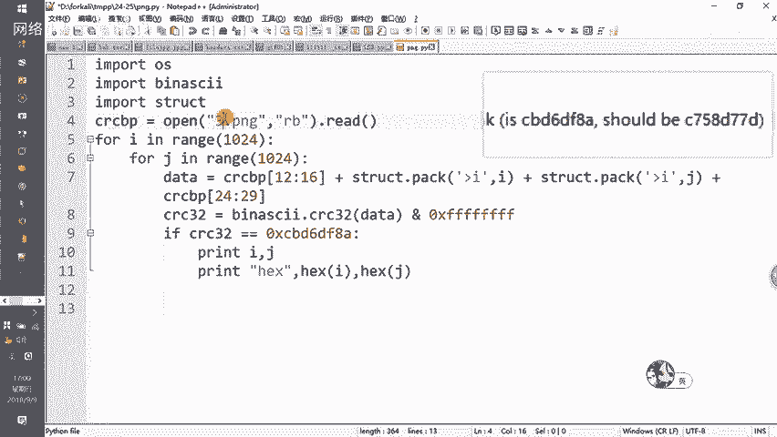

我声一下。然后运行一下这个pathon脚本。然后告诉我高度应该是500500，然后。银沙EF40沙E。这吧，所以我们要把这个值改成名差EF4。

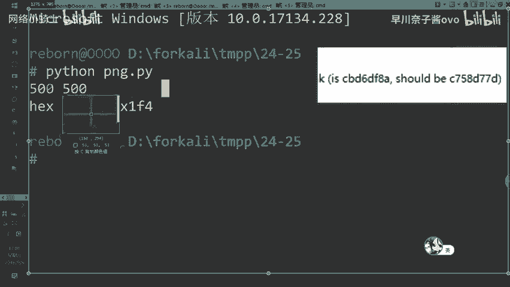

看看这个。那我们再用我的020edit。

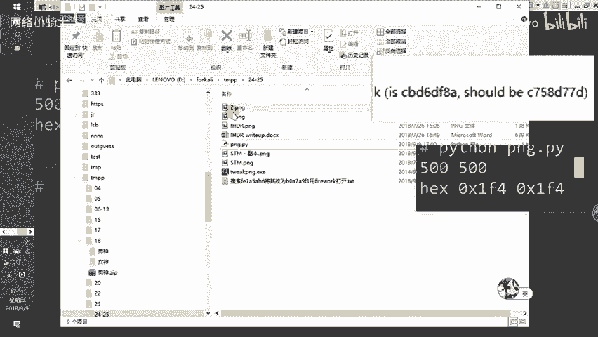

打开这个三点偏距。高度是在哪里呢？😡，是不是在这个位置？那我们看一下。我说的是是吗？零叉EF4EFEF4嘛，你后一个数据在前面添加零是没有影响的。有0000001呃，0001是同一个值嘛？

看一下前面这个是什么，宽度宽度是多少？宽度是四字节的嘛，所以是000001F4嘛，没问题吧，高度呢。啊路出错了，000001A4，这个A是错了。F4。听听到吗。把它改成F4OK。发生。那我们去把它打开。

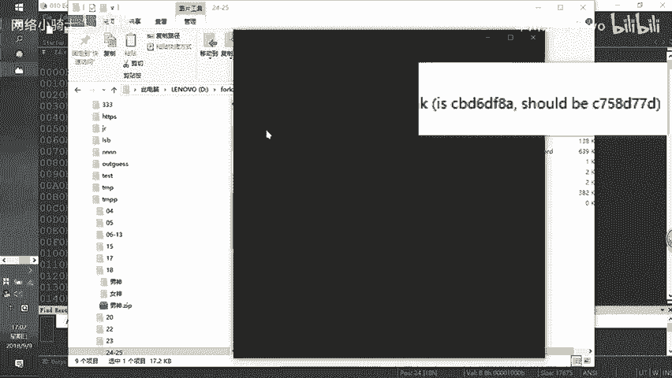

看到没有？怎么是不是看不到？你看到吗？は。嗯。因边有个flag可能看的不是很清楚，但是就是出来了。那其他的题目都是这样这两种方式，其他图片啊我放了好几张图片。其他同论同样是这种操作，要么感谢阿西。

要么改高度，这高度要去。如果你要改高度的话。你去看一下。别人写的一些答案嘛，他可能随便改了一个高度。那这这样随便改是有风险的，是不一定改的对，一般要去校验一下。因为他会把高度调高嘛。

那以前我去看别人的答案的时候，他说把高度调高，我也不理解他为什么要调这么高呢？会会划线的，其实是可以去计算一个正确的值的。

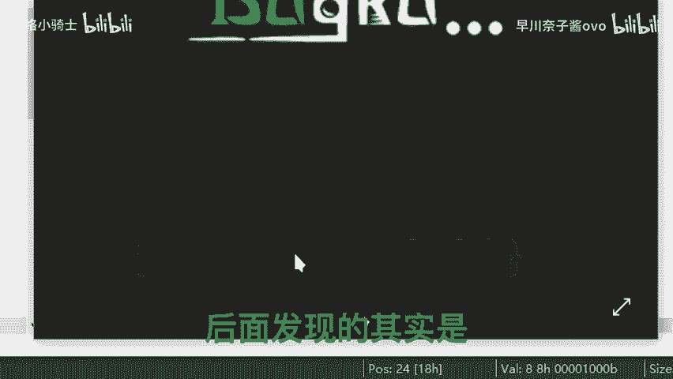

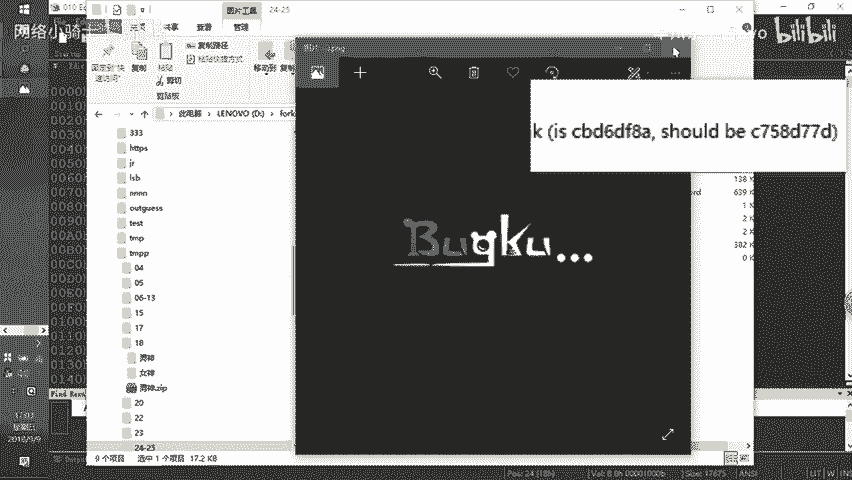

随便调不一定可以，比如说吸压机是错误的，它就打不开了。OK那我们来继续啊我们。你们几点下课，还有半小时。没事，我们慢慢讲慢慢讲。应刚还有还还还不是很多了，还有一些接下是加密的这一块，接下来是图片加密的。

那这里面的话图片加密。5昨会加4到5克了。那。他加密了，那我们最简单的一个想法就是你加密了，我就解密嘛。那我现在就要知道你我只要知道你是什么样的加密方式，我就可以用什么样的解密方式去解密。就这么简单。

那第一种叫做BF tools。那这个时候你要看。屏幕有没有各种？小提示或者是隐晦的小提示，然后常在我会会这个提。告诉你这个图片可能是BF toolss，或者是你去尝试，它可能是BF tools加密。

然后你要不要付。然后这里面的话解密的一个方式很简单哦，就是你猜中这个命令哈，它也是命令哈。接下来解密的这几种。应该有好几个都是命令行的，命令行和匿密行，你其实也不用怕，就是你知道怎么样就行。

然后这里面的话就是它这道命密上比较长一点。比如说我们去解密这个文件。然后把它输出出来，但输出出来之后，这个文件。就收到1个123，这123还不是，你还要再去解一下这个文件。啊，我演示一下演示一下。

我们这个是26。26，等下我我等下会把。这个文件拷给大家嘛，你们就可以去根据某一张PPT的内容去做一个练习，明白吗？E托老是在这里，我也。为方便要打卡在这里。把它拷到同一个目录下。

然后我去打开它写命令命令有时候我也记不住。所以接一下命令。

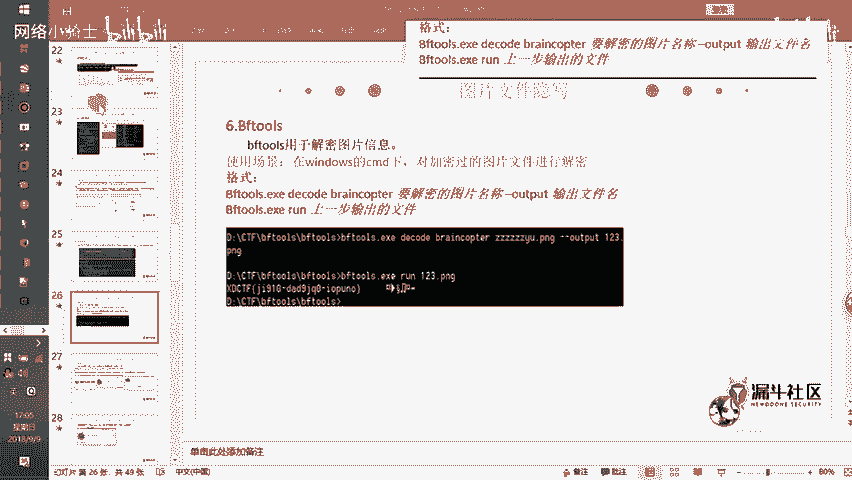

明令好像其实很多啊，有时么命令，因为记不住时没没有什么关系的。decoded，然后是。

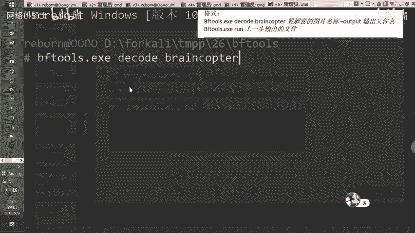

CPT1样。对对在。😔，啊括有123点PNG。啊，这个时候你在桌面上。你会看到有1个123点PNG。那接下来我们再用这个BF toolss。然后去乱一下这个123点PN距。老子个翻。

所以这个是这个题目其实就这样子做的。听到吗？这只这题目很简单，就解密的话，其实南站在哪里吗？南站你不知道它是什么压易方式。第二个是你知道它是什么加密方式，你找不到解密工具。这是两点。

其他当你这两个都知道的时候，其实你去解它就很简单。这是第一个加密的，再往下叫做let Istar on。那这个是一个图形化的，这个是图形化的。我们我已我已经提前打开了。哦不是这个。嗯。

就是就就是stand啊。然后刚刚也是一个加密方式啊，就以这种加密的话，用法演是一遍就行了。我们打开。打开我们的文件。TMPP然后是这个27的。然后我们直接去做一个解密。然后点击decoded。

然后打开这个fag TST。保存在。我现在当前目录在在。🎼Tose O。那这个时候我们来去这个文件一下，应该已经解密成功了。在27。所以解密方式都很简单啊，解密方式都很简单。然后有时候他可能需要密码。

有没有如果没有输密码就没有密码，有需要密码就输入密码。然后再往下是专门针对JPG这种格式的图片去做加密的。其他可能是通用的。第二可能是专门针对JPG的图片的一个加密。那这个时候有4种。

然后我加了一个检测工具。就是第一个要检测工具。检测工具做工具要st。叫什么？tayt啊tt。那它可以识别这么些加密方式。所以如果是这些加密方式的话，它都可以识别出来。它识别的时候就是我们直接识别哈。

但是它有时候识别的时候，它可能不是那么准确。所以你要把它的敏感度调高一点。它有一个敏感度，比如说加个S。加个小S，然后把这个敏感度调高。你时候你识别是错误的。

所以他可能比如说它明明是第一个叫做JPhead，结果它显示到第二个了。但你你发现解密不成功。这时候你要回来把敏远度调高一点，它可能识别率会更高一点。这个是首先要如果是JBG。

那你确认了它是JBG的加密方式，那你去识别它的一个解密方式。然后得到比如说F5或者是out，或是呃这个绝壁head都有可能。然后解密完之后，我们接下来就是针对上的一个。电剧简免。

那这种图形画的都很简单啊，就是把它打开，然后把它去解密就行了。所以我这边就会讲。就是工具就是把它打开解密。然后剩下这两个，一个是。按out的话，它可能需要编译一下，它需要编译一下。怎么是编译呢？

你们有没有在大家应该有学习语言吧，对吧？你们学习语言的时候是用了什么？威胁的微微信。67611那个。有没有人在利ux下？写写这个吸引人的。😊，没有，如果你们老师的我们老师比较变态。

他教你们在linux下写戏，不叫你们。的话你们就会知道什么叫编译的，就是编译嘛。你们写完西藏就要去编译嘛，对吧？那这个工具给你们给到你们大家多设一堆的C文件，你们而且它是一个linux下的。

所以你要要用这个文件的时候，你们要去编译，能懂吗？能懂我的意思吧？那编译也是一条命令的事情啊，条命令的事我们至少是。先把自己提升到管理员权限，提交入口权限。就是你你是录入账号的时候，拿后去编译。

编译的时候是一条命令，就是这条命令，然后输到电脑听到关键目录下去做一个编。拼完之后，这个工具才能去用，因为它是C吸盐。然后接下来就解密解密的方式很简单啊，很简单，就是按照这个格式去解就行了。

所以接下来这两个。就是按照你的格式去解F5的话，它是一个要用java去解。F5它解密解密的软件是一个java，所以你要有java的一个环境。那为什么会让你们安这么多环境？就是你可能各种语言都要。包有。

那这个就是因为C的话一般都是有的，就是关windows来应匙。一般我们各种软件的话，就会有各种C的一个环境，其他环境可能没有。F5也是这样子的一个方式。那这这两个我就不多讲了。

因为他雷他实际上就是就是当你要知道他怎么一回事就行。那再往下我们来讲一个小。那个二维码的。很多诉你啊历尽千辛万苦，得到一张二维码。然后就你发二维码扫不出来了。

就是我们因为二维码他还这个人还在二维码做了一些搜。比如说。他可能把这个黑色变成白色了，然某一块然后去去做价了。所以你要。其实他们说的是你要精通PS，所以并不需要你只要简单的掌握一下耗筒工具就行了。

不要那么夸。那这里面的话，第一个就是截嘛，截一个软件，然后比如把这个黑的变成白的嘛。🤧嗯。这种是属于叫做什么补全二维码啊，补权二维码。有的这边是一条狗。它实上这边是一个一个这个方块嘛，黑嘛。

它变成一条狗了，结果你识别不出来了，所你把这个狗P完成这个黑的，然后就可以识别出来了。这是一种动外补全，这个很简单。第二种叫做取法。这张图这张图片它是识别不出来的，然后你去取反取返。

然后它有一个反射的一个操作，我来简单看一下。30。但是这这不管他。3131是。走了。嗯。

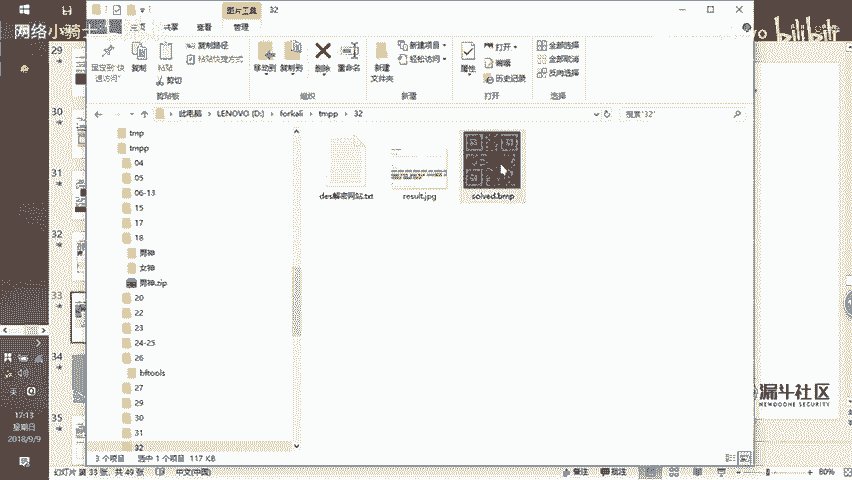

这个吧这个。这张图片嘛这张图片。

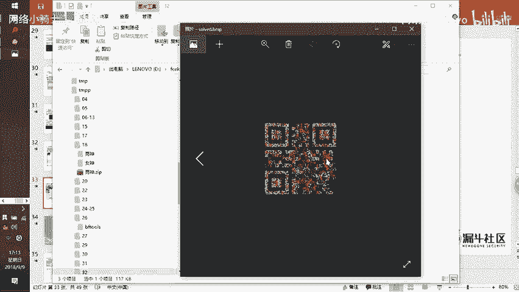

呃。怎么就没有一张好的图片呢？算了就这这样吧。这张图片有两种方式啊，两种方式。我们先来看一下第一种。第一种是我们用画图去取反，但这张图应还是没办法取反的。我先用我就因为我没有贴贴那个比较标准的一张哦。

我就先演示一下。就是我们用画图打开它。然后呃。我们去选择有一个反射。能看到我的操作吗？就是我先点了一下选择，我先点了一下选择，然后我再右键反射能看懂吗？就是都说你一进来是一个笔嘛，你是一个笔嘛。

你点进去是写的嘛，我先点了一下选择放大一点。😡，我已进来先点了一下选择，然后我右键。反射然后这个时候黑的就会变成白了，白的就变黑的。但自然是张彩色的，所以反射完之后就变成这样子。这个这个。最需要的。

为什么呢？我们先我先不不反射吧，我我先就。并全部去掉。那这张可能更复杂一点。这张图片是我们刚刚那个刚刚还没印象。就我们刚刚那个男神男神的图片嘛，嗯接下来还有好几个坑，还涉及到反射。

反射完之后要选择个颜色通道，选择运动外照做一次DES的检。他有3张二维码，三张二维码给你三个信息，一个是解密密钥，密钥本身，还有解密的算法。然后你根据这个去解密。那这个时候密码学我们还没讲下节课讲。

所以我们先先先放下下节课讲，因为我我这边有三次课，下一节课还是讲咋项的。然后下次课讲密码学，密码学还没讲。那我们先来看一下这个当头片啊。张图片的话，如果它是纯黑白的，我们反射一下就可以识别了。

那识别的话，对于二维码。对于二维码来说，我们。我这边有一个不知家有没有这个，你们可能有1个QR的，我这个更好用一点，我是可以直接扫描桌面上的二维码，点击，然后它会去扫描。他现在没有扫描到嘛。

他说没有识别到二维码，因为他没有识别到这个是二维码。😊，这个时候这个图片是在还要去做一个处理。啊，因为它是彩色的。我想。如果你拼是几万好话。啊，一便拍测。但且我PS不用弄好，所以我用了一个工具。

还是那个stgo。用St稿可以去查看它的各种颜色通道，那么肯定有一个通道是纯黑纯黑白的，明明白吗？然后这个时候我就打开。嗯。那个stical。然后把这个图片打开。啊，我这个不是同一个目录像。

所以打开要时间有点久。32，然后。那是这个。应该这个。然后打开之后，我们去。我们去查看它的颜色通道了。他有他肯定有通道是原来指标这张，但是我去扫描的时候没有扫到，有这张。因他有好多张。对。

你看这张还又是另外一张这张二维码和这张二维码是两张二维码哦。😊，这是两张二维码，这张也扫不出来。😡，很多都扫不出来的那我要去做什么？我要取反之后才能够扫出来。嗯。呃，先点选择，然后反色。哦，直接保存了。

这先取消一下吧。我先弄个副本吧，不影响原图片的一个一个识别。就我单用等上改完之后，你们到你们那边就没有练习环境了。画图。然后选择。白色，然后保存。okK然后我们再用再用这个statical。我天哪。

我这个那个完了。好吧。O。刚刚那路径是哪个？30，然后是这个副本。来看一下有的通道。这个还不是。这个这个是一张二维码，所以这个是可以识别出来的这是第一张。一张要什么呢？

叫DES也就是告诉我们这个加密是一种DES的一个加密。啊，这是还是第一个。第二个。好像有3张。3班是不是？这张是一个。这个是一个密钥。

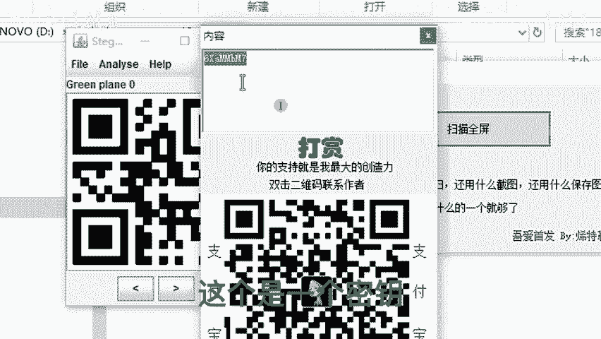

这是一个密钥。诶。

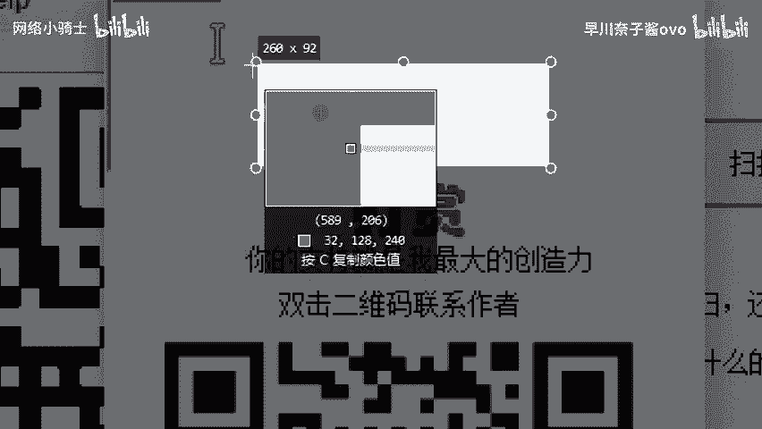

啊，截一下图。我们得到一个密钥。那我们继续。

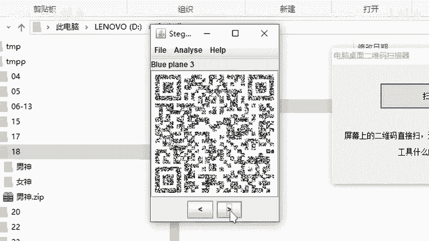

这张拿后我们去扫。这个是密文。这个是密文。

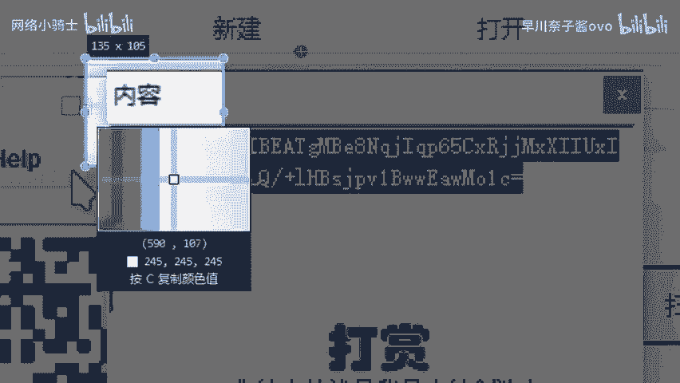

然后我们去一个网站，这个网站后面。我是有个网站解密，然后把它解出来了，那我这边就不解了。我已经我昨天晚上解完了，解密网站是这个。嗯。嗯，反问不了。OK我问不了。我直接给他看看结果吧，因为加密加密解密。

我这边先不讲。

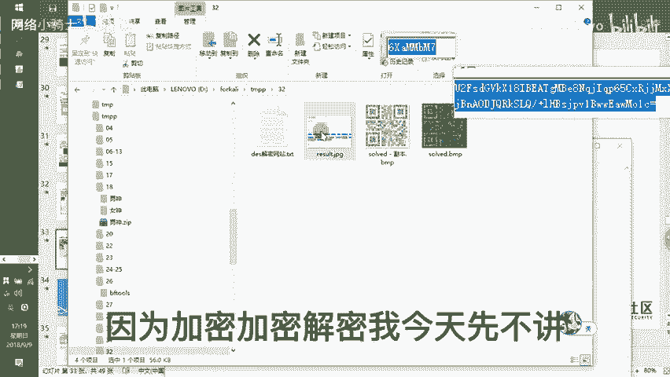

这是我昨天。

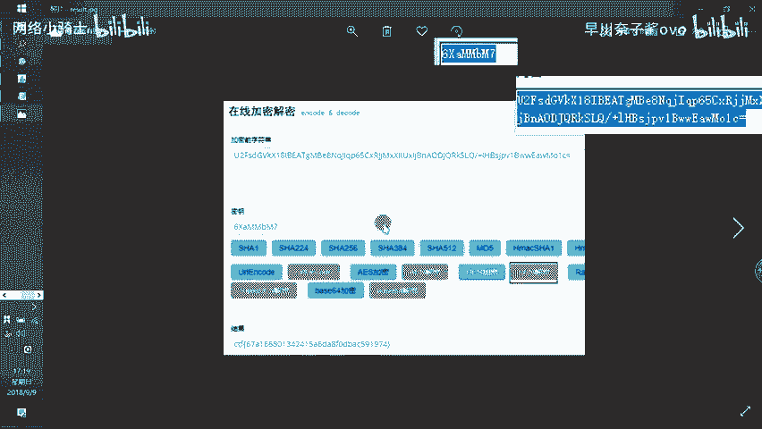

的一个结果就在这里面放上放上这一串密文。把这里面放到密钥，然后我们选择第ES加解密，然后得到这个flag值。

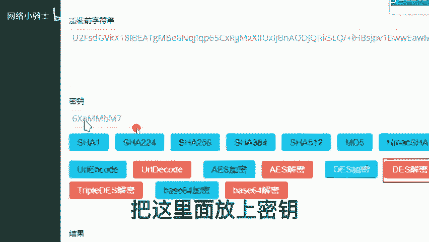

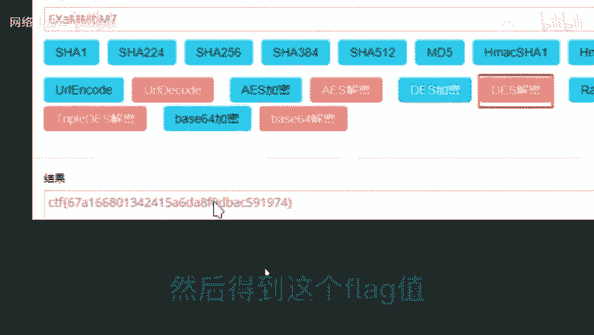

此这种图题目是连完刚考察的。是连环的连起来的。那这是图片的一个取反的一个操作。那我们先到这里结束吧，因下一部分是压缩包了，第三部分的内容。我们今天下午就到这里结束了。然后大家回去的话。

就是我等下会把这个题目发出来。啊后大家根据我这个PPT的页数去做一个相应的练习。因我应该讲很多题了。

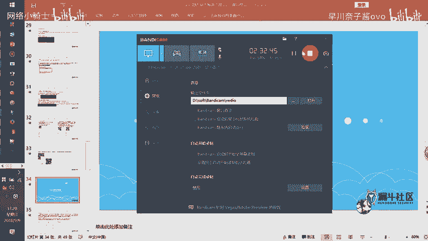