# CTF复盘：DiceCTF 2023 MISC Android spellbound - P1

在本教程中，我们将复盘 DiceCTF 2023 的一道 MISC 题目 “spellbound”。这道题涉及 Android 应用开发中的服务（Service）绑定机制。我们将分析题目逻辑，理解其核心考点，并学习如何利用服务绑定的生命周期特性来绕过安全检查，最终获取 Flag。

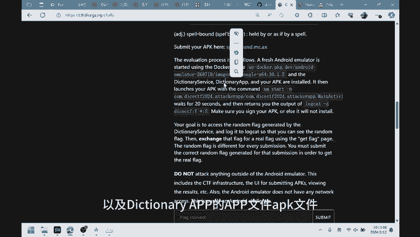

## 题目概述与运行环境

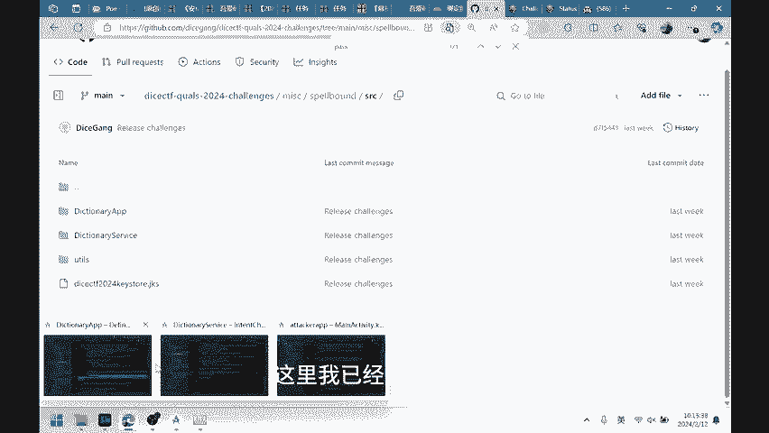

题目提供了两个 Android APK 文件：`dictionary-service.apk` 和 `dictionary-app.apk`。解题者需要编写并提交第三个 APK。

运行环境是一个 Docker 容器，它会安装题目提供的两个 APK 以及解题者提交的 APK。随后，系统会运行解题者的 APK 20 秒，并打印出所有包含特定 Tag（`diceCTF`）的日志。我们的目标就是通过这些日志输出 Flag。

## 应用逻辑分析

上一节我们介绍了题目的基本运行流程，本节中我们来看看两个核心 APK 的内部逻辑。通过分析源码（比赛时需逆向），我们可以理解整个系统的运作方式。

### Dictionary App 分析

`dictionary-app.apk` 是用户界面应用。它的主要功能是启动一个 Activity，并绑定两个来自 `dictionary-service.apk` 的服务。

以下是其核心操作步骤：
1.  主 Activity (`MainActivity`) 中有一个按钮，点击后会启动 `DefinitionActivity`。
2.  `DefinitionActivity` 在创建时，会通过 `Intent` 绑定 `dictionary-service.apk` 中的 `SignatureService`。
3.  绑定成功后，应用会调用 `SignatureService` 的 `sign` 函数为一个随机单词生成签名。
4.  接着，应用会使用这个签名信息构建另一个 `Intent`，去绑定 `dictionary-service.apk` 中的 `DictionaryService`，并查询该单词的定义。

### Dictionary Service 分析

`dictionary-service.apk` 包含两个服务：`SignatureService` 和 `DictionaryService`。

*   **SignatureService**：提供一个基础的签名功能。给定一个字符串（`data`），它会返回一个签名。
*   **DictionaryService**：提供查询单词定义的功能。其核心是一个 `getData` 函数。

`DictionaryService` 的 `getData` 函数逻辑是关键：
```kotlin
fun getData(word: String): String {
    if (word == “flag”) {
        return reflectFlag() // 返回真正的 Flag
    } else {
        return loadDictionary().getDefinition(word) // 返回普通单词的定义
    }
}
```
显然，如果能让 `DictionaryService` 处理输入 `“flag”`，就能获得 Flag。

然而，`DictionaryService` 在 `onBind` 方法中设置了安全检查 (`IntentCheck.isSecure`)：
```kotlin
override fun onBind(intent: Intent?): IBinder {
    if (!IntentCheck.isSecure(intent)) {
        return null // 安全检查失败，拒绝绑定
    }
    return dictionaryBinder
}
```
这个检查会验证调用者的 `Intent`，要求其签名必须由 `SignatureService` 生成，且调用者必须是特定的 `dictionary-app` 应用，同时签名需在有效时间窗口内。这看起来严格限制了只有合法的 `dictionary-app` 才能成功绑定并调用服务。

## 核心漏洞：服务绑定的生命周期

上一节我们看到了严格的安全检查，似乎无法直接让我们的攻击应用绑定 `DictionaryService`。本节中我们来看看如何利用 Android 服务绑定的一个关键特性来绕过它。

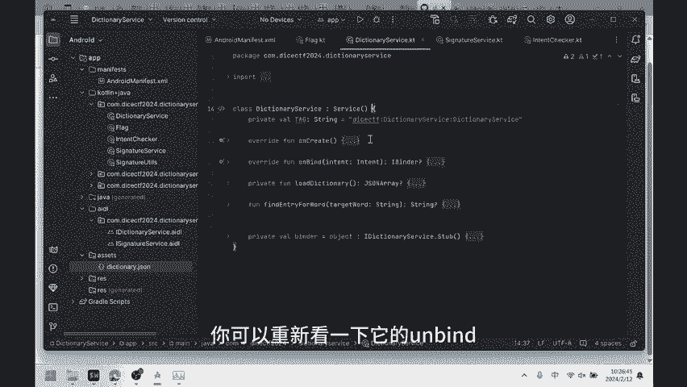

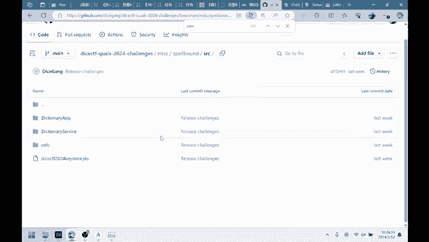

问题的核心在于 `onBind` 方法的调用时机。根据 Android 官方文档，**多个客户端可以同时绑定到一个 Service，但系统只会缓存一个 IBinder 通信通道**。具体来说：

*   当第一个客户端绑定到 Service 时，系统会调用 Service 的 `onBind` 方法来生成一个 `IBinder` 对象。
*   之后，其他客户端绑定到同一个 Service 时，系统会**直接返回之前缓存的 `IBinder` 对象，而不会再次调用 `onBind` 方法**。

这意味着，`IntentCheck.isSecure` 这个安全检查，**只在第一个客户端绑定服务时执行一次**。

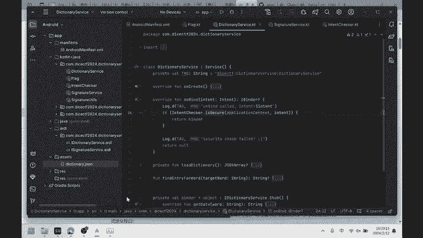

因此，攻击思路变得清晰：
1.  **诱导合法应用先绑定**：让题目提供的、拥有合法身份的 `dictionary-app` 先去正常地绑定一次 `DictionaryService`。由于它的 `Intent` 完全合规，能顺利通过 `onBind` 中的安全检查，使得 `DictionaryService` 进入“已绑定”状态，并缓存了 `IBinder`。
2.  **攻击者随后绑定**：在合法应用完成绑定后，攻击者自己的应用再去绑定同一个 `DictionaryService`。此时，由于 `onBind` 不会再次被调用，安全检查被完全绕过。攻击者可以直接拿到缓存的 `IBinder` 对象，并调用 `getData(“flag”)` 来获取 Flag。

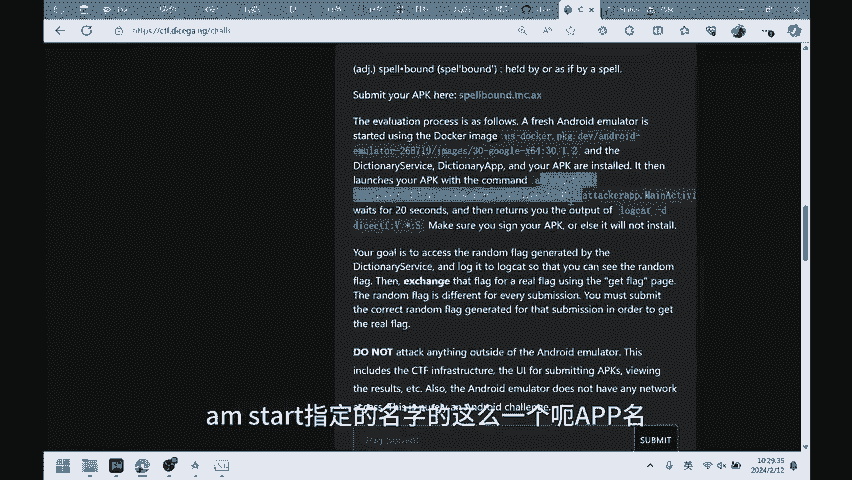

## 攻击应用实现

理解了漏洞原理后，本节我们来看看攻击应用的具体实现。我们的应用需要按顺序执行两个关键操作。

以下是攻击应用 (`MainActivity`) 的核心逻辑步骤：
1.  **启动合法应用**：构造一个 `Intent`，启动 `dictionary-app` 中的 `DefinitionActivity`。这会触发该应用完成正常的签名和服务绑定流程。
    ```kotlin
    val legitimateIntent = Intent().apply {
        setClassName(“com.dicectf.dictionary.app”, “com.dicectf.dictionary.app.DefinitionActivity”)
    }
    startActivity(legitimateIntent)
    ```
2.  **等待并绑定目标服务**：等待一段时间（确保合法应用已完成绑定），然后攻击应用自己去绑定 `DictionaryService`。
    ```kotlin
    // 等待后绑定
    val attackIntent = Intent().apply {
        setClassName(“com.dicectf.dictionary.service”, “com.dicectf.dictionary.service.DictionaryService”)
    }
    bindService(attackIntent, serviceConnection, Context.BIND_AUTO_CREATE)
    ```
3.  **发起攻击查询**：在 `ServiceConnection` 的回调 `onServiceConnected` 中，通过获取到的 `IBinder` 调用 `getData` 方法，并传入参数 `“flag”`。
    ```kotlin
    override fun onServiceConnected(name: ComponentName?, service: IBinder?) {
        val dictionaryService = IDictionaryService.Stub.asInterface(service)
        val flag = dictionaryService.getData(“flag”)
        Log.d(“diceCTF”, “Flag: $flag”) // 输出Flag到日志
    }
    ```
    注意，为了调用 `DictionaryService` 的接口，需要将其 AIDL 文件复制到攻击项目中。

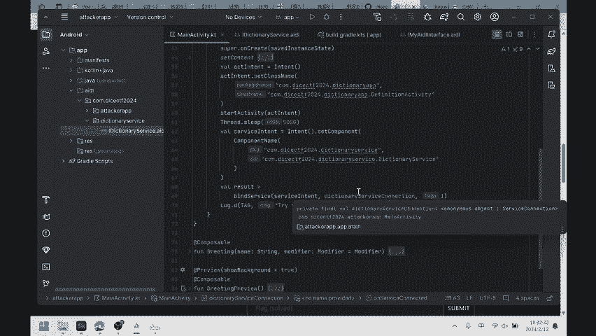

## 总结与漏洞修复

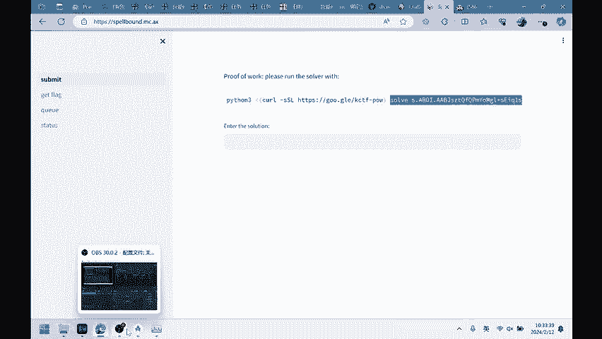

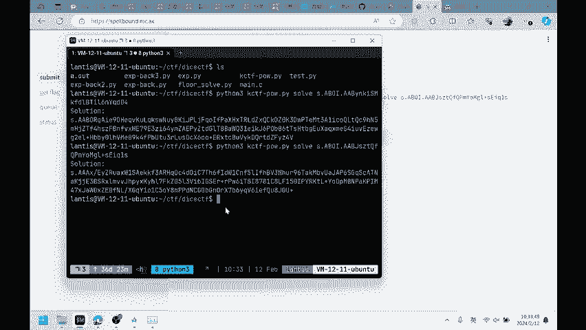

本节课我们一起学习了 DiceCTF 2023 “spellbound” 题目的解法。我们分析了两个 APK 的交互逻辑，发现了 `DictionaryService` 中通过 `onBind` 进行意图（Intent）安全检查的机制。

**核心考点**是 Android 服务绑定的生命周期特性：`onBind` 方法仅在首次绑定时被调用，后续绑定会直接使用缓存的 `IBinder`。题目将安全检查放在 `onBind` 中，导致其仅在首次绑定时生效，攻击者可以通过让合法应用先完成绑定，从而绕过检查。

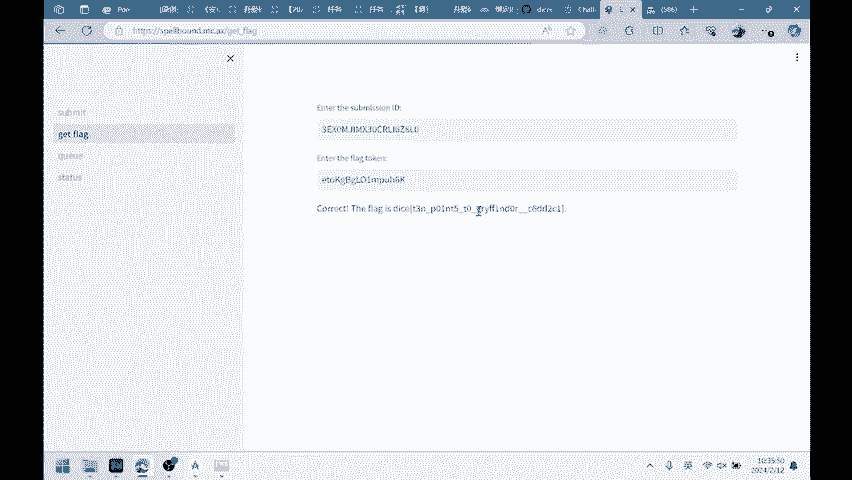

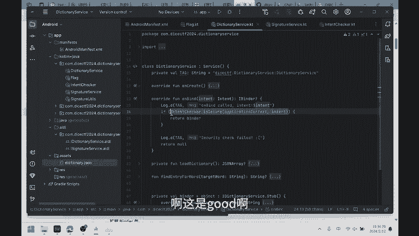

**漏洞修复建议**：不应将关键的安全检查仅放在 `onBind` 中。更安全的做法是在 Service 对外暴露的每个具体方法（例如 `getData`）内部，都进行调用者权限或身份的校验，确保每次调用都是安全的。例如，可以使用 `Binder.getCallingUid()` 或 `Binder.getCallingPid()` 来验证调用者身份。